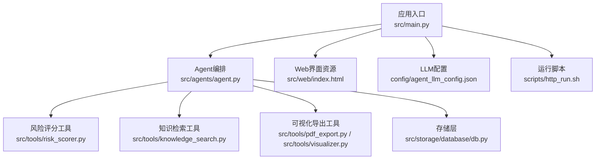
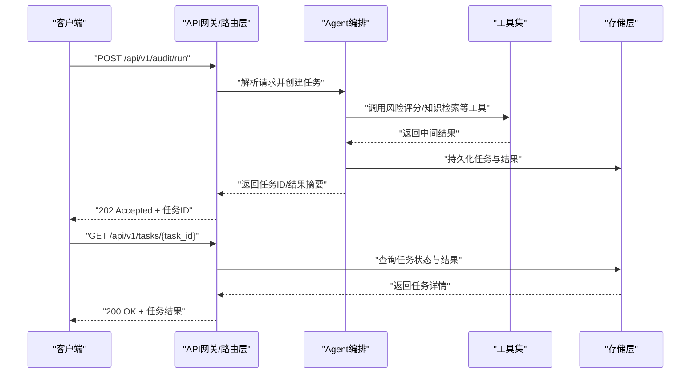
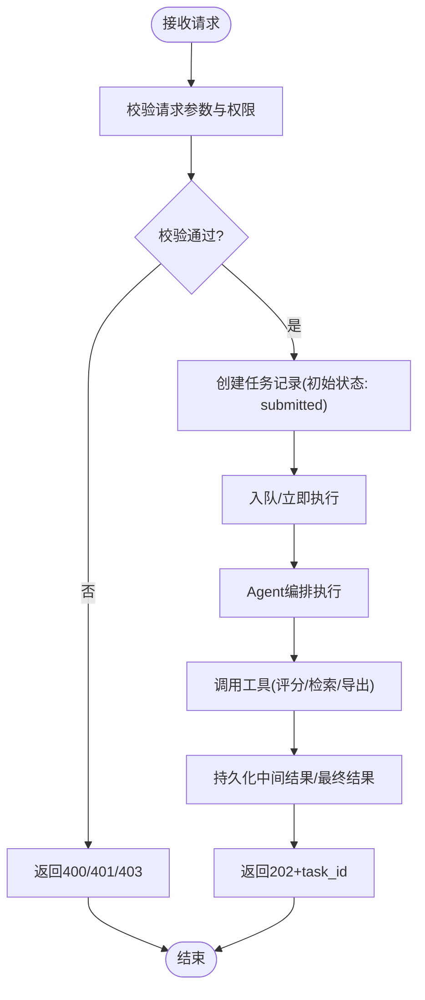
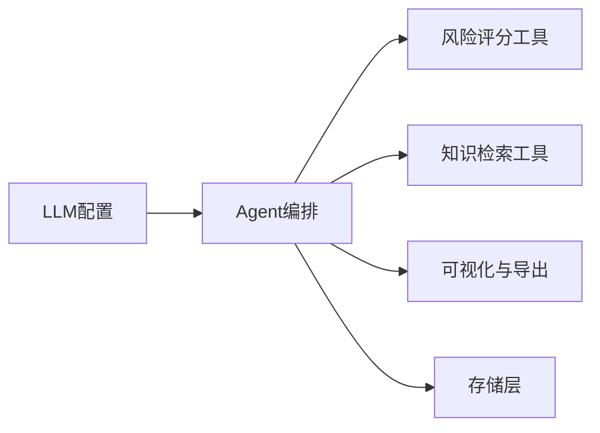
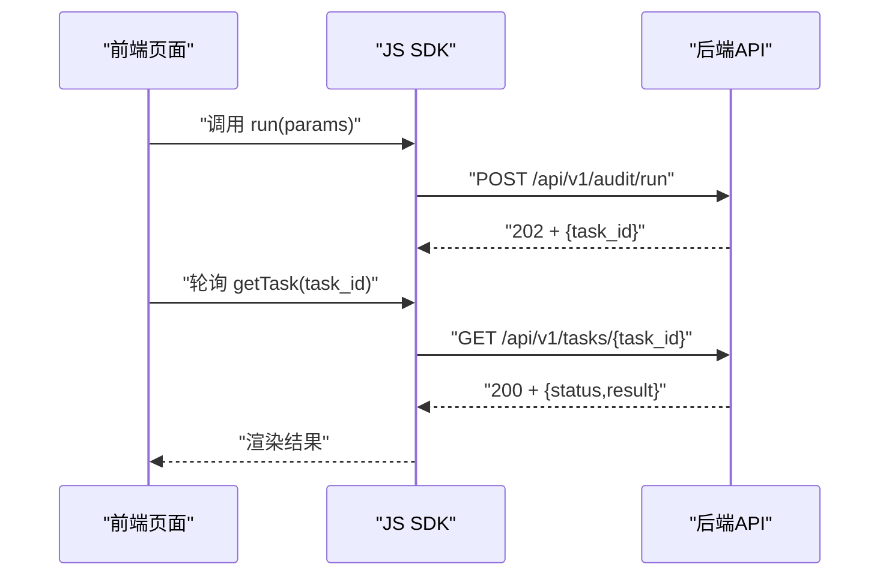

# API接口文档

<cite>
**本文档引用的文件**   
- [src/main.py](file://src/main.py)
- [src/web/index.html](file://src/web/index.html)
- [src/agents/agent.py](file://src/agents/agent.py)
- [src/tools/risk_scorer.py](file://src/tools/risk_scorer.py)
- [src/storage/database/db.py](file://src/storage/database/db.py)
- [config/agent_llm_config.json](file://config/agent_llm_config.json)
- [scripts/http_run.sh](file://scripts/http_run.sh)
- [pyproject.toml](file://pyproject.toml)
</cite>

## 目录
1. [简介](#简介)
2. [项目结构](#项目结构)
3. [核心组件](#核心组件)
4. [架构总览](#架构总览)
5. [详细组件分析](#详细组件分析)
6. [依赖关系分析](#依赖关系分析)
7. [性能考虑](#性能考虑)
8. [故障排查指南](#故障排查指南)
9. [结论](#结论)
10. [附录](#附录)

## 简介
本文件为“智能审计风险识别系统”的API接口文档，面向客户端开发者与集成方。文档涵盖RESTful端点、认证与安全、请求/响应规范、错误处理、前端调用方式、版本管理与兼容性、测试与调试方法以及集成最佳实践。

说明：当前仓库未包含显式的HTTP路由定义或Web框架代码，因此本节提供基于现有模块的职责划分与数据流说明，并给出建议的API设计草案与集成指引。实际实现需结合后端服务（如FastAPI/Flask）进行扩展。

## 项目结构
系统采用模块化组织，核心能力包括：
- 应用入口与启动脚本
- Web界面资源
- 审计Agent与工具链
- 存储层（数据库、对象存储、内存）
- 配置与脚本

图示来源
- [src/main.py](file://src/main.py)
- [src/agents/agent.py](file://src/agents/agent.py)
- [src/tools/risk_scorer.py](file://src/tools/risk_scorer.py)
- [src/storage/database/db.py](file://src/storage/database/db.py)
- [config/agent_llm_config.json](file://config/agent_llm_config.json)
- [scripts/http_run.sh](file://scripts/http_run.sh)

章节来源
- [src/main.py](file://src/main.py)
- [src/web/index.html](file://src/web/index.html)
- [src/agents/agent.py](file://src/agents/agent.py)
- [src/tools/risk_scorer.py](file://src/tools/risk_scorer.py)
- [src/storage/database/db.py](file://src/storage/database/db.py)
- [config/agent_llm_config.json](file://config/agent_llm_config.json)
- [scripts/http_run.sh](file://scripts/http_run.sh)

## 核心组件
- Agent编排：负责调度审计流程、组合工具调用、管理上下文与状态。
- 风险评分工具：对输入财务/审计数据进行指标计算与风险打分。
- 知识检索工具：基于本地知识库进行案例与规则检索。
- 可视化与导出：生成图表与PDF报告。
- 存储层：持久化结果、缓存中间态、对接外部对象存储。
- 配置：LLM相关参数与模型选择。

章节来源
- [src/agents/agent.py](file://src/agents/agent.py)
- [src/tools/risk_scorer.py](file://src/tools/risk_scorer.py)
- [src/tools/knowledge_search.py](file://src/tools/knowledge_search.py)
- [src/tools/pdf_export.py](file://src/tools/pdf_export.py)
- [src/tools/visualizer.py](file://src/tools/visualizer.py)
- [src/storage/database/db.py](file://src/storage/database/db.py)
- [config/agent_llm_config.json](file://config/agent_llm_config.json)

## 架构总览
下图展示从HTTP请求到Agent执行、工具调用与存储落盘的端到端流程。该图为概念性示意，用于指导后续API与服务层的落地实现。

图示来源
- [src/agents/agent.py](file://src/agents/agent.py)
- [src/tools/risk_scorer.py](file://src/tools/risk_scorer.py)
- [src/storage/database/db.py](file://src/storage/database/db.py)

## 详细组件分析

### 审计任务提交与查询（建议API）
- 提交审计任务
  - 方法：POST
  - URL：/api/v1/audit/run
  - 请求头：
    - Content-Type: application/json
    - Authorization: Bearer <token>
  - 请求体字段：
    - task_type: string，枚举值 audit_risk_score
    - params: object，包含待分析的数据与策略
      - data_source: string，枚举值 file_upload | api_payload
      - payload: object，当data_source=api_payload时传入结构化数据
      - strategy: object，可选，包含阈值、权重等策略项
    - options: object，可选，包含是否异步、回调URL等
  - 响应：
    - 202 Accepted：{ "task_id": "string", "status": "submitted" }
    - 400 Bad Request：参数校验失败
    - 401 Unauthorized：认证失败
    - 403 Forbidden：权限不足
    - 500 Internal Server Error：服务端异常
- 查询任务状态与结果
  - 方法：GET
  - URL：/api/v1/tasks/{task_id}
  - 请求头：Authorization: Bearer <token>
  - 响应：
    - 200 OK：{ "task_id": "string", "status": "completed|running|failed", "result": object|null, "error": string|null }
    - 404 Not Found：任务不存在
    - 401/403：认证/鉴权失败

图示来源
- [src/agents/agent.py](file://src/agents/agent.py)
- [src/tools/risk_scorer.py](file://src/tools/risk_scorer.py)
- [src/storage/database/db.py](file://src/storage/database/db.py)

章节来源
- [src/agents/agent.py](file://src/agents/agent.py)
- [src/tools/risk_scorer.py](file://src/tools/risk_scorer.py)
- [src/storage/database/db.py](file://src/storage/database/db.py)

### 风险评分工具（内部接口）
- 职责：根据输入数据与策略计算风险分数与明细。
- 输入：结构化财务/审计数据、评分策略（阈值、权重）。
- 输出：风险总分、维度分、关键风险点与建议。
- 复杂度：O(n) 遍历数据项；可通过索引与批处理优化。
- 错误处理：参数缺失、类型不匹配、数值越界等应返回明确错误码与消息。

章节来源
- [src/tools/risk_scorer.py](file://src/tools/risk_scorer.py)

### 知识检索工具（内部接口）
- 职责：基于本地知识库检索相关案例与规则，辅助决策。
- 输入：关键词、行业标签、时间范围等。
- 输出：匹配案例列表、相似度得分、引用来源。
- 性能：可引入倒排索引与缓存提升检索速度。

章节来源
- [src/tools/knowledge_search.py](file://src/tools/knowledge_search.py)

### 可视化与导出（内部接口）
- 职责：生成图表与PDF报告，支持下载与预览。
- 输入：任务结果、模板ID、渲染选项。
- 输出：文件URL或二进制流。
- 注意：大文件导出需分页/异步处理与限流。

章节来源
- [src/tools/pdf_export.py](file://src/tools/pdf_export.py)
- [src/tools/visualizer.py](file://src/tools/visualizer.py)

### 存储层（数据库）
- 职责：任务元数据、中间结果、最终结果的持久化。
- 操作：创建/更新/查询任务、批量导出、清理过期数据。
- 事务：长流程任务建议使用事务保证一致性。
- 索引：按task_id、status、created_at建立索引以提升查询效率。

章节来源
- [src/storage/database/db.py](file://src/storage/database/db.py)

### LLM配置
- 用途：控制模型选择、温度、最大长度等推理参数。
- 安全：敏感信息应从环境变量注入，避免硬编码。
- 版本：配置变更需遵循向后兼容策略。

章节来源
- [config/agent_llm_config.json](file://config/agent_llm_config.json)

## 依赖关系分析
- 模块耦合：
  - Agent编排依赖工具集与存储层，形成松耦合的插件式架构。
  - 工具之间尽量无直接依赖，通过统一输入输出契约交互。
- 外部依赖：
  - LLM服务、对象存储、数据库驱动。
- 潜在循环依赖：
  - 应避免工具间互相调用导致循环，必要时引入事件总线或消息队列解耦。

图示来源
- [src/agents/agent.py](file://src/agents/agent.py)
- [src/tools/risk_scorer.py](file://src/tools/risk_scorer.py)
- [src/tools/knowledge_search.py](file://src/tools/knowledge_search.py)
- [src/tools/pdf_export.py](file://src/tools/pdf_export.py)
- [src/tools/visualizer.py](file://src/tools/visualizer.py)
- [src/storage/database/db.py](file://src/storage/database/db.py)
- [config/agent_llm_config.json](file://config/agent_llm_config.json)

章节来源
- [src/agents/agent.py](file://src/agents/agent.py)
- [src/tools/risk_scorer.py](file://src/tools/risk_scorer.py)
- [src/tools/knowledge_search.py](file://src/tools/knowledge_search.py)
- [src/tools/pdf_export.py](file://src/tools/pdf_export.py)
- [src/tools/visualizer.py](file://src/tools/visualizer.py)
- [src/storage/database/db.py](file://src/storage/database/db.py)
- [config/agent_llm_config.json](file://config/agent_llm_config.json)

## 性能考虑
- 并发与队列：使用消息队列或线程池处理高并发任务，避免阻塞主线程。
- 缓存：热点知识与中间结果缓存，降低重复计算与IO开销。
- 分页与增量：大数据量导出与查询采用分页与增量拉取。
- 资源限制：对LLM调用与文件导出设置超时与速率限制。
- 监控：接入APM与日志聚合，追踪慢查询与异常路径。

## 故障排查指南
- 常见问题定位：
  - 参数校验失败：检查请求体结构与必填字段。
  - 认证失败：确认Token有效性与权限范围。
  - 任务失败：查看任务日志与错误堆栈，定位具体工具或存储层问题。
- 调试方法：
  - 启用调试日志与Trace ID，便于跨服务追踪。
  - 使用本地脚本快速复现问题。
- 健康检查：
  - 提供健康检查端点，返回服务可用性与依赖状态。

章节来源
- [scripts/http_run.sh](file://scripts/http_run.sh)

## 结论
本文档提供了智能审计风险识别系统的API设计与集成指南。建议在实现阶段补充明确的HTTP路由、鉴权中间件、错误码字典与SDK封装，确保前后端协作顺畅与系统稳定可靠。

## 附录

### 认证授权机制与安全措施
- 认证：
  - 推荐JWT Bearer Token，请求头携带Authorization: Bearer <token>。
  - Token有效期与刷新策略需在网关或服务层统一实现。
- 授权：
  - 基于角色的访问控制（RBAC），区分管理员、审计员、只读用户。
- 传输安全：
  - 强制HTTPS，启用HSTS与TLS 1.2+。
- 输入校验与防护：
  - 严格JSON Schema校验，防注入与XSS。
  - 速率限制与IP白名单。
- 审计与合规：
  - 记录关键操作日志，保留必要审计轨迹。

### 错误处理机制与错误代码
- 通用错误响应格式：
  - { "code": "string", "message": "string", "details": object|null }
- 常见错误码：
  - 400：参数校验失败
  - 401：未认证
  - 403：权限不足
  - 404：资源不存在
  - 422：业务校验失败
  - 429：请求过于频繁
  - 500：服务端异常
  - 503：服务不可用
- 建议：
  - 错误码全局唯一，附带人类可读消息与调试细节。
  - 对外仅暴露最小必要信息，避免泄露内部实现。

### 前端调用方式与JavaScript SDK
- 前端调用：
  - 使用Fetch或Axios发起HTTP请求，统一封装Base URL与默认头。
  - 在请求拦截器中注入Token与Trace ID。
- SDK建议：
  - 提供命名空间与方法映射，如Audit.run(params)、Audit.getTask(taskId)。
  - 内置重试、退避与错误转换逻辑。
  - 支持Promise与async/await。

[此图为概念性流程图，无需图示来源]

### API版本管理与向后兼容
- 版本策略：
  - URL前缀带版本号，如/api/v1/...
  - 重大变更升级版本，小改动保持兼容。
- 兼容性：
  - 新增字段默认空值，删除字段标记废弃并保留一段时间。
  - 行为变更需提供迁移指南与灰度发布。

### 测试工具与调试方法
- 单元测试：针对工具函数与数据处理逻辑编写用例。
- 集成测试：模拟Agent与存储层交互，验证端到端流程。
- 压测：使用负载工具评估吞吐与延迟。
- 调试：
  - 本地启动脚本与开发环境配置。
  - 日志级别与采样率调整。

章节来源
- [pyproject.toml](file://pyproject.toml)
- [scripts/http_run.sh](file://scripts/http_run.sh)

### 客户端集成指南与最佳实践
- 初始化：
  - 配置Base URL、超时、重试次数。
  - 安全地注入Token，避免硬编码。
- 请求构造：
  - 严格遵循请求体Schema，避免多余字段。
  - 使用幂等键防止重复提交。
- 错误处理：
  - 捕获网络与业务错误，提示用户友好信息。
  - 对429与503实施指数退避重试。
- 性能优化：
  - 并行请求与结果合并。
  - 按需加载与分页展示。
- 安全实践：
  - 最小权限原则，按需申请角色。
  - 定期轮换Token与密钥。