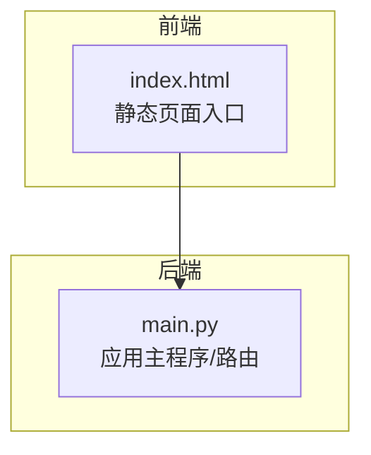
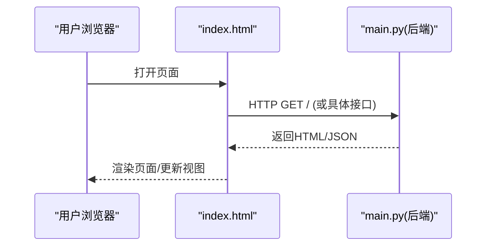
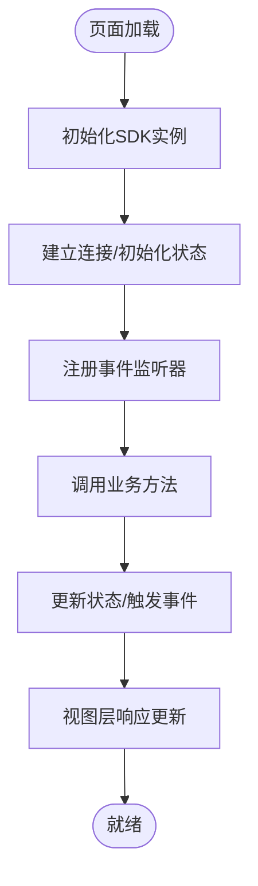
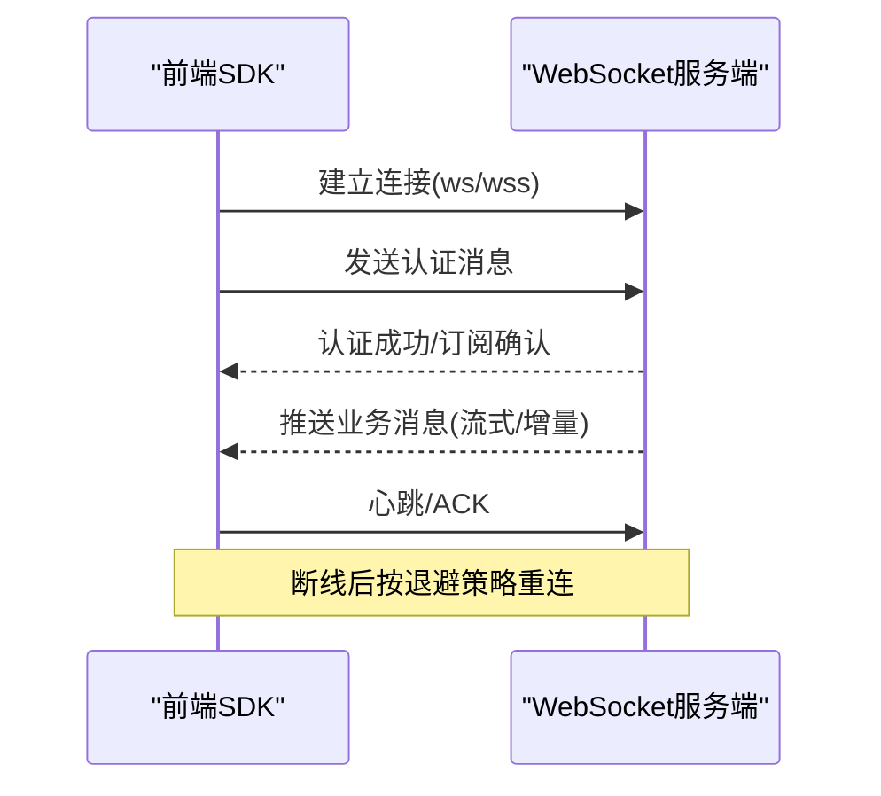
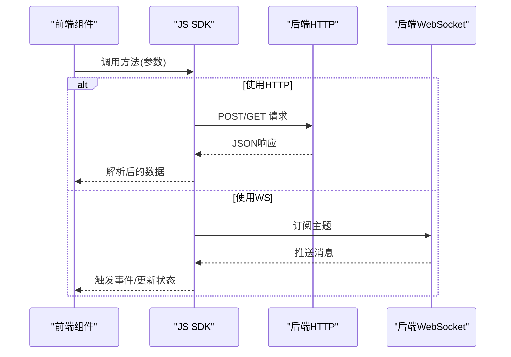
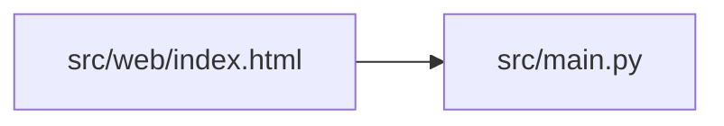

# Web界面API

<cite>
**本文引用的文件**   
- [src/web/index.html](file://src/web/index.html)
- [src/main.py](file://src/main.py)
</cite>

## 目录
1. [简介](#简介)
2. [项目结构](#项目结构)
3. [核心组件](#核心组件)
4. [架构总览](#架构总览)
5. [详细组件分析](#详细组件分析)
6. [依赖分析](#依赖分析)
7. [性能考虑](#性能考虑)
8. [故障排查指南](#故障排查指南)
9. [结论](#结论)
10. [附录](#附录)

## 简介
本文件面向Web前端与后端集成，聚焦于以下目标：
- 说明前端JavaScript SDK的使用方式、事件监听机制与状态管理
- 描述WebSocket实时通信协议与消息格式
- 提供前端组件与后端服务的集成示例
- 说明跨域资源共享(CORS)配置与安全策略
- 描述前端缓存策略与本地存储方案
- 包含移动端适配与响应式设计支持
- 提供浏览器兼容性说明与降级处理方案
- 说明前端性能监控与错误上报机制

本项目为审计风险识别系统的一部分，当前仓库中已包含一个最小可运行的Web入口页面以及后端主程序。由于仓库未包含完整的SDK源码与WebSocket实现，本文在“概念性”部分给出通用实践建议，并在“代码级”部分基于现有文件进行说明。

## 项目结构
与Web界面相关的核心文件如下：
- src/web/index.html：前端静态页面入口（HTML）
- src/main.py：后端主程序（Python），负责HTTP路由与服务启动

图表来源
- [src/web/index.html](file://src/web/index.html)
- [src/main.py](file://src/main.py)

章节来源
- [src/web/index.html](file://src/web/index.html)
- [src/main.py](file://src/main.py)

## 核心组件
- 前端入口页面
  - 职责：加载业务脚本、初始化UI、发起网络请求、展示结果
  - 位置：[src/web/index.html](file://src/web/index.html)
- 后端主程序
  - 职责：注册HTTP接口、处理请求、返回JSON数据、承载可能的WebSocket服务
  - 位置：[src/main.py](file://src/main.py)

章节来源
- [src/web/index.html](file://src/web/index.html)
- [src/main.py](file://src/main.py)

## 架构总览
下图展示了前端页面与后端服务的基本交互关系。若后续引入WebSocket，则会在该基础上增加双向通道。

图表来源
- [src/web/index.html](file://src/web/index.html)
- [src/main.py](file://src/main.py)

## 详细组件分析

### 前端入口页面（index.html）
- 作用
  - 作为静态资源入口，组织DOM结构与脚本加载顺序
  - 可作为引入JavaScript SDK的挂载点
- 关键关注点
  - 脚本加载时机与顺序
  - 基础样式与布局容器
  - 与后端接口的初始调用（如获取页面所需数据）

章节来源
- [src/web/index.html](file://src/web/index.html)

### 后端主程序（main.py）
- 作用
  - 定义HTTP路由与请求处理逻辑
  - 统一返回JSON格式数据
  - 可扩展为WebSocket服务端（若需要实时通信）
- 关键关注点
  - 路由命名与版本化策略
  - 请求参数校验与错误码规范
  - 日志记录与异常捕获

章节来源
- [src/main.py](file://src/main.py)

### JavaScript SDK使用指南（概念性）
说明如何在前端集成并调用SDK，包括初始化、方法调用、事件监听与状态管理。以下为通用实践建议（非仓库内具体实现）：
- 初始化
  - 在页面加载完成后创建SDK实例，传入后端地址、鉴权信息等
- 方法调用
  - 封装REST API为异步方法，返回Promise或回调
  - 对失败场景进行重试与退避
- 事件监听
  - 提供自定义事件总线，便于组件间解耦
  - 典型事件：连接建立、断开、重连、数据更新、错误
- 状态管理
  - 集中维护全局状态（如用户信息、会话令牌、任务进度）
  - 通过发布/订阅模式通知视图层更新

[本节为概念性说明，不直接分析具体文件]

### WebSocket实时通信协议与消息格式（概念性）
当需要实时推送时，可在后端扩展WebSocket能力，前端通过SDK建立长连接并订阅主题。

- 连接建立
  - 客户端发起ws/wss连接
  - 服务端完成握手并分配会话ID
- 认证与鉴权
  - 首条消息携带token或会话标识
  - 服务端校验通过后允许订阅
- 消息格式（建议）
  - 统一JSON结构，包含：类型、时间戳、载荷、追踪ID
  - 区分控制消息与业务消息
- 断线重连
  - 指数退避策略
  - 心跳保活与超时检测

[本节为概念性说明，不直接分析具体文件]

### 前端组件与后端服务集成示例（概念性）
- REST集成
  - 使用fetch或SDK封装的方法发起请求
  - 统一拦截器处理鉴权头、错误码与重试
- 实时集成
  - 通过SDK订阅频道，将消息映射到组件状态
  - 对高频消息做节流/合并，避免频繁重绘

[本节为概念性说明，不直接分析具体文件]

### CORS配置与安全策略（概念性）
- CORS
  - 明确允许的源、方法与头部
  - 生产环境仅开放必要域名
- 安全
  - 启用HTTPS与HSTS
  - 设置Cookie的SameSite与Secure属性
  - 对输入输出进行校验与转义，防范XSS/CSRF
  - 敏感操作二次确认与速率限制

[本节为概念性说明，不直接分析具体文件]

### 前端缓存策略与本地存储（概念性）
- 缓存
  - 利用HTTP缓存头与Service Worker离线缓存
  - 对热点数据进行内存缓存与去抖
- 本地存储
  - 使用localStorage/sessionStorage保存轻量配置
  - 对敏感信息避免明文存储，必要时加密

[本节为概念性说明，不直接分析具体文件]

### 移动端适配与响应式设计（概念性）
- 采用弹性布局与媒体查询
- 触控友好的交互设计
- 针对小屏优化字体、间距与点击区域

[本节为概念性说明，不直接分析具体文件]

### 浏览器兼容性与降级方案（概念性）
- 目标浏览器范围与特性检测
- 对不支持的功能提供Polyfill或降级路径
- 渐进增强：核心功能在所有目标浏览器可用，高级特性按需启用

[本节为概念性说明，不直接分析具体文件]

### 前端性能监控与错误上报（概念性）
- 性能指标
  - 首屏时间、交互延迟、长任务占比
- 错误上报
  - 捕获未处理异常与Promise拒绝
  - 上报堆栈、用户代理、页面URL与上下文
- 采样与限流
  - 对高频事件进行采样上报，避免影响体验

[本节为概念性说明，不直接分析具体文件]

## 依赖分析
从现有仓库可见，前端静态页面与后端主程序存在直接依赖关系。

图表来源
- [src/web/index.html](file://src/web/index.html)
- [src/main.py](file://src/main.py)

章节来源
- [src/web/index.html](file://src/web/index.html)
- [src/main.py](file://src/main.py)

## 性能考虑
- 减少不必要的重排与重绘
- 合理使用懒加载与虚拟列表
- 对大对象进行序列化优化
- 对高频事件进行节流/防抖
- 合理设置缓存策略与CDN

[本节为通用指导，不直接分析具体文件]

## 故障排查指南
- 常见问题定位
  - 检查网络请求是否被CORS拦截
  - 验证鉴权头是否正确传递
  - 查看控制台错误与网络面板详情
- 日志与追踪
  - 在后端记录请求ID与关键步骤
  - 在前端上报错误上下文与复现步骤
- 回滚与恢复
  - 保持向后兼容的接口版本
  - 灰度发布与快速回滚策略

[本节为通用指导，不直接分析具体文件]

## 结论
当前仓库提供了Web入口页面与后端主程序的骨架。对于完整的Web界面API文档，建议在现有基础上补充：
- 前端JavaScript SDK源码与类型定义
- WebSocket服务端实现与消息协议规范
- CORS与安全策略的具体配置
- 缓存、本地存储与监控上报的实现细节

以上建议均已在本文的概念性章节中给出参考实践，便于后续落地实施。

## 附录
- 术语
  - CORS：跨域资源共享
  - SDK：软件开发工具包
  - WebSocket：全双工通信协议
- 相关入口
  - 前端入口：[src/web/index.html](file://src/web/index.html)
  - 后端主程序：[src/main.py](file://src/main.py)