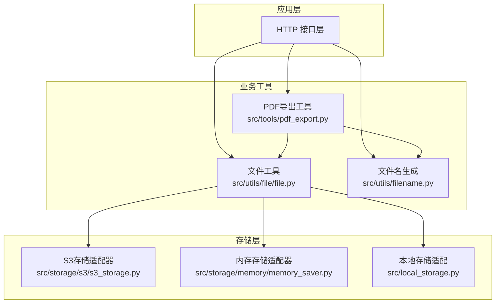
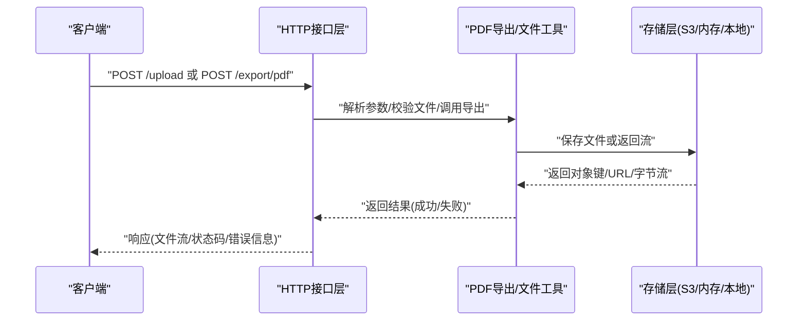
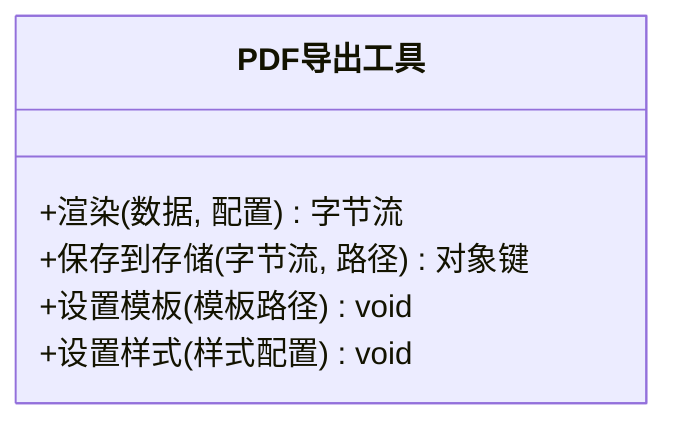
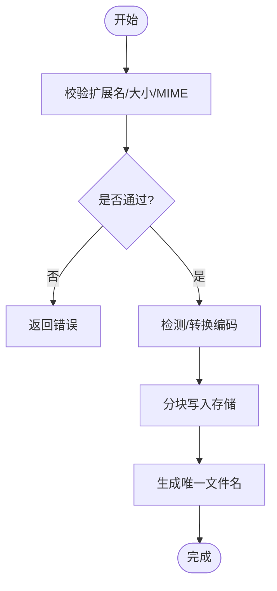
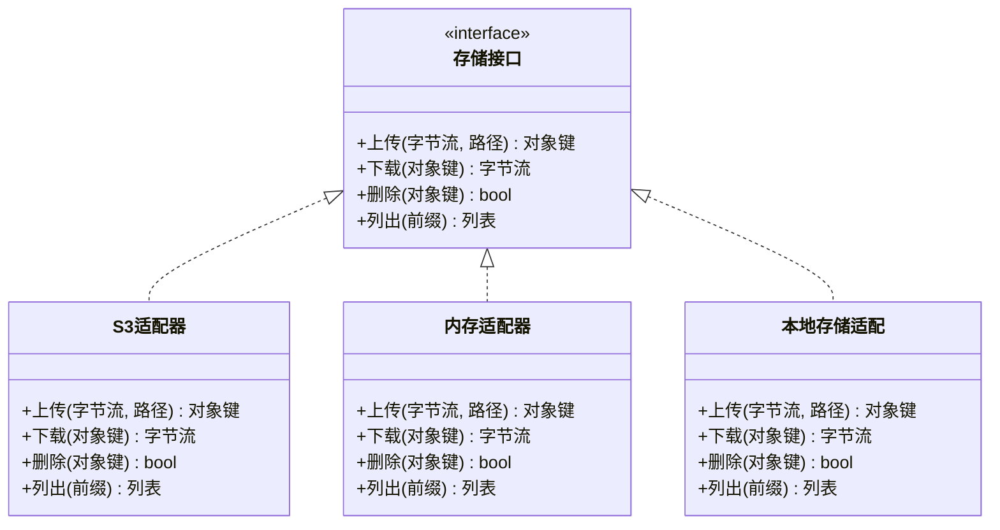
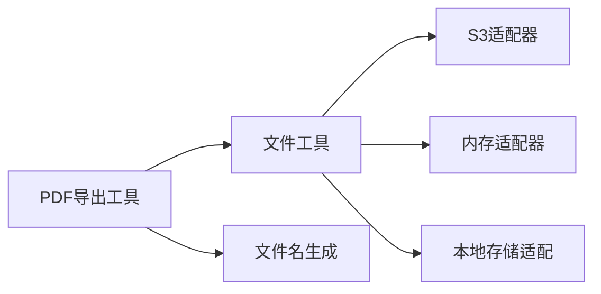

# 文件处理API

<cite>
**本文引用的文件**   
- [src/tools/pdf_export.py](file://src/tools/pdf_export.py)
- [src/utils/file/file.py](file://src/utils/file/file.py)
- [src/utils/filename.py](file://src/utils/filename.py)
- [src/storage/s3/s3_storage.py](file://src/storage/s3/s3_storage.py)
- [src/storage/memory/memory_saver.py](file://src/storage/memory/memory_saver.py)
- [src/local_storage.py](file://src/local_storage.py)
- [pyproject.toml](file://pyproject.toml)
</cite>

## 目录
1. [简介](#简介)
2. [项目结构](#项目结构)
3. [核心组件](#核心组件)
4. [架构总览](#架构总览)
5. [详细组件分析](#详细组件分析)
6. [依赖关系分析](#依赖关系分析)
7. [性能考虑](#性能考虑)
8. [故障排查指南](#故障排查指南)
9. [结论](#结论)
10. [附录](#附录)

## 简介
本文件面向“财务报表文件上传、PDF报告导出、文件格式转换”等与文件处理相关的接口，提供从使用方式到实现细节的完整说明。文档涵盖：
- 支持的文件格式、大小限制与编码要求
- 多部分表单数据与JSON数据格式示例
- 下载接口的流式传输与分页机制
- 存储路径规则与命名约定
- 文件类型验证、安全扫描与病毒检测集成建议
- 大文件处理的优化建议与超时配置

## 项目结构
与文件处理相关的关键代码位于以下模块：
- PDF导出工具：用于将报表数据转换为PDF并返回或落盘
- 文件工具：封装通用文件操作（读取、写入、校验、重命名等）
- 文件名生成：统一命名约定与时间戳/哈希策略
- 存储层：S3对象存储与内存存储两种后端
- 本地存储适配：在本地磁盘上模拟对象存储行为，便于开发调试

图表来源
- [src/tools/pdf_export.py](file://src/tools/pdf_export.py)
- [src/utils/file/file.py](file://src/utils/file/file.py)
- [src/utils/filename.py](file://src/utils/filename.py)
- [src/storage/s3/s3_storage.py](file://src/storage/s3/s3_storage.py)
- [src/storage/memory/memory_saver.py](file://src/storage/memory/memory_saver.py)
- [src/local_storage.py](file://src/local_storage.py)

章节来源
- [src/tools/pdf_export.py](file://src/tools/pdf_export.py)
- [src/utils/file/file.py](file://src/utils/file/file.py)
- [src/utils/filename.py](file://src/utils/filename.py)
- [src/storage/s3/s3_storage.py](file://src/storage/s3/s3_storage.py)
- [src/storage/memory/memory_saver.py](file://src/storage/memory/memory_saver.py)
- [src/local_storage.py](file://src/local_storage.py)

## 核心组件
- PDF导出工具
  - 职责：接收结构化数据，渲染为PDF；可选择直接返回字节流或持久化到存储后端
  - 关键能力：模板渲染、页面布局、字体与编码处理、分块输出
- 文件工具
  - 职责：统一的文件读写、校验、重命名、路径拼接、MIME类型推断
  - 关键能力：扩展名校验、大小限制、编码检测与转换、分块I/O
- 文件名生成
  - 职责：基于时间戳、业务标识与随机串生成唯一文件名，避免冲突与注入
- 存储层
  - S3适配器：对接云对象存储，支持分片上传、断点续传、元数据管理
  - 内存适配器：进程内缓存，适合测试与短生命周期任务
  - 本地存储适配：将对象存储接口映射到本地文件系统，便于本地运行

章节来源
- [src/tools/pdf_export.py](file://src/tools/pdf_export.py)
- [src/utils/file/file.py](file://src/utils/file/file.py)
- [src/utils/filename.py](file://src/utils/filename.py)
- [src/storage/s3/s3_storage.py](file://src/storage/s3/s3_storage.py)
- [src/storage/memory/memory_saver.py](file://src/storage/memory/memory_saver.py)
- [src/local_storage.py](file://src/local_storage.py)

## 架构总览
下图展示了从请求进入、文件处理到存储落盘的端到端流程。

图表来源
- [src/tools/pdf_export.py](file://src/tools/pdf_export.py)
- [src/utils/file/file.py](file://src/utils/file/file.py)
- [src/storage/s3/s3_storage.py](file://src/storage/s3/s3_storage.py)
- [src/storage/memory/memory_saver.py](file://src/storage/memory/memory_saver.py)
- [src/local_storage.py](file://src/local_storage.py)

## 详细组件分析

### 组件A：PDF导出工具
- 功能要点
  - 输入：结构化报表数据、样式配置、可选模板
  - 输出：PDF字节流或持久化后的对象键
  - 特性：支持中文字体嵌入、分页、页眉页脚、表格自适应
- 关键方法
  - 渲染：根据数据与模板生成PDF内容
  - 输出：选择直接返回流或写入存储
  - 错误：对模板缺失、数据不完整、渲染异常进行统一处理
- 复杂度
  - 渲染时间与数据规模近似线性；分页与表格布局可能引入额外开销
- 优化建议
  - 对大数据集采用分批渲染与流式写入
  - 预加载字体与资源，减少重复IO

图表来源
- [src/tools/pdf_export.py](file://src/tools/pdf_export.py)

章节来源
- [src/tools/pdf_export.py](file://src/tools/pdf_export.py)

### 组件B：文件工具与文件名生成
- 文件工具
  - 校验：扩展名白名单、MIME类型推断、大小上限、编码检测
  - 读写：支持分块读取/写入，避免一次性加载大文件
  - 转换：文本编码转换（如UTF-8）、二进制复制
- 文件名生成
  - 策略：时间戳+业务ID+随机后缀，保证唯一性与可读性
  - 安全：过滤非法字符，防止路径穿越

图表来源
- [src/utils/file/file.py](file://src/utils/file/file.py)
- [src/utils/filename.py](file://src/utils/filename.py)

章节来源
- [src/utils/file/file.py](file://src/utils/file/file.py)
- [src/utils/filename.py](file://src/utils/filename.py)

### 组件C：存储层（S3/内存/本地）
- S3适配器
  - 能力：分片上传、断点续传、元数据管理、访问控制
  - 适用：生产环境、海量文件、高可用
- 内存适配器
  - 能力：进程内缓存，快速读写
  - 适用：单元测试、临时任务
- 本地存储适配
  - 能力：将对象存储接口映射到本地目录
  - 适用：本地开发与调试

图表来源
- [src/storage/s3/s3_storage.py](file://src/storage/s3/s3_storage.py)
- [src/storage/memory/memory_saver.py](file://src/storage/memory/memory_saver.py)
- [src/local_storage.py](file://src/local_storage.py)

章节来源
- [src/storage/s3/s3_storage.py](file://src/storage/s3/s3_storage.py)
- [src/storage/memory/memory_saver.py](file://src/storage/memory/memory_saver.py)
- [src/local_storage.py](file://src/local_storage.py)

## 依赖关系分析
- 内部依赖
  - PDF导出工具依赖文件工具与文件名生成
  - 文件工具依赖具体存储适配器
- 外部依赖
  - S3 SDK、PDF渲染库、编码检测库等
- 耦合与内聚
  - 存储层抽象良好，便于替换后端
  - 文件工具集中了通用逻辑，提升复用性

图表来源
- [src/tools/pdf_export.py](file://src/tools/pdf_export.py)
- [src/utils/file/file.py](file://src/utils/file/file.py)
- [src/utils/filename.py](file://src/utils/filename.py)
- [src/storage/s3/s3_storage.py](file://src/storage/s3/s3_storage.py)
- [src/storage/memory/memory_saver.py](file://src/storage/memory/memory_saver.py)
- [src/local_storage.py](file://src/local_storage.py)

章节来源
- [pyproject.toml](file://pyproject.toml)

## 性能考虑
- 大文件处理
  - 采用分块上传/下载，避免一次性加载至内存
  - 使用流式写入PDF，降低峰值内存占用
- 并发与队列
  - 对耗时任务（如大批量PDF导出）引入异步队列与重试机制
- 超时配置
  - 合理设置网关、服务与存储SDK的超时时间，避免长连接挂起
- 缓存与压缩
  - 对静态资源（字体、模板）进行缓存
  - 对可压缩文件启用GZIP/Deflate传输

[本节为通用指导，不直接分析具体文件]

## 故障排查指南
- 常见问题
  - 文件大小超限：检查上传限制与分片策略
  - 编码错误：确认源文件编码与目标编码一致
  - 存储不可用：检查S3凭据、网络连通性与权限
- 日志与追踪
  - 记录关键步骤（校验、渲染、上传）与错误堆栈
  - 为每次请求分配唯一追踪ID，便于跨层定位问题

章节来源
- [src/utils/file/file.py](file://src/utils/file/file.py)
- [src/storage/s3/s3_storage.py](file://src/storage/s3/s3_storage.py)
- [src/storage/memory/memory_saver.py](file://src/storage/memory/memory_saver.py)
- [src/local_storage.py](file://src/local_storage.py)

## 结论
本文件处理API围绕“上传—处理—导出—存储”的主链路构建，具备可扩展的存储后端与稳健的文件处理能力。通过合理的校验、流式处理与超时配置，可在保障安全性的同时满足大文件与高并发场景的需求。

[本节为总结，不直接分析具体文件]

## 附录

### 支持的格式与限制
- 支持格式
  - 上传：CSV、Excel、TXT、图片（PNG/JPEG）、PDF（作为输入时按业务需要）
  - 导出：PDF
- 大小限制
  - 单文件建议不超过若干MB（依据部署环境与存储后端调整）
  - 大文件采用分片上传
- 编码要求
  - 文本类默认UTF-8；若源文件非UTF-8，需在导入阶段自动检测并转换

章节来源
- [src/utils/file/file.py](file://src/utils/file/file.py)

### 接口示例（多部分表单与JSON）
- 多部分表单上传
  - 字段：file（二进制文件）、metadata（可选JSON字符串）
  - 示例（概念性）：
    - Content-Type: multipart/form-data
    - 字段 file: 二进制数据
    - 字段 metadata: {"reportId": "R-20260101", "year": 2026}
- JSON上传（小文件/文本）
  - 字段：content（base64或文本）、filename、mimeType
  - 示例（概念性）：
    - {
      "content": "...",
      "filename": "report.csv",
      "mimeType": "text/csv"
    }
- PDF导出
  - 入参：报表数据、样式配置、模板标识
  - 出参：PDF字节流或对象键/下载链接

章节来源
- [src/tools/pdf_export.py](file://src/tools/pdf_export.py)
- [src/utils/file/file.py](file://src/utils/file/file.py)

### 下载接口：流式传输与分页
- 流式传输
  - 服务端以分块方式返回，客户端边收边写，降低内存占用
- 分页机制
  - 适用于批量文件列表：page、pageSize、orderBy、filter
  - 返回：items、total、hasMore

章节来源
- [src/storage/s3/s3_storage.py](file://src/storage/s3/s3_storage.py)
- [src/storage/memory/memory_saver.py](file://src/storage/memory/memory_saver.py)
- [src/local_storage.py](file://src/local_storage.py)

### 存储路径规则与命名约定
- 路径规则
  - 根目录：reports/charts/uploads
  - 子目录：按年份/月份或业务域划分
- 命名约定
  - 文件名：YYYYMMDD_HHMMSS_业务ID_随机串.扩展名
  - 对象键：前缀/子目录/文件名
- 版本与归档
  - 同一文件多次上传保留历史版本，归档目录独立存放

章节来源
- [src/utils/filename.py](file://src/utils/filename.py)
- [src/local_storage.py](file://src/local_storage.py)

### 文件类型验证、安全扫描与病毒检测集成
- 类型验证
  - 扩展名白名单 + MIME类型推断 + 魔数校验
- 安全扫描
  - 接入第三方扫描服务（如ClamAV），在上传后异步执行
- 病毒检测
  - 对高风险类型（脚本、宏文档）强制扫描，未通过则拒绝访问
- 集成方式
  - 在上传成功后触发扫描任务，扫描结果更新对象元数据
  - 下载前检查扫描状态，未通过则返回错误

章节来源
- [src/utils/file/file.py](file://src/utils/file/file.py)
- [src/storage/s3/s3_storage.py](file://src/storage/s3/s3_storage.py)

### 大文件处理优化与超时配置
- 优化建议
  - 分片上传/下载、断点续传、并行分片
  - 流式渲染PDF，避免全量驻留内存
  - 使用对象存储的分片上传API
- 超时配置
  - 网关/反向代理：适当增大超时
  - 应用服务：按任务时长动态计算
  - 存储SDK：分片超时与重试策略

章节来源
- [src/storage/s3/s3_storage.py](file://src/storage/s3/s3_storage.py)
- [src/tools/pdf_export.py](file://src/tools/pdf_export.py)