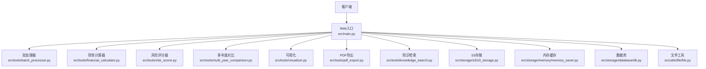
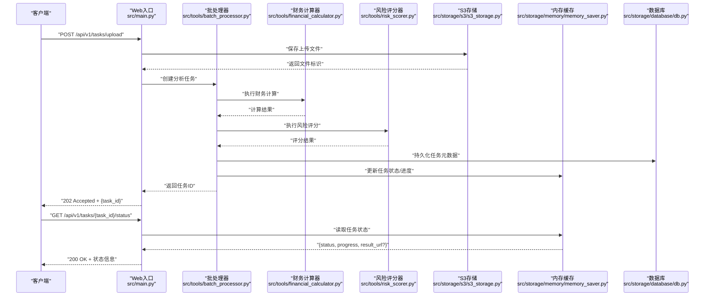
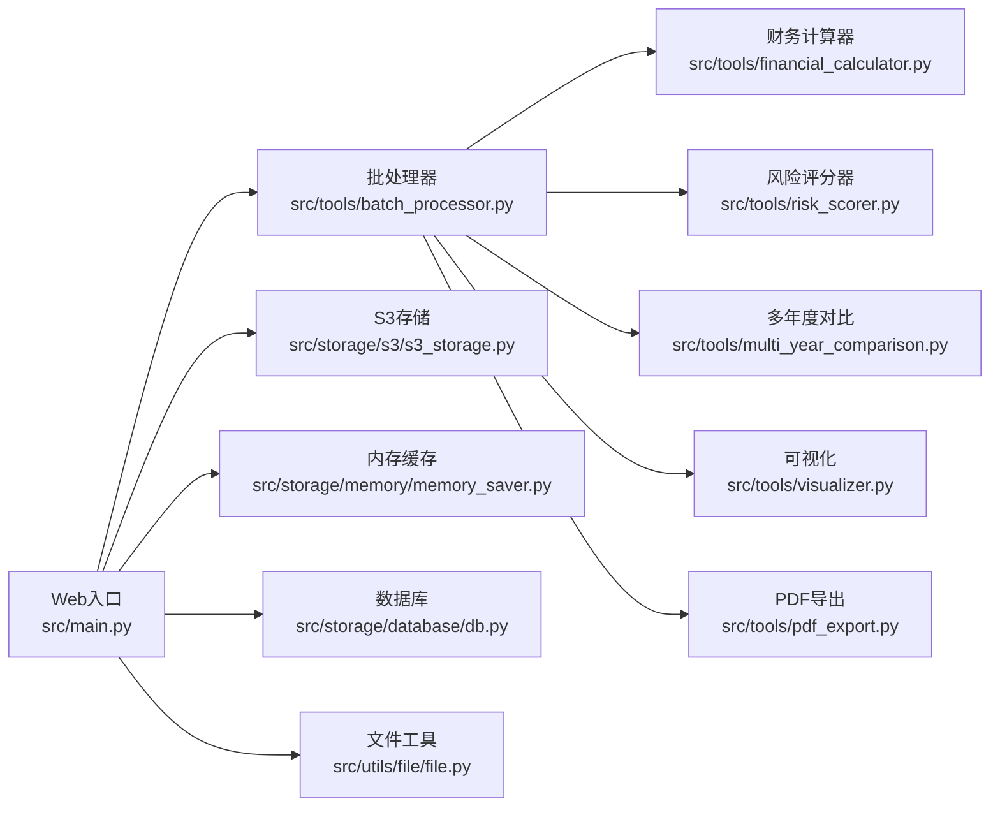

# 审计分析API

<cite>
**本文引用的文件**   
- [src/main.py](file://src/main.py)
- [src/tools/batch_processor.py](file://src/tools/batch_processor.py)
- [src/storage/s3/s3_storage.py](file://src/storage/s3/s3_storage.py)
- [src/utils/file/file.py](file://src/utils/file/file.py)
- [src/tools/financial_calculator.py](file://src/tools/financial_calculator.py)
- [src/tools/risk_scorer.py](file://src/tools/risk_scorer.py)
- [src/tools/pdf_export.py](file://src/tools/pdf_export.py)
- [src/tools/multi_year_comparison.py](file://src/tools/multi_year_comparison.py)
- [src/tools/visualizer.py](file://src/tools/visualizer.py)
- [src/tools/knowledge_search.py](file://src/tools/knowledge_search.py)
- [src/storage/database/db.py](file://src/storage/database/db.py)
- [src/storage/memory/memory_saver.py](file://src/storage/memory/memory_saver.py)
</cite>

## 目录
1. [简介](#简介)
2. [项目结构](#项目结构)
3. [核心组件](#核心组件)
4. [架构总览](#架构总览)
5. [详细接口说明](#详细接口说明)
6. [依赖关系分析](#依赖关系分析)
7. [性能与并发](#性能与并发)
8. [故障排查指南](#故障排查指南)
9. [结论](#结论)
10. [附录](#附录)

## 简介
本文件为“审计分析API”的完整接口文档，覆盖财务数据上传、审计请求提交、分析任务管理等核心能力。文档包含：
- HTTP方法与URL路径
- 请求参数与校验规则
- 响应数据结构
- 文件上传格式要求（PDF、Excel等）
- 错误处理机制
- 成功与失败示例
- 异步任务处理、状态查询与进度跟踪
- 批量处理限制与优化建议
- 认证授权与权限控制

## 项目结构
本项目采用分层组织方式：Web入口位于src/main.py；工具层提供计算、风险评分、可视化、导出等功能；存储层支持S3对象存储、本地内存缓存与数据库持久化；通用工具提供文件处理与文件名生成等能力。

图表来源
- [src/main.py](file://src/main.py)
- [src/tools/batch_processor.py](file://src/tools/batch_processor.py)
- [src/storage/s3/s3_storage.py](file://src/storage/s3/s3_storage.py)
- [src/utils/file/file.py](file://src/utils/file/file.py)

章节来源
- [src/main.py](file://src/main.py)
- [src/tools/batch_processor.py](file://src/tools/batch_processor.py)
- [src/storage/s3/s3_storage.py](file://src/storage/s3/s3_storage.py)
- [src/utils/file/file.py](file://src/utils/file/file.py)

## 核心组件
- Web入口与路由：负责接收HTTP请求、鉴权、参数校验、调度业务逻辑与返回响应。
- 批处理器：管理批量任务队列、限流与重试策略。
- 财务计算器：对上传的财务数据进行指标计算与汇总。
- 风险评分器：基于规则或模型输出风险分数与建议。
- 多年度对比：跨期数据对齐与差异分析。
- 可视化：生成图表数据供前端渲染。
- PDF导出：将报告导出为PDF文件并落盘或返回下载链接。
- 知识检索：结合知识库进行辅助分析与解释。
- 存储层：S3对象存储用于文件持久化；内存缓存用于任务状态与中间结果；数据库用于结构化记录。
- 文件工具：统一文件类型校验、大小限制与命名规范。

章节来源
- [src/main.py](file://src/main.py)
- [src/tools/batch_processor.py](file://src/tools/batch_processor.py)
- [src/tools/financial_calculator.py](file://src/tools/financial_calculator.py)
- [src/tools/risk_scorer.py](file://src/tools/risk_scorer.py)
- [src/tools/multi_year_comparison.py](file://src/tools/multi_year_comparison.py)
- [src/tools/visualizer.py](file://src/tools/visualizer.py)
- [src/tools/pdf_export.py](file://src/tools/pdf_export.py)
- [src/tools/knowledge_search.py](file://src/tools/knowledge_search.py)
- [src/storage/s3/s3_storage.py](file://src/storage/s3/s3_storage.py)
- [src/storage/memory/memory_saver.py](file://src/storage/memory/memory_saver.py)
- [src/storage/database/db.py](file://src/storage/database/db.py)
- [src/utils/file/file.py](file://src/utils/file/file.py)

## 架构总览
系统以REST API为入口，通过批处理器协调各分析工具，并将中间结果与最终产物写入存储层。任务采用异步模式，客户端通过任务ID轮询进度与结果。

图表来源
- [src/main.py](file://src/main.py)
- [src/tools/batch_processor.py](file://src/tools/batch_processor.py)
- [src/tools/financial_calculator.py](file://src/tools/financial_calculator.py)
- [src/tools/risk_scorer.py](file://src/tools/risk_scorer.py)
- [src/storage/s3/s3_storage.py](file://src/storage/s3/s3_storage.py)
- [src/storage/memory/memory_saver.py](file://src/storage/memory/memory_saver.py)
- [src/storage/database/db.py](file://src/storage/database/db.py)

## 详细接口说明

### 通用约定
- 基础路径：/api/v1
- 内容类型：application/json 或 multipart/form-data（文件上传）
- 字符编码：UTF-8
- 分页：列表接口默认每页20条，可通过page与page_size调整
- 时间格式：ISO 8601（UTC）
- 版本控制：URL中携带v1，后续兼容升级

### 认证与授权
- 认证方式：Bearer Token（JWT）
- 请求头：Authorization: Bearer <token>
- 权限模型：RBAC，角色包括管理员、审计员、只读用户
- 最小权限原则：仅授予必要资源访问权限
- 会话与会话超时：Token有效期可配置，过期需刷新
- 安全建议：HTTPS强制、IP白名单、速率限制、敏感字段脱敏

章节来源
- [src/main.py](file://src/main.py)

### 文件上传接口
- 方法：POST
- 路径：/api/v1/files/upload
- 鉴权：需要登录态
- 请求体：multipart/form-data
  - file：必填，二进制文件
  - category：可选，枚举值：financial_report, audit_workpaper, supporting_doc
  - tags：可选，字符串数组，最多10个标签
- 校验规则：
  - 支持格式：PDF、XLSX、CSV、DOCX
  - 单文件大小上限：50MB
  - 文件名长度限制：不超过256字符，仅允许字母、数字、下划线、连字符与点号
  - 重复检测：按MD5去重，相同文件直接返回已有引用
- 响应：
  - 201 Created：{file_id, original_name, size_bytes, mime_type, upload_time}
  - 400 Bad Request：参数或格式不合法
  - 413 Payload Too Large：超过大小限制
  - 415 Unsupported Media Type：不支持的文件类型
  - 500 Internal Server Error：服务端异常

示例
- 成功响应（201）
  - {
    "file_id": "f_abc123",
    "original_name": "2024Q3财报.pdf",
    "size_bytes": 1234567,
    "mime_type": "application/pdf",
    "upload_time": "2024-10-01T12:00:00Z"
  }
- 错误响应（400）
  - {
    "error_code": "INVALID_FILE_TYPE",
    "message": "不支持的文件类型",
    "details": {"allowed_types": ["application/pdf","application/vnd.openxmlformats-officedocument.spreadsheetml.sheet","text/csv","application/msword"]}
  }

章节来源
- [src/main.py](file://src/main.py)
- [src/utils/file/file.py](file://src/utils/file/file.py)
- [src/storage/s3/s3_storage.py](file://src/storage/s3/s3_storage.py)

### 提交审计分析任务
- 方法：POST
- 路径：/api/v1/tasks
- 鉴权：需要登录态且具备“审计员”或以上角色
- 请求体（JSON）：
  - files：必填，文件ID数组，长度1~10
  - scope：必填，枚举值：full_audit, risk_assessment, multi_year_compare
  - options：可选，对象
    - include_charts：布尔，是否生成图表
    - export_pdf：布尔，是否导出PDF
    - knowledge_enrich：布尔，是否启用知识检索增强
    - year_range：整数数组，如[2020,2021,2022]，仅在multi_year_compare时有效
- 校验规则：
  - files中的每个file_id必须存在且未被删除
  - scope与options需匹配（例如year_range仅在multi_year_compare时生效）
  - 最大并发任务数受全局配额限制
- 响应：
  - 202 Accepted：{task_id, status: "queued", estimated_seconds}
  - 400 Bad Request：参数校验失败
  - 403 Forbidden：无权限
  - 429 Too Many Requests：超出任务配额
  - 500 Internal Server Error：服务端异常

示例
- 成功响应（202）
  - {
    "task_id": "t_xyz789",
    "status": "queued",
    "estimated_seconds": 120
  }
- 错误响应（400）
  - {
    "error_code": "INVALID_SCOPE_OPTIONS",
    "message": "scope与options不匹配",
    "details": {"reason": "year_range仅在multi_year_compare时有效"}
  }

章节来源
- [src/main.py](file://src/main.py)
- [src/tools/batch_processor.py](file://src/tools/batch_processor.py)

### 查询任务状态与进度
- 方法：GET
- 路径：/api/v1/tasks/{task_id}/status
- 鉴权：需要登录态
- 路径参数：
  - task_id：必填，UUID格式
- 响应：
  - 200 OK：{task_id, status, progress, steps, result_url?, error?}
    - status枚举：queued, running, completed, failed, cancelled
    - progress：0~100整数
    - steps：当前步骤描述
    - result_url：当completed时返回结果下载链接
    - error：当failed时返回错误摘要
  - 404 Not Found：任务不存在
  - 403 Forbidden：无权查看该任务
  - 500 Internal Server Error：服务端异常

示例
- 成功响应（200）
  - {
    "task_id": "t_xyz789",
    "status": "running",
    "progress": 45,
    "steps": "正在执行风险评分",
    "result_url": null
  }
- 完成响应（200）
  - {
    "task_id": "t_xyz789",
    "status": "completed",
    "progress": 100,
    "steps": "已完成",
    "result_url": "/api/v1/results/t_xyz789/download"
  }

章节来源
- [src/main.py](file://src/main.py)
- [src/storage/memory/memory_saver.py](file://src/storage/memory/memory_saver.py)

### 获取分析结果
- 方法：GET
- 路径：/api/v1/results/{task_id}
- 鉴权：需要登录态
- 响应：
  - 200 OK：JSON对象，包含指标、风险评分、图表数据、对比分析等
  - 404 Not Found：结果不存在或尚未生成
  - 403 Forbidden：无权访问
  - 500 Internal Server Error：服务端异常

示例
- 成功响应（200）
  - {
    "task_id": "t_xyz789",
    "metrics": {...},
    "risk_score": 72,
    "charts": [...],
    "comparison": {...}
  }

章节来源
- [src/main.py](file://src/main.py)
- [src/tools/financial_calculator.py](file://src/tools/financial_calculator.py)
- [src/tools/risk_scorer.py](file://src/tools/risk_scorer.py)
- [src/tools/multi_year_comparison.py](file://src/tools/multi_year_comparison.py)
- [src/tools/visualizer.py](file://src/tools/visualizer.py)

### 下载结果文件（PDF）
- 方法：GET
- 路径：/api/v1/results/{task_id}/download
- 鉴权：需要登录态
- 响应：
  - 200 OK：application/pdf二进制流
  - 404 Not Found：文件不存在
  - 403 Forbidden：无权下载
  - 500 Internal Server Error：服务端异常

示例
- 成功响应（200）：二进制PDF文件流

章节来源
- [src/main.py](file://src/main.py)
- [src/tools/pdf_export.py](file://src/tools/pdf_export.py)
- [src/storage/s3/s3_storage.py](file://src/storage/s3/s3_storage.py)

### 取消任务
- 方法：DELETE
- 路径：/api/v1/tasks/{task_id}
- 鉴权：需要登录态且为任务创建者或管理员
- 响应：
  - 200 OK：{task_id, status: "cancelled"}
  - 404 Not Found：任务不存在
  - 403 Forbidden：无权操作
  - 409 Conflict：任务已处于终态（completed/failed/cancelled）
  - 500 Internal Server Error：服务端异常

章节来源
- [src/main.py](file://src/main.py)
- [src/storage/memory/memory_saver.py](file://src/storage/memory/memory_saver.py)

### 批量任务提交
- 方法：POST
- 路径：/api/v1/tasks/batch
- 鉴权：需要登录态且具备“审计员”或以上角色
- 请求体（JSON）：
  - jobs：必填，任务数组，每项结构与单个任务一致
  - max_concurrent：可选，正整数，默认5
  - retry_policy：可选，对象
    - max_retries：非负整数，默认0
    - backoff_ms：非负整数，默认1000
- 校验规则：
  - jobs长度上限：50
  - 单job内files长度上限：10
  - 全局并发受max_concurrent限制
- 响应：
  - 202 Accepted：{batch_id, job_ids[], estimated_seconds}
  - 400 Bad Request：参数校验失败
  - 403 Forbidden：无权限
  - 429 Too Many Requests：超出配额
  - 500 Internal Server Error：服务端异常

示例
- 成功响应（202）
  - {
    "batch_id": "b_001",
    "job_ids": ["t_aaa111","t_bbb222"],
    "estimated_seconds": 180
  }

章节来源
- [src/main.py](file://src/main.py)
- [src/tools/batch_processor.py](file://src/tools/batch_processor.py)

### 批量任务状态查询
- 方法：GET
- 路径：/api/v1/tasks/batch/{batch_id}/status
- 鉴权：需要登录态
- 响应：
  - 200 OK：{batch_id, total, completed, failed, pending, jobs[]}
  - 404 Not Found：批次不存在
  - 403 Forbidden：无权查看
  - 500 Internal Server Error：服务端异常

章节来源
- [src/main.py](file://src/main.py)
- [src/tools/batch_processor.py](file://src/tools/batch_processor.py)

### 列出历史任务
- 方法：GET
- 路径：/api/v1/tasks
- 鉴权：需要登录态
- 查询参数：
  - page：正整数，默认1
  - page_size：正整数，默认20，最大100
  - status：可选，过滤任务状态
  - created_after：可选，ISO 8601时间
  - created_before：可选，ISO 8601时间
- 响应：
  - 200 OK：{items[], total, page, page_size}
  - 400 Bad Request：参数非法
  - 403 Forbidden：无权查看
  - 500 Internal Server Error：服务端异常

章节来源
- [src/main.py](file://src/main.py)
- [src/storage/database/db.py](file://src/storage/database/db.py)

## 依赖关系分析
- Web入口依赖批处理器与各分析工具，并通过存储层实现持久化与缓存。
- 批处理器协调财务计算、风险评分、多年度对比、可视化与PDF导出。
- 文件工具负责上传前的格式与大小校验，S3存储负责文件落盘与访问。
- 内存缓存用于任务状态与进度快速读写，数据库用于任务元数据与结果索引。

图表来源
- [src/main.py](file://src/main.py)
- [src/tools/batch_processor.py](file://src/tools/batch_processor.py)
- [src/tools/financial_calculator.py](file://src/tools/financial_calculator.py)
- [src/tools/risk_scorer.py](file://src/tools/risk_scorer.py)
- [src/tools/multi_year_comparison.py](file://src/tools/multi_year_comparison.py)
- [src/tools/visualizer.py](file://src/tools/visualizer.py)
- [src/tools/pdf_export.py](file://src/tools/pdf_export.py)
- [src/storage/s3/s3_storage.py](file://src/storage/s3/s3_storage.py)
- [src/storage/memory/memory_saver.py](file://src/storage/memory/memory_saver.py)
- [src/storage/database/db.py](file://src/storage/database/db.py)
- [src/utils/file/file.py](file://src/utils/file/file.py)

章节来源
- [src/main.py](file://src/main.py)
- [src/tools/batch_processor.py](file://src/tools/batch_processor.py)
- [src/storage/s3/s3_storage.py](file://src/storage/s3/s3_storage.py)
- [src/utils/file/file.py](file://src/utils/file/file.py)

## 性能与并发
- 批处理限制：
  - 单次批量任务jobs上限：50
  - 单任务files上限：10
  - 默认并发max_concurrent：5，可按负载调优
- 重试与退避：
  - 支持指数退避，默认间隔1000ms，最大重试次数可配置
- 缓存策略：
  - 任务状态与进度优先从内存缓存读取，降低数据库压力
- 文件处理：
  - 大文件分块上传与断点续传（若使用S3）
  - 压缩与并行解析提升吞吐
- 数据库：
  - 分页查询与索引优化，避免全表扫描
- 监控与告警：
  - 记录关键指标（QPS、延迟、错误率、队列积压）
  - 设置阈值告警，自动扩容或降级

章节来源
- [src/tools/batch_processor.py](file://src/tools/batch_processor.py)
- [src/storage/memory/memory_saver.py](file://src/storage/memory/memory_saver.py)
- [src/storage/database/db.py](file://src/storage/database/db.py)
- [src/storage/s3/s3_storage.py](file://src/storage/s3/s3_storage.py)

## 故障排查指南
- 常见错误码与含义：
  - 400：参数校验失败，检查必填项、枚举值与范围
  - 401：未认证或Token无效，检查Authorization头
  - 403：无权限，检查角色与资源归属
  - 404：资源不存在，检查ID是否正确
  - 413：文件过大，检查大小限制
  - 415：不支持的文件类型，检查MIME与扩展名
  - 429：请求过多，检查速率限制与并发配额
  - 500：服务端异常，查看日志与堆栈
- 定位步骤：
  - 核对请求头与鉴权信息
  - 验证文件格式与大小
  - 检查任务状态与错误信息
  - 查看存储层是否可用（S3、数据库）
  - 关注批处理器队列与重试情况
- 日志关键字：
  - UPLOAD_ERROR、TASK_CREATE_FAILED、TASK_RUN_ERROR、EXPORT_FAILED、STORAGE_UNAVAILABLE

章节来源
- [src/main.py](file://src/main.py)
- [src/tools/batch_processor.py](file://src/tools/batch_processor.py)
- [src/storage/s3/s3_storage.py](file://src/storage/s3/s3_storage.py)
- [src/storage/memory/memory_saver.py](file://src/storage/memory/memory_saver.py)
- [src/storage/database/db.py](file://src/storage/database/db.py)

## 结论
本API围绕“上传—分析—结果—导出”的主流程构建，采用异步任务与批处理机制，兼顾可扩展性与稳定性。通过严格的参数校验、完善的错误码与清晰的进度反馈，确保调用方能够高效集成与排障。建议在部署时结合监控与限流策略，并根据业务负载动态调整并发与缓存策略。

## 附录
- 术语
  - 任务：一次完整的审计分析流程
  - 批次：一组任务的集合
  - 进度：任务执行的百分比
- 最佳实践
  - 小步快跑：拆分大批次为多个小批次
  - 幂等设计：使用唯一请求ID避免重复提交
  - 优雅降级：在存储不可用时返回待处理提示
  - 安全加固：开启HTTPS、最小权限、定期轮换密钥