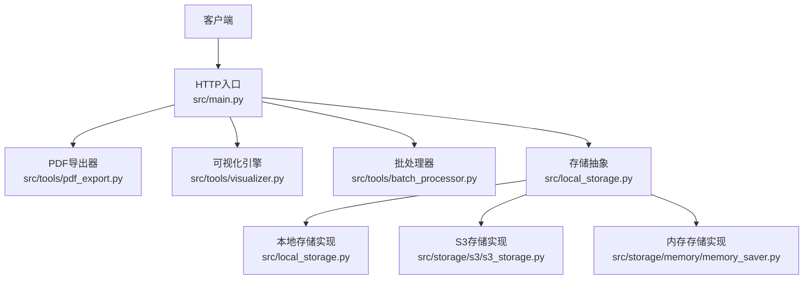
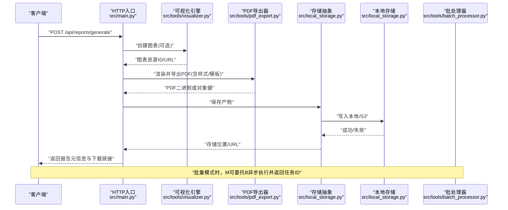
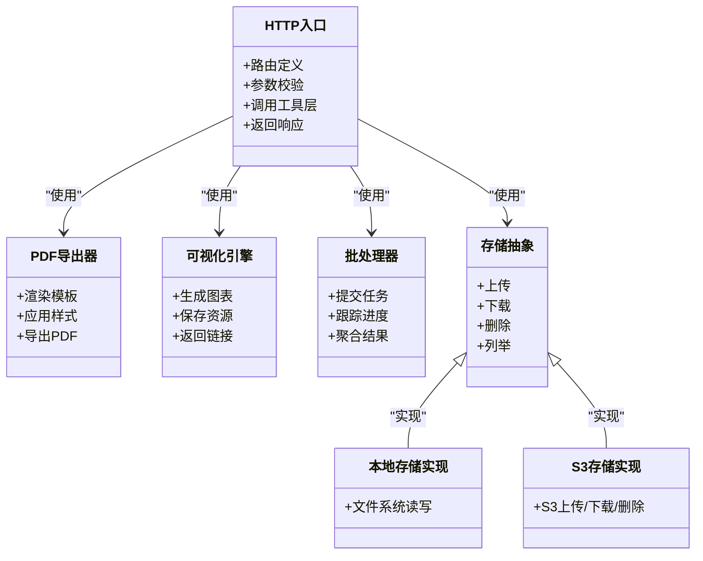

# 报告生成API

<cite>
**本文引用的文件**   
- [src/main.py](file://src/main.py)
- [src/tools/pdf_export.py](file://src/tools/pdf_export.py)
- [src/tools/visualizer.py](file://src/tools/visualizer.py)
- [src/tools/batch_processor.py](file://src/tools/batch_processor.py)
- [src/storage/s3/s3_storage.py](file://src/storage/s3/s3_storage.py)
- [src/storage/memory/memory_saver.py](file://src/storage/memory/memory_saver.py)
- [src/local_storage.py](file://src/local_storage.py)
- [src/utils/file/file.py](file://src/utils/file/file.py)
</cite>

## 目录
1. [简介](#简介)
2. [项目结构](#项目结构)
3. [核心组件](#核心组件)
4. [架构总览](#架构总览)
5. [详细接口说明](#详细接口说明)
6. [依赖关系分析](#依赖关系分析)
7. [性能与容量限制](#性能与容量限制)
8. [故障排查指南](#故障排查指南)
9. [结论](#结论)
10. [附录：模板定制与集成指南](#附录模板定制与集成指南)

## 简介
本文件为“审计报告生成”相关API的完整接口文档，覆盖以下能力：
- 审计报告生成（支持多种输出格式）
- 可视化图表创建与管理
- PDF导出与样式配置
- 批量报告生成、进度查询与存储管理
- 自定义报告模板的开发与集成方式
- 文件大小限制、生成时间优化与错误处理策略

## 项目结构
本项目采用分层组织：Web入口、工具层（PDF导出、可视化、批处理）、存储层（本地与S3）、通用工具。关键路径如下：
- Web入口：src/main.py
- 报告导出：src/tools/pdf_export.py
- 图表生成：src/tools/visualizer.py
- 批处理：src/tools/batch_processor.py
- 存储：src/storage/s3/s3_storage.py、src/storage/memory/memory_saver.py、src/local_storage.py
- 文件工具：src/utils/file/file.py

**图示来源**
- [src/main.py](file://src/main.py)
- [src/tools/pdf_export.py](file://src/tools/pdf_export.py)
- [src/tools/visualizer.py](file://src/tools/visualizer.py)
- [src/tools/batch_processor.py](file://src/tools/batch_processor.py)
- [src/local_storage.py](file://src/local_storage.py)
- [src/storage/s3/s3_storage.py](file://src/storage/s3/s3_storage.py)
- [src/storage/memory/memory_saver.py](file://src/storage/memory/memory_saver.py)

**章节来源**
- [src/main.py](file://src/main.py)
- [src/local_storage.py](file://src/local_storage.py)

## 核心组件
- HTTP入口与路由：负责接收请求、参数校验、调用业务工具并返回响应。
- PDF导出器：将渲染后的内容转换为PDF，支持样式与页面布局配置。
- 可视化引擎：根据数据与图表类型生成图表资源，供报告嵌入或单独下载。
- 批处理器：支持批量任务提交、状态跟踪与结果聚合。
- 存储抽象与实现：统一文件存取接口，提供本地与S3两种后端。
- 文件工具：提供文件名规范化、大小校验等基础能力。

**章节来源**
- [src/main.py](file://src/main.py)
- [src/tools/pdf_export.py](file://src/tools/pdf_export.py)
- [src/tools/visualizer.py](file://src/tools/visualizer.py)
- [src/tools/batch_processor.py](file://src/tools/batch_processor.py)
- [src/local_storage.py](file://src/local_storage.py)
- [src/storage/s3/s3_storage.py](file://src/storage/s3/s3_storage.py)
- [src/storage/memory/memory_saver.py](file://src/storage/memory/memory_saver.py)
- [src/utils/file/file.py](file://src/utils/file/file.py)

## 架构总览
系统以REST风格暴露接口，内部通过工具层完成渲染与导出，并通过存储抽象持久化产物。

**图示来源**
- [src/main.py](file://src/main.py)
- [src/tools/visualizer.py](file://src/tools/visualizer.py)
- [src/tools/pdf_export.py](file://src/tools/pdf_export.py)
- [src/local_storage.py](file://src/local_storage.py)
- [src/tools/batch_processor.py](file://src/tools/batch_processor.py)

## 详细接口说明

### 1. 生成审计报告
- 方法：POST
- 路径：/api/reports/generate
- 功能：根据模板与数据生成审计报告，支持HTML/PDF等多种输出。
- 请求体字段（示例）：
  - template_id: string，模板标识
  - data: object，报告数据
  - output_format: string，枚举值如 html, pdf, both
  - style: object，样式配置（主题、字体、边距、页眉页脚等）
  - charts: array，图表清单（type, source_data, options）
  - metadata: object，附加信息（审计期间、被审计单位等）
- 响应体字段（示例）：
  - report_id: string，报告唯一标识
  - status: string，生成状态
  - artifacts: object，产物列表（html_url, pdf_url, chart_urls）
  - created_at: string，创建时间
- 错误码：
  - 400：参数缺失或非法
  - 422：模板不存在或不可用
  - 500：内部错误

**章节来源**
- [src/main.py](file://src/main.py)
- [src/tools/pdf_export.py](file://src/tools/pdf_export.py)
- [src/tools/visualizer.py](file://src/tools/visualizer.py)

### 2. 获取报告详情
- 方法：GET
- 路径：/api/reports/{report_id}
- 功能：查询指定报告的元信息与产物链接。
- 响应体字段（示例）：
  - report_id, status, artifacts, created_at, updated_at
- 错误码：
  - 404：报告不存在

**章节来源**
- [src/main.py](file://src/main.py)

### 3. 删除报告
- 方法：DELETE
- 路径：/api/reports/{report_id}
- 功能：删除报告及其关联产物。
- 响应体字段（示例）：
  - success: boolean
- 错误码：
  - 404：报告不存在
  - 500：删除失败

**章节来源**
- [src/main.py](file://src/main.py)
- [src/local_storage.py](file://src/local_storage.py)

### 4. 下载报告产物
- 方法：GET
- 路径：/api/reports/{report_id}/artifacts/{artifact_type}
- 参数：
  - artifact_type: string，取值如 html, pdf
- 功能：直接下载对应产物。
- 错误码：
  - 404：产物不存在
  - 403：权限不足（若启用访问控制）

**章节来源**
- [src/main.py](file://src/main.py)
- [src/local_storage.py](file://src/local_storage.py)

### 5. 创建可视化图表
- 方法：POST
- 路径：/api/charts
- 功能：基于输入数据与图表类型生成图表资源，返回图表ID与预览/下载链接。
- 请求体字段（示例）：
  - type: string，图表类型（柱状图、折线图、饼图、雷达图等）
  - data: object，数据集
  - options: object，图表选项（标题、坐标轴、颜色、尺寸等）
- 响应体字段（示例）：
  - chart_id: string
  - preview_url: string
  - download_url: string
- 错误码：
  - 400：数据或选项不合法
  - 500：渲染失败

**章节来源**
- [src/main.py](file://src/main.py)
- [src/tools/visualizer.py](file://src/tools/visualizer.py)

### 6. 获取图表详情
- 方法：GET
- 路径：/api/charts/{chart_id}
- 功能：查询图表元信息与访问链接。
- 错误码：
  - 404：图表不存在

**章节来源**
- [src/main.py](file://src/main.py)
- [src/tools/visualizer.py](file://src/tools/visualizer.py)

### 7. 删除图表
- 方法：DELETE
- 路径：/api/charts/{chart_id}
- 功能：删除图表资源。
- 错误码：
  - 404：图表不存在

**章节来源**
- [src/main.py](file://src/main.py)
- [src/local_storage.py](file://src/local_storage.py)

### 8. 批量生成报告
- 方法：POST
- 路径：/api/batch/reports
- 功能：提交批量报告生成任务，返回任务ID；可通过进度接口查询。
- 请求体字段（示例）：
  - tasks: array，每个任务包含：
    - template_id: string
    - data: object
    - output_format: string
    - style: object
    - charts: array
- 响应体字段（示例）：
  - batch_id: string
  - total: number
  - status: string（pending/running/completed/failed）
- 错误码：
  - 400：任务列表为空或单个任务参数非法

**章节来源**
- [src/main.py](file://src/main.py)
- [src/tools/batch_processor.py](file://src/tools/batch_processor.py)

### 9. 查询批量任务进度
- 方法：GET
- 路径：/api/batch/reports/{batch_id}
- 功能：获取批量任务的总体状态与各子任务明细。
- 响应体字段（示例）：
  - batch_id, status, total, completed, failed, results: array（每项含task_index, status, report_id/artifact_urls）
- 错误码：
  - 404：任务不存在

**章节来源**
- [src/main.py](file://src/main.py)
- [src/tools/batch_processor.py](file://src/tools/batch_processor.py)

### 10. 取消批量任务
- 方法：POST
- 路径：/api/batch/reports/{batch_id}/cancel
- 功能：尝试取消尚未完成的批量任务。
- 响应体字段（示例）：
  - success: boolean
  - message: string
- 错误码：
  - 404：任务不存在
  - 409：任务已完成或已取消

**章节来源**
- [src/main.py](file://src/main.py)
- [src/tools/batch_processor.py](file://src/tools/batch_processor.py)

### 11. 存储管理操作
- 列出文件
  - 方法：GET
  - 路径：/api/storage/files
  - 查询参数：
    - prefix: string（可选），按前缀过滤
    - limit: number（可选），分页上限
  - 响应体字段（示例）：
    - files: array（每项含key, size, last_modified）
- 上传文件
  - 方法：POST
  - 路径：/api/storage/files
  - 表单字段：
    - file: binary
    - key: string（可选，未提供则自动生成）
  - 响应体字段（示例）：
    - key: string
    - url: string
- 删除文件
  - 方法：DELETE
  - 路径：/api/storage/files/{key}
  - 响应体字段（示例）：
    - success: boolean
- 错误码：
  - 400：参数非法
  - 404：文件不存在
  - 500：存储后端异常

**章节来源**
- [src/main.py](file://src/main.py)
- [src/local_storage.py](file://src/local_storage.py)
- [src/storage/s3/s3_storage.py](file://src/storage/s3/s3_storage.py)
- [src/storage/memory/memory_saver.py](file://src/storage/memory/memory_saver.py)

## 依赖关系分析

**图示来源**
- [src/main.py](file://src/main.py)
- [src/tools/pdf_export.py](file://src/tools/pdf_export.py)
- [src/tools/visualizer.py](file://src/tools/visualizer.py)
- [src/tools/batch_processor.py](file://src/tools/batch_processor.py)
- [src/local_storage.py](file://src/local_storage.py)
- [src/storage/s3/s3_storage.py](file://src/storage/s3/s3_storage.py)
- [src/storage/memory/memory_saver.py](file://src/storage/memory/memory_saver.py)

**章节来源**
- [src/main.py](file://src/main.py)
- [src/local_storage.py](file://src/local_storage.py)

## 性能与容量限制
- 文件大小限制
  - 建议对上传与产物设置最大体积阈值，避免内存溢出与磁盘耗尽。
  - 大文件导出建议分块或流式传输。
- 生成时间优化
  - 图表缓存：相同数据与配置的图表应复用已有资源。
  - 并行渲染：在资源允许范围内并发处理多个图表与页面区块。
  - 模板预编译：减少模板解析开销。
  - 增量更新：仅重绘变更部分。
- 存储与网络
  - 优先使用对象存储（S3）进行产物持久化，降低本地IO压力。
  - 对热点产物启用CDN或短链加速。

[本节为通用指导，无需代码来源]

## 故障排查指南
- 常见问题定位
  - 参数校验失败：检查必填字段、类型与取值范围。
  - 模板不存在：确认template_id是否注册且可用。
  - 存储失败：检查本地路径权限或S3凭据与桶策略。
  - 超时：评估数据量与图表复杂度，必要时拆分任务或调整超时。
- 日志与诊断
  - 记录关键步骤耗时与错误堆栈。
  - 对批处理任务维护任务级日志以便追踪。
- 恢复策略
  - 幂等设计：重复提交同一任务应返回一致结果。
  - 重试机制：对瞬时性错误（网络抖动、限流）进行指数退避重试。

**章节来源**
- [src/main.py](file://src/main.py)
- [src/tools/batch_processor.py](file://src/tools/batch_processor.py)
- [src/local_storage.py](file://src/local_storage.py)

## 结论
本报告生成API围绕“模板驱动+可视化嵌入+多格式导出+批处理+存储管理”构建，具备可扩展的模板与样式体系、灵活的图表类型选择以及完善的进度与存储管理能力。通过合理的容量限制与优化策略，可在保证质量的同时提升吞吐与稳定性。

[本节为总结，无需代码来源]

## 附录：模板定制与集成指南

### 模板结构与配置
- 模板标识：template_id用于选择不同报告模板。
- 数据绑定：data字段中的键应与模板占位符一一对应。
- 样式配置：style对象可定义主题、字体、边距、页眉页脚、表格样式等。
- 图表嵌入：charts数组中声明图表类型、数据源与渲染选项。

**章节来源**
- [src/tools/pdf_export.py](file://src/tools/pdf_export.py)
- [src/tools/visualizer.py](file://src/tools/visualizer.py)

### 开发流程
- 新增模板
  - 在模板仓库中新增模板文件，分配template_id。
  - 在配置中心注册模板元信息（名称、版本、适用场景）。
- 扩展图表类型
  - 在可视化引擎中注册新图表类型及渲染逻辑。
  - 在接口文档中补充options字段说明。
- 集成方式
  - 通过HTTP入口统一接入，保持向后兼容。
  - 使用存储抽象切换本地或S3后端，便于部署环境差异。

**章节来源**
- [src/main.py](file://src/main.py)
- [src/tools/visualizer.py](file://src/tools/visualizer.py)
- [src/local_storage.py](file://src/local_storage.py)

### 请求与响应示例（摘要）
- 生成报告（POST /api/reports/generate）
  - 请求体包含：template_id、data、output_format、style、charts、metadata
  - 响应体包含：report_id、status、artifacts（html_url、pdf_url、chart_urls）、created_at
- 批量生成（POST /api/batch/reports）
  - 请求体包含：tasks数组（每项含template_id、data、output_format、style、charts）
  - 响应体包含：batch_id、total、status
- 进度查询（GET /api/batch/reports/{batch_id}）
  - 响应体包含：batch_id、status、total、completed、failed、results数组

[本节为接口示例摘要，具体字段见各接口说明]