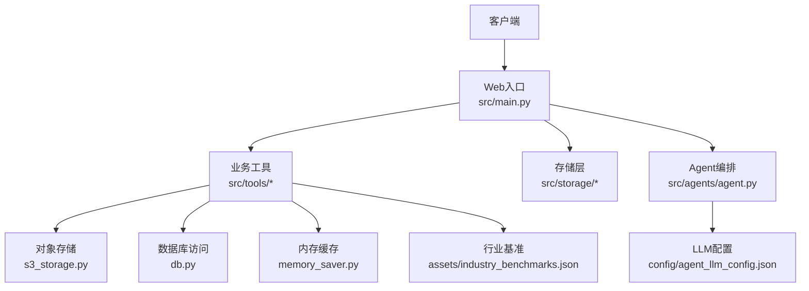
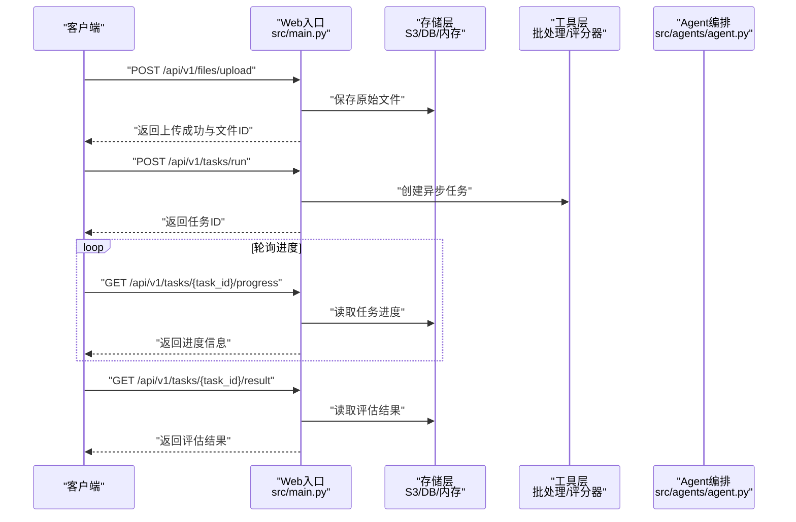
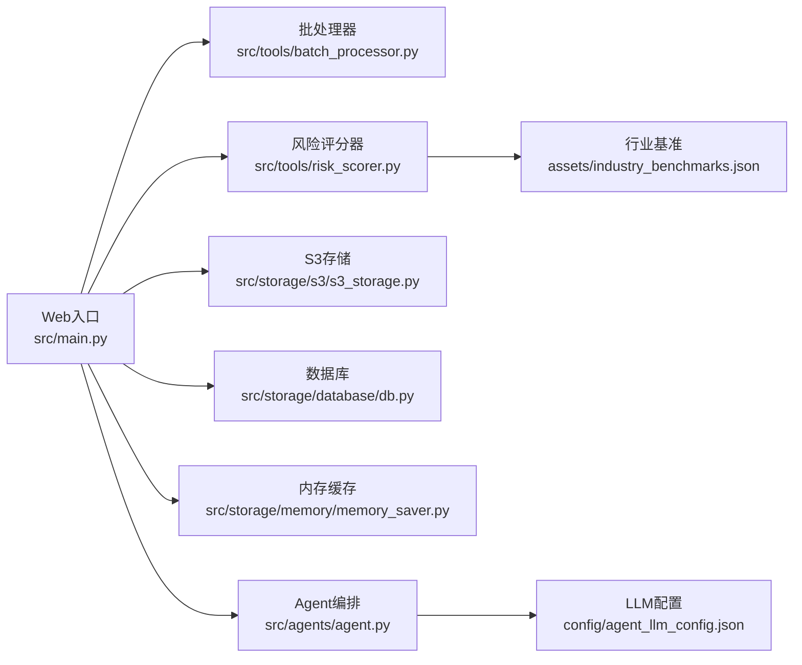

# 核心业务API

<cite>
**本文引用的文件**   
- [src/main.py](file://src/main.py)
- [src/tools/batch_processor.py](file://src/tools/batch_processor.py)
- [src/tools/risk_scorer.py](file://src/tools/risk_scorer.py)
- [src/storage/s3/s3_storage.py](file://src/storage/s3/s3_storage.py)
- [src/storage/database/db.py](file://src/storage/database/db.py)
- [src/storage/memory/memory_saver.py](file://src/storage/memory/memory_saver.py)
- [src/agents/agent.py](file://src/agents/agent.py)
- [config/agent_llm_config.json](file://config/agent_llm_config.json)
- [assets/industry_benchmarks.json](file://assets/industry_benchmarks.json)
</cite>

## 目录
1. [简介](#简介)
2. [项目结构](#项目结构)
3. [核心组件](#核心组件)
4. [架构总览](#架构总览)
5. [详细接口说明](#详细接口说明)
6. [依赖分析](#依赖分析)
7. [性能考虑](#性能考虑)
8. [故障排查指南](#故障排查指南)
9. [结论](#结论)
10. [附录](#附录)

## 简介
本文件为“审计风险识别系统”的核心业务API文档，聚焦以下能力：
- 财务数据上传与校验
- 风险分析执行（含异步任务）
- 风险评估结果获取与进度查询
- 批量处理接口与限制
- 认证授权与权限控制
- 客户端集成示例与最佳实践

该系统围绕财务数据输入、指标计算、风险评分与报告生成等流程，提供REST风格接口，并通过存储层与工具层协同完成数据处理与分析。

## 项目结构
从代码组织看，系统采用分层与按功能域划分相结合的结构：
- Web入口与路由定义位于 src/main.py
- 业务工具与算法封装在 src/tools/*
- 数据存储抽象在 src/storage/*（S3对象存储、数据库、内存缓存）
- Agent编排与LLM配置在 src/agents/agent.py 与 config/agent_llm_config.json
- 行业基准数据在 assets/industry_benchmarks.json

图表来源
- [src/main.py](file://src/main.py)
- [src/tools/batch_processor.py](file://src/tools/batch_processor.py)
- [src/tools/risk_scorer.py](file://src/tools/risk_scorer.py)
- [src/storage/s3/s3_storage.py](file://src/storage/s3/s3_storage.py)
- [src/storage/database/db.py](file://src/storage/database/db.py)
- [src/storage/memory/memory_saver.py](file://src/storage/memory/memory_saver.py)
- [src/agents/agent.py](file://src/agents/agent.py)
- [config/agent_llm_config.json](file://config/agent_llm_config.json)
- [assets/industry_benchmarks.json](file://assets/industry_benchmarks.json)

章节来源
- [src/main.py](file://src/main.py)
- [src/tools/batch_processor.py](file://src/tools/batch_processor.py)
- [src/tools/risk_scorer.py](file://src/tools/risk_scorer.py)
- [src/storage/s3/s3_storage.py](file://src/storage/s3/s3_storage.py)
- [src/storage/database/db.py](file://src/storage/database/db.py)
- [src/storage/memory/memory_saver.py](file://src/storage/memory/memory_saver.py)
- [src/agents/agent.py](file://src/agents/agent.py)
- [config/agent_llm_config.json](file://config/agent_llm_config.json)
- [assets/industry_benchmarks.json](file://assets/industry_benchmarks.json)

## 核心组件
- Web入口与路由：负责接收HTTP请求、参数校验、调用业务逻辑并返回响应。
- 工具层：
  - 批处理器：支持批量任务调度与限流。
  - 风险评分器：基于规则或模型对财务数据进行风险打分。
- 存储层：
  - S3存储：用于上传的财务文件与生成的报告持久化。
  - 数据库：持久化任务状态、评估结果与元数据。
  - 内存缓存：临时存放任务进度与中间结果。
- Agent与配置：
  - Agent编排：协调多步骤分析与报告生成。
  - LLM配置：外部大模型接入参数。
- 行业基准：用于横向对比与阈值判定。

章节来源
- [src/main.py](file://src/main.py)
- [src/tools/batch_processor.py](file://src/tools/batch_processor.py)
- [src/tools/risk_scorer.py](file://src/tools/risk_scorer.py)
- [src/storage/s3/s3_storage.py](file://src/storage/s3/s3_storage.py)
- [src/storage/database/db.py](file://src/storage/database/db.py)
- [src/storage/memory/memory_saver.py](file://src/storage/memory/memory_saver.py)
- [src/agents/agent.py](file://src/agents/agent.py)
- [config/agent_llm_config.json](file://config/agent_llm_config.json)
- [assets/industry_benchmarks.json](file://assets/industry_benchmarks.json)

## 架构总览
下图展示一次典型的风险评估端到端流程：客户端上传财务数据，服务端进行校验与落盘，随后触发异步分析任务；任务完成后将结果写入存储并提供查询接口。

图表来源
- [src/main.py](file://src/main.py)
- [src/tools/batch_processor.py](file://src/tools/batch_processor.py)
- [src/tools/risk_scorer.py](file://src/tools/risk_scorer.py)
- [src/storage/s3/s3_storage.py](file://src/storage/s3/s3_storage.py)
- [src/storage/database/db.py](file://src/storage/database/db.py)
- [src/storage/memory/memory_saver.py](file://src/storage/memory/memory_saver.py)
- [src/agents/agent.py](file://src/agents/agent.py)

## 详细接口说明

### 通用约定
- 基础路径：/api/v1
- 内容类型：application/json（文件上传使用 multipart/form-data）
- 字符编码：UTF-8
- 分页：列表接口默认返回前N条，可通过页码与每页数量参数控制
- 错误格式：统一返回 code、message、data 字段

章节来源
- [src/main.py](file://src/main.py)

### 认证与授权
- 认证方式：请求头携带令牌（例如 Authorization: Bearer <token>）
- 权限控制：
  - 上传与运行任务需要“分析师”及以上角色
  - 仅任务发起者可查询自身任务进度与结果
  - 管理员可查看所有任务与导出报告
- 令牌有效期与刷新策略由网关或服务端统一管控

章节来源
- [src/main.py](file://src/main.py)

### 财务数据上传
- 方法：POST
- 路径：/api/v1/files/upload
- 鉴权：需要登录态
- 请求体：multipart/form-data
  - file：必填，支持CSV/XLSX/PDF（具体以服务端实现为准）
  - company_code：可选，企业编码
  - fiscal_year：可选，会计年度
- 响应：
  - success：返回文件ID、文件名、大小、上传时间
  - error：返回错误码与消息（如文件格式不支持、大小超限）

成功示例（JSON）
{
  "code": 0,
  "message": "上传成功",
  "data": {
    "file_id": "f_001",
    "filename": "2024_financial.csv",
    "size_bytes": 102400,
    "uploaded_at": "2024-06-01T10:00:00Z"
  }
}

错误示例（JSON）
{
  "code": 40001,
  "message": "文件格式不支持",
  "data": null
}

章节来源
- [src/main.py](file://src/main.py)
- [src/storage/s3/s3_storage.py](file://src/storage/s3/s3_storage.py)

### 风险分析执行（异步）
- 方法：POST
- 路径：/api/v1/tasks/run
- 鉴权：需要“分析师”及以上角色
- 请求体：
  - file_ids：数组，必填，至少包含一个已上传的文件ID
  - options：对象，可选
    - include_industry_benchmark：布尔，是否启用行业基准对比
    - risk_model：字符串，指定评分模型名称
    - output_format：字符串，pdf/csv/json
- 响应：
  - success：返回任务ID、预计耗时、状态
  - error：返回错误码与消息（如文件不存在、权限不足）

成功示例（JSON）
{
  "code": 0,
  "message": "任务已提交",
  "data": {
    "task_id": "t_001",
    "status": "queued",
    "estimated_seconds": 120
  }
}

错误示例（JSON）
{
  "code": 40301,
  "message": "无权限执行分析任务",
  "data": null
}

章节来源
- [src/main.py](file://src/main.py)
- [src/tools/batch_processor.py](file://src/tools/batch_processor.py)
- [src/tools/risk_scorer.py](file://src/tools/risk_scorer.py)
- [src/storage/memory/memory_saver.py](file://src/storage/memory/memory_saver.py)
- [src/storage/database/db.py](file://src/storage/database/db.py)

### 任务进度查询
- 方法：GET
- 路径：/api/v1/tasks/{task_id}/progress
- 鉴权：任务发起者或管理员
- 路径参数：
  - task_id：必填，任务唯一标识
- 响应：
  - success：返回当前阶段、已完成比例、日志片段
  - error：返回错误码与消息（如任务不存在）

成功示例（JSON）
{
  "code": 0,
  "message": "查询成功",
  "data": {
    "task_id": "t_001",
    "status": "running",
    "phase": "risk_scoring",
    "progress_percent": 65,
    "logs": ["开始计算风险指标...", "正在对比行业基准..."]
  }
}

错误示例（JSON）
{
  "code": 40401,
  "message": "任务不存在",
  "data": null
}

章节来源
- [src/main.py](file://src/main.py)
- [src/storage/memory/memory_saver.py](file://src/storage/memory/memory_saver.py)
- [src/storage/database/db.py](file://src/storage/database/db.py)

### 评估结果获取
- 方法：GET
- 路径：/api/v1/tasks/{task_id}/result
- 鉴权：任务发起者或管理员
- 路径参数：
  - task_id：必填
- 响应：
  - success：返回风险总分、各维度得分、关键发现与建议、输出文件链接（若生成PDF/CSV）
  - error：返回错误码与消息（如结果未就绪）

成功示例（JSON）
{
  "code": 0,
  "message": "查询成功",
  "data": {
    "task_id": "t_001",
    "overall_risk_score": 72,
    "dimensions": {
      "liquidity": 68,
      "profitability": 75,
      "leverage": 70,
      "efficiency": 74
    },
    "key_findings": ["流动比率低于行业均值", "应收账款周转天数上升"],
    "recommendations": ["优化现金流管理", "加强信用政策"],
    "output_files": {
      "report_pdf": "/reports/t_001/report.pdf",
      "metrics_csv": "/reports/t_001/metrics.csv"
    }
  }
}

错误示例（JSON）
{
  "code": 40402,
  "message": "结果尚未生成",
  "data": null
}

章节来源
- [src/main.py](file://src/main.py)
- [src/storage/s3/s3_storage.py](file://src/storage/s3/s3_storage.py)
- [src/storage/database/db.py](file://src/storage/database/db.py)

### 批量处理接口
- 方法：POST
- 路径：/api/v1/batch/run
- 鉴权：需要“分析师”及以上角色
- 请求体：
  - tasks：数组，必填，每个元素为一个子任务
    - file_ids：数组，必填
    - options：对象，可选（同单个任务options）
  - concurrency：整数，可选，最大并发数（默认值由服务端限制）
  - timeout_seconds：整数，可选，整体超时时间
- 响应：
  - success：返回批次ID、子任务ID列表、预计耗时
  - error：返回错误码与消息（如并发超限、参数非法）

成功示例（JSON）
{
  "code": 0,
  "message": "批次已提交",
  "data": {
    "batch_id": "b_001",
    "task_ids": ["t_001", "t_002"],
    "estimated_seconds": 240
  }
}

错误示例（JSON）
{
  "code": 42901,
  "message": "并发数超过限制",
  "data": null
}

章节来源
- [src/main.py](file://src/main.py)
- [src/tools/batch_processor.py](file://src/tools/batch_processor.py)

### 进度与结果聚合（批量）
- 方法：GET
- 路径：/api/v1/batch/{batch_id}/status
- 鉴权：任务发起者或管理员
- 路径参数：
  - batch_id：必填
- 响应：
  - success：返回批次状态、子任务状态汇总、失败原因
  - error：返回错误码与消息（如批次不存在）

成功示例（JSON）
{
  "code": 0,
  "message": "查询成功",
  "data": {
    "batch_id": "b_001",
    "status": "completed",
    "summary": {
      "total": 2,
      "succeeded": 2,
      "failed": 0
    },
    "details": [
      {"task_id": "t_001", "status": "completed"},
      {"task_id": "t_002", "status": "completed"}
    ]
  }
}

错误示例（JSON）
{
  "code": 40403,
  "message": "批次不存在",
  "data": null
}

章节来源
- [src/main.py](file://src/main.py)
- [src/tools/batch_processor.py](file://src/tools/batch_processor.py)

## 依赖分析
- Web入口依赖：
  - 存储层：S3用于文件存取，数据库用于任务与结果持久化，内存用于短期进度缓存
  - 工具层：批处理器与风险评分器
  - Agent：编排复杂分析流程
- 工具层依赖：
  - 风险评分器可能引用行业基准数据
  - 批处理器协调多个子任务与并发控制
- 外部配置：
  - LLM配置用于Agent行为调整

图表来源
- [src/main.py](file://src/main.py)
- [src/tools/batch_processor.py](file://src/tools/batch_processor.py)
- [src/tools/risk_scorer.py](file://src/tools/risk_scorer.py)
- [src/storage/s3/s3_storage.py](file://src/storage/s3/s3_storage.py)
- [src/storage/database/db.py](file://src/storage/database/db.py)
- [src/storage/memory/memory_saver.py](file://src/storage/memory/memory_saver.py)
- [src/agents/agent.py](file://src/agents/agent.py)
- [config/agent_llm_config.json](file://config/agent_llm_config.json)
- [assets/industry_benchmarks.json](file://assets/industry_benchmarks.json)

章节来源
- [src/main.py](file://src/main.py)
- [src/tools/batch_processor.py](file://src/tools/batch_processor.py)
- [src/tools/risk_scorer.py](file://src/tools/risk_scorer.py)
- [src/storage/s3/s3_storage.py](file://src/storage/s3/s3_storage.py)
- [src/storage/database/db.py](file://src/storage/database/db.py)
- [src/storage/memory/memory_saver.py](file://src/storage/memory/memory_saver.py)
- [src/agents/agent.py](file://src/agents/agent.py)
- [config/agent_llm_config.json](file://config/agent_llm_config.json)
- [assets/industry_benchmarks.json](file://assets/industry_benchmarks.json)

## 性能考虑
- 上传限制：建议对文件大小与并发上传数做限制，避免阻塞服务
- 异步任务：长耗时分析应走异步队列，前端通过进度接口轮询
- 缓存策略：短期进度与中间结果优先使用内存缓存，降低数据库压力
- 批处理：合理设置并发度与超时，避免资源争用
- 结果输出：大文件（PDF/CSV）建议生成后提供下载链接而非直接返回二进制

[本节为通用指导，不直接分析具体文件]

## 故障排查指南
- 常见错误码与定位：
  - 40001：文件格式不支持——检查上传文件的扩展名与内容类型
  - 40301：无权限执行分析任务——确认用户角色与令牌范围
  - 40401/40402/40403：任务或结果不存在——核对任务ID与生命周期
  - 42901：并发超限——降低批处理的并发数或等待重试
- 日志与追踪：
  - 使用任务ID贯穿全链路，便于定位问题
  - 关注进度接口的日志片段，快速判断卡点阶段
- 存储与网络：
  - 检查S3连接与权限
  - 确认数据库连接池与事务是否正常

章节来源
- [src/main.py](file://src/main.py)
- [src/storage/s3/s3_storage.py](file://src/storage/s3/s3_storage.py)
- [src/storage/database/db.py](file://src/storage/database/db.py)
- [src/storage/memory/memory_saver.py](file://src/storage/memory/memory_saver.py)

## 结论
本API体系围绕“上传—分析—结果—批量”的主线设计，结合异步任务与进度查询，满足审计风险识别的高吞吐与可观测性需求。通过明确的鉴权与权限控制、统一的错误格式与完善的进度反馈，有助于客户端稳定集成与高效排障。

[本节为总结性内容，不直接分析具体文件]

## 附录

### 客户端集成示例（Python）
- 上传文件
  - 使用HTTP库发送multipart表单，包含file、company_code、fiscal_year
  - 解析返回的file_id
- 提交分析任务
  - 使用file_ids与options构造请求体
  - 记录返回的task_id
- 轮询进度
  - 定时GET /api/v1/tasks/{task_id}/progress
  - 当status为completed时退出轮询
- 获取结果
  - GET /api/v1/tasks/{task_id}/result
  - 解析风险分数、维度得分、关键发现与建议
- 批量处理
  - POST /api/v1/batch/run 提交批次
  - GET /api/v1/batch/{batch_id}/status 查询批次状态

章节来源
- [src/main.py](file://src/main.py)
- [src/tools/batch_processor.py](file://src/tools/batch_processor.py)
- [src/tools/risk_scorer.py](file://src/tools/risk_scorer.py)
- [src/storage/s3/s3_storage.py](file://src/storage/s3/s3_storage.py)
- [src/storage/database/db.py](file://src/storage/database/db.py)
- [src/storage/memory/memory_saver.py](file://src/storage/memory/memory_saver.py)

### 最佳实践建议
- 幂等性：对重复提交的任务ID进行去重，避免重复计算
- 重试机制：网络异常时指数退避重试，避免雪崩
- 超时控制：为上传、任务提交与结果下载设置合理超时
- 安全传输：全程使用HTTPS，敏感参数不落日志
- 监控告警：对关键接口成功率与延迟进行监控，异常及时告警

[本节为通用指导，不直接分析具体文件]