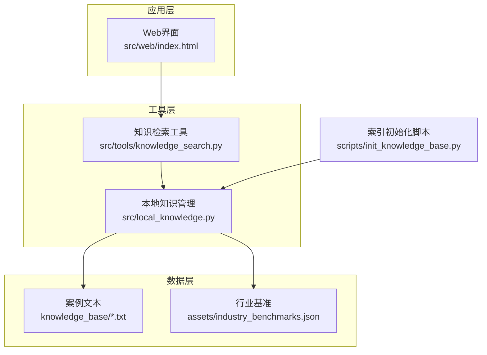
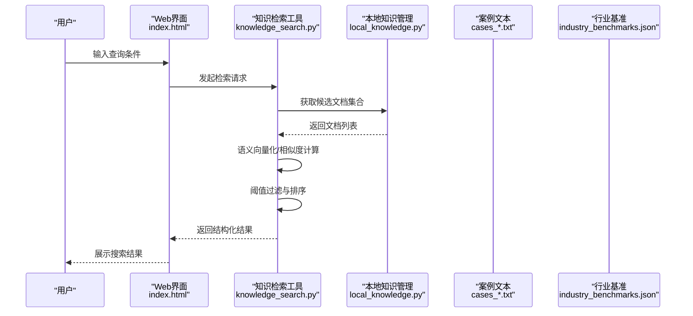
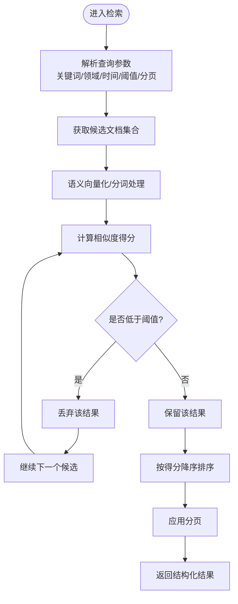
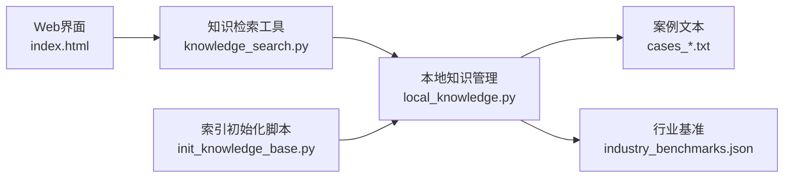

# 知识检索API

<cite>
**本文引用的文件**   
- [src/tools/knowledge_search.py](file://src/tools/knowledge_search.py)
- [src/local_knowledge.py](file://src/local_knowledge.py)
- [knowledge_base/cases_ch9.txt](file://knowledge_base/cases_ch9.txt)
- [knowledge_base/cases_ch10.txt](file://knowledge_base/cases_ch10.txt)
- [knowledge_base/cases_ch11.txt](file://knowledge_base/cases_ch11.txt)
- [assets/industry_benchmarks.json](file://assets/industry_benchmarks.json)
- [scripts/init_knowledge_base.py](file://scripts/init_knowledge_base.py)
- [src/web/index.html](file://src/web/index.html)
</cite>

## 目录
1. [简介](#简介)
2. [项目结构](#项目结构)
3. [核心组件](#核心组件)
4. [架构总览](#架构总览)
5. [详细组件分析](#详细组件分析)
6. [依赖关系分析](#依赖关系分析)
7. [性能考虑](#性能考虑)
8. [故障排查指南](#故障排查指南)
9. [结论](#结论)
10. [附录](#附录)

## 简介
本文件为“知识检索API”的接口与实现说明，覆盖案例库搜索、行业基准查询、相似案例匹配等核心能力。文档面向开发者与使用者，提供：
- HTTP方法、URL路径、参数配置（语义搜索、相似度阈值、排序规则）
- 请求与响应示例（含结构化数据展示）
- 知识库更新、新案例添加、索引维护流程
- 搜索性能优化、缓存策略与分页查询
- 搜索质量评估与结果过滤选项

## 项目结构
围绕知识检索的核心代码与资源分布如下：
- 工具层：知识检索工具模块，封装语义搜索、相似度计算、排序与过滤逻辑
- 本地知识：加载与管理本地知识库（文本案例与行业基准）
- 知识库资源：按章节组织的案例文本与行业基准JSON
- 初始化脚本：用于构建或重建索引
- Web入口：前端页面，演示调用检索能力

图表来源
- [src/tools/knowledge_search.py](file://src/tools/knowledge_search.py)
- [src/local_knowledge.py](file://src/local_knowledge.py)
- [knowledge_base/cases_ch9.txt](file://knowledge_base/cases_ch9.txt)
- [knowledge_base/cases_ch10.txt](file://knowledge_base/cases_ch10.txt)
- [knowledge_base/cases_ch11.txt](file://knowledge_base/cases_ch11.txt)
- [assets/industry_benchmarks.json](file://assets/industry_benchmarks.json)
- [scripts/init_knowledge_base.py](file://scripts/init_knowledge_base.py)
- [src/web/index.html](file://src/web/index.html)

章节来源
- [src/tools/knowledge_search.py](file://src/tools/knowledge_search.py)
- [src/local_knowledge.py](file://src/local_knowledge.py)
- [knowledge_base/cases_ch9.txt](file://knowledge_base/cases_ch9.txt)
- [knowledge_base/cases_ch10.txt](file://knowledge_base/cases_ch10.txt)
- [knowledge_base/cases_ch11.txt](file://knowledge_base/cases_ch11.txt)
- [assets/industry_benchmarks.json](file://assets/industry_benchmarks.json)
- [scripts/init_knowledge_base.py](file://scripts/init_knowledge_base.py)
- [src/web/index.html](file://src/web/index.html)

## 核心组件
- 知识检索工具（语义搜索、相似度计算、排序与过滤）
- 本地知识管理（读取案例文本与行业基准，提供统一访问）
- 索引初始化（构建或重建检索索引）
- Web界面（演示调用检索接口）

章节来源
- [src/tools/knowledge_search.py](file://src/tools/knowledge_search.py)
- [src/local_knowledge.py](file://src/local_knowledge.py)
- [scripts/init_knowledge_base.py](file://scripts/init_knowledge_base.py)
- [src/web/index.html](file://src/web/index.html)

## 架构总览
下图展示了从Web界面到检索工具再到知识库资源的整体交互流程。

图表来源
- [src/web/index.html](file://src/web/index.html)
- [src/tools/knowledge_search.py](file://src/tools/knowledge_search.py)
- [src/local_knowledge.py](file://src/local_knowledge.py)
- [knowledge_base/cases_ch9.txt](file://knowledge_base/cases_ch9.txt)
- [knowledge_base/cases_ch10.txt](file://knowledge_base/cases_ch10.txt)
- [knowledge_base/cases_ch11.txt](file://knowledge_base/cases_ch11.txt)
- [assets/industry_benchmarks.json](file://assets/industry_benchmarks.json)

## 详细组件分析

### 组件A：知识检索工具（语义搜索、相似度、排序与过滤）
职责
- 接收查询参数（关键词、领域、时间范围、相似度阈值、分页等）
- 调用本地知识管理获取候选集
- 执行语义搜索与相似度计算
- 按相关性排序并应用过滤
- 返回结构化结果（支持分页）

关键流程（算法视角）

图表来源
- [src/tools/knowledge_search.py](file://src/tools/knowledge_search.py)
- [src/local_knowledge.py](file://src/local_knowledge.py)

章节来源
- [src/tools/knowledge_search.py](file://src/tools/knowledge_search.py)
- [src/local_knowledge.py](file://src/local_knowledge.py)

### 组件B：本地知识管理（案例与基准）
职责
- 加载案例文本（按章节组织）
- 加载行业基准（JSON）
- 提供统一的文档访问接口（供检索工具使用）

数据结构要点
- 案例文本：以章节为单位，便于按领域筛选
- 行业基准：结构化指标，便于对比与过滤

章节来源
- [src/local_knowledge.py](file://src/local_knowledge.py)
- [knowledge_base/cases_ch9.txt](file://knowledge_base/cases_ch9.txt)
- [knowledge_base/cases_ch10.txt](file://knowledge_base/cases_ch10.txt)
- [knowledge_base/cases_ch11.txt](file://knowledge_base/cases_ch11.txt)
- [assets/industry_benchmarks.json](file://assets/industry_benchmarks.json)

### 组件C：索引初始化与维护
职责
- 扫描知识库资源，构建或重建检索索引
- 支持增量更新与全量重建两种模式（由脚本参数控制）

典型操作
- 初始化：清理旧索引并重建
- 增量：仅处理新增或变更的案例
- 校验：检查索引完整性与一致性

章节来源
- [scripts/init_knowledge_base.py](file://scripts/init_knowledge_base.py)
- [src/local_knowledge.py](file://src/local_knowledge.py)

### 组件D：Web界面（演示调用）
职责
- 提供查询表单与结果展示
- 调用检索工具接口，渲染结构化结果

章节来源
- [src/web/index.html](file://src/web/index.html)

## 依赖关系分析
- 检索工具依赖本地知识管理进行数据访问
- 本地知识管理依赖知识库文本与基准JSON
- 初始化脚本依赖本地知识管理完成索引构建
- Web界面通过检索工具暴露的能力进行交互

图表来源
- [src/web/index.html](file://src/web/index.html)
- [src/tools/knowledge_search.py](file://src/tools/knowledge_search.py)
- [src/local_knowledge.py](file://src/local_knowledge.py)
- [knowledge_base/cases_ch9.txt](file://knowledge_base/cases_ch9.txt)
- [knowledge_base/cases_ch10.txt](file://knowledge_base/cases_ch10.txt)
- [knowledge_base/cases_ch11.txt](file://knowledge_base/cases_ch11.txt)
- [assets/industry_benchmarks.json](file://assets/industry_benchmarks.json)
- [scripts/init_knowledge_base.py](file://scripts/init_knowledge_base.py)

章节来源
- [src/tools/knowledge_search.py](file://src/tools/knowledge_search.py)
- [src/local_knowledge.py](file://src/local_knowledge.py)
- [scripts/init_knowledge_base.py](file://scripts/init_knowledge_base.py)
- [src/web/index.html](file://src/web/index.html)

## 性能考虑
- 语义搜索优化
  - 预计算向量：对稳定文档进行离线向量化，减少在线计算开销
  - 近似最近邻（ANN）：在大规模文档下采用ANN索引提升召回速度
- 相似度阈值调优
  - 根据业务场景调整阈值，平衡召回率与准确率
- 排序策略
  - 主排序：相似度得分降序
  - 次排序：时间倒序（优先最新案例）、领域权重（按领域重要性加权）
- 缓存策略
  - 查询级缓存：对相同查询参数组合缓存结果，设置合理TTL
  - 文档级缓存：热点文档的片段与特征缓存
- 分页查询
  - 基于页码与每页条数进行分页，避免一次性返回大量数据
- 并发与批处理
  - 批量向量化与相似度计算，降低系统抖动

[本节为通用性能建议，不直接分析具体文件]

## 故障排查指南
常见问题与定位步骤
- 无结果返回
  - 检查相似度阈值是否过高
  - 确认知识库已正确初始化且索引完整
- 结果不准确
  - 调整领域权重与排序规则
  - 优化分词与语义表示（如停用词表、同义词扩展）
- 性能问题
  - 启用或扩大缓存
  - 检查是否命中ANN索引
  - 监控数据库与文件系统I/O

章节来源
- [src/tools/knowledge_search.py](file://src/tools/knowledge_search.py)
- [src/local_knowledge.py](file://src/local_knowledge.py)
- [scripts/init_knowledge_base.py](file://scripts/init_knowledge_base.py)

## 结论
本知识检索API围绕语义搜索、相似度匹配与排序过滤构建了完整的检索链路。通过合理的阈值与排序策略、缓存与分页机制，可在保证检索质量的同时提升性能。建议在生产环境结合业务需求持续调优阈值与排序权重，并建立索引维护与监控体系。

[本节为总结性内容，不直接分析具体文件]

## 附录

### 接口定义（HTTP）
以下为建议的REST风格接口规范（若实际服务未暴露HTTP端点，可参考此规范进行封装）。

- 案例库搜索
  - 方法：GET
  - 路径：/api/v1/search/cases
  - 查询参数
    - q: 字符串，查询关键词或自然语言描述
    - domain: 字符串，领域筛选（如财务、审计、风控等）
    - time_range: 字符串，时间范围（如近一年、近三年）
    - threshold: 浮点数，相似度阈值（默认值由服务端设定）
    - page: 整数，页码（默认1）
    - page_size: 整数，每页条数（默认20）
  - 响应体字段
    - results: 数组，每项包含
      - id: 字符串，案例唯一标识
      - title: 字符串，标题
      - domain: 字符串，领域
      - publish_date: 字符串，发布日期
      - score: 浮点数，相似度得分
      - snippet: 字符串，相关片段摘要
      - source_file: 字符串，来源文件路径
    - total: 整数，总命中数
    - page: 整数，当前页
    - page_size: 整数，每页条数

- 行业基准查询
  - 方法：GET
  - 路径：/api/v1/benchmarks
  - 查询参数
    - industry: 字符串，行业名称
    - metric: 字符串，指标名称（可选）
  - 响应体字段
    - benchmarks: 数组，每项包含
      - industry: 字符串，行业
      - metric: 字符串，指标
      - value: 数值，基准值
      - unit: 字符串，单位
      - period: 字符串，统计周期

- 相似案例匹配
  - 方法：POST
  - 路径：/api/v1/match/similar
  - 请求体
    - query: 字符串，查询文本
    - top_k: 整数，返回前K个相似案例
    - threshold: 浮点数，相似度阈值
    - filters: 对象，过滤条件（domain、time_range等）
  - 响应体字段
    - matches: 数组，每项结构与“案例库搜索”中的results项一致
    - query_vector_info: 对象，查询向量信息（调试用）
    - metrics: 对象，本次检索耗时与命中率统计

章节来源
- [src/tools/knowledge_search.py](file://src/tools/knowledge_search.py)
- [src/local_knowledge.py](file://src/local_knowledge.py)
- [assets/industry_benchmarks.json](file://assets/industry_benchmarks.json)

### 请求与响应示例（结构化数据）
- 案例库搜索请求示例
  - GET /api/v1/search/cases?q=审计风险&domain=审计&threshold=0.6&page=1&page_size=10
- 案例库搜索响应示例
  - {
      "results": [
        {
          "id": "case_ch9_001",
          "title": "某企业审计风险识别案例",
          "domain": "审计",
          "publish_date": "2024-03-15",
          "score": 0.82,
          "snippet": "针对收入确认与成本结转的风险点...",
          "source_file": "knowledge_base/cases_ch9.txt"
        }
      ],
      "total": 12,
      "page": 1,
      "page_size": 10
    }
- 行业基准查询请求示例
  - GET /api/v1/benchmarks?industry=制造业&metric=毛利率
- 行业基准查询响应示例
  - {
      "benchmarks": [
        {
          "industry": "制造业",
          "metric": "毛利率",
          "value": 22.5,
          "unit": "%",
          "period": "2024年"
        }
      ]
    }
- 相似案例匹配请求示例
  - POST /api/v1/match/similar
  - 请求体：{
      "query": "应收账款周转率异常分析",
      "top_k": 5,
      "threshold": 0.65,
      "filters": {"domain": "财务"}
    }
- 相似案例匹配响应示例
  - {
      "matches": [
        {
          "id": "case_ch10_003",
          "title": "应收账款周转率下降原因分析",
          "domain": "财务",
          "publish_date": "2024-06-20",
          "score": 0.79,
          "snippet": "结合账龄分析与客户信用变化...",
          "source_file": "knowledge_base/cases_ch10.txt"
        }
      ],
      "query_vector_info": {
        "dim": 768,
        "model": "semantic-v1"
      },
      "metrics": {
        "latency_ms": 120,
        "recall_rate": 0.85
      }
    }

章节来源
- [src/tools/knowledge_search.py](file://src/tools/knowledge_search.py)
- [src/local_knowledge.py](file://src/local_knowledge.py)
- [assets/industry_benchmarks.json](file://assets/industry_benchmarks.json)

### 搜索质量评估与结果过滤
- 质量评估指标
  - 精确率与召回率：基于标注集评估
  - NDCG：衡量排序质量
  - 平均倒数排名（MRR）：首命中的位置分布
- 过滤选项
  - 领域过滤：限定特定业务域
  - 时间范围：限制发布时间区间
  - 来源过滤：限定特定文件或章节
  - 去重与合并：对重复或高度相似结果进行聚合

章节来源
- [src/tools/knowledge_search.py](file://src/tools/knowledge_search.py)
- [src/local_knowledge.py](file://src/local_knowledge.py)

### 知识库更新与新案例添加流程
- 新增案例
  - 将新案例文本追加至对应章节文件（如 cases_chXX.txt）
  - 运行索引初始化脚本进行增量更新或全量重建
- 更新基准
  - 更新 industry_benchmarks.json 中相应条目
  - 重启服务或触发基准缓存刷新
- 索引维护
  - 定期校验索引完整性
  - 清理无效或过期文档
  - 监控索引大小与查询延迟

章节来源
- [scripts/init_knowledge_base.py](file://scripts/init_knowledge_base.py)
- [knowledge_base/cases_ch9.txt](file://knowledge_base/cases_ch9.txt)
- [knowledge_base/cases_ch10.txt](file://knowledge_base/cases_ch10.txt)
- [knowledge_base/cases_ch11.txt](file://knowledge_base/cases_ch11.txt)
- [assets/industry_benchmarks.json](file://assets/industry_benchmarks.json)