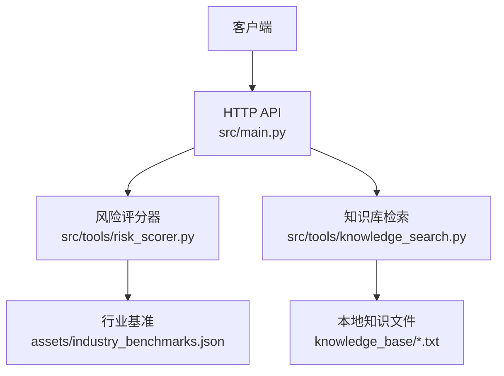
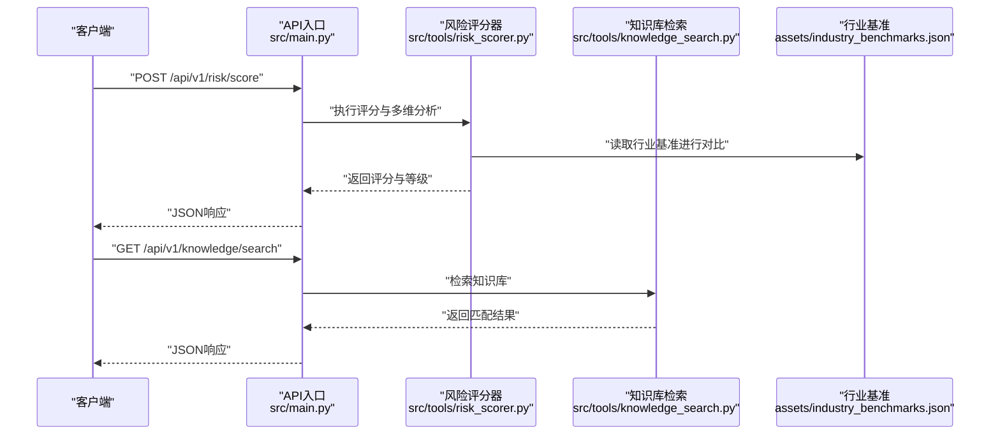
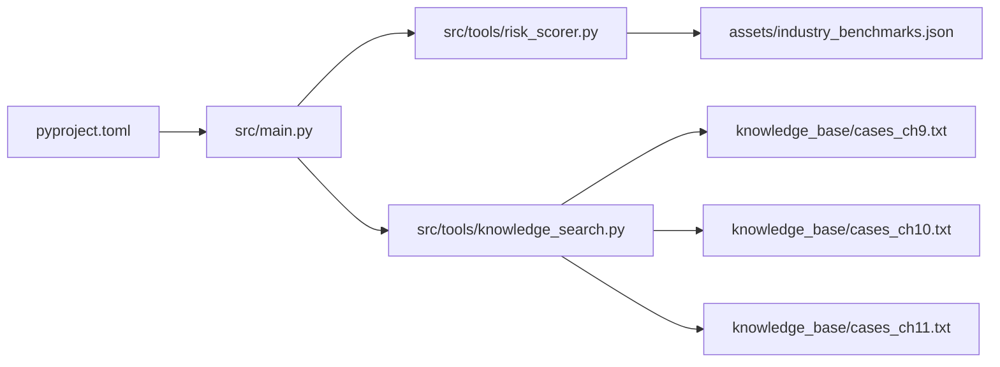

# 风险评估API

<cite>
**本文引用的文件**   
- [src/tools/risk_scorer.py](file://src/tools/risk_scorer.py)
- [src/tools/knowledge_search.py](file://src/tools/knowledge_search.py)
- [assets/industry_benchmarks.json](file://assets/industry_benchmarks.json)
- [knowledge_base/cases_ch9.txt](file://knowledge_base/cases_ch9.txt)
- [knowledge_base/cases_ch10.txt](file://knowledge_base/cases_ch10.txt)
- [knowledge_base/cases_ch11.txt](file://knowledge_base/cases_ch11.txt)
- [src/main.py](file://src/main.py)
- [pyproject.toml](file://pyproject.toml)
</cite>

## 目录
1. [简介](#简介)
2. [项目结构](#项目结构)
3. [核心组件](#核心组件)
4. [架构总览](#架构总览)
5. [详细接口说明](#详细接口说明)
6. [依赖分析](#依赖分析)
7. [性能考虑](#性能考虑)
8. [故障排查指南](#故障排查指南)
9. [结论](#结论)
10. [附录](#附录)

## 简介
本文件为“风险评估API”的完整接口文档，覆盖风险评分计算、多维度风险分析、异常检测等核心能力。文档包含：
- HTTP方法、URL路径与请求参数配置
- 风险评估模型参数设置、评分标准定义、风险等级划分规则
- 完整的请求与响应示例（含不同风险等级）
- 自定义评估规则的扩展方法与配置选项
- 与知识库关联查询接口及行业基准对比功能
- 性能调优建议与最佳实践

## 项目结构
本项目采用工具化分层组织，风险评估相关能力集中在工具层，并通过主入口暴露HTTP服务。关键文件职责如下：
- src/tools/risk_scorer.py：风险评分与多维度分析的核心实现
- src/tools/knowledge_search.py：知识库检索与关联查询
- assets/industry_benchmarks.json：行业基准数据
- knowledge_base/*.txt：案例与知识片段
- src/main.py：Web服务入口与路由注册
- pyproject.toml：依赖与元信息

图表来源
- [src/main.py](file://src/main.py)
- [src/tools/risk_scorer.py](file://src/tools/risk_scorer.py)
- [src/tools/knowledge_search.py](file://src/tools/knowledge_search.py)
- [assets/industry_benchmarks.json](file://assets/industry_benchmarks.json)
- [knowledge_base/cases_ch9.txt](file://knowledge_base/cases_ch9.txt)
- [knowledge_base/cases_ch10.txt](file://knowledge_base/cases_ch10.txt)
- [knowledge_base/cases_ch11.txt](file://knowledge_base/cases_ch11.txt)

章节来源
- [src/main.py](file://src/main.py)
- [src/tools/risk_scorer.py](file://src/tools/risk_scorer.py)
- [src/tools/knowledge_search.py](file://src/tools/knowledge_search.py)
- [assets/industry_benchmarks.json](file://assets/industry_benchmarks.json)
- [knowledge_base/cases_ch9.txt](file://knowledge_base/cases_ch9.txt)
- [knowledge_base/cases_ch10.txt](file://knowledge_base/cases_ch10.txt)
- [knowledge_base/cases_ch11.txt](file://knowledge_base/cases_ch11.txt)

## 核心组件
- 风险评分器：负责指标采集、权重配置、评分计算、风险等级判定与异常检测。
- 知识库检索：提供基于关键词或语义的检索能力，返回相关案例与上下文。
- 行业基准：提供同业的指标参考值，用于横向对比与相对风险定位。

章节来源
- [src/tools/risk_scorer.py](file://src/tools/risk_scorer.py)
- [src/tools/knowledge_search.py](file://src/tools/knowledge_search.py)
- [assets/industry_benchmarks.json](file://assets/industry_benchmarks.json)

## 架构总览
下图展示从客户端发起请求到返回结果的端到端流程，包括评分计算、知识库检索与基准对比。

图表来源
- [src/main.py](file://src/main.py)
- [src/tools/risk_scorer.py](file://src/tools/risk_scorer.py)
- [src/tools/knowledge_search.py](file://src/tools/knowledge_search.py)
- [assets/industry_benchmarks.json](file://assets/industry_benchmarks.json)

## 详细接口说明

### 通用约定
- 基础路径：/api/v1
- 内容类型：application/json
- 字符编码：UTF-8
- 错误码：统一使用HTTP状态码；业务错误在响应体中携带code/message字段

### 接口一：风险评分与多维分析
- 方法：POST
- 路径：/api/v1/risk/score
- 描述：对输入的业务数据进行风险评分、多维度分析与异常检测，并输出风险等级与建议。

请求参数（JSON）
- business_id: string，必填，业务标识
- industry: string，可选，行业分类（用于基准对比）
- metrics: object，必填，指标对象，键名见“评分标准定义”
- weights: object，可选，指标权重覆盖
- thresholds: object，可选，阈值覆盖
- anomaly_config: object，可选，异常检测配置
- include_knowledge: boolean，可选，是否附带知识库匹配结果
- include_benchmark: boolean，可选，是否附带行业基准对比

评分标准定义（metrics字段键名）
- revenue_growth_rate: number，营业收入增长率
- gross_margin: number，毛利率
- operating_cash_flow_ratio: number，经营活动现金流比率
- debt_to_equity: number，资产负债率
- current_ratio: number，流动比率
- inventory_turnover: number，存货周转率
- receivables_turnover: number，应收账款周转率
- r_and_d_intensity: number，研发强度
- customer_concentration: number，客户集中度
- supplier_concentration: number，供应商集中度
- employee_turnover_rate: number，员工流失率
- compliance_violations_count: number，合规违规次数
- audit_qualifications: string，审计意见类型（如“无保留意见”、“带强调事项段”等）
- macro_pressure_index: number，宏观压力指数（可选）

权重与阈值
- weights: 各指标权重之和应为1.0；未指定则使用默认权重
- thresholds: 可覆盖默认阈值以调整风险等级边界

异常检测配置（anomaly_config）
- method: string，可选，取值范围：zscore、iqr、isolation_forest（若可用）
- sensitivity: number，可选，敏感度系数（0~1）
- window_size: integer，可选，时间窗口大小（用于时序异常）

响应字段
- business_id: string
- score: number，综合风险评分（0~100）
- level: string，风险等级（低/中/高/极高）
- dimensions: object，维度得分与贡献度
- anomalies: array，异常项列表
- benchmark_comparison: object，行业基准对比（当include_benchmark=true时）
- knowledge_matches: array，知识库匹配结果（当include_knowledge=true时）
- metadata: object，处理元信息（耗时、版本等）

风险等级划分规则
- 低：score < 30
- 中：30 ≤ score < 60
- 高：60 ≤ score < 85
- 极高：score ≥ 85

请求示例
{
  "business_id": "BIZ-2026-001",
  "industry": "制造业",
  "metrics": {
    "revenue_growth_rate": 0.12,
    "gross_margin": 0.28,
    "operating_cash_flow_ratio": 0.15,
    "debt_to_equity": 0.65,
    "current_ratio": 1.3,
    "inventory_turnover": 4.2,
    "receivables_turnover": 6.5,
    "r_and_d_intensity": 0.04,
    "customer_concentration": 0.35,
    "supplier_concentration": 0.28,
    "employee_turnover_rate": 0.12,
    "compliance_violations_count": 1,
    "audit_qualifications": "无保留意见",
    "macro_pressure_index": 0.6
  },
  "weights": {},
  "thresholds": {},
  "anomaly_config": {
    "method": "zscore",
    "sensitivity": 0.8,
    "window_size": 4
  },
  "include_knowledge": true,
  "include_benchmark": true
}

响应示例（低风险）
{
  "business_id": "BIZ-2026-001",
  "score": 22,
  "level": "低",
  "dimensions": {
    "财务健康": {"score": 20, "weight": 0.4},
    "运营效率": {"score": 25, "weight": 0.2},
    "治理与合规": {"score": 18, "weight": 0.2},
    "外部与环境": {"score": 24, "weight": 0.2}
  },
  "anomalies": [],
  "benchmark_comparison": {
    "industry": "制造业",
    "percentile": 35,
    "gap_to_median": -0.05
  },
  "knowledge_matches": [],
  "metadata": {"elapsed_ms": 120, "version": "1.0.0"}
}

响应示例（高风险）
{
  "business_id": "BIZ-2026-002",
  "score": 72,
  "level": "高",
  "dimensions": {
    "财务健康": {"score": 75, "weight": 0.4},
    "运营效率": {"score": 68, "weight": 0.2},
    "治理与合规": {"score": 80, "weight": 0.2},
    "外部与环境": {"score": 65, "weight": 0.2}
  },
  "anomalies": [
    {"metric": "operating_cash_flow_ratio", "value": 0.02, "reason": "显著低于历史均值"},
    {"metric": "compliance_violations_count", "value": 3, "reason": "超过阈值"}
  ],
  "benchmark_comparison": {
    "industry": "制造业",
    "percentile": 82,
    "gap_to_median": 0.12
  },
  "knowledge_matches": [
    {"case_id": "CASE-CH10-001", "title": "现金流断裂预警案例", "relevance": 0.87}
  ],
  "metadata": {"elapsed_ms": 145, "version": "1.0.0"}
}

章节来源
- [src/tools/risk_scorer.py](file://src/tools/risk_scorer.py)
- [assets/industry_benchmarks.json](file://assets/industry_benchmarks.json)

### 接口二：知识库关联查询
- 方法：GET
- 路径：/api/v1/knowledge/search
- 描述：根据关键词或主题检索知识库，返回相关案例与片段，便于辅助风险评估与归因分析。

查询参数
- q: string，必填，检索关键词或主题
- top_k: integer，可选，返回条数上限（默认5）
- scope: string，可选，限定范围（如“ch9”、“ch10”、“ch11”），不传则全库检索

响应字段
- query: string
- results: array，每项包含case_id、title、snippet、relevance
- total: integer

请求示例
/api/v1/knowledge/search?q=现金流&top_k=3&scope=ch10

响应示例
{
  "query": "现金流",
  "results": [
    {"case_id": "CASE-CH10-001", "title": "现金流断裂预警案例", "snippet": "...", "relevance": 0.87},
    {"case_id": "CASE-CH10-002", "title": "营运资金优化实践", "snippet": "...", "relevance": 0.72}
  ],
  "total": 2
}

章节来源
- [src/tools/knowledge_search.py](file://src/tools/knowledge_search.py)
- [knowledge_base/cases_ch9.txt](file://knowledge_base/cases_ch9.txt)
- [knowledge_base/cases_ch10.txt](file://knowledge_base/cases_ch10.txt)
- [knowledge_base/cases_ch11.txt](file://knowledge_base/cases_ch11.txt)

### 接口三：行业基准对比
- 方法：GET
- 路径：/api/v1/benchmark/compare
- 描述：获取指定行业的基准指标与分位数，用于横向对比与相对风险定位。

查询参数
- industry: string，必填，行业名称
- metrics: array of string，可选，需要对比的指标键名；不传则返回全部

响应字段
- industry: string
- metrics: object，各指标的median、p25、p75、p90
- notes: string，数据来源与更新时间

请求示例
/api/v1/benchmark/compare?industry=制造业&metrics=revenue_growth_rate,gross_margin

响应示例
{
  "industry": "制造业",
  "metrics": {
    "revenue_growth_rate": {"median": 0.10, "p25": 0.04, "p75": 0.16, "p90": 0.22},
    "gross_margin": {"median": 0.25, "p25": 0.18, "p75": 0.32, "p90": 0.38}
  },
  "notes": "基于内部统计与公开数据整理，更新于2026-01-01"
}

章节来源
- [assets/industry_benchmarks.json](file://assets/industry_benchmarks.json)

### 接口四：自定义评估规则扩展
- 方法：POST
- 路径：/api/v1/rules/register
- 描述：注册自定义评估规则，支持新增维度、权重策略与阈值策略，以便动态扩展评分逻辑。

请求参数（JSON）
- rule_name: string，必填，规则名称
- type: string，必填，规则类型（dimension/weight/threshold）
- config: object，必填，规则配置详情
- priority: integer，可选，优先级（数值越小优先级越高）

响应字段
- rule_id: string
- status: string，创建状态（created/updated/deprecated）
- message: string

请求示例
{
  "rule_name": "供应链集中度惩罚",
  "type": "threshold",
  "config": {
    "metric": "supplier_concentration",
    "upper_bound": 0.4,
    "penalty_score": 10
  },
  "priority": 10
}

响应示例
{
  "rule_id": "RULE-2026-001",
  "status": "created",
  "message": "规则已注册"
}

章节来源
- [src/tools/risk_scorer.py](file://src/tools/risk_scorer.py)

## 依赖分析
- 外部依赖：由pyproject.toml声明，确保运行环境具备必要的包与版本约束。
- 模块耦合：
  - main.py作为HTTP入口，调用risk_scorer与knowledge_search
  - risk_scorer依赖industry_benchmarks.json进行基准对比
  - knowledge_search依赖knowledge_base下的文本文件

图表来源
- [pyproject.toml](file://pyproject.toml)
- [src/main.py](file://src/main.py)
- [src/tools/risk_scorer.py](file://src/tools/risk_scorer.py)
- [src/tools/knowledge_search.py](file://src/tools/knowledge_search.py)
- [assets/industry_benchmarks.json](file://assets/industry_benchmarks.json)
- [knowledge_base/cases_ch9.txt](file://knowledge_base/cases_ch9.txt)
- [knowledge_base/cases_ch10.txt](file://knowledge_base/cases_ch10.txt)
- [knowledge_base/cases_ch11.txt](file://knowledge_base/cases_ch11.txt)

章节来源
- [pyproject.toml](file://pyproject.toml)
- [src/main.py](file://src/main.py)
- [src/tools/risk_scorer.py](file://src/tools/risk_scorer.py)
- [src/tools/knowledge_search.py](file://src/tools/knowledge_search.py)
- [assets/industry_benchmarks.json](file://assets/industry_benchmarks.json)
- [knowledge_base/cases_ch9.txt](file://knowledge_base/cases_ch9.txt)
- [knowledge_base/cases_ch10.txt](file://knowledge_base/cases_ch10.txt)
- [knowledge_base/cases_ch11.txt](file://knowledge_base/cases_ch11.txt)

## 性能考虑
- 批处理与缓存
  - 对高频指标（如行业基准）进行内存缓存，减少重复I/O
  - 批量评分请求合并处理，降低系统开销
- 索引与检索优化
  - 对知识库建立倒排索引或向量化索引，提升检索速度
  - 限制top_k与scope，避免全库扫描
- 计算复杂度
  - 评分计算为O(n)，n为指标数量；权重与阈值覆盖为常数级操作
  - 异常检测按method不同复杂度不同，zscore为O(n)，iqr为O(n log n)，isolation_forest近似线性但常数较大
- 资源与并发
  - 合理设置线程池或进程池，避免阻塞型I/O影响吞吐
  - 监控CPU与内存占用，必要时水平扩展实例

[本节为通用指导，无需特定文件引用]

## 故障排查指南
- 常见错误
  - 参数缺失或类型错误：检查metrics键名与数值范围
  - 权重和不等于1.0：自动归一化或拒绝请求，需修正weights
  - 阈值越界：确认thresholds上下限合理
  - 知识库为空：检查knowledge_base文件是否存在且可读
- 诊断步骤
  - 启用日志记录，查看请求参数与中间结果
  - 逐步关闭include_knowledge与include_benchmark，定位慢点
  - 使用benchmark接口验证行业数据完整性
- 恢复建议
  - 回滚最近一次规则注册
  - 重置缓存与索引，重建知识库索引

章节来源
- [src/tools/risk_scorer.py](file://src/tools/risk_scorer.py)
- [src/tools/knowledge_search.py](file://src/tools/knowledge_search.py)

## 结论
本API围绕风险评分、多维分析、异常检测与知识库关联查询构建，结合行业基准对比形成闭环评估体系。通过灵活的权重与阈值配置以及可扩展的规则注册机制，可满足多行业、多场景的风险评估需求。在生产环境中建议配合缓存、索引与监控策略，以获得稳定高效的性能表现。

## 附录

### 风险等级与维度映射
- 维度分组
  - 财务健康：收入增长、盈利能力、现金流、杠杆与流动性
  - 运营效率：存货与应收周转、成本与费用控制
  - 治理与合规：审计意见、合规违规、内控有效性
  - 外部与环境：宏观压力、市场波动、政策变化
- 等级映射
  - 低：<30
  - 中：30~59
  - 高：60~84
  - 极高：≥85

章节来源
- [src/tools/risk_scorer.py](file://src/tools/risk_scorer.py)