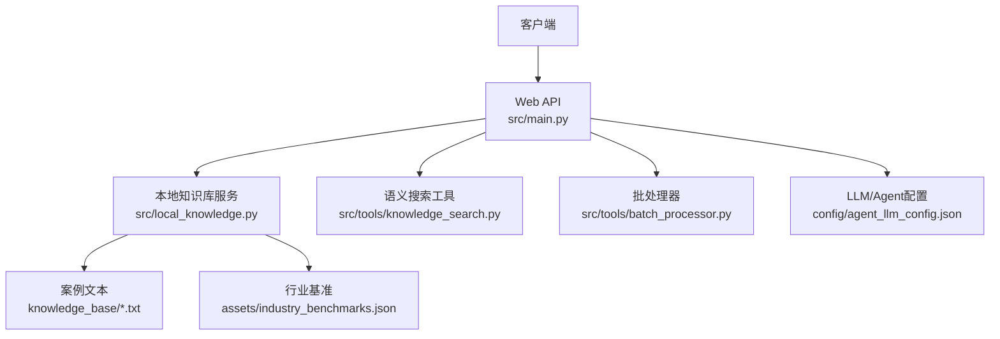
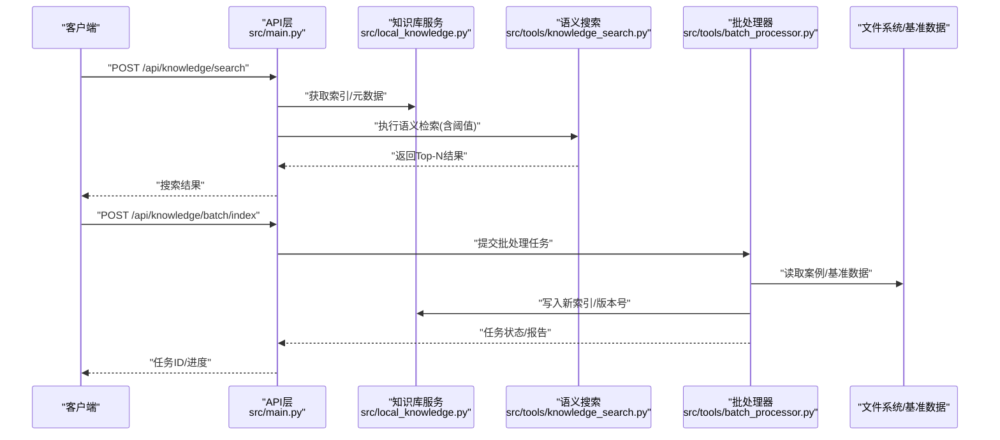
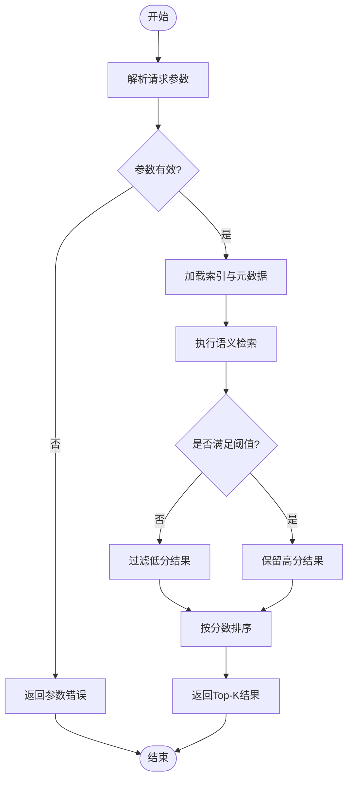
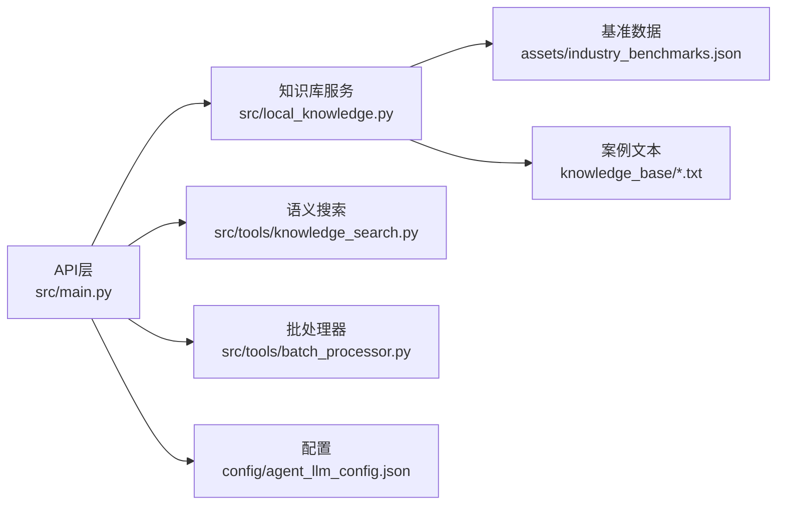

# 知识库API

<cite>
**本文引用的文件**   
- [src/main.py](file://src/main.py)
- [src/local_knowledge.py](file://src/local_knowledge.py)
- [src/tools/knowledge_search.py](file://src/tools/knowledge_search.py)
- [src/tools/batch_processor.py](file://src/tools/batch_processor.py)
- [scripts/init_knowledge_base.py](file://scripts/init_knowledge_base.py)
- [assets/industry_benchmarks.json](file://assets/industry_benchmarks.json)
- [knowledge_base/cases_ch9.txt](file://knowledge_base/cases_ch9.txt)
- [knowledge_base/cases_ch10.txt](file://knowledge_base/cases_ch10.txt)
- [knowledge_base/cases_ch11.txt](file://knowledge_base/cases_ch11.txt)
- [config/agent_llm_config.json](file://config/agent_llm_config.json)
</cite>

## 目录
1. [简介](#简介)
2. [项目结构](#项目结构)
3. [核心组件](#核心组件)
4. [架构总览](#架构总览)
5. [详细组件分析](#详细组件分析)
6. [依赖关系分析](#依赖关系分析)
7. [性能与缓存策略](#性能与缓存策略)
8. [故障排查指南](#故障排查指南)
9. [结论](#结论)
10. [附录：接口清单与参数说明](#附录接口清单与参数说明)

## 简介
本仓库提供一套面向审计与风控场景的知识库管理API，涵盖案例检索、行业基准查询、知识更新、语义搜索、批处理索引构建、多语言支持与关键词提取、知识图谱关系查询遍历、版本管理与增量更新、质量评估与反馈收集等能力。文档旨在帮助开发者快速理解并集成这些能力，同时给出配置建议与优化方案。

## 项目结构
- 应用入口与路由定义位于 src/main.py
- 本地知识库读写与加载逻辑位于 src/local_knowledge.py
- 语义搜索工具封装在 src/tools/knowledge_search.py
- 批处理任务（批量索引构建/更新）在 src/tools/batch_processor.py
- 初始化脚本 scripts/init_knowledge_base.py 用于准备初始数据与索引
- 行业基准数据 assets/industry_benchmarks.json
- 案例文本 knowledge_base/*.txt
- LLM/Agent 相关配置 config/agent_llm_config.json

图表来源
- [src/main.py](file://src/main.py)
- [src/local_knowledge.py](file://src/local_knowledge.py)
- [src/tools/knowledge_search.py](file://src/tools/knowledge_search.py)
- [src/tools/batch_processor.py](file://src/tools/batch_processor.py)
- [assets/industry_benchmarks.json](file://assets/industry_benchmarks.json)
- [knowledge_base/cases_ch9.txt](file://knowledge_base/cases_ch9.txt)
- [knowledge_base/cases_ch10.txt](file://knowledge_base/cases_ch10.txt)
- [knowledge_base/cases_ch11.txt](file://knowledge_base/cases_ch11.txt)
- [config/agent_llm_config.json](file://config/agent_llm_config.json)

章节来源
- [src/main.py](file://src/main.py)
- [src/local_knowledge.py](file://src/local_knowledge.py)
- [src/tools/knowledge_search.py](file://src/tools/knowledge_search.py)
- [src/tools/batch_processor.py](file://src/tools/batch_processor.py)
- [scripts/init_knowledge_base.py](file://scripts/init_knowledge_base.py)
- [assets/industry_benchmarks.json](file://assets/industry_benchmarks.json)
- [knowledge_base/cases_ch9.txt](file://knowledge_base/cases_ch9.txt)
- [knowledge_base/cases_ch10.txt](file://knowledge_base/cases_ch10.txt)
- [knowledge_base/cases_ch11.txt](file://knowledge_base/cases_ch11.txt)
- [config/agent_llm_config.json](file://config/agent_llm_config.json)

## 核心组件
- Web API层：统一暴露REST接口，负责请求解析、鉴权、路由分发与响应组装。
- 知识库服务：负责案例文本读取、索引构建、版本控制、增量更新与元数据维护。
- 语义搜索工具：封装向量检索、相似度阈值过滤、多语言分词与关键词提取。
- 批处理器：提供批量导入、批量索引构建与并发控制。
- 配置中心：集中管理LLM/Agent与搜索算法参数。

章节来源
- [src/main.py](file://src/main.py)
- [src/local_knowledge.py](file://src/local_knowledge.py)
- [src/tools/knowledge_search.py](file://src/tools/knowledge_search.py)
- [src/tools/batch_processor.py](file://src/tools/batch_processor.py)
- [config/agent_llm_config.json](file://config/agent_llm_config.json)

## 架构总览
系统采用“API + 领域服务 + 工具库”的分层架构。API层仅做编排与校验，核心业务下沉至知识库服务与搜索工具；批处理器作为后台任务入口，支持异步构建与增量更新；配置通过JSON集中管理，便于环境切换与灰度发布。

图表来源
- [src/main.py](file://src/main.py)
- [src/local_knowledge.py](file://src/local_knowledge.py)
- [src/tools/knowledge_search.py](file://src/tools/knowledge_search.py)
- [src/tools/batch_processor.py](file://src/tools/batch_processor.py)
- [assets/industry_benchmarks.json](file://assets/industry_benchmarks.json)
- [knowledge_base/cases_ch9.txt](file://knowledge_base/cases_ch9.txt)
- [knowledge_base/cases_ch10.txt](file://knowledge_base/cases_ch10.txt)
- [knowledge_base/cases_ch11.txt](file://knowledge_base/cases_ch11.txt)

## 详细组件分析

### 案例检索与语义搜索
- 功能要点
  - 支持自然语言查询，返回与查询意图最相关的案例片段或摘要。
  - 可配置相似度阈值，过滤低置信度结果，提升召回精准度。
  - 支持多语言输入，内部进行语言识别与归一化。
  - 支持关键词提取，辅助用户构造更精准的查询。
- 关键流程
  - 接收查询与参数（如top_k、threshold、language、keywords）。
  - 调用知识库服务获取当前索引与元数据。
  - 使用语义搜索工具进行向量检索与阈值过滤。
  - 返回排序后的结果及评分、命中关键词等信息。
- 参数说明
  - query: 查询语句
  - top_k: 返回条数
  - threshold: 相似度阈值（0~1），低于该值的结果将被过滤
  - language: 指定语言或auto自动检测
  - keywords: 可选的关键词列表，用于增强检索权重
- 错误处理
  - 无效参数返回明确错误码与提示
  - 索引缺失时引导先执行索引构建
  - 检索异常记录日志并返回降级结果

图表来源
- [src/main.py](file://src/main.py)
- [src/local_knowledge.py](file://src/local_knowledge.py)
- [src/tools/knowledge_search.py](file://src/tools/knowledge_search.py)

章节来源
- [src/main.py](file://src/main.py)
- [src/local_knowledge.py](file://src/local_knowledge.py)
- [src/tools/knowledge_search.py](file://src/tools/knowledge_search.py)

### 行业基准查询
- 功能要点
  - 提供行业基准数据的查询接口，支持按行业、指标维度筛选。
  - 返回基准值、时间范围、数据来源等元信息。
- 典型用法
  - 传入行业代码或名称，以及指标列表，返回对应基准条目。
  - 支持分页与排序，便于前端展示。
- 数据源
  - 基准数据来源于静态资源文件，便于离线部署与一致性保障。

章节来源
- [src/main.py](file://src/main.py)
- [assets/industry_benchmarks.json](file://assets/industry_benchmarks.json)

### 知识更新与版本管理
- 功能要点
  - 支持新增、修改、删除知识条目，并生成新版本。
  - 提供版本回滚与对比能力，确保变更可追溯。
  - 增量更新机制：仅对变更条目重建索引，减少全量开销。
- 流程概览
  - 提交变更集（新增/修改/删除）
  - 计算差异并生成新版本号
  - 触发增量索引构建
  - 更新元数据与历史版本表
- 注意事项
  - 大文件更新建议走批处理通道
  - 版本命名遵循语义化版本规范

章节来源
- [src/local_knowledge.py](file://src/local_knowledge.py)
- [src/tools/batch_processor.py](file://src/tools/batch_processor.py)

### 批处理索引构建与更新
- 功能要点
  - 批量导入案例与基准数据，构建或更新索引。
  - 支持并发控制、断点续跑与失败重试。
  - 输出构建报告（成功/失败统计、耗时、错误明细）。
- 使用方式
  - 提交批处理任务，返回任务ID
  - 轮询任务状态，获取进度与最终报告
- 适用场景
  - 首次全量构建
  - 定期增量更新
  - 数据迁移与清洗后重建

章节来源
- [src/tools/batch_processor.py](file://src/tools/batch_processor.py)
- [scripts/init_knowledge_base.py](file://scripts/init_knowledge_base.py)

### 多语言支持与关键词提取
- 多语言支持
  - 自动识别输入语言，必要时进行翻译或归一化处理。
  - 针对不同语言选择合适分词器与停用词表。
- 关键词提取
  - 基于词频与位置特征抽取候选关键词
  - 结合领域词典与TF-IDF加权，输出高价值关键词
  - 支持自定义权重与过滤规则

章节来源
- [src/tools/knowledge_search.py](file://src/tools/knowledge_search.py)

### 知识图谱关系查询与遍历
- 功能要点
  - 以实体为中心，查询其关联关系与邻居节点。
  - 支持深度限制、关系类型过滤与路径回溯。
- 典型操作
  - 根据实体ID获取邻接表
  - 按关系类型遍历N跳邻居
  - 导出子图用于可视化或下游分析

章节来源
- [src/local_knowledge.py](file://src/local_knowledge.py)

### 质量评估与反馈收集
- 质量评估
  - 基于人工标注与模型打分，计算准确率、召回率、F1等指标。
  - 支持按主题、行业、时间窗口聚合评估结果。
- 反馈收集
  - 用户对检索结果进行点赞/踩、纠错标注。
  - 反馈数据进入训练闭环，驱动模型迭代。

章节来源
- [src/local_knowledge.py](file://src/local_knowledge.py)

## 依赖关系分析
- 模块耦合
  - API层依赖知识库服务与搜索工具，保持低耦合与高内聚。
  - 批处理器独立于API，通过任务队列或进程间通信协作。
- 外部依赖
  - 配置文件集中管理，避免硬编码。
  - 静态数据（基准、案例）通过只读方式访问，保证稳定性。

图表来源
- [src/main.py](file://src/main.py)
- [src/local_knowledge.py](file://src/local_knowledge.py)
- [src/tools/knowledge_search.py](file://src/tools/knowledge_search.py)
- [src/tools/batch_processor.py](file://src/tools/batch_processor.py)
- [assets/industry_benchmarks.json](file://assets/industry_benchmarks.json)
- [knowledge_base/cases_ch9.txt](file://knowledge_base/cases_ch9.txt)
- [knowledge_base/cases_ch10.txt](file://knowledge_base/cases_ch10.txt)
- [knowledge_base/cases_ch11.txt](file://knowledge_base/cases_ch11.txt)
- [config/agent_llm_config.json](file://config/agent_llm_config.json)

章节来源
- [src/main.py](file://src/main.py)
- [src/local_knowledge.py](file://src/local_knowledge.py)
- [src/tools/knowledge_search.py](file://src/tools/knowledge_search.py)
- [src/tools/batch_processor.py](file://src/tools/batch_processor.py)
- [assets/industry_benchmarks.json](file://assets/industry_benchmarks.json)
- [knowledge_base/cases_ch9.txt](file://knowledge_base/cases_ch9.txt)
- [knowledge_base/cases_ch10.txt](file://knowledge_base/cases_ch10.txt)
- [knowledge_base/cases_ch11.txt](file://knowledge_base/cases_ch11.txt)
- [config/agent_llm_config.json](file://config/agent_llm_config.json)

## 性能与缓存策略
- 缓存设计
  - 热点查询结果短期缓存，降低重复检索成本。
  - 索引与元数据常驻内存，避免频繁磁盘IO。
  - 基准数据预加载，减少首查延迟。
- 并发与限流
  - 批处理任务支持并发度控制，防止资源争用。
  - API层设置QPS上限与超时保护。
- 索引优化
  - 增量更新优先，全量重建仅在必要时执行。
  - 分片存储与并行检索，提升吞吐。
- 监控与告警
  - 记录P95/P99延迟、错误率与资源占用。
  - 阈值告警与自动熔断，保障稳定性。

[本节为通用性能指导，不直接分析具体文件]

## 故障排查指南
- 常见问题
  - 索引缺失：确认已完成初始化或批处理构建。
  - 阈值过高导致零结果：适当降低相似度阈值或扩大top_k。
  - 多语言识别失败：检查语言包与分词器配置。
  - 批处理失败：查看任务报告中的错误明细与重试次数。
- 定位方法
  - 开启调试日志，关注关键步骤耗时与异常堆栈。
  - 使用最小数据集复现问题，逐步缩小范围。
  - 核对配置文件与环境变量，确保一致。

章节来源
- [src/main.py](file://src/main.py)
- [src/tools/batch_processor.py](file://src/tools/batch_processor.py)

## 结论
本知识库API围绕“检索—更新—评估—优化”的闭环设计，提供从语义搜索到批处理构建的一体化能力。通过合理的阈值配置、增量更新与缓存策略，可在保证效果的同时获得良好的性能表现。建议在生产环境启用监控与告警，持续收集反馈并迭代模型与索引。

[本节为总结性内容，不直接分析具体文件]

## 附录：接口清单与参数说明
- 案例检索
  - 方法：POST
  - 路径：/api/knowledge/search
  - 参数：query, top_k, threshold, language, keywords
  - 返回：结果列表（含分数、来源、关键词）
- 行业基准查询
  - 方法：GET
  - 路径：/api/benchmarks
  - 参数：industry, metrics, page, size
  - 返回：基准条目集合
- 知识更新
  - 方法：POST
  - 路径：/api/knowledge/update
  - 参数：changes（新增/修改/删除）、version_policy
  - 返回：新版本号与变更摘要
- 批处理索引构建
  - 方法：POST
  - 路径：/api/knowledge/batch/index
  - 参数：source_paths, concurrency, strategy（full/incremental）
  - 返回：task_id
  - 查询状态：GET /api/knowledge/batch/status?task_id=...
- 知识图谱关系查询
  - 方法：GET
  - 路径：/api/graph/entities/{entity_id}/neighbors
  - 参数：depth, relation_types
  - 返回：邻接节点与关系边
- 质量评估与反馈
  - 方法：POST
  - 路径：/api/evaluation/feedback
  - 参数：query, result_ids, rating, comment
  - 返回：ack与反馈ID

章节来源
- [src/main.py](file://src/main.py)
- [src/local_knowledge.py](file://src/local_knowledge.py)
- [src/tools/knowledge_search.py](file://src/tools/knowledge_search.py)
- [src/tools/batch_processor.py](file://src/tools/batch_processor.py)
- [assets/industry_benchmarks.json](file://assets/industry_benchmarks.json)
- [knowledge_base/cases_ch9.txt](file://knowledge_base/cases_ch9.txt)
- [knowledge_base/cases_ch10.txt](file://knowledge_base/cases_ch10.txt)
- [knowledge_base/cases_ch11.txt](file://knowledge_base/cases_ch11.txt)
- [config/agent_llm_config.json](file://config/agent_llm_config.json)