# 认证与安全

<cite>
**本文引用的文件**   
- [src/main.py](file://src/main.py)
- [config/agent_llm_config.json](file://config/agent_llm_config.json)
- [scripts/load_env.py](file://scripts/load_env.py)
- [scripts/load_env.sh](file://scripts/load_env.sh)
- [Dockerfile](file://Dockerfile)
- [pyproject.toml](file://pyproject.toml)
- [uv.lock](file://uv.lock)
</cite>

## 目录
1. [简介](#简介)
2. [项目结构](#项目结构)
3. [核心组件](#核心组件)
4. [架构总览](#架构总览)
5. [详细组件分析](#详细组件分析)
6. [依赖分析](#依赖分析)
7. [性能考虑](#性能考虑)
8. [故障排查指南](#故障排查指南)
9. [结论](#结论)
10. [附录](#附录)

## 简介
本文件面向“认证与安全”主题，围绕以下目标提供系统化说明：JWT令牌认证流程、OAuth2集成方案、API密钥管理；用户权限模型与角色访问控制（RBAC）、资源隔离；安全头配置、HTTPS强制启用与CORS策略；输入验证、SQL注入防护与XSS防护；API限流、防重放攻击与DDoS防护；敏感数据加密存储与传输安全；安全审计日志与威胁检测；安全漏洞扫描与渗透测试指导。

需要特别说明的是：当前仓库未包含显式的认证与安全中间件实现代码。因此，本节文档在“现状评估”的基础上，给出“推荐设计与落地指引”，并标注哪些内容属于现有实现，哪些为建议增强。所有建议均遵循通用最佳实践，便于后续在现有工程结构中扩展。

## 项目结构
从仓库结构看，应用入口位于 src/main.py，配置集中在 config/agent_llm_config.json，环境加载脚本位于 scripts/ 下，容器化构建使用 Dockerfile，依赖声明在 pyproject.toml 与 uv.lock。

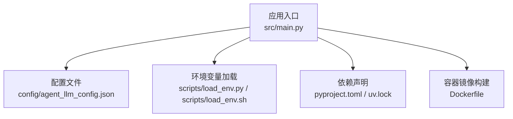

图表来源
- [src/main.py](file://src/main.py)
- [config/agent_llm_config.json](file://config/agent_llm_config.json)
- [scripts/load_env.py](file://scripts/load_env.py)
- [scripts/load_env.sh](file://scripts/load_env.sh)
- [Dockerfile](file://Dockerfile)
- [pyproject.toml](file://pyproject.toml)
- [uv.lock](file://uv.lock)

章节来源
- [src/main.py](file://src/main.py)
- [config/agent_llm_config.json](file://config/agent_llm_config.json)
- [scripts/load_env.py](file://scripts/load_env.py)
- [scripts/load_env.sh](file://scripts/load_env.sh)
- [Dockerfile](file://Dockerfile)
- [pyproject.toml](file://pyproject.toml)
- [uv.lock](file://uv.lock)

## 核心组件
- 应用入口与启动流程：负责初始化配置、注册路由与中间件、启动服务。当前未见内置鉴权中间件或网关层。
- 配置与环境变量：通过 JSON 配置与环境变量加载脚本进行参数注入，适合承载安全相关开关（如是否强制HTTPS、CORS白名单等）。
- 依赖管理：由 pyproject.toml 与 uv.lock 管理第三方库，可引入安全相关依赖（如速率限制、请求校验、审计日志等）。
- 容器化部署：Dockerfile 定义运行环境与暴露端口，可在镜像构建阶段注入证书与密钥，或在反向代理层统一处理TLS终止。

章节来源
- [src/main.py](file://src/main.py)
- [config/agent_llm_config.json](file://config/agent_llm_config.json)
- [scripts/load_env.py](file://scripts/load_env.py)
- [scripts/load_env.sh](file://scripts/load_env.sh)
- [pyproject.toml](file://pyproject.toml)
- [uv.lock](file://uv.lock)
- [Dockerfile](file://Dockerfile)

## 架构总览
下图展示推荐的端到端安全架构，涵盖客户端、反向代理、应用服务、认证服务、数据库与对象存储等关键节点。

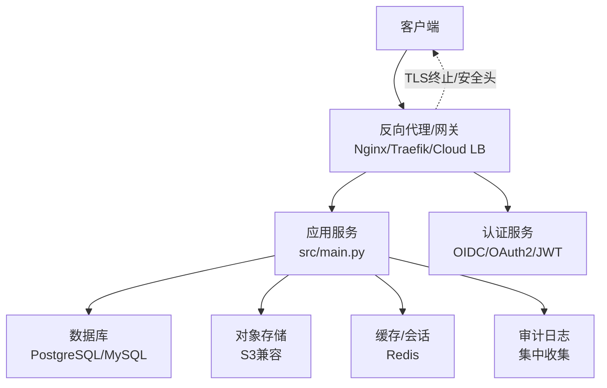

图表来源
- [src/main.py](file://src/main.py)
- [Dockerfile](file://Dockerfile)
- [config/agent_llm_config.json](file://config/agent_llm_config.json)

## 详细组件分析

### JWT令牌认证流程
- 登录与签发：认证服务校验凭据后签发JWT（含子标识、过期时间、签名），返回给客户端。
- 访问控制：应用服务在受保护接口前校验JWT签名、有效期与必要声明，解析用户身份与权限。
- 刷新机制：支持短期访问令牌+长期刷新令牌的组合，降低泄露风险。
- 撤销与黑名单：结合缓存或数据库维护令牌黑名单，支持主动失效。

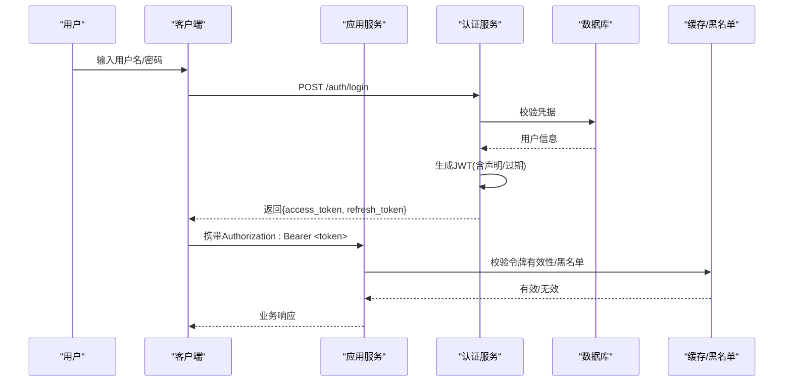

图表来源
- [src/main.py](file://src/main.py)
- [config/agent_llm_config.json](file://config/agent_llm_config.json)

章节来源
- [src/main.py](file://src/main.py)
- [config/agent_llm_config.json](file://config/agent_llm_config.json)

### OAuth2集成方案
- 授权模式：推荐使用 Authorization Code + PKCE（适用于Web/移动端）；服务端对内部服务调用可使用 Client Credentials。
- 集成要点：
  - 配置授权服务器地址、客户端ID/密钥、回调URL、作用域。
  - 在应用侧实现授权码交换、令牌获取与刷新、用户信息拉取。
  - 将外部身份映射到本地角色与权限。
- 安全建议：
  - 严格校验 state 与 nonce，防止CSRF与重放。
  - 最小作用域原则，按需申请scope。
  - 使用HTTPS，禁止明文传输凭据。

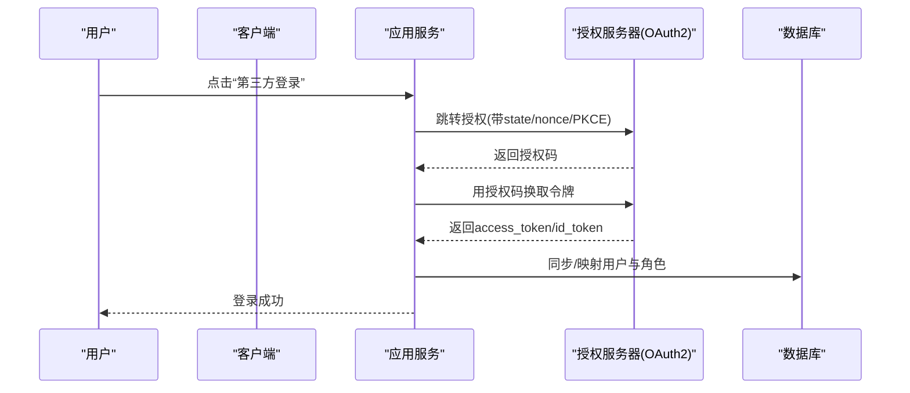

图表来源
- [src/main.py](file://src/main.py)
- [config/agent_llm_config.json](file://config/agent_llm_config.json)

章节来源
- [src/main.py](file://src/main.py)
- [config/agent_llm_config.json](file://config/agent_llm_config.json)

### API密钥管理
- 用途：用于机器间调用、第三方系统集成或后台任务。
- 生命周期：生成（随机高熵）、分配（最小权限）、轮换（定期更新）、吊销（即时失效）。
- 存储：服务端仅存哈希值（加盐），客户端保存原始值一次并妥善管理。
- 使用：在请求头中传递（如 X-API-Key），在服务端进行签名校验或HMAC校验。
- 审计：记录密钥使用方、时间、IP、操作结果。

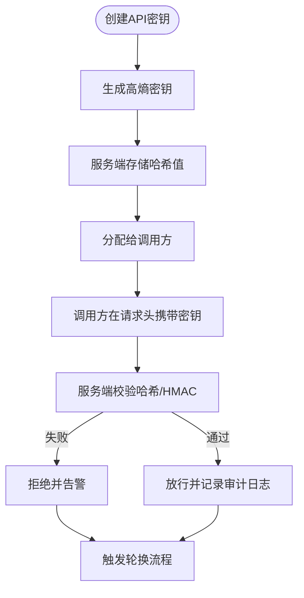

图表来源
- [src/main.py](file://src/main.py)
- [config/agent_llm_config.json](file://config/agent_llm_config.json)

章节来源
- [src/main.py](file://src/main.py)
- [config/agent_llm_config.json](file://config/agent_llm_config.json)

### 用户权限模型与角色访问控制（RBAC）
- 模型：用户-角色-权限三元关系，支持资源级与动作级控制。
- 决策点：在路由层或中间件处基于JWT中的角色/权限声明做快速判定。
- 资源隔离：按租户/组织维度隔离数据访问，确保跨租户不可见。
- 动态授权：结合上下文（如资源归属、操作类型）进行细粒度判断。

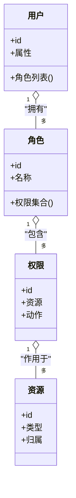

图表来源
- [src/main.py](file://src/main.py)
- [config/agent_llm_config.json](file://config/agent_llm_config.json)

章节来源
- [src/main.py](file://src/main.py)
- [config/agent_llm_config.json](file://config/agent_llm_config.json)

### 安全头配置、HTTPS强制与CORS策略
- HTTPS强制：在反向代理层启用TLS并强制HTTP→HTTPS跳转；应用内设置Strict-Transport-Security。
- 安全响应头：
  - Content-Security-Policy（CSP）
  - X-Content-Type-Options: nosniff
  - X-Frame-Options: DENY/SAMEORIGIN
  - Referrer-Policy
  - Permissions-Policy
- CORS策略：
  - 明确允许的源、方法、头部与作用域。
  - 禁止通配符*在生产环境。
  - 预检请求缓存与超时控制。

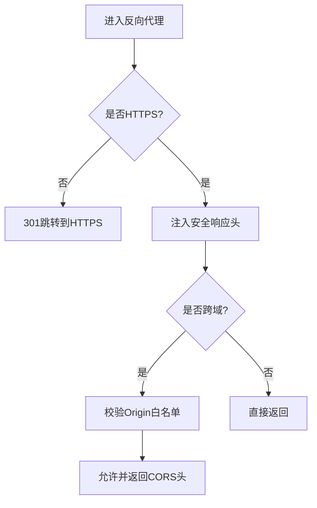

图表来源
- [Dockerfile](file://Dockerfile)
- [config/agent_llm_config.json](file://config/agent_llm_config.json)

章节来源
- [Dockerfile](file://Dockerfile)
- [config/agent_llm_config.json](file://config/agent_llm_config.json)

### 输入验证、SQL注入防护与XSS防护
- 输入验证：
  - 白名单校验（类型、长度、格式、枚举）。
  - 结构化校验（请求体/查询参数/路径参数）。
  - 拒绝未知字段，避免隐式赋值。
- SQL注入防护：
  - 使用参数化查询/ORM，禁止拼接SQL。
  - 最小权限数据库账户，关闭危险函数。
- XSS防护：
  - 输出编码（HTML/JS/CSS/URL）。
  - 启用CSP，限制脚本执行来源。
  - 禁用内联脚本与危险特性。

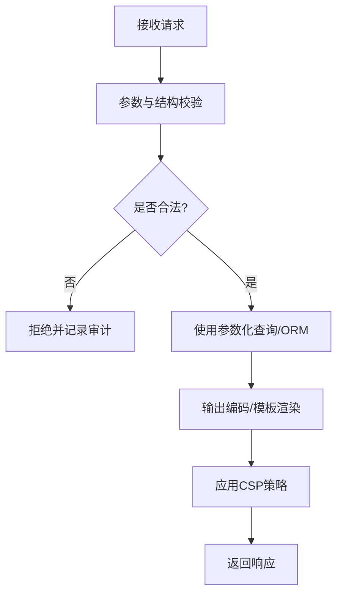

图表来源
- [src/main.py](file://src/main.py)
- [config/agent_llm_config.json](file://config/agent_llm_config.json)

章节来源
- [src/main.py](file://src/main.py)
- [config/agent_llm_config.json](file://config/agent_llm_config.json)

### API限流、防重放攻击与DDoS防护
- 限流：
  - 基于IP/用户/接口的滑动窗口或令牌桶算法。
  - 分级配额与突发限制，超限返回429。
- 防重放：
  - 请求签名（时间戳+随机数+签名）。
  - 服务端去重窗口与Nonce存储。
- DDoS防护：
  - 反向代理层限速与连接数限制。
  - 云WAF/CDN清洗流量。
  - 异常行为检测与自动封禁。

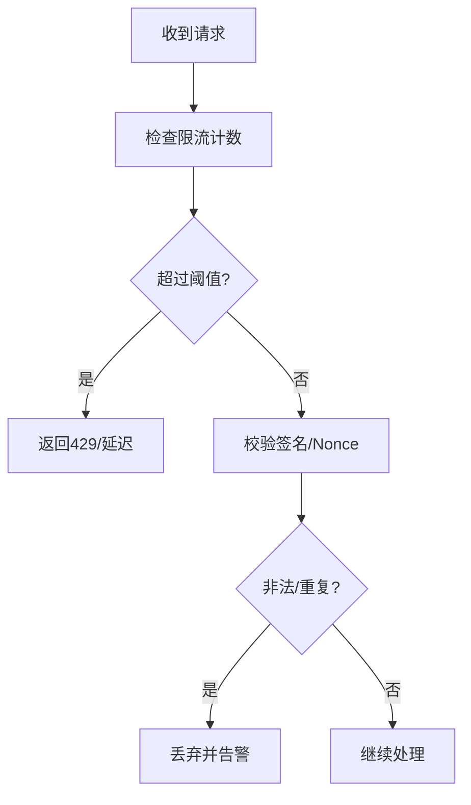

图表来源
- [src/main.py](file://src/main.py)
- [config/agent_llm_config.json](file://config/agent_llm_config.json)

章节来源
- [src/main.py](file://src/main.py)
- [config/agent_llm_config.json](file://config/agent_llm_config.json)

### 敏感数据加密存储与传输安全
- 传输安全：
  - 全站HTTPS，启用强密码套件与HSTS。
  - 证书自动化续期与监控。
- 存储安全：
  - 敏感字段（口令、密钥、PII）使用强加密算法与独立密钥管理（KMS/HSM）。
  - 数据库透明加密与备份加密。
  - 对象存储开启服务端加密与访问控制。
- 密钥管理：
  - 环境变量/密钥管理服务注入，禁止硬编码。
  - 定期轮换与最小可见性。

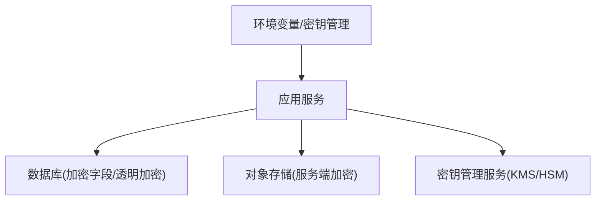

图表来源
- [scripts/load_env.py](file://scripts/load_env.py)
- [scripts/load_env.sh](file://scripts/load_env.sh)
- [config/agent_llm_config.json](file://config/agent_llm_config.json)
- [Dockerfile](file://Dockerfile)

章节来源
- [scripts/load_env.py](file://scripts/load_env.py)
- [scripts/load_env.sh](file://scripts/load_env.sh)
- [config/agent_llm_config.json](file://config/agent_llm_config.json)
- [Dockerfile](file://Dockerfile)

### 安全审计日志与威胁检测
- 审计范围：
  - 认证事件（登录、失败、令牌签发/刷新/吊销）。
  - 授权事件（越权尝试、资源访问）。
  - 管理操作（配置变更、密钥轮换）。
- 日志要求：
  - 不可抵赖、时间同步、完整性保护。
  - 脱敏敏感信息，保留必要上下文（用户、IP、UA、资源ID）。
- 威胁检测：
  - 规则引擎（暴力破解、异常地理位置、高频失败）。
  - 机器学习辅助（异常基线偏离）。
  - 告警联动（工单、短信、IM）。

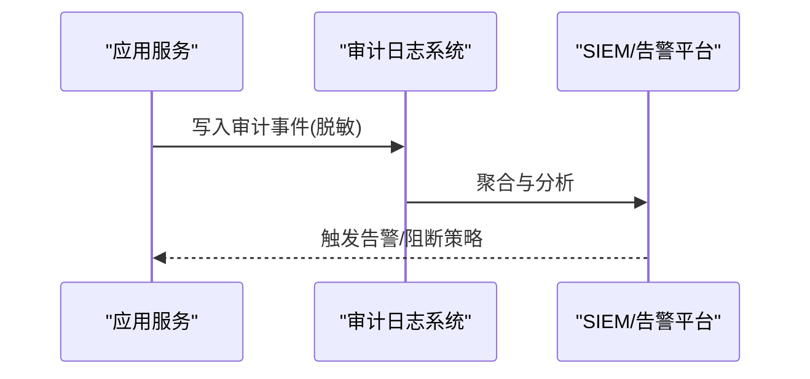

图表来源
- [src/main.py](file://src/main.py)
- [config/agent_llm_config.json](file://config/agent_llm_config.json)

章节来源
- [src/main.py](file://src/main.py)
- [config/agent_llm_config.json](file://config/agent_llm_config.json)

### 安全漏洞扫描与渗透测试指导
- 静态/动态扫描：
  - SAST/DAST/SCA纳入CI流水线，阻断高危问题合并。
  - 依赖漏洞库持续更新，设定阈值与修复SLA。
- 容器与镜像：
  - 基础镜像最小化，定期重建与扫描。
  - 非root运行，只读根文件系统。
- 渗透测试：
  - 红蓝对抗与授权渗透，覆盖认证、授权、注入、越权、SSRF等。
  - 修复闭环与回归验证。

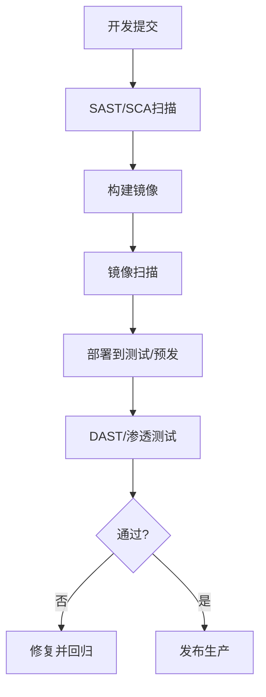

图表来源
- [Dockerfile](file://Dockerfile)
- [pyproject.toml](file://pyproject.toml)
- [uv.lock](file://uv.lock)

章节来源
- [Dockerfile](file://Dockerfile)
- [pyproject.toml](file://pyproject.toml)
- [uv.lock](file://uv.lock)

## 依赖分析
- 运行时依赖：由 pyproject.toml 与 uv.lock 管理，建议引入安全相关库（如限流、校验、审计）。
- 容器依赖：Dockerfile 中应锁定基础镜像版本，减少供应链风险。
- 配置依赖：通过环境变量与JSON配置注入，避免硬编码敏感信息。

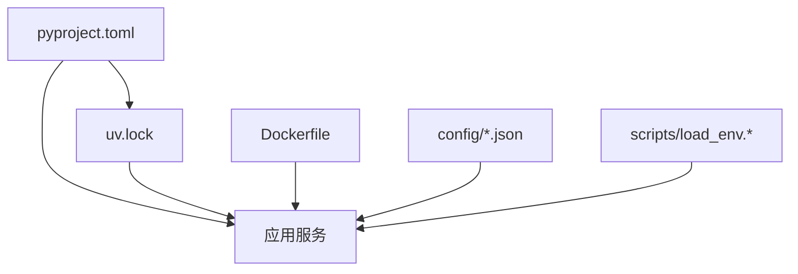

图表来源
- [pyproject.toml](file://pyproject.toml)
- [uv.lock](file://uv.lock)
- [Dockerfile](file://Dockerfile)
- [config/agent_llm_config.json](file://config/agent_llm_config.json)
- [scripts/load_env.py](file://scripts/load_env.py)
- [scripts/load_env.sh](file://scripts/load_env.sh)

章节来源
- [pyproject.toml](file://pyproject.toml)
- [uv.lock](file://uv.lock)
- [Dockerfile](file://Dockerfile)
- [config/agent_llm_config.json](file://config/agent_llm_config.json)
- [scripts/load_env.py](file://scripts/load_env.py)
- [scripts/load_env.sh](file://scripts/load_env.sh)

## 性能考虑
- 认证开销：JWT校验应在内存中进行，必要时配合缓存加速黑名单/状态查询。
- 限流与去重：使用高效数据结构（如滑动窗口计数器、布隆过滤器）降低CPU与内存占用。
- 日志写入：异步落盘与批量上报，避免阻塞主链路。
- 加密计算：合理选择算法与密钥长度，平衡安全与性能。

## 故障排查指南
- 常见问题定位：
  - 认证失败：检查JWT签名、过期时间、时钟同步、黑名单状态。
  - 跨域错误：核对CORS白名单、预检请求、浏览器缓存。
  - 限流过杀：调整阈值与窗口大小，观察峰值与异常流量。
  - 证书问题：确认反向代理证书链、续期与域名匹配。
- 日志与指标：
  - 关注认证失败率、429比例、慢请求、异常地域/IP。
  - 建立仪表盘与告警阈值，缩短MTTR。

## 结论
当前仓库未内置认证与安全中间件，但提供了良好的扩展点（入口、配置、脚本、容器化）。建议在反向代理与应用服务之间引入统一的认证与网关能力，完善JWT/OAuth2、RBAC、限流、审计与扫描流水线，形成纵深防御体系。

## 附录
- 术语
  - JWT：JSON Web Token，用于身份与声明的自包含令牌。
  - OAuth2：开放授权框架，支持多种授权模式。
  - RBAC：基于角色的访问控制。
  - HSTS：HTTP Strict Transport Security，强制HTTPS。
  - CSP：内容安全策略，缓解XSS等注入风险。
  - SAST/DAST/SCA：静态/动态/软件成分分析。