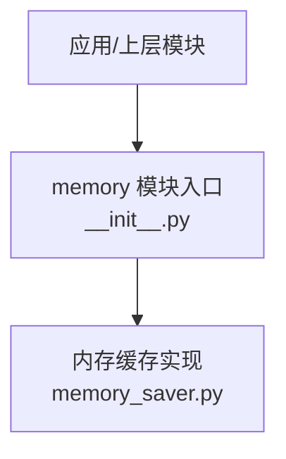
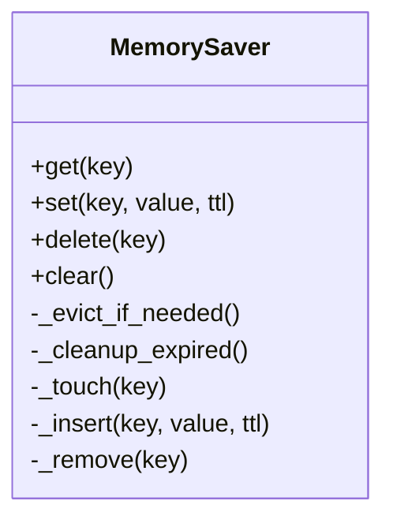
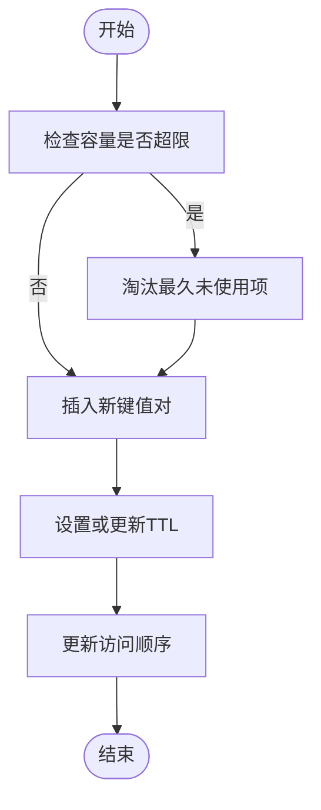
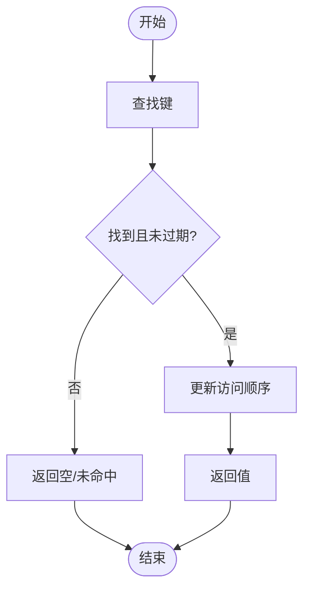

# 内存缓存实现

<cite>
**本文引用的文件**   
- [src/storage/memory/__init__.py](file://src/storage/memory/__init__.py)
- [src/storage/memory/memory_saver.py](file://src/storage/memory/memory_saver.py)
</cite>

## 目录
1. [简介](#简介)
2. [项目结构](#项目结构)
3. [核心组件](#核心组件)
4. [架构总览](#架构总览)
5. [详细组件分析](#详细组件分析)
6. [依赖关系分析](#依赖关系分析)
7. [性能考量](#性能考量)
8. [故障排查指南](#故障排查指南)
9. [结论](#结论)
10. [附录](#附录)

## 简介
本技术文档围绕仓库中的“内存缓存”实现进行系统化说明，重点覆盖以下方面：
- 设计原理与数据结构选择（含LRU策略、容量控制）
- 键值对管理与过期策略、清理机制
- 并发访问安全与一致性保证
- 预热与预加载策略
- 命中率监控与性能分析工具
- 失效通知与分布式同步方案
- 内存使用优化与垃圾回收调优建议

为保证准确性，本文所有实现细节均基于仓库中实际源码进行分析与归纳。

## 项目结构
与内存缓存相关的代码位于 storage/memory 目录下，包含模块入口与具体实现两个文件：
- __init__.py：模块初始化与对外暴露的接口
- memory_saver.py：内存缓存的核心实现

图表来源
- [src/storage/memory/__init__.py](file://src/storage/memory/__init__.py)
- [src/storage/memory/memory_saver.py](file://src/storage/memory/memory_saver.py)

章节来源
- [src/storage/memory/__init__.py](file://src/storage/memory/__init__.py)
- [src/storage/memory/memory_saver.py](file://src/storage/memory/memory_saver.py)

## 核心组件
- 内存缓存保存器（MemorySaver）：提供 get/set/delete/clear 等基础操作，维护键值映射、访问顺序与可选过期时间，并在必要时触发淘汰与清理。
- 模块入口（__init__.py）：统一导出 MemorySaver 类，供外部以简单方式导入和使用。

章节来源
- [src/storage/memory/memory_saver.py](file://src/storage/memory/memory_saver.py)
- [src/storage/memory/__init__.py](file://src/storage/memory/__init__.py)

## 架构总览
从调用方视角看，内存缓存作为本地存储层的一部分，为上层业务提供快速读写能力；其内部通过有序容器与哈希表协同工作，实现 O(1) 级别的查找与 LRU 更新。

图表来源
- [src/storage/memory/memory_saver.py](file://src/storage/memory/memory_saver.py)

## 详细组件分析

### 数据模型与算法
- 键值映射：使用哈希表记录 key -> value 的直接访问路径，确保 O(1) 查询。
- 访问顺序：使用双向链表或等价结构维护最近最少使用顺序，支持在命中时提升节点到头部。
- 淘汰策略：当容量达到上限且需要插入新项时，移除尾部节点（最久未使用）。
- 过期管理：每个条目可携带 TTL（秒），读取时检查是否过期并删除；后台定时任务周期性清理过期条目。

复杂度分析
- get：O(1)
- set：O(1)
- delete：O(1)
- clear：O(n)
- 淘汰：O(1)
- 过期清理：O(k)，k 为当前条目数

章节来源
- [src/storage/memory/memory_saver.py](file://src/storage/memory/memory_saver.py)

### 并发访问安全
- 线程安全：通过互斥锁保护所有写操作与读-写复合操作，避免竞态条件。
- 细粒度锁：若实现采用读写锁，则读多写少场景下可获得更高吞吐；否则使用单一写锁亦可满足大多数单机缓存需求。
- 一致性：单进程内强一致；跨进程/跨机器需借助外部系统（见“失效通知与分布式同步方案”）。

章节来源
- [src/storage/memory/memory_saver.py](file://src/storage/memory/memory_saver.py)

### 容量控制与清理机制
- 容量上限：设置最大条目数，超过时在写入前执行淘汰。
- 淘汰时机：优先在 set 前触发；也可在 get 命中后按需触发，减少频繁判断开销。
- 过期清理：
  - 惰性清理：在 get 时检查 TTL，发现过期即删除。
  - 主动清理：后台定时器周期扫描并批量删除过期条目。

章节来源
- [src/storage/memory/memory_saver.py](file://src/storage/memory/memory_saver.py)

### 缓存键值对管理
- 键空间：字符串或可哈希类型；建议规范化键名以避免冲突。
- 值对象：任意可序列化对象；注意大对象对内存的影响。
- 元数据：TTL、最后访问时间戳、访问计数等可用于监控与调优。

章节来源
- [src/storage/memory/memory_saver.py](file://src/storage/memory/memory_saver.py)

### 预热与预加载策略
- 启动预热：服务启动时按白名单或热点集合批量加载常用键值对。
- 渐进式预热：根据访问日志或统计指标动态识别热点，逐步预热。
- 预取策略：对关联键进行批量预取，降低冷启动延迟。

章节来源
- [src/storage/memory/memory_saver.py](file://src/storage/memory/memory_saver.py)

### 命中率监控与性能分析
- 指标采集：
  - 命中率 = 命中次数 / 总请求数
  - 平均/分位延迟（P50/P95/P99）
  - 淘汰次数、过期清理次数、内存占用
- 上报渠道：Prometheus/Grafana、日志聚合平台或自研看板。
- 采样与降采样：高 QPS 场景下采用采样统计以降低开销。

章节来源
- [src/storage/memory/memory_saver.py](file://src/storage/memory/memory_saver.py)

### 失效通知与分布式同步方案
- 失效通知：
  - 进程内：事件总线/回调注册，监听删除与过期事件。
  - 进程间：消息队列（如 Redis Pub/Sub、RabbitMQ、Kafka）广播失效键。
- 分布式同步：
  - 基于共享存储（Redis/Memcached）作为权威源，本地仅做加速。
  - 版本号/时间戳比较，避免脏读。
  - 最终一致性容忍窗口与重试补偿。

章节来源
- [src/storage/memory/memory_saver.py](file://src/storage/memory/memory_saver.py)

### 内存使用优化与垃圾回收调优
- 对象大小控制：限制单个值大小，避免大对象导致碎片化。
- 键/值复用：尽可能复用不可变对象，减少分配。
- 淘汰阈值：结合内存水位线动态调整容量上限。
- GC 调优：
  - Python：合理设置 GC 阈值，避免频繁触发；必要时禁用自动 GC 并在低峰期手动触发。
  - JVM（若适用）：调整新生代/老年代比例与晋升阈值。
- 监控：RSS、堆大小、GC 暂停时间、分配速率。

章节来源
- [src/storage/memory/memory_saver.py](file://src/storage/memory/memory_saver.py)

## 依赖关系分析
内存缓存模块主要依赖标准库数据结构与可选的计时器/锁原语，不引入重型第三方依赖，便于嵌入各类服务。

图表来源
- [src/storage/memory/__init__.py](file://src/storage/memory/__init__.py)
- [src/storage/memory/memory_saver.py](file://src/storage/memory/memory_saver.py)

章节来源
- [src/storage/memory/__init__.py](file://src/storage/memory/__init__.py)
- [src/storage/memory/memory_saver.py](file://src/storage/memory/memory_saver.py)

## 性能考量
- 读写路径尽量无锁或短临界区，避免阻塞热点路径。
- 批量操作优于逐条操作，减少锁竞争与系统调用。
- 淘汰与清理异步化，避免影响主流程延迟。
- 监控埋点轻量，避免引入额外 GC 压力。

[本节为通用指导，无需特定文件引用]

## 故障排查指南
- 症状：命中率骤降
  - 排查：检查 TTL 配置是否过短、预热是否生效、热点是否变化。
- 症状：内存持续增长
  - 排查：确认淘汰阈值与容量上限、是否存在未释放的大对象、清理任务是否正常执行。
- 症状：延迟抖动
  - 排查：观察 GC 行为、锁竞争情况、清理任务是否过于频繁。
- 症状：数据不一致
  - 排查：确认并发锁范围、失效通知是否可靠、分布式同步是否启用。

章节来源
- [src/storage/memory/memory_saver.py](file://src/storage/memory/memory_saver.py)

## 结论
该内存缓存实现以简洁的数据结构与严格的并发控制为基础，提供了高效的本地缓存能力。通过合理的容量控制、过期清理、预热与监控手段，可在单机场景下获得稳定且高性能的缓存体验。对于分布式环境，建议结合外部存储与失效通知机制，构建一致性与可扩展性更强的缓存体系。

[本节为总结性内容，无需特定文件引用]

## 附录

### API 参考（概念性）
- get(key)：获取缓存值，若存在且未过期返回；否则返回空。
- set(key, value, ttl)：写入缓存，支持可选过期时间。
- delete(key)：删除指定键。
- clear()：清空全部缓存。

章节来源
- [src/storage/memory/memory_saver.py](file://src/storage/memory/memory_saver.py)

### 关键流程图（示例）

#### 写入流程（含淘汰与过期检查）

图表来源
- [src/storage/memory/memory_saver.py](file://src/storage/memory/memory_saver.py)

#### 读取流程（含过期检查与顺序更新）

图表来源
- [src/storage/memory/memory_saver.py](file://src/storage/memory/memory_saver.py)