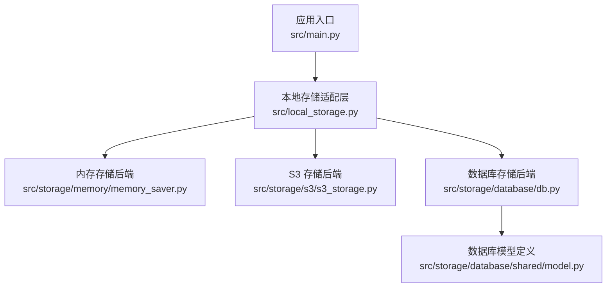
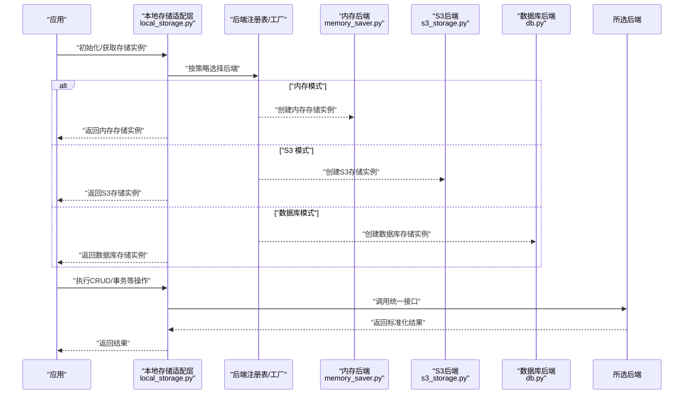
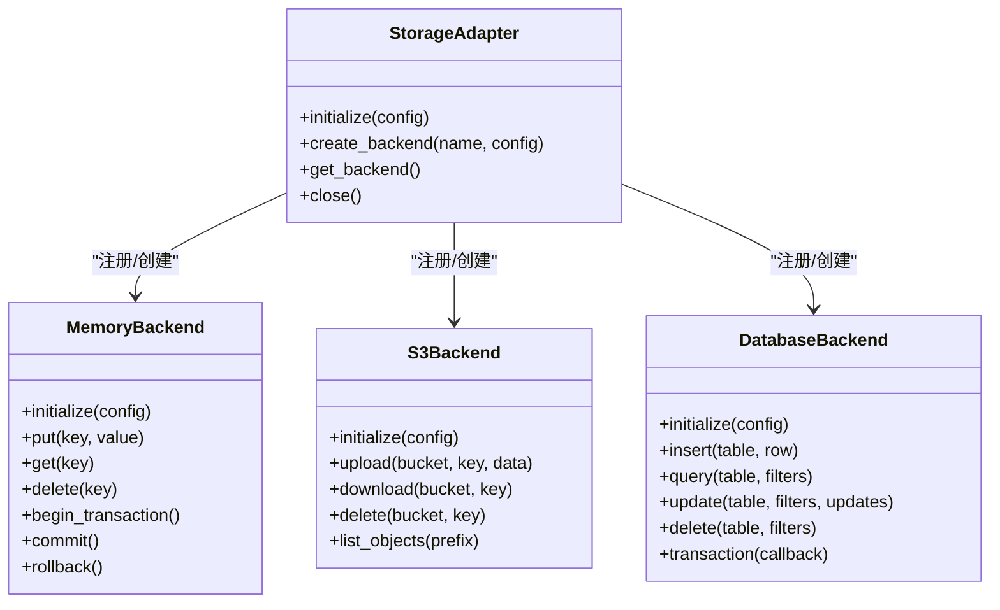
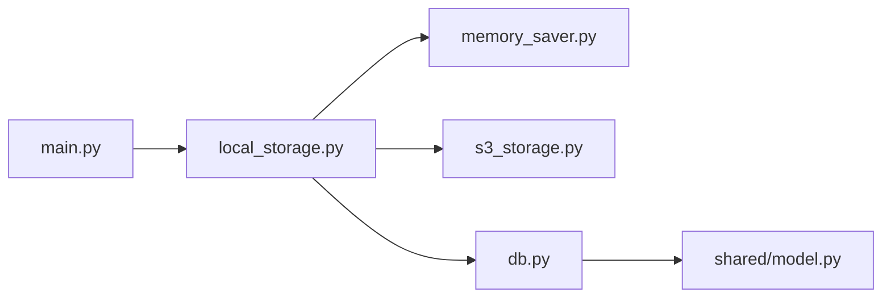

# 存储抽象接口

<cite>
**本文引用的文件**   
- [src/storage/memory/__init__.py](file://src/storage/memory/__init__.py)
- [src/storage/memory/memory_saver.py](file://src/storage/memory/memory_saver.py)
- [src/storage/s3/s3_storage.py](file://src/storage/s3/s3_storage.py)
- [src/storage/database/db.py](file://src/storage/database/db.py)
- [src/storage/database/shared/model.py](file://src/storage/database/shared/model.py)
- [src/local_storage.py](file://src/local_storage.py)
- [src/main.py](file://src/main.py)
</cite>

## 目录
1. [简介](#简介)
2. [项目结构](#项目结构)
3. [核心组件](#核心组件)
4. [架构总览](#架构总览)
5. [详细组件分析](#详细组件分析)
6. [依赖关系分析](#依赖关系分析)
7. [性能考虑](#性能考虑)
8. [故障排查指南](#故障排查指南)
9. [结论](#结论)
10. [附录](#附录)

## 简介
本技术文档围绕“存储抽象接口”展开，聚焦于通过统一的接口访问不同存储后端的设计与实现。文档将解释存储层抽象模式、基类设计理念与核心方法契约（CRUD、连接管理、事务处理等）、后端注册与动态加载机制、接口规范（参数校验、错误处理、返回值格式），并提供自定义存储后端的开发指南与最佳实践，以及存储选择策略与配置管理方案。

## 项目结构
存储相关代码位于 src/storage 目录下，包含内存、S3、数据库三种后端；应用入口在 src/main.py，本地存储适配在 src/local_storage.py。

图表来源
- [src/main.py](file://src/main.py)
- [src/local_storage.py](file://src/local_storage.py)
- [src/storage/memory/memory_saver.py](file://src/storage/memory/memory_saver.py)
- [src/storage/s3/s3_storage.py](file://src/storage/s3/s3_storage.py)
- [src/storage/database/db.py](file://src/storage/database/db.py)
- [src/storage/database/shared/model.py](file://src/storage/database/shared/model.py)

章节来源
- [src/main.py](file://src/main.py)
- [src/local_storage.py](file://src/local_storage.py)
- [src/storage/memory/__init__.py](file://src/storage/memory/__init__.py)
- [src/storage/memory/memory_saver.py](file://src/storage/memory/memory_saver.py)
- [src/storage/s3/s3_storage.py](file://src/storage/s3/s3_storage.py)
- [src/storage/database/db.py](file://src/storage/database/db.py)
- [src/storage/database/shared/model.py](file://src/storage/database/shared/model.py)

## 核心组件
本节概述存储抽象的核心目标与职责边界：
- 统一接口：对外暴露一致的 CRUD、连接管理、事务处理等方法签名，屏蔽底层差异。
- 后端可插拔：通过注册表/工厂模式动态选择具体后端，支持运行时切换。
- 契约规范：明确参数校验、异常类型与返回结构，保证上层调用稳定。
- 可扩展性：新增后端只需实现约定接口并注册即可接入。

章节来源
- [src/storage/memory/memory_saver.py](file://src/storage/memory/memory_saver.py)
- [src/storage/s3/s3_storage.py](file://src/storage/s3/s3_storage.py)
- [src/storage/database/db.py](file://src/storage/database/db.py)
- [src/local_storage.py](file://src/local_storage.py)

## 架构总览
下图展示从应用到存储后端的整体交互路径，包括本地适配层如何根据配置或运行环境选择具体后端。

图表来源
- [src/local_storage.py](file://src/local_storage.py)
- [src/storage/memory/memory_saver.py](file://src/storage/memory/memory_saver.py)
- [src/storage/s3/s3_storage.py](file://src/storage/s3/s3_storage.py)
- [src/storage/database/db.py](file://src/storage/database/db.py)

## 详细组件分析

### 存储抽象基类与接口契约
- 设计目标
  - 为所有存储后端提供一致的方法签名与行为语义。
  - 明确数据读写、连接生命周期、事务边界与错误语义。
- 核心方法建议（命名与职责）
  - 连接管理：初始化、健康检查、关闭。
  - CRUD：创建、读取、更新、删除、批量操作。
  - 事务：开始、提交、回滚、上下文管理器。
  - 元数据：列出键/对象、统计信息、索引/分区能力探测。
- 参数校验
  - 对必填字段、类型、范围进行前置校验，失败抛出明确的参数异常。
- 错误处理
  - 使用领域异常类型区分网络、权限、资源不存在、并发冲突等。
  - 记录必要上下文（如键名、桶名、表名）便于定位。
- 返回值格式
  - 成功返回结构化对象（含状态码、数据体、元信息）。
  - 失败返回异常或包含错误详情的响应体。

章节来源
- [src/storage/memory/memory_saver.py](file://src/storage/memory/memory_saver.py)
- [src/storage/s3/s3_storage.py](file://src/storage/s3/s3_storage.py)
- [src/storage/database/db.py](file://src/storage/database/db.py)

### 内存存储后端
- 特点
  - 进程内字典/缓存实现，适合测试与轻量场景。
  - 无持久化，重启丢失。
- 关键实现要点
  - 线程安全：必要时加锁保护共享状态。
  - 简单事务：基于内存快照或撤销日志模拟。
  - 快速失败：参数校验与空值处理。
- 适用场景
  - 单元测试、原型验证、低吞吐批处理。

章节来源
- [src/storage/memory/memory_saver.py](file://src/storage/memory/memory_saver.py)
- [src/storage/memory/__init__.py](file://src/storage/memory/__init__.py)

### S3 兼容对象存储后端
- 特点
  - 面向对象存储的键值式读写，适合大文件与非结构化数据。
  - 具备高可用与水平扩展能力。
- 关键实现要点
  - 客户端初始化：端点、凭据、区域、重试策略。
  - 分块上传/下载：大文件传输优化。
  - 一致性模型：最终一致读的处理与幂等写入。
  - 错误映射：将 SDK 异常映射为领域异常。
- 适用场景
  - 报告、图表、附件等非结构化数据归档。

章节来源
- [src/storage/s3/s3_storage.py](file://src/storage/s3/s3_storage.py)

### 数据库存储后端
- 特点
  - 结构化数据存取，支持复杂查询与事务。
  - 需要连接池与迁移管理。
- 关键实现要点
  - 连接管理：连接池、超时、重连。
  - ORM/SQL 封装：统一查询构建器与分页。
  - 事务：自动/手动事务，隔离级别控制。
  - 模型映射：与 shared/model.py 中的模型保持一致。
- 适用场景
  - 业务主数据、审计日志、指标聚合等结构化数据。

章节来源
- [src/storage/database/db.py](file://src/storage/database/db.py)
- [src/storage/database/shared/model.py](file://src/storage/database/shared/model.py)

### 本地存储适配层与后端注册
- 职责
  - 根据配置或环境变量选择具体后端。
  - 维护后端注册表，提供工厂方法创建实例。
  - 向上层暴露统一 API，屏蔽后端差异。
- 注册机制
  - 以“名称 -> 类/工厂”的形式注册后端。
  - 支持热插拔：启动时扫描或显式导入注册。
- 动态加载
  - 通过反射或插件机制按需导入后端模块。
  - 结合配置项决定实例化参数。

图表来源
- [src/local_storage.py](file://src/local_storage.py)
- [src/storage/memory/memory_saver.py](file://src/storage/memory/memory_saver.py)
- [src/storage/s3/s3_storage.py](file://src/storage/s3/s3_storage.py)
- [src/storage/database/db.py](file://src/storage/database/db.py)

章节来源
- [src/local_storage.py](file://src/local_storage.py)

### 应用入口集成
- 作用
  - 初始化配置、选择存储后端、注入到业务模块。
- 流程
  - 读取配置（环境变量/配置文件）。
  - 调用适配层创建对应后端实例。
  - 将实例注入到工具或服务中。

章节来源
- [src/main.py](file://src/main.py)

## 依赖关系分析
- 耦合度
  - 适配层与后端之间通过接口解耦，降低直接依赖。
  - 数据库后端依赖模型定义，确保数据结构一致。
- 外部依赖
  - S3 后端依赖对象存储 SDK。
  - 数据库后端依赖数据库驱动与 ORM/SQL 库。
- 循环依赖
  - 应避免后端模块反向依赖适配层，保持单向依赖。

图表来源
- [src/main.py](file://src/main.py)
- [src/local_storage.py](file://src/local_storage.py)
- [src/storage/memory/memory_saver.py](file://src/storage/memory/memory_saver.py)
- [src/storage/s3/s3_storage.py](file://src/storage/s3/s3_storage.py)
- [src/storage/database/db.py](file://src/storage/database/db.py)
- [src/storage/database/shared/model.py](file://src/storage/database/shared/model.py)

章节来源
- [src/main.py](file://src/main.py)
- [src/local_storage.py](file://src/local_storage.py)
- [src/storage/database/shared/model.py](file://src/storage/database/shared/model.py)

## 性能考虑
- 连接复用
  - 数据库使用连接池，避免频繁握手。
  - S3 客户端复用连接，合理设置超时与重试。
- 批量操作
  - 批量插入/更新减少往返次数。
  - 分块上传/下载提升大文件吞吐。
- 缓存策略
  - 热点数据在内存后端或二级缓存中加速。
- 事务粒度
  - 缩小事务范围，减少锁竞争与长事务风险。
- 一致性权衡
  - 对象存储最终一致读需在上层做幂等与重试。

[本节为通用指导，不直接分析具体文件]

## 故障排查指南
- 常见问题
  - 参数校验失败：检查必填字段、类型与取值范围。
  - 连接失败：确认凭据、网络连通性与端口。
  - 权限不足：核对桶/表权限与 IAM 策略。
  - 事务冲突：重试策略与死锁检测。
- 诊断手段
  - 开启详细日志，记录请求 ID、键名、表名等上下文。
  - 健康检查接口用于快速定位后端可用性。
  - 针对 S3 与数据库分别进行最小复现用例。

章节来源
- [src/storage/s3/s3_storage.py](file://src/storage/s3/s3_storage.py)
- [src/storage/database/db.py](file://src/storage/database/db.py)

## 结论
通过统一的存储抽象接口与注册机制，系统实现了存储后端的可插拔与可替换，既保证了上层调用的稳定性，又提供了灵活的扩展能力。遵循接口契约与最佳实践，可高效地新增与集成新的存储后端。

[本节为总结性内容，不直接分析具体文件]

## 附录

### 自定义存储后端开发指南
- 必须实现的接口方法
  - 初始化与关闭：负责资源准备与释放。
  - CRUD 方法：至少覆盖创建、读取、更新、删除。
  - 事务方法：开始、提交、回滚或上下文管理器。
  - 元数据方法：列出、统计、能力探测。
- 参数校验与错误处理
  - 前置校验失败抛出明确的参数异常。
  - 将底层异常映射为领域异常，附带必要上下文。
- 返回值格式
  - 成功返回标准结构（状态、数据、元信息）。
  - 失败返回异常或错误详情。
- 注册与动态加载
  - 在后端模块中完成注册（名称 -> 类/工厂）。
  - 适配层根据配置选择并实例化。
- 最佳实践
  - 幂等写入与重试策略。
  - 合理的超时与限流。
  - 完善的日志与监控埋点。
  - 单元测试覆盖正常与异常分支。

章节来源
- [src/local_storage.py](file://src/local_storage.py)
- [src/storage/memory/memory_saver.py](file://src/storage/memory/memory_saver.py)
- [src/storage/s3/s3_storage.py](file://src/storage/s3/s3_storage.py)
- [src/storage/database/db.py](file://src/storage/database/db.py)

### 存储选择策略与配置管理
- 选择策略
  - 按环境：开发/测试用内存，生产用数据库或对象存储。
  - 按数据类型：结构化数据走数据库，非结构化数据走对象存储。
  - 按性能需求：高频小对象可引入缓存层。
- 配置项建议
  - 后端名称、连接参数、重试策略、超时、日志级别。
  - 功能开关：是否启用事务、是否启用压缩等。
- 配置来源
  - 环境变量优先，其次配置文件，最后默认值。
  - 启动时校验配置完整性并输出告警。

章节来源
- [src/local_storage.py](file://src/local_storage.py)
- [src/main.py](file://src/main.py)