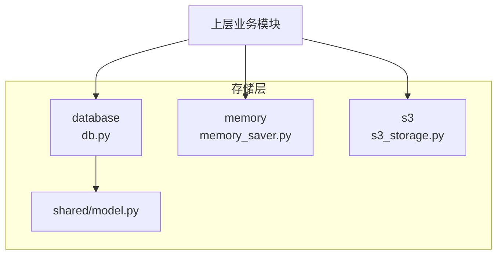
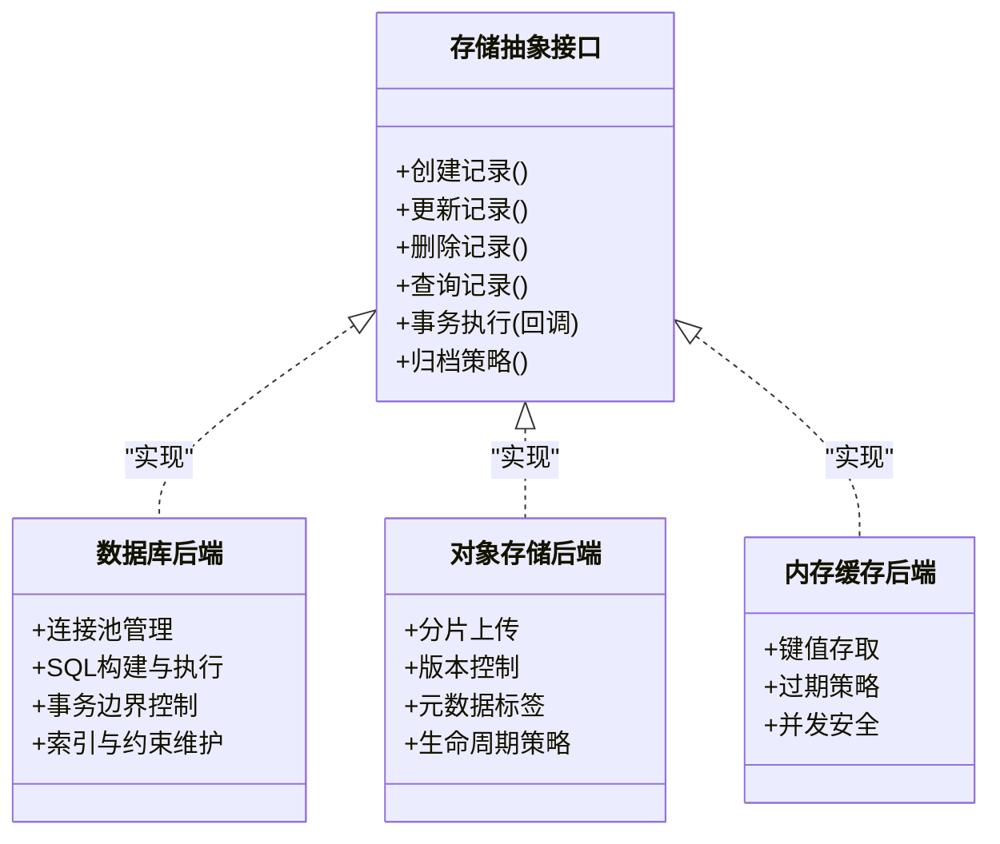
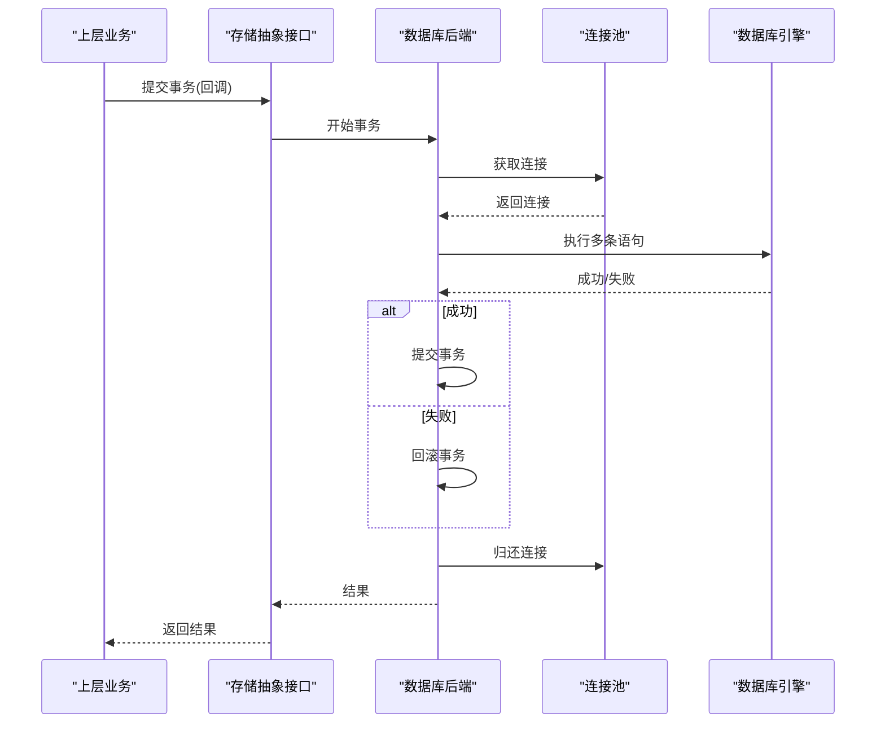
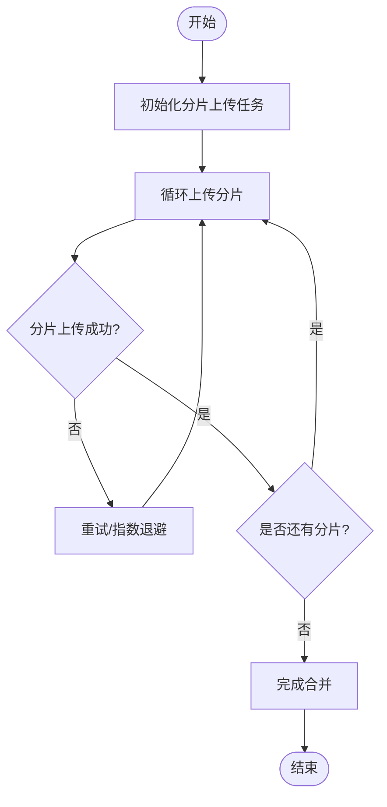
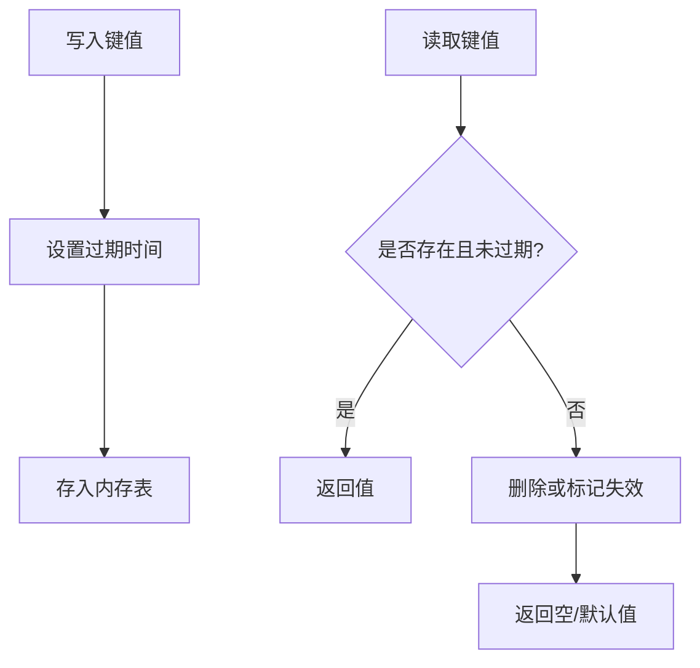
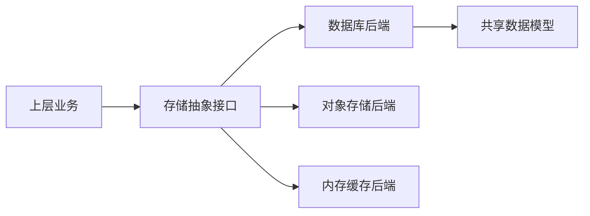

# 存储管理层

<cite>
**本文引用的文件**   
- [src/storage/database/db.py](file://src/storage/database/db.py)
- [src/storage/database/shared/model.py](file://src/storage/database/shared/model.py)
- [src/storage/memory/memory_saver.py](file://src/storage/memory/memory_saver.py)
- [src/storage/s3/s3_storage.py](file://src/storage/s3/s3_storage.py)
</cite>

## 目录
1. [简介](#简介)
2. [项目结构](#项目结构)
3. [核心组件](#核心组件)
4. [架构总览](#架构总览)
5. [详细组件分析](#详细组件分析)
6. [依赖关系分析](#依赖关系分析)
7. [性能考虑](#性能考虑)
8. [故障排查指南](#故障排查指南)
9. [结论](#结论)
10. [附录](#附录)

## 简介
本技术文档聚焦智能审计风险识别系统的“存储管理层”，围绕统一的存储抽象接口与多种后端实现展开，涵盖数据库（SQLite/PostgreSQL）、对象存储（AWS S3）与内存缓存。文档从系统架构、数据模型、生命周期管理、配置与连接池、一致性/事务/并发控制、性能优化与故障恢复，以及扩展自定义后端的实践路径进行系统化阐述，帮助开发者快速理解并高效使用存储层。

## 项目结构
存储层位于 src/storage 目录下，按后端类型划分为三个子模块：
- database：关系型数据库后端（SQLite/PostgreSQL），包含共享数据模型定义与数据库访问封装
- memory：进程内内存缓存后端
- s3：基于 AWS S3 的对象存储后端

图表来源
- [src/storage/database/db.py](file://src/storage/database/db.py)
- [src/storage/database/shared/model.py](file://src/storage/database/shared/model.py)
- [src/storage/memory/memory_saver.py](file://src/storage/memory/memory_saver.py)
- [src/storage/s3/s3_storage.py](file://src/storage/s3/s3_storage.py)

章节来源
- [src/storage/database/db.py](file://src/storage/database/db.py)
- [src/storage/database/shared/model.py](file://src/storage/database/shared/model.py)
- [src/storage/memory/memory_saver.py](file://src/storage/memory/memory_saver.py)
- [src/storage/s3/s3_storage.py](file://src/storage/s3/s3_storage.py)

## 核心组件
- 统一存储抽象接口：面向上层提供一致的读写、查询、事务与元数据管理能力，屏蔽底层差异
- 数据库后端：以 SQLite/PostgreSQL 为持久化载体，承载结构化实体与复杂查询
- 对象存储后端：以 S3 作为非结构化/大对象存储，支持分片上传、版本控制等能力
- 内存缓存后端：用于热点数据加速与跨请求的临时状态保存

章节来源
- [src/storage/database/db.py](file://src/storage/database/db.py)
- [src/storage/database/shared/model.py](file://src/storage/database/shared/model.py)
- [src/storage/memory/memory_saver.py](file://src/storage/memory/memory_saver.py)
- [src/storage/s3/s3_storage.py](file://src/storage/s3/s3_storage.py)

## 架构总览
存储层采用“适配器模式”将不同后端统一暴露给上层调用方。上层通过统一接口发起操作，由具体后端实现完成实际存取。

图表来源
- [src/storage/database/db.py](file://src/storage/database/db.py)
- [src/storage/s3/s3_storage.py](file://src/storage/s3/s3_storage.py)
- [src/storage/memory/memory_saver.py](file://src/storage/memory/memory_saver.py)

## 详细组件分析

### 数据库后端（SQLite/PostgreSQL）
- 设计要点
  - 连接池：根据并发需求与资源限制配置最大连接数、空闲超时与最小连接数
  - SQL 构建：基于 ORM/SQLAlchemy 或原生驱动，统一参数化查询避免注入
  - 事务：显式事务边界，失败回滚；必要时使用保存点嵌套事务
  - 索引与约束：主键、唯一键、外键、检查约束保障一致性与完整性
  - 迁移：版本化迁移脚本，保证 schema 演进可追溯
- 关键流程（示例：写入+事务）

图表来源
- [src/storage/database/db.py](file://src/storage/database/db.py)

章节来源
- [src/storage/database/db.py](file://src/storage/database/db.py)
- [src/storage/database/shared/model.py](file://src/storage/database/shared/model.py)

### 对象存储后端（AWS S3）
- 设计要点
  - 分片上传：大文件分块并行上传，断点续传与重试
  - 版本控制：开启桶版本控制，支持历史回溯
  - 元数据：对象级标签与自定义元数据便于检索与治理
  - 生命周期：自动归档/清理策略，降低冷数据成本
- 关键流程（示例：分片上传）

图表来源
- [src/storage/s3/s3_storage.py](file://src/storage/s3/s3_storage.py)

章节来源
- [src/storage/s3/s3_storage.py](file://src/storage/s3/s3_storage.py)

### 内存缓存后端
- 设计要点
  - 数据结构：线程安全的字典/队列，支持 TTL 过期
  - 并发控制：读写锁或原子操作，避免竞态条件
  - 容量上限：LRU/LFU 淘汰策略，防止内存膨胀
  - 序列化：对复杂对象进行序列化/反序列化
- 典型流程（示例：带过期的键值存取）

图表来源
- [src/storage/memory/memory_saver.py](file://src/storage/memory/memory_saver.py)

章节来源
- [src/storage/memory/memory_saver.py](file://src/storage/memory/memory_saver.py)

### 数据模型设计（数据库）
- 实体与关系
  - 审计任务：标识、名称、描述、状态、创建/更新时间等
  - 证据材料：关联任务、文件路径/对象键、哈希校验、大小、类型等
  - 风险指标：任务/证据关联、评分、阈值、更新时间等
- 字段与约束
  - 主键：自增或 UUID
  - 唯一性：业务键唯一（如任务编号）
  - 外键：引用审计任务/证据，级联更新/删除策略明确
  - 检查约束：数值范围、枚举取值、时间先后顺序
- 索引策略
  - 高频查询列建立索引（如任务状态、时间范围）
  - 复合索引覆盖常用过滤组合
- 迁移与版本
  - 使用迁移工具管理 schema 变更，确保可回滚

章节来源
- [src/storage/database/shared/model.py](file://src/storage/database/shared/model.py)

## 依赖关系分析
- 模块耦合
  - 上层仅依赖“存储抽象接口”，不感知具体后端
  - 数据库后端依赖共享模型定义
  - 对象存储与内存缓存相对独立，互不依赖
- 外部依赖
  - 数据库驱动（SQLite/PostgreSQL）
  - S3 SDK（认证、网络、重试）
  - 内存容器（线程安全集合）

图表来源
- [src/storage/database/db.py](file://src/storage/database/db.py)
- [src/storage/database/shared/model.py](file://src/storage/database/shared/model.py)
- [src/storage/s3/s3_storage.py](file://src/storage/s3/s3_storage.py)
- [src/storage/memory/memory_saver.py](file://src/storage/memory/memory_saver.py)

章节来源
- [src/storage/database/db.py](file://src/storage/database/db.py)
- [src/storage/database/shared/model.py](file://src/storage/database/shared/model.py)
- [src/storage/s3/s3_storage.py](file://src/storage/s3/s3_storage.py)
- [src/storage/memory/memory_saver.py](file://src/storage/memory/memory_saver.py)

## 性能考虑
- 数据库
  - 合理设置连接池大小与超时，避免连接耗尽
  - 批量写入与 UPSERT 减少往返次数
  - 分页与投影查询，避免全表扫描与大对象加载
  - 定期统计信息更新与索引维护
- 对象存储
  - 分片大小与并发度调优，平衡吞吐与延迟
  - 启用压缩与合适的存储类别（标准/低频/归档）
  - 利用 CDN/边缘缓存提升读取性能
- 内存缓存
  - 选择合适淘汰策略与容量上限
  - 预热热点数据，降低冷启动开销
  - 监控命中率与内存占用，及时扩容或降级

[本节为通用指导，无需代码来源]

## 故障排查指南
- 常见问题定位
  - 连接失败：检查数据库/S3 凭据、网络连通、端口与防火墙
  - 事务异常：捕获异常并回滚，记录上下文与堆栈
  - 超时与重试：调整超时阈值与重试退避策略
  - 磁盘/配额不足：监控对象存储桶配额与数据库磁盘空间
- 日志与追踪
  - 记录关键操作入参、耗时与错误码
  - 为分布式场景添加请求 ID 贯穿链路
- 恢复策略
  - 数据库：备份与 PITR（时间点恢复）
  - 对象存储：版本控制与生命周期规则
  - 缓存：失效重建与幂等写入

章节来源
- [src/storage/database/db.py](file://src/storage/database/db.py)
- [src/storage/s3/s3_storage.py](file://src/storage/s3/s3_storage.py)
- [src/storage/memory/memory_saver.py](file://src/storage/memory/memory_saver.py)

## 结论
存储管理层通过统一抽象屏蔽多后端差异，结合数据库、对象存储与内存缓存形成互补的数据持久化体系。合理的连接池、事务与并发控制、索引与分片策略、以及完善的监控与恢复机制，共同保障了系统在审计风险识别场景下的可靠性与可扩展性。

[本节为总结性内容，无需代码来源]

## 附录

### 配置与连接池管理
- 数据库
  - 连接池：最大连接数、最小连接数、空闲超时、连接存活时间
  - 超时：连接/查询/事务超时
  - 重试：指数退避、最大重试次数
- 对象存储
  - 区域、端点、桶名、分片大小、并发度
  - 签名与权限：IAM 角色/密钥、最小权限原则
- 内存缓存
  - 最大条目数、TTL、淘汰策略

章节来源
- [src/storage/database/db.py](file://src/storage/database/db.py)
- [src/storage/s3/s3_storage.py](file://src/storage/s3/s3_storage.py)
- [src/storage/memory/memory_saver.py](file://src/storage/memory/memory_saver.py)

### 数据生命周期管理
- 创建：幂等写入、去重与校验
- 更新：乐观锁/版本号，冲突检测与合并策略
- 删除：软删除与硬删除策略，级联清理
- 归档：冷热分层、生命周期规则与合规保留期

章节来源
- [src/storage/database/db.py](file://src/storage/database/db.py)
- [src/storage/s3/s3_storage.py](file://src/storage/s3/s3_storage.py)

### 一致性、事务与并发控制
- 一致性级别：读已提交/可重复读/串行化按需选择
- 事务边界：短事务优先，避免长事务持有锁
- 并发控制：行级锁、乐观锁、队列串行化写热点
- 幂等性：对外接口具备幂等键，避免重复写入

章节来源
- [src/storage/database/db.py](file://src/storage/database/db.py)
- [src/storage/memory/memory_saver.py](file://src/storage/memory/memory_saver.py)

### 扩展自定义存储后端指南
- 步骤
  - 定义新后端类，实现统一存储抽象接口的方法
  - 处理连接/会话管理、错误与重试
  - 实现事务语义（若需要）
  - 补充配置项与初始化逻辑
  - 编写单元测试与集成测试
- 建议
  - 保持接口稳定，向后兼容
  - 提供开关或工厂方法切换后端
  - 完善日志与指标上报

章节来源
- [src/storage/database/db.py](file://src/storage/database/db.py)
- [src/storage/s3/s3_storage.py](file://src/storage/s3/s3_storage.py)
- [src/storage/memory/memory_saver.py](file://src/storage/memory/memory_saver.py)