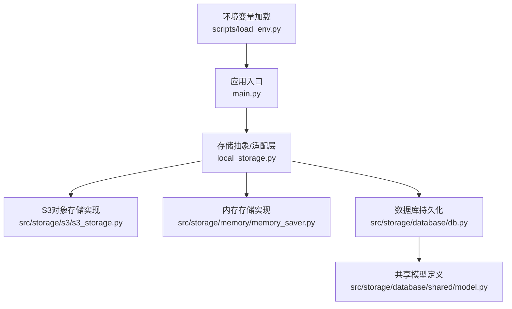
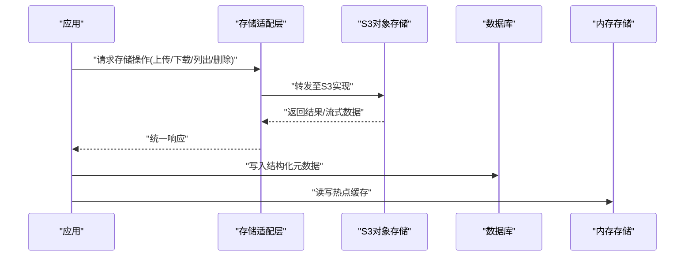
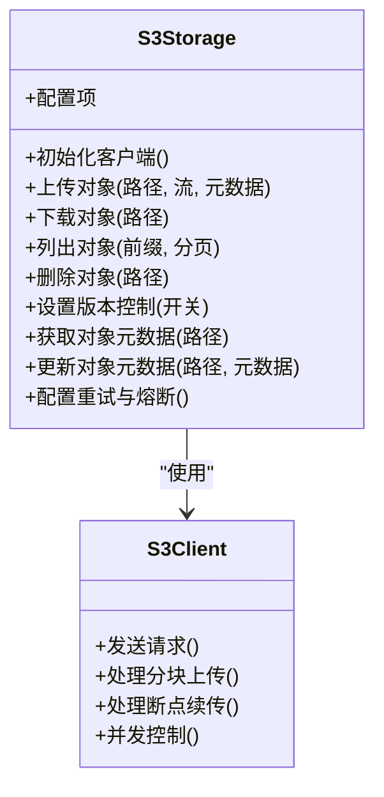
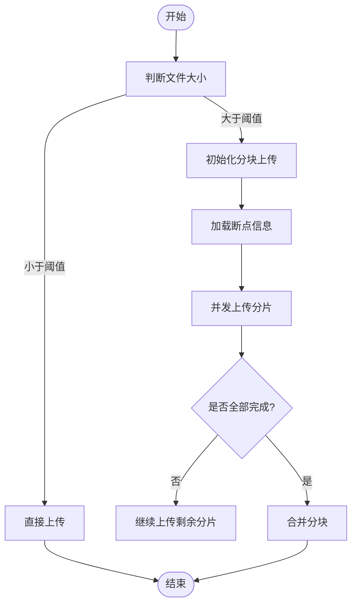
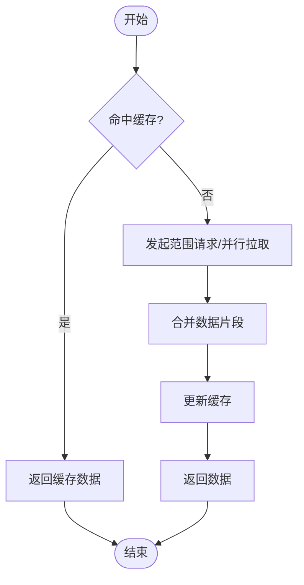
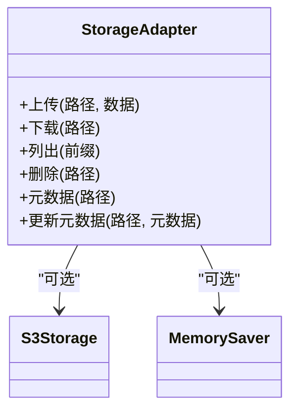
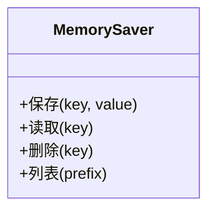
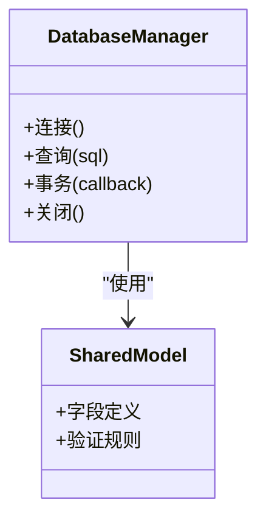
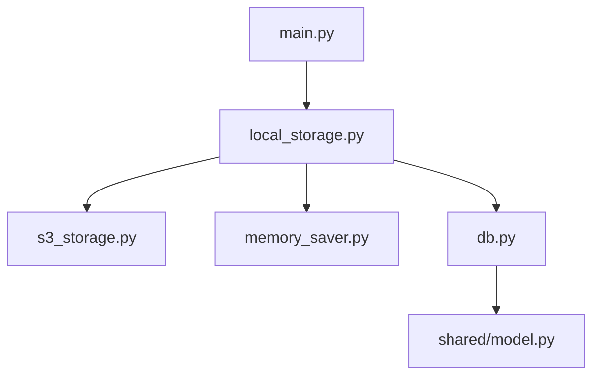

# 对象存储实现

<cite>
**本文引用的文件**   
- [s3_storage.py](file://src/storage/s3/s3_storage.py)
- [db.py](file://src/storage/database/db.py)
- [model.py](file://src/storage/database/shared/model.py)
- [memory_saver.py](file://src/storage/memory/memory_saver.py)
- [__init__.py](file://src/storage/memory/__init__.py)
- [main.py](file://src/main.py)
- [local_storage.py](file://src/local_storage.py)
- [load_env.py](file://scripts/load_env.py)
</cite>

## 目录
1. [简介](#简介)
2. [项目结构](#项目结构)
3. [核心组件](#核心组件)
4. [架构总览](#架构总览)
5. [详细组件分析](#详细组件分析)
6. [依赖关系分析](#依赖关系分析)
7. [性能与成本优化](#性能与成本优化)
8. [故障排查指南](#故障排查指南)
9. [结论](#结论)
10. [附录](#附录)

## 简介
本技术文档围绕仓库中的S3对象存储实现，系统性阐述AWS S3兼容存储的集成方案，涵盖客户端配置、认证授权、连接管理、上传下载机制（分块传输、断点续传、并发控制）、对象元数据与版本控制、存储桶策略与访问权限控制、大文件处理优化与缓存策略、错误重试与故障转移逻辑，以及存储成本优化建议与性能监控指标。文档同时结合数据库与内存存储模块，给出统一存储抽象与扩展思路。

## 项目结构
本项目采用分层与按功能域组织相结合的结构：
- storage层提供多种后端存储能力：S3对象存储、本地文件系统、内存存储、数据库持久化等。
- scripts提供环境加载与运行脚本。
- main为应用入口，负责初始化与调度。

图表来源
- [main.py](file://src/main.py)
- [local_storage.py](file://src/local_storage.py)
- [s3_storage.py](file://src/storage/s3/s3_storage.py)
- [memory_saver.py](file://src/storage/memory/memory_saver.py)
- [db.py](file://src/storage/database/db.py)
- [model.py](file://src/storage/database/shared/model.py)
- [load_env.py](file://scripts/load_env.py)

章节来源
- [main.py](file://src/main.py)
- [local_storage.py](file://src/local_storage.py)
- [s3_storage.py](file://src/storage/s3/s3_storage.py)
- [memory_saver.py](file://src/storage/memory/memory_saver.py)
- [db.py](file://src/storage/database/db.py)
- [model.py](file://src/storage/database/shared/model.py)
- [load_env.py](file://scripts/load_env.py)

## 核心组件
- S3对象存储实现：封装S3客户端创建、认证、连接池、上传下载、分块与并发、元数据与版本控制、错误重试与熔断等能力。
- 存储抽象适配层：对外暴露统一的存储接口，屏蔽不同后端差异，便于切换与扩展。
- 内存存储实现：用于测试或临时缓存场景，具备轻量、快速特性。
- 数据库持久化：用于结构化数据的持久化，与对象存储互补。
- 环境变量加载：集中读取并注入S3相关配置项。

章节来源
- [s3_storage.py](file://src/storage/s3/s3_storage.py)
- [local_storage.py](file://src/local_storage.py)
- [memory_saver.py](file://src/storage/memory/memory_saver.py)
- [db.py](file://src/storage/database/db.py)
- [model.py](file://src/storage/database/shared/model.py)
- [load_env.py](file://scripts/load_env.py)

## 架构总览
整体架构以“应用入口 → 存储适配层 → 具体存储后端”为主线，S3作为主要对象存储后端，配合数据库与内存存储形成混合持久化方案。

图表来源
- [main.py](file://src/main.py)
- [local_storage.py](file://src/local_storage.py)
- [s3_storage.py](file://src/storage/s3/s3_storage.py)
- [db.py](file://src/storage/database/db.py)
- [memory_saver.py](file://src/storage/memory/memory_saver.py)

## 详细组件分析

### S3对象存储实现
该组件负责与AWS S3或兼容服务交互，提供以下关键能力：
- 客户端配置与认证授权：支持AK/SK、端点URL、区域、协议、签名版本等；可对接IAM角色或环境变量注入。
- 连接管理：复用HTTP连接、合理设置超时与重试参数，避免频繁握手开销。
- 上传下载机制：
  - 分块传输：对大对象进行分片上传，提升吞吐与稳定性。
  - 断点续传：记录已上传分片，失败后可从断点恢复。
  - 并发控制：限制并发分片数，平衡资源占用与速度。
- 对象元数据管理：读写自定义键值对，便于业务索引与检索。
- 版本控制：启用后每次覆盖产生新版本，支持回滚与审计。
- 错误重试与熔断：针对网络抖动与服务限流进行指数退避重试，必要时熔断降级。
- 安全与合规：最小权限原则、服务端加密、传输加密、访问日志。

图表来源
- [s3_storage.py](file://src/storage/s3/s3_storage.py)

章节来源
- [s3_storage.py](file://src/storage/s3/s3_storage.py)

#### 上传流程（含分块与断点续传）

图表来源
- [s3_storage.py](file://src/storage/s3/s3_storage.py)

#### 下载流程（含并发与缓存）

图表来源
- [s3_storage.py](file://src/storage/s3/s3_storage.py)

### 存储适配层
适配层对外暴露统一接口，内部根据配置选择S3、内存或本地存储实现，屏蔽差异并提供一致的API语义。

图表来源
- [local_storage.py](file://src/local_storage.py)
- [s3_storage.py](file://src/storage/s3/s3_storage.py)
- [memory_saver.py](file://src/storage/memory/memory_saver.py)

章节来源
- [local_storage.py](file://src/local_storage.py)
- [memory_saver.py](file://src/storage/memory/memory_saver.py)

### 内存存储实现
适用于测试、预热或热点数据缓存，强调低延迟与简单性。

图表来源
- [memory_saver.py](file://src/storage/memory/memory_saver.py)
- [__init__.py](file://src/storage/memory/__init__.py)

章节来源
- [memory_saver.py](file://src/storage/memory/memory_saver.py)
- [__init__.py](file://src/storage/memory/__init__.py)

### 数据库持久化
用于结构化元数据与审计信息的持久化，与对象存储解耦。

图表来源
- [db.py](file://src/storage/database/db.py)
- [model.py](file://src/storage/database/shared/model.py)

章节来源
- [db.py](file://src/storage/database/db.py)
- [model.py](file://src/storage/database/shared/model.py)

### 环境变量加载
集中读取S3相关配置项，如端点、区域、密钥、桶名、分块大小、并发度、重试次数等，供上层组件使用。

章节来源
- [load_env.py](file://scripts/load_env.py)

## 依赖关系分析
- 应用入口依赖存储适配层，适配层再按需依赖S3、内存或数据库实现。
- S3实现依赖底层SDK与网络库，需关注连接池与重试策略。
- 数据库实现依赖ORM或驱动，注意事务与锁的使用。

图表来源
- [main.py](file://src/main.py)
- [local_storage.py](file://src/local_storage.py)
- [s3_storage.py](file://src/storage/s3/s3_storage.py)
- [memory_saver.py](file://src/storage/memory/memory_saver.py)
- [db.py](file://src/storage/database/db.py)
- [model.py](file://src/storage/database/shared/model.py)

章节来源
- [main.py](file://src/main.py)
- [local_storage.py](file://src/local_storage.py)
- [s3_storage.py](file://src/storage/s3/s3_storage.py)
- [memory_saver.py](file://src/storage/memory/memory_saver.py)
- [db.py](file://src/storage/database/db.py)
- [model.py](file://src/storage/database/shared/model.py)

## 性能与成本优化
- 大文件处理优化
  - 分块大小调优：根据网络带宽与对象大小动态调整分块大小，兼顾吞吐与内存占用。
  - 并发控制：限制并发分片数，避免打满CPU/IO；对高延迟链路适当降低并发。
  - 断点续传：持久化分片状态，异常恢复时跳过已完成分片。
  - 压缩与编码：对文本类对象启用压缩，减少传输体积。
- 缓存策略
  - 多级缓存：本地内存缓存热点小对象，磁盘缓存中等对象，S3作为主存储。
  - 缓存失效：基于ETag或版本号失效，保证一致性。
  - 预取与预热：在任务启动前预取常用对象，降低首字节延迟。
- 连接与重试
  - 连接池：复用TCP连接，减少握手开销。
  - 指数退避重试：对瞬态错误进行重试，设置最大重试次数与上限时间。
  - 熔断与降级：连续失败触发熔断，切换到只读或备用桶。
- 存储成本优化
  - 生命周期策略：将冷数据自动转低频/归档存储，定期清理过期对象。
  - 去重与增量：基于内容哈希去重，仅保留唯一对象。
  - 压缩与精简：减少冗余字段与重复数据。
  - 分区与命名规范：合理划分目录与前缀，提高列举效率与成本控制。
- 监控指标
  - 吞吐与延迟：上传/下载速率、P95/P99延迟。
  - 成功率与错误分布：4xx/5xx比例、重试率、熔断触发次数。
  - 资源使用：CPU、内存、网络带宽、连接池利用率。
  - 存储用量：对象数量、容量、冷热分布、生命周期命中率。

[本节为通用指导，不直接分析具体文件]

## 故障排查指南
- 认证失败
  - 检查AK/SK、端点、区域、签名版本与环境变量注入是否正确。
  - 确认IAM权限包含必要的S3操作与桶策略允许。
- 连接超时/限流
  - 调整超时与重试参数，观察限流码并实施指数退避。
  - 降低并发分片数，避免触发服务端限流。
- 分块上传失败
  - 校验分片完整性与顺序，核对断点状态文件。
  - 查看服务端分片列表，定位缺失分片并补传。
- 元数据不一致
  - 对比对象ETag与本地缓存，强制刷新缓存。
  - 检查并发写入冲突，引入版本号或乐观锁。
- 版本控制问题
  - 确认桶版本控制开启，区分当前版本与历史版本。
  - 回滚到指定版本时需明确目标版本ID。

章节来源
- [s3_storage.py](file://src/storage/s3/s3_storage.py)
- [load_env.py](file://scripts/load_env.py)

## 结论
通过统一的存储适配层与完善的S3实现，系统实现了高可用、可扩展的对象存储能力。结合分块传输、断点续传、并发控制、元数据与版本控制、错误重试与熔断，能够满足大文件与高吞吐场景需求。配合缓存策略与生命周期管理，可在保障性能的同时有效控制成本。建议在生产环境中完善监控告警与压测回归，持续优化参数与策略。

[本节为总结性内容，不直接分析具体文件]

## 附录
- 配置项清单（示例）
  - 端点URL、区域、协议、签名版本
  - AK/SK或IAM角色
  - 桶名称、默认前缀
  - 分块大小、并发分片数、最大重试次数
  - 超时时间、连接池大小
  - 缓存大小与TTL
  - 版本控制开关
- 最佳实践
  - 最小权限原则与细粒度桶策略
  - 统一命名规范与分区策略
  - 全链路加密与访问日志
  - 灰度发布与回滚预案

[本节为补充说明，不直接分析具体文件]