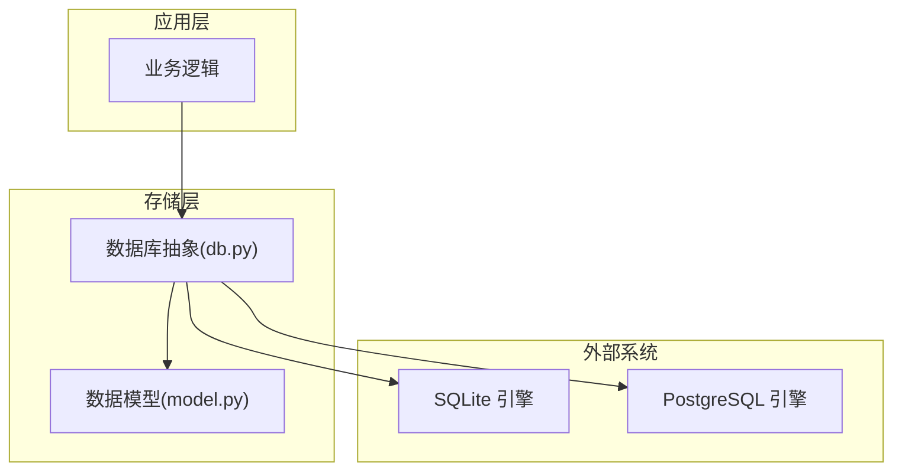
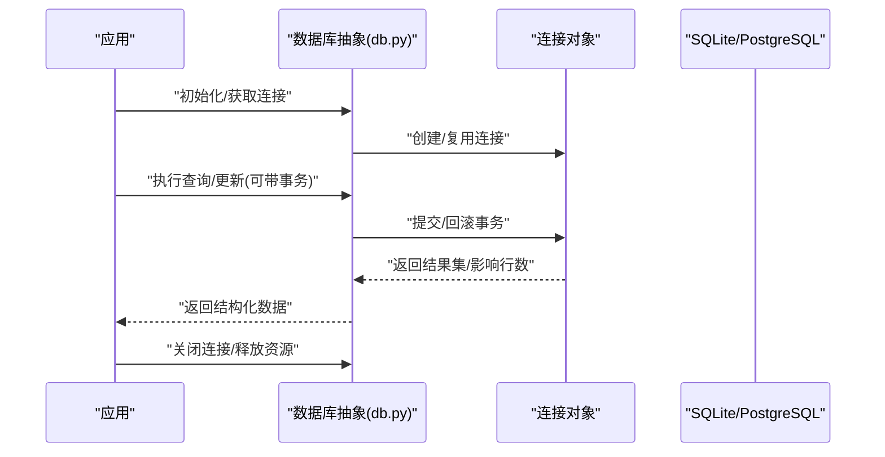
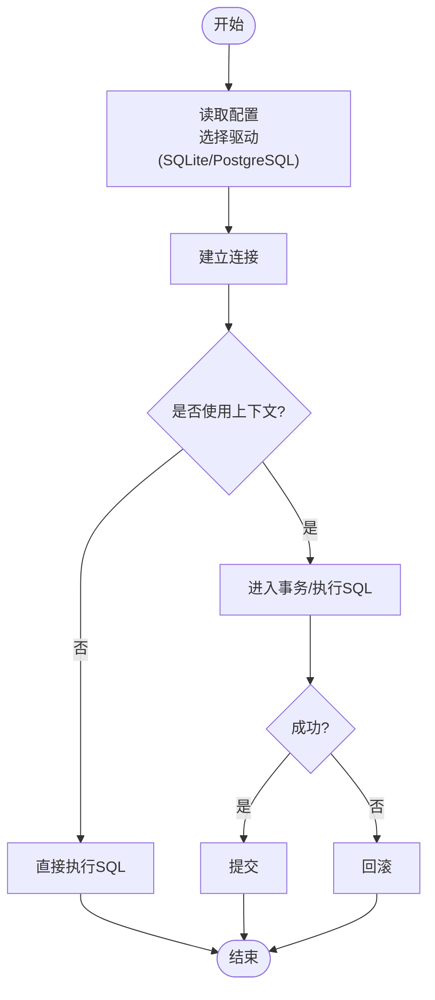
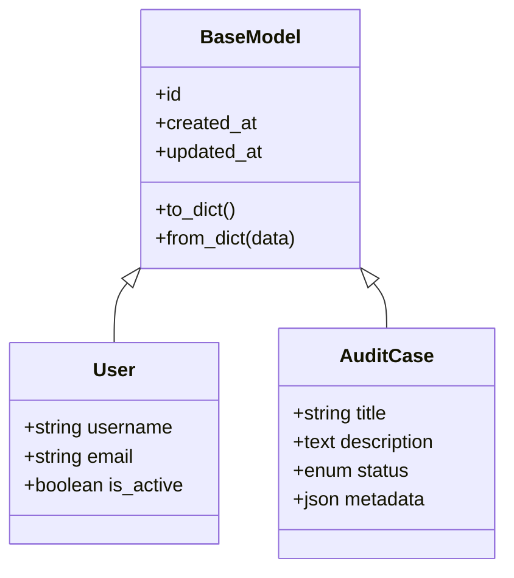
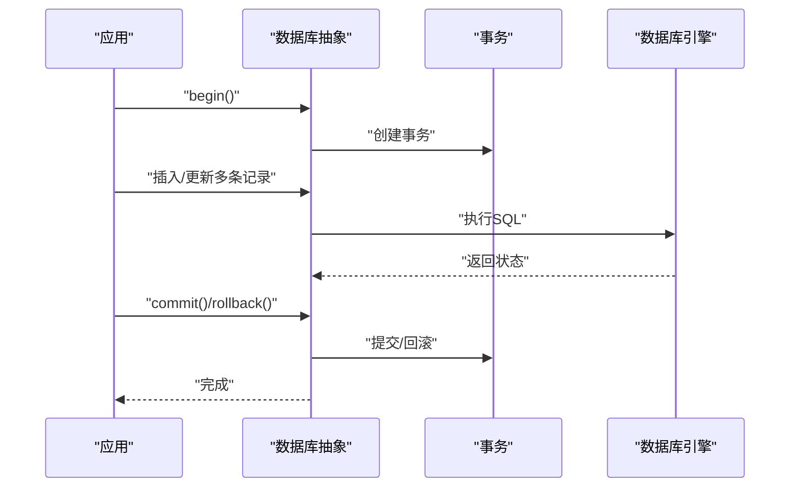
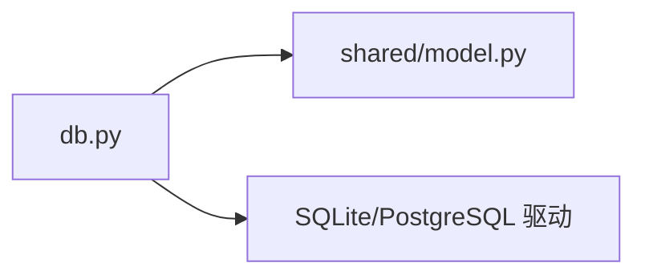

# 数据库存储实现

<cite>
**本文引用的文件**   
- [src/storage/database/db.py](file://src/storage/database/db.py)
- [src/storage/database/shared/model.py](file://src/storage/database/shared/model.py)
</cite>

## 目录
1. [简介](#简介)
2. [项目结构](#项目结构)
3. [核心组件](#核心组件)
4. [架构总览](#架构总览)
5. [详细组件分析](#详细组件分析)
6. [依赖关系分析](#依赖关系分析)
7. [性能考虑](#性能考虑)
8. [故障排查指南](#故障排查指南)
9. [结论](#结论)
10. [附录](#附录)

## 简介
本技术文档聚焦于数据库存储层的实现，围绕 SQLite/PostgreSQL 的连接建立与管理、数据模型设计、ORM 映射与序列化、事务处理、索引优化与查询调优、备份恢复与监控告警等方面展开。文档旨在帮助开发者快速理解并正确使用现有数据库抽象层，同时为后续扩展（如连接池、迁移工具、监控指标）提供清晰的演进路径。

## 项目结构
当前仓库中与数据库存储相关的代码位于 storage 子模块下，主要包含：
- database 子包：封装数据库连接与基础操作
- shared/model.py：定义共享的数据模型（实体）
- memory/s3 等：非关系型存储（不在本文范围）

图表来源
- [src/storage/database/db.py](file://src/storage/database/db.py)
- [src/storage/database/shared/model.py](file://src/storage/database/shared/model.py)

章节来源
- [src/storage/database/db.py](file://src/storage/database/db.py)
- [src/storage/database/shared/model.py](file://src/storage/database/shared/model.py)

## 核心组件
- 数据库连接管理：负责根据配置选择 SQLite 或 PostgreSQL，建立连接、执行 SQL、返回结果集，并提供上下文管理器以安全释放资源。
- 数据模型：使用声明式方式定义表结构与字段类型，便于 ORM 映射与校验。
- 事务与并发控制：在需要原子性的操作中开启事务，确保一致性；针对高并发场景建议采用行级锁与幂等写入策略。
- 错误处理：对常见异常进行捕获与转换，向上层抛出统一错误类型，便于重试与降级。

章节来源
- [src/storage/database/db.py](file://src/storage/database/db.py)
- [src/storage/database/shared/model.py](file://src/storage/database/shared/model.py)

## 架构总览
下图展示了从应用调用到数据库引擎的端到端流程，包括连接获取、SQL 执行、结果映射与资源释放。

图表来源
- [src/storage/database/db.py](file://src/storage/database/db.py)

## 详细组件分析

### 数据库连接与生命周期管理
- 连接选择：依据配置决定使用 SQLite 或 PostgreSQL 驱动。
- 连接建立：支持 DSN/URL 形式传入，内部解析后创建连接。
- 连接复用：建议在应用启动时建立长连接并在请求间复用；若引入连接池，需配置最小/最大连接数、空闲超时与最大生命周期。
- 上下文管理：通过上下文管理器自动提交/回滚与释放连接，避免泄漏。
- 故障恢复：对网络抖动、连接断开等异常进行指数退避重试；对死锁/锁等待进行短间隔重试。

图表来源
- [src/storage/database/db.py](file://src/storage/database/db.py)

章节来源
- [src/storage/database/db.py](file://src/storage/database/db.py)

### 数据模型设计与 ORM 映射
- 模型定义：使用声明式基类定义表名、主键与字段类型，支持必填、默认值、唯一性约束等。
- 字段类型：字符串、整数、浮点、布尔、时间戳等，按目标数据库方言映射。
- 关系建模：一对多、一对一可通过外键与关联属性表达；复杂查询可使用原生 SQL 或 ORM 组合。
- 序列化：将模型实例序列化为字典/JSON，用于 API 响应或日志记录；反序列化用于批量导入或迁移脚本。

图表来源
- [src/storage/database/shared/model.py](file://src/storage/database/shared/model.py)

章节来源
- [src/storage/database/shared/model.py](file://src/storage/database/shared/model.py)

### 事务处理与并发控制
- 事务边界：将一组相关写操作包裹在事务中，保证原子性与一致性。
- 回滚策略：发生异常时自动回滚；对于部分失败场景，可在上层捕获并做补偿。
- 并发控制：利用数据库行级锁与隔离级别控制脏读/不可重复读/幻读；在高并发写入时建议引入幂等键与去重逻辑。
- 重试机制：对死锁、锁等待等短暂冲突进行有限次重试，避免雪崩。

图表来源
- [src/storage/database/db.py](file://src/storage/database/db.py)

章节来源
- [src/storage/database/db.py](file://src/storage/database/db.py)

### 初始化脚本与迁移管理
- 初始化脚本：在首次部署时创建库与表结构，填充基础数据。
- 迁移方案：建议使用版本化迁移脚本，按顺序执行增量变更；回滚时需维护反向迁移。
- 幂等性：所有初始化与迁移脚本应具备幂等特性，支持重复执行不破坏数据。

章节来源
- [src/storage/database/db.py](file://src/storage/database/db.py)
- [src/storage/database/shared/model.py](file://src/storage/database/shared/model.py)

### 索引优化与查询调优
- 索引策略：为高频过滤、排序与连接列建立索引；避免过度索引导致写入退化。
- 覆盖索引：尽量让查询命中索引，减少回表。
- 查询计划：定期审查慢查询，结合 EXPLAIN 调整 SQL 与索引。
- 分页与限流：大结果集采用游标分页，限制单次返回量。

章节来源
- [src/storage/database/db.py](file://src/storage/database/db.py)
- [src/storage/database/shared/model.py](file://src/storage/database/shared/model.py)

### 备份恢复与监控告警
- 备份策略：
  - SQLite：冷备（停止服务后拷贝文件）或热备（使用内置备份接口）。
  - PostgreSQL：逻辑备份（pg_dump）与物理备份（WAL 归档），配合定时任务。
- 恢复演练：定期验证备份可用性与恢复时长。
- 监控告警：
  - 指标：连接数、活跃事务、慢查询数量、锁等待、磁盘空间。
  - 告警：连接池耗尽、长时间未提交事务、磁盘空间不足、复制延迟。

章节来源
- [src/storage/database/db.py](file://src/storage/database/db.py)

## 依赖关系分析
- 模块内依赖：db.py 依赖 model.py 中的模型定义，用于 ORM 映射与结果集转换。
- 外部依赖：SQLite/PostgreSQL 驱动与连接库；可选连接池库（如 SQLAlchemy Pool、psycopg2.pool）。
- 潜在循环依赖：应避免 db.py 与业务模块互相引用，保持单向依赖。

图表来源
- [src/storage/database/db.py](file://src/storage/database/db.py)
- [src/storage/database/shared/model.py](file://src/storage/database/shared/model.py)

章节来源
- [src/storage/database/db.py](file://src/storage/database/db.py)
- [src/storage/database/shared/model.py](file://src/storage/database/shared/model.py)

## 性能考虑
- 连接池：合理设置最小/最大连接数、空闲超时与最大生命周期，避免频繁创建销毁。
- 批处理：批量插入/更新减少往返开销。
- 预编译语句：重用 SQL 模板，降低解析成本。
- 读写分离：只读查询走副本，提升吞吐。
- 缓存：热点数据使用内存缓存（如 Redis）减轻数据库压力。

[本节为通用指导，无需特定文件来源]

## 故障排查指南
- 常见问题：
  - 连接失败：检查 DSN、权限、防火墙与端口。
  - 事务卡住：定位长时间未提交的事务与持有锁的记录。
  - 慢查询：使用 EXPLAIN 分析执行计划，补充索引或改写 SQL。
  - 备份失败：确认磁盘空间与备份路径权限。
- 诊断步骤：
  - 启用详细日志，记录 SQL 与耗时。
  - 收集连接池与事务指标，观察峰值与瓶颈。
  - 复现问题并抓取快照（线程栈、锁信息）。

章节来源
- [src/storage/database/db.py](file://src/storage/database/db.py)

## 结论
当前数据库存储层提供了基础的连接管理与模型定义能力，满足一般业务需求。建议后续引入连接池、迁移工具与完善的监控告警体系，以提升稳定性与可观测性。通过合理的索引与查询优化，可显著改善性能与用户体验。

[本节为总结性内容，无需特定文件来源]

## 附录
- 术语说明：
  - DSN：数据源名称，用于描述数据库连接参数。
  - ORM：对象关系映射，将数据库表映射为对象。
  - WAL：Write-Ahead Logging，预写日志，用于持久化与恢复。
- 参考实践：
  - 幂等写入：使用唯一键与 ON CONFLICT 策略。
  - 灰度发布：先在新库上运行迁移，再切换流量。

[本节为概念性内容，无需特定文件来源]