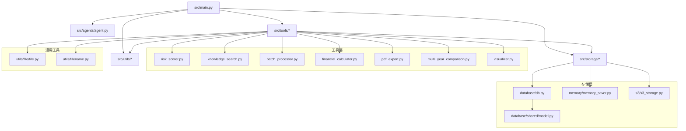
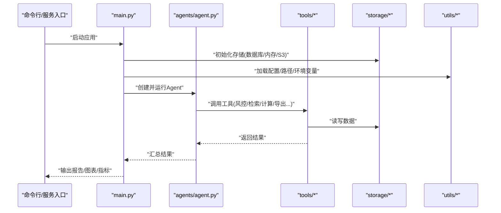
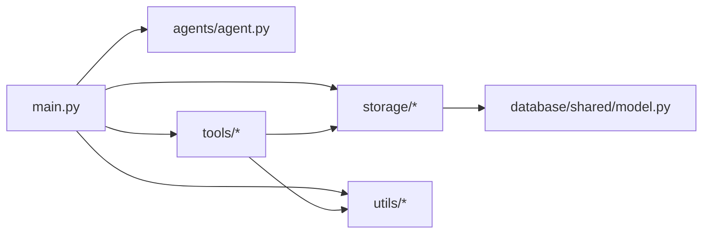
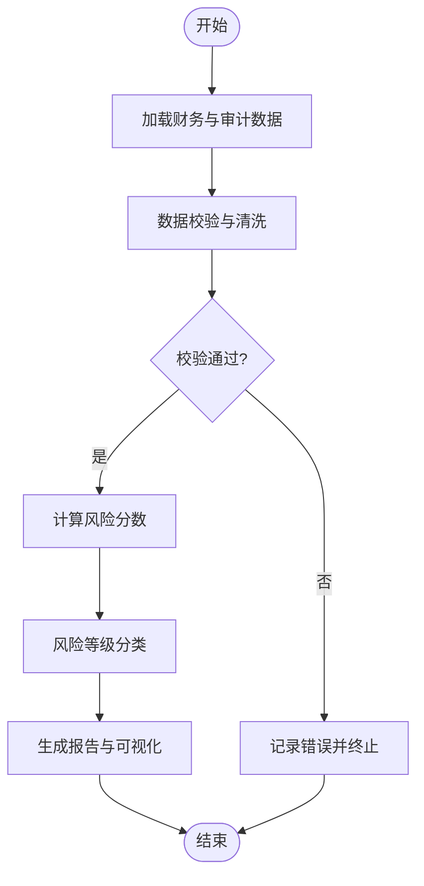
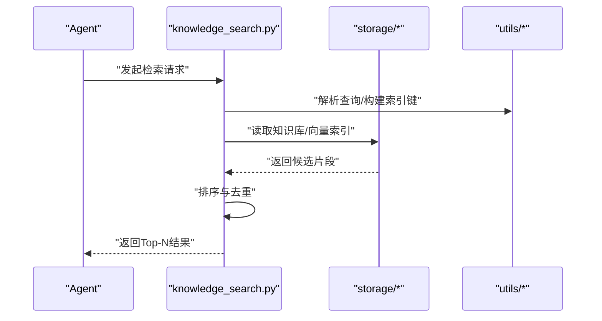

# 代码规范与约定

<cite>
**本文引用的文件**   
- [src/main.py](file://src/main.py)
- [src/agents/agent.py](file://src/agents/agent.py)
- [src/storage/database/db.py](file://src/storage/database/db.py)
- [src/storage/database/shared/model.py](file://src/storage/database/shared/model.py)
- [src/storage/memory/memory_saver.py](file://src/storage/memory/memory_saver.py)
- [src/storage/s3/s3_storage.py](file://src/storage/s3/s3_storage.py)
- [src/tools/risk_scorer.py](file://src/tools/risk_scorer.py)
- [src/tools/knowledge_search.py](file://src/tools/knowledge_search.py)
- [src/tools/batch_processor.py](file://src/tools/batch_processor.py)
- [src/tools/financial_calculator.py](file://src/tools/financial_calculator.py)
- [src/tools/pdf_export.py](file://src/tools/pdf_export.py)
- [src/tools/multi_year_comparison.py](file://src/tools/multi_year_comparison.py)
- [src/tools/visualizer.py](file://src/tools/visualizer.py)
- [src/utils/file/file.py](file://src/utils/file/file.py)
- [src/utils/filename.py](file://src/utils/filename.py)
- [pyproject.toml](file://pyproject.toml)
- [Dockerfile](file://Dockerfile)
- [scripts/init_knowledge_base.py](file://scripts/init_knowledge_base.py)
- [scripts/load_env.py](file://scripts/load_env.py)
- [tests/test_financial_calculator.py](file://tests/test_financial_calculator.py)
- [tests/test_data_validator.py](file://tests/test_data_validator.py)
</cite>

## 目录
1. [引言](#引言)
2. [项目结构](#项目结构)
3. [核心组件](#核心组件)
4. [架构总览](#架构总览)
5. [详细组件分析](#详细组件分析)
6. [依赖关系分析](#依赖关系分析)
7. [性能考量](#性能考量)
8. [故障排查指南](#故障排查指南)
9. [结论](#结论)
10. [附录](#附录)

## 引言
本文件为“智能审计风险识别系统”的代码规范与开发约定，面向新加入的开发者与维护者。目标包括：
- 统一命名、注释、结构与组织方式，降低协作成本
- 明确Python编码最佳实践（类型注解、异常处理、日志记录）
- 规定Git提交与分支策略，保障可追溯性与稳定性
- 配置并落地代码质量检查工具链，提升整体质量
- 提供审查清单与常见问题规避建议，减少返工

## 项目结构
仓库采用分层+领域模块的组织方式：
- src：应用源码，按功能域划分（agents、storage、tools、utils、web等）
- scripts：运维与初始化脚本
- tests：测试用例与评估脚本
- config：运行时配置
- assets：静态资源
- local_storage：本地产物（图表、报告）
- Dockerfile：容器化构建

图示来源
- [src/main.py](file://src/main.py)
- [src/agents/agent.py](file://src/agents/agent.py)
- [src/storage/database/db.py](file://src/storage/database/db.py)
- [src/storage/database/shared/model.py](file://src/storage/database/shared/model.py)
- [src/storage/memory/memory_saver.py](file://src/storage/memory/memory_saver.py)
- [src/storage/s3/s3_storage.py](file://src/storage/s3/s3_storage.py)
- [src/tools/risk_scorer.py](file://src/tools/risk_scorer.py)
- [src/tools/knowledge_search.py](file://src/tools/knowledge_search.py)
- [src/tools/batch_processor.py](file://src/tools/batch_processor.py)
- [src/tools/financial_calculator.py](file://src/tools/financial_calculator.py)
- [src/tools/pdf_export.py](file://src/tools/pdf_export.py)
- [src/tools/multi_year_comparison.py](file://src/tools/multi_year_comparison.py)
- [src/tools/visualizer.py](file://src/tools/visualizer.py)
- [src/utils/file/file.py](file://src/utils/file/file.py)
- [src/utils/filename.py](file://src/utils/filename.py)

章节来源
- [src/main.py](file://src/main.py)
- [src/agents/agent.py](file://src/agents/agent.py)
- [src/storage/database/db.py](file://src/storage/database/db.py)
- [src/storage/database/shared/model.py](file://src/storage/database/shared/model.py)
- [src/storage/memory/memory_saver.py](file://src/storage/memory/memory_saver.py)
- [src/storage/s3/s3_storage.py](file://src/storage/s3/s3_storage.py)
- [src/tools/risk_scorer.py](file://src/tools/risk_scorer.py)
- [src/tools/knowledge_search.py](file://src/tools/knowledge_search.py)
- [src/tools/batch_processor.py](file://src/tools/batch_processor.py)
- [src/tools/financial_calculator.py](file://src/tools/financial_calculator.py)
- [src/tools/pdf_export.py](file://src/tools/pdf_export.py)
- [src/tools/multi_year_comparison.py](file://src/tools/multi_year_comparison.py)
- [src/tools/visualizer.py](file://src/tools/visualizer.py)
- [src/utils/file/file.py](file://src/utils/file/file.py)
- [src/utils/filename.py](file://src/utils/filename.py)

## 核心组件
- 入口与编排
  - 主程序负责加载配置、初始化存储与工具、调度Agent执行任务、输出结果。
- Agent
  - 封装审计流程中的智能体行为，协调工具调用与数据流转。
- 存储层
  - 数据库持久化、内存缓存、对象存储（S3）三种实现，提供统一接口。
- 工具层
  - 风险评估、知识检索、批量处理、财务计算、PDF导出、多年对比、可视化等能力。
- 通用工具
  - 文件操作、文件名生成等基础能力。

章节来源
- [src/main.py](file://src/main.py)
- [src/agents/agent.py](file://src/agents/agent.py)
- [src/storage/database/db.py](file://src/storage/database/db.py)
- [src/storage/memory/memory_saver.py](file://src/storage/memory/memory_saver.py)
- [src/storage/s3/s3_storage.py](file://src/storage/s3/s3_storage.py)
- [src/tools/risk_scorer.py](file://src/tools/risk_scorer.py)
- [src/tools/knowledge_search.py](file://src/tools/knowledge_search.py)
- [src/tools/batch_processor.py](file://src/tools/batch_processor.py)
- [src/tools/financial_calculator.py](file://src/tools/financial_calculator.py)
- [src/tools/pdf_export.py](file://src/tools/pdf_export.py)
- [src/tools/multi_year_comparison.py](file://src/tools/multi_year_comparison.py)
- [src/tools/visualizer.py](file://src/tools/visualizer.py)
- [src/utils/file/file.py](file://src/utils/file/file.py)
- [src/utils/filename.py](file://src/utils/filename.py)

## 架构总览
系统采用“入口编排 + Agent驱动 + 工具组合 + 多后端存储”的分层架构。Agent通过工具完成具体业务动作，存储层抽象出统一的数据访问接口，便于替换与扩展。

图示来源
- [src/main.py](file://src/main.py)
- [src/agents/agent.py](file://src/agents/agent.py)
- [src/storage/database/db.py](file://src/storage/database/db.py)
- [src/storage/memory/memory_saver.py](file://src/storage/memory/memory_saver.py)
- [src/storage/s3/s3_storage.py](file://src/storage/s3/s3_storage.py)
- [src/tools/risk_scorer.py](file://src/tools/risk_scorer.py)
- [src/tools/knowledge_search.py](file://src/tools/knowledge_search.py)
- [src/tools/batch_processor.py](file://src/tools/batch_processor.py)
- [src/tools/financial_calculator.py](file://src/tools/financial_calculator.py)
- [src/tools/pdf_export.py](file://src/tools/pdf_export.py)
- [src/tools/multi_year_comparison.py](file://src/tools/multi_year_comparison.py)
- [src/tools/visualizer.py](file://src/tools/visualizer.py)
- [src/utils/file/file.py](file://src/utils/file/file.py)
- [src/utils/filename.py](file://src/utils/filename.py)

## 详细组件分析

### 命名规范
- 包与模块
  - 使用小写加下划线命名，如 storage、knowledge_search、multi_year_comparison。
  - 模块职责单一，避免跨层耦合；工具类放在 tools，通用能力放在 utils。
- 类与接口
  - 类名使用大驼峰，如 RiskScorer、MemorySaver、S3Storage。
  - 接口/协议以名词或动宾短语表达能力，如 StorageProvider、KnowledgeSearcher。
- 函数与方法
  - 方法名使用小写下划线，动词开头，如 load_config、save_report、calculate_risk_score。
  - 布尔返回值方法以 is_/has_/can_ 前缀，如 is_valid、has_permission。
- 变量与常量
  - 局部变量与实例属性使用小写下划线；常量全大写加下划线，如 MAX_RETRY、DEFAULT_TIMEOUT。
  - 私有成员以下划线前缀，如 _cache、_logger。
- 文件组织
  - 每个模块一个文件，文件名即模块名；公共接口在 __init__.py 中集中导出。
  - 相关模型集中在 shared 子包，如 database/shared/model.py。

章节来源
- [src/storage/database/shared/model.py](file://src/storage/database/shared/model.py)
- [src/storage/memory/memory_saver.py](file://src/storage/memory/memory_saver.py)
- [src/storage/s3/s3_storage.py](file://src/storage/s3/s3_storage.py)
- [src/tools/knowledge_search.py](file://src/tools/knowledge_search.py)
- [src/tools/multi_year_comparison.py](file://src/tools/multi_year_comparison.py)
- [src/utils/filename.py](file://src/utils/filename.py)

### 注释与文档字符串标准
- 模块级
  - 首行模块文档字符串说明用途、依赖、外部约束。
- 类级
  - 描述类的职责、状态不变式、线程安全假设。
- 函数/方法级
  - 必须包含参数、返回值、异常说明；复杂逻辑需补充算法步骤与边界条件。
- API接口
  - 对外暴露的方法需标注输入输出契约、错误码/异常类型、幂等性、并发限制。
- 复杂逻辑
  - 对关键分支、阈值、公式来源进行注释，必要时引用参考文档或论文。

章节来源
- [src/tools/risk_scorer.py](file://src/tools/risk_scorer.py)
- [src/tools/knowledge_search.py](file://src/tools/knowledge_search.py)
- [src/tools/batch_processor.py](file://src/tools/batch_processor.py)
- [src/tools/financial_calculator.py](file://src/tools/financial_calculator.py)
- [src/tools/pdf_export.py](file://src/tools/pdf_export.py)
- [src/tools/multi_year_comparison.py](file://src/tools/multi_year_comparison.py)
- [src/tools/visualizer.py](file://src/tools/visualizer.py)

### 代码组织结构原则
- 分层清晰
  - 入口(main)、编排(Agent)、工具(tools)、存储(storage)、通用(utils)各司其职。
- 依赖方向
  - 上层依赖下层，禁止反向依赖；工具可依赖通用工具，但不应反向。
- 包管理
  - 使用 pyproject.toml 声明依赖与元信息；保持最小必要依赖集。
- 配置与环境
  - 配置文件集中于 config；敏感信息通过环境变量注入，避免硬编码。

章节来源
- [pyproject.toml](file://pyproject.toml)
- [config/agent_llm_config.json](file://config/agent_llm_config.json)
- [scripts/load_env.py](file://scripts/load_env.py)

### Python编码最佳实践
- 类型注解
  - 所有公开API必须添加类型注解；复杂类型使用 typing 模块；避免 Any 滥用。
- 异常处理
  - 自定义异常层次清晰，区分业务异常与系统异常；捕获时保留上下文。
- 日志记录
  - 使用结构化日志，包含请求ID、用户ID、耗时等维度；分级合理（DEBUG/INFO/WARNING/ERROR）。
- 资源管理
  - 文件、连接、临时资源使用上下文管理器；确保异常路径也能释放。
- 不可变与纯函数
  - 尽量将计算逻辑设计为纯函数，便于测试与复用。

章节来源
- [src/storage/database/db.py](file://src/storage/database/db.py)
- [src/storage/memory/memory_saver.py](file://src/storage/memory/memory_saver.py)
- [src/storage/s3/s3_storage.py](file://src/storage/s3/s3_storage.py)
- [src/tools/batch_processor.py](file://src/tools/batch_processor.py)
- [src/tools/financial_calculator.py](file://src/tools/financial_calculator.py)

### Git提交规范与分支管理
- 提交信息
  - 格式：type(scope): subject
  - type 包括 feat、fix、docs、style、refactor、test、chore、perf、build、ci。
  - 主题不超过50字符，正文说明动机与影响。
- 分支策略
  - main：稳定发布分支
  - develop：集成开发分支
  - feature/*：新功能
  - hotfix/*：紧急修复
  - release/*：预发布
- 合并要求
  - 至少一次评审通过；CI全部通过；变更覆盖测试。

章节来源
- [Dockerfile](file://Dockerfile)

### 代码质量检查工具配置与使用
- 推荐工具
  - 静态检查：ruff/flake8、mypy、bandit
  - 格式化：black、isort
  - 测试：pytest
  - 覆盖率：pytest-cov
- 配置位置
  - 在 pyproject.toml 中集中配置，避免散落rc文件。
- 本地运行
  - 安装依赖后，依次运行格式化、类型检查、静态扫描、单元测试。
- CI集成
  - 在流水线中固定版本运行，失败阻断合并。

章节来源
- [pyproject.toml](file://pyproject.toml)

### 代码审查清单
- 正确性
  - 边界条件、异常路径、并发安全是否覆盖
- 可读性
  - 命名一致、注释充分、复杂度可控
- 可维护性
  - 依赖最小化、模块内聚高、无循环依赖
- 安全性
  - 敏感信息不入库、权限校验、输入校验
- 性能
  - I/O与CPU热点有优化与监控
- 可测试性
  - 单测覆盖关键路径，Mock外部依赖

[本节为通用指导，无需列出具体文件来源]

### 常见问题避免指南
- 避免全局可变状态
- 避免深层嵌套与过长函数
- 避免吞掉异常与空except
- 避免阻塞I/O在主线程
- 避免硬编码路径与密钥
- 避免未处理的超时与重试风暴

[本节为通用指导，无需列出具体文件来源]

## 依赖关系分析
- 内部依赖
  - main 依赖 agents、tools、storage、utils
  - tools 依赖 storage 与 utils
  - storage 各实现相互独立，通过共享模型解耦
- 外部依赖
  - 通过 pyproject.toml 声明，容器镜像基于官方Python镜像构建

图示来源
- [src/main.py](file://src/main.py)
- [src/agents/agent.py](file://src/agents/agent.py)
- [src/storage/database/shared/model.py](file://src/storage/database/shared/model.py)
- [src/tools/risk_scorer.py](file://src/tools/risk_scorer.py)
- [src/tools/knowledge_search.py](file://src/tools/knowledge_search.py)
- [src/tools/batch_processor.py](file://src/tools/batch_processor.py)
- [src/tools/financial_calculator.py](file://src/tools/financial_calculator.py)
- [src/tools/pdf_export.py](file://src/tools/pdf_export.py)
- [src/tools/multi_year_comparison.py](file://src/tools/multi_year_comparison.py)
- [src/tools/visualizer.py](file://src/tools/visualizer.py)
- [src/storage/database/db.py](file://src/storage/database/db.py)
- [src/storage/memory/memory_saver.py](file://src/storage/memory/memory_saver.py)
- [src/storage/s3/s3_storage.py](file://src/storage/s3/s3_storage.py)
- [src/utils/file/file.py](file://src/utils/file/file.py)
- [src/utils/filename.py](file://src/utils/filename.py)

章节来源
- [pyproject.toml](file://pyproject.toml)
- [Dockerfile](file://Dockerfile)

## 性能考量
- I/O优化
  - 批量写入、分页读取、连接池复用
- 计算优化
  - 向量化计算、缓存中间结果、惰性求值
- 并发控制
  - 限流与退避、超时与熔断、异步任务队列
- 存储选择
  - 热数据内存缓存、冷数据归档至对象存储
- 监控与度量
  - 关键路径埋点、延迟分位统计、错误率告警

[本节为通用指导，无需列出具体文件来源]

## 故障排查指南
- 快速定位
  - 查看日志级别与上下文字段，结合请求ID追踪链路
- 常见错误
  - 配置缺失、网络超时、权限不足、数据格式不合法
- 恢复策略
  - 重试与降级、回滚到上一版本、清理脏数据
- 复现与回归
  - 构造最小复现场景，补充单测防止回归

章节来源
- [scripts/init_knowledge_base.py](file://scripts/init_knowledge_base.py)
- [scripts/load_env.py](file://scripts/load_env.py)
- [tests/test_financial_calculator.py](file://tests/test_financial_calculator.py)
- [tests/test_data_validator.py](file://tests/test_data_validator.py)

## 结论
通过统一的命名、注释、结构与组织规范，配合严格的类型注解、异常处理与日志记录，以及完善的Git与质量检查流程，本项目可在保证可维护性的同时持续提升交付效率与质量。建议在新功能开发中严格遵循本规范，并在评审中逐项核对。

## 附录

### 示例流程图：风险评估评分

图示来源
- [src/tools/risk_scorer.py](file://src/tools/risk_scorer.py)
- [src/tools/financial_calculator.py](file://src/tools/financial_calculator.py)
- [src/tools/pdf_export.py](file://src/tools/pdf_export.py)
- [src/tools/visualizer.py](file://src/tools/visualizer.py)

### 示例序列图：知识检索流程

图示来源
- [src/tools/knowledge_search.py](file://src/tools/knowledge_search.py)
- [src/storage/database/db.py](file://src/storage/database/db.py)
- [src/storage/memory/memory_saver.py](file://src/storage/memory/memory_saver.py)
- [src/storage/s3/s3_storage.py](file://src/storage/s3/s3_storage.py)
- [src/utils/file/file.py](file://src/utils/file/file.py)
- [src/utils/filename.py](file://src/utils/filename.py)