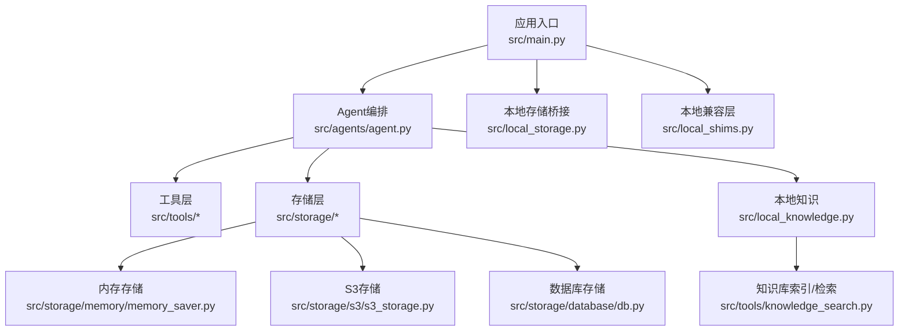
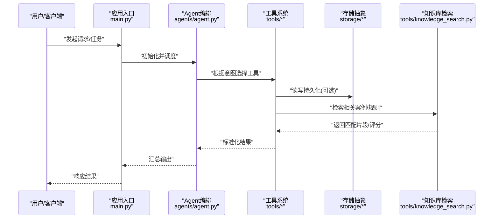
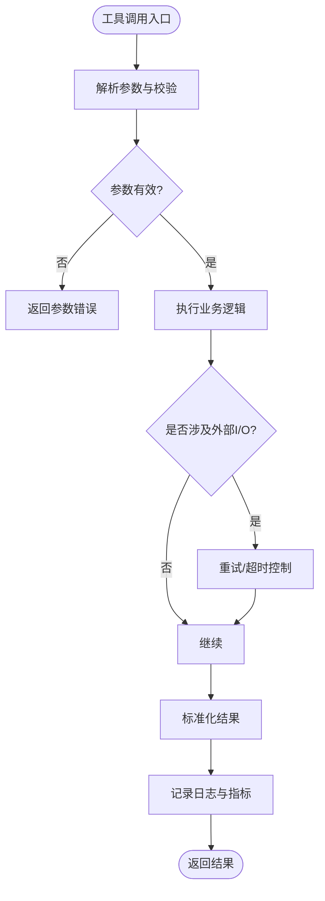
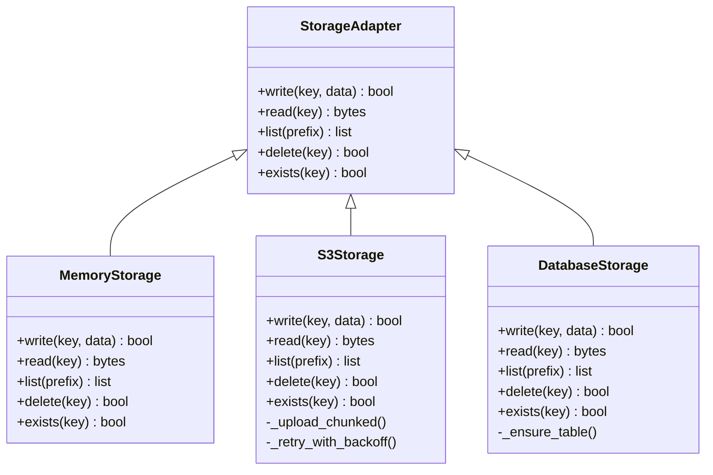
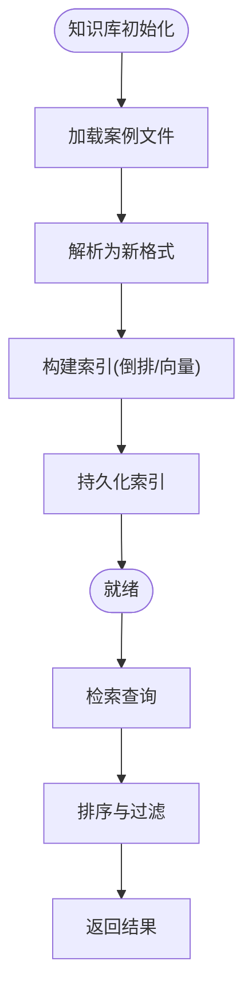
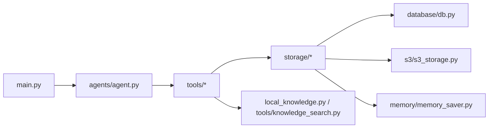

# 功能扩展开发

<cite>
**本文引用的文件**   
- [src/main.py](file://src/main.py)
- [src/agents/agent.py](file://src/agents/agent.py)
- [src/storage/memory/memory_saver.py](file://src/storage/memory/memory_saver.py)
- [src/storage/s3/s3_storage.py](file://src/storage/s3/s3_storage.py)
- [src/storage/database/db.py](file://src/storage/database/db.py)
- [src/storage/database/shared/model.py](file://src/storage/database/shared/model.py)
- [src/tools/knowledge_search.py](file://src/tools/knowledge_search.py)
- [src/tools/risk_scorer.py](file://src/tools/risk_scorer.py)
- [src/tools/batch_processor.py](file://src/tools/batch_processor.py)
- [src/tools/financial_calculator.py](file://src/tools/financial_calculator.py)
- [src/tools/multi_year_comparison.py](file://src/tools/multi_year_comparison.py)
- [src/tools/pdf_export.py](file://src/tools/pdf_export.py)
- [src/tools/visualizer.py](file://src/tools/visualizer.py)
- [src/local_knowledge.py](file://src/local_knowledge.py)
- [src/local_shims.py](file://src/local_shims.py)
- [src/local_storage.py](file://src/local_storage.py)
- [scripts/init_knowledge_base.py](file://scripts/init_knowledge_base.py)
- [knowledge_base/cases_ch9.txt](file://knowledge_base/cases_ch9.txt)
- [knowledge_base/cases_ch10.txt](file://knowledge_base/cases_ch10.txt)
- [knowledge_base/cases_ch11.txt](file://knowledge_base/cases_ch11.txt)
- [tests/test_financial_calculator.py](file://tests/test_financial_calculator.py)
- [tests/test_data_validator.py](file://tests/test_data_validator.py)
</cite>

## 目录
1. [简介](#简介)
2. [项目结构](#项目结构)
3. [核心组件](#核心组件)
4. [架构总览](#架构总览)
5. [详细组件分析](#详细组件分析)
6. [依赖关系分析](#依赖关系分析)
7. [性能考虑](#性能考虑)
8. [故障排查指南](#故障排查指南)
9. [结论](#结论)
10. [附录](#附录)

## 简介
本指南面向希望为“智能审计风险识别系统”进行功能扩展的开发者，聚焦以下目标：
- 扩展现有工具系统：自定义工具注册、参数传递与结果处理
- 开发存储适配器：以S3为例，提供可插拔的后端实现模式
- 扩展知识库：支持新案例格式与检索算法优化
- 集成第三方服务：封装API调用与错误处理
- 完整扩展流程：从需求到测试与上线
- 测试方法与性能优化建议

本指南在保持技术深度的同时，尽量用通俗语言解释关键概念，帮助不同背景的开发者快速上手。

## 项目结构
仓库采用分层与按职责划分相结合的组织方式：
- src：核心代码，包含入口、Agent编排、工具集、存储抽象与本地适配、Web界面等
- knowledge_base：知识库原始数据（文本案例）
- scripts：初始化脚本与环境准备
- tests：单元测试与评估脚本
- assets：静态资源（如基准数据）

图表来源
- [src/main.py](file://src/main.py)
- [src/agents/agent.py](file://src/agents/agent.py)
- [src/storage/memory/memory_saver.py](file://src/storage/memory/memory_saver.py)
- [src/storage/s3/s3_storage.py](file://src/storage/s3/s3_storage.py)
- [src/storage/database/db.py](file://src/storage/database/db.py)
- [src/local_knowledge.py](file://src/local_knowledge.py)
- [src/local_storage.py](file://src/local_storage.py)
- [src/local_shims.py](file://src/local_shims.py)

章节来源
- [src/main.py](file://src/main.py)
- [src/agents/agent.py](file://src/agents/agent.py)
- [src/local_knowledge.py](file://src/local_knowledge.py)
- [src/local_storage.py](file://src/local_storage.py)
- [src/local_shims.py](file://src/local_shims.py)

## 核心组件
- 应用入口与启动流程：负责加载配置、初始化Agent、挂载工具与存储后端、暴露HTTP接口或CLI入口
- Agent编排：协调工具调用、状态管理、上下文传递与结果聚合
- 工具系统：统一注册机制、参数校验、执行与结果标准化
- 存储层：统一的存储接口，支持内存、S3、数据库等多种后端
- 知识库：本地文本案例索引与检索，支持多版本案例文件
- 本地兼容层：为本地运行提供必要垫片与路径映射

章节来源
- [src/main.py](file://src/main.py)
- [src/agents/agent.py](file://src/agents/agent.py)
- [src/tools/knowledge_search.py](file://src/tools/knowledge_search.py)
- [src/storage/memory/memory_saver.py](file://src/storage/memory/memory_saver.py)
- [src/storage/s3/s3_storage.py](file://src/storage/s3/s3_storage.py)
- [src/storage/database/db.py](file://src/storage/database/db.py)
- [src/local_knowledge.py](file://src/local_knowledge.py)
- [src/local_storage.py](file://src/local_storage.py)
- [src/local_shims.py](file://src/local_shims.py)

## 架构总览
下图展示了扩展点与核心模块之间的交互关系，重点标注了工具注册、存储适配与知识库检索的关键路径。

图表来源
- [src/main.py](file://src/main.py)
- [src/agents/agent.py](file://src/agents/agent.py)
- [src/tools/knowledge_search.py](file://src/tools/knowledge_search.py)
- [src/storage/memory/memory_saver.py](file://src/storage/memory/memory_saver.py)
- [src/storage/s3/s3_storage.py](file://src/storage/s3/s3_storage.py)
- [src/storage/database/db.py](file://src/storage/database/db.py)

## 详细组件分析

### 工具系统与插件机制
- 设计要点
  - 统一注册：通过装饰器或显式注册表将工具函数纳入调度
  - 参数契约：定义输入Schema（类型、必填、默认值），在调用前校验
  - 结果规范：统一返回结构（成功/失败、消息、数据体），便于下游聚合
  - 异步与重试：对耗时I/O操作支持异步与重试策略
  - 可观测性：记录入参、出参与耗时，便于排障与性能分析
- 现有工具示例
  - 财务计算：用于指标计算与阈值判断
  - 批量处理：对多条数据进行流水线处理
  - 多年对比：跨期指标对比与趋势分析
  - PDF导出：将报告导出为PDF
  - 可视化：生成图表或可视化摘要
  - 风险评分：基于规则或模型的风险打分
  - 知识检索：从知识库中检索相关案例与规则
- 扩展步骤
  - 新建工具文件：在src/tools下新增模块，定义工具函数与元信息
  - 注册工具：在工具注册表中添加条目（名称、描述、参数Schema、实现）
  - 参数校验：使用统一校验器验证输入，返回结构化错误
  - 结果处理：遵循标准返回结构，必要时包装异常
  - 集成测试：编写单测覆盖正常路径与边界条件
  - 文档更新：补充使用说明与示例

图表来源
- [src/tools/financial_calculator.py](file://src/tools/financial_calculator.py)
- [src/tools/batch_processor.py](file://src/tools/batch_processor.py)
- [src/tools/multi_year_comparison.py](file://src/tools/multi_year_comparison.py)
- [src/tools/pdf_export.py](file://src/tools/pdf_export.py)
- [src/tools/visualizer.py](file://src/tools/visualizer.py)
- [src/tools/risk_scorer.py](file://src/tools/risk_scorer.py)
- [src/tools/knowledge_search.py](file://src/tools/knowledge_search.py)

章节来源
- [src/tools/financial_calculator.py](file://src/tools/financial_calculator.py)
- [src/tools/batch_processor.py](file://src/tools/batch_processor.py)
- [src/tools/multi_year_comparison.py](file://src/tools/multi_year_comparison.py)
- [src/tools/pdf_export.py](file://src/tools/pdf_export.py)
- [src/tools/visualizer.py](file://src/tools/visualizer.py)
- [src/tools/risk_scorer.py](file://src/tools/risk_scorer.py)
- [src/tools/knowledge_search.py](file://src/tools/knowledge_search.py)

### 存储适配器开发（以S3为例）
- 统一接口
  - 定义最小可用方法集合：写入、读取、列出、删除、存在性检查
  - 约定键空间与命名规范（如bucket/prefix/key）
  - 错误语义：区分网络错误、权限错误、对象不存在等
- S3适配器要点
  - 连接与认证：通过环境变量或配置文件注入凭证
  - 分块上传/下载：大文件场景下提升稳定性与吞吐
  - 并发与限流：避免触发远端限流
  - 幂等与重试：对写操作增加幂等键与指数退避
- 其他后端
  - 内存存储：适合开发与调试
  - 数据库存储：适合结构化数据与事务场景
- 扩展步骤
  - 新建适配器模块：在src/storage下创建子包与实现类
  - 实现统一接口：补齐所有必需方法
  - 配置注入：从配置中心或环境变量加载参数
  - 单元测试：模拟网络与文件系统行为，覆盖异常分支
  - 集成测试：对接真实S3环境或本地MinIO

图表来源
- [src/storage/memory/memory_saver.py](file://src/storage/memory/memory_saver.py)
- [src/storage/s3/s3_storage.py](file://src/storage/s3/s3_storage.py)
- [src/storage/database/db.py](file://src/storage/database/db.py)
- [src/storage/database/shared/model.py](file://src/storage/database/shared/model.py)

章节来源
- [src/storage/memory/memory_saver.py](file://src/storage/memory/memory_saver.py)
- [src/storage/s3/s3_storage.py](file://src/storage/s3/s3_storage.py)
- [src/storage/database/db.py](file://src/storage/database/db.py)
- [src/storage/database/shared/model.py](file://src/storage/database/shared/model.py)

### 知识库扩展方法
- 现状与能力
  - 本地文本案例：cases_ch9.txt、cases_ch10.txt、cases_ch11.txt
  - 初始化脚本：scripts/init_knowledge_base.py
  - 检索工具：src/tools/knowledge_search.py
  - 本地知识桥接：src/local_knowledge.py
- 扩展方向
  - 新案例格式支持：JSON/CSV/Markdown等，需在初始化阶段解析并构建索引
  - 检索算法优化：关键词+向量混合检索、相似度阈值、去重与缓存
  - 增量更新：支持热更新与版本化管理
  - 质量评估：引入召回率/准确率指标与人工抽检流程
- 实施步骤
  - 定义新格式Schema与校验规则
  - 在初始化脚本中增加解析与索引构建逻辑
  - 在检索工具中接入新索引源与排序策略
  - 编写测试用例：构造样例数据，验证检索正确性与性能

图表来源
- [scripts/init_knowledge_base.py](file://scripts/init_knowledge_base.py)
- [src/tools/knowledge_search.py](file://src/tools/knowledge_search.py)
- [src/local_knowledge.py](file://src/local_knowledge.py)
- [knowledge_base/cases_ch9.txt](file://knowledge_base/cases_ch9.txt)
- [knowledge_base/cases_ch10.txt](file://knowledge_base/cases_ch10.txt)
- [knowledge_base/cases_ch11.txt](file://knowledge_base/cases_ch11.txt)

章节来源
- [scripts/init_knowledge_base.py](file://scripts/init_knowledge_base.py)
- [src/tools/knowledge_search.py](file://src/tools/knowledge_search.py)
- [src/local_knowledge.py](file://src/local_knowledge.py)
- [knowledge_base/cases_ch9.txt](file://knowledge_base/cases_ch9.txt)
- [knowledge_base/cases_ch10.txt](file://knowledge_base/cases_ch10.txt)
- [knowledge_base/cases_ch11.txt](file://knowledge_base/cases_ch11.txt)

### 第三方服务集成模式
- 通用模式
  - 封装HTTP客户端：统一超时、重试、鉴权、签名
  - 错误分类：网络错误、业务错误、限流与配额不足
  - 降级策略：缓存兜底、只读模式、告警上报
  - 可观测性：请求链路ID、耗时分布、错误码统计
- 实践建议
  - 使用工厂或配置驱动创建客户端实例
  - 对敏感信息做加密与隔离
  - 提供Mock以便测试
- 参考位置
  - 可在工具层新增独立模块封装第三方API，并在Agent中按需调用

章节来源
- [src/tools/knowledge_search.py](file://src/tools/knowledge_search.py)
- [src/tools/risk_scorer.py](file://src/tools/risk_scorer.py)

### 完整扩展开发示例（端到端）
- 需求分析
  - 目标：新增“合规检查工具”，对输入数据进行规则匹配与风险提示
  - 范围：参数校验、规则引擎、结果标准化、存储落盘、日志与监控
- 设计与实现
  - 新建工具模块：src/tools/compliance_checker.py
  - 定义参数Schema与返回值结构
  - 实现规则匹配逻辑与异常处理
  - 集成存储：将检查结果写入S3或数据库
  - 注册工具：在工具注册表中登记
  - 更新Agent路由：根据意图选择该工具
- 测试与验收
  - 单元测试：覆盖正常、边界与异常路径
  - 集成测试：对接真实存储与知识库
  - 性能测试：压测高并发下的延迟与吞吐
- 发布与维护
  - 版本化与回滚策略
  - 文档与变更说明
  - 监控与告警配置

章节来源
- [src/tools/financial_calculator.py](file://src/tools/financial_calculator.py)
- [src/tools/batch_processor.py](file://src/tools/batch_processor.py)
- [src/tools/risk_scorer.py](file://src/tools/risk_scorer.py)
- [src/storage/s3/s3_storage.py](file://src/storage/s3/s3_storage.py)
- [src/storage/database/db.py](file://src/storage/database/db.py)
- [src/agents/agent.py](file://src/agents/agent.py)

## 依赖关系分析
- 模块耦合
  - main.py作为入口，依赖Agent与工具注册、存储后端初始化
  - Agent编排依赖工具与存储抽象，解耦具体实现
  - 工具层依赖存储与知识库，但不直接耦合具体后端
- 潜在循环依赖
  - 确保工具不反向依赖Agent，避免循环
  - 存储抽象不应依赖上层业务逻辑
- 外部依赖
  - S3 SDK、数据库驱动、PDF库、可视化库等

图表来源
- [src/main.py](file://src/main.py)
- [src/agents/agent.py](file://src/agents/agent.py)
- [src/tools/knowledge_search.py](file://src/tools/knowledge_search.py)
- [src/local_knowledge.py](file://src/local_knowledge.py)
- [src/storage/database/db.py](file://src/storage/database/db.py)
- [src/storage/s3/s3_storage.py](file://src/storage/s3/s3_storage.py)
- [src/storage/memory/memory_saver.py](file://src/storage/memory/memory_saver.py)

章节来源
- [src/main.py](file://src/main.py)
- [src/agents/agent.py](file://src/agents/agent.py)
- [src/tools/knowledge_search.py](file://src/tools/knowledge_search.py)
- [src/local_knowledge.py](file://src/local_knowledge.py)
- [src/storage/database/db.py](file://src/storage/database/db.py)
- [src/storage/s3/s3_storage.py](file://src/storage/s3/s3_storage.py)
- [src/storage/memory/memory_saver.py](file://src/storage/memory/memory_saver.py)

## 性能考虑
- 工具层
  - 批处理与并行：对独立任务使用并发执行，注意限流与熔断
  - 缓存热点数据：减少重复计算与远程调用
  - 惰性加载：按需加载大型资源
- 存储层
  - 分块传输：大文件上传/下载
  - 连接池：复用连接，降低握手开销
  - 压缩与序列化：选择合适的编码格式
- 知识库
  - 索引预构建：离线构建，在线仅检索
  - 相似度阈值调优：平衡召回与精度
  - 缓存最近查询结果
- 可观测性
  - 埋点关键路径：工具调用、存储读写、知识库检索
  - 指标面板：P95/P99延迟、错误率、吞吐

[本节为通用指导，无需特定文件引用]

## 故障排查指南
- 常见问题定位
  - 工具参数错误：检查Schema与校验逻辑
  - 存储写入失败：确认权限、网络连通与重试策略
  - 知识库检索为空：检查索引构建与查询语法
  - 第三方服务超时：调整超时与重试参数，查看限流提示
- 诊断手段
  - 开启详细日志：记录入参、出参与堆栈
  - 使用本地存储与Mock：隔离外部依赖
  - 复现最小用例：缩小问题范围
- 参考位置
  - 工具与存储的错误处理实现
  - 本地兼容层的路径与配置映射

章节来源
- [src/tools/knowledge_search.py](file://src/tools/knowledge_search.py)
- [src/storage/s3/s3_storage.py](file://src/storage/s3/s3_storage.py)
- [src/storage/memory/memory_saver.py](file://src/storage/memory/memory_saver.py)
- [src/local_shims.py](file://src/local_shims.py)
- [src/local_storage.py](file://src/local_storage.py)

## 结论
通过统一的工具注册与存储抽象、可扩展的知识库与第三方服务集成模式，本系统具备良好的扩展性。按照本指南的流程与方法，开发者可以高效地实现新功能并保持系统的稳定与可维护性。

[本节为总结，无需特定文件引用]

## 附录
- 测试方法
  - 单元测试：针对工具与存储适配器编写断言
  - 集成测试：端到端流程验证
  - 回归测试：保障既有功能不受影响
- 参考测试文件
  - 财务计算器测试
  - 数据校验器测试

章节来源
- [tests/test_financial_calculator.py](file://tests/test_financial_calculator.py)
- [tests/test_data_validator.py](file://tests/test_data_validator.py)