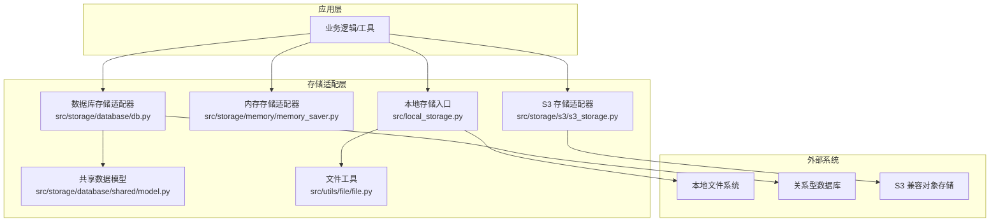
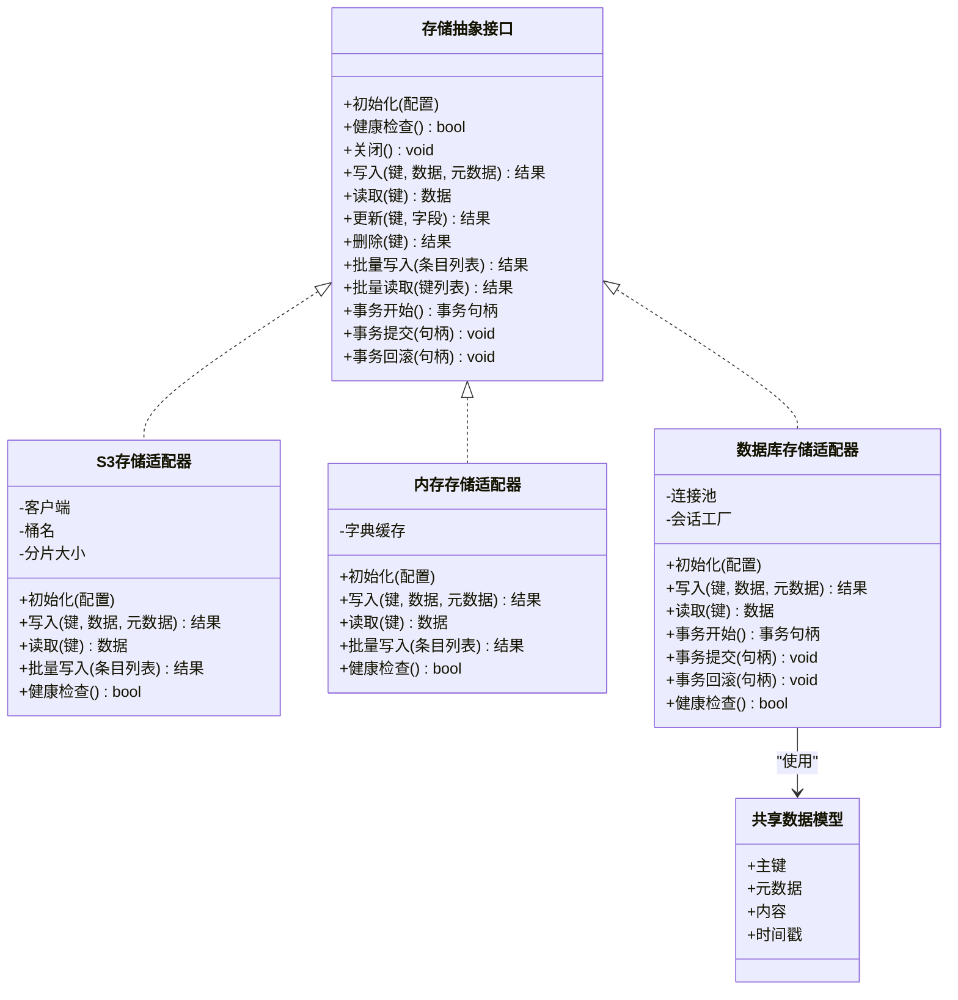
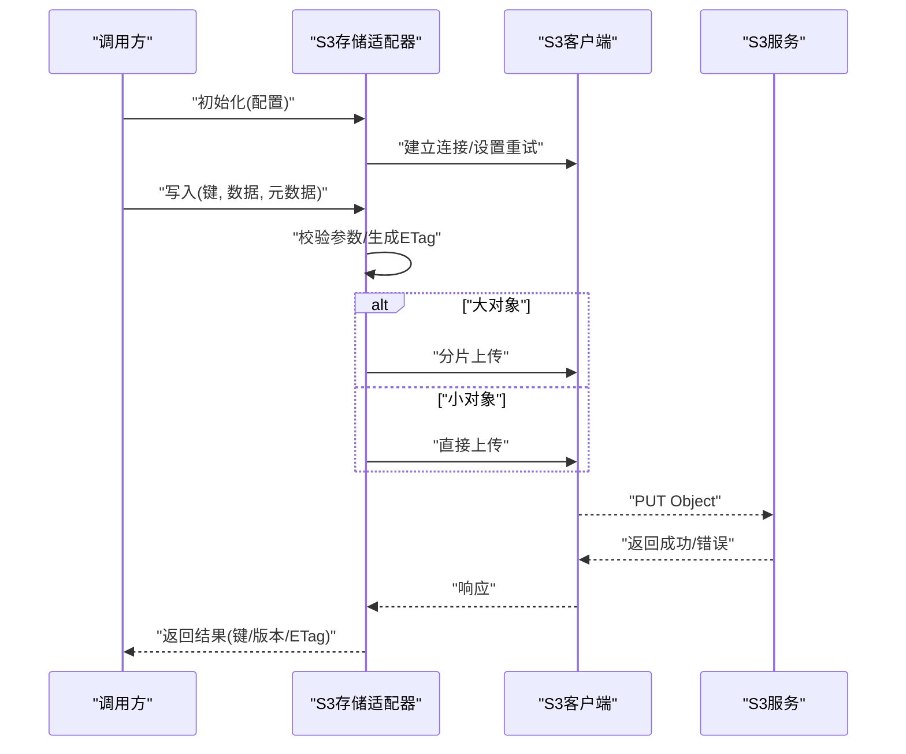
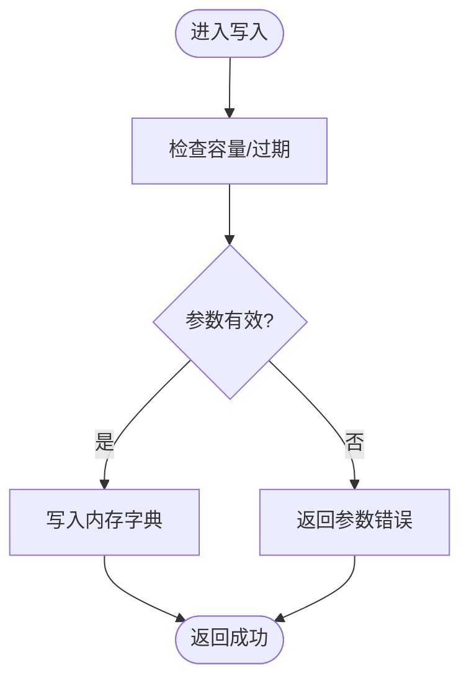
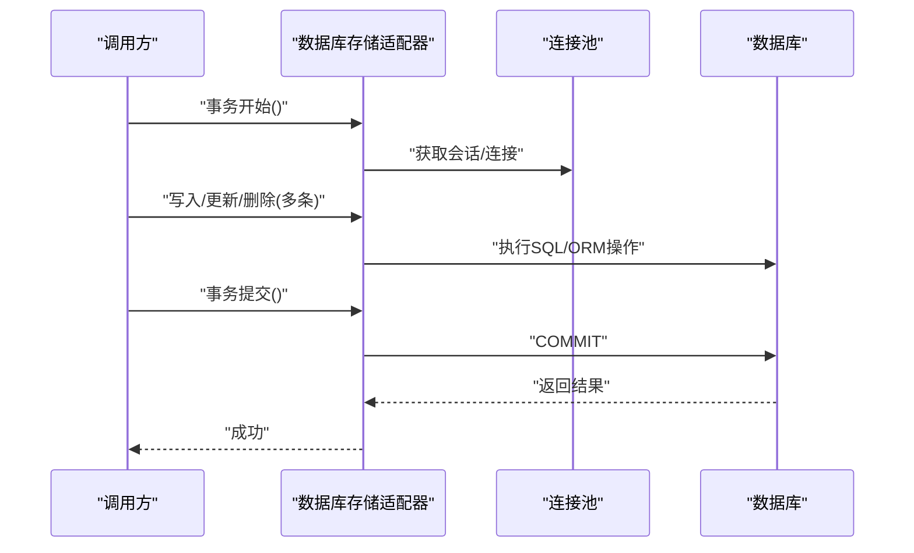
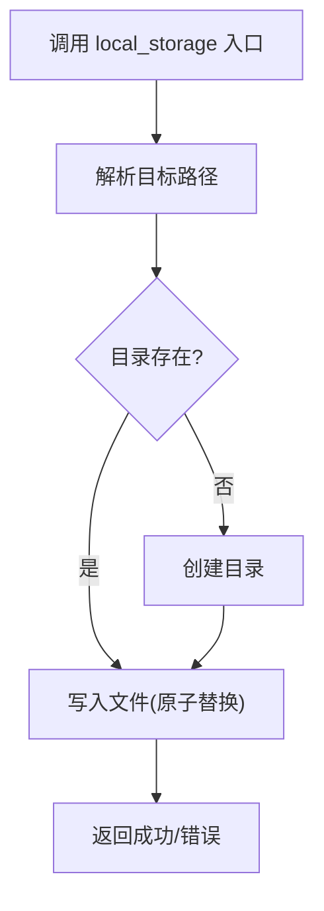
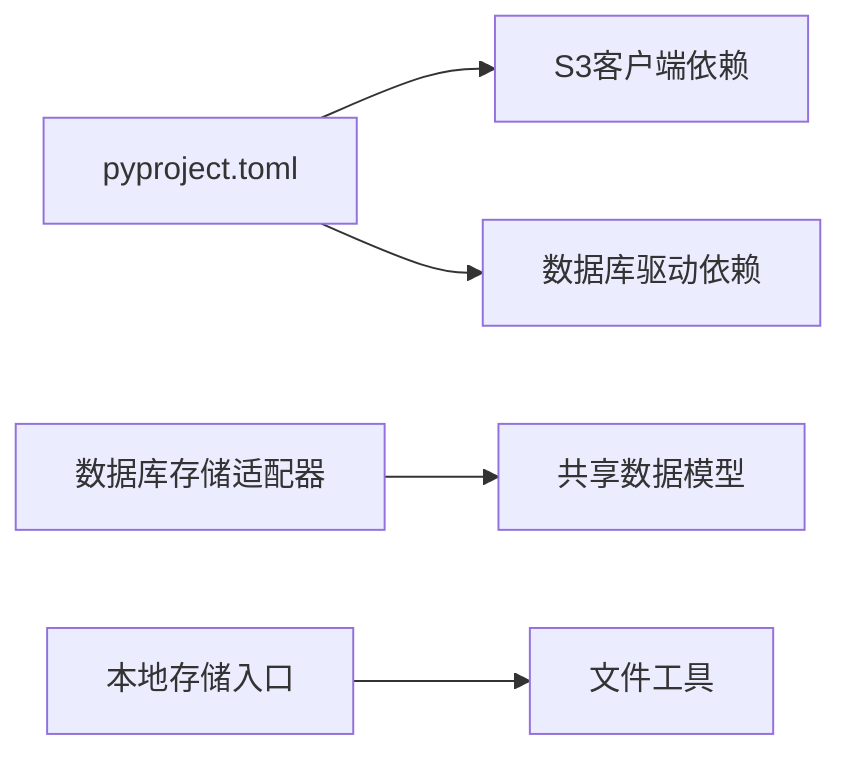

# 存储适配器扩展

<cite>
**本文引用的文件**   
- [src/storage/s3/s3_storage.py](file://src/storage/s3/s3_storage.py)
- [src/storage/memory/memory_saver.py](file://src/storage/memory/memory_saver.py)
- [src/storage/database/db.py](file://src/storage/database/db.py)
- [src/storage/database/shared/model.py](file://src/storage/database/shared/model.py)
- [src/local_storage.py](file://src/local_storage.py)
- [src/utils/file/file.py](file://src/utils/file/file.py)
- [pyproject.toml](file://pyproject.toml)
</cite>

## 目录
1. [简介](#简介)
2. [项目结构](#项目结构)
3. [核心组件](#核心组件)
4. [架构总览](#架构总览)
5. [详细组件分析](#详细组件分析)
6. [依赖分析](#依赖分析)
7. [性能考虑](#性能考虑)
8. [故障排查指南](#故障排查指南)
9. [结论](#结论)
10. [附录](#附录)

## 简介
本指南面向希望为“智能审计风险识别系统”扩展新存储后端的开发者，聚焦于存储抽象接口的设计模式与实现要求，提供从本地文件、内存到数据库与云存储（以S3为例）的完整集成路径。文档涵盖统一CRUD规范、批量处理、事务支持、配置管理、连接池优化、缓存策略、测试方法与性能调优建议，帮助开发者快速、稳定地接入各类存储方案。

## 项目结构
仓库中与存储相关的代码主要位于 src/storage 目录，包含三类已实现的存储后端：
- S3 对象存储适配
- 内存存储适配
- 关系型数据库存储适配（含共享模型定义）

此外，src/local_storage.py 作为本地存储的统一入口，封装了文件系统访问；src/utils/file/file.py 提供通用文件工具函数；pyproject.toml 声明外部依赖（如S3客户端库）。

图表来源
- [src/storage/s3/s3_storage.py](file://src/storage/s3/s3_storage.py)
- [src/storage/memory/memory_saver.py](file://src/storage/memory/memory_saver.py)
- [src/storage/database/db.py](file://src/storage/database/db.py)
- [src/storage/database/shared/model.py](file://src/storage/database/shared/model.py)
- [src/local_storage.py](file://src/local_storage.py)
- [src/utils/file/file.py](file://src/utils/file/file.py)

章节来源
- [src/storage/s3/s3_storage.py](file://src/storage/s3/s3_storage.py)
- [src/storage/memory/memory_saver.py](file://src/storage/memory/memory_saver.py)
- [src/storage/database/db.py](file://src/storage/database/db.py)
- [src/storage/database/shared/model.py](file://src/storage/database/shared/model.py)
- [src/local_storage.py](file://src/local_storage.py)
- [src/utils/file/file.py](file://src/utils/file/file.py)
- [pyproject.toml](file://pyproject.toml)

## 核心组件
本节概述存储抽象接口的关键职责与统一规范，确保不同后端具备一致的使用体验。

- 统一CRUD操作
  - 创建/写入：支持单条与批量写入，返回唯一标识或成功状态
  - 读取：按键/主键获取单条记录，支持范围查询与分页
  - 更新：按条件更新字段，支持幂等写
  - 删除：按键/主键删除，支持批量删除
- 批量处理
  - 批量上传/下载、批量插入/更新/删除
  - 失败重试与部分失败报告
- 事务支持
  - 对数据库后端提供显式事务边界（提交/回滚）
  - 对对象存储采用幂等命名与版本控制模拟事务语义
- 元数据与索引
  - 统一的元数据字段（如时间戳、大小、哈希、标签）
  - 可选二级索引（数据库后端）
- 错误与可观测性
  - 标准化异常类型与错误码
  - 结构化日志与指标埋点（耗时、吞吐、失败率）
- 配置与生命周期
  - 初始化参数（连接信息、超时、重试、限流）
  - 健康检查与优雅关闭
- 安全与合规
  - 最小权限原则、密钥管理、传输加密、审计日志

章节来源
- [src/storage/s3/s3_storage.py](file://src/storage/s3/s3_storage.py)
- [src/storage/memory/memory_saver.py](file://src/storage/memory/memory_saver.py)
- [src/storage/database/db.py](file://src/storage/database/db.py)
- [src/storage/database/shared/model.py](file://src/storage/database/shared/model.py)

## 架构总览
下图展示存储适配层在系统中的位置与交互关系，以及各后端的外部依赖。

图表来源
- [src/storage/s3/s3_storage.py](file://src/storage/s3/s3_storage.py)
- [src/storage/memory/memory_saver.py](file://src/storage/memory/memory_saver.py)
- [src/storage/database/db.py](file://src/storage/database/db.py)
- [src/storage/database/shared/model.py](file://src/storage/database/shared/model.py)

## 详细组件分析

### S3 存储适配器
S3 适配器负责与对象存储进行交互，提供高可靠、可扩展的持久化能力。典型职责包括：
- 连接管理：基于配置初始化客户端，支持端点、区域、凭据、超时与重试策略
- 数据上传下载：支持分片上传、断点续传、并发下载
- 错误处理：网络异常、权限不足、桶不存在等错误的分类与重试
- 元数据映射：将对象标签/自定义头映射为统一元数据
- 批量操作：多对象并行上传/下载，聚合失败项并返回明细

图表来源
- [src/storage/s3/s3_storage.py](file://src/storage/s3/s3_storage.py)

章节来源
- [src/storage/s3/s3_storage.py](file://src/storage/s3/s3_storage.py)

### 内存存储适配器
内存适配器用于开发调试与轻量场景，提供进程内键值存储能力：
- 数据结构：线程安全的字典/队列，支持过期与容量限制
- CRUD：同步读写，适合单元测试与快速验证
- 局限：无持久化、重启丢失、不适合高并发写入

图表来源
- [src/storage/memory/memory_saver.py](file://src/storage/memory/memory_saver.py)

章节来源
- [src/storage/memory/memory_saver.py](file://src/storage/memory/memory_saver.py)

### 数据库存储适配器
数据库适配器封装关系型数据库访问，提供强一致性与事务能力：
- 连接池：复用连接，控制最大连接数与空闲回收
- 会话管理：ORM/原生SQL会话的生命周期
- 事务：显式开启/提交/回滚，保证一致性
- 模型：通过共享模型定义表结构与约束

图表来源
- [src/storage/database/db.py](file://src/storage/database/db.py)
- [src/storage/database/shared/model.py](file://src/storage/database/shared/model.py)

章节来源
- [src/storage/database/db.py](file://src/storage/database/db.py)
- [src/storage/database/shared/model.py](file://src/storage/database/shared/model.py)

### 本地存储入口与文件工具
本地存储入口提供对文件系统的统一访问，结合文件工具函数完成路径解析、编码转换与IO封装：
- 路径规范化与目录自动创建
- 文本/二进制读写封装
- 临时文件清理与原子写入

图表来源
- [src/local_storage.py](file://src/local_storage.py)
- [src/utils/file/file.py](file://src/utils/file/file.py)

章节来源
- [src/local_storage.py](file://src/local_storage.py)
- [src/utils/file/file.py](file://src/utils/file/file.py)

## 依赖分析
- 外部依赖
  - S3 客户端库：由包管理器声明，用于对象存储通信
  - 数据库驱动：根据具体RDBMS选择相应驱动
- 内部依赖
  - 共享模型被数据库适配器引用
  - 本地存储入口依赖文件工具模块

图表来源
- [pyproject.toml](file://pyproject.toml)
- [src/storage/database/db.py](file://src/storage/database/db.py)
- [src/storage/database/shared/model.py](file://src/storage/database/shared/model.py)
- [src/local_storage.py](file://src/local_storage.py)
- [src/utils/file/file.py](file://src/utils/file/file.py)

章节来源
- [pyproject.toml](file://pyproject.toml)
- [src/storage/database/db.py](file://src/storage/database/db.py)
- [src/storage/database/shared/model.py](file://src/storage/database/shared/model.py)
- [src/local_storage.py](file://src/local_storage.py)
- [src/utils/file/file.py](file://src/utils/file/file.py)

## 性能考虑
- 连接池优化
  - 合理设置最大连接数、最小空闲连接与超时回收
  - 监控连接泄漏与等待队列长度
- 并发与批处理
  - 对象存储采用分片与并发上传/下载
  - 数据库批量插入/更新减少往返次数
- 缓存策略
  - 热点数据引入内存缓存（LRU/TTL），注意一致性
  - 读多写少场景显著降低后端压力
- 压缩与序列化
  - 大对象压缩传输，选择高效序列化格式
- 重试与退避
  - 指数退避与抖动避免雪崩
  - 区分可重试与不可重试错误
- I/O 与磁盘
  - 本地存储使用异步I/O与缓冲写入
  - 定期归档与冷热分层

[本节为通用指导，不直接分析具体文件]

## 故障排查指南
- 常见问题定位
  - 连接失败：检查凭据、网络可达、防火墙与安全组
  - 权限不足：确认桶/表权限与IAM策略
  - 超时与限流：调整超时阈值与重试策略，观察服务端限流提示
  - 数据不一致：核对事务边界与幂等键设计
- 诊断手段
  - 启用结构化日志与请求ID追踪
  - 采集关键指标（延迟分布、错误率、吞吐）
  - 使用健康检查端点与探针
- 恢复策略
  - 自动重试与降级（只读/缓存命中）
  - 熔断与隔离，防止级联故障
  - 备份与快照，必要时回滚

章节来源
- [src/storage/s3/s3_storage.py](file://src/storage/s3/s3_storage.py)
- [src/storage/database/db.py](file://src/storage/database/db.py)
- [src/storage/memory/memory_saver.py](file://src/storage/memory/memory_saver.py)

## 结论
通过统一的存储抽象接口与标准化的实现规范，系统能够灵活接入多种存储后端。S3、内存与数据库三种适配器的示例展示了连接管理、CRUD、批量与事务等关键能力的落地方式。配合合理的配置、连接池优化与缓存策略，可在保证一致性的同时获得良好的性能与稳定性。

[本节为总结性内容，不直接分析具体文件]

## 附录

### 如何开发新的存储后端（步骤清单）
- 定义适配器类，继承存储抽象接口
- 实现初始化与健康检查，完成连接建立与资源准备
- 实现CRUD方法，遵循统一参数与返回值约定
- 实现批量操作，聚合失败项并返回明细
- 如需事务，提供事务开始/提交/回滚接口
- 添加错误分类、重试与日志埋点
- 编写单元测试与集成测试，覆盖正常与异常路径
- 性能压测与调优（连接池、并发度、批大小、缓存命中率）

[本节为概念性指导，不直接分析具体文件]

### 配置管理要点
- 连接信息：端点、区域、凭据、数据库DSN
- 行为参数：超时、重试次数、退避策略、限流阈值
- 资源参数：分片大小、并发度、连接池大小、TTL
- 安全参数：加密开关、签名算法、最小权限策略

[本节为概念性指导，不直接分析具体文件]

### 测试方法建议
- 单元层面：Mock外部依赖，验证参数校验、错误分支与返回值
- 集成层面：使用测试数据库与沙箱桶，端到端验证CRUD与事务
- 性能层面：基准测试与负载测试，关注P95/P99延迟与吞吐
- 混沌层面：注入网络抖动、超时与限流，验证健壮性

[本节为概念性指导，不直接分析具体文件]