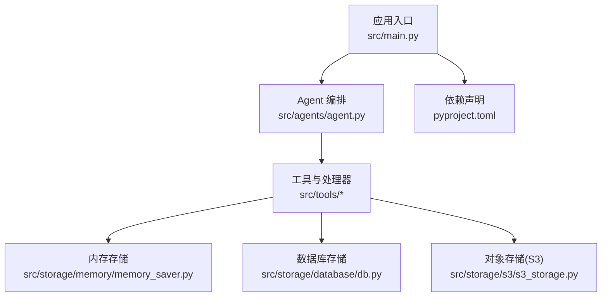
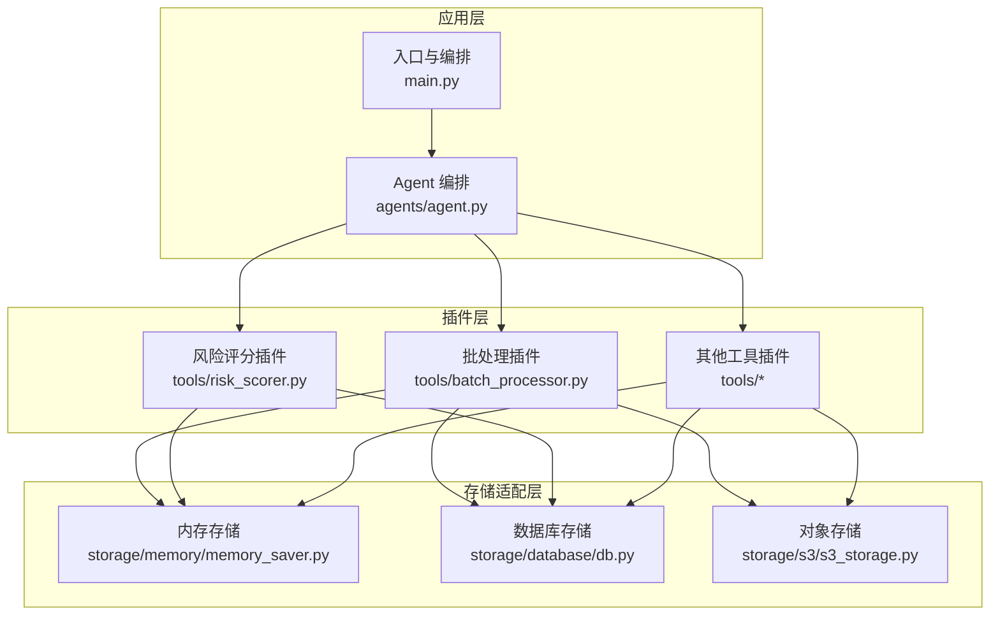
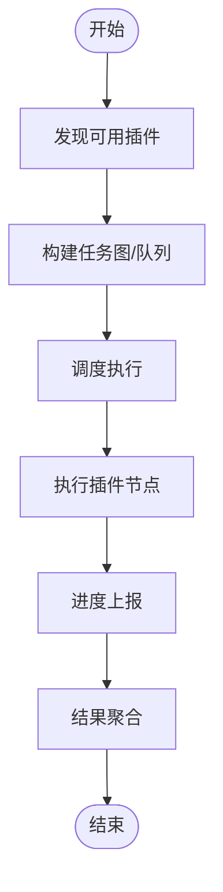
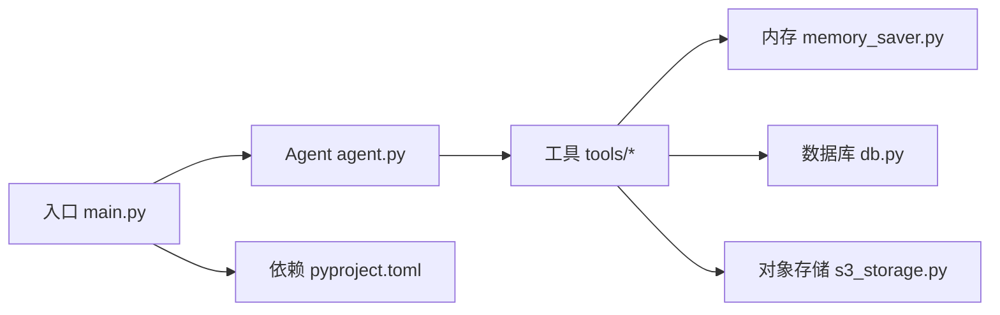

# 插件机制使用

<cite>
**本文引用的文件**   
- [src/main.py](file://src/main.py)
- [src/agents/agent.py](file://src/agents/agent.py)
- [src/tools/batch_processor.py](file://src/tools/batch_processor.py)
- [src/tools/risk_scorer.py](file://src/tools/risk_scorer.py)
- [src/storage/memory/memory_saver.py](file://src/storage/memory/memory_saver.py)
- [src/storage/database/db.py](file://src/storage/database/db.py)
- [src/storage/s3/s3_storage.py](file://src/storage/s3/s3_storage.py)
- [pyproject.toml](file://pyproject.toml)
</cite>

## 目录
1. [简介](#简介)
2. [项目结构](#项目结构)
3. [核心组件](#核心组件)
4. [架构总览](#架构总览)
5. [详细组件分析](#详细组件分析)
6. [依赖分析](#依赖分析)
7. [性能考虑](#性能考虑)
8. [故障排查指南](#故障排查指南)
9. [结论](#结论)
10. [附录](#附录)

## 简介
本指南面向希望扩展智能审计风险识别系统的开发者，聚焦“插件机制”的设计与使用。文档从系统整体架构出发，解释插件的发现、加载、执行与生命周期管理；给出插件开发规范（接口约定、配置管理、错误处理）；说明插件间通信与数据共享方式；并围绕批处理框架的任务调度、进度跟踪与结果聚合提供扩展要点。同时包含第三方服务集成的示例思路、测试方法与部署策略，帮助开发者高效、安全地扩展系统能力。

## 项目结构
仓库采用按功能分层组织的方式：入口与编排位于 src/main.py，业务节点在 agents 与 tools 中实现，存储层在 storage 下按介质划分，工具与计算逻辑集中在 tools 目录。该结构天然支持将可插拔的能力以“工具/处理器/存储适配器”的形式进行扩展。

图示来源
- [src/main.py](file://src/main.py)
- [src/agents/agent.py](file://src/agents/agent.py)
- [src/tools/batch_processor.py](file://src/tools/batch_processor.py)
- [src/storage/memory/memory_saver.py](file://src/storage/memory/memory_saver.py)
- [src/storage/database/db.py](file://src/storage/database/db.py)
- [src/storage/s3/s3_storage.py](file://src/storage/s3/s3_storage.py)
- [pyproject.toml](file://pyproject.toml)

章节来源
- [src/main.py](file://src/main.py)
- [src/agents/agent.py](file://src/agents/agent.py)
- [src/tools/batch_processor.py](file://src/tools/batch_processor.py)
- [src/storage/memory/memory_saver.py](file://src/storage/memory/memory_saver.py)
- [src/storage/database/db.py](file://src/storage/database/db.py)
- [src/storage/s3/s3_storage.py](file://src/storage/s3/s3_storage.py)
- [pyproject.toml](file://pyproject.toml)

## 核心组件
- 应用入口与编排：负责初始化上下文、发现并注册插件、协调 Agent 与工具的执行流程。
- Agent 编排：定义任务图或工作流，调用具体工具完成审计风险识别相关步骤。
- 工具与处理器：以“可插拔”的函数/类形式实现具体能力，如评分、可视化、导出等。
- 批处理框架：提供任务调度、并发控制、进度上报与结果聚合能力，便于扩展批量审计任务。
- 存储适配层：统一抽象存储后端，支持内存、关系型数据库与对象存储，作为插件化存储扩展点。

章节来源
- [src/main.py](file://src/main.py)
- [src/agents/agent.py](file://src/agents/agent.py)
- [src/tools/batch_processor.py](file://src/tools/batch_processor.py)
- [src/storage/memory/memory_saver.py](file://src/storage/memory/memory_saver.py)
- [src/storage/database/db.py](file://src/storage/database/db.py)
- [src/storage/s3/s3_storage.py](file://src/storage/s3/s3_storage.py)

## 架构总览
下图展示了插件机制在系统中的位置与交互关系：入口负责发现与注册，Agent 通过统一的工具接口调用插件，批处理框架对插件进行调度与聚合，存储层为插件提供持久化能力。

图示来源
- [src/main.py](file://src/main.py)
- [src/agents/agent.py](file://src/agents/agent.py)
- [src/tools/batch_processor.py](file://src/tools/batch_processor.py)
- [src/tools/risk_scorer.py](file://src/tools/risk_scorer.py)
- [src/storage/memory/memory_saver.py](file://src/storage/memory/memory_saver.py)
- [src/storage/database/db.py](file://src/storage/database/db.py)
- [src/storage/s3/s3_storage.py](file://src/storage/s3/s3_storage.py)

## 详细组件分析

### 插件发现与注册机制
- 发现策略：建议基于约定优于配置的策略，例如在指定包路径下扫描具备特定命名约定的模块或类，或通过配置文件声明插件清单。
- 注册中心：在入口或 Agent 初始化阶段维护一个全局注册表，将插件名称映射到可调用的实例或工厂方法。
- 动态导入：优先使用标准库的动态导入能力加载插件模块，避免引入额外运行时依赖。
- 依赖解析：插件声明其所需的外部依赖（如网络客户端、加密库），由入口在加载前校验环境是否满足。

章节来源
- [src/main.py](file://src/main.py)
- [src/agents/agent.py](file://src/agents/agent.py)

### 插件生命周期管理
- 初始化：插件在注册时完成资源准备（连接池、缓存预热、配置校验）。
- 运行期：暴露稳定的调用接口，接收输入参数并返回结构化结果。
- 监控与日志：记录关键事件与指标，便于问题定位与性能分析。
- 销毁：在进程退出或任务结束时释放外部资源（关闭连接、清理临时文件）。

章节来源
- [src/main.py](file://src/main.py)
- [src/agents/agent.py](file://src/agents/agent.py)

### 插件接口约定与配置管理
- 接口约定：每个插件应暴露一致的调用签名，包括输入校验、返回值结构与异常类型。
- 配置管理：插件读取自身配置项（如超时、重试次数、端点地址），由入口集中注入或从环境变量/配置文件加载。
- 版本兼容：插件需声明最小 API 版本，入口在加载时进行兼容性检查。

章节来源
- [src/agents/agent.py](file://src/agents/agent.py)
- [pyproject.toml](file://pyproject.toml)

### 插件间通信与数据共享
- 消息总线：通过轻量级事件通道在插件之间传递状态变更或中间结果。
- 共享上下文：在任务执行期间维护一个线程安全的上下文对象，供多个插件读写必要的数据。
- 存储桥接：对于跨任务或跨进程的数据，借助存储适配层进行持久化与检索。

章节来源
- [src/agents/agent.py](file://src/agents/agent.py)
- [src/storage/memory/memory_saver.py](file://src/storage/memory/memory_saver.py)
- [src/storage/database/db.py](file://src/storage/database/db.py)
- [src/storage/s3/s3_storage.py](file://src/storage/s3/s3_storage.py)

### 批处理框架的插件扩展
- 任务调度：支持串行、并行与有向无环图（DAG）形式的任务编排，插件可作为节点接入。
- 进度跟踪：插件在执行过程中上报进度与中间状态，供上层聚合展示。
- 结果聚合：批处理框架收集各插件输出，进行合并、过滤与汇总，生成最终报告。

章节来源
- [src/tools/batch_processor.py](file://src/tools/batch_processor.py)

### 风险评分插件示例（概念性）
- 输入：企业财务指标、审计线索、历史风险标签等。
- 处理：根据规则或模型计算风险分数，输出结构化评分与明细。
- 输出：评分结果、置信度、影响因素与建议措施。

章节来源
- [src/tools/risk_scorer.py](file://src/tools/risk_scorer.py)

### 存储适配层的插件化
- 统一接口：所有存储后端实现相同的读写接口，便于在运行时切换。
- 多后端支持：内存用于快速验证，数据库用于持久化，S3 用于大文件或报表归档。
- 事务与一致性：在需要时提供事务语义与幂等写入保障。

章节来源
- [src/storage/memory/memory_saver.py](file://src/storage/memory/memory_saver.py)
- [src/storage/database/db.py](file://src/storage/database/db.py)
- [src/storage/s3/s3_storage.py](file://src/storage/s3/s3_storage.py)

## 依赖分析
- 内部依赖：入口与 Agent 编排依赖工具与存储适配层；批处理框架依赖工具与存储。
- 外部依赖：通过 pyproject.toml 声明，确保插件加载前环境满足要求。
- 耦合与内聚：插件通过稳定接口解耦，降低模块间耦合度，提升可替换性与可测试性。

图示来源
- [src/main.py](file://src/main.py)
- [src/agents/agent.py](file://src/agents/agent.py)
- [src/tools/batch_processor.py](file://src/tools/batch_processor.py)
- [src/storage/memory/memory_saver.py](file://src/storage/memory/memory_saver.py)
- [src/storage/database/db.py](file://src/storage/database/db.py)
- [src/storage/s3/s3_storage.py](file://src/storage/s3/s3_storage.py)
- [pyproject.toml](file://pyproject.toml)

章节来源
- [pyproject.toml](file://pyproject.toml)
- [src/main.py](file://src/main.py)
- [src/agents/agent.py](file://src/agents/agent.py)

## 性能考虑
- 并发与限流：批处理框架应支持并发上限与背压策略，避免下游存储或服务过载。
- 缓存与去重：对热点数据与重复任务启用缓存与去重，减少重复计算与 I/O。
- 资源隔离：为重型插件提供独立进程或线程池，防止相互影响。
- 异步与流式：对长耗时操作采用异步与流式处理，提高吞吐与响应性。

## 故障排查指南
- 常见错误分类：
  - 插件加载失败：检查动态导入路径、依赖缺失与版本不兼容。
  - 配置错误：校验必填字段、格式与权限。
  - 运行时异常：捕获并记录堆栈，区分可恢复与不可恢复错误。
- 诊断手段：
  - 启用详细日志与指标采集，定位瓶颈与失败点。
  - 使用最小复现用例与隔离环境验证插件行为。
- 恢复策略：
  - 自动重试与退避、熔断降级、回滚与补偿。

章节来源
- [src/main.py](file://src/main.py)
- [src/agents/agent.py](file://src/agents/agent.py)
- [src/tools/batch_processor.py](file://src/tools/batch_processor.py)

## 结论
通过将工具、处理器与存储适配层设计为可插拔组件，系统具备良好的可扩展性与可维护性。遵循统一的接口约定、完善的生命周期管理与清晰的错误处理策略，开发者可以安全地扩展审计风险识别能力，并通过批处理框架高效地完成大规模任务。

## 附录

### 插件开发规范（摘要）
- 命名与组织：插件模块与类名遵循统一约定，便于自动发现。
- 接口契约：明确输入输出类型、错误码与异常类型。
- 配置项：仅暴露必要配置，提供默认值与环境变量覆盖。
- 健壮性：实现幂等、超时、重试与熔断。
- 可观测性：记录关键指标与审计日志。

### 第三方服务集成示例（思路）
- 封装 HTTP 客户端：统一请求构造、重试与超时策略。
- 认证管理：支持 Token、OAuth、签名等多种认证方式，集中管理密钥。
- 错误映射：将第三方错误码映射为系统内部错误类型，便于统一处理。

### 插件测试方法
- 单元测试：针对插件核心逻辑编写断言，覆盖边界条件与异常分支。
- 集成测试：使用 Mock 或沙箱环境模拟外部依赖，验证端到端流程。
- 性能测试：评估并发、吞吐与延迟，确保满足 SLA。

### 部署策略
- 容器化：将插件与应用打包为镜像，统一依赖与运行环境。
- 配置外置：通过环境变量或配置中心注入敏感信息与运行时参数。
- 灰度发布：逐步放量新插件，配合监控与回滚策略保障稳定性。