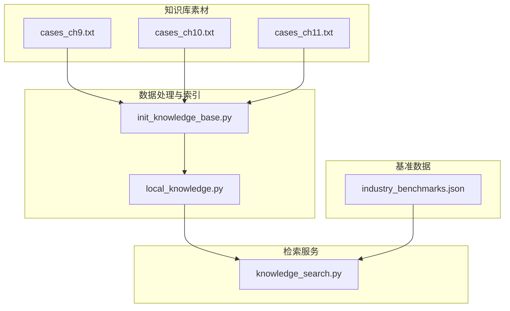
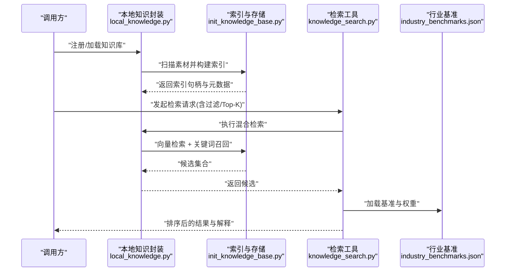
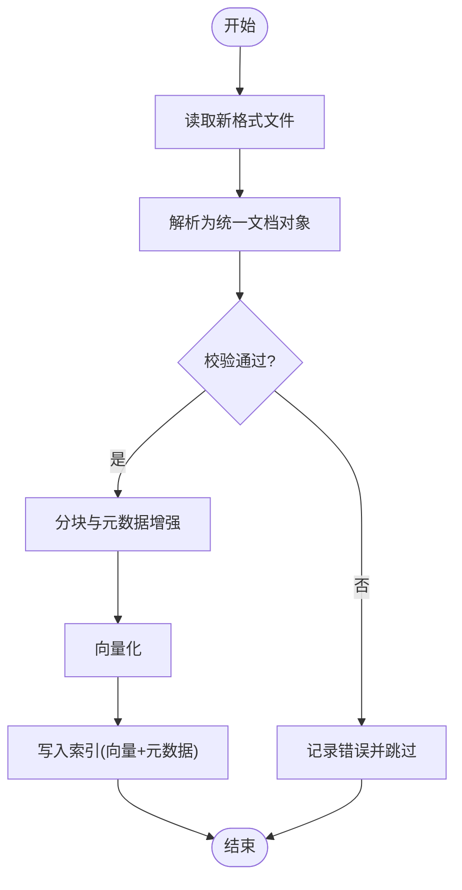
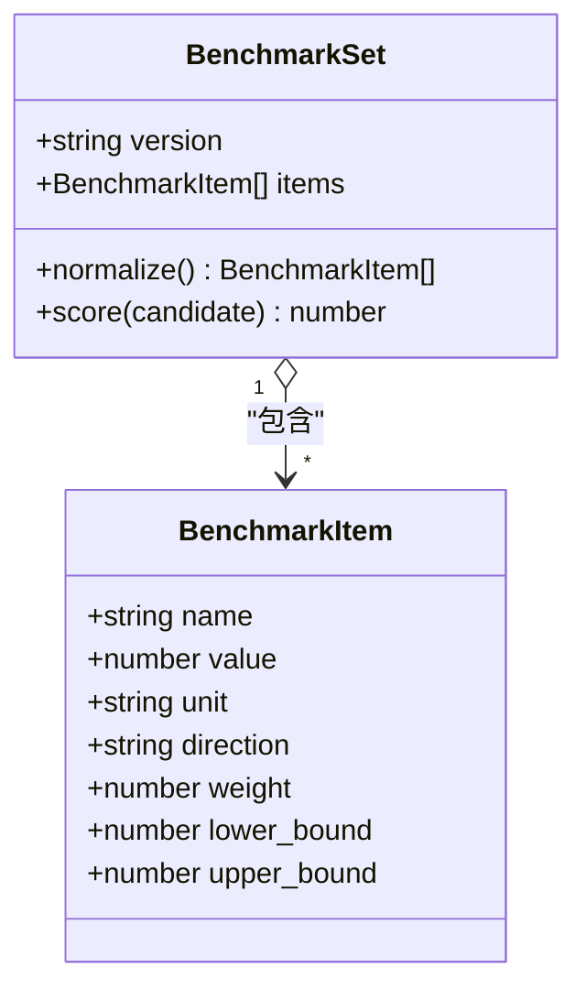
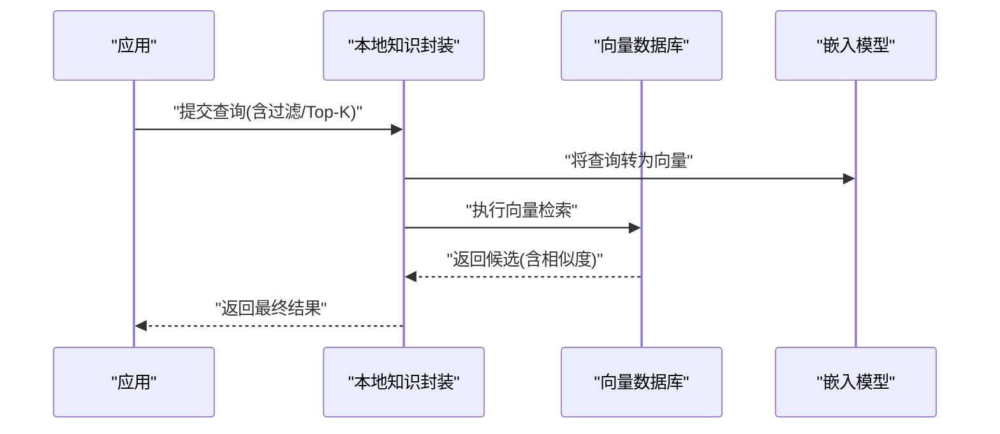
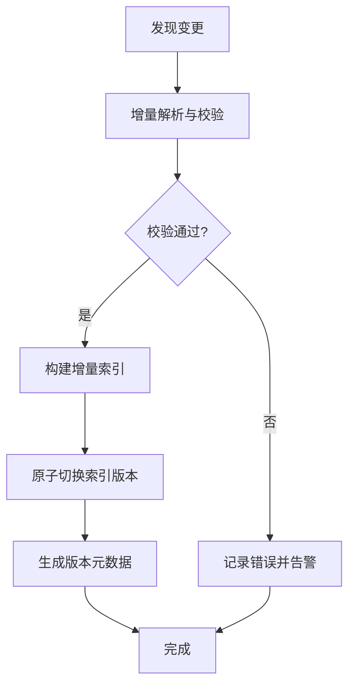
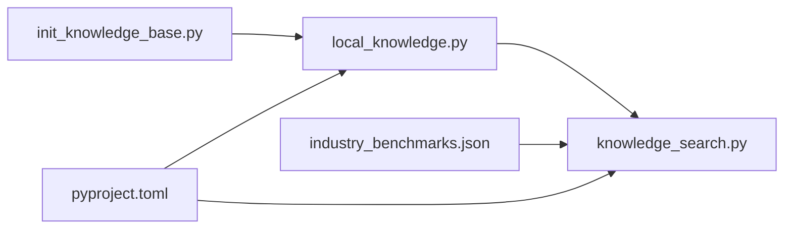

# 知识库扩展开发

<cite>
**本文引用的文件**   
- [src/tools/knowledge_search.py](file://src/tools/knowledge_search.py)
- [scripts/init_knowledge_base.py](file://scripts/init_knowledge_base.py)
- [knowledge_base/cases_ch9.txt](file://knowledge_base/cases_ch9.txt)
- [knowledge_base/cases_ch10.txt](file://knowledge_base/cases_ch10.txt)
- [knowledge_base/cases_ch11.txt](file://knowledge_base/cases_ch11.txt)
- [assets/industry_benchmarks.json](file://assets/industry_benchmarks.json)
- [src/local_knowledge.py](file://src/local_knowledge.py)
- [pyproject.toml](file://pyproject.toml)
</cite>

## 目录
1. [引言](#引言)
2. [项目结构](#项目结构)
3. [核心组件](#核心组件)
4. [架构总览](#架构总览)
5. [详细组件分析](#详细组件分析)
6. [依赖关系分析](#依赖关系分析)
7. [性能考虑](#性能考虑)
8. [故障排查指南](#故障排查指南)
9. [结论](#结论)
10. [附录](#附录)

## 引言
本指南面向“智能审计风险识别系统”的知识库扩展开发者，聚焦以下目标：
- 说明知识库的架构设计与检索机制
- 提供新增案例格式支持的完整路径（数据解析、索引构建、相似度计算）
- 给出行业基准数据的扩展方法（新指标类型支持与对比算法优化）
- 阐述向量数据库集成方式（嵌入模型选择与检索参数调优）
- 明确知识更新流程（增量更新、版本管理、数据验证）
- 总结知识库性能优化策略（索引优化与缓存机制）
- 提供可复用的扩展开发示例与最佳实践建议

## 项目结构
围绕知识库相关的关键目录与文件如下：
- 知识库原始素材：knowledge_base/*.txt（按章节分卷的案例文本）
- 初始化脚本：scripts/init_knowledge_base.py（负责将本地素材加载并构建索引）
- 检索工具：src/tools/knowledge_search.py（对外暴露检索接口）
- 本地知识封装：src/local_knowledge.py（对上层应用屏蔽底层实现差异）
- 行业基准数据：assets/industry_benchmarks.json（用于横向对比与评分）
- 依赖声明：pyproject.toml（记录外部依赖，便于环境一致性）

图示来源
- [scripts/init_knowledge_base.py](file://scripts/init_knowledge_base.py)
- [src/local_knowledge.py](file://src/local_knowledge.py)
- [src/tools/knowledge_search.py](file://src/tools/knowledge_search.py)
- [knowledge_base/cases_ch9.txt](file://knowledge_base/cases_ch9.txt)
- [knowledge_base/cases_ch10.txt](file://knowledge_base/cases_ch10.txt)
- [knowledge_base/cases_ch11.txt](file://knowledge_base/cases_ch11.txt)
- [assets/industry_benchmarks.json](file://assets/industry_benchmarks.json)

章节来源
- [scripts/init_knowledge_base.py](file://scripts/init_knowledge_base.py)
- [src/local_knowledge.py](file://src/local_knowledge.py)
- [src/tools/knowledge_search.py](file://src/tools/knowledge_search.py)
- [knowledge_base/cases_ch9.txt](file://knowledge_base/cases_ch9.txt)
- [knowledge_base/cases_ch10.txt](file://knowledge_base/cases_ch10.txt)
- [knowledge_base/cases_ch11.txt](file://knowledge_base/cases_ch11.txt)
- [assets/industry_benchmarks.json](file://assets/industry_benchmarks.json)

## 核心组件
- 初始化与索引构建（scripts/init_knowledge_base.py）
  - 职责：读取 knowledge_base 下的案例文本，执行清洗、分块、向量化与持久化存储；维护元数据与版本信息。
  - 关键点：支持多源输入、幂等写入、失败回滚、校验与日志。
- 本地知识封装（src/local_knowledge.py）
  - 职责：统一抽象知识读写、索引查询、批量导入导出、配置注入。
  - 关键点：对上层隐藏具体存储后端（内存/磁盘/向量库），提供稳定接口。
- 检索工具（src/tools/knowledge_search.py）
  - 职责：接收查询意图，调用本地知识封装进行语义检索，融合行业基准数据进行结果排序与解释。
  - 关键点：支持过滤条件、Top-K 控制、相似度阈值、重排策略。
- 行业基准数据（assets/industry_benchmarks.json）
  - 职责：定义行业指标基线、权重与对比规则，为风险评分与相似性加权提供依据。
  - 关键点：可扩展字段、向后兼容、版本化。

章节来源
- [scripts/init_knowledge_base.py](file://scripts/init_knowledge_base.py)
- [src/local_knowledge.py](file://src/local_knowledge.py)
- [src/tools/knowledge_search.py](file://src/tools/knowledge_search.py)
- [assets/industry_benchmarks.json](file://assets/industry_benchmarks.json)

## 架构总览
整体采用“素材→预处理→索引→检索→评估”的分层架构，强调可插拔与可扩展：
- 素材层：按章节或主题组织的案例文本与结构化基准数据
- 处理层：清洗、分块、去噪、标准化
- 索引层：向量化与倒排索引并存，兼顾语义与关键词匹配
- 检索层：混合检索（向量+关键词）、过滤与重排
- 评估层：结合行业基准进行风险评分与对比分析

图示来源
- [src/local_knowledge.py](file://src/local_knowledge.py)
- [scripts/init_knowledge_base.py](file://scripts/init_knowledge_base.py)
- [src/tools/knowledge_search.py](file://src/tools/knowledge_search.py)
- [assets/industry_benchmarks.json](file://assets/industry_benchmarks.json)

## 详细组件分析

### 组件A：案例格式扩展（新增解析器与索引适配）
目标：在不改动现有检索主流程的前提下，新增一种案例文件格式（如 JSON/CSV/自定义标记文本）。

- 数据解析
  - 新增解析器：实现统一的文档对象模型（包含标题、正文、标签、时间戳、来源等字段）
  - 校验与清洗：字段完整性检查、编码统一、特殊字符处理、重复段落合并
- 索引构建
  - 分块策略：按段落/小节/固定长度切分，保留上下文窗口
  - 元数据增强：从文件名、目录层级、标签中抽取结构化信息
  - 向量化：调用嵌入模型生成向量，附带元数据写入索引
- 相似度计算
  - 基础相似度：余弦相似度或内积
  - 领域加权：结合行业基准权重对关键段落进行加权
  - 重排：基于规则或轻量模型对 Top-K 结果进行二次排序

图示来源
- [scripts/init_knowledge_base.py](file://scripts/init_knowledge_base.py)
- [src/local_knowledge.py](file://src/local_knowledge.py)
- [src/tools/knowledge_search.py](file://src/tools/knowledge_search.py)

章节来源
- [scripts/init_knowledge_base.py](file://scripts/init_knowledge_base.py)
- [src/local_knowledge.py](file://src/local_knowledge.py)
- [src/tools/knowledge_search.py](file://src/tools/knowledge_search.py)

### 组件B：行业基准数据扩展（新指标类型与对比算法）
目标：在保持向后兼容的前提下，扩展新的指标类型与对比算法。

- 数据结构扩展
  - 新增指标字段：名称、单位、方向（越高越好/越低越好）、权重、区间范围
  - 版本化：每次变更增加版本号，旧版本仍可用
- 对比算法优化
  - 归一化：对不同量纲指标进行标准化
  - 加权聚合：根据权重计算综合得分
  - 异常检测：对偏离区间的数据进行标注与降级处理

图示来源
- [assets/industry_benchmarks.json](file://assets/industry_benchmarks.json)
- [src/tools/knowledge_search.py](file://src/tools/knowledge_search.py)

章节来源
- [assets/industry_benchmarks.json](file://assets/industry_benchmarks.json)
- [src/tools/knowledge_search.py](file://src/tools/knowledge_search.py)

### 组件C：向量数据库集成（嵌入模型与检索参数）
目标：对接外部向量数据库，选择合适的嵌入模型，并调优检索参数。

- 嵌入模型选择
  - 中文场景优先：选择对中文语义理解更强的模型
  - 维度与吞吐：平衡精度与性能，确保批处理能力
- 检索参数调优
  - Top-K：根据业务需求调整召回数量
  - 相似度阈值：过滤低质量结果
  - 过滤条件：按标签、时间、来源等进行预过滤
- 混合检索
  - 向量检索：语义匹配
  - 关键词检索：精确匹配术语
  - 融合策略：加权融合或学习排序

图示来源
- [src/local_knowledge.py](file://src/local_knowledge.py)
- [src/tools/knowledge_search.py](file://src/tools/knowledge_search.py)

章节来源
- [src/local_knowledge.py](file://src/local_knowledge.py)
- [src/tools/knowledge_search.py](file://src/tools/knowledge_search.py)

### 组件D：知识更新流程（增量、版本与验证）
目标：保证知识库在持续演进中的正确性与一致性。

- 增量更新
  - 仅处理新增/变更的文件，避免全量重建
  - 原子写入：先写临时索引，再切换指针
- 版本管理
  - 每次发布生成新版本号，保留历史快照
  - 元数据中包含更新时间、来源、变更摘要
- 数据验证
  - 结构校验：必填字段、类型、范围
  - 内容校验：重复率、噪声比例、缺失率
  - 回归测试：抽样比对历史结果稳定性

图示来源
- [scripts/init_knowledge_base.py](file://scripts/init_knowledge_base.py)
- [src/local_knowledge.py](file://src/local_knowledge.py)

章节来源
- [scripts/init_knowledge_base.py](file://scripts/init_knowledge_base.py)
- [src/local_knowledge.py](file://src/local_knowledge.py)

## 依赖关系分析
- 模块耦合
  - local_knowledge.py 作为中间层，解耦上层应用与底层索引/存储
  - knowledge_search.py 依赖 local_knowledge.py 提供的检索能力
  - init_knowledge_base.py 负责构建索引，供 local_knowledge.py 使用
- 外部依赖
  - pyproject.toml 声明了运行所需的外部包，确保环境一致

图示来源
- [scripts/init_knowledge_base.py](file://scripts/init_knowledge_base.py)
- [src/local_knowledge.py](file://src/local_knowledge.py)
- [src/tools/knowledge_search.py](file://src/tools/knowledge_search.py)
- [assets/industry_benchmarks.json](file://assets/industry_benchmarks.json)
- [pyproject.toml](file://pyproject.toml)

章节来源
- [pyproject.toml](file://pyproject.toml)
- [src/local_knowledge.py](file://src/local_knowledge.py)
- [src/tools/knowledge_search.py](file://src/tools/knowledge_search.py)
- [scripts/init_knowledge_base.py](file://scripts/init_knowledge_base.py)
- [assets/industry_benchmarks.json](file://assets/industry_benchmarks.json)

## 性能考虑
- 索引优化
  - 分块大小与重叠：在保证上下文的同时减少冗余
  - 倒排索引：对高频术语建立倒排，加速关键词检索
  - 向量压缩：降维或量化以节省空间与提升吞吐
- 缓存机制
  - 查询缓存：对热点查询结果进行短期缓存
  - 索引缓存：常驻内存的索引片段，减少磁盘 IO
- 并发与批处理
  - 批量向量化：提高 GPU/CPU 利用率
  - 异步写入：降低索引构建对检索的影响

[本节为通用指导，不直接分析具体文件]

## 故障排查指南
- 常见问题定位
  - 索引构建失败：检查输入文件编码、字段完整性、权限
  - 检索结果不稳定：确认嵌入模型版本、相似度阈值、Top-K 设置
  - 基准数据不一致：核对版本号与字段映射
- 诊断手段
  - 启用详细日志：记录解析、分块、向量化、检索各阶段耗时与错误
  - 抽样回放：对典型查询进行离线回放，对比不同参数效果
  - 回归测试：定期运行基准用例，监控结果漂移

章节来源
- [scripts/init_knowledge_base.py](file://scripts/init_knowledge_base.py)
- [src/tools/knowledge_search.py](file://src/tools/knowledge_search.py)

## 结论
通过模块化设计、可插拔解析器与混合检索机制，本知识库具备良好的扩展性与可维护性。建议在新增案例格式与基准指标时遵循统一的数据契约，配合增量更新与严格的数据验证，确保系统在持续演进中保持稳定与高效。

[本节为总结性内容，不直接分析具体文件]

## 附录
- 快速上手
  - 初始化知识库：运行初始化脚本，自动扫描 knowledge_base 并构建索引
  - 执行检索：通过检索工具传入查询与过滤条件，获取排序后的结果
- 最佳实践
  - 命名规范：案例文件按“章节_序号_主题”命名，便于管理与回溯
  - 版本策略：每次变更打标签，保留历史快照与变更摘要
  - 监控告警：对构建失败、检索超时、结果漂移设置告警

章节来源
- [scripts/init_knowledge_base.py](file://scripts/init_knowledge_base.py)
- [src/tools/knowledge_search.py](file://src/tools/knowledge_search.py)
- [knowledge_base/cases_ch9.txt](file://knowledge_base/cases_ch9.txt)
- [knowledge_base/cases_ch10.txt](file://knowledge_base/cases_ch10.txt)
- [knowledge_base/cases_ch11.txt](file://knowledge_base/cases_ch11.txt)