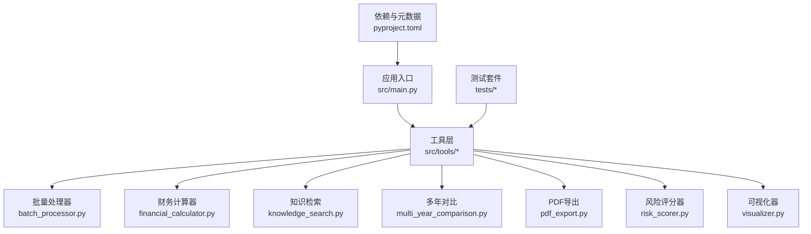
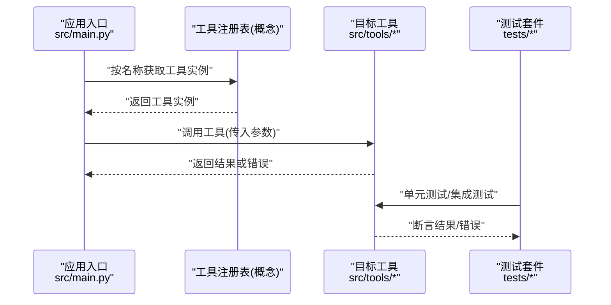
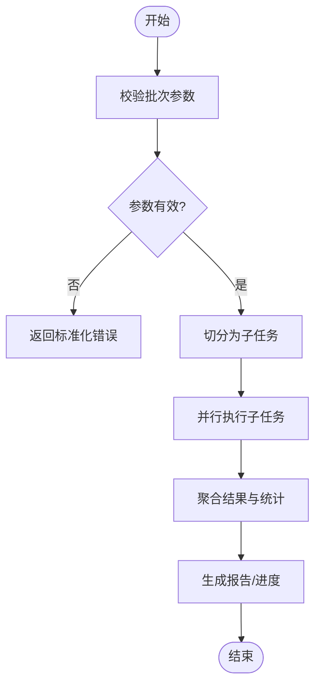
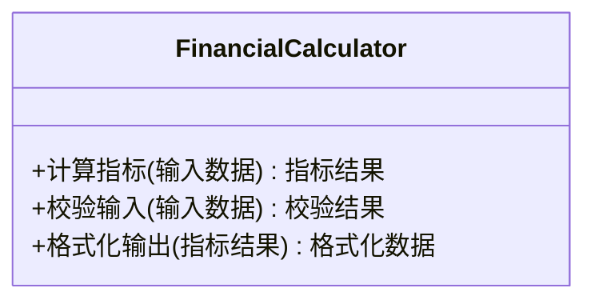
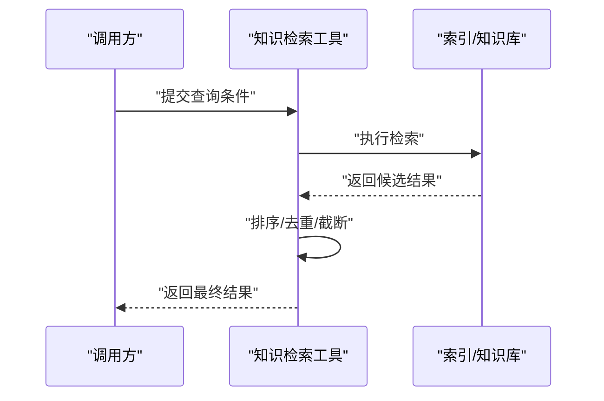
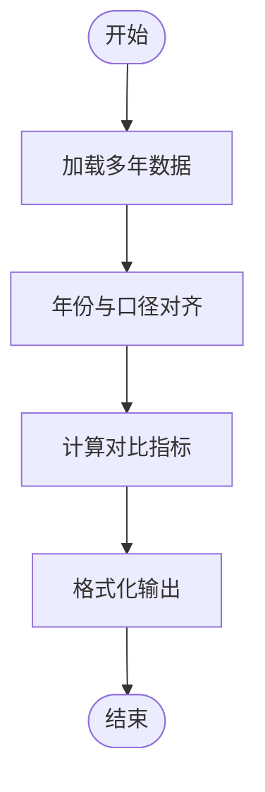
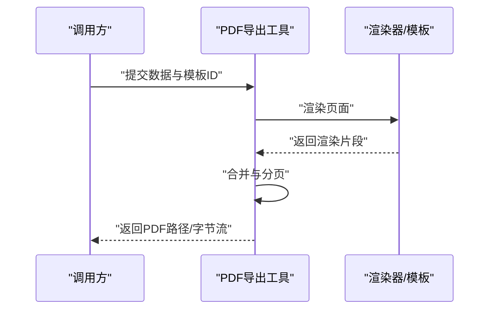
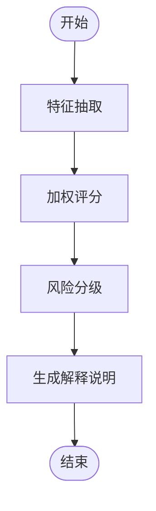
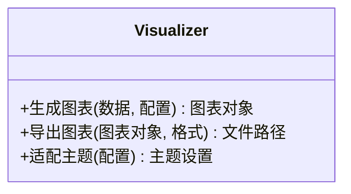
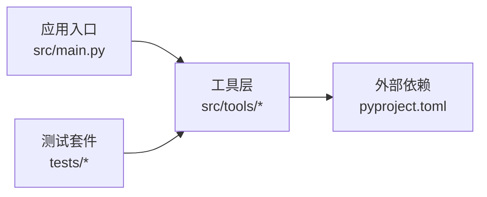

# 自定义工具开发

<cite>
**本文引用的文件**   
- [src/tools/batch_processor.py](file://src/tools/batch_processor.py)
- [src/tools/financial_calculator.py](file://src/tools/financial_calculator.py)
- [src/tools/knowledge_search.py](file://src/tools/knowledge_search.py)
- [src/tools/multi_year_comparison.py](file://src/tools/multi_year_comparison.py)
- [src/tools/pdf_export.py](file://src/tools/pdf_export.py)
- [src/tools/risk_scorer.py](file://src/tools/risk_scorer.py)
- [src/tools/visualizer.py](file://src/tools/visualizer.py)
- [tests/test_financial_calculator.py](file://tests/test_financial_calculator.py)
- [tests/test_data_validator.py](file://tests/test_data_validator.py)
- [src/main.py](file://src/main.py)
- [pyproject.toml](file://pyproject.toml)
</cite>

## 目录
1. [简介](#简介)
2. [项目结构](#项目结构)
3. [核心组件](#核心组件)
4. [架构总览](#架构总览)
5. [详细组件分析](#详细组件分析)
6. [依赖分析](#依赖分析)
7. [性能考虑](#性能考虑)
8. [故障排查指南](#故障排查指南)
9. [结论](#结论)
10. [附录](#附录)

## 简介
本指南面向“智能审计风险识别系统”的自定义工具开发者，目标是帮助你在现有工具体系下快速、规范地实现高质量的工具模块。文档覆盖：
- 工具系统的架构设计与关键机制（注册、参数传递、结果处理）
- 如何继承基础工具类并实现业务逻辑
- 从需求到实现的完整流程与示例
- 输入输出规范、错误处理与日志记录方法
- 配置管理、依赖注入与异步执行支持
- 测试方法与性能优化建议

## 项目结构
本项目采用按功能域组织的方式，工具位于 src/tools 目录下，每个工具以独立 Python 模块呈现；测试位于 tests 目录；入口与依赖定义分别位于 src/main.py 与 pyproject.toml。

图表来源
- [src/main.py](file://src/main.py)
- [src/tools/batch_processor.py](file://src/tools/batch_processor.py)
- [src/tools/financial_calculator.py](file://src/tools/financial_calculator.py)
- [src/tools/knowledge_search.py](file://src/tools/knowledge_search.py)
- [src/tools/multi_year_comparison.py](file://src/tools/multi_year_comparison.py)
- [src/tools/pdf_export.py](file://src/tools/pdf_export.py)
- [src/tools/risk_scorer.py](file://src/tools/risk_scorer.py)
- [src/tools/visualizer.py](file://src/tools/visualizer.py)
- [pyproject.toml](file://pyproject.toml)

章节来源
- [src/main.py](file://src/main.py)
- [pyproject.toml](file://pyproject.toml)

## 核心组件
本节聚焦工具层的通用能力与约定，帮助你理解如何在系统中新增或扩展工具。

- 工具定位与职责
  - 工具是围绕单一职责设计的可复用单元，负责完成某项具体任务（如计算、检索、导出、评分等）。
  - 工具之间通过明确的输入输出契约进行协作，避免紧耦合。

- 工具注册机制（概念性说明）
  - 在统一入口或框架层维护一个“工具名 -> 工具实例/工厂”的映射表。
  - 新工具可通过显式注册或在启动时自动发现并注册。
  - 注册后，上层编排器可按名称动态调用工具。

- 参数传递模式
  - 输入通常以结构化对象或字典形式传入，包含必填字段、可选字段与校验规则。
  - 参数在进入工具前进行类型与范围校验，失败则返回标准化错误。

- 结果处理模式
  - 成功时返回标准结果对象（含数据、元信息、状态码等）。
  - 失败时返回错误对象（含错误码、消息、上下文），便于上层统一处理与展示。

- 错误处理与日志
  - 工具内部应捕获异常并转换为标准错误对象，避免异常泄漏。
  - 使用结构化日志记录关键步骤、输入摘要与耗时，便于追踪与排障。

- 配置管理与依赖注入
  - 外部配置（如模型路径、阈值、存储位置）通过配置对象注入，避免硬编码。
  - 依赖（数据库、缓存、外部服务客户端）通过构造注入，便于替换与测试。

- 异步执行支持（概念性说明）
  - 对耗时操作提供异步接口，允许并发调度与超时控制。
  - 异步调用需保证幂等性与资源释放。

章节来源
- [src/tools/batch_processor.py](file://src/tools/batch_processor.py)
- [src/tools/financial_calculator.py](file://src/tools/financial_calculator.py)
- [src/tools/knowledge_search.py](file://src/tools/knowledge_search.py)
- [src/tools/multi_year_comparison.py](file://src/tools/multi_year_comparison.py)
- [src/tools/pdf_export.py](file://src/tools/pdf_export.py)
- [src/tools/risk_scorer.py](file://src/tools/risk_scorer.py)
- [src/tools/visualizer.py](file://src/tools/visualizer.py)

## 架构总览
下图展示了工具层与入口、测试之间的交互关系，以及典型的数据流向。

图表来源
- [src/main.py](file://src/main.py)
- [src/tools/batch_processor.py](file://src/tools/batch_processor.py)
- [src/tools/financial_calculator.py](file://src/tools/financial_calculator.py)
- [src/tools/knowledge_search.py](file://src/tools/knowledge_search.py)
- [src/tools/multi_year_comparison.py](file://src/tools/multi_year_comparison.py)
- [src/tools/pdf_export.py](file://src/tools/pdf_export.py)
- [src/tools/risk_scorer.py](file://src/tools/risk_scorer.py)
- [src/tools/visualizer.py](file://src/tools/visualizer.py)
- [tests/test_financial_calculator.py](file://tests/test_financial_calculator.py)
- [tests/test_data_validator.py](file://tests/test_data_validator.py)

## 详细组件分析

### 批量处理器（BatchProcessor）
- 职责
  - 对一批数据进行批处理，包括分片、并行度控制、进度上报与失败重试。
- 关键设计点
  - 输入为批次列表与处理策略；输出为汇总结果与明细报告。
  - 支持中断与恢复，确保长任务稳定运行。
- 适用场景
  - 大规模数据清洗、批量指标计算、批量导出等。

图表来源
- [src/tools/batch_processor.py](file://src/tools/batch_processor.py)

章节来源
- [src/tools/batch_processor.py](file://src/tools/batch_processor.py)

### 财务计算器（FinancialCalculator）
- 职责
  - 提供常用财务指标的计算能力（如比率、增长率、折现等）。
- 关键设计点
  - 输入为标准化财务数据；输出为结构化指标集合。
  - 内置数值校验与单位换算，保证计算稳定性。
- 测试要点
  - 边界值、缺失值、异常输入的处理。
  - 精度与舍入策略的一致性。

图表来源
- [src/tools/financial_calculator.py](file://src/tools/financial_calculator.py)

章节来源
- [src/tools/financial_calculator.py](file://src/tools/financial_calculator.py)
- [tests/test_financial_calculator.py](file://tests/test_financial_calculator.py)

### 知识检索（KnowledgeSearch）
- 职责
  - 基于本地知识库或外部索引进行语义检索与匹配。
- 关键设计点
  - 支持多源检索、相关性排序与结果去重。
  - 提供分页与过滤能力，适配不同查询场景。
- 集成方式
  - 通过配置注入检索后端（向量库、倒排索引等）。

图表来源
- [src/tools/knowledge_search.py](file://src/tools/knowledge_search.py)

章节来源
- [src/tools/knowledge_search.py](file://src/tools/knowledge_search.py)

### 多年对比（MultiYearComparison）
- 职责
  - 对跨年度数据进行对齐、对比与趋势分析。
- 关键设计点
  - 年份对齐、口径统一、同比/环比计算。
  - 输出对比报表与可视化所需数据结构。
- 适用场景
  - 审计中的历史数据比对、异常波动检测。

图表来源
- [src/tools/multi_year_comparison.py](file://src/tools/multi_year_comparison.py)

章节来源
- [src/tools/multi_year_comparison.py](file://src/tools/multi_year_comparison.py)

### PDF导出（PdfExport）
- 职责
  - 将结构化数据渲染为PDF报告，支持模板与样式配置。
- 关键设计点
  - 模板引擎集成、分页与页眉页脚、图片与表格渲染。
  - 大文档流式写入以降低内存占用。
- 注意事项
  - 字体与编码问题、特殊字符转义、导出失败的回滚。

图表来源
- [src/tools/pdf_export.py](file://src/tools/pdf_export.py)

章节来源
- [src/tools/pdf_export.py](file://src/tools/pdf_export.py)

### 风险评分器（RiskScorer）
- 职责
  - 基于规则与模型对审计对象进行风险评分与分级。
- 关键设计点
  - 特征抽取、权重配置、阈值判定与解释性输出。
  - 支持在线更新评分策略与版本化。
- 安全与合规
  - 敏感字段脱敏、评分过程可追溯。

图表来源
- [src/tools/risk_scorer.py](file://src/tools/risk_scorer.py)

章节来源
- [src/tools/risk_scorer.py](file://src/tools/risk_scorer.py)

### 可视化器（Visualizer）
- 职责
  - 将分析结果转换为图表数据或图像文件，供前端或报告使用。
- 关键设计点
  - 图表类型选择、主题与配色、导出格式（PNG/SVG/JSON）。
  - 大数据量下的采样与降维。
- 集成方式
  - 与导出工具配合，形成“分析->可视化->报告”的流水线。

图表来源
- [src/tools/visualizer.py](file://src/tools/visualizer.py)

章节来源
- [src/tools/visualizer.py](file://src/tools/visualizer.py)

## 依赖分析
- 模块内聚与耦合
  - 各工具保持高内聚、低耦合，通过明确接口交互。
  - 共享能力（如校验、日志、配置）建议抽象为公共模块，避免重复实现。
- 外部依赖
  - 第三方库通过 pyproject.toml 声明，便于环境一致性与可重现构建。
- 循环依赖
  - 工具间应避免直接相互导入，必要时通过事件或消息总线解耦。

图表来源
- [src/main.py](file://src/main.py)
- [pyproject.toml](file://pyproject.toml)
- [tests/test_financial_calculator.py](file://tests/test_financial_calculator.py)
- [tests/test_data_validator.py](file://tests/test_data_validator.py)

章节来源
- [pyproject.toml](file://pyproject.toml)
- [src/main.py](file://src/main.py)
- [tests/test_financial_calculator.py](file://tests/test_financial_calculator.py)
- [tests/test_data_validator.py](file://tests/test_data_validator.py)

## 性能考虑
- 批处理与并行
  - 合理设置并发度与队列长度，避免资源争用与OOM。
  - 对I/O密集型任务优先使用异步或线程池。
- 内存与流式处理
  - 大对象采用流式读写与增量聚合，减少峰值内存。
- 缓存与去重
  - 对重复计算引入缓存键与失效策略，提升吞吐。
- 监控与度量
  - 记录关键指标（QPS、延迟分布、错误率、CPU/内存），用于容量规划与调优。

[本节为通用指导，不直接分析具体文件]

## 故障排查指南
- 常见问题定位
  - 参数校验失败：检查输入结构与类型，确认必填字段与取值范围。
  - 外部依赖不可用：确认网络、凭据与配额，增加重试与熔断。
  - 资源泄露：确保文件句柄、连接与临时文件正确关闭与清理。
- 日志与追踪
  - 使用结构化日志记录请求ID、输入摘要、耗时与异常堆栈。
  - 关键路径埋点，结合分布式追踪定位瓶颈。
- 测试辅助
  - 使用单测与数据验证用例复现场景，隔离外部依赖。
  - 针对边界与异常路径编写负向用例。

章节来源
- [tests/test_financial_calculator.py](file://tests/test_financial_calculator.py)
- [tests/test_data_validator.py](file://tests/test_data_validator.py)

## 结论
通过遵循本指南的架构约定与最佳实践，你可以高效地在系统中扩展新的工具模块。建议在新工具开发中坚持：
- 清晰的输入输出契约与错误模型
- 可配置的依赖注入与策略切换
- 完善的测试覆盖与性能基准
- 可观测的日志与指标

[本节为总结性内容，不直接分析具体文件]

## 附录

### 工具开发清单
- 需求分析与边界定义
- 输入输出规范与校验规则
- 错误模型与日志规范
- 配置项与默认值
- 依赖注入点与外部服务封装
- 单元测试与集成测试用例
- 性能基准与压测方案
- 上线检查与回滚预案

### 参考实现路径
- 批量处理参考：[src/tools/batch_processor.py](file://src/tools/batch_processor.py)
- 财务计算参考：[src/tools/financial_calculator.py](file://src/tools/financial_calculator.py)
- 知识检索参考：[src/tools/knowledge_search.py](file://src/tools/knowledge_search.py)
- 多年对比参考：[src/tools/multi_year_comparison.py](file://src/tools/multi_year_comparison.py)
- PDF导出参考：[src/tools/pdf_export.py](file://src/tools/pdf_export.py)
- 风险评分参考：[src/tools/risk_scorer.py](file://src/tools/risk_scorer.py)
- 可视化参考：[src/tools/visualizer.py](file://src/tools/visualizer.py)
- 测试参考：[tests/test_financial_calculator.py](file://tests/test_financial_calculator.py)、[tests/test_data_validator.py](file://tests/test_data_validator.py)
- 入口与依赖：[src/main.py](file://src/main.py)、[pyproject.toml](file://pyproject.toml)