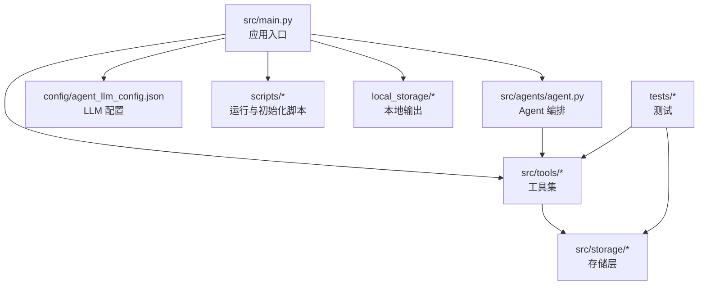
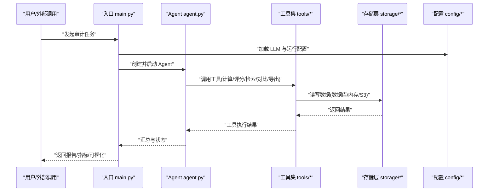
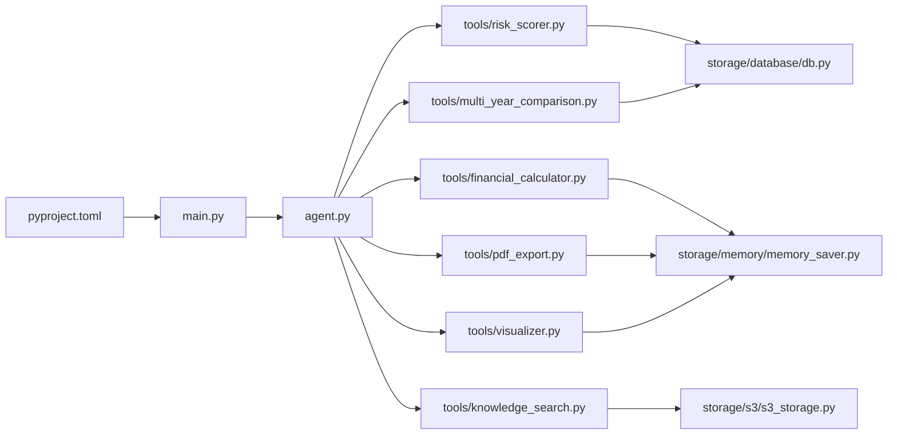

# 开发指南

<cite>
**本文引用的文件**   
- [src/main.py](file://src/main.py)
- [src/agents/agent.py](file://src/agents/agent.py)
- [src/tools/risk_scorer.py](file://src/tools/risk_scorer.py)
- [src/tools/financial_calculator.py](file://src/tools/financial_calculator.py)
- [src/tools/knowledge_search.py](file://src/tools/knowledge_search.py)
- [src/tools/multi_year_comparison.py](file://src/tools/multi_year_comparison.py)
- [src/tools/pdf_export.py](file://src/tools/pdf_export.py)
- [src/tools/visualizer.py](file://src/tools/visualizer.py)
- [src/storage/database/db.py](file://src/storage/database/db.py)
- [src/storage/memory/memory_saver.py](file://src/storage/memory/memory_saver.py)
- [src/storage/s3/s3_storage.py](file://src/storage/s3/s3_storage.py)
- [config/agent_llm_config.json](file://config/agent_llm_config.json)
- [pyproject.toml](file://pyproject.toml)
- [Dockerfile](file://Dockerfile)
- [scripts/init_knowledge_base.py](file://scripts/init_knowledge_base.py)
- [scripts/load_env.py](file://scripts/load_env.py)
- [scripts/local_run.sh](file://scripts/local_run.sh)
- [scripts/http_run.sh](file://scripts/http_run.sh)
- [tests/test_financial_calculator.py](file://tests/test_financial_calculator.py)
- [tests/test_data_validator.py](file://tests/test_data_validator.py)
</cite>

## 目录
1. [简介](#简介)
2. [项目结构](#项目结构)
3. [核心组件](#核心组件)
4. [架构总览](#架构总览)
5. [详细组件分析](#详细组件分析)
6. [依赖分析](#依赖分析)
7. [性能考虑](#性能考虑)
8. [故障排查指南](#故障排查指南)
9. [结论](#结论)
10. [附录](#附录)

## 简介
本指南面向智能审计风险识别系统的开发者，提供从代码规范、开发约定到新功能扩展、重构与优化、版本控制、调试与工具配置、常见问题与最佳实践的全流程指导。目标是帮助新加入的开发者快速上手，并在现有系统上高效、安全地扩展能力。

## 项目结构
仓库采用分层与按功能域组织相结合的结构：
- src：应用源码，包含入口、Agent、工具集、存储抽象、本地知识等
- config：运行时配置（如 LLM 代理配置）
- scripts：启动、初始化与环境加载脚本
- tests：单元测试与评估脚本
- assets：基准数据与静态资源
- local_storage：本地图表与报告输出目录
- Dockerfile：容器化构建定义
- pyproject.toml：Python 工程元信息与依赖声明

图示来源
- [src/main.py](file://src/main.py)
- [src/agents/agent.py](file://src/agents/agent.py)
- [src/tools/risk_scorer.py](file://src/tools/risk_scorer.py)
- [src/storage/database/db.py](file://src/storage/database/db.py)
- [config/agent_llm_config.json](file://config/agent_llm_config.json)
- [scripts/local_run.sh](file://scripts/local_run.sh)

章节来源
- [src/main.py](file://src/main.py)
- [pyproject.toml](file://pyproject.toml)
- [Dockerfile](file://Dockerfile)

## 核心组件
- 应用入口与编排
  - 负责加载配置、初始化 Agent、调度工具、持久化结果与对外服务暴露。
- Agent 编排
  - 封装审计任务执行流程，协调工具调用、上下文管理与错误恢复。
- 工具集
  - 财务计算、风险评分、知识检索、多年对比、可视化、PDF 导出、批量处理等。
- 存储层
  - 数据库、内存缓存、对象存储（S3）三种后端，统一接口供上层使用。
- 配置与环境
  - LLM 配置、环境变量加载、本地知识库初始化。

章节来源
- [src/agents/agent.py](file://src/agents/agent.py)
- [src/tools/risk_scorer.py](file://src/tools/risk_scorer.py)
- [src/tools/financial_calculator.py](file://src/tools/financial_calculator.py)
- [src/tools/knowledge_search.py](file://src/tools/knowledge_search.py)
- [src/tools/multi_year_comparison.py](file://src/tools/multi_year_comparison.py)
- [src/tools/pdf_export.py](file://src/tools/pdf_export.py)
- [src/tools/visualizer.py](file://src/tools/visualizer.py)
- [src/storage/database/db.py](file://src/storage/database/db.py)
- [src/storage/memory/memory_saver.py](file://src/storage/memory/memory_saver.py)
- [src/storage/s3/s3_storage.py](file://src/storage/s3/s3_storage.py)
- [config/agent_llm_config.json](file://config/agent_llm_config.json)
- [scripts/init_knowledge_base.py](file://scripts/init_knowledge_base.py)
- [scripts/load_env.py](file://scripts/load_env.py)

## 架构总览
系统以“入口 -> Agent -> 工具 -> 存储”为主线，结合配置与环境注入，形成可插拔、可扩展的审计风险识别流水线。

图示来源
- [src/main.py](file://src/main.py)
- [src/agents/agent.py](file://src/agents/agent.py)
- [src/tools/risk_scorer.py](file://src/tools/risk_scorer.py)
- [src/storage/database/db.py](file://src/storage/database/db.py)
- [config/agent_llm_config.json](file://config/agent_llm_config.json)

## 详细组件分析

### 入口与启动流程
- 职责
  - 解析参数、加载配置、初始化日志与存储、启动 Agent、注册路由或 CLI 命令、优雅退出。
- 关键流程
  - 读取 LLM 配置；初始化 Agent；根据请求类型选择工具链；将中间结果写入本地存储或远端存储；输出报告。
- 建议
  - 入口保持薄，逻辑下沉至 Agent 与工具；对异常进行集中捕获与上报。

章节来源
- [src/main.py](file://src/main.py)
- [config/agent_llm_config.json](file://config/agent_llm_config.json)

### Agent 编排
- 职责
  - 管理审计工作流：数据准备、规则/模型推理、工具编排、结果聚合、重试与降级。
- 设计要点
  - 将每个步骤抽象为节点或阶段；支持并行与条件分支；记录执行轨迹以便回溯。
- 扩展点
  - 新增审计维度时，通过添加新节点与工具即可接入。

章节来源
- [src/agents/agent.py](file://src/agents/agent.py)

### 工具集设计与实现
- 通用约定
  - 每个工具一个模块，函数命名清晰表达输入输出；参数校验前置；失败返回结构化错误码与消息；幂等优先。
- 典型工具
  - 风险评分：整合多源指标，输出风险等级与依据。
  - 财务计算：标准化口径，支持容错与边界值处理。
  - 知识检索：对接本地知识库与外部索引，返回相关片段与置信度。
  - 多年对比：对齐口径、处理缺失年份、生成差异摘要。
  - 可视化：生成图表数据与渲染指令。
  - PDF 导出：模板填充、分页与字体处理。
  - 批量处理：分片、并发、进度回调与断点续传。
- 示例路径
  - [risk_scorer.py](file://src/tools/risk_scorer.py)
  - [financial_calculator.py](file://src/tools/financial_calculator.py)
  - [knowledge_search.py](file://src/tools/knowledge_search.py)
  - [multi_year_comparison.py](file://src/tools/multi_year_comparison.py)
  - [pdf_export.py](file://src/tools/pdf_export.py)
  - [visualizer.py](file://src/tools/visualizer.py)

章节来源
- [src/tools/risk_scorer.py](file://src/tools/risk_scorer.py)
- [src/tools/financial_calculator.py](file://src/tools/financial_calculator.py)
- [src/tools/knowledge_search.py](file://src/tools/knowledge_search.py)
- [src/tools/multi_year_comparison.py](file://src/tools/multi_year_comparison.py)
- [src/tools/pdf_export.py](file://src/tools/pdf_export.py)
- [src/tools/visualizer.py](file://src/tools/visualizer.py)

### 存储层抽象
- 目标
  - 统一数据库、内存缓存与对象存储访问接口，屏蔽后端差异。
- 关键能力
  - 连接池、事务、重试、限流、加密与脱敏、迁移与版本管理。
- 扩展建议
  - 新增存储后端时，遵循统一接口契约，补充适配层与集成测试。

章节来源
- [src/storage/database/db.py](file://src/storage/database/db.py)
- [src/storage/memory/memory_saver.py](file://src/storage/memory/memory_saver.py)
- [src/storage/s3/s3_storage.py](file://src/storage/s3/s3_storage.py)

### 配置与环境
- LLM 配置
  - 通过 JSON 配置模型、温度、最大长度、超时等参数。
- 环境变量
  - 使用脚本加载密钥、URL、路径等敏感或环境相关项。
- 知识库初始化
  - 提供脚本将案例与规则导入本地知识库。

章节来源
- [config/agent_llm_config.json](file://config/agent_llm_config.json)
- [scripts/load_env.py](file://scripts/load_env.py)
- [scripts/init_knowledge_base.py](file://scripts/init_knowledge_base.py)

### 运行与部署
- 本地运行
  - 使用本地运行脚本一键拉起服务或任务。
- HTTP 模式
  - 使用 HTTP 运行脚本暴露 API 端点。
- 容器化
  - Dockerfile 定义镜像构建与运行参数。

章节来源
- [scripts/local_run.sh](file://scripts/local_run.sh)
- [scripts/http_run.sh](file://scripts/http_run.sh)
- [Dockerfile](file://Dockerfile)

## 依赖分析
- 工程元信息
  - 使用 pyproject.toml 声明依赖、包名与构建配置。
- 外部依赖
  - 数据存储驱动、可视化库、PDF 生成库、HTTP 框架等由工具与存储层引入。
- 内部耦合
  - 入口依赖 Agent 与配置；Agent 依赖工具；工具依赖存储层；测试覆盖工具与存储。

图示来源
- [pyproject.toml](file://pyproject.toml)
- [src/main.py](file://src/main.py)
- [src/agents/agent.py](file://src/agents/agent.py)
- [src/tools/risk_scorer.py](file://src/tools/risk_scorer.py)
- [src/tools/financial_calculator.py](file://src/tools/financial_calculator.py)
- [src/tools/knowledge_search.py](file://src/tools/knowledge_search.py)
- [src/tools/multi_year_comparison.py](file://src/tools/multi_year_comparison.py)
- [src/tools/pdf_export.py](file://src/tools/pdf_export.py)
- [src/tools/visualizer.py](file://src/tools/visualizer.py)
- [src/storage/database/db.py](file://src/storage/database/db.py)
- [src/storage/memory/memory_saver.py](file://src/storage/memory/memory_saver.py)
- [src/storage/s3/s3_storage.py](file://src/storage/s3/s3_storage.py)

章节来源
- [pyproject.toml](file://pyproject.toml)

## 性能考虑
- 工具侧
  - 避免重复 IO，合并查询；对大对象采用流式处理；计算密集型操作可异步化。
- 存储侧
  - 启用连接池与缓存；合理设置超时与重试；对热点数据加内存缓存。
- Agent 侧
  - 并行调用无副作用工具；限制并发度；失败快速回退与熔断。
- 可视化与导出
  - 按需生成图表；PDF 分页与懒加载；减少不必要的数据序列化。
- 监控与度量
  - 记录关键耗时、错误率与吞吐；对慢查询与长尾任务告警。

[本节为通用指导，不直接分析具体文件]

## 故障排查指南
- 常见问题定位
  - 配置加载失败：检查 LLM 配置文件与密钥注入。
  - 存储连接异常：验证数据库/对象存储凭据与网络连通性。
  - 工具执行报错：查看入参校验与边界值；核对第三方服务可用性。
  - 导出失败：确认模板与字体资源存在且权限正确。
- 调试技巧
  - 开启详细日志；在关键路径打印上下文快照；使用单测复现问题。
- 回归与验证
  - 为新功能补充测试用例；对已有工具增加边界与异常用例。

章节来源
- [tests/test_financial_calculator.py](file://tests/test_financial_calculator.py)
- [tests/test_data_validator.py](file://tests/test_data_validator.py)

## 结论
本指南梳理了智能审计风险识别系统的结构与扩展方式，提供了从规范到实践的系统化建议。遵循本文约定，可在保证质量的前提下持续提升交付效率与系统稳定性。

[本节为总结性内容，不直接分析具体文件]

## 附录

### 代码规范与开发约定
- 命名规范
  - 模块与包：小写+下划线；类名：大驼峰；函数/变量：小写+下划线；常量：大写+下划线。
- 注释标准
  - 模块级说明、类与函数文档字符串；复杂逻辑行内注释解释“为什么”而非“是什么”。
- 代码组织
  - 单一职责；工具独立成模块；存储抽象统一接口；配置与代码分离。
- 错误处理
  - 明确错误码与消息；区分可恢复与不可恢复错误；记录必要上下文。
- 测试要求
  - 核心工具与存储必须覆盖正常、异常与边界场景；覆盖率达标。

[本节为通用规范，不直接分析具体文件]

### 新功能开发全流程
- 需求分析
  - 明确输入输出、边界条件、性能与合规要求。
- 设计
  - 确定是否新增工具或扩展 Agent 流程；设计接口与数据结构。
- 实现
  - 遵循规范编写代码；完成单元测试与集成测试。
- 评审与联调
  - 代码审查；与上下游联调；完善文档与变更说明。
- 提交与发布
  - 提交前自检；遵循分支策略；打标签与发布说明。

[本节为流程指导，不直接分析具体文件]

### 扩展现有功能
- 自定义工具开发
  - 在 tools 目录下新增模块；定义清晰的输入输出；补充测试；在 Agent 中注册。
- 插件开发
  - 若需动态加载，定义插件接口与发现机制；提供样例插件与加载器。
- 第三方集成
  - 封装 SDK 为内部适配器；处理鉴权、重试与降级；提供开关与配置项。

[本节为扩展指导，不直接分析具体文件]

### 代码重构与性能优化
- 重构方法
  - 提取公共逻辑；拆分大函数；引入策略/工厂模式；消除重复代码。
- 优化技巧
  - 减少锁竞争；批处理与分页；惰性加载；缓存热点数据；异步化 I/O。
- 验证手段
  - 基准测试；压测与性能剖析；回归测试保障稳定性。

[本节为优化指导，不直接分析具体文件]

### 版本控制与分支管理
- 分支策略
  - 主分支保护；功能分支基于 develop；热修复走 hotfix 分支；发布打标签。
- 提交规范
  - 语义化提交；变更影响范围描述；关联需求或缺陷编号。
- 代码审查
  - 至少一人审查；关注可读性、安全性与性能；自动化检查先行。

[本节为协作规范，不直接分析具体文件]

### 调试技巧与开发工具配置
- 本地运行
  - 使用本地运行脚本快速启动；必要时切换 HTTP 模式。
- 日志与追踪
  - 统一日志格式；关键链路 ID 透传；分级输出便于定位。
- 常用工具
  - 依赖管理、格式化与静态检查；容器化构建与运行。

章节来源
- [scripts/local_run.sh](file://scripts/local_run.sh)
- [scripts/http_run.sh](file://scripts/http_run.sh)
- [Dockerfile](file://Dockerfile)

### 常见开发问题与最佳实践
- 问题清单
  - 配置未生效、存储连接失败、工具超时、导出乱码、并发冲突。
- 最佳实践
  - 防御式编程；最小权限原则；可观测性优先；灰度与回滚预案。

[本节为经验总结，不直接分析具体文件]

### 新成员快速上手
- 环境准备
  - 安装依赖；复制配置；初始化知识库；本地运行一次。
- 阅读顺序
  - 入口 -> Agent -> 工具 -> 存储 -> 配置 -> 脚本 -> 测试。
- 实战练习
  - 新增一个简单工具并接入 Agent；编写测试并通过；打包与运行。

章节来源
- [scripts/init_knowledge_base.py](file://scripts/init_knowledge_base.py)
- [scripts/load_env.py](file://scripts/load_env.py)
- [src/main.py](file://src/main.py)
- [src/agents/agent.py](file://src/agents/agent.py)
- [tests/test_financial_calculator.py](file://tests/test_financial_calculator.py)