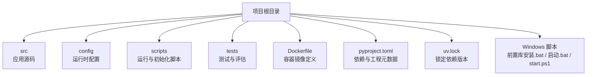
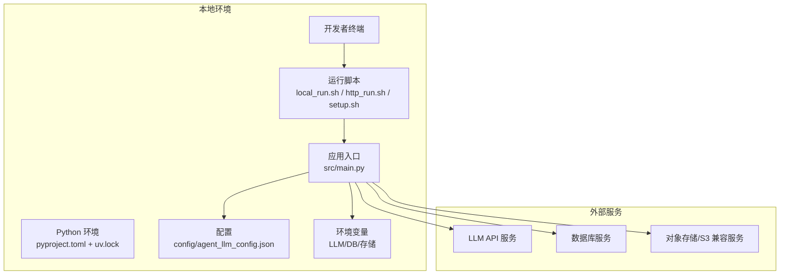
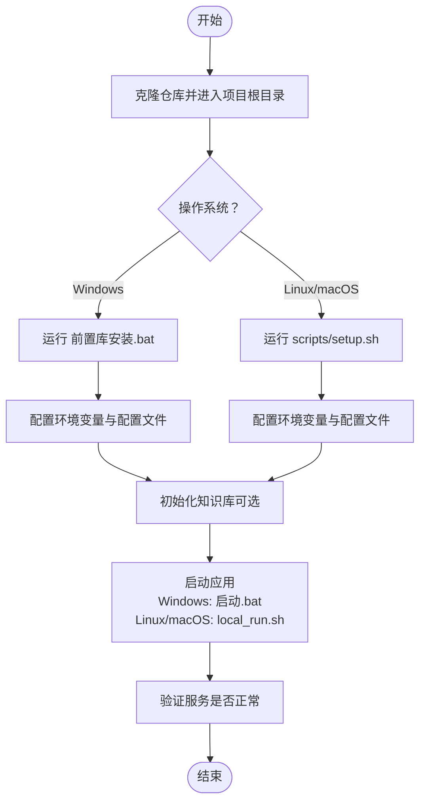
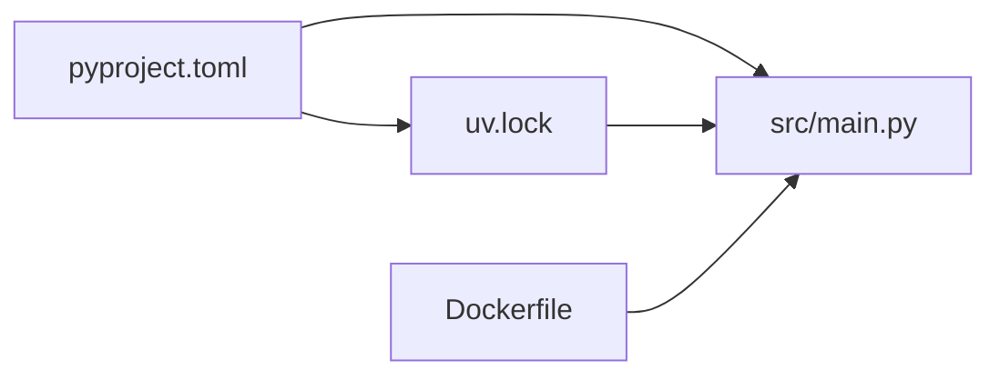

# 开发环境配置

<cite>
**本文引用的文件**
- [pyproject.toml](file://pyproject.toml)
- [uv.lock](file://uv.lock)
- [Dockerfile](file://Dockerfile)
- [scripts/setup.sh](file://scripts/setup.sh)
- [scripts/local_run.sh](file://scripts/local_run.sh)
- [scripts/http_run.sh](file://scripts/http_run.sh)
- [scripts/load_env.sh](file://scripts/load_env.sh)
- [scripts/init_knowledge_base.py](file://scripts/init_knowledge_base.py)
- [src/main.py](file://src/main.py)
- [config/agent_llm_config.json](file://config/agent_llm_config.json)
- [start.ps1](file://start.ps1)
- [前置库安装.bat](file://前置库安装.bat)
- [启动.bat](file://启动.bat)
</cite>

## 目录
1. [简介](#简介)
2. [项目结构](#项目结构)
3. [核心组件](#核心组件)
4. [架构总览](#架构总览)
5. [详细组件分析](#详细组件分析)
6. [依赖分析](#依赖分析)
7. [性能考虑](#性能考虑)
8. [故障排查指南](#故障排查指南)
9. [结论](#结论)
10. [附录](#附录)

## 简介
本指南面向“智能审计风险识别系统”的新老开发者，提供本地开发环境的完整搭建说明。内容涵盖：
- Python 环境与依赖管理（基于 pyproject.toml 与 uv）
- 三种安装方式：pip/uv、Docker 容器化、本地脚本一键安装
- 环境变量与配置文件（LLM API 密钥、数据库连接、存储后端）
- Windows、Linux、macOS 平台差异与注意事项
- 常见问题排查与解决方案
- 推荐开发工具与 IDE 配置
- 新开发者的一键环境搭建流程

## 项目结构
仓库采用分层组织：
- src：应用源码（入口、工具、存储、Agent 等）
- config：运行时配置（如 LLM Agent 配置）
- scripts：跨平台运行与初始化脚本
- tests：测试与评估脚本
- Dockerfile：容器镜像构建定义
- pyproject.toml：Python 工程元数据与依赖声明
- uv.lock：锁定依赖版本（配合 uv 使用）
- Windows 批处理脚本：便于在 Windows 上快速安装与启动

**图表来源**
- [pyproject.toml](file://pyproject.toml)
- [uv.lock](file://uv.lock)
- [Dockerfile](file://Dockerfile)
- [scripts/setup.sh](file://scripts/setup.sh)
- [scripts/local_run.sh](file://scripts/local_run.sh)
- [scripts/http_run.sh](file://scripts/http_run.sh)
- [scripts/load_env.sh](file://scripts/load_env.sh)
- [scripts/init_knowledge_base.py](file://scripts/init_knowledge_base.py)
- [src/main.py](file://src/main.py)
- [config/agent_llm_config.json](file://config/agent_llm_config.json)
- [start.ps1](file://start.ps1)
- [前置库安装.bat](file://前置库安装.bat)
- [启动.bat](file://启动.bat)

**章节来源**
- [pyproject.toml](file://pyproject.toml)
- [uv.lock](file://uv.lock)
- [Dockerfile](file://Dockerfile)
- [scripts/setup.sh](file://scripts/setup.sh)
- [scripts/local_run.sh](file://scripts/local_run.sh)
- [scripts/http_run.sh](file://scripts/http_run.sh)
- [scripts/load_env.sh](file://scripts/load_env.sh)
- [scripts/init_knowledge_base.py](file://scripts/init_knowledge_base.py)
- [src/main.py](file://src/main.py)
- [config/agent_llm_config.json](file://config/agent_llm_config.json)
- [start.ps1](file://start.ps1)
- [前置库安装.bat](file://前置库安装.bat)
- [启动.bat](file://启动.bat)

## 核心组件
- 应用入口与运行模式
  - 主程序入口位于 src/main.py，负责加载配置、初始化服务与调度任务。
- 配置中心
  - LLM Agent 配置位于 config/agent_llm_config.json，用于控制模型调用参数与行为。
- 运行脚本
  - Linux/macOS：scripts/local_run.sh、scripts/http_run.sh、scripts/load_env.sh、scripts/setup.sh
  - Windows：前置库安装.bat、启动.bat、start.ps1
- 依赖管理
  - pyproject.toml 声明依赖与工程信息；uv.lock 锁定具体版本，确保可重复构建。
- 容器化
  - Dockerfile 定义镜像构建步骤与环境变量注入点。

**章节来源**
- [src/main.py](file://src/main.py)
- [config/agent_llm_config.json](file://config/agent_llm_config.json)
- [scripts/local_run.sh](file://scripts/local_run.sh)
- [scripts/http_run.sh](file://scripts/http_run.sh)
- [scripts/load_env.sh](file://scripts/load_env.sh)
- [scripts/setup.sh](file://scripts/setup.sh)
- [pyproject.toml](file://pyproject.toml)
- [uv.lock](file://uv.lock)
- [Dockerfile](file://Dockerfile)

## 架构总览
下图展示了本地开发与容器化部署的整体关系：用户通过脚本或命令行触发应用，应用读取配置与环境变量，访问外部 LLM 服务与本地存储。

**图表来源**
- [scripts/local_run.sh](file://scripts/local_run.sh)
- [scripts/http_run.sh](file://scripts/http_run.sh)
- [scripts/setup.sh](file://scripts/setup.sh)
- [src/main.py](file://src/main.py)
- [config/agent_llm_config.json](file://config/agent_llm_config.json)
- [pyproject.toml](file://pyproject.toml)
- [uv.lock](file://uv.lock)

## 详细组件分析

### 一、Python 环境与依赖管理
- 依赖声明与锁定
  - pyproject.toml 定义了项目依赖与元数据。
  - uv.lock 锁定了依赖的具体版本，保证构建一致性。
- 推荐工具链
  - 优先使用 uv 进行依赖解析与安装（若未安装 uv，可使用 pip）。
- 虚拟环境建议
  - 建议在独立虚拟环境中运行，避免与系统 Python 冲突。

**章节来源**
- [pyproject.toml](file://pyproject.toml)
- [uv.lock](file://uv.lock)

### 二、安装方式

#### 1) 使用 pip/uv 安装（推荐）
- 前置条件
  - 已安装 Python（建议与 pyproject.toml 中要求一致）。
  - 可选：安装 uv 以获得更快的依赖解析体验。
- 步骤概览
  - 克隆仓库并进入项目根目录。
  - 创建并激活虚拟环境（可选但推荐）。
  - 安装依赖：优先使用 uv，其次使用 pip。
  - 准备配置与环境变量（见下一节）。
  - 初始化知识库（如有需要）。
  - 启动应用（本地或 HTTP 模式）。

**章节来源**
- [pyproject.toml](file://pyproject.toml)
- [uv.lock](file://uv.lock)
- [scripts/init_knowledge_base.py](file://scripts/init_knowledge_base.py)
- [scripts/local_run.sh](file://scripts/local_run.sh)
- [scripts/http_run.sh](file://scripts/http_run.sh)

#### 2) Docker 容器化部署
- 适用场景
  - 快速复现环境、隔离依赖、统一运行环境。
- 步骤概览
  - 构建镜像：根据 Dockerfile 构建。
  - 运行容器：挂载必要目录、注入环境变量（LLM/DB/存储）。
  - 验证服务：访问本地端口或查看日志。

**章节来源**
- [Dockerfile](file://Dockerfile)

#### 3) 本地脚本一键安装（Windows/Linux/macOS）
- Windows
  - 双击运行“前置库安装.bat”以安装依赖。
  - 双击“启动.bat”或通过 PowerShell 执行 start.ps1 启动应用。
- Linux/macOS
  - 赋予脚本执行权限后，运行 scripts/setup.sh 完成环境准备。
  - 使用 scripts/local_run.sh 或 scripts/http_run.sh 启动应用。
  - 如需预加载环境变量，先运行 scripts/load_env.sh。

**章节来源**
- [前置库安装.bat](file://前置库安装.bat)
- [启动.bat](file://启动.bat)
- [start.ps1](file://start.ps1)
- [scripts/setup.sh](file://scripts/setup.sh)
- [scripts/local_run.sh](file://scripts/local_run.sh)
- [scripts/http_run.sh](file://scripts/http_run.sh)
- [scripts/load_env.sh](file://scripts/load_env.sh)

### 三、环境变量与配置文件

#### 1) LLM API 密钥与模型配置
- 配置文件
  - config/agent_llm_config.json 包含 LLM Agent 的运行时配置项。
- 环境变量
  - 常见变量包括 LLM API 密钥、端点地址、超时与重试策略等（具体键名以实际代码为准）。
- 建议
  - 将敏感信息放入环境变量，避免硬编码到配置文件。
  - 不同环境（开发/测试/生产）使用不同的配置集。

**章节来源**
- [config/agent_llm_config.json](file://config/agent_llm_config.json)

#### 2) 数据库连接配置
- 连接信息
  - 通常包括主机、端口、用户名、密码、数据库名等。
- 安全建议
  - 使用环境变量注入连接串或凭据。
  - 限制网络访问与最小权限原则。

[本节为通用指导，不直接分析具体文件]

#### 3) 存储后端配置
- 支持类型
  - 本地文件系统与对象存储（S3 兼容）两种模式。
- 关键配置
  - 本地路径、桶名、区域、访问密钥与端点等。
- 切换方式
  - 通过环境变量或配置文件选择后端类型与参数。

**章节来源**
- [src/storage/s3/s3_storage.py](file://src/storage/s3/s3_storage.py)

### 四、平台特定安装步骤

#### Windows
- 使用批处理脚本
  - 前置库安装.bat：自动安装依赖。
  - 启动.bat：启动应用。
- 使用 PowerShell
  - start.ps1：提供交互式或自动化启动流程。
- 注意事项
  - 确保脚本执行策略允许运行本地脚本。
  - 路径与换行符差异可能导致脚本异常，建议使用 Git Bash 或 WSL。

**章节来源**
- [前置库安装.bat](file://前置库安装.bat)
- [启动.bat](file://启动.bat)
- [start.ps1](file://start.ps1)

#### Linux/macOS
- 使用 Shell 脚本
  - scripts/setup.sh：环境准备与依赖安装。
  - scripts/local_run.sh：本地模式启动。
  - scripts/http_run.sh：HTTP 服务模式启动。
  - scripts/load_env.sh：加载环境变量（如 .env）。
- 注意事项
  - 首次使用前需赋予脚本执行权限。
  - 确认 Python 与 uv/pip 可用。

**章节来源**
- [scripts/setup.sh](file://scripts/setup.sh)
- [scripts/local_run.sh](file://scripts/local_run.sh)
- [scripts/http_run.sh](file://scripts/http_run.sh)
- [scripts/load_env.sh](file://scripts/load_env.sh)

### 五、一键环境搭建流程（新开发者）
- 目标
  - 从零开始，快速完成环境搭建并成功启动应用。
- 步骤
  - 克隆仓库并进入项目根目录。
  - 选择安装方式：
    - Windows：运行“前置库安装.bat”，再运行“启动.bat”。
    - Linux/macOS：运行 scripts/setup.sh，再运行 scripts/local_run.sh。
  - 配置环境变量与配置文件（LLM/DB/存储）。
  - 初始化知识库（如有需要）。
  - 验证服务是否正常运行。

**图表来源**
- [前置库安装.bat](file://前置库安装.bat)
- [启动.bat](file://启动.bat)
- [scripts/setup.sh](file://scripts/setup.sh)
- [scripts/local_run.sh](file://scripts/local_run.sh)
- [scripts/init_knowledge_base.py](file://scripts/init_knowledge_base.py)

## 依赖分析
- 依赖声明与锁定
  - pyproject.toml 声明依赖与工程元数据。
  - uv.lock 锁定依赖版本，确保可重复构建。
- 运行期依赖
  - 应用入口 src/main.py 会加载配置与依赖，按运行模式初始化服务。
- 容器依赖
  - Dockerfile 定义镜像层与依赖安装过程。

**图表来源**
- [pyproject.toml](file://pyproject.toml)
- [uv.lock](file://uv.lock)
- [src/main.py](file://src/main.py)
- [Dockerfile](file://Dockerfile)

**章节来源**
- [pyproject.toml](file://pyproject.toml)
- [uv.lock](file://uv.lock)
- [src/main.py](file://src/main.py)
- [Dockerfile](file://Dockerfile)

## 性能考虑
- 依赖解析与安装
  - 使用 uv 替代 pip 可显著提升依赖解析与安装速度。
- 容器构建
  - 合理分层缓存依赖，减少镜像体积与构建时间。
- 运行时优化
  - 调整 LLM 请求并发与超时策略，避免阻塞。
  - 对大文件处理启用流式读写与分块上传。

[本节为通用指导，不直接分析具体文件]

## 故障排查指南
- 依赖安装失败
  - 检查 Python 版本是否与 pyproject.toml 要求一致。
  - 网络问题导致下载失败时，更换镜像源或使用离线包。
- 环境变量未生效
  - 确认 load_env.sh 是否正确加载 .env 文件。
  - Windows 下检查系统/用户环境变量设置。
- 启动报错
  - 查看控制台输出与日志，定位缺失配置或连接错误。
  - 确认 LLM/DB/存储服务的可达性与凭据正确性。
- 权限问题（Linux/macOS）
  - 为脚本添加执行权限。
  - 检查目录写入权限（尤其是本地存储与报告输出目录）。

**章节来源**
- [scripts/load_env.sh](file://scripts/load_env.sh)
- [scripts/local_run.sh](file://scripts/local_run.sh)
- [scripts/http_run.sh](file://scripts/http_run.sh)
- [启动.bat](file://启动.bat)
- [前置库安装.bat](file://前置库安装.bat)

## 结论
通过本文档，您可以：
- 选择合适的安装方式（pip/uv、Docker、本地脚本）
- 正确配置环境变量与配置文件（LLM/DB/存储）
- 在不同平台上完成一键环境搭建
- 快速定位并解决常见环境问题
- 使用推荐的开发工具提升效率

[本节为总结性内容，不直接分析具体文件]

## 附录

### 推荐开发工具与 IDE 配置
- Python 解释器
  - 在 IDE 中选择与 pyproject.toml 一致的 Python 版本。
- 依赖管理
  - 优先使用 uv；若不可用，使用 pip 并配合 requirements 生成。
- 调试器
  - 配置断点与日志输出，结合运行脚本传入环境变量。
- 代码检查
  - 启用静态检查与格式化插件，保持代码风格一致。
- 容器开发
  - 使用 Docker Compose 或 VS Code Dev Containers 加速联调。

[本节为通用指导，不直接分析具体文件]