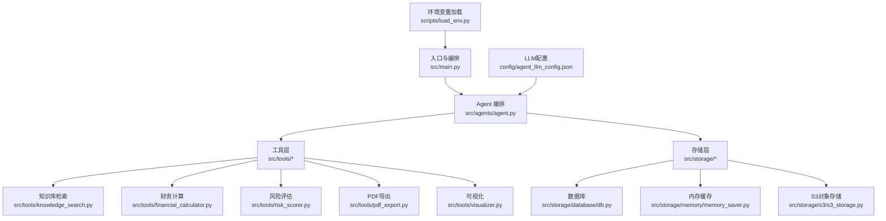
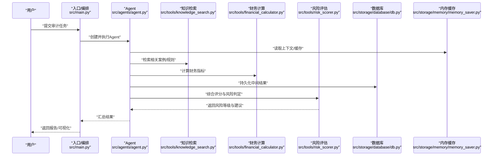
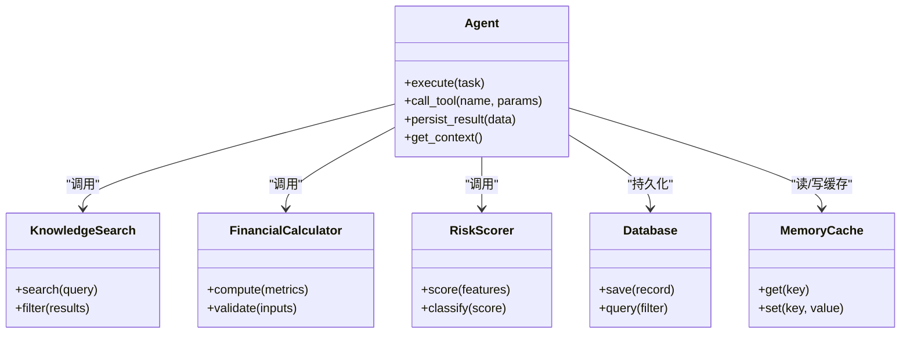
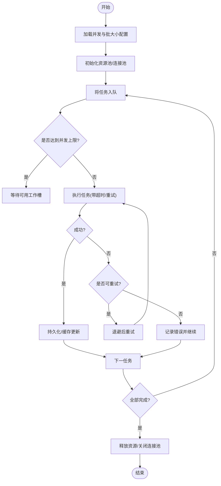
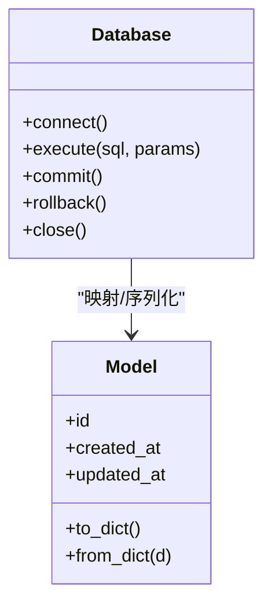
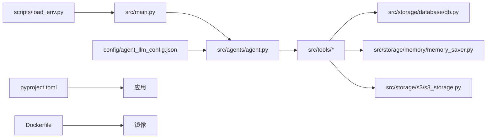

# 调试与性能优化

<cite>
**本文引用的文件**   
- [src/main.py](file://src/main.py)
- [src/agents/agent.py](file://src/agents/agent.py)
- [src/storage/database/db.py](file://src/storage/database/db.py)
- [src/storage/database/shared/model.py](file://src/storage/database/shared/model.py)
- [src/storage/memory/memory_saver.py](file://src/storage/memory/memory_saver.py)
- [src/tools/batch_processor.py](file://src/tools/batch_processor.py)
- [src/tools/risk_scorer.py](file://src/tools/risk_scorer.py)
- [src/tools/knowledge_search.py](file://src/tools/knowledge_search.py)
- [src/tools/financial_calculator.py](file://src/tools/financial_calculator.py)
- [src/tools/pdf_export.py](file://src/tools/pdf_export.py)
- [src/tools/visualizer.py](file://src/tools/visualizer.py)
- [config/agent_llm_config.json](file://config/agent_llm_config.json)
- [scripts/load_env.py](file://scripts/load_env.py)
- [pyproject.toml](file://pyproject.toml)
- [Dockerfile](file://Dockerfile)
- [tests/test_financial_calculator.py](file://tests/test_financial_calculator.py)
- [tests/test_data_validator.py](file://tests/test_data_validator.py)
- [tests/evaluation_report.py](file://tests/evaluation_report.py)
</cite>

## 目录
1. [简介](#简介)
2. [项目结构](#项目结构)
3. [核心组件](#核心组件)
4. [架构总览](#架构总览)
5. [详细组件分析](#详细组件分析)
6. [依赖关系分析](#依赖关系分析)
7. [性能考虑](#性能考虑)
8. [故障诊断指南](#故障诊断指南)
9. [结论](#结论)
10. [附录](#附录)

## 简介
本指南面向“智能审计风险识别系统”的开发者与运维人员，聚焦于调试与性能优化。内容覆盖：
- 调试技巧：日志分析、断点调试、内存泄漏检测
- 性能监控：CPU、内存、网络请求
- 常见瓶颈识别与优化：数据库查询、缓存策略、异步处理
- AI模型调优：提示词优化、上下文管理、响应时间控制
- 批量处理优化：并发控制与资源管理
- 测试驱动开发：单元、集成与性能测试
- 生产环境监控告警建议

## 项目结构
仓库采用分层组织方式：入口与编排在 src/main.py；Agent 逻辑在 src/agents；存储层包含数据库、内存与对象存储；工具层提供计算、检索、导出与可视化等能力；配置集中于 config；脚本位于 scripts；测试位于 tests。

图表来源
- [src/main.py](file://src/main.py)
- [src/agents/agent.py](file://src/agents/agent.py)
- [src/tools/knowledge_search.py](file://src/tools/knowledge_search.py)
- [src/tools/financial_calculator.py](file://src/tools/financial_calculator.py)
- [src/tools/risk_scorer.py](file://src/tools/risk_scorer.py)
- [src/tools/pdf_export.py](file://src/tools/pdf_export.py)
- [src/tools/visualizer.py](file://src/tools/visualizer.py)
- [src/storage/database/db.py](file://src/storage/database/db.py)
- [src/storage/memory/memory_saver.py](file://src/storage/memory/memory_saver.py)
- [config/agent_llm_config.json](file://config/agent_llm_config.json)
- [scripts/load_env.py](file://scripts/load_env.py)

章节来源
- [src/main.py](file://src/main.py)
- [src/agents/agent.py](file://src/agents/agent.py)
- [src/storage/database/db.py](file://src/storage/database/db.py)
- [src/storage/memory/memory_saver.py](file://src/storage/memory/memory_saver.py)
- [src/tools/batch_processor.py](file://src/tools/batch_processor.py)
- [config/agent_llm_config.json](file://config/agent_llm_config.json)
- [scripts/load_env.py](file://scripts/load_env.py)

## 核心组件
- 入口与编排（src/main.py）：负责应用启动、参数解析、生命周期管理与外部服务初始化。
- Agent（src/agents/agent.py）：协调工具调用、状态流转与结果聚合。
- 存储层
  - 数据库（src/storage/database/db.py, shared/model.py）：数据持久化与模型定义。
  - 内存缓存（src/storage/memory/memory_saver.py）：会话/中间结果缓存。
  - S3对象存储（src/storage/s3/s3_storage.py）：大文件或报告归档。
- 工具层
  - 知识检索（src/tools/knowledge_search.py）：本地知识库检索与过滤。
  - 财务计算（src/tools/financial_calculator.py）：指标计算与校验。
  - 风险评估（src/tools/risk_scorer.py）：评分与规则判定。
  - PDF导出（src/tools/pdf_export.py）、可视化（src/tools/visualizer.py）。
- 配置与环境
  - LLM配置（config/agent_llm_config.json）：模型、温度、超时等。
  - 环境变量加载（scripts/load_env.py）：统一注入运行期配置。

章节来源
- [src/main.py](file://src/main.py)
- [src/agents/agent.py](file://src/agents/agent.py)
- [src/storage/database/db.py](file://src/storage/database/db.py)
- [src/storage/database/shared/model.py](file://src/storage/database/shared/model.py)
- [src/storage/memory/memory_saver.py](file://src/storage/memory/memory_saver.py)
- [src/tools/knowledge_search.py](file://src/tools/knowledge_search.py)
- [src/tools/financial_calculator.py](file://src/tools/financial_calculator.py)
- [src/tools/risk_scorer.py](file://src/tools/risk_scorer.py)
- [src/tools/pdf_export.py](file://src/tools/pdf_export.py)
- [src/tools/visualizer.py](file://src/tools/visualizer.py)
- [config/agent_llm_config.json](file://config/agent_llm_config.json)
- [scripts/load_env.py](file://scripts/load_env.py)

## 架构总览
系统以 Agent 为核心调度器，按需调用工具完成审计任务，并通过存储层读写数据与缓存。LLM 配置驱动生成式能力，环境变量注入运行时参数。

图表来源
- [src/main.py](file://src/main.py)
- [src/agents/agent.py](file://src/agents/agent.py)
- [src/tools/knowledge_search.py](file://src/tools/knowledge_search.py)
- [src/tools/financial_calculator.py](file://src/tools/financial_calculator.py)
- [src/tools/risk_scorer.py](file://src/tools/risk_scorer.py)
- [src/storage/database/db.py](file://src/storage/database/db.py)
- [src/storage/memory/memory_saver.py](file://src/storage/memory/memory_saver.py)

## 详细组件分析

### Agent 与工具协作
- 职责边界清晰：Agent 仅做编排与决策，具体业务封装在工具中，便于单测与替换实现。
- 可观测性：建议在关键节点埋点（进入/退出、耗时、异常），结合结构化日志输出。
- 错误恢复：对工具调用增加重试与降级策略，避免级联失败。

图表来源
- [src/agents/agent.py](file://src/agents/agent.py)
- [src/tools/knowledge_search.py](file://src/tools/knowledge_search.py)
- [src/tools/financial_calculator.py](file://src/tools/financial_calculator.py)
- [src/tools/risk_scorer.py](file://src/tools/risk_scorer.py)
- [src/storage/database/db.py](file://src/storage/database/db.py)
- [src/storage/memory/memory_saver.py](file://src/storage/memory/memory_saver.py)

章节来源
- [src/agents/agent.py](file://src/agents/agent.py)
- [src/tools/knowledge_search.py](file://src/tools/knowledge_search.py)
- [src/tools/financial_calculator.py](file://src/tools/financial_calculator.py)
- [src/tools/risk_scorer.py](file://src/tools/risk_scorer.py)
- [src/storage/database/db.py](file://src/storage/database/db.py)
- [src/storage/memory/memory_saver.py](file://src/storage/memory/memory_saver.py)

### 批量处理器（并发与资源管理）
- 目标：在高吞吐场景下稳定执行大批量任务，避免资源耗尽。
- 关键点：
  - 并发度上限：根据 CPU/IO 特性设置合理并发数。
  - 队列与背压：使用有界队列，防止内存暴涨。
  - 资源复用：连接池、线程/进程池复用。
  - 幂等与重试：失败任务可安全重试，避免重复副作用。

图表来源
- [src/tools/batch_processor.py](file://src/tools/batch_processor.py)

章节来源
- [src/tools/batch_processor.py](file://src/tools/batch_processor.py)

### 数据库与模型
- 模型定义集中在共享模块，确保多组件一致性。
- 数据库访问应遵循最小权限、连接池与事务边界清晰原则。
- 建议为高频查询建立索引，避免全表扫描。

图表来源
- [src/storage/database/shared/model.py](file://src/storage/database/shared/model.py)
- [src/storage/database/db.py](file://src/storage/database/db.py)

章节来源
- [src/storage/database/shared/model.py](file://src/storage/database/shared/model.py)
- [src/storage/database/db.py](file://src/storage/database/db.py)

### 内存缓存
- 用于会话上下文、中间结果与热点数据缓存。
- 注意过期策略与容量上限，避免无限增长导致 OOM。

章节来源
- [src/storage/memory/memory_saver.py](file://src/storage/memory/memory_saver.py)

### 工具层要点
- 知识检索：支持关键词/向量检索与结果过滤，建议加入缓存与分页。
- 财务计算：输入校验前置，数值精度与单位统一。
- 风险评估：评分规则可配置化，便于灰度与回滚。
- PDF导出/可视化：流式写入与分块渲染，降低峰值内存。

章节来源
- [src/tools/knowledge_search.py](file://src/tools/knowledge_search.py)
- [src/tools/financial_calculator.py](file://src/tools/financial_calculator.py)
- [src/tools/risk_scorer.py](file://src/tools/risk_scorer.py)
- [src/tools/pdf_export.py](file://src/tools/pdf_export.py)
- [src/tools/visualizer.py](file://src/tools/visualizer.py)

### 配置与环境
- LLM 配置集中管理，包括模型、温度、最大令牌、超时等。
- 通过环境变量加载脚本统一注入，便于不同环境切换。

章节来源
- [config/agent_llm_config.json](file://config/agent_llm_config.json)
- [scripts/load_env.py](file://scripts/load_env.py)

## 依赖关系分析
- 内部依赖：入口 -> Agent -> 工具 -> 存储层。
- 外部依赖：数据库、对象存储、LLM 服务。
- 构建与运行：pyproject.toml 声明依赖，Dockerfile 定义容器镜像。

图表来源
- [src/main.py](file://src/main.py)
- [src/agents/agent.py](file://src/agents/agent.py)
- [src/tools/batch_processor.py](file://src/tools/batch_processor.py)
- [src/storage/database/db.py](file://src/storage/database/db.py)
- [src/storage/memory/memory_saver.py](file://src/storage/memory/memory_saver.py)
- [config/agent_llm_config.json](file://config/agent_llm_config.json)
- [scripts/load_env.py](file://scripts/load_env.py)
- [pyproject.toml](file://pyproject.toml)
- [Dockerfile](file://Dockerfile)

章节来源
- [pyproject.toml](file://pyproject.toml)
- [Dockerfile](file://Dockerfile)

## 性能考虑
- 数据库
  - 为常用过滤字段建立索引；避免 SELECT *；尽量使用覆盖索引。
  - 批量写入使用事务合并；分页查询限制每页大小。
- 缓存
  - 热点数据多级缓存（内存+分布式）；设置合理的 TTL 与失效策略。
  - 缓存穿透/雪崩防护：空值缓存、随机过期、限流熔断。
- 异步与并发
  - 对 IO 密集任务使用异步或线程池；CPU 密集使用进程池。
  - 设置并发上限与队列长度，避免资源争用。
- LLM 调用
  - 控制上下文长度与温度；启用流式输出降低首字节延迟。
  - 对长文本进行摘要/分段；必要时引入检索增强（RAG）。
- 导出与可视化
  - 流式生成 PDF/图片；分块渲染，避免一次性加载大图。
- 监控与可观测性
  - 采集关键指标：QPS、P95/P99 延迟、错误率、GC 停顿、连接池使用率。
  - 链路追踪贯穿入口到工具与存储，定位慢调用。

[本节为通用指导，不直接分析具体文件]

## 故障诊断指南
- 日志分析
  - 统一日志格式（时间戳、级别、TraceID、模块名、关键参数摘要）。
  - 分级输出：DEBUG 仅在本地开启，生产默认 INFO/WARN/ERROR。
- 断点调试
  - 使用 IDE 断点配合结构化日志，优先在 Agent 编排与工具边界处打断点。
  - 针对偶发问题，开启条件断点与采样日志。
- 内存泄漏检测
  - 使用内存分析工具（如 tracemalloc、memory_profiler）定位持续增长的对象。
  - 关注全局缓存、事件监听器、未关闭的文件/连接句柄。
- 常见问题
  - 数据库连接耗尽：检查连接池大小与泄露；确认事务及时提交/回滚。
  - LLM 超时：调整超时阈值与重试策略；对长上下文进行裁剪。
  - 批量任务堆积：增大队列消费者数量或提升批大小；排查下游瓶颈。
  - 导出失败：检查磁盘空间与临时目录权限；分块写入并清理中间文件。

章节来源
- [src/main.py](file://src/main.py)
- [src/agents/agent.py](file://src/agents/agent.py)
- [src/tools/batch_processor.py](file://src/tools/batch_processor.py)
- [src/storage/database/db.py](file://src/storage/database/db.py)
- [src/storage/memory/memory_saver.py](file://src/storage/memory/memory_saver.py)

## 结论
通过清晰的组件边界、完善的可观测性与严格的性能治理，系统可在高负载下保持稳定与高效。建议在生产环境落地统一的监控告警体系，并结合测试驱动开发持续验证变更质量。

[本节为总结性内容，不直接分析具体文件]

## 附录

### 调试技巧清单
- 日志
  - 结构化日志、TraceID 贯穿、敏感信息脱敏。
- 断点
  - 在 Agent 编排、工具边界、存储层入口设置断点。
- 内存
  - 定期快照对比、对象引用图分析、回收器行为观察。
- 网络
  - 抓包与 HTTP 客户端指标；区分 DNS、TLS、TCP、应用层耗时。

[本节为通用指导，不直接分析具体文件]

### 性能监控工具建议
- CPU：火焰图、热点函数定位、锁竞争分析。
- 内存：堆转储、对象计数、分配热点。
- 网络：请求链路、重传率、带宽占用。
- 数据库：慢查询、锁等待、缓冲命中率。

[本节为通用指导，不直接分析具体文件]

### AI 模型调优指南
- 提示词优化：明确角色、约束与输出格式；减少歧义。
- 上下文管理：摘要压缩、选择性保留关键片段。
- 响应时间控制：流式输出、并行子任务、超时与降级。

[本节为通用指导，不直接分析具体文件]

### 批量处理优化要点
- 并发控制：按资源类型设置上限；背压与限流。
- 资源管理：连接池、线程/进程池、临时文件清理。
- 容错：幂等设计、重试退避、死信队列。

章节来源
- [src/tools/batch_processor.py](file://src/tools/batch_processor.py)

### 测试驱动开发（TDD）实践
- 单元测试：覆盖工具函数与核心算法，保证边界与异常路径。
- 集成测试：端到端流程验证，含数据库与外部服务 Mock。
- 性能测试：基准与压力测试，回归性能指标。

章节来源
- [tests/test_financial_calculator.py](file://tests/test_financial_calculator.py)
- [tests/test_data_validator.py](file://tests/test_data_validator.py)
- [tests/evaluation_report.py](file://tests/evaluation_report.py)

### 生产环境监控告警建议
- 指标
  - 服务：QPS、延迟分布、错误率、饱和度。
  - 资源：CPU、内存、磁盘、网络。
  - 依赖：数据库连接池、缓存命中率、LLM 调用成功率。
- 告警
  - 阈值告警与突变检测结合；分级通知与自动恢复策略。
- 可观测性
  - 日志、指标、链路三件套统一接入；集中检索与关联分析。

[本节为通用指导，不直接分析具体文件]