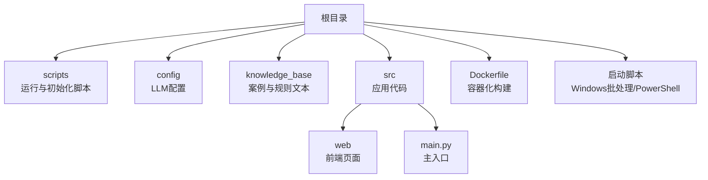
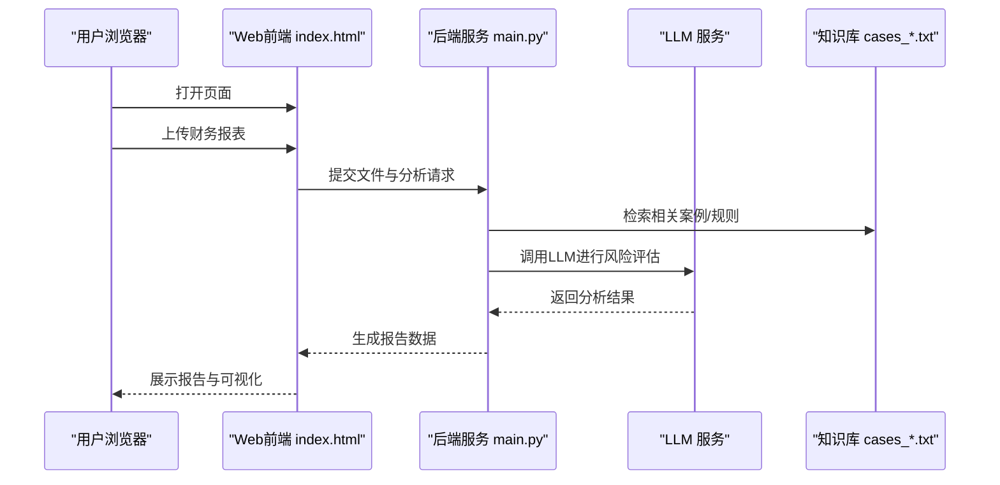
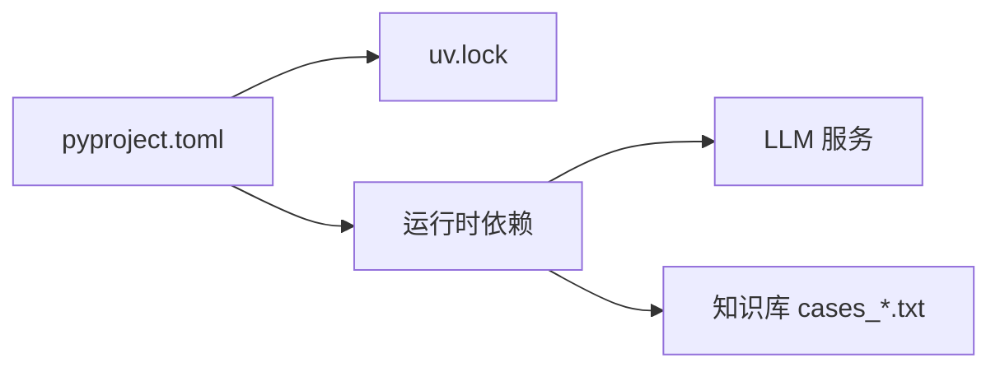

# 快速开始

<cite>
**本文引用的文件**   
- [pyproject.toml](file://pyproject.toml)
- [uv.lock](file://uv.lock)
- [Dockerfile](file://Dockerfile)
- [start.ps1](file://start.ps1)
- [启动.bat](file://启动.bat)
- [前置库安装.bat](file://前置库安装.bat)
- [scripts/http_run.sh](file://scripts/http_run.sh)
- [scripts/local_run.sh](file://scripts/local_run.sh)
- [scripts/init_knowledge_base.py](file://scripts/init_knowledge_base.py)
- [scripts/load_env.sh](file://scripts/load_env.sh)
- [config/agent_llm_config.json](file://config/agent_llm_config.json)
- [src/main.py](file://src/main.py)
- [src/web/index.html](file://src/web/index.html)
- [knowledge_base/cases_ch9.txt](file://knowledge_base/cases_ch9.txt)
- [knowledge_base/cases_ch10.txt](file://knowledge_base/cases_ch10.txt)
- [knowledge_base/cases_ch11.txt](file://knowledge_base/cases_ch11.txt)
</cite>

## 目录
1. [简介](#简介)
2. [项目结构](#项目结构)
3. [核心组件](#核心组件)
4. [架构总览](#架构总览)
5. [详细组件分析](#详细组件分析)
6. [依赖分析](#依赖分析)
7. [性能考虑](#性能考虑)
8. [故障排除指南](#故障排除指南)
9. [结论](#结论)
10. [附录](#附录)

## 简介
本指南面向首次接触“智能审计风险识别系统”的用户，目标是在30分钟内完成本地环境搭建、LLM API密钥配置、知识库初始化，并通过多种运行方式（Windows批处理、Linux/Mac Shell脚本、Docker容器）启动系统，演示上传财务报表、执行风险分析与查看报告的核心流程。文档同时提供常见问题排查建议，帮助你快速定位并解决问题。

## 项目结构
仓库采用分层组织：入口脚本位于根目录与scripts目录；业务逻辑集中在src目录；配置与知识库分别位于config与knowledge_base；Docker构建文件在根目录。

图表来源
- [Dockerfile:1-50](file://Dockerfile#L1-L50)
- [scripts/http_run.sh:1-50](file://scripts/http_run.sh#L1-L50)
- [scripts/local_run.sh:1-50](file://scripts/local_run.sh#L1-L50)
- [config/agent_llm_config.json:1-50](file://config/agent_llm_config.json#L1-L50)
- [src/main.py:1-50](file://src/main.py#L1-L50)
- [src/web/index.html:1-50](file://src/web/index.html#L1-L50)

章节来源
- [pyproject.toml:1-50](file://pyproject.toml#L1-L50)
- [uv.lock:1-50](file://uv.lock#L1-L50)
- [Dockerfile:1-50](file://Dockerfile#L1-L50)
- [start.ps1:1-50](file://start.ps1#L1-L50)
- [启动.bat:1-50](file://启动.bat#L1-L50)
- [前置库安装.bat:1-50](file://前置库安装.bat#L1-L50)
- [scripts/http_run.sh:1-50](file://scripts/http_run.sh#L1-L50)
- [scripts/local_run.sh:1-50](file://scripts/local_run.sh#L1-L50)
- [scripts/init_knowledge_base.py:1-50](file://scripts/init_knowledge_base.py#L1-L50)
- [scripts/load_env.sh:1-50](file://scripts/load_env.sh#L1-L50)
- [config/agent_llm_config.json:1-50](file://config/agent_llm_config.json#L1-L50)
- [src/main.py:1-50](file://src/main.py#L1-L50)
- [src/web/index.html:1-50](file://src/web/index.html#L1-L50)

## 核心组件
- 运行入口与Web服务
  - src/main.py：应用主入口，负责加载配置、初始化服务与路由。
  - src/web/index.html：前端页面，提供上传报表、触发分析与查看报告的交互界面。
- 运行脚本
  - scripts/local_run.sh：本地开发模式启动脚本。
  - scripts/http_run.sh：HTTP服务模式启动脚本。
  - start.ps1 / 启动.bat / 前置库安装.bat：Windows一键准备与启动脚本。
- 配置与环境
  - config/agent_llm_config.json：LLM相关配置（模型、端点、鉴权等）。
  - scripts/load_env.sh：环境变量加载辅助脚本。
- 知识库
  - knowledge_base/*.txt：审计案例与规则文本，用于检索与增强分析。
  - scripts/init_knowledge_base.py：知识库初始化脚本。
- 容器化
  - Dockerfile：定义镜像构建步骤与运行命令。

章节来源
- [src/main.py:1-50](file://src/main.py#L1-L50)
- [src/web/index.html:1-50](file://src/web/index.html#L1-L50)
- [scripts/local_run.sh:1-50](file://scripts/local_run.sh#L1-L50)
- [scripts/http_run.sh:1-50](file://scripts/http_run.sh#L1-L50)
- [start.ps1:1-50](file://start.ps1#L1-L50)
- [启动.bat:1-50](file://启动.bat#L1-L50)
- [前置库安装.bat:1-50](file://前置库安装.bat#L1-L50)
- [scripts/load_env.sh:1-50](file://scripts/load_env.sh#L1-L50)
- [config/agent_llm_config.json:1-50](file://config/agent_llm_config.json#L1-L50)
- [scripts/init_knowledge_base.py:1-50](file://scripts/init_knowledge_base.py#L1-L50)
- [knowledge_base/cases_ch9.txt:1-50](file://knowledge_base/cases_ch9.txt#L1-L50)
- [knowledge_base/cases_ch10.txt:1-50](file://knowledge_base/cases_ch10.txt#L1-L50)
- [knowledge_base/cases_ch11.txt:1-50](file://knowledge_base/cases_ch11.txt#L1-L50)
- [Dockerfile:1-50](file://Dockerfile#L1-L50)

## 架构总览
下图展示了从浏览器到后端服务、再到LLM与知识库的端到端调用路径。

图表来源
- [src/web/index.html:1-50](file://src/web/index.html#L1-L50)
- [src/main.py:1-50](file://src/main.py#L1-L50)
- [config/agent_llm_config.json:1-50](file://config/agent_llm_config.json#L1-L50)
- [knowledge_base/cases_ch9.txt:1-50](file://knowledge_base/cases_ch9.txt#L1-L50)
- [knowledge_base/cases_ch10.txt:1-50](file://knowledge_base/cases_ch10.txt#L1-L50)
- [knowledge_base/cases_ch11.txt:1-50](file://knowledge_base/cases_ch11.txt#L1-L50)

## 详细组件分析

### 环境准备与依赖
- Python版本要求
  - 请根据项目依赖声明选择匹配的Python版本。具体版本范围请参考依赖配置文件。
- 依赖管理
  - 使用uv或pip安装依赖。依赖清单与锁定版本见依赖配置文件与锁文件。
- 推荐工具链
  - Windows：建议使用PowerShell或CMD；确保已安装uv或pip。
  - Linux/Mac：建议使用bash/zsh；确保已安装uv或pip。

章节来源
- [pyproject.toml:1-50](file://pyproject.toml#L1-L50)
- [uv.lock:1-50](file://uv.lock#L1-L50)

### 本地开发环境搭建（Windows）
- 一键准备与启动
  - 双击运行“前置库安装.bat”以安装依赖。
  - 双击运行“启动.bat”以启动本地服务。
- 手动准备
  - 使用PowerShell或CMD执行依赖安装命令（参考依赖配置文件）。
  - 设置LLM API密钥（见“LLM API密钥配置”小节）。
  - 初始化知识库（见“知识库初始化”小节）。
  - 运行本地服务（参考“运行方式”小节）。

章节来源
- [前置库安装.bat:1-50](file://前置库安装.bat#L1-L50)
- [启动.bat:1-50](file://启动.bat#L1-L50)
- [start.ps1:1-50](file://start.ps1#L1-L50)
- [pyproject.toml:1-50](file://pyproject.toml#L1-L50)
- [uv.lock:1-50](file://uv.lock#L1-L50)

### 本地开发环境搭建（Linux/Mac）
- 依赖安装
  - 使用uv或pip安装依赖（参考依赖配置文件与锁文件）。
- 环境变量
  - 通过load_env.sh加载必要的环境变量。
- 初始化知识库
  - 运行init_knowledge_base.py完成知识库初始化。
- 启动服务
  - 使用local_run.sh或http_run.sh启动服务。

章节来源
- [scripts/load_env.sh:1-50](file://scripts/load_env.sh#L1-L50)
- [scripts/init_knowledge_base.py:1-50](file://scripts/init_knowledge_base.py#L1-L50)
- [scripts/local_run.sh:1-50](file://scripts/local_run.sh#L1-L50)
- [scripts/http_run.sh:1-50](file://scripts/http_run.sh#L1-L50)
- [pyproject.toml:1-50](file://pyproject.toml#L1-L50)
- [uv.lock:1-50](file://uv.lock#L1-L50)

### LLM API密钥配置
- 配置文件位置
  - 编辑config/agent_llm_config.json，填写模型名称、API端点与鉴权信息。
- 环境变量
  - 如需通过环境变量注入敏感信息，可在load_env.sh中定义并在运行时加载。
- 验证配置
  - 启动服务后，在前端页面尝试一次简单分析，确认能成功调用LLM。

章节来源
- [config/agent_llm_config.json:1-50](file://config/agent_llm_config.json#L1-L50)
- [scripts/load_env.sh:1-50](file://scripts/load_env.sh#L1-L50)

### 数据库初始化
- 说明
  - 若系统使用持久化存储，请在首次运行前执行数据库初始化流程。具体表结构与迁移脚本请参考源码中的数据库模块。
- 操作建议
  - 在本地开发时，优先使用轻量级嵌入式数据库或内存存储以降低门槛。
  - 生产环境建议启用备份与连接池优化。

章节来源
- [src/storage/database/db.py:1-50](file://src/storage/database/db.py#L1-L50)
- [src/storage/database/shared/model.py:1-50](file://src/storage/database/shared/model.py#L1-L50)

### 知识库设置与初始化
- 知识库内容
  - knowledge_base目录下包含多个案例与规则文本文件，用于增强LLM的分析能力。
- 初始化脚本
  - 运行scripts/init_knowledge_base.py完成索引或预处理（如需要）。
- 更新知识
  - 新增或替换cases_*.txt文件后，重新执行初始化脚本以确保生效。

章节来源
- [knowledge_base/cases_ch9.txt:1-50](file://knowledge_base/cases_ch9.txt#L1-L50)
- [knowledge_base/cases_ch10.txt:1-50](file://knowledge_base/cases_ch10.txt#L1-L50)
- [knowledge_base/cases_ch11.txt:1-50](file://knowledge_base/cases_ch11.txt#L1-L50)
- [scripts/init_knowledge_base.py:1-50](file://scripts/init_knowledge_base.py#L1-L50)

### 运行方式
- Windows批处理
  - 前置库安装.bat：安装依赖。
  - 启动.bat：启动本地服务。
  - start.ps1：PowerShell一键启动（可选）。
- Linux/Mac Shell
  - local_run.sh：本地开发模式。
  - http_run.sh：HTTP服务模式。
  - load_env.sh：加载环境变量。
- Docker容器化部署
  - 使用Dockerfile构建镜像并运行容器。
  - 将config与knowledge_base目录挂载至容器内，以便热更新。

章节来源
- [启动.bat:1-50](file://启动.bat#L1-L50)
- [前置库安装.bat:1-50](file://前置库安装.bat#L1-L50)
- [start.ps1:1-50](file://start.ps1#L1-L50)
- [scripts/local_run.sh:1-50](file://scripts/local_run.sh#L1-L50)
- [scripts/http_run.sh:1-50](file://scripts/http_run.sh#L1-L50)
- [scripts/load_env.sh:1-50](file://scripts/load_env.sh#L1-L50)
- [Dockerfile:1-50](file://Dockerfile#L1-L50)

### 基本功能演示
- 上传财务报表
  - 打开浏览器访问前端页面（src/web/index.html），点击上传按钮选择财务报表文件。
- 执行风险分析
  - 提交后，系统将读取文件、检索知识库、调用LLM进行分析。
- 查看生成的报告
  - 完成后，前端将展示分析报告与可视化结果。

章节来源
- [src/web/index.html:1-50](file://src/web/index.html#L1-L50)
- [src/main.py:1-50](file://src/main.py#L1-L50)
- [config/agent_llm_config.json:1-50](file://config/agent_llm_config.json#L1-L50)
- [knowledge_base/cases_ch9.txt:1-50](file://knowledge_base/cases_ch9.txt#L1-L50)

## 依赖分析
- 依赖声明与锁定
  - pyproject.toml定义了项目依赖与元数据。
  - uv.lock提供了精确的依赖版本锁定，保证可重复构建。
- 外部集成
  - LLM服务通过配置中心接入，支持多模型与端点切换。
  - 知识库为纯文本文件，便于扩展与维护。

图表来源
- [pyproject.toml:1-50](file://pyproject.toml#L1-L50)
- [uv.lock:1-50](file://uv.lock#L1-L50)
- [config/agent_llm_config.json:1-50](file://config/agent_llm_config.json#L1-L50)
- [knowledge_base/cases_ch9.txt:1-50](file://knowledge_base/cases_ch9.txt#L1-L50)

章节来源
- [pyproject.toml:1-50](file://pyproject.toml#L1-L50)
- [uv.lock:1-50](file://uv.lock#L1-L50)

## 性能考虑
- 并发与缓存
  - 对频繁调用的LLM接口建议增加响应缓存，减少重复计算。
- 知识库检索
  - 对大型知识库引入向量检索或倒排索引以提升查询效率。
- 资源限制
  - 在生产环境中合理设置进程数与线程池大小，避免资源争用。
- 监控与日志
  - 记录关键指标（耗时、错误率、吞吐），便于容量规划与问题定位。

[本节为通用指导，不直接分析具体文件]

## 故障排除指南
- 端口占用
  - 现象：服务无法启动或端口冲突。
  - 解决：更换端口或释放占用端口后重试。
- LLM调用失败
  - 现象：分析任务报错或超时。
  - 排查：检查config/agent_llm_config.json中的端点与鉴权信息；确认网络可达；查看服务日志。
- 知识库未生效
  - 现象：分析结果不包含预期规则。
  - 排查：确认knowledge_base下文件存在且格式正确；重新执行init_knowledge_base.py。
- 依赖安装失败
  - 现象：安装时报错或版本冲突。
  - 排查：确认Python版本匹配；清理缓存后重试；必要时使用虚拟环境。
- Docker相关问题
  - 现象：镜像构建失败或容器无法启动。
  - 排查：检查Dockerfile语法与基础镜像可用性；确认挂载路径权限；查看容器日志。

章节来源
- [config/agent_llm_config.json:1-50](file://config/agent_llm_config.json#L1-L50)
- [scripts/init_knowledge_base.py:1-50](file://scripts/init_knowledge_base.py#L1-L50)
- [Dockerfile:1-50](file://Dockerfile#L1-L50)

## 结论
通过以上步骤，你可以在30分钟内完成环境准备、配置与运行，体验上传财务报表、执行风险分析与查看报告的核心流程。建议在后续使用中逐步完善知识库与监控体系，以获得更稳定与高效的审计风险识别能力。

## 附录
- 常用命令速查
  - Windows：前置库安装.bat → 启动.bat
  - Linux/Mac：load_env.sh → init_knowledge_base.py → local_run.sh/http_run.sh
  - Docker：基于Dockerfile构建镜像并运行容器
- 相关文件路径
  - 配置：config/agent_llm_config.json
  - 知识库：knowledge_base/cases_ch*.txt
  - 前端：src/web/index.html
  - 入口：src/main.py

章节来源
- [启动.bat:1-50](file://启动.bat#L1-L50)
- [前置库安装.bat:1-50](file://前置库安装.bat#L1-L50)
- [scripts/load_env.sh:1-50](file://scripts/load_env.sh#L1-L50)
- [scripts/init_knowledge_base.py:1-50](file://scripts/init_knowledge_base.py#L1-L50)
- [scripts/local_run.sh:1-50](file://scripts/local_run.sh#L1-L50)
- [scripts/http_run.sh:1-50](file://scripts/http_run.sh#L1-L50)
- [Dockerfile:1-50](file://Dockerfile#L1-L50)
- [config/agent_llm_config.json:1-50](file://config/agent_llm_config.json#L1-L50)
- [knowledge_base/cases_ch9.txt:1-50](file://knowledge_base/cases_ch9.txt#L1-L50)
- [knowledge_base/cases_ch10.txt:1-50](file://knowledge_base/cases_ch10.txt#L1-L50)
- [knowledge_base/cases_ch11.txt:1-50](file://knowledge_base/cases_ch11.txt#L1-L50)
- [src/web/index.html:1-50](file://src/web/index.html#L1-L50)
- [src/main.py:1-50](file://src/main.py#L1-L50)