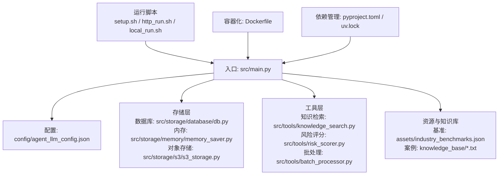
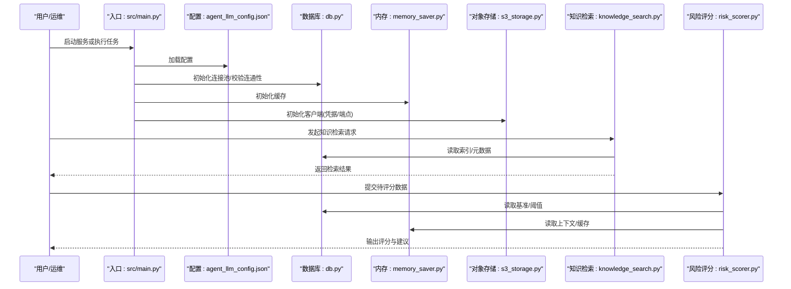
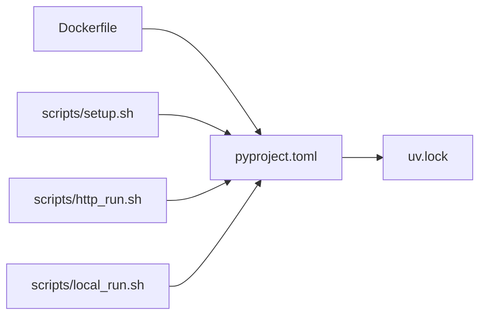
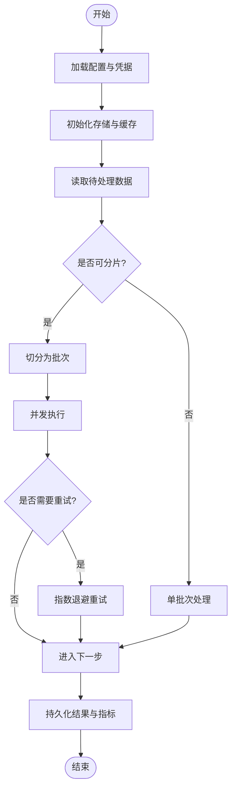

# 故障排除

<cite>
**本文引用的文件**   
- [src/main.py](file://src/main.py)
- [config/agent_llm_config.json](file://config/agent_llm_config.json)
- [scripts/setup.sh](file://scripts/setup.sh)
- [scripts/http_run.sh](file://scripts/http_run.sh)
- [scripts/local_run.sh](file://scripts/local_run.sh)
- [Dockerfile](file://Dockerfile)
- [pyproject.toml](file://pyproject.toml)
- [uv.lock](file://uv.lock)
- [src/storage/database/db.py](file://src/storage/database/db.py)
- [src/storage/memory/memory_saver.py](file://src/storage/memory/memory_saver.py)
- [src/storage/s3/s3_storage.py](file://src/storage/s3/s3_storage.py)
- [src/tools/knowledge_search.py](file://src/tools/knowledge_search.py)
- [src/tools/risk_scorer.py](file://src/tools/risk_scorer.py)
- [src/tools/batch_processor.py](file://src/tools/batch_processor.py)
- [src/utils/file/file.py](file://src/utils/file/file.py)
- [assets/industry_benchmarks.json](file://assets/industry_benchmarks.json)
- [knowledge_base/cases_ch9.txt](file://knowledge_base/cases_ch9.txt)
- [knowledge_base/cases_ch10.txt](file://knowledge_base/cases_ch10.txt)
- [knowledge_base/cases_ch11.txt](file://knowledge_base/cases_ch11.txt)
</cite>

## 目录
1. [简介](#简介)
2. [项目结构](#项目结构)
3. [核心组件](#核心组件)
4. [架构总览](#架构总览)
5. [详细组件分析](#详细组件分析)
6. [依赖关系分析](#依赖关系分析)
7. [性能注意事项](#性能注意事项)
8. [故障排除指南](#故障排除指南)
9. [结论](#结论)
10. [附录](#附录)

## 简介
本指南面向运维与开发团队，聚焦智能审计风险识别系统的安装、配置、运行、集成与性能问题排查。内容覆盖：
- 常见问题与解决方案（安装、配置、运行时异常、性能）
- 系统诊断方法与工具
- 日志分析与错误追踪技巧
- 内存泄漏、CPU占用过高、磁盘空间不足等性能问题的定位方法
- 网络通信失败、数据库连接异常、外部服务不可用等集成问题处理
- 备份恢复与数据迁移操作要点
- 监控与健康检查配置建议
- 问题反馈与社区支持渠道

## 项目结构
仓库采用分层组织方式：入口脚本位于 src/main.py；配置集中于 config；存储层包含数据库、内存与对象存储实现；工具层提供知识检索、评分、批处理与可视化能力；脚本目录提供部署与运行辅助；资源与知识库位于 assets 与 knowledge_base。

图表来源
- [src/main.py](file://src/main.py)
- [config/agent_llm_config.json](file://config/agent_llm_config.json)
- [src/storage/database/db.py](file://src/storage/database/db.py)
- [src/storage/memory/memory_saver.py](file://src/storage/memory/memory_saver.py)
- [src/storage/s3/s3_storage.py](file://src/storage/s3/s3_storage.py)
- [src/tools/knowledge_search.py](file://src/tools/knowledge_search.py)
- [src/tools/risk_scorer.py](file://src/tools/risk_scorer.py)
- [src/tools/batch_processor.py](file://src/tools/batch_processor.py)
- [assets/industry_benchmarks.json](file://assets/industry_benchmarks.json)
- [knowledge_base/cases_ch9.txt](file://knowledge_base/cases_ch9.txt)
- [knowledge_base/cases_ch10.txt](file://knowledge_base/cases_ch10.txt)
- [knowledge_base/cases_ch11.txt](file://knowledge_base/cases_ch11.txt)
- [scripts/setup.sh](file://scripts/setup.sh)
- [scripts/http_run.sh](file://scripts/http_run.sh)
- [scripts/local_run.sh](file://scripts/local_run.sh)
- [Dockerfile](file://Dockerfile)
- [pyproject.toml](file://pyproject.toml)
- [uv.lock](file://uv.lock)

章节来源
- [src/main.py](file://src/main.py)
- [config/agent_llm_config.json](file://config/agent_llm_config.json)
- [scripts/setup.sh](file://scripts/setup.sh)
- [scripts/http_run.sh](file://scripts/http_run.sh)
- [scripts/local_run.sh](file://scripts/local_run.sh)
- [Dockerfile](file://Dockerfile)
- [pyproject.toml](file://pyproject.toml)
- [uv.lock](file://uv.lock)

## 核心组件
- 入口与流程编排：负责加载配置、初始化存储与工具、启动服务或执行任务。
- 配置中心：集中存放 LLM 代理相关配置，影响模型调用、重试策略与超时设置。
- 存储层：
  - 数据库持久化：用于结构化数据存储与查询。
  - 内存存储：用于会话与中间结果缓存。
  - 对象存储：用于报告、图表等非结构化文件存取。
- 工具层：
  - 知识检索：从本地知识库与基准数据中检索相关信息。
  - 风险评分：基于规则或模型对审计风险进行量化评估。
  - 批处理：对大规模数据进行分片与并发处理。
- 资源与知识库：行业基准与历史案例，支撑检索与评分逻辑。

章节来源
- [src/main.py](file://src/main.py)
- [config/agent_llm_config.json](file://config/agent_llm_config.json)
- [src/storage/database/db.py](file://src/storage/database/db.py)
- [src/storage/memory/memory_saver.py](file://src/storage/memory/memory_saver.py)
- [src/storage/s3/s3_storage.py](file://src/storage/s3/s3_storage.py)
- [src/tools/knowledge_search.py](file://src/tools/knowledge_search.py)
- [src/tools/risk_scorer.py](file://src/tools/risk_scorer.py)
- [src/tools/batch_processor.py](file://src/tools/batch_processor.py)
- [assets/industry_benchmarks.json](file://assets/industry_benchmarks.json)
- [knowledge_base/cases_ch9.txt](file://knowledge_base/cases_ch9.txt)
- [knowledge_base/cases_ch10.txt](file://knowledge_base/cases_ch10.txt)
- [knowledge_base/cases_ch11.txt](file://knowledge_base/cases_ch11.txt)

## 架构总览
系统以“入口—配置—存储—工具—资源”的链路组织，通过脚本与容器化方式部署。关键交互如下：
- 入口读取配置并初始化各组件
- 工具层调用存储层读写数据
- 外部服务（如对象存储、LLM）通过配置接入
- 脚本与容器负责环境准备与服务启动

图表来源
- [src/main.py](file://src/main.py)
- [config/agent_llm_config.json](file://config/agent_llm_config.json)
- [src/storage/database/db.py](file://src/storage/database/db.py)
- [src/storage/memory/memory_saver.py](file://src/storage/memory/memory_saver.py)
- [src/storage/s3/s3_storage.py](file://src/storage/s3/s3_storage.py)
- [src/tools/knowledge_search.py](file://src/tools/knowledge_search.py)
- [src/tools/risk_scorer.py](file://src/tools/risk_scorer.py)

## 详细组件分析

### 入口与启动流程
- 职责：加载配置、初始化存储与工具、注册路由或任务调度、优雅关闭。
- 常见异常：配置缺失或格式错误、端口冲突、依赖未就绪。
- 诊断要点：
  - 确认配置文件路径与权限
  - 检查环境变量与密钥注入
  - 查看进程日志与退出码

章节来源
- [src/main.py](file://src/main.py)

### 配置中心（LLM 代理）
- 职责：集中管理模型端点、鉴权、重试与超时参数。
- 常见异常：JSON 语法错误、字段缺失、网络不可达。
- 诊断要点：
  - 使用 JSON 校验器验证配置
  - 最小化配置复现问题
  - 记录实际请求头与响应状态

章节来源
- [config/agent_llm_config.json](file://config/agent_llm_config.json)

### 存储层
- 数据库
  - 职责：持久化结构化数据、事务与索引。
  - 常见异常：连接失败、认证失败、锁等待、慢查询。
  - 诊断要点：连接池大小、超时、SQL 计划、表空间与 WAL。
- 内存存储
  - 职责：会话与中间结果缓存。
  - 常见异常：内存溢出、键冲突、过期策略不当。
  - 诊断要点：内存峰值、命中率、淘汰策略。
- 对象存储
  - 职责：报告、图表等大对象存取。
  - 常见异常：鉴权失败、跨域、限流、配额不足。
  - 诊断要点：端点可达性、签名有效期、带宽与 IOPS。

章节来源
- [src/storage/database/db.py](file://src/storage/database/db.py)
- [src/storage/memory/memory_saver.py](file://src/storage/memory/memory_saver.py)
- [src/storage/s3/s3_storage.py](file://src/storage/s3/s3_storage.py)

### 工具层
- 知识检索
  - 职责：从知识库与基准数据检索信息。
  - 常见异常：索引损坏、分词异常、召回率低。
  - 诊断要点：索引重建、相似度阈值、文档编码。
- 风险评分
  - 职责：依据规则/模型计算风险分数。
  - 常见异常：输入格式不合法、阈值配置错误、模型调用失败。
  - 诊断要点：输入校验、规则版本、模型回退策略。
- 批处理
  - 职责：分片、并发与重试。
  - 常见异常：OOM、死锁、幂等性破坏。
  - 诊断要点：批次大小、并发度、去重键、断点续跑。

章节来源
- [src/tools/knowledge_search.py](file://src/tools/knowledge_search.py)
- [src/tools/risk_scorer.py](file://src/tools/risk_scorer.py)
- [src/tools/batch_processor.py](file://src/tools/batch_processor.py)

### 资源与知识库
- 行业基准与历史案例支撑检索与评分。
- 常见异常：文件缺失、编码不一致、版本不匹配。
- 诊断要点：完整性校验、字符集统一、版本标签。

章节来源
- [assets/industry_benchmarks.json](file://assets/industry_benchmarks.json)
- [knowledge_base/cases_ch9.txt](file://knowledge_base/cases_ch9.txt)
- [knowledge_base/cases_ch10.txt](file://knowledge_base/cases_ch10.txt)
- [knowledge_base/cases_ch11.txt](file://knowledge_base/cases_ch11.txt)

## 依赖关系分析
- 构建与运行依赖由包管理与锁定文件管理，确保可重现环境。
- 容器镜像定义打包步骤与基础镜像，影响启动时间与体积。
- 运行脚本封装了环境准备与服务启停命令。

图表来源
- [pyproject.toml](file://pyproject.toml)
- [uv.lock](file://uv.lock)
- [Dockerfile](file://Dockerfile)
- [scripts/setup.sh](file://scripts/setup.sh)
- [scripts/http_run.sh](file://scripts/http_run.sh)
- [scripts/local_run.sh](file://scripts/local_run.sh)

章节来源
- [pyproject.toml](file://pyproject.toml)
- [uv.lock](file://uv.lock)
- [Dockerfile](file://Dockerfile)
- [scripts/setup.sh](file://scripts/setup.sh)
- [scripts/http_run.sh](file://scripts/http_run.sh)
- [scripts/local_run.sh](file://scripts/local_run.sh)

## 性能注意事项
- 批处理并发度与批次大小需根据 CPU/内存/IO 调优。
- 数据库连接池与查询计划直接影响吞吐与延迟。
- 对象存储大文件上传下载应启用分块与压缩。
- 缓存命中率与淘汰策略影响整体时延。
- 日志级别与采样率避免在高峰期造成额外开销。

[本节为通用指导，无需特定文件引用]

## 故障排除指南

### 一、安装与环境问题
- 现象
  - 依赖安装失败、版本冲突、Python 环境不匹配。
  - 容器镜像拉取失败或构建报错。
- 排查步骤
  - 核对 Python 版本与包管理器一致性。
  - 清理缓存后重新解析依赖。
  - 使用离线镜像或替换源解决网络问题。
  - 检查 Docker 基础镜像与构建上下文权限。
- 参考文件
  - [pyproject.toml](file://pyproject.toml)
  - [uv.lock](file://uv.lock)
  - [Dockerfile](file://Dockerfile)
  - [scripts/setup.sh](file://scripts/setup.sh)

章节来源
- [pyproject.toml](file://pyproject.toml)
- [uv.lock](file://uv.lock)
- [Dockerfile](file://Dockerfile)
- [scripts/setup.sh](file://scripts/setup.sh)

### 二、配置错误
- 现象
  - 启动即崩溃、模型调用失败、端口占用。
- 排查步骤
  - 校验 JSON 配置语法与必填字段。
  - 逐项注释非必需项，逐步还原定位。
  - 检查环境变量注入顺序与优先级。
  - 确认监听端口未被占用。
- 参考文件
  - [config/agent_llm_config.json](file://config/agent_llm_config.json)
  - [src/main.py](file://src/main.py)

章节来源
- [config/agent_llm_config.json](file://config/agent_llm_config.json)
- [src/main.py](file://src/main.py)

### 三、运行时异常
- 现象
  - 服务启动后频繁重启、任务执行中断。
- 排查步骤
  - 收集进程日志与堆栈信息。
  - 复现最小用例，隔离外部依赖。
  - 检查健康检查端点与心跳上报。
- 参考文件
  - [src/main.py](file://src/main.py)

章节来源
- [src/main.py](file://src/main.py)

### 四、性能问题
- 内存泄漏
  - 现象：RSS 持续增长、GC 回收效果差。
  - 排查：采集内存快照、对比增量对象、定位未释放句柄。
  - 关注：内存存储缓存策略、批处理缓冲、临时文件清理。
- CPU 占用过高
  - 现象：热点线程/进程 CPU 飙升。
  - 排查：火焰图定位热点函数、检查循环与序列化开销。
  - 关注：批处理并发度、正则与字符串拼接、模型推理预热。
- 磁盘空间不足
  - 现象：写入失败、WAL 膨胀、对象存储配额告警。
  - 排查：清理旧日志与报表、归档冷数据、扩容或迁移。
- 参考文件
  - [src/storage/memory/memory_saver.py](file://src/storage/memory/memory_saver.py)
  - [src/tools/batch_processor.py](file://src/tools/batch_processor.py)
  - [src/storage/s3/s3_storage.py](file://src/storage/s3/s3_storage.py)

章节来源
- [src/storage/memory/memory_saver.py](file://src/storage/memory/memory_saver.py)
- [src/tools/batch_processor.py](file://src/tools/batch_processor.py)
- [src/storage/s3/s3_storage.py](file://src/storage/s3/s3_storage.py)

### 五、网络通信失败
- 现象
  - 外部服务不可达、超时、证书校验失败。
- 排查步骤
  - 使用 curl/nc 测试连通性与端口。
  - 检查代理、防火墙与 DNS 解析。
  - 校验 TLS 证书链与时间同步。
  - 开启重试与熔断策略，观察降级行为。
- 参考文件
  - [config/agent_llm_config.json](file://config/agent_llm_config.json)
  - [src/storage/s3/s3_storage.py](file://src/storage/s3/s3_storage.py)

章节来源
- [config/agent_llm_config.json](file://config/agent_llm_config.json)
- [src/storage/s3/s3_storage.py](file://src/storage/s3/s3_storage.py)

### 六、数据库连接异常
- 现象
  - 连接池耗尽、认证失败、锁等待、慢查询。
- 排查步骤
  - 检查连接数上限与空闲回收。
  - 核对账号权限与白名单。
  - 分析慢查询与索引命中情况。
  - 监控表空间与 WAL 增长。
- 参考文件
  - [src/storage/database/db.py](file://src/storage/database/db.py)

章节来源
- [src/storage/database/db.py](file://src/storage/database/db.py)

### 七、外部服务不可用
- 现象
  - 对象存储鉴权失败、限流、配额不足。
- 排查步骤
  - 校验 AK/SK 与端点域名。
  - 检查桶/命名空间配额与访问策略。
  - 启用分块上传与重试退避。
- 参考文件
  - [src/storage/s3/s3_storage.py](file://src/storage/s3/s3_storage.py)

章节来源
- [src/storage/s3/s3_storage.py](file://src/storage/s3/s3_storage.py)

### 八、知识检索与评分异常
- 现象
  - 检索为空、评分异常、基准数据缺失。
- 排查步骤
  - 重建索引与校验文档编码。
  - 调整相似度阈值与过滤条件。
  - 校验基准数据完整性与版本。
- 参考文件
  - [src/tools/knowledge_search.py](file://src/tools/knowledge_search.py)
  - [src/tools/risk_scorer.py](file://src/tools/risk_scorer.py)
  - [assets/industry_benchmarks.json](file://assets/industry_benchmarks.json)
  - [knowledge_base/cases_ch9.txt](file://knowledge_base/cases_ch9.txt)
  - [knowledge_base/cases_ch10.txt](file://knowledge_base/cases_ch10.txt)
  - [knowledge_base/cases_ch11.txt](file://knowledge_base/cases_ch11.txt)

章节来源
- [src/tools/knowledge_search.py](file://src/tools/knowledge_search.py)
- [src/tools/risk_scorer.py](file://src/tools/risk_scorer.py)
- [assets/industry_benchmarks.json](file://assets/industry_benchmarks.json)
- [knowledge_base/cases_ch9.txt](file://knowledge_base/cases_ch9.txt)
- [knowledge_base/cases_ch10.txt](file://knowledge_base/cases_ch10.txt)
- [knowledge_base/cases_ch11.txt](file://knowledge_base/cases_ch11.txt)

### 九、日志分析与错误追踪
- 建议
  - 统一日志格式与分级，按模块与请求 ID 聚合。
  - 关键路径埋点：入参、出参、耗时、异常码。
  - 结合指标与链路追踪定位根因。
- 参考文件
  - [src/main.py](file://src/main.py)
  - [src/tools/batch_processor.py](file://src/tools/batch_processor.py)

章节来源
- [src/main.py](file://src/main.py)
- [src/tools/batch_processor.py](file://src/tools/batch_processor.py)

### 十、备份恢复与数据迁移
- 建议
  - 数据库：定期全量+增量备份，演练恢复。
  - 对象存储：跨区复制与生命周期策略。
  - 知识库：版本化与完整性校验。
  - 迁移：灰度切换与回滚预案。
- 参考文件
  - [src/storage/database/db.py](file://src/storage/database/db.py)
  - [src/storage/s3/s3_storage.py](file://src/storage/s3/s3_storage.py)
  - [knowledge_base/cases_ch9.txt](file://knowledge_base/cases_ch9.txt)
  - [knowledge_base/cases_ch10.txt](file://knowledge_base/cases_ch10.txt)
  - [knowledge_base/cases_ch11.txt](file://knowledge_base/cases_ch11.txt)

章节来源
- [src/storage/database/db.py](file://src/storage/database/db.py)
- [src/storage/s3/s3_storage.py](file://src/storage/s3/s3_storage.py)
- [knowledge_base/cases_ch9.txt](file://knowledge_base/cases_ch9.txt)
- [knowledge_base/cases_ch10.txt](file://knowledge_base/cases_ch10.txt)
- [knowledge_base/cases_ch11.txt](file://knowledge_base/cases_ch11.txt)

### 十一、监控与健康检查
- 建议
  - 暴露健康检查端点与指标。
  - 监控 CPU/内存/磁盘/网络与队列积压。
  - 设置告警阈值与自愈策略。
- 参考文件
  - [src/main.py](file://src/main.py)
  - [scripts/http_run.sh](file://scripts/http_run.sh)
  - [scripts/local_run.sh](file://scripts/local_run.sh)

章节来源
- [src/main.py](file://src/main.py)
- [scripts/http_run.sh](file://scripts/http_run.sh)
- [scripts/local_run.sh](file://scripts/local_run.sh)

### 十二、问题反馈与社区支持
- 建议
  - 建立 Issue 模板：环境信息、复现步骤、日志片段、期望与实际结果。
  - 提供最小可复现仓库与数据样例。
  - 明确响应 SLA 与升级路径。

[本节为通用指导，无需特定文件引用]

## 结论
通过系统化地梳理安装、配置、运行、集成与性能问题，并结合日志与指标进行快速定位，可显著提升智能审计风险识别系统的稳定性与可维护性。建议在上线前完成容量规划、压测与演练，持续完善监控与告警体系，形成闭环的问题治理机制。

## 附录

### A. 常用诊断清单
- 环境：Python/包管理器/镜像版本一致
- 配置：JSON 校验、最小配置复现
- 网络：连通性、DNS、TLS、代理
- 存储：连接池、配额、I/O 瓶颈
- 性能：CPU/内存/磁盘/网络指标与热点
- 日志：分级、聚合、TraceID
- 备份：周期、演练、回滚

### B. 典型流程图（批处理）

图表来源
- [src/tools/batch_processor.py](file://src/tools/batch_processor.py)
- [src/storage/memory/memory_saver.py](file://src/storage/memory/memory_saver.py)
- [src/storage/database/db.py](file://src/storage/database/db.py)