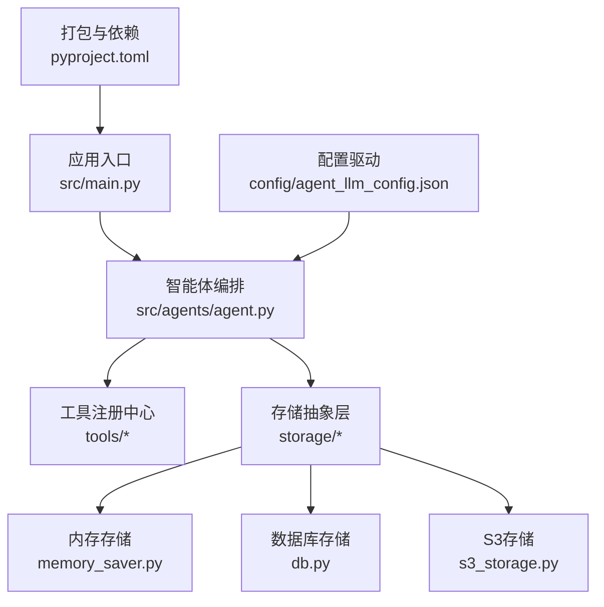
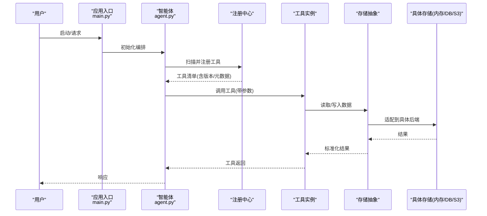
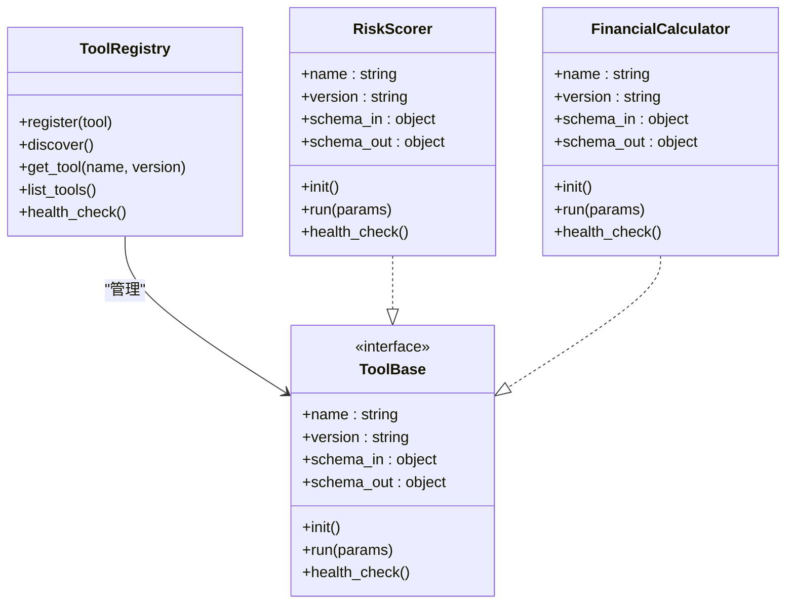
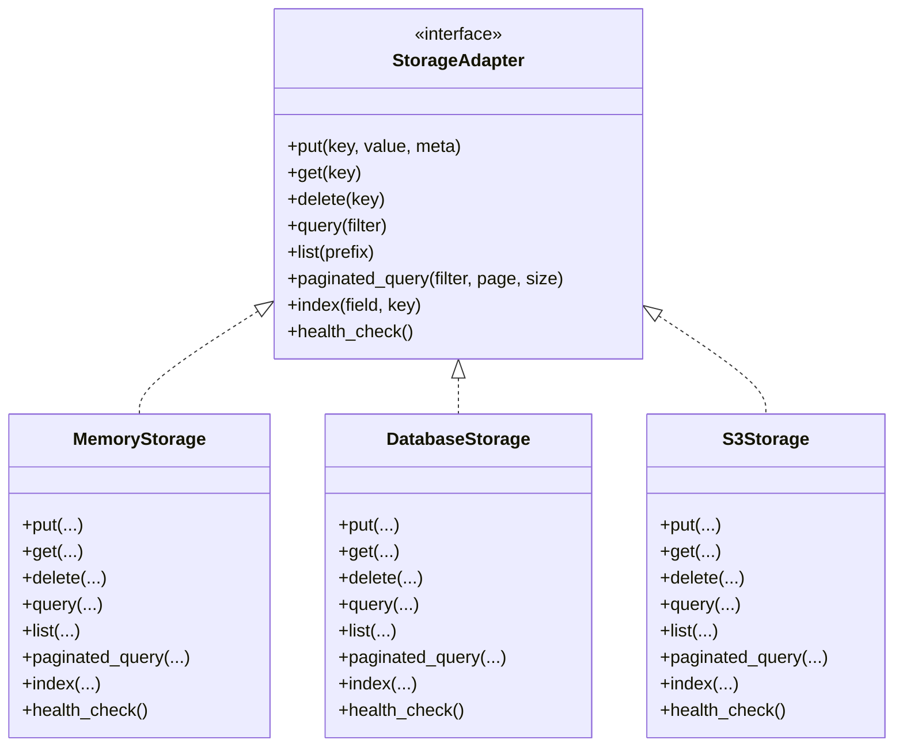
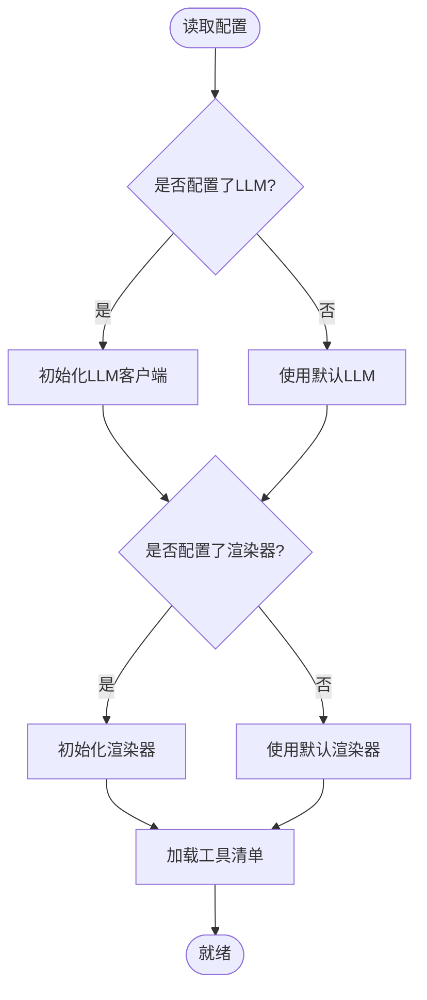
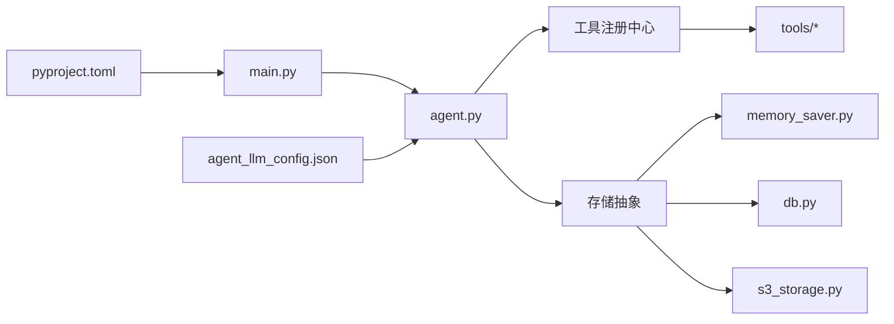

# 扩展机制设计

<cite>
**本文引用的文件**   
- [src/main.py](file://src/main.py)
- [src/agents/agent.py](file://src/agents/agent.py)
- [src/storage/memory/memory_saver.py](file://src/storage/memory/memory_saver.py)
- [src/storage/s3/s3_storage.py](file://src/storage/s3/s3_storage.py)
- [src/storage/database/db.py](file://src/storage/database/db.py)
- [src/tools/risk_scorer.py](file://src/tools/risk_scorer.py)
- [src/tools/financial_calculator.py](file://src/tools/financial_calculator.py)
- [src/tools/knowledge_search.py](file://src/tools/knowledge_search.py)
- [src/tools/batch_processor.py](file://src/tools/batch_processor.py)
- [src/tools/pdf_export.py](file://src/tools/pdf_export.py)
- [src/tools/multi_year_comparison.py](file://src/tools/multi_year_comparison.py)
- [src/tools/visualizer.py](file://src/tools/visualizer.py)
- [config/agent_llm_config.json](file://config/agent_llm_config.json)
- [pyproject.toml](file://pyproject.toml)
</cite>

## 目录
1. [引言](#引言)
2. [项目结构](#项目结构)
3. [核心组件](#核心组件)
4. [架构总览](#架构总览)
5. [详细组件分析](#详细组件分析)
6. [依赖关系分析](#依赖关系分析)
7. [性能考虑](#性能考虑)
8. [故障排查指南](#故障排查指南)
9. [结论](#结论)
10. [附录](#附录)

## 引言
本设计文档面向“智能审计风险识别系统”的扩展机制，目标是构建一套可插拔、可配置、可扩展的系统架构。重点覆盖：
- 工具插件的注册与发现协议、生命周期管理
- 存储后端的抽象接口设计与适配器模式实现
- 自定义工具模块开发规范（接口、参数校验、错误处理）
- 新存储后端扩展方法（含S3兼容示例）
- 配置驱动的扩展点（LLM提供商切换、渲染器替换等）
- 版本兼容性与向后兼容策略
- 扩展模块测试方法与调试技巧

## 项目结构
仓库采用分层与按功能域组织相结合的结构：
- src/agents：智能体编排与调度
- src/tools：业务工具集（评分、计算、检索、导出、可视化等）
- src/storage：存储后端抽象与具体实现（内存、数据库、S3）
- config：运行时配置（如LLM提供商配置）
- scripts：运行与初始化脚本
- tests：测试与评估

图表来源
- [src/main.py](file://src/main.py)
- [src/agents/agent.py](file://src/agents/agent.py)
- [src/storage/memory/memory_saver.py](file://src/storage/memory/memory_saver.py)
- [src/storage/database/db.py](file://src/storage/database/db.py)
- [src/storage/s3/s3_storage.py](file://src/storage/s3/s3_storage.py)
- [config/agent_llm_config.json](file://config/agent_llm_config.json)
- [pyproject.toml](file://pyproject.toml)

章节来源
- [src/main.py](file://src/main.py)
- [src/agents/agent.py](file://src/agents/agent.py)
- [src/storage/memory/memory_saver.py](file://src/storage/memory/memory_saver.py)
- [src/storage/database/db.py](file://src/storage/database/db.py)
- [src/storage/s3/s3_storage.py](file://src/storage/s3/s3_storage.py)
- [config/agent_llm_config.json](file://config/agent_llm_config.json)
- [pyproject.toml](file://pyproject.toml)

## 核心组件
- 工具插件体系
  - 统一工具接口：定义输入输出契约、元数据（名称、描述、版本）、参数校验与错误码约定
  - 注册中心：集中维护工具清单，支持动态加载、热更新、版本选择
  - 发现协议：基于包内约定或配置文件自动发现工具模块
  - 生命周期：初始化、预热、执行、清理、健康检查
- 存储抽象层
  - 抽象接口：统一的读写、查询、事务、分页、索引能力
  - 适配器模式：内存、数据库、S3等后端以相同接口暴露
  - 配置路由：根据配置选择具体后端实现
- 配置驱动扩展点
  - LLM提供商：通过配置切换不同模型服务
  - 渲染器：报告/图表渲染后端可替换
  - 工具开关：启用/禁用特定工具，指定默认版本

章节来源
- [src/tools/risk_scorer.py](file://src/tools/risk_scorer.py)
- [src/tools/financial_calculator.py](file://src/tools/financial_calculator.py)
- [src/tools/knowledge_search.py](file://src/tools/knowledge_search.py)
- [src/tools/batch_processor.py](file://src/tools/batch_processor.py)
- [src/tools/pdf_export.py](file://src/tools/pdf_export.py)
- [src/tools/multi_year_comparison.py](file://src/tools/multi_year_comparison.py)
- [src/tools/visualizer.py](file://src/tools/visualizer.py)
- [src/storage/memory/memory_saver.py](file://src/storage/memory/memory_saver.py)
- [src/storage/database/db.py](file://src/storage/database/db.py)
- [src/storage/s3/s3_storage.py](file://src/storage/s3/s3_storage.py)
- [config/agent_llm_config.json](file://config/agent_llm_config.json)

## 架构总览
系统采用“编排+插件+适配”的分层架构：
- 编排层：智能体负责流程编排、上下文传递、异常聚合
- 插件层：工具以统一接口接入，注册中心提供发现与调用
- 适配层：存储抽象屏蔽底层差异，配置决定具体实现
- 配置层：JSON/YAML驱动扩展点，支持运行时切换

图表来源
- [src/main.py](file://src/main.py)
- [src/agents/agent.py](file://src/agents/agent.py)
- [src/storage/memory/memory_saver.py](file://src/storage/memory/memory_saver.py)
- [src/storage/database/db.py](file://src/storage/database/db.py)
- [src/storage/s3/s3_storage.py](file://src/storage/s3/s3_storage.py)

## 详细组件分析

### 工具插件体系
- 统一接口规范
  - 必需字段：唯一标识、名称、描述、版本、参数Schema、返回值Schema、错误码映射
  - 生命周期钩子：init、pre_run、run、post_run、health_check、shutdown
- 注册与发现
  - 包内约定：在工具包下以模块为单位声明元数据，由注册中心扫描
  - 配置驱动：在配置中声明启用的工具及版本优先级
- 参数校验与错误处理
  - 基于Schema进行强类型校验，失败时返回结构化错误
  - 错误分类：参数错误、业务错误、系统错误；统一包装为可序列化对象
- 版本兼容
  - 语义化版本；注册中心按最小满足原则选择实现
  - 废弃标记与迁移提示

图表来源
- [src/tools/risk_scorer.py](file://src/tools/risk_scorer.py)
- [src/tools/financial_calculator.py](file://src/tools/financial_calculator.py)

章节来源
- [src/tools/risk_scorer.py](file://src/tools/risk_scorer.py)
- [src/tools/financial_calculator.py](file://src/tools/financial_calculator.py)
- [src/tools/knowledge_search.py](file://src/tools/knowledge_search.py)
- [src/tools/batch_processor.py](file://src/tools/batch_processor.py)
- [src/tools/pdf_export.py](file://src/tools/pdf_export.py)
- [src/tools/multi_year_comparison.py](file://src/tools/multi_year_comparison.py)
- [src/tools/visualizer.py](file://src/tools/visualizer.py)

### 存储抽象与适配器
- 抽象接口
  - 基本操作：put/get/delete/query/list/paginate/index
  - 事务与一致性：begin/commit/rollback、幂等键
  - 元数据：创建时间、更新时间、标签、版本
- 适配器实现
  - 内存存储：轻量级字典缓存，适合开发与演示
  - 数据库存储：关系型/文档型适配，支持索引与事务
  - S3兼容存储：对象存储适配，支持分片上传、预签名URL
- 配置路由
  - 通过配置项选择后端，支持多后端并行（读主写从、冷热分离）

图表来源
- [src/storage/memory/memory_saver.py](file://src/storage/memory/memory_saver.py)
- [src/storage/database/db.py](file://src/storage/database/db.py)
- [src/storage/s3/s3_storage.py](file://src/storage/s3/s3_storage.py)

章节来源
- [src/storage/memory/memory_saver.py](file://src/storage/memory/memory_saver.py)
- [src/storage/database/db.py](file://src/storage/database/db.py)
- [src/storage/s3/s3_storage.py](file://src/storage/s3/s3_storage.py)

### 配置驱动的扩展点
- LLM提供商切换
  - 配置项包含：提供商标识、鉴权信息、模型名、超时、重试策略
  - 运行时根据配置动态创建客户端，支持灰度与回滚
- 渲染器替换
  - 报告/图表渲染后端可插拔，支持PDF、HTML、图片等
  - 通过配置选择默认渲染器，并在工具链中注入
- 工具开关与版本
  - 启用/禁用工具列表，指定默认版本与降级策略

图表来源
- [config/agent_llm_config.json](file://config/agent_llm_config.json)

章节来源
- [config/agent_llm_config.json](file://config/agent_llm_config.json)

### 自定义工具模块开发指南
- 步骤
  - 定义工具元数据：名称、版本、描述、入参/出参Schema
  - 实现生命周期方法：init、run、health_check
  - 参数校验：基于Schema进行严格校验，返回结构化错误
  - 错误处理：区分参数错误、业务错误、系统错误，记录上下文
  - 注册与发现：将工具放入工具包，确保能被注册中心扫描
- 最佳实践
  - 幂等性：对重复调用具备幂等保护
  - 可观测性：埋点日志、指标上报、链路追踪ID透传
  - 资源管理：连接池、临时文件清理、并发控制
  - 单元测试：覆盖边界条件、异常路径、性能基准

章节来源
- [src/tools/risk_scorer.py](file://src/tools/risk_scorer.py)
- [src/tools/financial_calculator.py](file://src/tools/financial_calculator.py)
- [src/tools/knowledge_search.py](file://src/tools/knowledge_search.py)
- [src/tools/batch_processor.py](file://src/tools/batch_processor.py)
- [src/tools/pdf_export.py](file://src/tools/pdf_export.py)
- [src/tools/multi_year_comparison.py](file://src/tools/multi_year_comparison.py)
- [src/tools/visualizer.py](file://src/tools/visualizer.py)

### 扩展新的存储后端（S3兼容示例）
- 目标
  - 实现S3兼容的对象存储适配器，提供与抽象接口一致的读写能力
- 关键点
  - 认证与端点：支持AK/SK、STS、预签名URL
  - 分片与断点续传：大文件分片上传、合并与校验
  - 命名空间与路径：桶前缀作为租户隔离
  - 一致性模型：最终一致下的幂等写入与版本号
  - 健康检查：连通性探测与延迟指标
- 集成
  - 在配置中声明后端类型为S3，并提供必要参数
  - 在注册中心中注册该适配器，供上层透明调用

章节来源
- [src/storage/s3/s3_storage.py](file://src/storage/s3/s3_storage.py)

### 智能体编排与扩展点注入
- 职责
  - 解析配置、初始化LLM与渲染器、加载工具、编排节点执行
  - 上下文传递、错误聚合、重试与熔断
- 扩展点
  - 在编排阶段注入新的工具或存储后端
  - 支持运行时热更新工具清单与配置

章节来源
- [src/agents/agent.py](file://src/agents/agent.py)
- [src/main.py](file://src/main.py)

## 依赖关系分析
- 内部依赖
  - main.py 初始化应用上下文，注入配置与扩展点
  - agent.py 编排逻辑依赖工具注册中心与存储抽象
  - tools/* 依赖存储抽象，不直接耦合具体后端
  - storage/* 实现具体后端，遵循统一接口
- 外部依赖
  - LLM SDK、对象存储SDK、数据库驱动、渲染引擎
  - 通过pyproject.toml声明版本约束，避免冲突

图表来源
- [src/main.py](file://src/main.py)
- [src/agents/agent.py](file://src/agents/agent.py)
- [src/storage/memory/memory_saver.py](file://src/storage/memory/memory_saver.py)
- [src/storage/database/db.py](file://src/storage/database/db.py)
- [src/storage/s3/s3_storage.py](file://src/storage/s3/s3_storage.py)
- [config/agent_llm_config.json](file://config/agent_llm_config.json)
- [pyproject.toml](file://pyproject.toml)

章节来源
- [src/main.py](file://src/main.py)
- [src/agents/agent.py](file://src/agents/agent.py)
- [src/storage/memory/memory_saver.py](file://src/storage/memory/memory_saver.py)
- [src/storage/database/db.py](file://src/storage/database/db.py)
- [src/storage/s3/s3_storage.py](file://src/storage/s3/s3_storage.py)
- [config/agent_llm_config.json](file://config/agent_llm_config.json)
- [pyproject.toml](file://pyproject.toml)

## 性能考虑
- 工具侧
  - 批量处理与流式处理：减少往返与序列化开销
  - 缓存热点数据：本地缓存与分布式缓存结合
  - 并发控制：限流、背压、线程/进程池
- 存储侧
  - 索引优化：常用查询字段建立索引
  - 分页与游标：避免全表扫描
  - 对象存储：分片上传、压缩传输、CDN加速
- 编排侧
  - 异步执行与流水线：提升吞吐
  - 重试与退避：网络抖动与下游不稳定场景
  - 熔断与降级：关键路径保护

[本节为通用指导，无需引用具体文件]

## 故障排查指南
- 常见问题
  - 工具未注册：检查包结构与元数据声明，确认注册中心扫描路径
  - 参数校验失败：核对Schema定义与实际传入值
  - 存储不可用：健康检查失败、权限不足、网络不通
  - LLM调用失败：鉴权过期、配额限制、模型不可用
- 定位方法
  - 开启详细日志与链路追踪ID
  - 使用健康检查接口验证各组件状态
  - 回放失败请求，复现问题并缩小范围
- 恢复策略
  - 快速回滚到上一稳定版本
  - 切换到备用后端或降级模式
  - 重启相关服务并观察指标

章节来源
- [src/tools/risk_scorer.py](file://src/tools/risk_scorer.py)
- [src/storage/memory/memory_saver.py](file://src/storage/memory/memory_saver.py)
- [src/storage/database/db.py](file://src/storage/database/db.py)
- [src/storage/s3/s3_storage.py](file://src/storage/s3/s3_storage.py)
- [config/agent_llm_config.json](file://config/agent_llm_config.json)

## 结论
通过统一的工具接口、注册与发现协议、存储抽象与适配器、以及配置驱动的扩展点，系统实现了高内聚、低耦合的可插拔架构。配合完善的版本兼容策略、测试与调试手段，可在保证稳定性的前提下持续演进与扩展。

[本节为总结性内容，无需引用具体文件]

## 附录

### 扩展开发最佳实践
- 明确契约：接口与Schema先行，保持向后兼容
- 渐进式发布：灰度上线、特性开关、快速回滚
- 可观测性：日志、指标、追踪三位一体
- 安全合规：鉴权、审计、数据脱敏
- 文档与示例：提供README、示例配置与用例

[本节为通用指导，无需引用具体文件]

### 版本兼容与向后兼容策略
- 语义化版本：主版本破坏性变更，次版本新增能力，补丁版本修复缺陷
- 弃用策略：提前公告、双轨运行、迁移工具
- 兼容性矩阵：记录各版本间的能力与行为差异
- 自动化检测：CI中增加兼容性测试与回归用例

[本节为通用指导，无需引用具体文件]

### 测试方法与调试技巧
- 单元测试：针对工具与适配器的核心逻辑
- 集成测试：端到端流程与多后端组合
- 性能测试：基准与压力测试
- 调试技巧：断点、日志级别、慢查询分析、网络抓包

[本节为通用指导，无需引用具体文件]