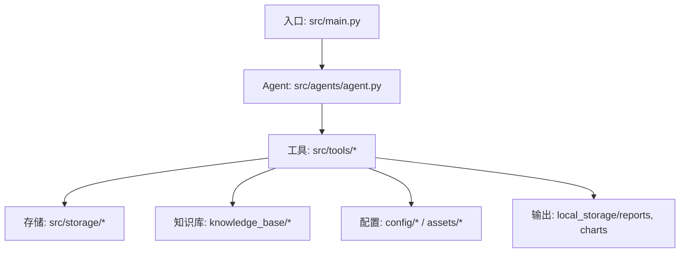
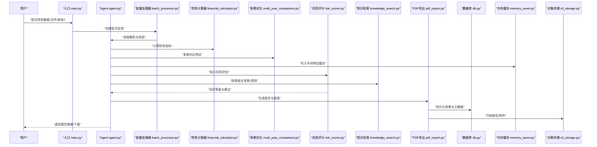
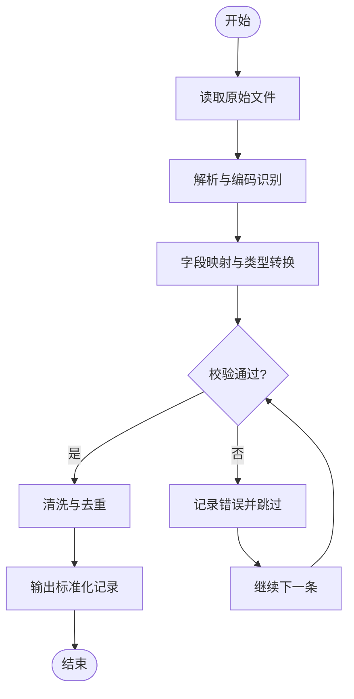
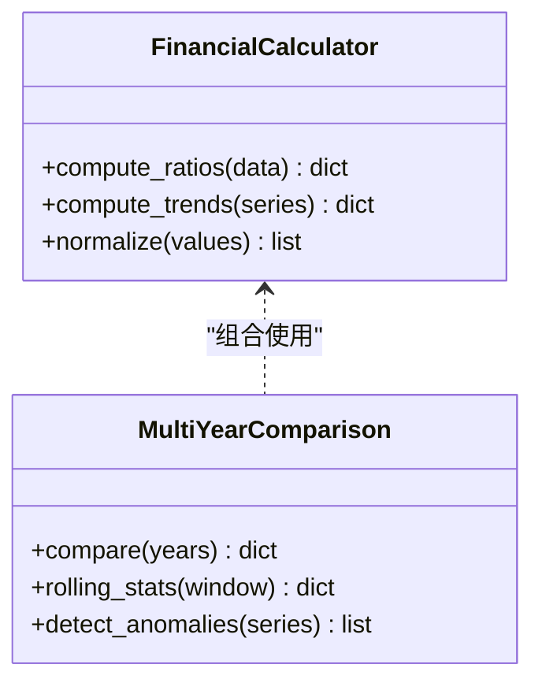
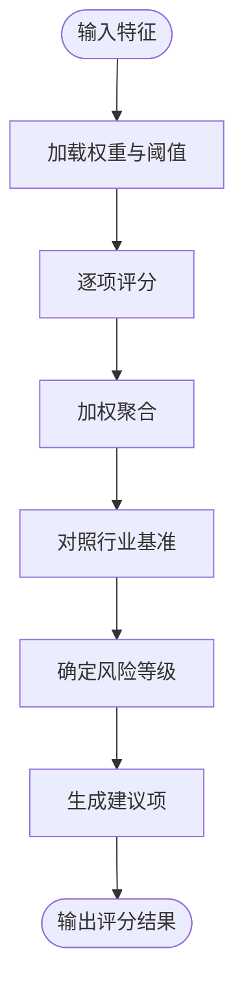
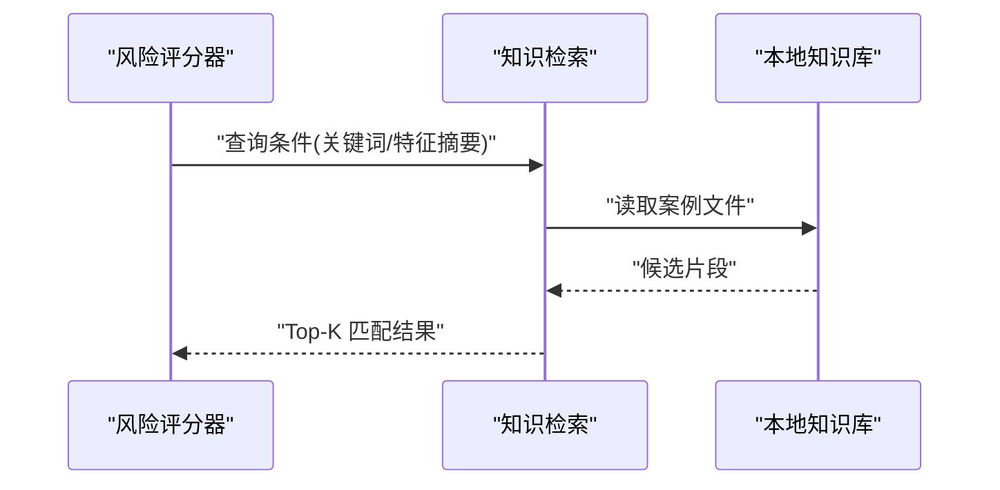
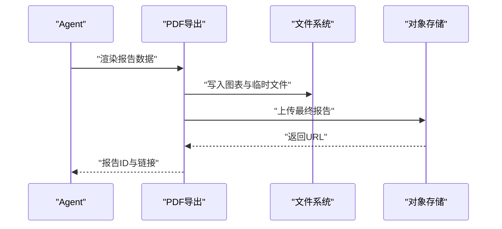
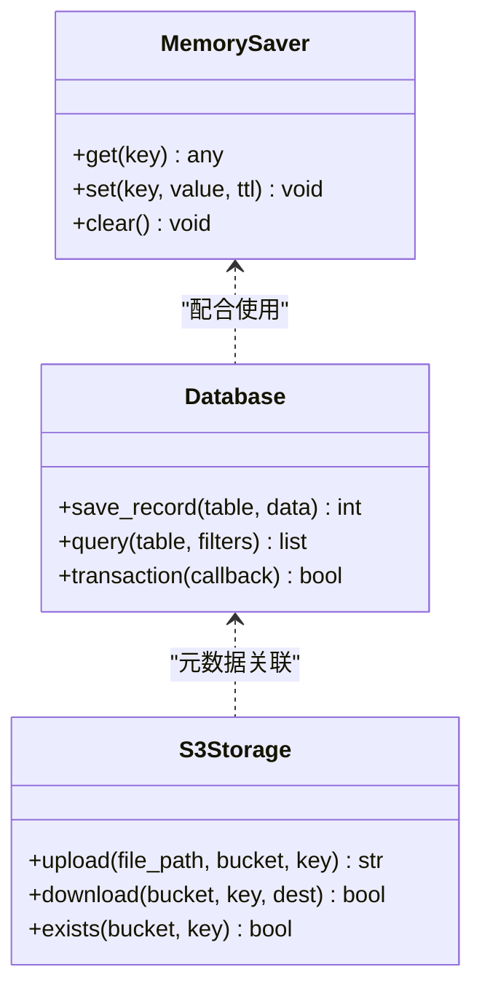
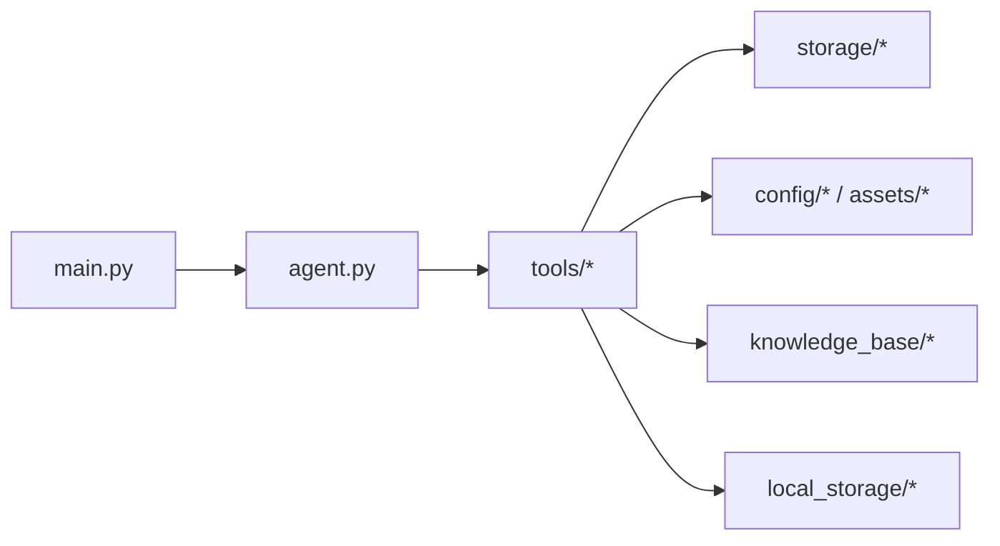
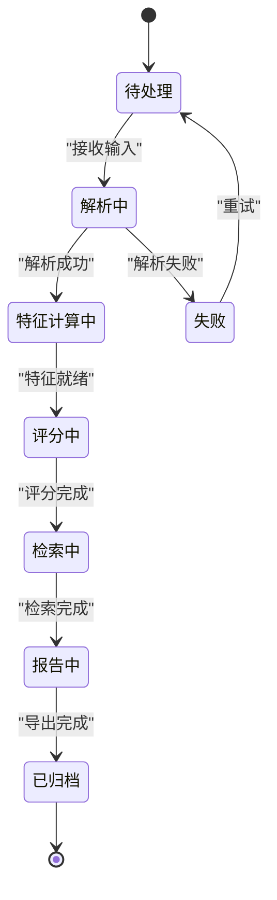

# 数据流设计

<cite>
**本文引用的文件**   
- [src/main.py](file://src/main.py)
- [src/agents/agent.py](file://src/agents/agent.py)
- [src/tools/batch_processor.py](file://src/tools/batch_processor.py)
- [src/tools/financial_calculator.py](file://src/tools/financial_calculator.py)
- [src/tools/knowledge_search.py](file://src/tools/knowledge_search.py)
- [src/tools/multi_year_comparison.py](file://src/tools/multi_year_comparison.py)
- [src/tools/risk_scorer.py](file://src/tools/risk_scorer.py)
- [src/tools/pdf_export.py](file://src/tools/pdf_export.py)
- [src/storage/database/db.py](file://src/storage/database/db.py)
- [src/storage/database/shared/model.py](file://src/storage/database/shared/model.py)
- [src/storage/memory/memory_saver.py](file://src/storage/memory/memory_saver.py)
- [src/storage/s3/s3_storage.py](file://src/storage/s3/s3_storage.py)
- [src/utils/file/file.py](file://src/utils/file/file.py)
- [src/local_knowledge.py](file://src/local_knowledge.py)
- [config/agent_llm_config.json](file://config/agent_llm_config.json)
- [assets/industry_benchmarks.json](file://assets/industry_benchmarks.json)
- [knowledge_base/cases_ch9.txt](file://knowledge_base/cases_ch9.txt)
- [knowledge_base/cases_ch10.txt](file://knowledge_base/cases_ch10.txt)
- [knowledge_base/cases_ch11.txt](file://knowledge_base/cases_ch11.txt)
</cite>

## 目录
1. [引言](#引言)
2. [项目结构](#项目结构)
3. [核心组件](#核心组件)
4. [架构总览](#架构总览)
5. [详细组件分析](#详细组件分析)
6. [依赖关系分析](#依赖关系分析)
7. [性能考虑](#性能考虑)
8. [故障排查指南](#故障排查指南)
9. [结论](#结论)
10. [附录](#附录)

## 引言
本文件面向智能审计风险识别系统的数据流设计与实现，覆盖从财务数据输入到报告输出的完整链路：数据解析与校验、特征提取与转换、风险评估计算管道、知识检索与匹配、报告生成与导出。文档同时说明各组件间的数据传递格式与序列化方式，解释异步处理机制与任务队列设计，描述缓存策略与持久化方案，并给出数据流转图与状态机模型，讨论一致性保证与事务处理，以及批处理、并行处理和内存管理等优化策略。

## 项目结构
系统采用分层与按功能域组织相结合的结构：
- 入口与编排：主程序负责加载配置、初始化存储与工具、调度工作流。
- Agent 层：封装审计推理与流程控制逻辑。
- 工具层：提供财务计算、多期对比、风险评分、知识检索、PDF 导出等能力。
- 存储层：数据库、内存缓存、对象存储（S3）三种后端。
- 知识库与基准：本地案例文本与行业基准指标。
- 配置与脚本：LLM 配置、基准数据、启动脚本等。

图表来源
- [src/main.py](file://src/main.py)
- [src/agents/agent.py](file://src/agents/agent.py)
- [src/tools/batch_processor.py](file://src/tools/batch_processor.py)
- [src/tools/financial_calculator.py](file://src/tools/financial_calculator.py)
- [src/tools/knowledge_search.py](file://src/tools/knowledge_search.py)
- [src/tools/multi_year_comparison.py](file://src/tools/multi_year_comparison.py)
- [src/tools/risk_scorer.py](file://src/tools/risk_scorer.py)
- [src/tools/pdf_export.py](file://src/tools/pdf_export.py)
- [src/storage/database/db.py](file://src/storage/database/db.py)
- [src/storage/memory/memory_saver.py](file://src/storage/memory/memory_saver.py)
- [src/storage/s3/s3_storage.py](file://src/storage/s3/s3_storage.py)
- [config/agent_llm_config.json](file://config/agent_llm_config.json)
- [assets/industry_benchmarks.json](file://assets/industry_benchmarks.json)
- [knowledge_base/cases_ch9.txt](file://knowledge_base/cases_ch9.txt)
- [knowledge_base/cases_ch10.txt](file://knowledge_base/cases_ch10.txt)
- [knowledge_base/cases_ch11.txt](file://knowledge_base/cases_ch11.txt)

章节来源
- [src/main.py](file://src/main.py)
- [src/agents/agent.py](file://src/agents/agent.py)
- [src/tools/batch_processor.py](file://src/tools/batch_processor.py)
- [src/tools/financial_calculator.py](file://src/tools/financial_calculator.py)
- [src/tools/knowledge_search.py](file://src/tools/knowledge_search.py)
- [src/tools/multi_year_comparison.py](file://src/tools/multi_year_comparison.py)
- [src/tools/risk_scorer.py](file://src/tools/risk_scorer.py)
- [src/tools/pdf_export.py](file://src/tools/pdf_export.py)
- [src/storage/database/db.py](file://src/storage/database/db.py)
- [src/storage/memory/memory_saver.py](file://src/storage/memory/memory_saver.py)
- [src/storage/s3/s3_storage.py](file://src/storage/s3/s3_storage.py)
- [config/agent_llm_config.json](file://config/agent_llm_config.json)
- [assets/industry_benchmarks.json](file://assets/industry_benchmarks.json)
- [knowledge_base/cases_ch9.txt](file://knowledge_base/cases_ch9.txt)
- [knowledge_base/cases_ch10.txt](file://knowledge_base/cases_ch10.txt)
- [knowledge_base/cases_ch11.txt](file://knowledge_base/cases_ch11.txt)

## 核心组件
- 数据输入与解析
  - 支持多种财务数据源（如 CSV/Excel/JSON），由文件工具与批量处理器统一读取、清洗与标准化。
  - 字段映射与类型转换，缺失值填充与异常值检测。
- 特征提取与转换
  - 基于财务计算器进行比率、趋势、波动性等指标计算；多期对比工具用于跨年度比较。
  - 输出结构化特征向量，供后续评分与检索使用。
- 风险评估计算管道
  - 风险评分器根据规则与阈值对特征进行打分，结合行业基准进行相对评估。
  - 支持分阶段评分与汇总，输出风险等级与建议项。
- 知识检索与匹配
  - 本地知识库包含历史案例与规则片段，通过检索工具进行相似度匹配与上下文注入。
  - 将匹配结果作为辅助证据参与风险判定。
- 报告生成与导出
  - PDF 导出工具将分析结果、图表与关键发现整合为可分发报告。
  - 图表与报告落盘至本地存储目录，便于归档与分享。
- 存储与缓存
  - 内存缓存用于中间结果与高频查询加速。
  - 数据库持久化审计过程与结果；对象存储用于大文件或报表归档。
- 配置与外部依赖
  - LLM 配置、行业基准数据、本地知识库路径等集中管理。

章节来源
- [src/tools/financial_calculator.py](file://src/tools/financial_calculator.py)
- [src/tools/multi_year_comparison.py](file://src/tools/multi_year_comparison.py)
- [src/tools/risk_scorer.py](file://src/tools/risk_scorer.py)
- [src/tools/knowledge_search.py](file://src/tools/knowledge_search.py)
- [src/tools/pdf_export.py](file://src/tools/pdf_export.py)
- [src/storage/memory/memory_saver.py](file://src/storage/memory/memory_saver.py)
- [src/storage/database/db.py](file://src/storage/database/db.py)
- [src/storage/s3/s3_storage.py](file://src/storage/s3/s3_storage.py)
- [config/agent_llm_config.json](file://config/agent_llm_config.json)
- [assets/industry_benchmarks.json](file://assets/industry_benchmarks.json)
- [knowledge_base/cases_ch9.txt](file://knowledge_base/cases_ch9.txt)
- [knowledge_base/cases_ch10.txt](file://knowledge_base/cases_ch10.txt)
- [knowledge_base/cases_ch11.txt](file://knowledge_base/cases_ch11.txt)

## 架构总览
整体数据流遵循“输入→解析→特征→评分→检索→报告”的流水线模式，辅以缓存与持久化，并通过批量处理器与异步任务提升吞吐。

图表来源
- [src/main.py](file://src/main.py)
- [src/agents/agent.py](file://src/agents/agent.py)
- [src/tools/batch_processor.py](file://src/tools/batch_processor.py)
- [src/tools/financial_calculator.py](file://src/tools/financial_calculator.py)
- [src/tools/multi_year_comparison.py](file://src/tools/multi_year_comparison.py)
- [src/tools/risk_scorer.py](file://src/tools/risk_scorer.py)
- [src/tools/knowledge_search.py](file://src/tools/knowledge_search.py)
- [src/tools/pdf_export.py](file://src/tools/pdf_export.py)
- [src/storage/database/db.py](file://src/storage/database/db.py)
- [src/storage/memory/memory_saver.py](file://src/storage/memory/memory_saver.py)
- [src/storage/s3/s3_storage.py](file://src/storage/s3/s3_storage.py)

## 详细组件分析

### 数据输入与解析验证
- 输入来源
  - 文件上传（CSV/Excel/JSON）、API 表单或命令行参数。
- 解析流程
  - 文件工具负责打开与编码识别；批量处理器负责分片与去重。
  - 字段映射、类型转换、空值处理、重复行剔除、异常值标记。
- 校验规则
  - 必填字段检查、数值范围校验、日期格式校验、科目一致性校验。
- 错误处理
  - 记录不可恢复错误并跳过坏行，保留审计轨迹；汇总错误清单供用户修正。

章节来源
- [src/utils/file/file.py](file://src/utils/file/file.py)
- [src/tools/batch_processor.py](file://src/tools/batch_processor.py)

### 特征提取与转换
- 财务指标计算
  - 流动性、盈利性、杠杆、周转率等基础比率；趋势与波动性衍生指标。
- 多期对比
  - 同比/环比变化、滚动窗口统计、异常波动检测。
- 输出格式
  - 结构化 JSON 或 DataFrame，键名稳定、单位一致、时间戳对齐。

图表来源
- [src/tools/financial_calculator.py](file://src/tools/financial_calculator.py)
- [src/tools/multi_year_comparison.py](file://src/tools/multi_year_comparison.py)

章节来源
- [src/tools/financial_calculator.py](file://src/tools/financial_calculator.py)
- [src/tools/multi_year_comparison.py](file://src/tools/multi_year_comparison.py)

### 风险评估计算管道
- 评分模型
  - 规则引擎与阈值驱动，结合行业基准进行相对定位。
  - 维度包括：偿债风险、盈利质量、营运效率、现金流健康度等。
- 计算流程
  - 读取特征缓存 → 应用权重与阈值 → 输出分项得分与综合等级 → 生成建议项。
- 结果结构
  - 风险等级、分项分数、关键因子、改进建议、置信度。

章节来源
- [src/tools/risk_scorer.py](file://src/tools/risk_scorer.py)
- [assets/industry_benchmarks.json](file://assets/industry_benchmarks.json)

### 知识检索与匹配
- 知识库内容
  - 本地案例文本（按主题分文件），用于相似问题匹配与经验复用。
- 检索策略
  - 关键词/语义相似度检索，命中后抽取相关片段作为上下文。
- 集成点
  - 在评分前后注入背景信息，辅助判断与解释。

图表来源
- [src/tools/knowledge_search.py](file://src/tools/knowledge_search.py)
- [knowledge_base/cases_ch9.txt](file://knowledge_base/cases_ch9.txt)
- [knowledge_base/cases_ch10.txt](file://knowledge_base/cases_ch10.txt)
- [knowledge_base/cases_ch11.txt](file://knowledge_base/cases_ch11.txt)

章节来源
- [src/tools/knowledge_search.py](file://src/tools/knowledge_search.py)
- [knowledge_base/cases_ch9.txt](file://knowledge_base/cases_ch9.txt)
- [knowledge_base/cases_ch10.txt](file://knowledge_base/cases_ch10.txt)
- [knowledge_base/cases_ch11.txt](file://knowledge_base/cases_ch11.txt)

### 报告生成与导出
- 生成内容
  - 封面、摘要、指标概览、风险等级、关键发现、建议与附录。
- 图表与附件
  - 自动插入趋势图、雷达图等可视化元素。
- 输出位置
  - 本地报告目录与对象存储归档，返回可访问链接。

图表来源
- [src/tools/pdf_export.py](file://src/tools/pdf_export.py)
- [src/storage/s3/s3_storage.py](file://src/storage/s3/s3_storage.py)

章节来源
- [src/tools/pdf_export.py](file://src/tools/pdf_export.py)
- [src/storage/s3/s3_storage.py](file://src/storage/s3/s3_storage.py)

### 存储与缓存
- 内存缓存
  - 用于中间特征、高频查询结果与短期会话状态。
- 数据库持久化
  - 审计任务、输入快照、特征、评分、报告元数据与审计轨迹。
- 对象存储
  - 报告 PDF、图表、附件等大文件归档。

图表来源
- [src/storage/memory/memory_saver.py](file://src/storage/memory/memory_saver.py)
- [src/storage/database/db.py](file://src/storage/database/db.py)
- [src/storage/s3/s3_storage.py](file://src/storage/s3/s3_storage.py)

章节来源
- [src/storage/memory/memory_saver.py](file://src/storage/memory/memory_saver.py)
- [src/storage/database/db.py](file://src/storage/database/db.py)
- [src/storage/s3/s3_storage.py](file://src/storage/s3/s3_storage.py)

### 配置与外部依赖
- LLM 配置
  - 模型选择、温度、最大长度等参数集中管理。
- 行业基准
  - 不同行业的参考指标与阈值，支撑相对评估。
- 本地知识库
  - 按主题划分的案例文本，便于检索与更新。

章节来源
- [config/agent_llm_config.json](file://config/agent_llm_config.json)
- [assets/industry_benchmarks.json](file://assets/industry_benchmarks.json)
- [knowledge_base/cases_ch9.txt](file://knowledge_base/cases_ch9.txt)
- [knowledge_base/cases_ch10.txt](file://knowledge_base/cases_ch10.txt)
- [knowledge_base/cases_ch11.txt](file://knowledge_base/cases_ch11.txt)

## 依赖关系分析
- 模块耦合
  - Agent 协调工具链，工具之间低耦合，通过标准数据结构交换。
  - 存储层抽象清晰，工具仅依赖接口，便于替换与扩展。
- 外部依赖
  - 文件 I/O、数据库驱动、对象存储 SDK、PDF 生成库等。
- 潜在循环
  - 当前结构无直接循环依赖；若新增跨工具调用需保持单向依赖。

图表来源
- [src/main.py](file://src/main.py)
- [src/agents/agent.py](file://src/agents/agent.py)
- [src/tools/batch_processor.py](file://src/tools/batch_processor.py)
- [src/tools/financial_calculator.py](file://src/tools/financial_calculator.py)
- [src/tools/knowledge_search.py](file://src/tools/knowledge_search.py)
- [src/tools/multi_year_comparison.py](file://src/tools/multi_year_comparison.py)
- [src/tools/risk_scorer.py](file://src/tools/risk_scorer.py)
- [src/tools/pdf_export.py](file://src/tools/pdf_export.py)
- [src/storage/database/db.py](file://src/storage/database/db.py)
- [src/storage/memory/memory_saver.py](file://src/storage/memory/memory_saver.py)
- [src/storage/s3/s3_storage.py](file://src/storage/s3/s3_storage.py)
- [config/agent_llm_config.json](file://config/agent_llm_config.json)
- [assets/industry_benchmarks.json](file://assets/industry_benchmarks.json)
- [knowledge_base/cases_ch9.txt](file://knowledge_base/cases_ch9.txt)
- [knowledge_base/cases_ch10.txt](file://knowledge_base/cases_ch10.txt)
- [knowledge_base/cases_ch11.txt](file://knowledge_base/cases_ch11.txt)

章节来源
- [src/main.py](file://src/main.py)
- [src/agents/agent.py](file://src/agents/agent.py)
- [src/tools/batch_processor.py](file://src/tools/batch_processor.py)
- [src/tools/financial_calculator.py](file://src/tools/financial_calculator.py)
- [src/tools/knowledge_search.py](file://src/tools/knowledge_search.py)
- [src/tools/multi_year_comparison.py](file://src/tools/multi_year_comparison.py)
- [src/tools/risk_scorer.py](file://src/tools/risk_scorer.py)
- [src/tools/pdf_export.py](file://src/tools/pdf_export.py)
- [src/storage/database/db.py](file://src/storage/database/db.py)
- [src/storage/memory/memory_saver.py](file://src/storage/memory/memory_saver.py)
- [src/storage/s3/s3_storage.py](file://src/storage/s3/s3_storage.py)
- [config/agent_llm_config.json](file://config/agent_llm_config.json)
- [assets/industry_benchmarks.json](file://assets/industry_benchmarks.json)
- [knowledge_base/cases_ch9.txt](file://knowledge_base/cases_ch9.txt)
- [knowledge_base/cases_ch10.txt](file://knowledge_base/cases_ch10.txt)
- [knowledge_base/cases_ch11.txt](file://knowledge_base/cases_ch11.txt)

## 性能考虑
- 批处理
  - 批量处理器按批次切分输入，减少 I/O 次数与上下文切换开销。
- 并行处理
  - 特征计算与检索可并行执行；评分聚合阶段串行以保证顺序与一致性。
- 内存管理
  - 使用内存缓存避免重复计算；对大数据集采用流式读取与分页处理。
- 缓存策略
  - 短期 TTL 缓存热点特征与检索结果；长周期缓存行业基准与静态配置。
- 持久化优化
  - 数据库批量写入与索引优化；对象存储分块上传与断点续传。
- 异步与任务队列
  - 通过异步任务队列解耦耗时步骤（如 PDF 生成、S3 上传），提高响应速度。

[本节为通用指导，不直接分析具体文件]

## 故障排查指南
- 常见问题
  - 数据解析失败：检查编码、分隔符、列名映射与数据类型。
  - 指标计算异常：核对单位、时间对齐与缺失值填充策略。
  - 评分结果异常：确认权重与阈值配置、基准数据版本。
  - 报告导出失败：检查模板、字体与磁盘空间。
- 日志与追踪
  - 记录关键步骤输入输出哈希、耗时与错误堆栈，便于回溯。
- 回滚与重试
  - 对幂等操作启用重试；非幂等操作使用事务与补偿逻辑。

章节来源
- [src/storage/database/db.py](file://src/storage/database/db.py)
- [src/storage/memory/memory_saver.py](file://src/storage/memory/memory_saver.py)
- [src/tools/pdf_export.py](file://src/tools/pdf_export.py)

## 结论
本数据流设计以模块化与可观测为核心，围绕“输入→解析→特征→评分→检索→报告”的主链路构建，借助缓存、持久化与异步任务提升性能与稳定性。通过清晰的接口与标准数据格式，系统具备良好的可扩展性与可维护性，能够支撑大规模财务数据的审计风险识别与分析。

## 附录

### 数据格式与序列化约定
- 输入
  - CSV/Excel/JSON，统一转换为内部记录结构，包含字段名、类型、单位、时间戳。
- 中间结果
  - 特征向量与指标字典，键名稳定、层级清晰，便于缓存与检索。
- 输出
  - 评分结果与报告元数据采用 JSON；PDF 报告与图表为二进制文件。
- 序列化
  - 文本型数据使用 UTF-8；数值型保留精度；时间统一为 UTC 时间戳。

[本节为通用约定，不直接分析具体文件]

### 状态机模型（任务生命周期）

[本节为概念模型，不直接分析具体文件]

### 一致性保证与事务处理
- 原子性
  - 关键步骤（如评分写入与报告元数据保存）在同一事务内完成。
- 可见性
  - 中间结果先写缓存，成功后再落库，避免脏读。
- 隔离性
  - 并发任务通过唯一任务 ID 与版本号控制，防止覆盖。
- 持久化
  - 失败时保留审计轨迹与部分结果，支持断点续算。

章节来源
- [src/storage/database/db.py](file://src/storage/database/db.py)
- [src/storage/memory/memory_saver.py](file://src/storage/memory/memory_saver.py)