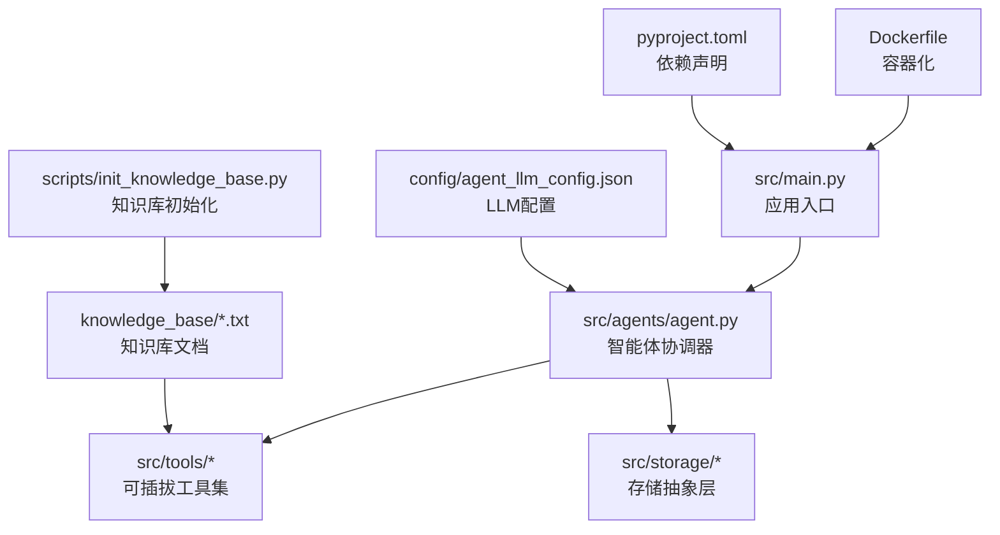
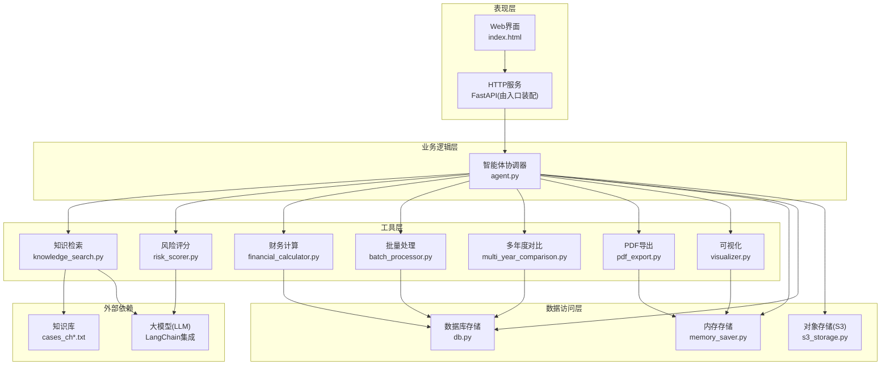
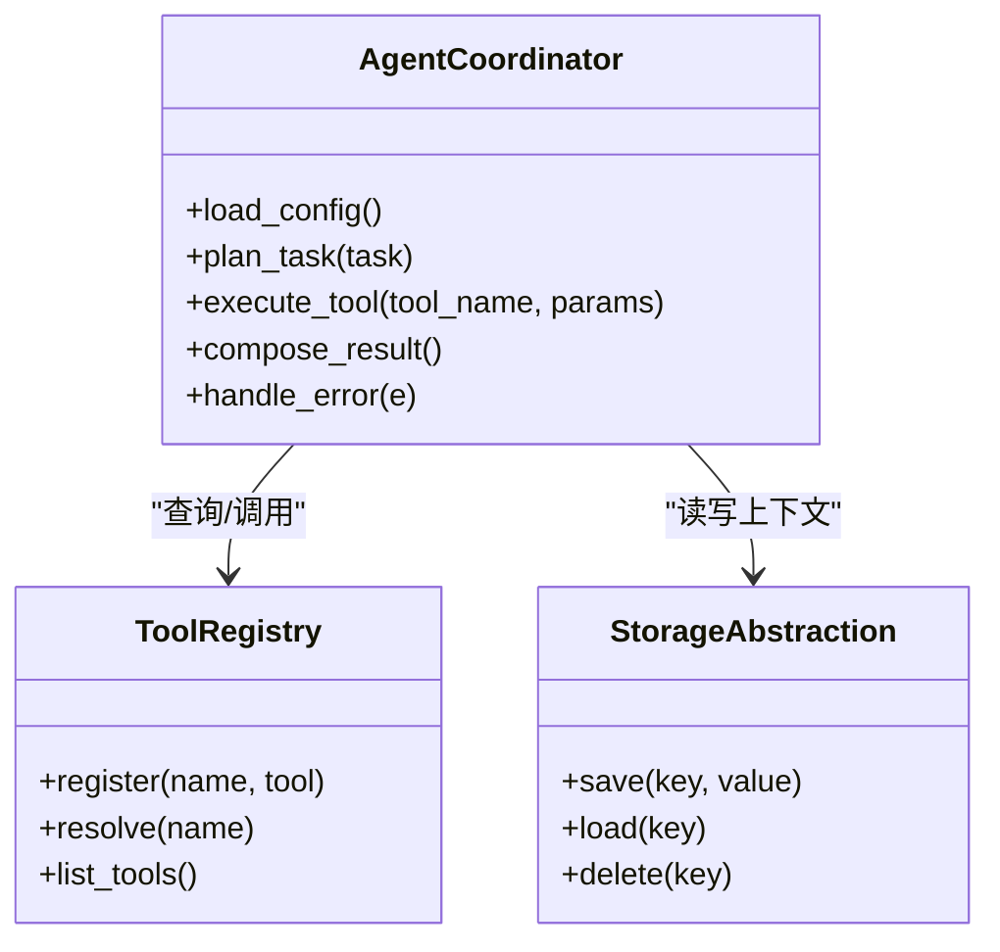
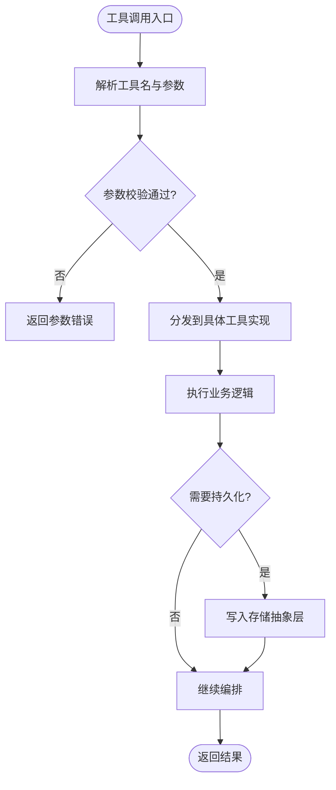
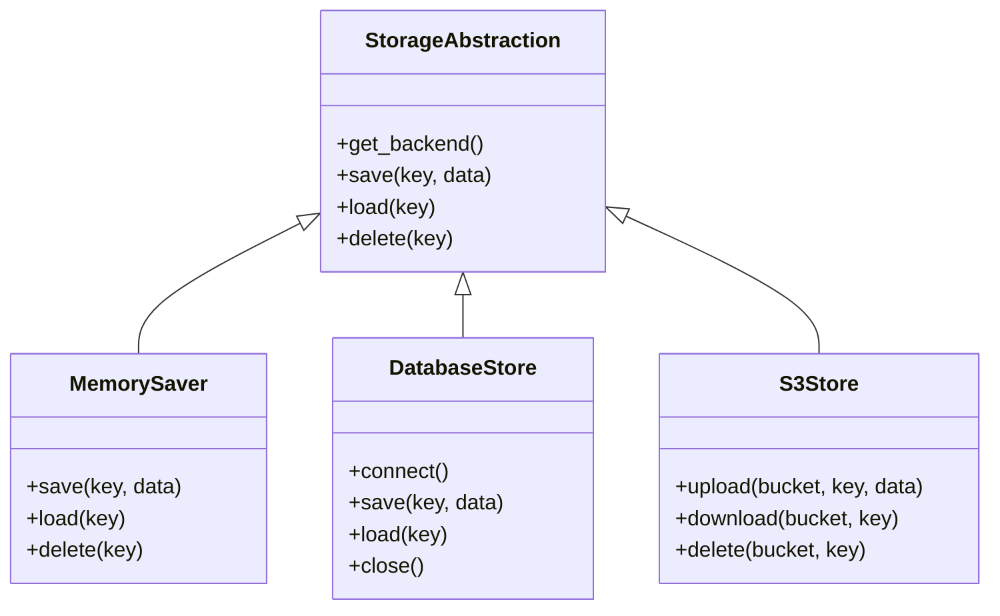
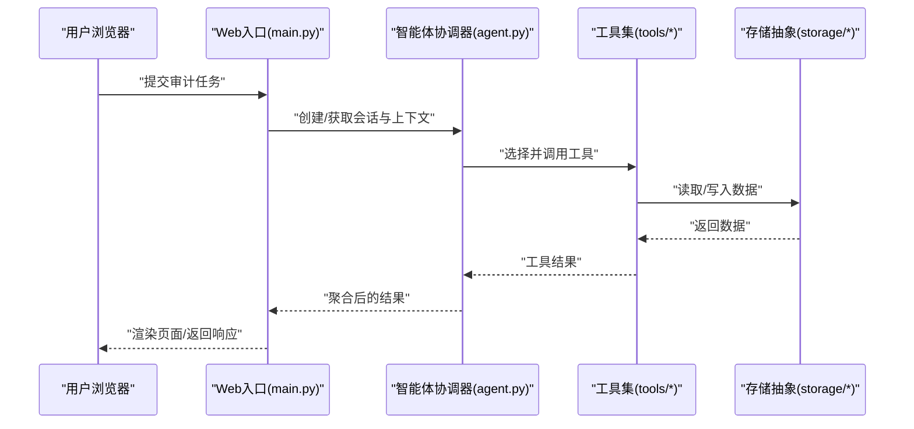
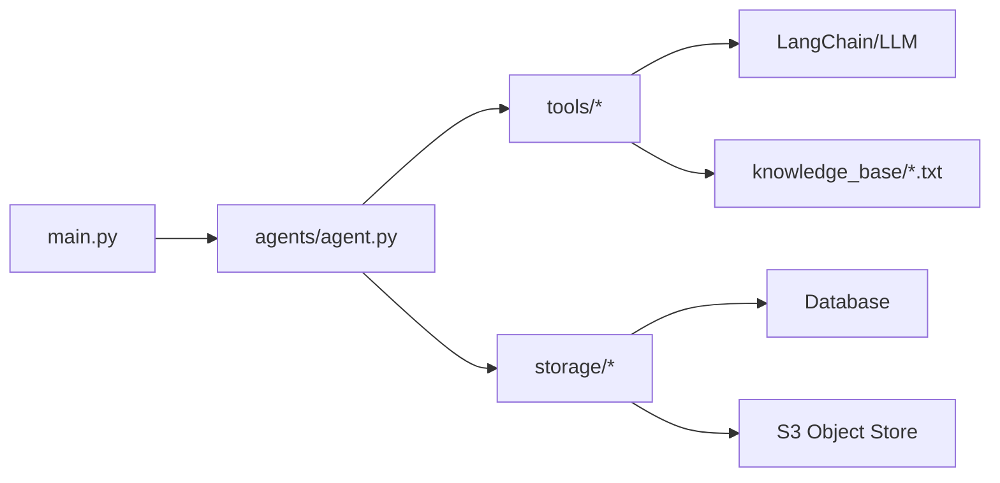
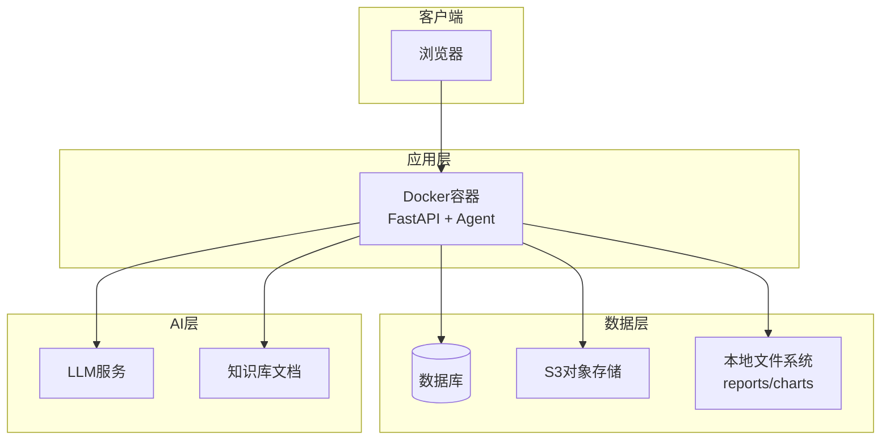

# 整体架构概览

<cite>
**本文引用的文件**   
- [src/main.py](file://src/main.py)
- [src/agents/agent.py](file://src/agents/agent.py)
- [src/tools/knowledge_search.py](file://src/tools/knowledge_search.py)
- [src/tools/risk_scorer.py](file://src/tools/risk_scorer.py)
- [src/tools/financial_calculator.py](file://src/tools/financial_calculator.py)
- [src/tools/batch_processor.py](file://src/tools/batch_processor.py)
- [src/tools/pdf_export.py](file://src/tools/pdf_export.py)
- [src/tools/multi_year_comparison.py](file://src/tools/multi_year_comparison.py)
- [src/tools/visualizer.py](file://src/tools/visualizer.py)
- [src/storage/database/db.py](file://src/storage/database/db.py)
- [src/storage/memory/memory_saver.py](file://src/storage/memory/memory_saver.py)
- [src/storage/s3/s3_storage.py](file://src/storage/s3/s3_storage.py)
- [config/agent_llm_config.json](file://config/agent_llm_config.json)
- [pyproject.toml](file://pyproject.toml)
- [Dockerfile](file://Dockerfile)
- [scripts/init_knowledge_base.py](file://scripts/init_knowledge_base.py)
- [knowledge_base/cases_ch9.txt](file://knowledge_base/cases_ch9.txt)
- [knowledge_base/cases_ch10.txt](file://knowledge_base/cases_ch10.txt)
- [knowledge_base/cases_ch11.txt](file://knowledge_base/cases_ch11.txt)
</cite>

## 目录
1. [简介](#简介)
2. [项目结构](#项目结构)
3. [核心组件](#核心组件)
4. [架构总览](#架构总览)
5. [详细组件分析](#详细组件分析)
6. [依赖关系分析](#依赖关系分析)
7. [性能考量](#性能考量)
8. [故障排查指南](#故障排查指南)
9. [结论](#结论)
10. [附录](#附录)

## 简介
本文件为“智能审计风险识别系统”的整体架构概览，面向技术与管理读者，系统性阐述分层架构、插件化与配置驱动理念、主要技术栈选型及理由、系统边界定义、数据流向与部署拓扑。目标是帮助读者快速理解系统如何以可插拔工具集和智能体协调器为核心，结合检索增强与可视化导出能力，完成审计风险识别与分析工作流。

## 项目结构
仓库采用按功能域划分的模块化组织方式：
- src：应用源码，包含入口、智能体、工具、存储抽象、Web静态资源等
- config：运行时配置（如LLM参数）
- knowledge_base：本地知识库文档（案例文本）
- scripts：初始化与运行脚本
- tests：测试与评估
- Dockerfile：容器镜像构建
- pyproject.toml：Python工程与依赖声明

图表来源
- [src/main.py](file://src/main.py)
- [src/agents/agent.py](file://src/agents/agent.py)
- [src/tools/knowledge_search.py](file://src/tools/knowledge_search.py)
- [src/storage/database/db.py](file://src/storage/database/db.py)
- [config/agent_llm_config.json](file://config/agent_llm_config.json)
- [scripts/init_knowledge_base.py](file://scripts/init_knowledge_base.py)
- [knowledge_base/cases_ch9.txt](file://knowledge_base/cases_ch9.txt)
- [Dockerfile](file://Dockerfile)
- [pyproject.toml](file://pyproject.toml)

章节来源
- [src/main.py](file://src/main.py)
- [src/agents/agent.py](file://src/agents/agent.py)
- [config/agent_llm_config.json](file://config/agent_llm_config.json)
- [pyproject.toml](file://pyproject.toml)
- [Dockerfile](file://Dockerfile)
- [scripts/init_knowledge_base.py](file://scripts/init_knowledge_base.py)
- [knowledge_base/cases_ch9.txt](file://knowledge_base/cases_ch9.txt)
- [knowledge_base/cases_ch10.txt](file://knowledge_base/cases_ch10.txt)
- [knowledge_base/cases_ch11.txt](file://knowledge_base/cases_ch11.txt)

## 核心组件
- 表现层（Web界面）
  - 提供用户交互入口，承载前端页面与请求路由（由入口模块统一装配）。
- 业务逻辑层（智能体协调器）
  - 负责编排工具调用、上下文管理、结果聚合与流程控制。
- 工具层（可插拔工具集）
  - 知识检索、风险评估打分、财务计算、批量处理、多年度对比、PDF导出、可视化等。
- 数据访问层（存储抽象）
  - 内存存储、数据库持久化、对象存储（S3）三种后端实现，对外暴露统一接口。

章节来源
- [src/main.py](file://src/main.py)
- [src/agents/agent.py](file://src/agents/agent.py)
- [src/tools/knowledge_search.py](file://src/tools/knowledge_search.py)
- [src/tools/risk_scorer.py](file://src/tools/risk_scorer.py)
- [src/tools/financial_calculator.py](file://src/tools/financial_calculator.py)
- [src/tools/batch_processor.py](file://src/tools/batch_processor.py)
- [src/tools/multi_year_comparison.py](file://src/tools/multi_year_comparison.py)
- [src/tools/pdf_export.py](file://src/tools/pdf_export.py)
- [src/tools/visualizer.py](file://src/tools/visualizer.py)
- [src/storage/memory/memory_saver.py](file://src/storage/memory/memory_saver.py)
- [src/storage/database/db.py](file://src/storage/database/db.py)
- [src/storage/s3/s3_storage.py](file://src/storage/s3/s3_storage.py)

## 架构总览
系统采用分层架构模式：
- 表现层：接收用户请求，渲染页面或返回API响应
- 业务逻辑层：智能体协调器根据任务类型选择并编排工具
- 工具层：通过统一接口注册与发现的可插拔工具
- 数据访问层：对多种存储后端的抽象封装

图表来源
- [src/main.py](file://src/main.py)
- [src/agents/agent.py](file://src/agents/agent.py)
- [src/tools/knowledge_search.py](file://src/tools/knowledge_search.py)
- [src/tools/risk_scorer.py](file://src/tools/risk_scorer.py)
- [src/tools/financial_calculator.py](file://src/tools/financial_calculator.py)
- [src/tools/batch_processor.py](file://src/tools/batch_processor.py)
- [src/tools/multi_year_comparison.py](file://src/tools/multi_year_comparison.py)
- [src/tools/pdf_export.py](file://src/tools/pdf_export.py)
- [src/tools/visualizer.py](file://src/tools/visualizer.py)
- [src/storage/memory/memory_saver.py](file://src/storage/memory/memory_saver.py)
- [src/storage/database/db.py](file://src/storage/database/db.py)
- [src/storage/s3/s3_storage.py](file://src/storage/s3/s3_storage.py)
- [config/agent_llm_config.json](file://config/agent_llm_config.json)
- [knowledge_base/cases_ch9.txt](file://knowledge_base/cases_ch9.txt)
- [knowledge_base/cases_ch10.txt](file://knowledge_base/cases_ch10.txt)
- [knowledge_base/cases_ch11.txt](file://knowledge_base/cases_ch11.txt)

## 详细组件分析

### 智能体协调器（Agent）
职责
- 解析任务意图，选择合适工具链
- 维护会话上下文与中间状态
- 协调工具执行顺序与错误恢复
- 将最终结果回传给表现层

关键设计
- 插件化工具注册与发现机制
- 基于配置的LLM参数注入
- 可扩展的节点图编排（graphs/nodes）

图表来源
- [src/agents/agent.py](file://src/agents/agent.py)
- [src/storage/memory/memory_saver.py](file://src/storage/memory/memory_saver.py)
- [src/storage/database/db.py](file://src/storage/database/db.py)
- [src/storage/s3/s3_storage.py](file://src/storage/s3/s3_storage.py)
- [config/agent_llm_config.json](file://config/agent_llm_config.json)

章节来源
- [src/agents/agent.py](file://src/agents/agent.py)
- [config/agent_llm_config.json](file://config/agent_llm_config.json)

### 工具层（可插拔工具集）
工具清单与职责
- 知识检索：从本地知识库检索相关案例，结合LLM生成摘要
- 风险评分：依据规则与模型输出计算风险等级
- 财务计算：指标计算与校验
- 批量处理：并发/批处理作业调度
- 多年度对比：跨期数据对齐与差异分析
- PDF导出：报告生成与落盘
- 可视化：图表生成与缓存

图表来源
- [src/tools/knowledge_search.py](file://src/tools/knowledge_search.py)
- [src/tools/risk_scorer.py](file://src/tools/risk_scorer.py)
- [src/tools/financial_calculator.py](file://src/tools/financial_calculator.py)
- [src/tools/batch_processor.py](file://src/tools/batch_processor.py)
- [src/tools/multi_year_comparison.py](file://src/tools/multi_year_comparison.py)
- [src/tools/pdf_export.py](file://src/tools/pdf_export.py)
- [src/tools/visualizer.py](file://src/tools/visualizer.py)
- [src/storage/memory/memory_saver.py](file://src/storage/memory/memory_saver.py)
- [src/storage/database/db.py](file://src/storage/database/db.py)
- [src/storage/s3/s3_storage.py](file://src/storage/s3/s3_storage.py)

章节来源
- [src/tools/knowledge_search.py](file://src/tools/knowledge_search.py)
- [src/tools/risk_scorer.py](file://src/tools/risk_scorer.py)
- [src/tools/financial_calculator.py](file://src/tools/financial_calculator.py)
- [src/tools/batch_processor.py](file://src/tools/batch_processor.py)
- [src/tools/multi_year_comparison.py](file://src/tools/multi_year_comparison.py)
- [src/tools/pdf_export.py](file://src/tools/pdf_export.py)
- [src/tools/visualizer.py](file://src/tools/visualizer.py)

### 数据访问层（存储抽象）
目标
- 统一接口屏蔽底层差异（内存/数据库/S3）
- 支持会话级临时数据与持久化报告分离
- 便于扩展新的存储后端

图表来源
- [src/storage/memory/memory_saver.py](file://src/storage/memory/memory_saver.py)
- [src/storage/database/db.py](file://src/storage/database/db.py)
- [src/storage/s3/s3_storage.py](file://src/storage/s3/s3_storage.py)

章节来源
- [src/storage/memory/memory_saver.py](file://src/storage/memory/memory_saver.py)
- [src/storage/database/db.py](file://src/storage/database/db.py)
- [src/storage/s3/s3_storage.py](file://src/storage/s3/s3_storage.py)

### Web表现层与入口
- 入口模块负责启动HTTP服务、挂载路由、加载配置与初始化智能体
- 前端页面提供基础交互，后续可扩展REST API与WebSocket

图表来源
- [src/main.py](file://src/main.py)
- [src/agents/agent.py](file://src/agents/agent.py)
- [src/tools/knowledge_search.py](file://src/tools/knowledge_search.py)
- [src/storage/memory/memory_saver.py](file://src/storage/memory/memory_saver.py)
- [src/storage/database/db.py](file://src/storage/database/db.py)
- [src/storage/s3/s3_storage.py](file://src/storage/s3/s3_storage.py)

章节来源
- [src/main.py](file://src/main.py)
- [src/agents/agent.py](file://src/agents/agent.py)

## 依赖关系分析
- 内部依赖
  - 入口模块依赖智能体协调器与存储抽象
  - 智能体协调器依赖工具注册表与配置
  - 工具层依赖存储抽象与外部LLM/Knowledge Base
- 外部依赖
  - Python生态与LangChain框架用于LLM集成与提示工程
  - FastAPI作为HTTP服务框架（由入口装配）
  - 对象存储（S3）与数据库（由存储抽象适配）

图表来源
- [src/main.py](file://src/main.py)
- [src/agents/agent.py](file://src/agents/agent.py)
- [src/tools/knowledge_search.py](file://src/tools/knowledge_search.py)
- [src/storage/database/db.py](file://src/storage/database/db.py)
- [src/storage/s3/s3_storage.py](file://src/storage/s3/s3_storage.py)
- [knowledge_base/cases_ch9.txt](file://knowledge_base/cases_ch9.txt)

章节来源
- [pyproject.toml](file://pyproject.toml)
- [src/main.py](file://src/main.py)
- [src/agents/agent.py](file://src/agents/agent.py)

## 性能考量
- 工具并行与批处理：批量处理器与可视化工具应充分利用并发，避免阻塞主线程
- 缓存策略：对高频查询（如知识库检索、图表生成）进行缓存，降低重复计算
- 存储I/O优化：大文件导出与上传走异步通道，避免长事务占用连接
- LLM调用节流：合理设置重试与超时，防止雪崩效应
- 内存使用：会话上下文与中间结果及时释放，避免内存泄漏

[本节为通用指导，不直接分析具体文件]

## 故障排查指南
- 配置问题
  - 检查LLM配置是否完整且可访问
  - 确认环境变量与密钥正确注入
- 存储异常
  - 验证数据库连接与权限
  - 检查S3桶策略与网络连通性
- 工具失败
  - 查看工具日志与输入参数校验
  - 针对知识检索失败，确认知识库路径与索引状态
- 入口与服务
  - 确认端口占用与进程存活
  - 检查容器镜像构建与依赖安装是否成功

章节来源
- [config/agent_llm_config.json](file://config/agent_llm_config.json)
- [src/storage/database/db.py](file://src/storage/database/db.py)
- [src/storage/s3/s3_storage.py](file://src/storage/s3/s3_storage.py)
- [src/tools/knowledge_search.py](file://src/tools/knowledge_search.py)
- [Dockerfile](file://Dockerfile)

## 结论
本系统以分层架构与插件化设计为核心，通过智能体协调器统一编排工具链，结合配置驱动的LLM集成与多后端存储抽象，实现了高内聚、低耦合的可扩展审计风险识别平台。未来可在工具生态、可视化与多租户隔离方面持续演进。

[本节为总结性内容，不直接分析具体文件]

## 附录

### 部署拓扑与基础设施要求
- 部署形态
  - 单机开发：本地Python环境+SQLite/内存存储
  - 容器化生产：Docker镜像+外部数据库+S3对象存储
- 基础设施
  - 操作系统：Linux发行版
  - 运行时：Python 3.x（见工程依赖）
  - 数据库：MySQL/PostgreSQL（可选）
  - 对象存储：兼容S3协议的服务
  - LLM服务：OpenAI/本地模型均可（通过LangChain接入）
  - 反向代理：Nginx/Traefik（可选）

图表来源
- [Dockerfile](file://Dockerfile)
- [src/main.py](file://src/main.py)
- [src/storage/database/db.py](file://src/storage/database/db.py)
- [src/storage/s3/s3_storage.py](file://src/storage/s3/s3_storage.py)
- [config/agent_llm_config.json](file://config/agent_llm_config.json)
- [knowledge_base/cases_ch9.txt](file://knowledge_base/cases_ch9.txt)

章节来源
- [Dockerfile](file://Dockerfile)
- [pyproject.toml](file://pyproject.toml)
- [scripts/init_knowledge_base.py](file://scripts/init_knowledge_base.py)