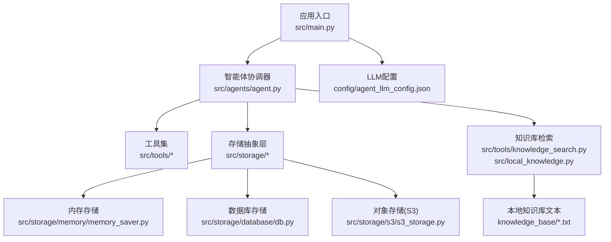
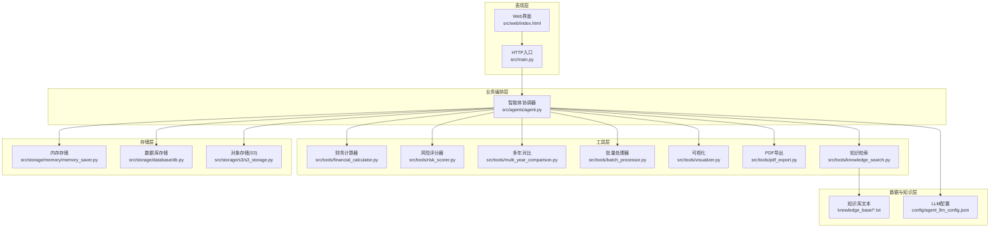
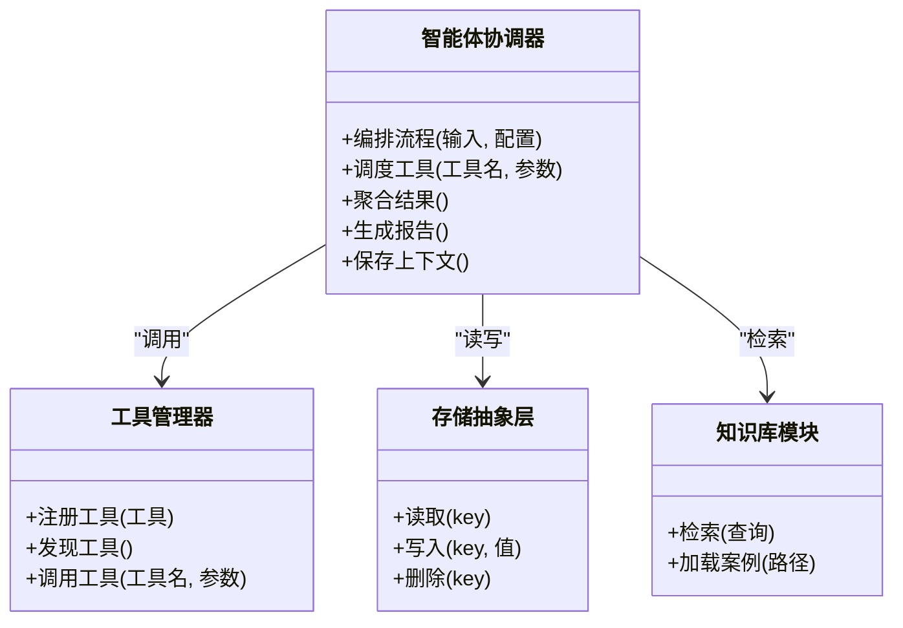
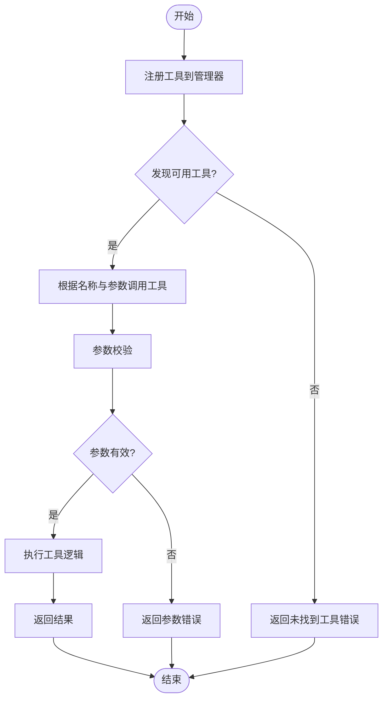
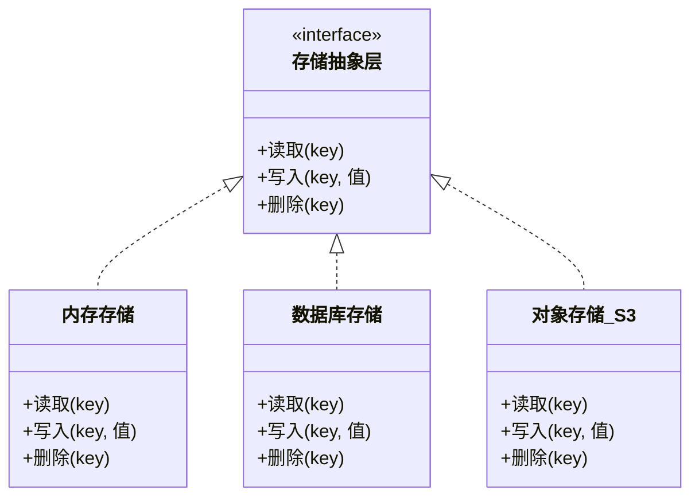
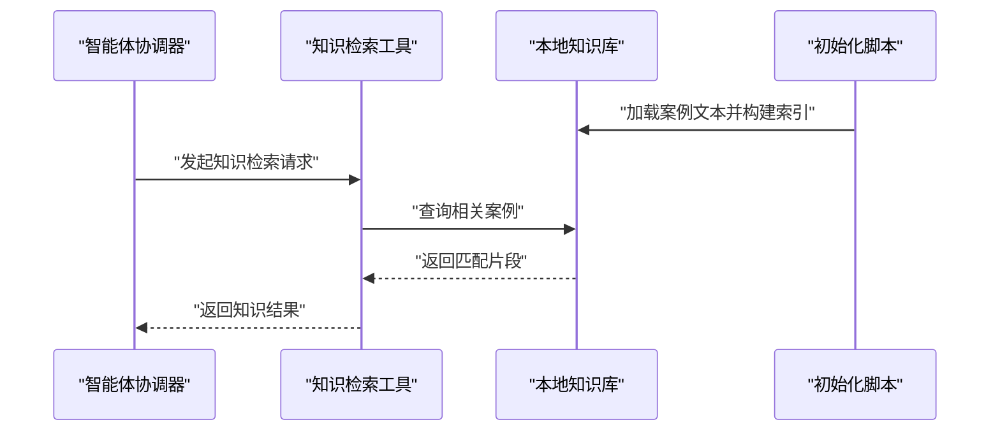
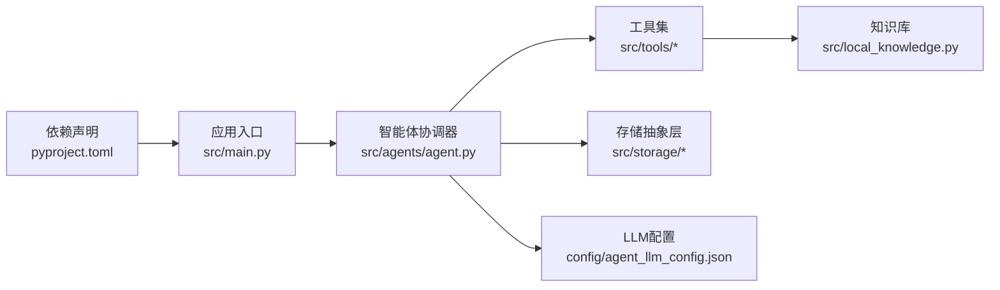

# 架构设计

<cite>
**本文引用的文件**   
- [src/main.py](file://src/main.py)
- [src/agents/agent.py](file://src/agents/agent.py)
- [src/storage/database/db.py](file://src/storage/database/db.py)
- [src/storage/memory/memory_saver.py](file://src/storage/memory/memory_saver.py)
- [src/storage/s3/s3_storage.py](file://src/storage/s3/s3_storage.py)
- [src/tools/knowledge_search.py](file://src/tools/knowledge_search.py)
- [src/tools/risk_scorer.py](file://src/tools/risk_scorer.py)
- [src/tools/multi_year_comparison.py](file://src/tools/multi_year_comparison.py)
- [src/tools/batch_processor.py](file://src/tools/batch_processor.py)
- [src/tools/pdf_export.py](file://src/tools/pdf_export.py)
- [src/tools/financial_calculator.py](file://src/tools/financial_calculator.py)
- [src/tools/visualizer.py](file://src/tools/visualizer.py)
- [src/local_knowledge.py](file://src/local_knowledge.py)
- [config/agent_llm_config.json](file://config/agent_llm_config.json)
- [knowledge_base/cases_ch9.txt](file://knowledge_base/cases_ch9.txt)
- [knowledge_base/cases_ch10.txt](file://knowledge_base/cases_ch10.txt)
- [knowledge_base/cases_ch11.txt](file://knowledge_base/cases_ch11.txt)
- [scripts/init_knowledge_base.py](file://scripts/init_knowledge_base.py)
- [pyproject.toml](file://pyproject.toml)
</cite>

## 目录
1. [引言](#引言)
2. [项目结构](#项目结构)
3. [核心组件](#核心组件)
4. [架构总览](#架构总览)
5. [详细组件分析](#详细组件分析)
6. [依赖分析](#依赖分析)
7. [性能考虑](#性能考虑)
8. [故障排查指南](#故障排查指南)
9. [结论](#结论)
10. [附录](#附录)

## 引言
本架构设计文档面向“智能审计风险识别系统”，从分层架构、插件化设计与微服务思想出发，系统化阐述系统的整体架构与关键组件职责。重点覆盖：
- 智能体协调器（Agent Coordinator）
- 工具管理系统（Tool Management System）
- 存储抽象层（Storage Abstraction Layer）
- 知识库模块（Knowledge Base Module）

同时说明技术选型决策、数据流与处理链路、系统边界与外部依赖、集成点与扩展点，并提供架构图与组件关系图，辅以性能、可扩展性与安全策略建议。

## 项目结构
仓库采用按功能域组织的目录结构，核心代码位于 src 下，配置与知识素材分别位于 config 与 knowledge_base，脚本与测试位于 scripts 与 tests。存储实现以多后端形式提供（内存、数据库、对象存储），工具以可插拔方式组织在 tools 目录。

图表来源
- [src/main.py](file://src/main.py)
- [src/agents/agent.py](file://src/agents/agent.py)
- [src/storage/memory/memory_saver.py](file://src/storage/memory/memory_saver.py)
- [src/storage/database/db.py](file://src/storage/database/db.py)
- [src/storage/s3/s3_storage.py](file://src/storage/s3/s3_storage.py)
- [src/tools/knowledge_search.py](file://src/tools/knowledge_search.py)
- [src/local_knowledge.py](file://src/local_knowledge.py)
- [config/agent_llm_config.json](file://config/agent_llm_config.json)

章节来源
- [src/main.py](file://src/main.py)
- [src/agents/agent.py](file://src/agents/agent.py)
- [src/storage/memory/memory_saver.py](file://src/storage/memory/memory_saver.py)
- [src/storage/database/db.py](file://src/storage/database/db.py)
- [src/storage/s3/s3_storage.py](file://src/storage/s3/s3_storage.py)
- [src/tools/knowledge_search.py](file://src/tools/knowledge_search.py)
- [src/local_knowledge.py](file://src/local_knowledge.py)
- [config/agent_llm_config.json](file://config/agent_llm_config.json)

## 核心组件
- 智能体协调器
  - 负责编排任务执行流程、调度工具调用、管理上下文状态、汇总结果并生成报告。
  - 通过统一接口与工具集交互，屏蔽具体工具实现差异。
- 工具管理系统
  - 将财务计算、风险评估、多年对比、批量处理、可视化、PDF导出等能力封装为独立工具。
  - 支持注册、发现、参数校验与错误隔离，便于扩展新工具。
- 存储抽象层
  - 提供统一的存储接口，内部适配内存、关系型数据库与对象存储（S3）。
  - 对外暴露一致的读写语义，对上层透明切换存储后端。
- 知识库模块
  - 基于本地文本案例库进行检索与匹配，辅助智能体进行风险判断与解释。
  - 提供初始化脚本与索引构建流程，确保检索效率与准确性。

章节来源
- [src/agents/agent.py](file://src/agents/agent.py)
- [src/tools/risk_scorer.py](file://src/tools/risk_scorer.py)
- [src/tools/multi_year_comparison.py](file://src/tools/multi_year_comparison.py)
- [src/tools/batch_processor.py](file://src/tools/batch_processor.py)
- [src/tools/pdf_export.py](file://src/tools/pdf_export.py)
- [src/tools/financial_calculator.py](file://src/tools/financial_calculator.py)
- [src/tools/visualizer.py](file://src/tools/visualizer.py)
- [src/storage/memory/memory_saver.py](file://src/storage/memory/memory_saver.py)
- [src/storage/database/db.py](file://src/storage/database/db.py)
- [src/storage/s3/s3_storage.py](file://src/storage/s3/s3_storage.py)
- [src/tools/knowledge_search.py](file://src/tools/knowledge_search.py)
- [src/local_knowledge.py](file://src/local_knowledge.py)
- [scripts/init_knowledge_base.py](file://scripts/init_knowledge_base.py)

## 架构总览
系统采用分层架构模式：
- 表现层：Web界面与HTTP入口（由入口脚本承载）
- 业务编排层：智能体协调器负责流程编排与决策
- 工具层：可插拔工具集合，提供领域能力
- 存储层：统一存储抽象，支持多种后端
- 数据与知识层：本地知识库与外部LLM配置

图表来源
- [src/main.py](file://src/main.py)
- [src/agents/agent.py](file://src/agents/agent.py)
- [src/tools/financial_calculator.py](file://src/tools/financial_calculator.py)
- [src/tools/risk_scorer.py](file://src/tools/risk_scorer.py)
- [src/tools/multi_year_comparison.py](file://src/tools/multi_year_comparison.py)
- [src/tools/batch_processor.py](file://src/tools/batch_processor.py)
- [src/tools/visualizer.py](file://src/tools/visualizer.py)
- [src/tools/pdf_export.py](file://src/tools/pdf_export.py)
- [src/tools/knowledge_search.py](file://src/tools/knowledge_search.py)
- [src/storage/memory/memory_saver.py](file://src/storage/memory/memory_saver.py)
- [src/storage/database/db.py](file://src/storage/database/db.py)
- [src/storage/s3/s3_storage.py](file://src/storage/s3/s3_storage.py)
- [config/agent_llm_config.json](file://config/agent_llm_config.json)
- [knowledge_base/cases_ch9.txt](file://knowledge_base/cases_ch9.txt)
- [knowledge_base/cases_ch10.txt](file://knowledge_base/cases_ch10.txt)
- [knowledge_base/cases_ch11.txt](file://knowledge_base/cases_ch11.txt)

## 详细组件分析

### 智能体协调器（Agent Coordinator）
- 职责
  - 解析输入数据与用户意图，制定执行计划
  - 调度工具链完成指标计算、风险评分、对比分析与可视化
  - 聚合中间结果，驱动报告生成与导出
  - 维护会话上下文与持久化状态
- 交互关系
  - 与工具层通过统一接口调用，避免紧耦合
  - 与存储层读写中间态与最终产物
  - 与知识库模块协作，获取行业基准与历史案例参考
- 扩展点
  - 新增工具时仅需遵循工具契约并在协调器中注册
  - 可通过配置切换不同存储后端或知识库源

图表来源
- [src/agents/agent.py](file://src/agents/agent.py)
- [src/tools/knowledge_search.py](file://src/tools/knowledge_search.py)
- [src/local_knowledge.py](file://src/local_knowledge.py)
- [src/storage/memory/memory_saver.py](file://src/storage/memory/memory_saver.py)
- [src/storage/database/db.py](file://src/storage/database/db.py)
- [src/storage/s3/s3_storage.py](file://src/storage/s3/s3_storage.py)

章节来源
- [src/agents/agent.py](file://src/agents/agent.py)

### 工具管理系统（Tool Management System）
- 职责
  - 提供财务计算、风险评分、多年对比、批量处理、可视化与PDF导出等能力
  - 保证工具间解耦，支持独立测试与替换
- 典型工具
  - 财务计算器：指标计算与比率分析
  - 风险评分器：基于规则与模型的风险打分
  - 多年对比：跨年度趋势与异常检测
  - 批量处理器：并发与批处理优化
  - 可视化：图表生成与渲染
  - PDF导出：报告打包与输出
- 扩展机制
  - 新增工具需实现标准接口，并在工具注册表中登记
  - 参数校验与错误隔离，保障整体稳定性

图表来源
- [src/tools/financial_calculator.py](file://src/tools/financial_calculator.py)
- [src/tools/risk_scorer.py](file://src/tools/risk_scorer.py)
- [src/tools/multi_year_comparison.py](file://src/tools/multi_year_comparison.py)
- [src/tools/batch_processor.py](file://src/tools/batch_processor.py)
- [src/tools/visualizer.py](file://src/tools/visualizer.py)
- [src/tools/pdf_export.py](file://src/tools/pdf_export.py)

章节来源
- [src/tools/financial_calculator.py](file://src/tools/financial_calculator.py)
- [src/tools/risk_scorer.py](file://src/tools/risk_scorer.py)
- [src/tools/multi_year_comparison.py](file://src/tools/multi_year_comparison.py)
- [src/tools/batch_processor.py](file://src/tools/batch_processor.py)
- [src/tools/visualizer.py](file://src/tools/visualizer.py)
- [src/tools/pdf_export.py](file://src/tools/pdf_export.py)

### 存储抽象层（Storage Abstraction Layer）
- 职责
  - 定义统一的键值读写接口
  - 内部适配内存、数据库与对象存储三种后端
  - 提供事务性操作与一致性保障（视后端能力）
- 后端实现
  - 内存存储：轻量级、适合开发与临时缓存
  - 数据库存储：结构化持久化，适合复杂查询与审计追踪
  - 对象存储（S3）：大文件与报表归档，高可用与弹性扩展
- 选择依据
  - 开发阶段使用内存存储快速验证
  - 生产环境按需切换到数据库或S3，满足合规与容量需求

图表来源
- [src/storage/memory/memory_saver.py](file://src/storage/memory/memory_saver.py)
- [src/storage/database/db.py](file://src/storage/database/db.py)
- [src/storage/s3/s3_storage.py](file://src/storage/s3/s3_storage.py)

章节来源
- [src/storage/memory/memory_saver.py](file://src/storage/memory/memory_saver.py)
- [src/storage/database/db.py](file://src/storage/database/db.py)
- [src/storage/s3/s3_storage.py](file://src/storage/s3/s3_storage.py)

### 知识库模块（Knowledge Base Module）
- 职责
  - 加载本地案例文本，构建检索索引
  - 根据查询条件返回相关案例片段与摘要
  - 支持增量更新与版本化管理
- 数据来源
  - 本地文本文件：cases_ch9.txt、cases_ch10.txt、cases_ch11.txt
  - 初始化脚本：init_knowledge_base.py用于构建索引与元数据
- 集成方式
  - 工具层通过知识检索工具访问知识库
  - 智能体协调器在决策过程中引用知识库结果作为依据

图表来源
- [src/tools/knowledge_search.py](file://src/tools/knowledge_search.py)
- [src/local_knowledge.py](file://src/local_knowledge.py)
- [scripts/init_knowledge_base.py](file://scripts/init_knowledge_base.py)
- [knowledge_base/cases_ch9.txt](file://knowledge_base/cases_ch9.txt)
- [knowledge_base/cases_ch10.txt](file://knowledge_base/cases_ch10.txt)
- [knowledge_base/cases_ch11.txt](file://knowledge_base/cases_ch11.txt)

章节来源
- [src/tools/knowledge_search.py](file://src/tools/knowledge_search.py)
- [src/local_knowledge.py](file://src/local_knowledge.py)
- [scripts/init_knowledge_base.py](file://scripts/init_knowledge_base.py)
- [knowledge_base/cases_ch9.txt](file://knowledge_base/cases_ch9.txt)
- [knowledge_base/cases_ch10.txt](file://knowledge_base/cases_ch10.txt)
- [knowledge_base/cases_ch11.txt](file://knowledge_base/cases_ch11.txt)

## 依赖分析
- 外部依赖
  - Python包管理与依赖声明位于 pyproject.toml
  - LLM配置通过 JSON 文件注入，便于环境与租户隔离
- 内部依赖
  - 智能体协调器依赖工具集与存储抽象层
  - 工具之间尽量保持无状态与低耦合
  - 知识库模块与本地文本文件紧密关联

图表来源
- [pyproject.toml](file://pyproject.toml)
- [src/main.py](file://src/main.py)
- [src/agents/agent.py](file://src/agents/agent.py)
- [src/tools/knowledge_search.py](file://src/tools/knowledge_search.py)
- [src/local_knowledge.py](file://src/local_knowledge.py)
- [config/agent_llm_config.json](file://config/agent_llm_config.json)

章节来源
- [pyproject.toml](file://pyproject.toml)
- [config/agent_llm_config.json](file://config/agent_llm_config.json)

## 性能考虑
- 批处理与并发
  - 批量处理器应支持分片与并行执行，减少端到端延迟
- 缓存与索引
  - 对高频查询的知识片段建立缓存；知识库索引预热提升检索速度
- 存储后端选择
  - 热点数据使用内存存储；冷数据归档至对象存储；结构化查询走数据库
- 资源限制
  - 设置合理的超时、重试与熔断策略，防止雪崩效应
- 报告生成
  - 可视化与PDF导出异步化，避免阻塞主流程

[本节为通用性能指导，不直接分析具体文件]

## 故障排查指南
- 常见问题定位
  - 工具调用失败：检查工具注册表与参数校验日志
  - 存储读写异常：确认后端连接与权限，查看错误码与堆栈
  - 知识库检索为空：验证索引是否构建成功，检查查询关键词与权重
- 诊断手段
  - 启用详细日志与追踪ID，串联一次请求的完整链路
  - 针对关键路径增加健康检查与告警阈值
- 恢复策略
  - 自动重试与降级：当某工具不可用时回退到默认策略
  - 数据一致性：存储层提供幂等写入与冲突解决

章节来源
- [src/tools/batch_processor.py](file://src/tools/batch_processor.py)
- [src/storage/memory/memory_saver.py](file://src/storage/memory/memory_saver.py)
- [src/storage/database/db.py](file://src/storage/database/db.py)
- [src/storage/s3/s3_storage.py](file://src/storage/s3/s3_storage.py)
- [src/tools/knowledge_search.py](file://src/tools/knowledge_search.py)

## 结论
本架构通过分层与插件化设计，实现了智能体协调器、工具管理系统、存储抽象层与知识库模块的清晰解耦与高效协作。借助统一存储接口与可插拔工具集，系统在可扩展性、可维护性与安全性方面具备良好基础。结合批处理、缓存与异步导出等优化策略，可在保证质量的同时提升性能与用户体验。

[本节为总结性内容，不直接分析具体文件]

## 附录
- 数据流与处理链路（从输入到报告）
  - 输入数据进入应用入口
  - 智能体协调器解析并制定执行计划
  - 依次调用财务计算、风险评分、多年对比等工具
  - 中间结果写入存储层，必要时检索知识库增强决策
  - 生成可视化图表与PDF报告，持久化归档
- 系统边界与外部依赖
  - 外部LLM服务通过配置文件注入，支持多租户与环境隔离
  - 对象存储（S3）用于报表与附件归档
  - 本地知识库作为权威参考源，支持增量更新
- 安全策略
  - 敏感配置（如LLM密钥）通过环境变量或配置中心管理
  - 存储层访问控制与最小权限原则
  - 输入校验与输出清洗，防范注入与越权

章节来源
- [src/main.py](file://src/main.py)
- [src/agents/agent.py](file://src/agents/agent.py)
- [src/tools/risk_scorer.py](file://src/tools/risk_scorer.py)
- [src/tools/multi_year_comparison.py](file://src/tools/multi_year_comparison.py)
- [src/tools/visualizer.py](file://src/tools/visualizer.py)
- [src/tools/pdf_export.py](file://src/tools/pdf_export.py)
- [src/storage/s3/s3_storage.py](file://src/storage/s3/s3_storage.py)
- [config/agent_llm_config.json](file://config/agent_llm_config.json)