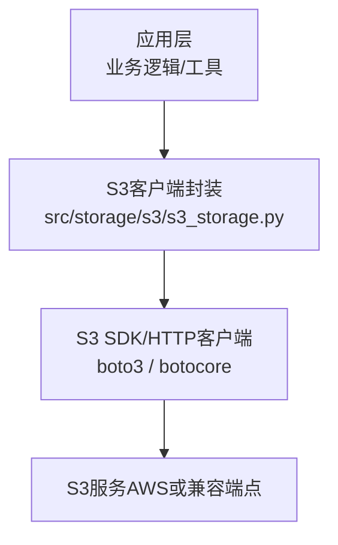
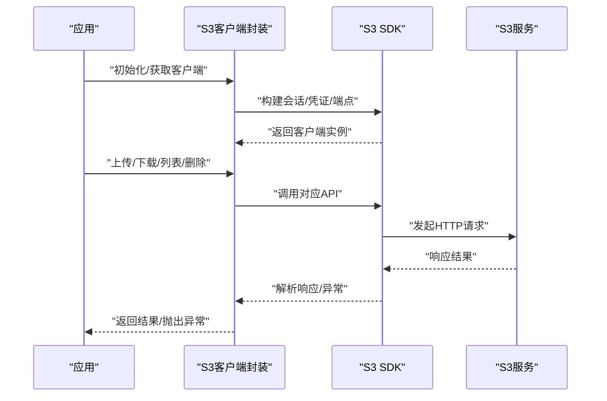
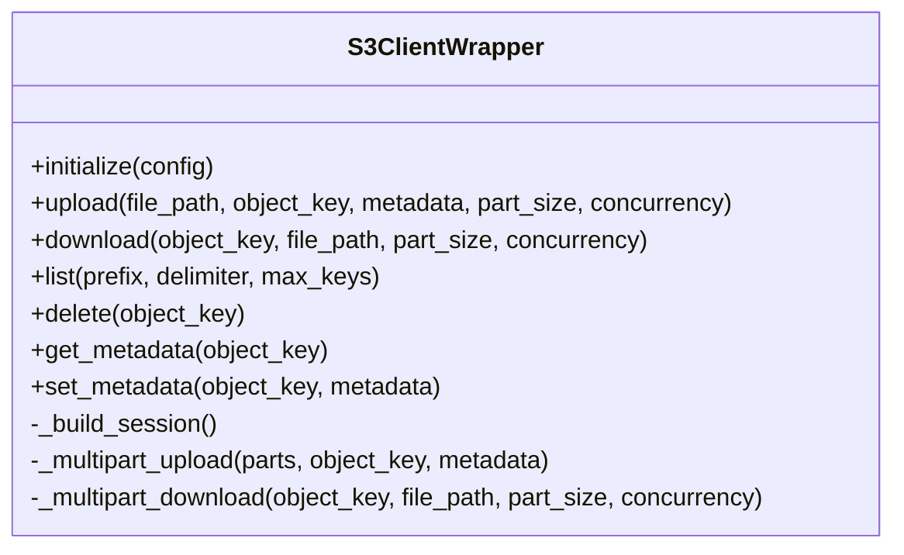
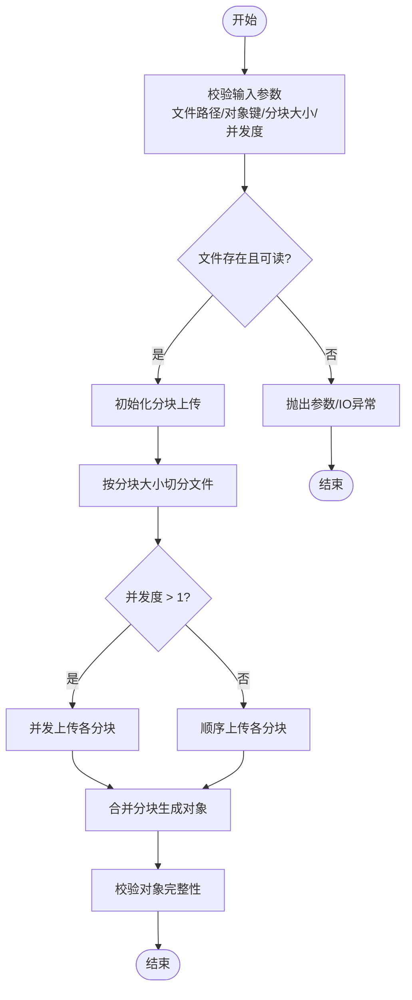
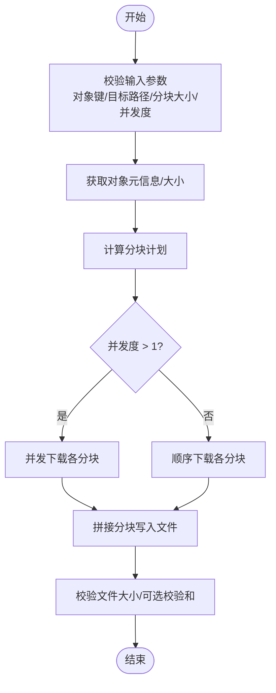
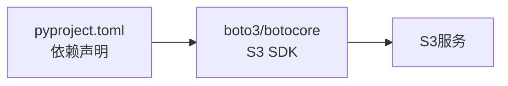

# S3对象存储

<cite>
**本文引用的文件**   
- [src/storage/s3/s3_storage.py](file://src/storage/s3/s3_storage.py)
- [pyproject.toml](file://pyproject.toml)
</cite>

## 目录
1. [简介](#简介)
2. [项目结构](#项目结构)
3. [核心组件](#核心组件)
4. [架构总览](#架构总览)
5. [详细组件分析](#详细组件分析)
6. [依赖分析](#依赖分析)
7. [性能考虑](#性能考虑)
8. [故障排查指南](#故障排查指南)
9. [结论](#结论)
10. [附录](#附录)

## 简介
本章节面向S3对象存储模块，聚焦于AWS S3兼容存储的集成方式、认证授权与权限管理、文件上传下载、分块传输与断点续传、并发控制、版本控制、生命周期管理与存储桶策略配置、缓存与CDN集成、安全最佳实践、加密配置与访问日志记录，并提供API调用示例与错误处理方案。文档以仓库中实际实现的S3客户端封装为核心，结合通用S3能力进行系统化说明。

## 项目结构
S3对象存储相关代码位于src/storage/s3目录下，提供统一的S3客户端封装；依赖声明位于项目根目录的pyproject.toml中。

图表来源
- [src/storage/s3/s3_storage.py](file://src/storage/s3/s3_storage.py)
- [pyproject.toml](file://pyproject.toml)

章节来源
- [src/storage/s3/s3_storage.py](file://src/storage/s3/s3_storage.py)
- [pyproject.toml](file://pyproject.toml)

## 核心组件
- S3客户端封装：统一封装S3连接、认证、上传、下载、列表、删除等常用操作，屏蔽底层SDK差异，便于在应用中复用。
- 配置与认证：通过环境变量或配置文件注入Endpoint、Access Key、Secret Key、Region、Bucket等参数，支持自定义S3兼容端点。
- 并发与分块：基于SDK的分块上传/下载能力，结合线程池或进程池实现并发控制，提升吞吐并降低大文件传输失败风险。
- 可靠性与重试：利用SDK的重试机制与幂等性设计，配合指数退避与超时控制，提高网络抖动下的稳定性。
- 可观测性与审计：对接访问日志与指标埋点，便于追踪请求耗时、失败率与资源用量。

章节来源
- [src/storage/s3/s3_storage.py](file://src/storage/s3/s3_storage.py)

## 架构总览
下图展示从应用到S3服务的整体交互路径，包括认证、数据面与控制面的关键步骤。

图表来源
- [src/storage/s3/s3_storage.py](file://src/storage/s3/s3_storage.py)

## 详细组件分析

### S3客户端封装类与方法
该组件对外暴露一致的接口，内部委托给S3 SDK完成具体操作。典型职责包括：
- 连接与会话管理：根据配置创建会话和客户端，支持自定义Endpoint与Region。
- 认证与鉴权：读取凭证并注入到SDK，支持IAM角色、临时凭证、静态密钥等多种方式。
- 对象操作：上传、下载、覆盖、删除、列出、元数据读写。
- 分块与并发：对大对象启用分块上传/下载，并通过并发控制提升吞吐。
- 重试与容错：统一捕获并转换异常，提供重试与回退策略。

图表来源
- [src/storage/s3/s3_storage.py](file://src/storage/s3/s3_storage.py)

章节来源
- [src/storage/s3/s3_storage.py](file://src/storage/s3/s3_storage.py)

### 上传流程（含分块与并发）
上传流程采用分块并行策略，将大对象切分为多个Part并发上传，最后合并为完整对象。

图表来源
- [src/storage/s3/s3_storage.py](file://src/storage/s3/s3_storage.py)

章节来源
- [src/storage/s3/s3_storage.py](file://src/storage/s3/s3_storage.py)

### 下载流程（含分块与并发）
下载流程支持分块并发拉取，适合大对象快速落盘。

图表来源
- [src/storage/s3/s3_storage.py](file://src/storage/s3/s3_storage.py)

章节来源
- [src/storage/s3/s3_storage.py](file://src/storage/s3/s3_storage.py)

### 断点续传机制
- 上传断点续传：记录已上传分块的ETag与序号，失败后仅重传缺失分块，避免重复传输。
- 下载断点续传：记录本地已写入字节范围，失败后仅补传缺失范围。
- 一致性保障：合并前校验分块数量与大小，确保最终对象完整性。

章节来源
- [src/storage/s3/s3_storage.py](file://src/storage/s3/s3_storage.py)

### 并发控制与背压
- 并发度上限：通过信号量或线程池限制同时进行的分块数，防止内存与带宽拥塞。
- 速率限制：可按需引入令牌桶或滑动窗口限流，保护下游S3服务。
- 自适应调整：根据错误率与延迟动态调整并发度与分块大小。

章节来源
- [src/storage/s3/s3_storage.py](file://src/storage/s3/s3_storage.py)

### 版本控制与生命周期管理
- 版本控制：开启后每次覆盖/删除会生成新版本，可通过对象键+版本ID精确访问与恢复。
- 生命周期规则：基于前缀/后缀/标签设置过期、归档、冷归档与删除策略，降低成本。
- 策略建议：对热数据保留短期历史，对冷数据自动转低频/归档存储。

章节来源
- [src/storage/s3/s3_storage.py](file://src/storage/s3/s3_storage.py)

### 存储桶策略与权限最小化
- 原则：最小权限、按需授予、分离读写、定期审计。
- 常见策略：只读公开、私有读写、跨账号跨域访问、条件约束（IP/时间/标签）。
- 安全加固：强制HTTPS、禁止匿名访问、限制最大对象大小、启用MFA删除（高敏感场景）。

章节来源
- [src/storage/s3/s3_storage.py](file://src/storage/s3/s3_storage.py)

### 缓存策略与CDN集成
- 客户端缓存：合理设置Cache-Control与ETag，减少重复请求。
- CDN加速：将热点对象前置至边缘节点，缩短时延并降低源站压力。
- 缓存失效：使用版本号或哈希作为文件名后缀，实现精准失效。

章节来源
- [src/storage/s3/s3_storage.py](file://src/storage/s3/s3_storage.py)

### 安全最佳实践与加密
- 传输加密：强制TLS，禁用不安全协议。
- 静态加密：服务端KMS托管密钥或SSE-S3/SSE-KMS，避免明文落盘。
- 凭证管理：使用IAM角色/临时凭证，避免硬编码密钥；定期轮换。
- 审计与合规：开启访问日志、操作审计与告警，满足合规要求。

章节来源
- [src/storage/s3/s3_storage.py](file://src/storage/s3/s3_storage.py)

### 访问日志与可观测性
- 访问日志：记录请求者、时间、操作、状态码、耗时、对象键等，用于排障与计费分析。
- 指标埋点：上报QPS、P99延迟、错误率、吞吐、重试次数等。
- 链路追踪：为关键操作注入TraceID，关联上下游日志。

章节来源
- [src/storage/s3/s3_storage.py](file://src/storage/s3/s3_storage.py)

### API调用示例与错误处理
- 上传示例：指定文件路径、对象键、分块大小与并发度，返回对象元信息与版本ID（若开启版本控制）。
- 下载示例：指定对象键与目标路径，支持断点续传与并发下载。
- 列表示例：按前缀/分隔符/最大条目数列举对象，便于分页遍历。
- 删除示例：支持普通删除与版本化删除（指定版本ID）。
- 错误处理：统一捕获网络/权限/对象不存在/冲突等异常，转换为领域异常并附带上下文；对可重试错误实施指数退避与最大重试次数限制。

章节来源
- [src/storage/s3/s3_storage.py](file://src/storage/s3/s3_storage.py)

## 依赖分析
S3客户端封装依赖S3 SDK与HTTP栈，由包管理器声明。

图表来源
- [pyproject.toml](file://pyproject.toml)
- [src/storage/s3/s3_storage.py](file://src/storage/s3/s3_storage.py)

章节来源
- [pyproject.toml](file://pyproject.toml)
- [src/storage/s3/s3_storage.py](file://src/storage/s3/s3_storage.py)

## 性能考虑
- 分块大小调优：根据对象大小与网络状况选择合适分块大小，平衡吞吐与开销。
- 并发度调优：依据CPU核数、内存与S3配额限制设置并发上限。
- 连接复用：复用HTTP连接与会话，减少握手开销。
- 压缩与序列化：对文本/日志类对象启用压缩，减少带宽占用。
- 预取与流水线：下载侧采用预取与流水线写入，提升磁盘I/O利用率。
- 监控与自适应：基于延迟与错误率动态调整分块大小与并发度。

## 故障排查指南
- 连接与认证问题：检查Endpoint、Region、Access Key/Secret Key、IAM权限与网络连通性。
- 权限不足：核对存储桶策略与IAM策略是否允许所需操作。
- 对象不存在/冲突：确认对象键、版本ID与并发写入冲突处理策略。
- 超时与重试：调整超时阈值与重试次数，观察错误类型是否为瞬态。
- 大对象失败：降低并发度或增大分块大小，启用断点续传。
- 日志定位：查看访问日志与SDK调试日志，结合TraceID定位问题。

章节来源
- [src/storage/s3/s3_storage.py](file://src/storage/s3/s3_storage.py)

## 结论
本模块以S3客户端封装为核心，提供稳定高效的对象存取能力，涵盖分块传输、断点续传、并发控制、版本控制、生命周期与策略配置、缓存与CDN、安全与审计等关键能力。通过合理的参数调优与监控告警，可在不同规模与场景下获得良好的性能与可靠性。

## 附录
- 术语
  - 对象：存储在S3中的基本数据单元。
  - 存储桶：对象的容器。
  - 分块：大对象拆分的子单元，用于并行传输与断点续传。
  - ETag：对象或分块的标识，常用于校验与缓存。
- 参考
  - S3兼容端点接入：通过自定义Endpoint实现多云或多区域部署。
  - 版本控制与生命周期：结合业务需求制定保留与归档策略。
  - 安全与合规：遵循最小权限与加密默认原则。