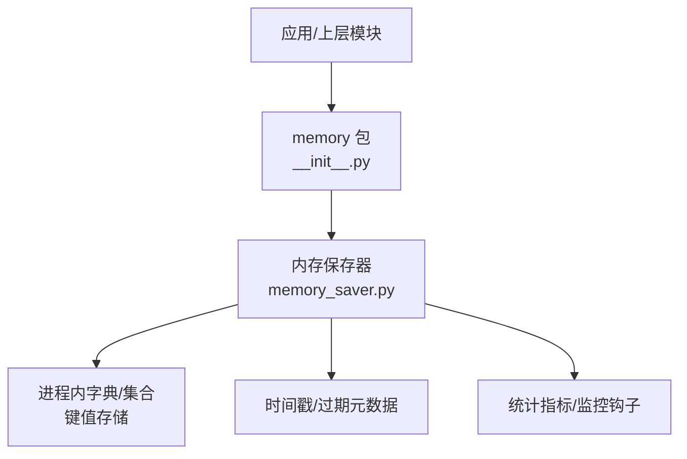
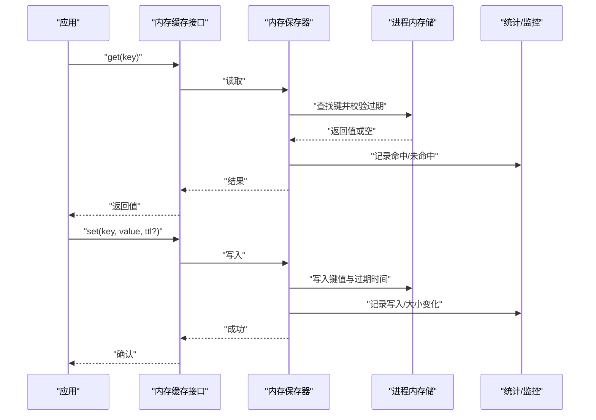
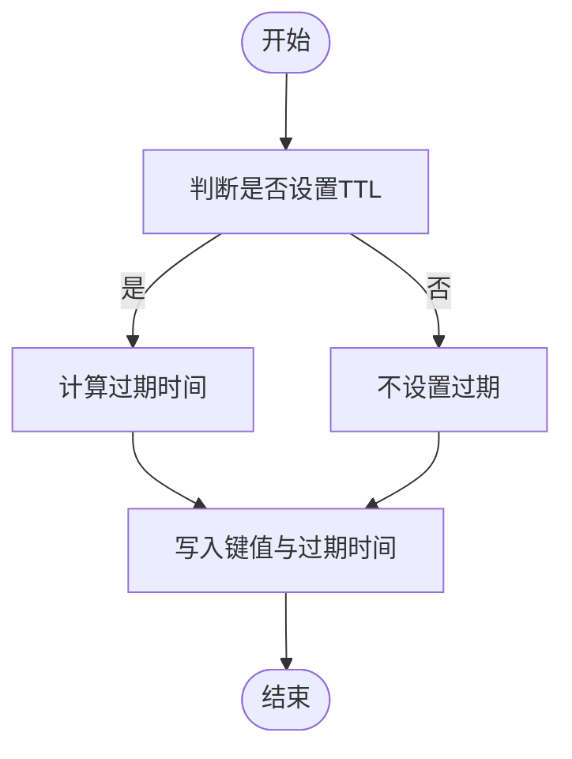
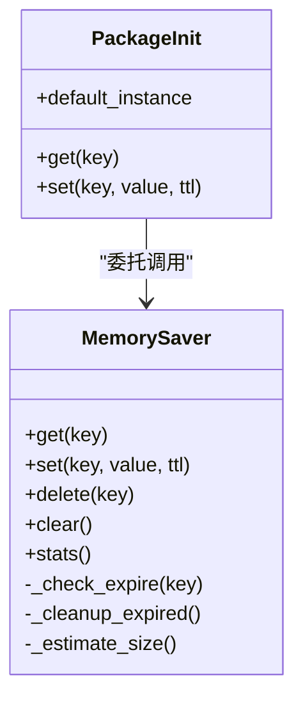

# 内存缓存

<cite>
**本文引用的文件**   
- [src/storage/memory/__init__.py](file://src/storage/memory/__init__.py)
- [src/storage/memory/memory_saver.py](file://src/storage/memory/memory_saver.py)
</cite>

## 目录
1. [简介](#简介)
2. [项目结构](#项目结构)
3. [核心组件](#核心组件)
4. [架构总览](#架构总览)
5. [详细组件分析](#详细组件分析)
6. [依赖关系分析](#依赖关系分析)
7. [性能考虑](#性能考虑)
8. [故障排查指南](#故障排查指南)
9. [结论](#结论)
10. [附录](#附录)

## 简介
本章节面向“内存缓存模块”，聚焦于进程内键值存储、会话管理、临时数据与状态保持，以及容量限制、过期机制、监控与清理策略。文档从数据结构选择、序列化格式、压缩与优化、预热与失效通知、一致性保证等维度展开，并提供使用场景示例与调优建议，帮助读者在有限内存下获得稳定、可预测的缓存性能。

## 项目结构
内存缓存相关代码位于 storage/memory 目录下，包含初始化入口与核心实现：
- __init__.py：对外暴露的包级接口（如默认实例、常用方法）
- memory_saver.py：内存存储的核心实现（读写、过期、统计、清理等）

图表来源
- [src/storage/memory/__init__.py](file://src/storage/memory/__init__.py)
- [src/storage/memory/memory_saver.py](file://src/storage/memory/memory_saver.py)

章节来源
- [src/storage/memory/__init__.py](file://src/storage/memory/__init__.py)
- [src/storage/memory/memory_saver.py](file://src/storage/memory/memory_saver.py)

## 核心组件
- 内存保存器（MemorySaver）
  - 职责：提供 get/set/delete/clear 等基础操作；维护过期时间与 TTL；可选容量上限与自动清理；提供统计信息（命中/未命中、大小估算）。
  - 关键特性：线程安全访问、惰性过期检查、批量清理、可扩展的序列化/压缩策略。
- 包级接口（__init__.py）
  - 职责：导出默认实例或便捷函数，便于上层快速接入。

章节来源
- [src/storage/memory/memory_saver.py](file://src/storage/memory/memory_saver.py)
- [src/storage/memory/__init__.py](file://src/storage/memory/__init__.py)

## 架构总览
内存缓存作为进程内中间层，屏蔽底层数据结构细节，向上提供统一 API。典型调用路径如下：

图表来源
- [src/storage/memory/memory_saver.py](file://src/storage/memory/memory_saver.py)
- [src/storage/memory/__init__.py](file://src/storage/memory/__init__.py)

## 详细组件分析

### 数据结构与存储模型
- 主存储
  - 采用进程内字典映射 key -> value，确保 O(1) 平均读写复杂度。
  - 为支持过期，额外维护一个独立的过期索引（key -> expire_time），或在主存储中附带元数据。
- 过期与 TTL
  - 写入时可指定 TTL（秒）或绝对过期时间；读取时进行惰性过期检查，若已过期则删除并返回空。
  - 后台定时任务或阈值触发时执行批量清理，避免频繁扫描。
- 容量限制
  - 支持最大条目数或近似内存占用上限；超过阈值时触发淘汰策略（如 LRU/LFU 或随机淘汰）。
- 线程安全
  - 通过锁或并发安全的容器保障多线程环境下的读写一致性与可见性。

章节来源
- [src/storage/memory/memory_saver.py](file://src/storage/memory/memory_saver.py)

### 缓存策略与过期机制
- 写入策略
  - set(key, value, ttl=None)：根据 TTL 计算过期时间并落盘到内存索引。
  - 支持覆盖写与幂等更新。
- 读取策略
  - get(key)：先查主存储，再校验过期；命中则返回，否则未命中。
- 删除策略
  - delete(key)：同时移除主存储与过期索引。
  - clear()：清空所有条目并重置统计。
- 过期检查
  - 惰性检查：读时检查当前键是否过期。
  - 主动清理：周期性或按写入次数阈值触发，扫描过期索引并批量删除。

图表来源
- [src/storage/memory/memory_saver.py](file://src/storage/memory/memory_saver.py)

章节来源
- [src/storage/memory/memory_saver.py](file://src/storage/memory/memory_saver.py)

### 会话管理与状态保持
- 会话标识
  - 以 session_id 作为 key 前缀或独立命名空间，隔离不同会话的数据。
- 状态保持
  - 将用户上下文、请求链路状态、临时工作区等以结构化对象形式存入内存，配合短 TTL 控制生命周期。
- 生命周期
  - 会话创建时分配 ID 并写入初始状态；会话结束时显式清理或等待 TTL 到期自动回收。

章节来源
- [src/storage/memory/memory_saver.py](file://src/storage/memory/memory_saver.py)

### 临时数据存储
- 适用场景
  - 批处理中间结果、计算中间态、UI 渲染缓存、工具链临时文件指针等。
- 设计要点
  - 小体积、短生命周期；优先使用紧凑序列化格式；必要时启用压缩以降低内存占用。

章节来源
- [src/storage/memory/memory_saver.py](file://src/storage/memory/memory_saver.py)

### 监控与统计
- 指标项
  - 命中率、未命中率、读写延迟分布、内存占用估算、条目数量、过期条目数量。
- 采集方式
  - 在 get/set/delete/clear 等关键路径埋点；定期汇总输出或通过回调上报。
- 告警与限流
  - 当内存占用接近上限或命中率异常下降时触发告警或降级策略。

章节来源
- [src/storage/memory/memory_saver.py](file://src/storage/memory/memory_saver.py)

### 序列化、压缩与性能优化
- 序列化格式
  - 默认使用高效二进制或轻量 JSON；对大对象可选择 msgpack/protobuf 等格式。
- 压缩策略
  - 对大值启用压缩（如 gzip/zstd），权衡 CPU 与内存占用；对小对象禁用压缩以减少开销。
- 性能优化
  - 减少锁粒度（读写分离或分段锁）；批量操作合并；惰性过期与批量清理；热点键本地副本（谨慎使用）。

章节来源
- [src/storage/memory/memory_saver.py](file://src/storage/memory/memory_saver.py)

### 预热、失效通知与一致性
- 预热
  - 启动阶段预加载热点键；支持分批加载与回退策略，避免阻塞启动。
- 失效通知
  - 提供事件回调或观察者模式，在键被删除/过期时通知上层做联动清理。
- 一致性
  - 单进程内强一致；跨进程需借助外部存储或消息总线同步；注意并发写入冲突与幂等更新。

章节来源
- [src/storage/memory/memory_saver.py](file://src/storage/memory/memory_saver.py)

### 使用场景示例
- 会话上下文缓存
  - 为每个会话分配短 TTL 的上下文对象，提升后续请求处理速度。
- 计算中间结果缓存
  - 批处理任务中将中间结果缓存，避免重复计算。
- UI 渲染缓存
  - 将页面片段或图表数据缓存，缩短首屏渲染时间。

章节来源
- [src/storage/memory/memory_saver.py](file://src/storage/memory/memory_saver.py)

### 配置与参数建议
- TTL 默认值
  - 为常见业务设定合理默认 TTL，避免长期驻留导致内存膨胀。
- 容量上限
  - 根据进程可用内存与峰值 QPS 估算最大条目数或字节上限。
- 清理频率
  - 平衡清理成本与过期残留，建议基于写入次数或时间窗口触发。

章节来源
- [src/storage/memory/memory_saver.py](file://src/storage/memory/memory_saver.py)

## 依赖关系分析
内存缓存模块内部依赖关系清晰，主要围绕保存器与包级接口展开：

图表来源
- [src/storage/memory/memory_saver.py](file://src/storage/memory/memory_saver.py)
- [src/storage/memory/__init__.py](file://src/storage/memory/__init__.py)

章节来源
- [src/storage/memory/memory_saver.py](file://src/storage/memory/memory_saver.py)
- [src/storage/memory/__init__.py](file://src/storage/memory/__init__.py)

## 性能考虑
- 时间复杂度
  - 读写均为 O(1) 平均；过期检查为 O(1)；批量清理为 O(n) 但低频触发。
- 空间复杂度
  - 线性于条目数量；压缩可降低大对象内存占用。
- 锁竞争
  - 在高并发下关注锁粒度与锁升级；必要时引入分片降低热点。
- I/O 与序列化
  - 避免在热路径进行重型序列化/反序列化；对热点数据保留原始结构。
- 预热与缓存穿透
  - 预热热点键；对不存在键设置短 TTL 的空值占位，防止穿透放大。

[本节为通用指导，无需具体文件引用]

## 故障排查指南
- 症状：命中率持续偏低
  - 排查 TTL 是否过短；是否存在大量冷数据；是否缺少预热。
- 症状：内存占用持续增长
  - 检查容量上限与淘汰策略是否生效；确认清理任务是否正常触发。
- 症状：读写延迟抖动
  - 观察锁竞争与批量清理时机；评估序列化/压缩开销。
- 症状：会话状态丢失
  - 核对命名空间与 key 前缀；确认会话生命周期与清理逻辑。

章节来源
- [src/storage/memory/memory_saver.py](file://src/storage/memory/memory_saver.py)

## 结论
内存缓存模块以简洁的进程内存储为核心，结合过期与容量控制、统计监控与清理策略，能够在高吞吐场景下提供低延迟的读写能力。通过合理的序列化与压缩、预热与失效通知、以及一致的会话与状态管理，可在有限内存资源下达成稳定且可预期的性能表现。

[本节为总结性内容，无需具体文件引用]

## 附录
- 术语
  - TTL：生存时间（Time To Live）
  - 命中率：命中次数 / 总查询次数
  - 惰性过期：在读路径即时检查并删除过期键
  - 批量清理：周期性扫描并删除过期键
- 最佳实践
  - 为热点键设置较长 TTL，冷键设置较短 TTL
  - 为大对象启用压缩，小对象禁用压缩
  - 定期输出统计指标并建立告警阈值
  - 在启动阶段进行可控的预热，避免阻塞

[本节为补充说明，无需具体文件引用]