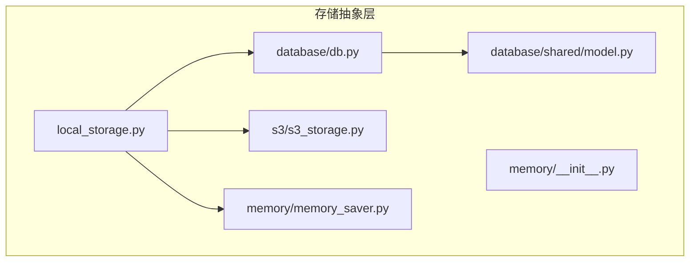
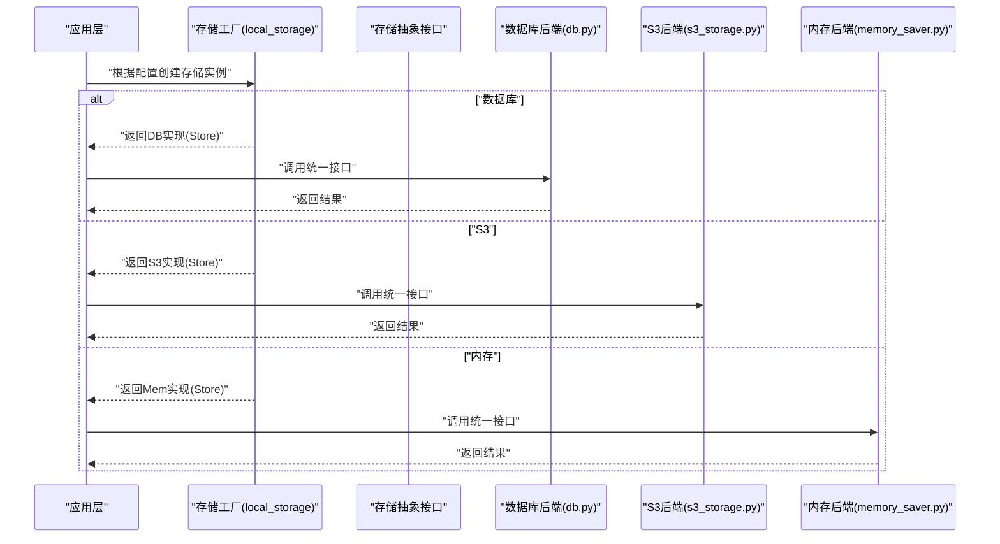
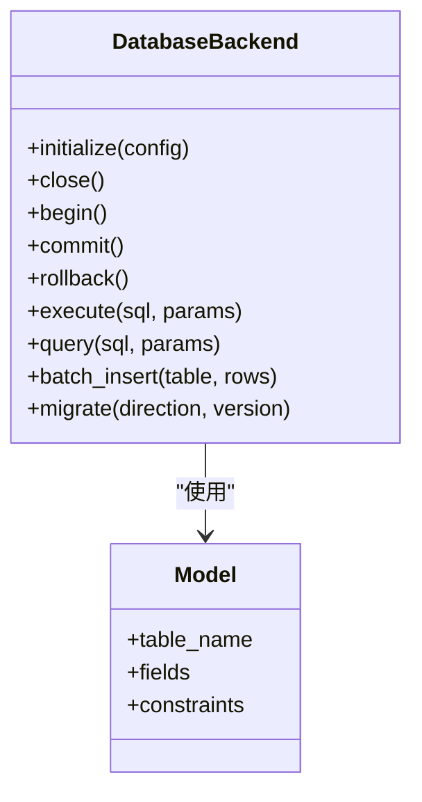
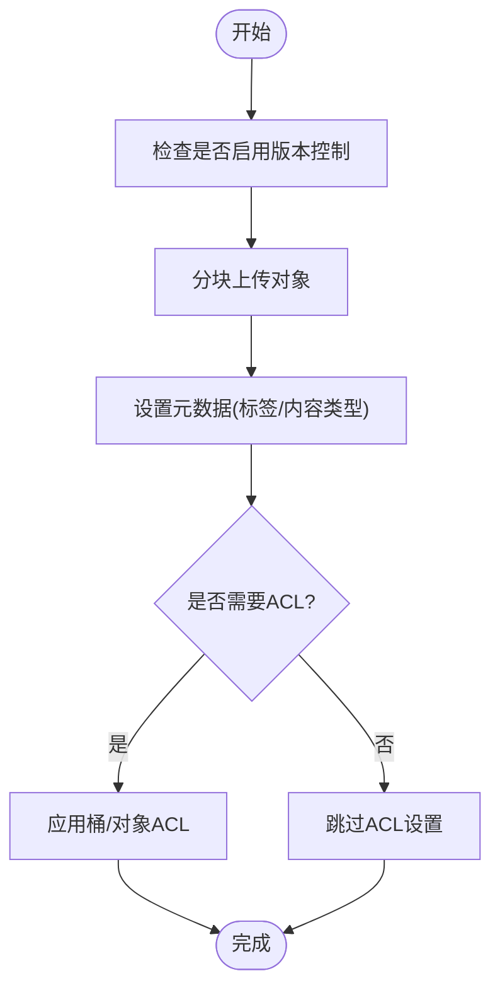
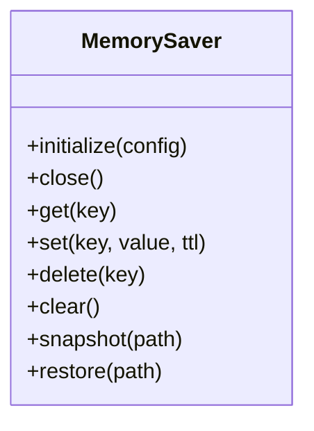
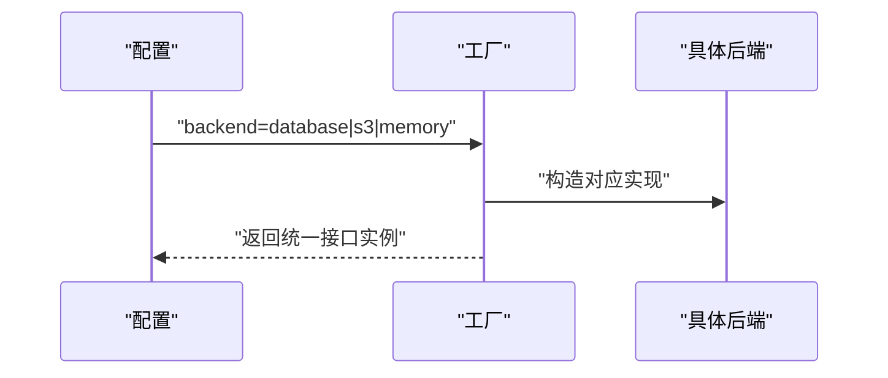
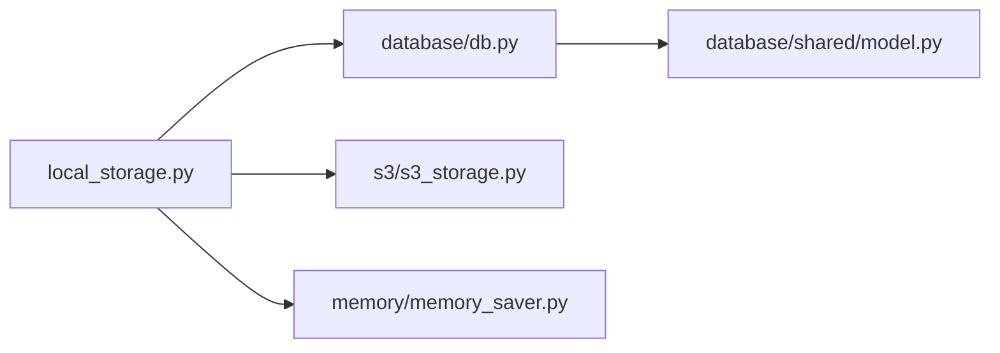

# 存储抽象层

<cite>
**本文引用的文件**   
- [src/storage/database/db.py](file://src/storage/database/db.py)
- [src/storage/database/shared/model.py](file://src/storage/database/shared/model.py)
- [src/storage/s3/s3_storage.py](file://src/storage/s3/s3_storage.py)
- [src/storage/memory/memory_saver.py](file://src/storage/memory/memory_saver.py)
- [src/storage/memory/__init__.py](file://src/storage/memory/__init__.py)
- [src/local_storage.py](file://src/local_storage.py)
</cite>

## 目录
1. [简介](#简介)
2. [项目结构](#项目结构)
3. [核心组件](#核心组件)
4. [架构总览](#架构总览)
5. [详细组件分析](#详细组件分析)
6. [依赖关系分析](#依赖关系分析)
7. [性能考量](#性能考量)
8. [故障排查指南](#故障排查指南)
9. [结论](#结论)
10. [附录](#附录)

## 简介
本章节面向智能审计风险识别系统的“存储抽象层”，目标是：
- 统一数据访问接口，屏蔽数据库、对象存储与内存缓存的差异
- 提供可插拔的后端实现（SQLite/PostgreSQL、S3、内存）
- 支持事务、版本兼容与迁移策略
- 给出配置切换方法与性能对比建议
- 提供使用示例与最佳实践

## 项目结构
存储抽象层位于 src/storage 下，按后端类型划分模块：
- database：数据库连接管理、模型定义与通用查询封装
- s3：对象存储客户端封装（上传、下载、权限等）
- memory：内存缓存与会话持久化能力
- local_storage.py：全局存储工厂与默认后端选择

图表来源
- [src/storage/database/db.py](file://src/storage/database/db.py)
- [src/storage/database/shared/model.py](file://src/storage/database/shared/model.py)
- [src/storage/s3/s3_storage.py](file://src/storage/s3/s3_storage.py)
- [src/storage/memory/memory_saver.py](file://src/storage/memory/memory_saver.py)
- [src/storage/memory/__init__.py](file://src/storage/memory/__init__.py)
- [src/local_storage.py](file://src/local_storage.py)

章节来源
- [src/storage/database/db.py](file://src/storage/database/db.py)
- [src/storage/database/shared/model.py](file://src/storage/database/shared/model.py)
- [src/storage/s3/s3_storage.py](file://src/storage/s3/s3_storage.py)
- [src/storage/memory/memory_saver.py](file://src/storage/memory/memory_saver.py)
- [src/storage/memory/__init__.py](file://src/storage/memory/__init__.py)
- [src/local_storage.py](file://src/local_storage.py)

## 核心组件
- 存储抽象接口（StorageAbstraction）
  - 目标：为上层业务提供统一的读写、事务、元数据与版本控制访问点
  - 典型方法族：初始化/关闭、键值存取、批量操作、事务边界、元数据/版本、清理与迁移钩子
- 后端实现
  - 数据库后端：SQLite/PostgreSQL 连接池、事务封装、SQL 构建与优化
  - S3 后端：分块上传、断点续传、版本控制、ACL/桶策略
  - 内存后端：进程内字典/队列、会话状态、轻量持久化（可选）
- 工厂模式
  - 通过配置选择具体后端实例，对外暴露统一入口
- 迁移与兼容性
  - 基于版本号与迁移脚本的增量升级机制，保证向后兼容

章节来源
- [src/storage/database/db.py](file://src/storage/database/db.py)
- [src/storage/s3/s3_storage.py](file://src/storage/s3/s3_storage.py)
- [src/storage/memory/memory_saver.py](file://src/storage/memory/memory_saver.py)
- [src/local_storage.py](file://src/local_storage.py)

## 架构总览
下图展示系统如何通过工厂获取统一存储实例，并在不同后端间透明切换。

图表来源
- [src/local_storage.py](file://src/local_storage.py)
- [src/storage/database/db.py](file://src/storage/database/db.py)
- [src/storage/s3/s3_storage.py](file://src/storage/s3/s3_storage.py)
- [src/storage/memory/memory_saver.py](file://src/storage/memory/memory_saver.py)

## 详细组件分析

### 存储抽象接口设计
- 设计理念
  - 单一职责：仅暴露稳定的数据访问契约，不关心底层细节
  - 幂等与一致性：对读多写少场景提供幂等语义；对写操作提供事务保障
  - 可扩展性：新增后端只需实现接口并注册到工厂
- 统一访问模式
  - 初始化/销毁：生命周期管理与资源释放
  - 键值/对象存取：get/set/delete/batch
  - 事务：begin/commit/rollback 或上下文管理器
  - 元数据/版本：metadata/get_version/set_version
  - 迁移：migrate/up/down 钩子
- 错误处理
  - 统一异常体系：网络超时、权限不足、数据不一致、迁移失败等
  - 重试与退避：针对网络与临时故障的自动重试策略

章节来源
- [src/storage/database/db.py](file://src/storage/database/db.py)
- [src/storage/s3/s3_storage.py](file://src/storage/s3/s3_storage.py)
- [src/storage/memory/memory_saver.py](file://src/storage/memory/memory_saver.py)

### 数据库存储后端（SQLite/PostgreSQL）
- 连接管理
  - SQLite：单进程文件型数据库，适合本地开发与测试
  - PostgreSQL：连接池、并发安全、高可用部署
- 事务处理
  - 显式事务边界：begin/commit/rollback
  - 上下文管理器：with 语句自动提交/回滚
- 查询优化
  - 索引策略：主键、外键、常用过滤字段
  - 分页与游标：避免一次性加载大数据集
  - 预编译与参数化：防注入与执行计划稳定
- 模型与迁移
  - 共享模型定义：schema 与约束集中管理
  - 迁移脚本：按版本号顺序执行，支持回滚

图表来源
- [src/storage/database/db.py](file://src/storage/database/db.py)
- [src/storage/database/shared/model.py](file://src/storage/database/shared/model.py)

章节来源
- [src/storage/database/db.py](file://src/storage/database/db.py)
- [src/storage/database/shared/model.py](file://src/storage/database/shared/model.py)

### S3 对象存储后端
- 文件上传下载
  - 分块上传与断点续传：大文件稳定性
  - 流式读取：降低内存占用
- 版本控制
  - 开启桶版本控制，保留历史对象快照
  - 指定版本读取与删除
- 权限管理
  - IAM 角色最小权限原则
  - 桶策略与 ACL 控制读写范围
- 一致性模型
  - 强一致写入后立即可读（取决于服务配置）
  - 事件通知与生命周期策略

图表来源
- [src/storage/s3/s3_storage.py](file://src/storage/s3/s3_storage.py)

章节来源
- [src/storage/s3/s3_storage.py](file://src/storage/s3/s3_storage.py)

### 内存缓存后端
- 数据结构
  - 进程内字典/队列，支持 TTL 过期与LRU淘汰（可选）
- 数据持久化
  - 定期快照到本地文件或轻量KV存储（可选）
- 会话管理
  - 会话ID映射、状态序列化、并发安全锁
- 适用场景
  - 热点数据缓存、短期任务中间态、单元测试快速路径

图表来源
- [src/storage/memory/memory_saver.py](file://src/storage/memory/memory_saver.py)
- [src/storage/memory/__init__.py](file://src/storage/memory/__init__.py)

章节来源
- [src/storage/memory/memory_saver.py](file://src/storage/memory/memory_saver.py)
- [src/storage/memory/__init__.py](file://src/storage/memory/__init__.py)

### 工厂模式与统一入口
- 工厂职责
  - 解析配置，选择并实例化具体后端
  - 注入公共参数（日志、指标、重试策略）
  - 提供默认后端与热切换能力
- 配置项
  - backend：数据库/s3/memory
  - 各后端专属参数（连接串、桶名、路径等）
- 使用方式
  - 通过工厂获取统一接口实例，上层无需感知后端差异

图表来源
- [src/local_storage.py](file://src/local_storage.py)

章节来源
- [src/local_storage.py](file://src/local_storage.py)

## 依赖关系分析
- 模块耦合
  - 工厂对三个后端弱耦合，通过接口解耦
  - 数据库后端依赖共享模型定义
- 外部依赖
  - 数据库驱动（SQLite/PostgreSQL）
  - S3 SDK（如 boto3）
  - 内存后端无外部依赖（可选持久化依赖文件系统）
- 潜在循环依赖
  - 当前分层清晰，未见循环导入

图表来源
- [src/local_storage.py](file://src/local_storage.py)
- [src/storage/database/db.py](file://src/storage/database/db.py)
- [src/storage/database/shared/model.py](file://src/storage/database/shared/model.py)
- [src/storage/s3/s3_storage.py](file://src/storage/s3/s3_storage.py)
- [src/storage/memory/memory_saver.py](file://src/storage/memory/memory_saver.py)

章节来源
- [src/local_storage.py](file://src/local_storage.py)
- [src/storage/database/db.py](file://src/storage/database/db.py)
- [src/storage/database/shared/model.py](file://src/storage/database/shared/model.py)
- [src/storage/s3/s3_storage.py](file://src/storage/s3/s3_storage.py)
- [src/storage/memory/memory_saver.py](file://src/storage/memory/memory_saver.py)

## 性能考量
- 数据库
  - 连接池大小与并发度调优
  - 批量写入合并事务，减少往返
  - 合理索引与覆盖索引，避免全表扫描
  - 分页与只读副本用于读多写少场景
- S3
  - 分块大小与并发数权衡
  - 压缩与编码格式选择（如 Parquet/CSV）
  - 就近区域与CDN加速
- 内存
  - TTL 与容量上限，防止内存泄漏
  - 序列化开销评估，必要时使用二进制格式
- 监控与度量
  - QPS、延迟分布、错误率、命中率、吞吐

[本节为通用指导，不涉及具体文件]

## 故障排查指南
- 常见问题
  - 连接失败：检查凭据、网络连通性与白名单
  - 权限不足：核对IAM/ACL与桶策略
  - 迁移失败：确认版本号与脚本顺序，查看回滚日志
  - 内存溢出：调整TTL与最大容量，检查未释放引用
- 定位手段
  - 开启详细日志与追踪ID
  - 导出慢查询与热点键
  - 压测回归验证

章节来源
- [src/storage/database/db.py](file://src/storage/database/db.py)
- [src/storage/s3/s3_storage.py](file://src/storage/s3/s3_storage.py)
- [src/storage/memory/memory_saver.py](file://src/storage/memory/memory_saver.py)

## 结论
通过统一的存储抽象与工厂模式，系统在保持接口稳定的前提下实现了多后端可插拔切换。结合合理的迁移策略与性能调优，可在开发、测试与生产环境灵活部署，满足审计风险识别系统对可靠性、扩展性与性能的综合要求。

[本节为总结性内容，不涉及具体文件]

## 附录

### 配置与切换示例（概念说明）
- 选择后端
  - 在配置中指定 backend 为 database/s3/memory
  - 填写对应后端参数（连接串、桶名、路径等）
- 运行时切换
  - 通过工厂重新创建实例并替换全局引用
  - 注意在切换前完成数据同步与一致性校验

[本节为概念说明，不涉及具体文件]

### 使用示例（步骤指引）
- 初始化
  - 从工厂获取统一接口实例
- 基本操作
  - 键值存取、批量写入、事务边界
- 版本与迁移
  - 读取当前版本，按需执行迁移脚本
- 关闭资源
  - 显式关闭连接或释放句柄

[本节为概念说明，不涉及具体文件]

### 最佳实践
- 始终使用参数化查询，避免SQL注入
- 为大对象启用分块上传与断点续传
- 为高频查询建立合适索引
- 为关键路径增加重试与熔断
- 为敏感数据加密存储与传输

[本节为通用指导，不涉及具体文件]