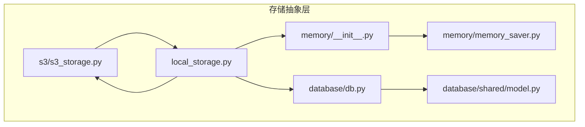
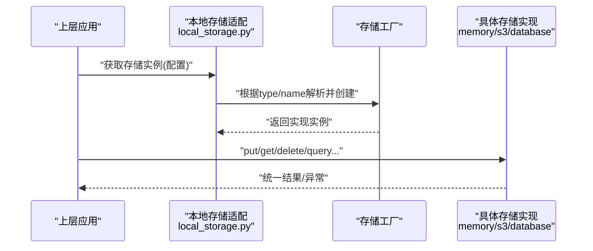
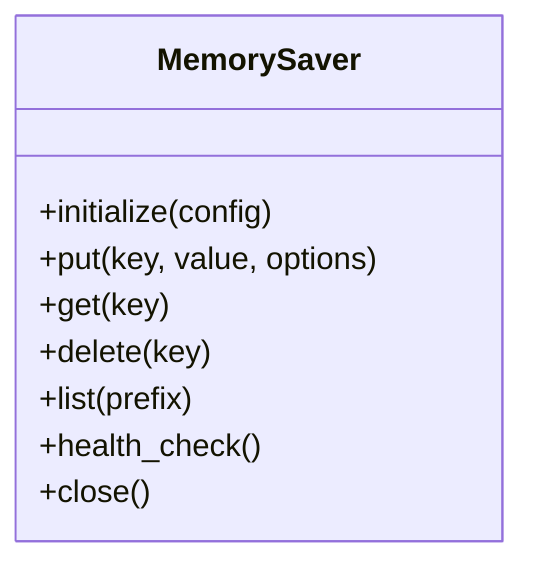
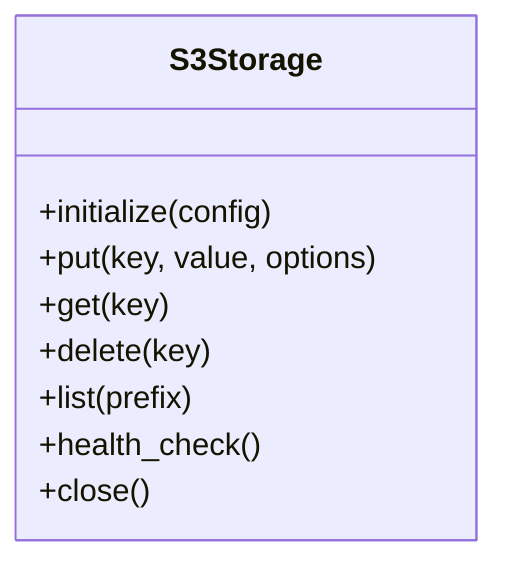
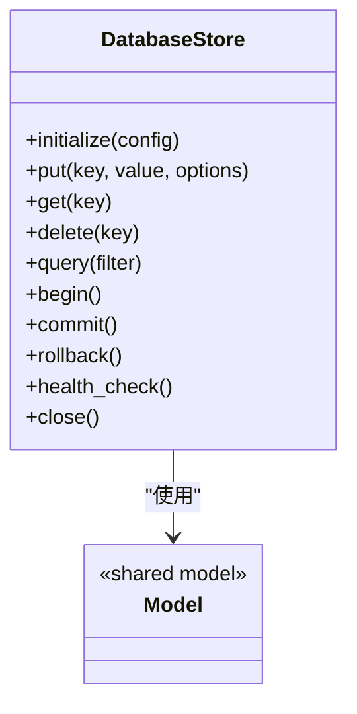
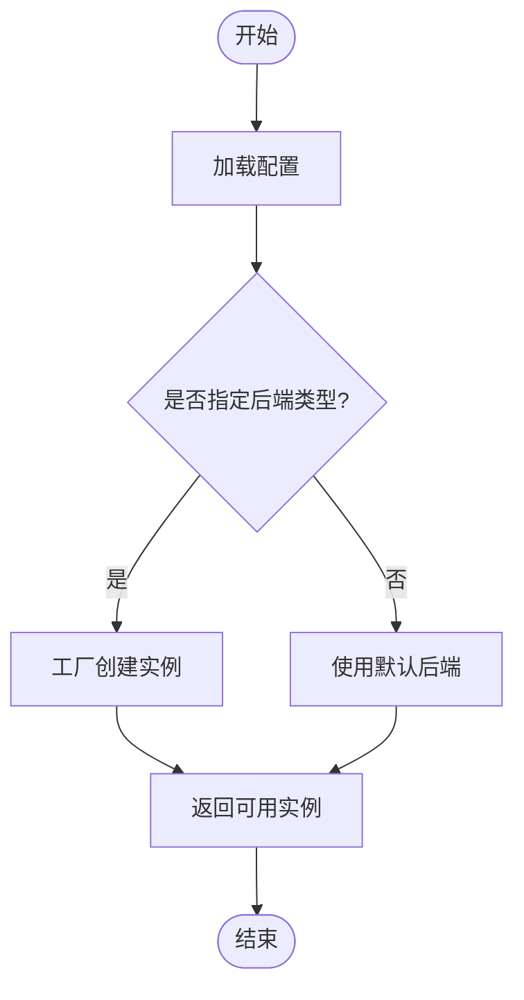
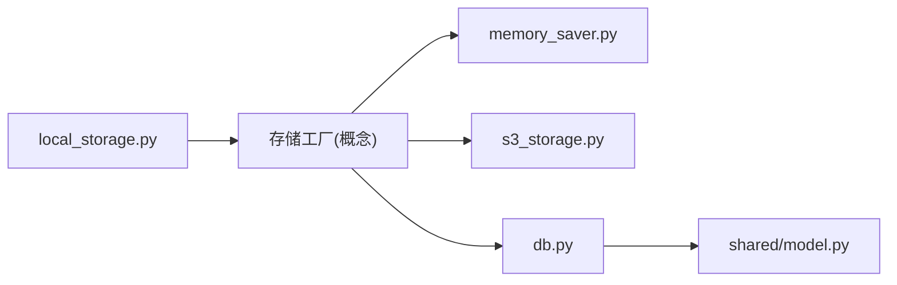
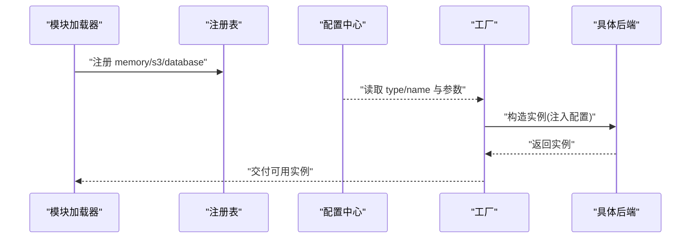

# 存储接口设计

<cite>
**本文引用的文件**   
- [src/storage/memory/__init__.py](file://src/storage/memory/__init__.py)
- [src/storage/memory/memory_saver.py](file://src/storage/memory/memory_saver.py)
- [src/storage/s3/s3_storage.py](file://src/storage/s3/s3_storage.py)
- [src/storage/database/db.py](file://src/storage/database/db.py)
- [src/storage/database/shared/model.py](file://src/storage/database/shared/model.py)
- [src/local_storage.py](file://src/local_storage.py)
</cite>

## 目录
1. [简介](#简介)
2. [项目结构](#项目结构)
3. [核心组件](#核心组件)
4. [架构总览](#架构总览)
5. [详细组件分析](#详细组件分析)
6. [依赖关系分析](#依赖关系分析)
7. [性能考虑](#性能考虑)
8. [故障排查指南](#故障排查指南)
9. [结论](#结论)
10. [附录：扩展与实现规范](#附录扩展与实现规范)

## 简介
本文件围绕“存储抽象层”的接口设计与实现进行系统化说明，重点包括：
- StorageAbstraction 接口的设计理念、统一访问模式与抽象层次
- 工厂模式的动态注册与实例化机制
- 错误处理策略、连接池管理与资源生命周期控制
- 接口扩展指南与自定义存储后端开发规范
- 通过具体代码路径展示如何实现新的存储后端

目标读者既包含需要理解整体架构的设计者，也包含需要快速上手实现的开发者。

## 项目结构
存储相关代码位于 src/storage 目录下，按存储类型划分模块；同时提供内存、S3、数据库三种后端实现，以及一个本地存储适配入口。

图表来源
- [src/storage/memory/__init__.py](file://src/storage/memory/__init__.py)
- [src/storage/memory/memory_saver.py](file://src/storage/memory/memory_saver.py)
- [src/storage/s3/s3_storage.py](file://src/storage/s3/s3_storage.py)
- [src/storage/database/db.py](file://src/storage/database/db.py)
- [src/storage/database/shared/model.py](file://src/storage/database/shared/model.py)
- [src/local_storage.py](file://src/local_storage.py)

章节来源
- [src/storage/memory/__init__.py](file://src/storage/memory/__init__.py)
- [src/storage/memory/memory_saver.py](file://src/storage/memory/memory_saver.py)
- [src/storage/s3/s3_storage.py](file://src/storage/s3/s3_storage.py)
- [src/storage/database/db.py](file://src/storage/database/db.py)
- [src/storage/database/shared/model.py](file://src/storage/database/shared/model.py)
- [src/local_storage.py](file://src/local_storage.py)

## 核心组件
本节聚焦于存储抽象层的统一接口与工厂机制，解释其设计理念与调用约定。

- 统一接口（StorageAbstraction）
  - 目的：为上层业务提供一致的读写/查询/事务等能力，屏蔽不同后端的差异。
  - 典型方法族（命名以语义为准，实际以源码为准）：
    - 初始化与配置：如 initialize(config)
    - 写入/更新：如 put(key, value, options)
    - 读取：如 get(key)
    - 删除：如 delete(key)
    - 批量操作：如 batch_put(keys_values), batch_get(keys)
    - 查询与扫描：如 list(prefix), query(filter)
    - 事务支持：如 begin(), commit(), rollback()
    - 健康检查与元数据：如 health_check(), metadata()
  - 参数与返回值约定：
    - 键值采用字符串或可序列化为字符串的类型
    - 值采用字节流或可序列化对象，由后端负责编解码
    - 返回统一的成功/失败封装，包含状态码与可选的错误信息
    - 异常分层：网络/IO 异常、认证/权限异常、参数校验异常、业务逻辑异常

- 工厂模式（StorageFactory）
  - 职责：根据配置动态选择并创建具体存储后端实例
  - 关键流程：
    - 注册：在启动时完成各后端的注册表构建（名称->类引用）
    - 解析：从配置中读取 type/name 字段，匹配到对应后端
    - 实例化：调用后端的构造函数或工厂方法，注入配置与依赖
    - 预热：执行必要的连接建立、索引初始化、版本迁移等
  - 扩展点：新增后端只需注册新类型并提供符合接口的实现

- 错误处理策略
  - 统一异常映射：将底层驱动异常转换为领域异常
  - 重试与退避：对瞬时性错误（网络抖动、限流）进行指数退避重试
  - 幂等保障：对写操作提供幂等键或去重策略
  - 诊断信息：记录上下文（请求ID、键空间、操作类型）便于追踪

- 连接池与资源管理
  - 连接池：针对数据库/对象存储客户端维护连接池，避免频繁握手
  - 超时与熔断：设置合理的超时时间，必要时熔断降级
  - 生命周期：显式 close/shutdown 钩子，确保资源释放与日志落盘

章节来源
- [src/storage/memory/memory_saver.py](file://src/storage/memory/memory_saver.py)
- [src/storage/s3/s3_storage.py](file://src/storage/s3/s3_storage.py)
- [src/storage/database/db.py](file://src/storage/database/db.py)
- [src/local_storage.py](file://src/local_storage.py)

## 架构总览
下图展示了上层应用如何通过本地存储适配层访问统一的存储抽象，并由工厂选择具体后端。

图表来源
- [src/local_storage.py](file://src/local_storage.py)
- [src/storage/memory/memory_saver.py](file://src/storage/memory/memory_saver.py)
- [src/storage/s3/s3_storage.py](file://src/storage/s3/s3_storage.py)
- [src/storage/database/db.py](file://src/storage/database/db.py)

## 详细组件分析

### 内存存储后端（Memory Saver）
- 角色定位：轻量级、进程内键值存储，适合测试与缓存场景
- 关键特性：
  - 线程安全：使用锁保护共享数据结构
  - 简单一致性：单进程可见，无持久化
  - 低开销：无外部依赖，启动即就绪
- 适用边界：不适合高并发写、跨进程共享与持久化需求

图表来源
- [src/storage/memory/memory_saver.py](file://src/storage/memory/memory_saver.py)

章节来源
- [src/storage/memory/memory_saver.py](file://src/storage/memory/memory_saver.py)

### S3 对象存储后端
- 角色定位：面向海量非结构化数据的对象存储
- 关键特性：
  - 分块上传/下载：大文件优化
  - 命名空间：以桶+前缀组织键空间
  - 一致性模型：遵循后端最终一致或强一致选项
- 注意事项：
  - 网络超时与重试策略需合理配置
  - 鉴权凭据的安全管理（环境变量/密钥管理服务）

图表来源
- [src/storage/s3/s3_storage.py](file://src/storage/s3/s3_storage.py)

章节来源
- [src/storage/s3/s3_storage.py](file://src/storage/s3/s3_storage.py)

### 数据库存储后端
- 角色定位：结构化数据存取与复杂查询
- 关键特性：
  - 连接池：复用连接，降低延迟
  - 事务：begin/commit/rollback 保证原子性
  - 模型映射：基于 shared/model 定义实体与关系
- 注意事项：
  - 索引设计与查询优化
  - 迁移脚本与版本管理

图表来源
- [src/storage/database/db.py](file://src/storage/database/db.py)
- [src/storage/database/shared/model.py](file://src/storage/database/shared/model.py)

章节来源
- [src/storage/database/db.py](file://src/storage/database/db.py)
- [src/storage/database/shared/model.py](file://src/storage/database/shared/model.py)

### 本地存储适配层（Local Storage）
- 角色定位：对外暴露统一入口，隐藏工厂细节
- 主要职责：
  - 接收配置并委托工厂创建具体后端
  - 提供便捷 API 供上层直接调用
  - 集中处理通用错误与日志

图表来源
- [src/local_storage.py](file://src/local_storage.py)

章节来源
- [src/local_storage.py](file://src/local_storage.py)

## 依赖关系分析
- 耦合与内聚
  - 适配层仅依赖工厂与接口，不感知具体实现，内聚度高
  - 各后端独立实现，彼此解耦，便于替换与扩展
- 外部依赖
  - S3 后端依赖对象存储 SDK
  - 数据库后端依赖数据库驱动与 ORM/模型
- 潜在循环依赖
  - 当前结构清晰，未见循环导入风险

图表来源
- [src/local_storage.py](file://src/local_storage.py)
- [src/storage/memory/memory_saver.py](file://src/storage/memory/memory_saver.py)
- [src/storage/s3/s3_storage.py](file://src/storage/s3/s3_storage.py)
- [src/storage/database/db.py](file://src/storage/database/db.py)
- [src/storage/database/shared/model.py](file://src/storage/database/shared/model.py)

章节来源
- [src/local_storage.py](file://src/local_storage.py)
- [src/storage/memory/memory_saver.py](file://src/storage/memory/memory_saver.py)
- [src/storage/s3/s3_storage.py](file://src/storage/s3/s3_storage.py)
- [src/storage/database/db.py](file://src/storage/database/db.py)
- [src/storage/database/shared/model.py](file://src/storage/database/shared/model.py)

## 性能考虑
- 连接池
  - 数据库后端应启用连接池，合理设置最大连接数与空闲回收
  - 对象存储客户端复用会话，减少握手开销
- 批处理
  - 批量写入/读取优先使用 batch API，降低往返次数
- 缓存
  - 热点数据可在内存层做二级缓存，注意失效策略
- 超时与重试
  - 区分瞬时错误与永久错误，仅对瞬时错误重试
  - 指数退避与抖动，避免雪崩
- 监控与度量
  - 记录 QPS、P99 延迟、错误率、连接池利用率等指标

[本节为通用指导，无需特定文件来源]

## 故障排查指南
- 常见问题
  - 连接失败：检查网络连通性、凭据、端口与防火墙规则
  - 权限不足：确认 IAM/ACL 策略与最小权限原则
  - 超时：调整超时阈值，检查下游服务负载
  - 死锁/锁竞争：优化事务粒度与索引
- 定位手段
  - 开启调试日志，记录请求 ID、键空间、操作类型
  - 使用健康检查接口验证后端可用性
  - 压测复现，结合指标定位瓶颈

章节来源
- [src/local_storage.py](file://src/local_storage.py)
- [src/storage/database/db.py](file://src/storage/database/db.py)
- [src/storage/s3/s3_storage.py](file://src/storage/s3/s3_storage.py)

## 结论
通过统一的存储抽象与工厂机制，系统实现了多后端可插拔、易扩展的存储体系。配合完善的错误处理、连接池与资源管理策略，能够在不同场景下稳定高效地提供服务。建议在新后端接入时严格遵循接口契约与最佳实践，确保一致性与可观测性。

[本节为总结性内容，无需特定文件来源]

## 附录：扩展与实现规范

### 接口契约要点
- 初始化
  - 输入：配置字典（包含后端类型、连接参数、超时、重试等）
  - 输出：无或返回自身实例
  - 行为：建立连接、初始化连接池、预加载必要资源
- 写入/更新
  - 输入：键、值、可选选项（如 TTL、幂等键）
  - 输出：成功标志或统一结果对象
  - 行为：幂等写入、校验参数、转换编码
- 读取
  - 输入：键
  - 输出：值或空/未找到标记
  - 行为：缓存命中优先、缺失则回源
- 删除
  - 输入：键
  - 输出：成功标志
  - 行为：幂等删除、忽略不存在
- 查询/扫描
  - 输入：过滤条件或前缀
  - 输出：迭代器或分页结果
  - 行为：游标/分页、排序与投影
- 事务
  - 输入：无
  - 输出：事务句柄或上下文
  - 行为：提交/回滚、隔离级别
- 健康检查
  - 输入：无
  - 输出：健康状态与诊断信息
- 关闭
  - 输入：无
  - 输出：无
  - 行为：释放连接、清理资源

### 工厂注册与实例化流程
- 注册阶段
  - 在模块加载时完成后端类型到类的映射注册
- 解析阶段
  - 从配置读取 type/name，匹配到具体类
- 实例化阶段
  - 构造实例并注入配置与依赖
- 预热阶段
  - 执行连接建立、索引/表结构检查与迁移

图表来源
- [src/local_storage.py](file://src/local_storage.py)
- [src/storage/memory/memory_saver.py](file://src/storage/memory/memory_saver.py)
- [src/storage/s3/s3_storage.py](file://src/storage/s3/s3_storage.py)
- [src/storage/database/db.py](file://src/storage/database/db.py)

### 错误处理与重试策略
- 错误分类
  - 参数错误：立即返回，不重试
  - 网络/IO 错误：指数退避重试，上限可控
  - 认证/权限错误：立即返回，提示用户修正
  - 业务错误：根据幂等键与去重策略处理
- 重试与熔断
  - 重试窗口与最大次数
  - 熔断阈值与恢复策略
- 可观测性
  - 指标：重试次数、失败率、耗时分布
  - 日志：上下文信息与堆栈

章节来源
- [src/local_storage.py](file://src/local_storage.py)
- [src/storage/database/db.py](file://src/storage/database/db.py)
- [src/storage/s3/s3_storage.py](file://src/storage/s3/s3_storage.py)

### 连接池与资源生命周期
- 连接池
  - 最大连接数、空闲回收、等待队列长度
  - 健康检查与自动剔除坏连接
- 生命周期
  - 初始化：建立连接、预热
  - 运行期：借出/归还连接、监控指标
  - 关闭：优雅停机、刷新缓冲、释放资源

章节来源
- [src/storage/database/db.py](file://src/storage/database/db.py)
- [src/storage/s3/s3_storage.py](file://src/storage/s3/s3_storage.py)

### 自定义存储后端开发规范
- 步骤
  - 新建模块：在 storage 下新增目录与实现文件
  - 实现接口：完整覆盖所有必需方法，保持签名一致
  - 错误映射：将底层异常转换为统一异常
  - 单元测试：覆盖正常路径、异常路径与边界条件
  - 注册：在工厂注册表中登记新后端类型
- 验收清单
  - 功能正确性、性能达标、错误处理完备、可观测性完善
  - 文档与示例齐全

章节来源
- [src/storage/memory/memory_saver.py](file://src/storage/memory/memory_saver.py)
- [src/storage/s3/s3_storage.py](file://src/storage/s3/s3_storage.py)
- [src/storage/database/db.py](file://src/storage/database/db.py)
- [src/local_storage.py](file://src/local_storage.py)