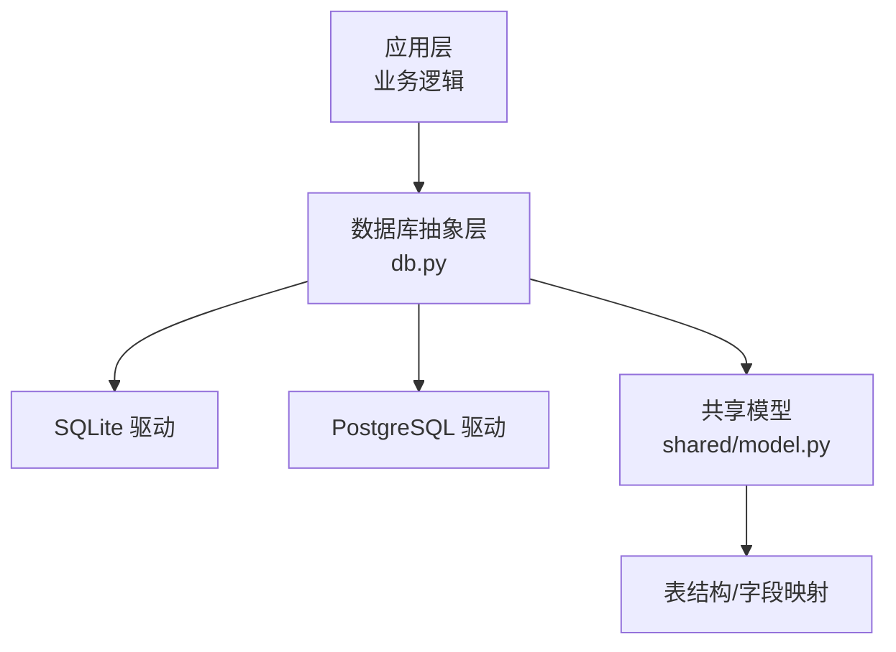
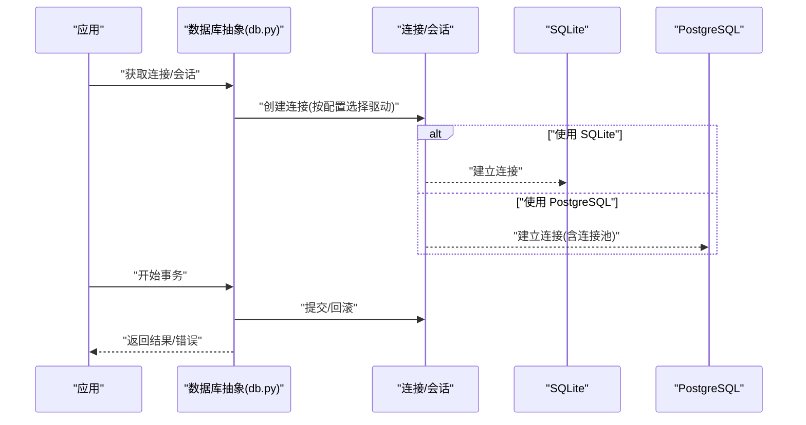
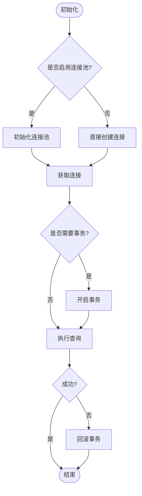
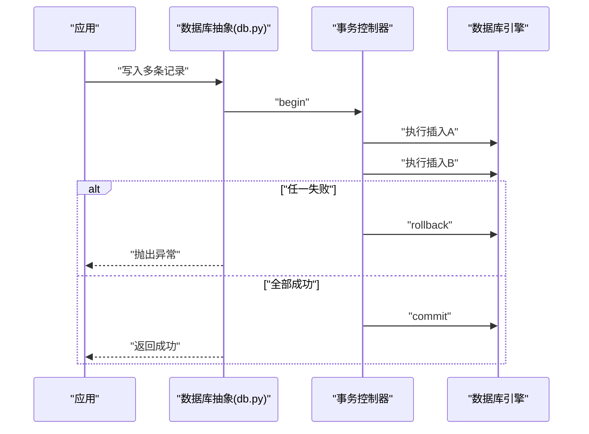
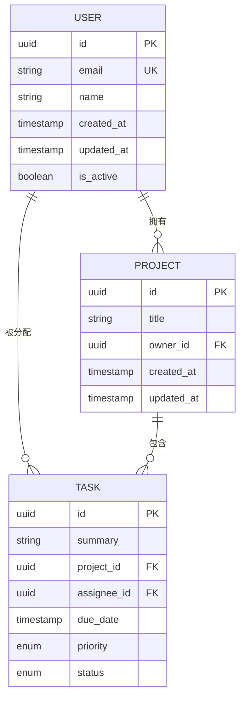
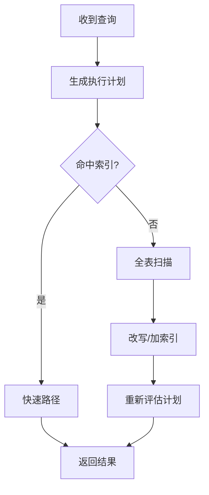
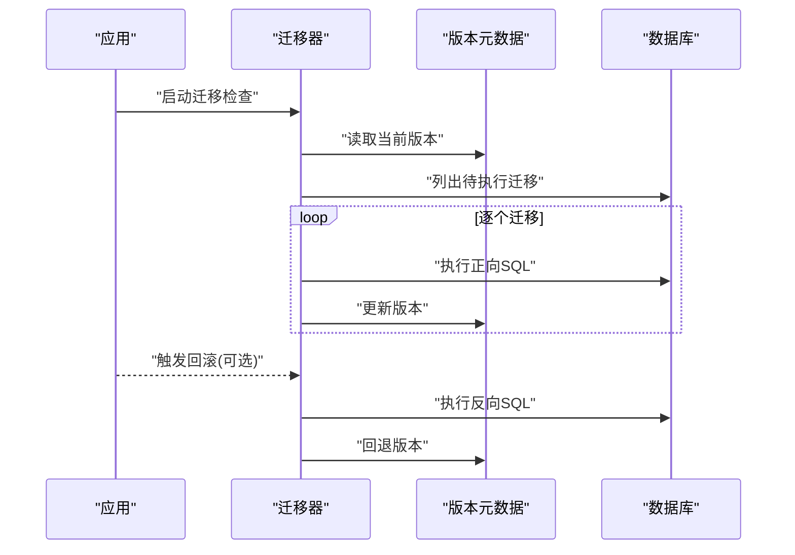
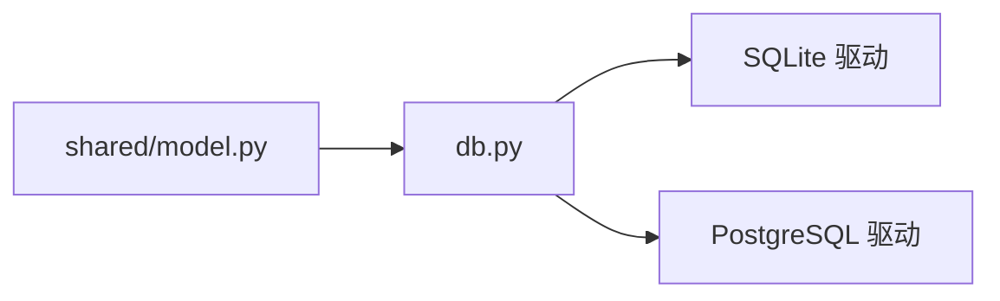

# 数据库存储

<cite>
**本文引用的文件**   
- [src/storage/database/db.py](file://src/storage/database/db.py)
- [src/storage/database/shared/model.py](file://src/storage/database/shared/model.py)
</cite>

## 目录
1. [简介](#简介)
2. [项目结构](#项目结构)
3. [核心组件](#核心组件)
4. [架构总览](#架构总览)
5. [详细组件分析](#详细组件分析)
6. [依赖关系分析](#依赖关系分析)
7. [性能与并发](#性能与并发)
8. [故障排查指南](#故障排查指南)
9. [结论](#结论)
10. [附录](#附录)

## 简介
本章节面向“数据库存储模块”，聚焦 SQLite 与 PostgreSQL 的连接管理、事务处理、查询优化策略，ORM 模型定义、表结构与索引/外键约束设计，数据迁移机制与版本控制、回滚策略，连接池配置、性能调优与并发访问控制，以及初始化脚本、备份恢复流程与监控指标。文档同时提供 SQL 示例与最佳实践建议，帮助读者在生产环境中稳定高效地使用数据库能力。

## 项目结构
本项目将数据库相关代码集中在 storage/database 目录下，包含：
- db.py：数据库连接、会话与事务封装、基础查询入口等
- shared/model.py：共享的 ORM 模型基类或通用字段定义（如适用）

图表来源
- [src/storage/database/db.py](file://src/storage/database/db.py)
- [src/storage/database/shared/model.py](file://src/storage/database/shared/model.py)

章节来源
- [src/storage/database/db.py](file://src/storage/database/db.py)
- [src/storage/database/shared/model.py](file://src/storage/database/shared/model.py)

## 核心组件
- 连接管理
  - 统一连接工厂：根据配置选择 SQLite 或 PostgreSQL 驱动，创建并返回连接对象
  - 连接生命周期：支持显式关闭与上下文管理器模式，确保资源释放
- 会话与事务
  - 会话封装：提供 session 获取、提交、回滚、异常清理等
  - 事务边界：自动/手动事务切换，保证一致性
- 查询执行
  - 参数化查询：防止注入，提升稳定性
  - 批量操作：减少往返开销
  - 结果集映射：将行记录映射为模型实例或字典
- ORM 模型
  - 模型基类：统一主键、时间戳、软删除等通用字段
  - 字段类型映射：Python 类型到 SQL 类型的映射
  - 关系声明：一对多、多对一等关系的便捷表达

章节来源
- [src/storage/database/db.py](file://src/storage/database/db.py)
- [src/storage/database/shared/model.py](file://src/storage/database/shared/model.py)

## 架构总览
下图展示了从应用层到不同数据库后端的调用路径，以及事务与连接的协作方式。

图表来源
- [src/storage/database/db.py](file://src/storage/database/db.py)

## 详细组件分析

### 连接管理与驱动适配
- 驱动选择
  - 通过配置项决定后端为 SQLite 或 PostgreSQL
  - SQLite：单进程文件型数据库，适合本地开发或小规模部署
  - PostgreSQL：客户端-服务器架构，适合生产环境高并发场景
- 连接生命周期
  - 显式打开/关闭：在短任务中按需创建与销毁
  - 上下文管理器：with 语句自动管理连接与会话
- 连接池（PostgreSQL）
  - 最小/最大连接数、空闲超时、连接回收策略
  - 避免连接泄漏与耗尽

图表来源
- [src/storage/database/db.py](file://src/storage/database/db.py)

章节来源
- [src/storage/database/db.py](file://src/storage/database/db.py)

### 事务处理与一致性
- 事务边界
  - 自动事务：默认包裹每次写操作
  - 手动事务：复杂业务可显式 begin/commit/rollback
- 异常处理
  - 捕获异常后自动回滚，避免脏数据
  - 重试策略：针对瞬时错误（如锁冲突）进行有限次重试
- 隔离级别
  - 根据需求设置读已提交/可重复读等隔离级别

图表来源
- [src/storage/database/db.py](file://src/storage/database/db.py)

章节来源
- [src/storage/database/db.py](file://src/storage/database/db.py)

### ORM 模型与表结构设计
- 模型基类
  - 统一主键、创建/更新时间戳、软删除标记
  - 序列化/反序列化工具方法
- 字段映射
  - Python 类型到 SQL 类型映射（整数、字符串、布尔、日期时间等）
  - 校验规则：非空、唯一、长度限制等
- 关系建模
  - 一对多：父表主键作为子表外键
  - 多对多：中间表维护关联关系
- 索引与约束
  - 单列/复合索引：加速查询
  - 外键约束：保证引用完整性
  - 唯一约束：避免重复数据

图表来源
- [src/storage/database/shared/model.py](file://src/storage/database/shared/model.py)

章节来源
- [src/storage/database/shared/model.py](file://src/storage/database/shared/model.py)

### 查询优化策略
- 索引优化
  - 高频过滤/排序字段建索引
  - 复合索引遵循最左前缀原则
  - 覆盖索引减少回表
- 查询改写
  - 避免 SELECT *，仅取必要列
  - 使用 EXISTS 替代 IN 子查询
  - 分页采用游标/基于键的分页
- 批量操作
  - 批量插入/更新减少网络往返
  - 分批提交控制事务大小
- 统计信息
  - 定期 ANALYZE/VACUUM（PostgreSQL）
  - 监控慢查询日志并持续优化

图表来源
- [src/storage/database/db.py](file://src/storage/database/db.py)

章节来源
- [src/storage/database/db.py](file://src/storage/database/db.py)

### 数据迁移机制、版本控制与回滚
- 迁移脚本
  - 增量式变更：新增表、字段、索引、约束
  - 幂等性：支持重复执行不破坏状态
- 版本控制
  - 迁移版本号与元数据表记录已应用版本
  - 向前/向后兼容策略
- 回滚策略
  - 反向迁移脚本：撤销变更
  - 回滚检查点：失败时恢复到上一版本
- 执行流程
  - 启动时检测版本并应用未执行的迁移
  - 锁定机制：防止并发迁移导致竞争

图表来源
- [src/storage/database/db.py](file://src/storage/database/db.py)
- [src/storage/database/shared/model.py](file://src/storage/database/shared/model.py)

章节来源
- [src/storage/database/db.py](file://src/storage/database/db.py)
- [src/storage/database/shared/model.py](file://src/storage/database/shared/model.py)

### 连接池配置、性能调优与并发控制
- 连接池参数
  - 最小/最大连接数、空闲超时、最大生命周期
  - 预取连接数量与排队策略
- 性能调优
  - 调整缓冲区/缓存大小（PostgreSQL）
  - 合理设置 WAL 与同步策略（SQLite）
  - 批处理与异步 I/O 结合
- 并发控制
  - 读写分离（只读副本）
  - 行级锁/表级锁的使用与规避
  - 死锁检测与重试

章节来源
- [src/storage/database/db.py](file://src/storage/database/db.py)

### 初始化脚本、备份恢复与监控指标
- 初始化脚本
  - 创建数据库与用户权限
  - 执行初始迁移与种子数据
- 备份恢复
  - SQLite：文件级拷贝；必要时使用导出工具
  - PostgreSQL：逻辑备份（pg_dump）与恢复（psql/pg_restore）
- 监控指标
  - 连接池使用率、等待队列长度
  - 慢查询数量与平均耗时
  - 事务失败率与回滚次数
  - 磁盘 I/O 与锁等待

章节来源
- [src/storage/database/db.py](file://src/storage/database/db.py)

## 依赖关系分析
- 模块内依赖
  - db.py 依赖 shared/model.py 中的模型定义
  - db.py 负责连接、事务、查询执行；model.py 负责数据模型与映射
- 外部依赖
  - SQLite 驱动：轻量、嵌入式
  - PostgreSQL 驱动：高性能、可扩展

图表来源
- [src/storage/database/db.py](file://src/storage/database/db.py)
- [src/storage/database/shared/model.py](file://src/storage/database/shared/model.py)

章节来源
- [src/storage/database/db.py](file://src/storage/database/db.py)
- [src/storage/database/shared/model.py](file://src/storage/database/shared/model.py)

## 性能与并发
- 连接池调优
  - 根据并发量与延迟目标设置最大连接数
  - 监控连接等待与超时，动态调整
- 事务粒度
  - 缩小事务范围，降低锁持有时间
  - 长事务拆分为多个短事务
- 查询优化
  - 利用 EXPLAIN/EXPLAIN ANALYZE 定位瓶颈
  - 合理使用覆盖索引与物化视图
- 并发安全
  - 避免热点行竞争，采用分片/分区
  - 使用乐观锁或版本号字段解决冲突

[本节为通用指导，无需特定文件来源]

## 故障排查指南
- 常见问题
  - 连接泄漏：确认所有连接与会话均正确关闭
  - 事务未提交：检查异常分支是否回滚
  - 索引失效：核对查询谓词与索引列顺序
- 诊断步骤
  - 查看慢查询日志与执行计划
  - 检查连接池指标与锁等待
  - 验证迁移版本一致性与幂等性
- 恢复策略
  - 回滚最近迁移并修复脚本
  - 从备份恢复数据并重新应用迁移

章节来源
- [src/storage/database/db.py](file://src/storage/database/db.py)

## 结论
本模块以统一的抽象层屏蔽 SQLite 与 PostgreSQL 的差异，提供连接管理、事务处理、ORM 模型与迁移机制，满足从开发到生产的多种场景。通过合理的索引与查询优化、连接池与并发控制，可在保证一致性的前提下获得良好的性能表现。建议在生产环境优先使用 PostgreSQL，并结合监控与告警持续优化。

[本节为总结性内容，无需特定文件来源]

## 附录

### SQL 查询示例与最佳实践
- 基础查询
  - 条件过滤与排序：在过滤与排序列上建立索引
  - 分页：使用基于主键的游标分页
- 聚合与分组
  - 先过滤再分组，减少中间结果集
  - 使用窗口函数实现排名与累计
- 连接与子查询
  - 用 JOIN 替代嵌套子查询以提升可读性与性能
  - 使用 EXISTS 判断存在性
- 事务与一致性
  - 关键写操作包裹在事务中
  - 失败时立即回滚并记录日志
- 索引与约束
  - 为高频查询列添加索引
  - 使用外键与唯一约束保障数据质量

[本节为通用指导，无需特定文件来源]