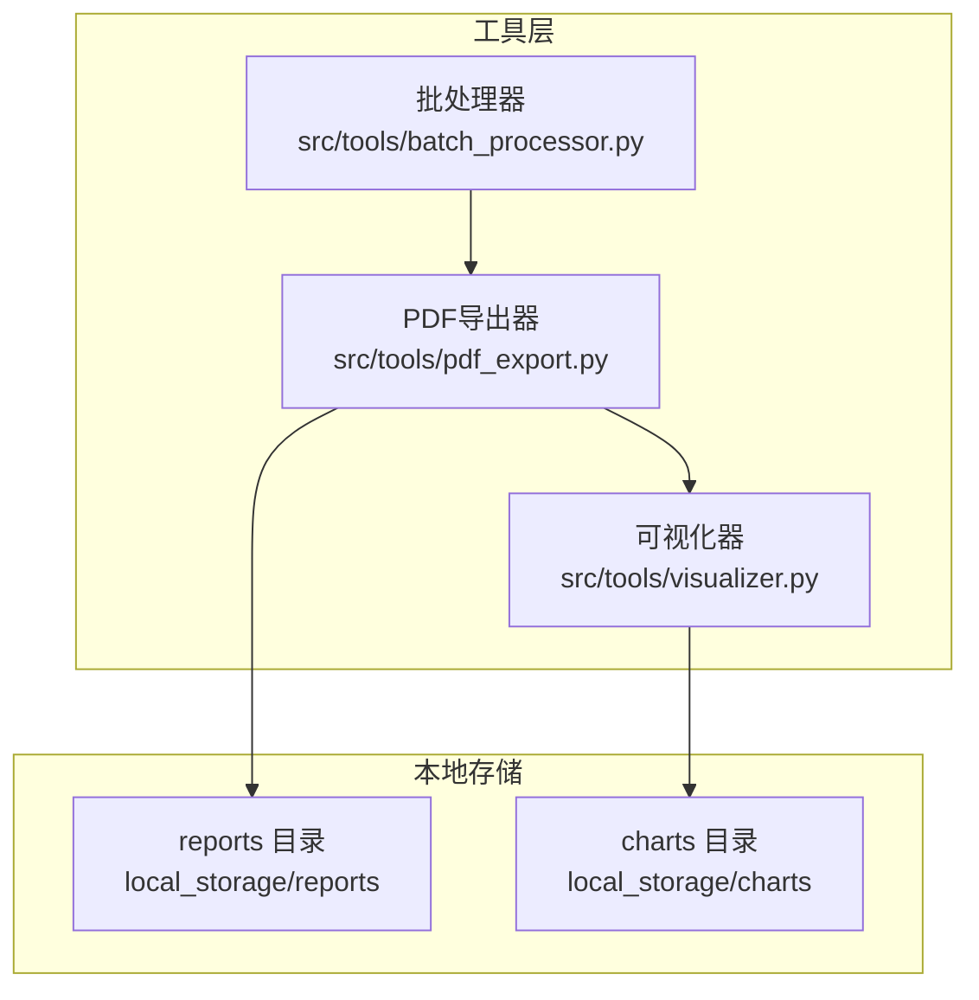
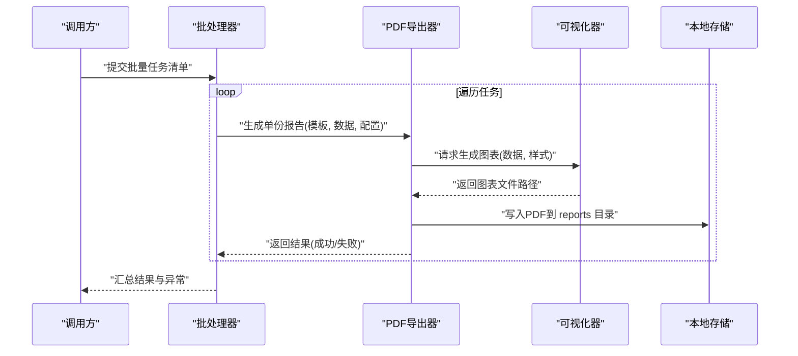
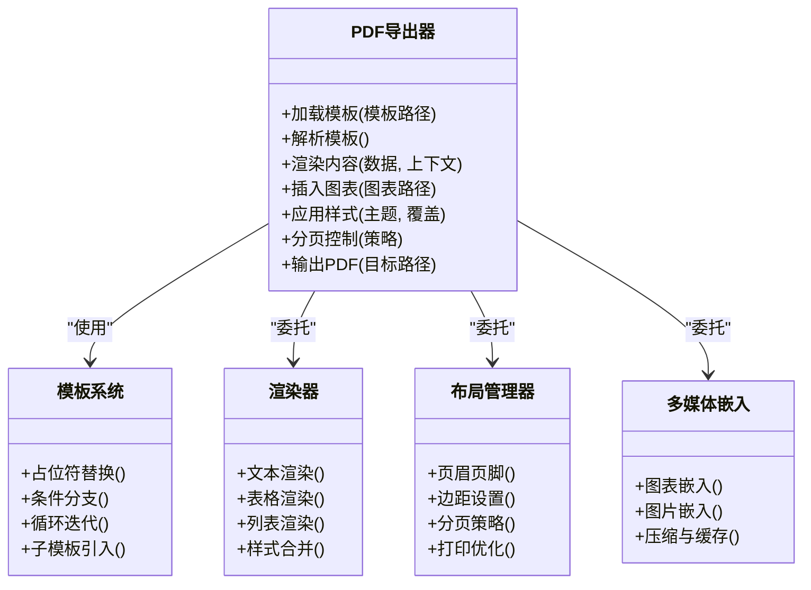
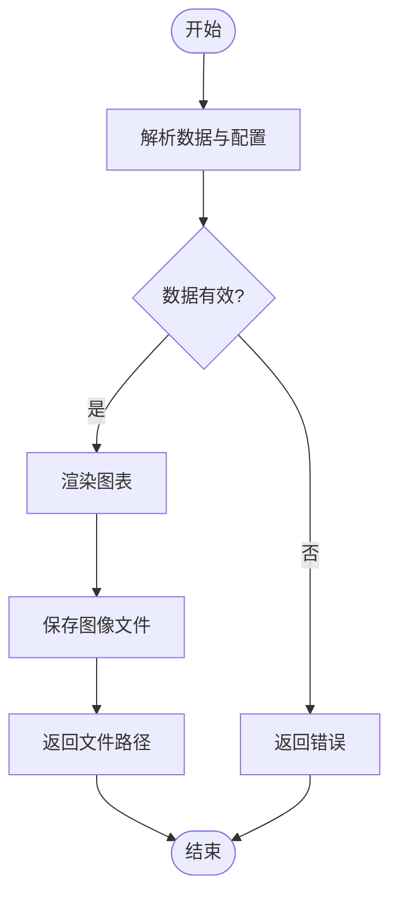
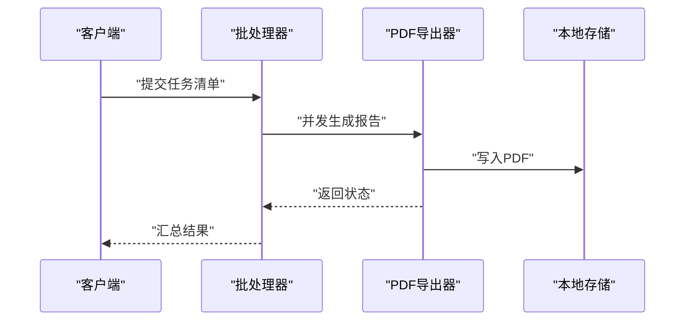
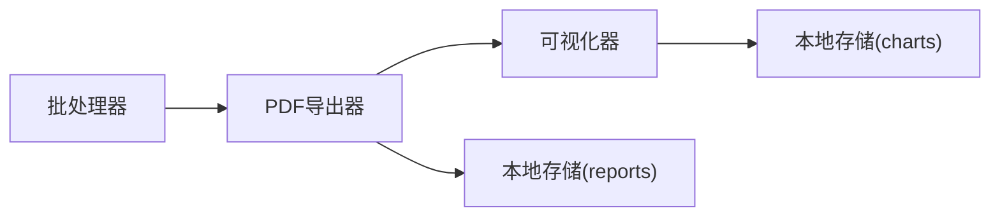

# PDF导出器

<cite>
**本文引用的文件**   
- [src/tools/pdf_export.py](file://src/tools/pdf_export.py)
- [src/tools/visualizer.py](file://src/tools/visualizer.py)
- [src/tools/batch_processor.py](file://src/tools/batch_processor.py)
- [local_storage/reports](file://local_storage/reports)
- [local_storage/charts](file://local_storage/charts)
</cite>

## 目录
1. [简介](#简介)
2. [项目结构](#项目结构)
3. [核心组件](#核心组件)
4. [架构总览](#架构总览)
5. [详细组件分析](#详细组件分析)
6. [依赖关系分析](#依赖关系分析)
7. [性能考虑](#性能考虑)
8. [故障排查指南](#故障排查指南)
9. [结论](#结论)
10. [附录](#附录)

## 简介
本文件为PDF导出器的技术文档，聚焦于报告模板系统与文档生成引擎。内容涵盖：
- 预定义审计报告模板结构与自定义模板开发方法
- 内容渲染机制、样式控制选项与多媒体元素嵌入
- 标准审计报告、定制化分析报告与批量报告导出的具体示例
- 与可视化工具的数据集成与图表嵌入方式
- 字体管理、页面布局与打印优化配置

## 项目结构
PDF导出相关能力集中在工具层，主要涉及以下模块：
- PDF导出器：负责模板解析、内容渲染、样式与布局控制、图表与多媒体嵌入、输出到本地存储
- 可视化器：负责将数据转换为图表图像（如PNG/SVG），供PDF导出器嵌入
- 批处理器：负责批量任务编排与并发控制，驱动多份报告的生成与落盘

图示来源
- [src/tools/pdf_export.py](file://src/tools/pdf_export.py)
- [src/tools/visualizer.py](file://src/tools/visualizer.py)
- [src/tools/batch_processor.py](file://src/tools/batch_processor.py)
- [local_storage/reports](file://local_storage/reports)
- [local_storage/charts](file://local_storage/charts)

章节来源
- [src/tools/pdf_export.py](file://src/tools/pdf_export.py)
- [src/tools/visualizer.py](file://src/tools/visualizer.py)
- [src/tools/batch_processor.py](file://src/tools/batch_processor.py)
- [local_storage/reports](file://local_storage/reports)
- [local_storage/charts](file://local_storage/charts)

## 核心组件
- PDF导出器
  - 职责：加载模板、解析占位符与区块、渲染文本/表格/列表、插入图表与图片、应用样式与分页策略、写入PDF并保存至本地
  - 关键能力：模板系统、渲染管线、样式与布局、多媒体嵌入、错误处理与日志
- 可视化器
  - 职责：接收结构化数据与配置，生成图表图像文件，返回路径或字节流供PDF导出器嵌入
- 批处理器
  - 职责：读取输入清单，调度PDF导出器并行生成多份报告，汇总结果与异常

章节来源
- [src/tools/pdf_export.py](file://src/tools/pdf_export.py)
- [src/tools/visualizer.py](file://src/tools/visualizer.py)
- [src/tools/batch_processor.py](file://src/tools/batch_processor.py)

## 架构总览
PDF导出器作为编排中心，协调模板、渲染器、可视化器与存储子系统，形成“模板驱动+数据绑定”的文档生成流水线。

图示来源
- [src/tools/batch_processor.py](file://src/tools/batch_processor.py)
- [src/tools/pdf_export.py](file://src/tools/pdf_export.py)
- [src/tools/visualizer.py](file://src/tools/visualizer.py)
- [local_storage/reports](file://local_storage/reports)

## 详细组件分析

### PDF导出器
- 模板系统
  - 支持基于标记的模板语言，包含占位符、条件块、循环块、子模板引用等
  - 预定义审计报告模板结构：封面、摘要、范围与方法、发现与证据、风险评级与建议、附录与索引
  - 自定义模板开发：通过新增模板文件与注册映射，复用渲染器与样式库
- 渲染机制
  - 文本渲染：段落、标题层级、列表、表格、脚注与交叉引用
  - 样式控制：全局主题、局部覆盖、行距、对齐、颜色、边框与阴影
  - 分页与断页：智能分页、避免孤行、跨页表格头重复
- 多媒体嵌入
  - 图表：由可视化器生成的PNG/SVG直接嵌入，支持缩放与锚点
  - 图片：本地路径或URL下载后缓存，支持水印与压缩
- 页面布局与打印优化
  - 页眉页脚、页码、边距、纸张尺寸、方向、出血与裁切线
  - 打印优化：灰度模式、超链接书签、可搜索文本层
- 错误处理
  - 模板缺失/语法错误、资源不可用、渲染异常、IO异常
  - 提供重试、降级与详细诊断信息

图示来源
- [src/tools/pdf_export.py](file://src/tools/pdf_export.py)

章节来源
- [src/tools/pdf_export.py](file://src/tools/pdf_export.py)

### 可视化器
- 功能要点
  - 输入：结构化数据（时间序列、分类统计、对比矩阵等）与图表配置（类型、配色、标注）
  - 输出：高质量图表图像（PNG/SVG），附带元数据（尺寸、分辨率、比例）
  - 集成：返回文件路径供PDF导出器嵌入；支持异步生成与缓存
- 典型图表
  - 柱状图、折线图、饼图、雷达图、热力图、散点图、组合图
- 与PDF导出器协作
  - 按需生成、按主题配色、统一分辨率与压缩策略

图示来源
- [src/tools/visualizer.py](file://src/tools/visualizer.py)

章节来源
- [src/tools/visualizer.py](file://src/tools/visualizer.py)

### 批处理器
- 功能要点
  - 输入：任务清单（每份报告对应模板、数据、配置）
  - 调度：并发执行、限流与重试、进度回调
  - 聚合：成功/失败统计、异常收集、产物归档
- 与PDF导出器协作
  - 逐条调用导出接口，捕获异常并记录诊断信息

图示来源
- [src/tools/batch_processor.py](file://src/tools/batch_processor.py)
- [src/tools/pdf_export.py](file://src/tools/pdf_export.py)
- [local_storage/reports](file://local_storage/reports)

章节来源
- [src/tools/batch_processor.py](file://src/tools/batch_processor.py)

## 依赖关系分析
- 内部依赖
  - PDF导出器依赖可视化器生成图表图像
  - 批处理器依赖PDF导出器完成单份报告生成
- 外部依赖
  - 文件系统：读写本地存储（reports、charts）
  - 可选：网络下载图片、字体安装与缓存

图示来源
- [src/tools/batch_processor.py](file://src/tools/batch_processor.py)
- [src/tools/pdf_export.py](file://src/tools/pdf_export.py)
- [src/tools/visualizer.py](file://src/tools/visualizer.py)
- [local_storage/reports](file://local_storage/reports)
- [local_storage/charts](file://local_storage/charts)

章节来源
- [src/tools/batch_processor.py](file://src/tools/batch_processor.py)
- [src/tools/pdf_export.py](file://src/tools/pdf_export.py)
- [src/tools/visualizer.py](file://src/tools/visualizer.py)
- [local_storage/reports](file://local_storage/reports)
- [local_storage/charts](file://local_storage/charts)

## 性能考虑
- 渲染优化
  - 启用增量渲染与缓存，避免重复计算
  - 对大图进行压缩与降采样，平衡质量与体积
- 并发与I/O
  - 批处理采用线程池/进程池，限制并发度以避免内存峰值
  - 分片写入与异步落盘，减少阻塞
- 字体与资源
  - 字体文件预加载与缓存，避免每次渲染重复加载
  - 图表图像复用，相同配置命中缓存直接返回路径

[本节为通用指导，不直接分析具体文件]

## 故障排查指南
- 常见问题
  - 模板未找到或语法错误：检查模板路径与占位符命名
  - 图表生成失败：确认数据格式与配置项是否匹配
  - 图片无法嵌入：校验路径权限与网络可达性
  - 字体缺失导致乱码：安装并注册所需字体
- 定位手段
  - 查看导出器日志与异常堆栈
  - 检查本地存储中中间产物（图表、临时文件）
  - 使用最小数据集复现问题

章节来源
- [src/tools/pdf_export.py](file://src/tools/pdf_export.py)
- [src/tools/visualizer.py](file://src/tools/visualizer.py)

## 结论
PDF导出器以模板为核心，结合可视化器与批处理器，形成可扩展、可配置的文档生成体系。通过统一的样式与布局控制、完善的错误处理与性能优化策略，能够稳定支撑标准审计报告、定制化分析报告与批量报告导出场景。

[本节为总结性内容，不直接分析具体文件]

## 附录

### 预定义审计报告模板结构
- 封面：项目名称、版本、日期、作者
- 摘要：关键发现与总体结论
- 范围与方法：审计范围、抽样方法、依据标准
- 发现与证据：问题描述、影响评估、证据附件
- 风险评级与建议：风险等级、整改建议、责任主体与时限
- 附录与索引：数据表、图表、参考文件

章节来源
- [src/tools/pdf_export.py](file://src/tools/pdf_export.py)

### 自定义模板开发方法
- 新建模板文件，定义占位符与区块
- 在模板系统中注册新模板类型
- 编写数据绑定对象，确保字段与占位符一致
- 运行最小用例验证渲染效果

章节来源
- [src/tools/pdf_export.py](file://src/tools/pdf_export.py)

### 内容渲染机制与样式控制
- 文本与表格：支持多级标题、自动编号、跨页表头
- 样式：主题变量、局部覆盖、颜色与边框、阴影与背景
- 分页：智能分页、避免孤行、连续表格处理

章节来源
- [src/tools/pdf_export.py](file://src/tools/pdf_export.py)

### 多媒体元素嵌入
- 图表：由可视化器生成PNG/SVG，支持缩放与锚点
- 图片：本地路径或URL，支持水印与压缩
- 媒体元数据：尺寸、分辨率、比例与缓存键

章节来源
- [src/tools/pdf_export.py](file://src/tools/pdf_export.py)
- [src/tools/visualizer.py](file://src/tools/visualizer.py)

### 报告生成示例
- 标准审计报告
  - 输入：标准模板 + 审计数据 + 默认样式
  - 流程：批处理器调度 -> PDF导出器渲染 -> 写入reports目录
- 定制化分析报告
  - 输入：自定义模板 + 业务数据 + 主题覆盖
  - 流程：同上，但启用特定样式与图表类型
- 批量报告导出
  - 输入：任务清单（多份报告参数）
  - 流程：批处理器并发执行，汇总结果与异常

章节来源
- [src/tools/batch_processor.py](file://src/tools/batch_processor.py)
- [src/tools/pdf_export.py](file://src/tools/pdf_export.py)
- [local_storage/reports](file://local_storage/reports)

### 与可视化工具的数据集成与图表嵌入
- 数据契约：结构化数据与图表配置
- 生成流程：可视化器生成图像 -> 返回路径 -> PDF导出器嵌入
- 主题一致性：共享配色与字体，保证视觉统一

章节来源
- [src/tools/visualizer.py](file://src/tools/visualizer.py)
- [src/tools/pdf_export.py](file://src/tools/pdf_export.py)
- [local_storage/charts](file://local_storage/charts)

### 字体管理、页面布局与打印优化配置
- 字体管理：注册字体族、回退策略、缓存与预加载
- 页面布局：纸张尺寸、方向、边距、页眉页脚、页码
- 打印优化：灰度模式、书签与超链接、可搜索文本层

章节来源
- [src/tools/pdf_export.py](file://src/tools/pdf_export.py)