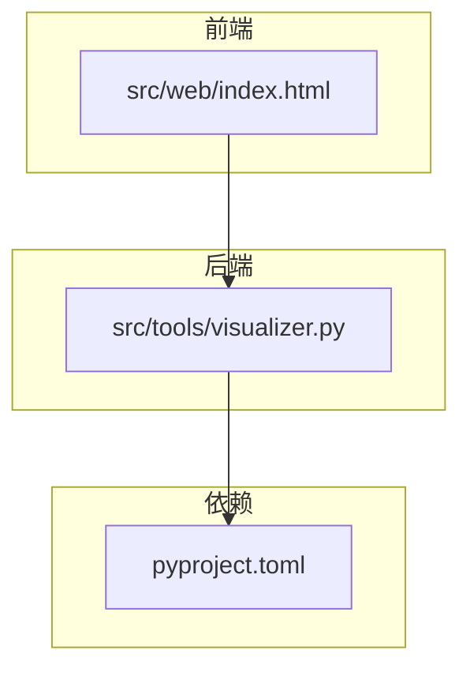
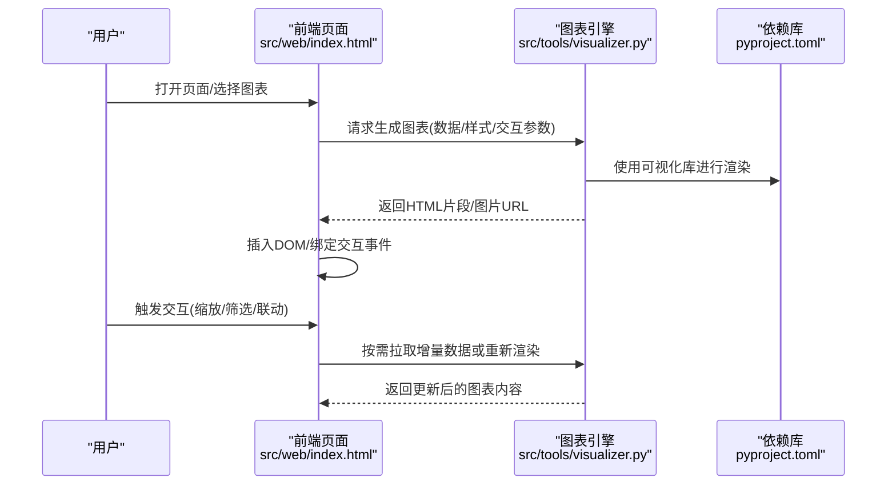
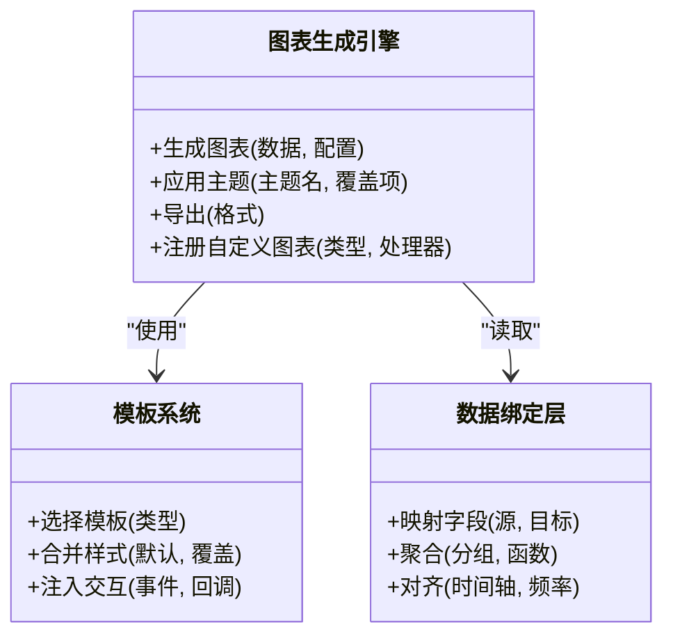
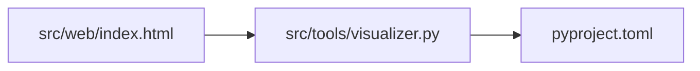

# 可视化工具

<cite>
**本文引用的文件**   
- [src/tools/visualizer.py](file://src/tools/visualizer.py)
- [src/web/index.html](file://src/web/index.html)
- [pyproject.toml](file://pyproject.toml)
</cite>

## 目录
1. [简介](#简介)
2. [项目结构](#项目结构)
3. [核心组件](#核心组件)
4. [架构总览](#架构总览)
5. [详细组件分析](#详细组件分析)
6. [依赖分析](#依赖分析)
7. [性能考虑](#性能考虑)
8. [故障排查指南](#故障排查指南)
9. [结论](#结论)
10. [附录](#附录)

## 简介
本文件面向“可视化工具”的图表生成引擎与可视化模板系统，提供从数据到图表的端到端说明。内容涵盖：
- 支持的图表类型（折线图、柱状图、饼图、散点图等）
- 样式定制选项与主题配置
- 数据绑定机制与交互功能配置
- 响应式布局支持
- 静态图表生成、动态数据更新与交互式仪表板构建示例
- 前端集成方式与API调用格式
- 导出格式支持与性能优化技巧

## 项目结构
仓库中与可视化相关的关键位置如下：
- src/tools/visualizer.py：图表生成引擎与模板系统的实现入口
- src/web/index.html：前端页面，用于承载可视化结果与交互
- pyproject.toml：项目依赖声明，包含可视化库版本信息

图示来源
- [src/tools/visualizer.py](file://src/tools/visualizer.py)
- [src/web/index.html](file://src/web/index.html)
- [pyproject.toml](file://pyproject.toml)

章节来源
- [src/tools/visualizer.py](file://src/tools/visualizer.py)
- [src/web/index.html](file://src/web/index.html)
- [pyproject.toml](file://pyproject.toml)

## 核心组件
- 图表生成引擎
  - 负责将结构化数据转换为图表渲染所需的中间表示或图像/HTML片段
  - 内置多种图表类型的默认模板与样式策略
- 可视化模板系统
  - 以模板为中心组织图表外观、布局与交互行为
  - 支持主题切换与局部样式覆盖
- 数据绑定层
  - 定义字段映射、聚合规则与时间序列对齐等
- 交互与响应式
  - 提供缩放、筛选、联动等交互能力
  - 根据容器尺寸自适应布局

章节来源
- [src/tools/visualizer.py](file://src/tools/visualizer.py)
- [src/web/index.html](file://src/web/index.html)

## 架构总览
整体采用“后端生成 + 前端渲染”的分层架构：
- 后端通过 visualizer.py 完成数据到图表的转换，输出可嵌入的HTML片段或图片资源
- 前端 index.html 负责加载并展示图表，处理用户交互事件，必要时向后端发起请求刷新数据

图示来源
- [src/tools/visualizer.py](file://src/tools/visualizer.py)
- [src/web/index.html](file://src/web/index.html)
- [pyproject.toml](file://pyproject.toml)

## 详细组件分析

### 图表生成引擎（visualizer.py）
- 职责
  - 接收数据与配置，生成对应图表的中间表示或最终产物
  - 管理模板选择、主题应用与样式覆盖
  - 封装常用图表类型（折线、柱状、饼图、散点等）的创建流程
- 关键能力
  - 数据校验与预处理（缺失值、异常值、时间对齐）
  - 多图表组合与布局编排
  - 导出为图片/PDF/HTML等格式
  - 缓存与增量更新策略
- 扩展点
  - 自定义图表类型注册
  - 自定义主题与样式模板
  - 自定义交互插件

章节来源
- [src/tools/visualizer.py](file://src/tools/visualizer.py)

#### 类与方法关系（概念示意）

[此图为概念示意，不直接映射具体源码文件]

### 可视化模板系统
- 模板组织
  - 按图表类型划分模板目录/命名空间
  - 每个模板包含默认样式、布局与交互脚本
- 主题机制
  - 全局主题变量（颜色、字体、间距）
  - 局部覆盖（针对某图表实例）
- 交互注入
  - 在模板中声明事件钩子，由前端或引擎侧注入回调

章节来源
- [src/tools/visualizer.py](file://src/tools/visualizer.py)

### 数据绑定机制
- 字段映射
  - 指定数据列到图表语义（如x/y/标签/分组）
- 聚合与过滤
  - 支持分组求和、均值、计数等
  - 条件过滤与范围筛选
- 时间序列
  - 统一时区、重采样与插值
- 变更检测
  - 基于哈希或时间戳判断是否需要重绘

章节来源
- [src/tools/visualizer.py](file://src/tools/visualizer.py)

### 交互功能配置
- 常见交互
  - 缩放、平移、框选、下钻、联动
- 事件模型
  - 点击、悬停、双击、键盘快捷键
- 回调与通信
  - 前端回调、后端刷新、WebSocket推送（可选）

章节来源
- [src/web/index.html](file://src/web/index.html)
- [src/tools/visualizer.py](file://src/tools/visualizer.py)

### 响应式布局支持
- 容器尺寸监听
  - 窗口resize或容器变化时自动重排
- 断点与网格
  - 多屏适配与栅格布局
- 性能策略
  - 防抖/节流、懒加载、按需渲染

章节来源
- [src/web/index.html](file://src/web/index.html)

### 图表类型与样式定制
- 支持类型
  - 折线图、柱状图、饼图、散点图等
- 样式定制
  - 主题色板、字体、刻度、图例、标注
  - 动画与过渡效果开关
- 组合图表
  - 双轴、叠加、分面

章节来源
- [src/tools/visualizer.py](file://src/tools/visualizer.py)

### 导出格式支持
- 图片：PNG/SVG/JPEG
- 文档：PDF
- 网页：HTML片段/完整页面
- 批量导出与队列控制

章节来源
- [src/tools/visualizer.py](file://src/tools/visualizer.py)

### 前端集成与API调用格式
- 集成方式
  - 通过index.html引入后端生成的HTML片段或图片资源
  - 使用JavaScript发起请求获取图表数据或触发重渲染
- API约定（建议）
  - 请求体包含：数据、图表类型、样式配置、交互参数
  - 响应体包含：HTML片段或资源URL、元数据（尺寸、版本）
- 错误处理
  - 统一错误码与消息，前端友好提示并重试

章节来源
- [src/web/index.html](file://src/web/index.html)
- [src/tools/visualizer.py](file://src/tools/visualizer.py)

### 示例场景

#### 静态图表生成
- 步骤
  - 准备数据与样式配置
  - 调用引擎生成HTML片段或图片
  - 在前端页面中插入并展示
- 关键点
  - 确保数据字段与模板期望一致
  - 设置合适的尺寸与分辨率

章节来源
- [src/tools/visualizer.py](file://src/tools/visualizer.py)
- [src/web/index.html](file://src/web/index.html)

#### 动态数据更新
- 步骤
  - 前端定时轮询或接收推送
  - 仅更新差异数据，触发局部重绘
  - 保持交互状态（缩放/筛选）不变
- 关键点
  - 使用增量接口或差分数据
  - 防抖避免频繁重绘

章节来源
- [src/web/index.html](file://src/web/index.html)
- [src/tools/visualizer.py](file://src/tools/visualizer.py)

#### 交互式仪表板构建
- 步骤
  - 多个图表共享同一数据源
  - 通过联动事件实现跨图表筛选
  - 使用响应式网格布局适配不同屏幕
- 关键点
  - 事件总线或中央状态管理
  - 按需加载与虚拟滚动（大数据量）

章节来源
- [src/web/index.html](file://src/web/index.html)
- [src/tools/visualizer.py](file://src/tools/visualizer.py)

## 依赖分析
- 外部依赖
  - 可视化库版本与特性由pyproject.toml声明
  - 引擎与模板系统依赖这些库提供的渲染能力
- 内部耦合
  - visualizer.py 作为核心，被前端通过HTTP或内嵌方式调用
  - index.html 负责UI与交互，依赖后端产出的内容

图示来源
- [src/tools/visualizer.py](file://src/tools/visualizer.py)
- [src/web/index.html](file://src/web/index.html)
- [pyproject.toml](file://pyproject.toml)

章节来源
- [pyproject.toml](file://pyproject.toml)
- [src/tools/visualizer.py](file://src/tools/visualizer.py)
- [src/web/index.html](file://src/web/index.html)

## 性能考虑
- 渲染优化
  - 按需渲染、增量更新、防抖/节流
  - 大数据集分页与抽样
- 资源优化
  - 图片压缩、SVG优先、CDN缓存
- 内存与CPU
  - 及时释放临时对象、避免重复计算
- 网络优化
  - 压缩传输、并发请求限制、重试退避

[本节为通用指导，无需特定文件引用]

## 故障排查指南
- 常见问题
  - 数据字段不匹配导致渲染失败
  - 主题变量未定义或冲突
  - 交互事件未正确绑定
  - 导出失败（权限/路径/依赖缺失）
- 定位方法
  - 检查请求/响应结构与错误码
  - 查看浏览器控制台与后端日志
  - 最小化复现：简化数据与样式后逐步恢复
- 修复建议
  - 增加输入校验与默认回退
  - 统一错误处理与重试逻辑
  - 完善单元测试与回归用例

章节来源
- [src/tools/visualizer.py](file://src/tools/visualizer.py)
- [src/web/index.html](file://src/web/index.html)

## 结论
本可视化工具通过“图表生成引擎 + 模板系统”的组合，实现了从数据到图表的高效转化，并提供丰富的样式与交互能力。结合前端页面的灵活集成，可满足静态报表、动态监控与交互式仪表板等多种场景需求。建议在工程实践中强化数据校验、错误处理与性能优化，以获得更稳定的用户体验。

[本节为总结性内容，无需特定文件引用]

## 附录

### 快速上手清单
- 安装依赖：参考pyproject.toml中的依赖声明
- 准备数据：确保字段与模板要求一致
- 生成图表：调用引擎接口获取HTML片段或图片
- 前端集成：在index.html中插入并绑定交互
- 导出分享：按需导出为PNG/SVG/PDF/HTML

章节来源
- [pyproject.toml](file://pyproject.toml)
- [src/tools/visualizer.py](file://src/tools/visualizer.py)
- [src/web/index.html](file://src/web/index.html)