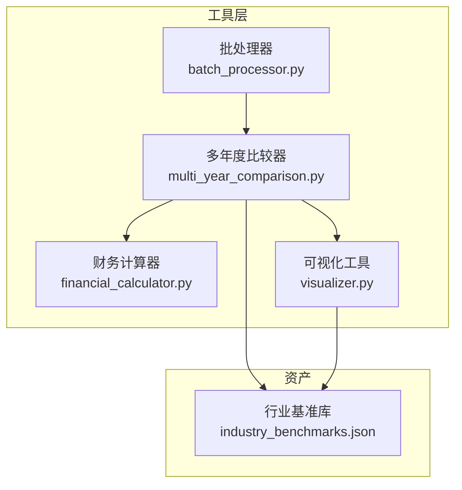
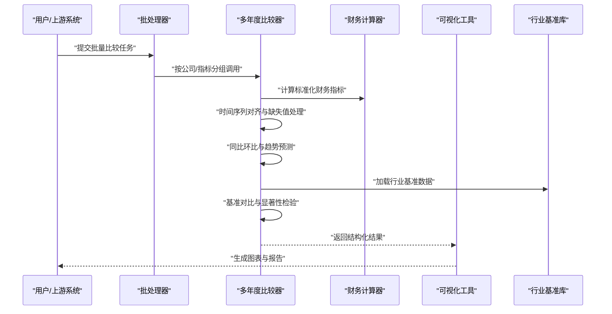
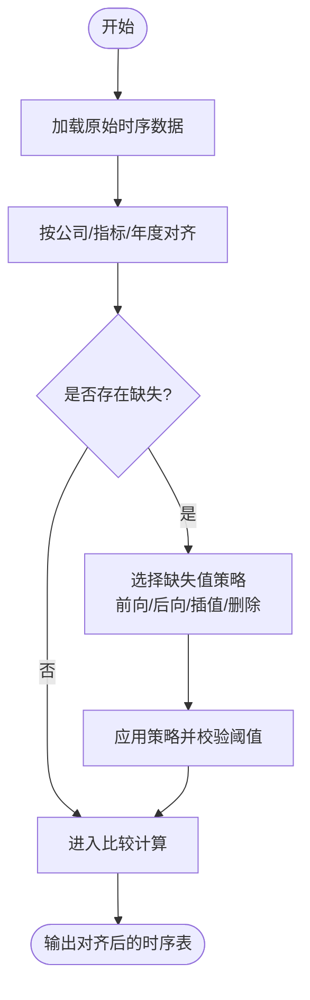
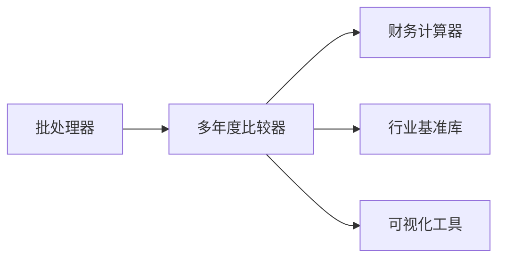

# 多年度比较器

<cite>
**本文引用的文件**   
- [multi_year_comparison.py](file://src/tools/multi_year_comparison.py)
- [financial_calculator.py](file://src/tools/financial_calculator.py)
- [visualizer.py](file://src/tools/visualizer.py)
- [batch_processor.py](file://src/tools/batch_processor.py)
- [industry_benchmarks.json](file://assets/industry_benchmarks.json)
</cite>

## 目录
1. [简介](#简介)
2. [项目结构](#项目结构)
3. [核心组件](#核心组件)
4. [架构总览](#架构总览)
5. [详细组件分析](#详细组件分析)
6. [依赖关系分析](#依赖关系分析)
7. [性能考虑](#性能考虑)
8. [故障排查指南](#故障排查指南)
9. [结论](#结论)
10. [附录](#附录)

## 简介
本文件为“多年度比较器”的权威技术文档，面向财务与数据分析场景，提供时间序列分析、同比环比计算、趋势预测算法、数据对齐机制、缺失值处理、异常值识别、比较维度配置、基准年份选择、差异显著性检验等完整说明。同时给出财务指标趋势分析、行业对比与增长模式识别的具体示例，并阐述与财务计算器、可视化工具的数据集成方式，以及自定义比较规则与统计检验方法的扩展路径。

## 项目结构
多年度比较器位于工具层，围绕以下关键文件组织：
- 多年度比较器：实现时间序列对齐、同比环比、趋势预测、显著性检验、基准年选择、行业对标等核心能力
- 财务计算器：提供标准化财务指标计算（如利润率、周转率、杠杆率等）
- 可视化工具：将比较结果渲染为图表，支持导出与交互
- 批处理器：对大规模公司或指标集合进行批量比较
- 行业基准库：提供行业基准数据用于横向对比

**图示来源**
- [multi_year_comparison.py](file://src/tools/multi_year_comparison.py)
- [financial_calculator.py](file://src/tools/financial_calculator.py)
- [visualizer.py](file://src/tools/visualizer.py)
- [batch_processor.py](file://src/tools/batch_processor.py)
- [industry_benchmarks.json](file://assets/industry_benchmarks.json)

**章节来源**
- [multi_year_comparison.py](file://src/tools/multi_year_comparison.py)
- [financial_calculator.py](file://src/tools/financial_calculator.py)
- [visualizer.py](file://src/tools/visualizer.py)
- [batch_processor.py](file://src/tools/batch_processor.py)
- [industry_benchmarks.json](file://assets/industry_benchmarks.json)

## 核心组件
- 多年度比较器
  - 负责时间序列对齐、同比环比计算、趋势预测、显著性检验、基准年选择、行业对标、输出结构化报告
- 财务计算器
  - 提供标准化财务指标计算，确保比较口径一致
- 可视化工具
  - 将比较结果生成图表，支持导出与交互展示
- 批处理器
  - 对多公司或多指标集合执行批量比较任务
- 行业基准库
  - 提供行业基准数据，用于横向对比与相对表现评估

**章节来源**
- [multi_year_comparison.py](file://src/tools/multi_year_comparison.py)
- [financial_calculator.py](file://src/tools/financial_calculator.py)
- [visualizer.py](file://src/tools/visualizer.py)
- [batch_processor.py](file://src/tools/batch_processor.py)
- [industry_benchmarks.json](file://assets/industry_benchmarks.json)

## 架构总览
多年度比较器以“输入标准化 → 指标计算 → 时序对齐 → 比较与检验 → 可视化与导出”为主线，结合行业基准库进行横向对比，并通过可视化工具输出可解释的分析结果。

**图示来源**
- [multi_year_comparison.py](file://src/tools/multi_year_comparison.py)
- [financial_calculator.py](file://src/tools/financial_calculator.py)
- [visualizer.py](file://src/tools/visualizer.py)
- [batch_processor.py](file://src/tools/batch_processor.py)
- [industry_benchmarks.json](file://assets/industry_benchmarks.json)

## 详细组件分析

### 多年度比较器
- 功能要点
  - 时间序列分析：统一年度粒度，构建连续时间轴，支持滚动窗口与移动平均
  - 同比环比计算：定义同比（YoY）与环比（MoM/QoQ/Year-over-Year）公式，支持多周期
  - 趋势预测：基于线性回归、指数平滑或ARIMA类方法，提供置信区间与预测不确定性
  - 数据对齐机制：按公司、指标、年度进行外连接对齐，保证跨主体可比性
  - 缺失值处理：前向填充、后向填充、插值、删除策略，支持按指标阈值控制
  - 异常值识别：基于IQR、Z-Score、稳健统计量检测，支持人工复核与剔除
  - 比较维度配置：支持按行业、地区、规模、业务线等多维分组
  - 基准年份选择：自动选择稳定期或加权平均基期，支持手动指定
  - 差异显著性检验：t检验、Mann-Whitney U检验、ANOVA、配对检验，支持多重比较校正
  - 行业对比：与行业基准库进行相对表现评估，输出分位数与排名
  - 输出与集成：结构化JSON/CSV、与可视化工具对接，支持导出PDF/图片

- 关键流程（时序对齐与缺失值处理）

**图示来源**
- [multi_year_comparison.py](file://src/tools/multi_year_comparison.py)

**章节来源**
- [multi_year_comparison.py](file://src/tools/multi_year_comparison.py)

### 财务计算器
- 功能要点
  - 标准化指标：利润表、资产负债表、现金流量表相关比率与绝对值
  - 口径一致性：统一会计政策与合并范围，避免跨期不可比
  - 批量计算：配合批处理器对多公司并行计算，提升吞吐
  - 输出规范：与多年度比较器的输入格式对齐，便于无缝集成

- 与比较器的集成点
  - 输入：原始财务报表或中间态指标
  - 输出：标准化指标时间序列，供比较器进行对齐与比较

**章节来源**
- [financial_calculator.py](file://src/tools/financial_calculator.py)

### 可视化工具
- 功能要点
  - 图表类型：折线图、柱状图、箱线图、热力图、瀑布图等
  - 交互能力：筛选维度、切换基准年、查看置信区间
  - 导出能力：PNG/SVG/PDF，支持嵌入报告
  - 与比较器对接：接收结构化结果，自动生成可视化

**章节来源**
- [visualizer.py](file://src/tools/visualizer.py)

### 批处理器
- 功能要点
  - 任务编排：按公司/指标/行业分组，并发执行比较任务
  - 资源管理：线程/进程池、限流与重试
  - 结果聚合：汇总各子任务结果，生成全局报告

**章节来源**
- [batch_processor.py](file://src/tools/batch_processor.py)

### 行业基准库
- 功能要点
  - 数据结构：行业分类、指标均值/中位数/分位数、样本量
  - 更新机制：定期刷新，版本化管理
  - 使用方式：在比较阶段加载，作为横向对比参考

**章节来源**
- [industry_benchmarks.json](file://assets/industry_benchmarks.json)

## 依赖关系分析
- 组件耦合
  - 多年度比较器依赖财务计算器与行业基准库，输出至可视化工具
  - 批处理器调度多年度比较器，形成“任务编排—执行—聚合”的闭环
- 外部依赖
  - 行业基准库为静态数据源，需保持版本一致
  - 可视化工具可能依赖前端或后端渲染引擎

**图示来源**
- [multi_year_comparison.py](file://src/tools/multi_year_comparison.py)
- [financial_calculator.py](file://src/tools/financial_calculator.py)
- [visualizer.py](file://src/tools/visualizer.py)
- [batch_processor.py](file://src/tools/batch_processor.py)
- [industry_benchmarks.json](file://assets/industry_benchmarks.json)

**章节来源**
- [multi_year_comparison.py](file://src/tools/multi_year_comparison.py)
- [financial_calculator.py](file://src/tools/financial_calculator.py)
- [visualizer.py](file://src/tools/visualizer.py)
- [batch_processor.py](file://src/tools/batch_processor.py)
- [industry_benchmarks.json](file://assets/industry_benchmarks.json)

## 性能考虑
- 时间复杂度
  - 对齐与缺失值处理：O(N×K)，N为观测数，K为指标维度
  - 同比环比：O(N×K)
  - 趋势预测：线性回归O(N)，指数平滑O(N)，ARIMA类O(N^2)或更高
  - 显著性检验：O(N)到O(N log N)取决于方法
- 空间复杂度
  - 对齐矩阵与中间结果占用内存，建议分批处理与增量计算
- 优化建议
  - 使用向量化运算与并行化（批处理器）
  - 缓存行业基准与已计算指标
  - 对长序列采用滑动窗口与降采样
  - 合理设置缺失值策略阈值，避免过度插值

[本节为通用指导，不直接分析具体文件]

## 故障排查指南
- 常见问题
  - 对齐失败：检查公司/指标/年度键是否一致，确认外连接策略
  - 缺失值过多：调整缺失值策略与阈值，必要时剔除低质量序列
  - 异常值误判：放宽IQR/Z-Score阈值，增加领域规则过滤
  - 显著性检验失效：样本量不足或方差齐性假设不满足，改用非参数检验
  - 基准年选择不合理：检查稳定性指标与权重分配，支持手动覆盖
- 定位步骤
  - 查看中间对齐表与缺失值标记
  - 打印异常值检测结果与剔除记录
  - 核对显著性检验方法与p值分布
  - 验证行业基准库版本与字段映射

**章节来源**
- [multi_year_comparison.py](file://src/tools/multi_year_comparison.py)

## 结论
多年度比较器通过标准化的指标计算、严谨的时间序列对齐、完善的缺失值与异常值处理、科学的趋势预测与显著性检验，以及与可视化工具和行业基准库的深度集成，为财务与经营分析提供了可靠、可扩展、可解释的比较能力。建议在复杂场景中结合领域规则与统计检验，持续优化基准年选择与预测模型，以获得更稳健的分析结论。

[本节为总结性内容，不直接分析具体文件]

## 附录

### 比较分析示例
- 财务指标趋势分析
  - 目标：观察毛利率、净利率、ROE等指标的多年走势
  - 步骤：标准化指标 → 对齐 → 计算同比环比 → 趋势预测 → 显著性检验 → 可视化
- 行业对比
  - 目标：评估公司在行业中的相对位置
  - 步骤：加载行业基准 → 计算分位数与排名 → 输出差距与显著性
- 增长模式识别
  - 目标：识别加速、减速、平台期等增长形态
  - 步骤：滑动窗口斜率与拐点检测 → 模式分类 → 可视化标注

[本节为概念性示例，不直接分析具体文件]

### 自定义比较规则与统计检验扩展
- 自定义规则
  - 新增指标口径：在财务计算器中扩展计算逻辑，确保与比较器输入格式兼容
  - 新增对齐策略：支持自定义键组合与对齐优先级
  - 新增缺失值策略：实现插值函数与阈值控制
  - 新增异常值规则：添加领域先验与混合检测
- 统计检验扩展
  - 新增检验方法：实现t检验、Mann-Whitney U、ANOVA、配对检验等接口
  - 多重比较校正：FDR/Bonferroni等方法
  - 结果输出：包含检验统计量、p值、效应量与置信区间

[本节为扩展指导，不直接分析具体文件]