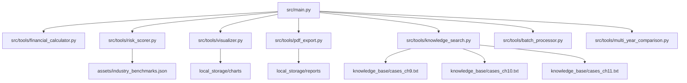
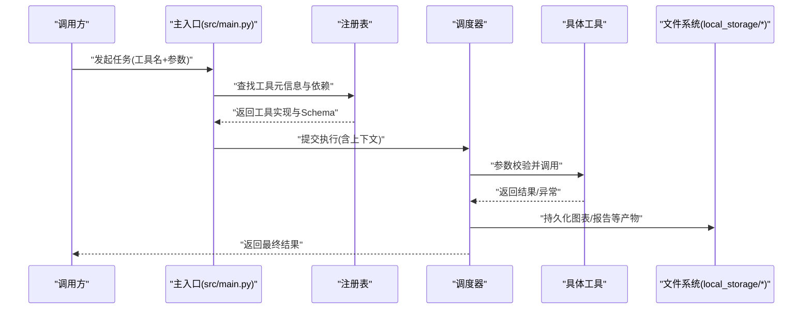
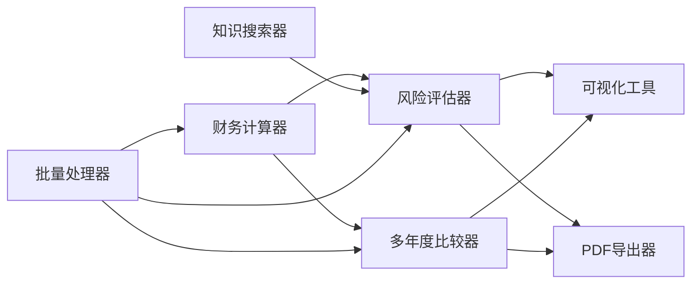

# 工具管理系统

<cite>
**本文引用的文件**   
- [src/tools/financial_calculator.py](file://src/tools/financial_calculator.py)
- [src/tools/risk_scorer.py](file://src/tools/risk_scorer.py)
- [src/tools/visualizer.py](file://src/tools/visualizer.py)
- [src/tools/pdf_export.py](file://src/tools/pdf_export.py)
- [src/tools/knowledge_search.py](file://src/tools/knowledge_search.py)
- [src/tools/batch_processor.py](file://src/tools/batch_processor.py)
- [src/tools/multi_year_comparison.py](file://src/tools/multi_year_comparison.py)
- [src/main.py](file://src/main.py)
- [assets/industry_benchmarks.json](file://assets/industry_benchmarks.json)
- [knowledge_base/cases_ch9.txt](file://knowledge_base/cases_ch9.txt)
- [knowledge_base/cases_ch10.txt](file://knowledge_base/cases_ch10.txt)
- [knowledge_base/cases_ch11.txt](file://knowledge_base/cases_ch11.txt)
- [local_storage/charts](file://local_storage/charts)
- [local_storage/reports](file://local_storage/reports)
</cite>

## 目录
1. [简介](#简介)
2. [项目结构](#项目结构)
3. [核心组件](#核心组件)
4. [架构总览](#架构总览)
5. [详细组件分析](#详细组件分析)
6. [依赖关系分析](#依赖关系分析)
7. [性能考量](#性能考量)
8. [故障排查指南](#故障排查指南)
9. [结论](#结论)
10. [附录](#附录)

## 简介
本文件面向智能审计风险识别系统的“工具管理系统”，聚焦以下目标：
- 解释工具的注册机制与动态发现、执行框架
- 描述各核心工具模块的功能与接口：财务计算器、风险评估器、可视化工具、PDF导出器、知识搜索器、批量处理器、多年度比较器
- 说明标准化接口设计与参数传递机制
- 梳理工具间依赖关系与数据流转
- 提供工具开发指南与最佳实践，并给出使用示例与集成模式

## 项目结构
系统采用按功能分层的组织方式，工具位于 src/tools 下，主入口在 src/main.py。静态资源（行业基准）位于 assets，知识库文本位于 knowledge_base，图表与报告输出默认落盘到 local_storage。

图示来源
- [src/main.py](file://src/main.py)
- [src/tools/financial_calculator.py](file://src/tools/financial_calculator.py)
- [src/tools/risk_scorer.py](file://src/tools/risk_scorer.py)
- [src/tools/visualizer.py](file://src/tools/visualizer.py)
- [src/tools/pdf_export.py](file://src/tools/pdf_export.py)
- [src/tools/knowledge_search.py](file://src/tools/knowledge_search.py)
- [src/tools/batch_processor.py](file://src/tools/batch_processor.py)
- [src/tools/multi_year_comparison.py](file://src/tools/multi_year_comparison.py)
- [assets/industry_benchmarks.json](file://assets/industry_benchmarks.json)
- [knowledge_base/cases_ch9.txt](file://knowledge_base/cases_ch9.txt)
- [knowledge_base/cases_ch10.txt](file://knowledge_base/cases_ch10.txt)
- [knowledge_base/cases_ch11.txt](file://knowledge_base/cases_ch11.txt)
- [local_storage/charts](file://local_storage/charts)
- [local_storage/reports](file://local_storage/reports)

章节来源
- [src/main.py](file://src/main.py)
- [src/tools/financial_calculator.py](file://src/tools/financial_calculator.py)
- [src/tools/risk_scorer.py](file://src/tools/risk_scorer.py)
- [src/tools/visualizer.py](file://src/tools/visualizer.py)
- [src/tools/pdf_export.py](file://src/tools/pdf_export.py)
- [src/tools/knowledge_search.py](file://src/tools/knowledge_search.py)
- [src/tools/batch_processor.py](file://src/tools/batch_processor.py)
- [src/tools/multi_year_comparison.py](file://src/tools/multi_year_comparison.py)
- [assets/industry_benchmarks.json](file://assets/industry_benchmarks.json)
- [knowledge_base/cases_ch9.txt](file://knowledge_base/cases_ch9.txt)
- [knowledge_base/cases_ch10.txt](file://knowledge_base/cases_ch10.txt)
- [knowledge_base/cases_ch11.txt](file://knowledge_base/cases_ch11.txt)
- [local_storage/charts](file://local_storage/charts)
- [local_storage/reports](file://local_storage/reports)

## 核心组件
本节概述工具管理系统的核心能力与约定：
- 统一工具接口：每个工具暴露一致的调用契约（输入参数规范、返回结果结构、错误码约定），便于编排与替换
- 注册与发现：通过集中式注册表维护工具元信息（名称、版本、入参/出参Schema、依赖声明），支持运行时动态加载与按需实例化
- 执行框架：负责参数校验、上下文注入、依赖解析、并发控制、结果聚合与持久化
- 数据流：以结构化对象在工具间传递，避免强耦合；IO类操作（图表、报告）通过路径或句柄进行解耦

章节来源
- [src/main.py](file://src/main.py)
- [src/tools/batch_processor.py](file://src/tools/batch_processor.py)

## 架构总览
下图展示工具管理与执行的整体流程：主入口完成初始化与注册，调度器根据请求选择工具，执行前进行参数校验与依赖准备，执行后统一归档结果。

图示来源
- [src/main.py](file://src/main.py)
- [src/tools/batch_processor.py](file://src/tools/batch_processor.py)
- [local_storage/charts](file://local_storage/charts)
- [local_storage/reports](file://local_storage/reports)

## 详细组件分析

### 财务计算器（比率分析与趋势计算）
- 功能要点
  - 比率分析：基于输入的财务报表字段计算关键指标（如流动性、盈利能力、杠杆率等）
  - 趋势计算：对多期数据进行同比/环比、移动平均、增长率等时序分析
- 输入/输出约定
  - 输入：期间列表、指标字典、可选权重与阈值配置
  - 输出：指标明细、趋势序列、异常标记与置信度
- 典型用法
  - 作为风险评估器的上游数据源
  - 与可视化工具联动生成趋势图
- 注意事项
  - 缺失值处理策略需可配置
  - 数值精度与单位一致性校验

章节来源
- [src/tools/financial_calculator.py](file://src/tools/financial_calculator.py)

### 风险评估器（多维度评分模型）
- 功能要点
  - 多维评分：结合财务指标、行业基准、案例相似度等多维度打分
  - 基准对比：读取行业基准文件进行相对位置评估
- 输入/输出约定
  - 输入：财务指标、企业画像、行业代码、评分权重
  - 输出：综合风险等级、分项得分、依据说明
- 典型用法
  - 接收财务计算器输出，结合行业基准与知识搜索结果进行综合判断
- 注意事项
  - 权重更新需具备版本化管理
  - 基准数据变更应触发重新评分

章节来源
- [src/tools/risk_scorer.py](file://src/tools/risk_scorer.py)
- [assets/industry_benchmarks.json](file://assets/industry_benchmarks.json)

### 可视化工具（图表生成）
- 功能要点
  - 将结构化数据转换为图表（折线、柱状、雷达等）
  - 支持主题、尺寸、标注等样式配置
- 输入/输出约定
  - 输入：数据集、图表类型、样式选项
  - 输出：图表文件路径或二进制流
- 典型用法
  - 消费财务计算器的趋势结果与风险评估的分项得分
- 注意事项
  - 大数据量时建议分页或采样渲染
  - 输出路径需遵循命名规范以便后续检索

章节来源
- [src/tools/visualizer.py](file://src/tools/visualizer.py)
- [local_storage/charts](file://local_storage/charts)

### PDF导出器（报告模板）
- 功能要点
  - 将结构化报告内容渲染为PDF
  - 支持模板变量替换、页眉页脚、附件嵌入
- 输入/输出约定
  - 输入：报告数据、模板标识、渲染选项
  - 输出：PDF文件路径或字节流
- 典型用法
  - 汇总财务指标、风险评分与图表引用，生成审计底稿或对外报告
- 注意事项
  - 模板版本应与报告结构同步演进
  - 大文档渲染需考虑内存占用与超时

章节来源
- [src/tools/pdf_export.py](file://src/tools/pdf_export.py)
- [local_storage/reports](file://local_storage/reports)

### 知识搜索器（语义匹配）
- 功能要点
  - 基于知识库文本进行语义检索与相似性匹配
  - 支持关键词扩展、相关性排序与片段高亮
- 输入/输出约定
  - 输入：查询语句、TopK、相似度阈值
  - 输出：命中条目列表（含来源、分数、摘要）
- 典型用法
  - 为风险评估器提供案例参考与规则依据
- 注意事项
  - 知识库增量更新需重建索引
  - 长文本检索建议分段与缓存热点片段

章节来源
- [src/tools/knowledge_search.py](file://src/tools/knowledge_search.py)
- [knowledge_base/cases_ch9.txt](file://knowledge_base/cases_ch9.txt)
- [knowledge_base/cases_ch10.txt](file://knowledge_base/cases_ch10.txt)
- [knowledge_base/cases_ch11.txt](file://knowledge_base/cases_ch11.txt)

### 批量处理器（并发任务）
- 功能要点
  - 提供统一的并发执行框架，支持任务队列、限流、重试与熔断
  - 聚合多个子任务结果，支持失败隔离与部分成功
- 输入/输出约定
  - 输入：任务清单、并发度、超时与重试策略
  - 输出：任务结果集、错误日志、统计指标
- 典型用法
  - 并行执行多公司或多年度的财务计算与风险评估
- 注意事项
  - 合理设置并发度以避免下游资源争用
  - 记录详细执行轨迹便于回溯

章节来源
- [src/tools/batch_processor.py](file://src/tools/batch_processor.py)

### 多年度比较器
- 功能要点
  - 对齐多年度的财务与风险指标，进行跨期对比与差异归因
  - 输出年度间变化矩阵与显著性提示
- 输入/输出约定
  - 输入：多年度数据集、对比维度、显著性阈值
  - 输出：对比结果、差异明细、可视化数据
- 典型用法
  - 驱动可视化工具生成年际趋势与雷达对比图
- 注意事项
  - 口径一致性与会计政策变更需做调整映射

章节来源
- [src/tools/multi_year_comparison.py](file://src/tools/multi_year_comparison.py)

## 依赖关系分析
- 直接依赖
  - 风险评估器依赖行业基准数据
  - 可视化工具与PDF导出器依赖本地存储路径
  - 知识搜索器依赖知识库文本
- 间接依赖
  - 多年度比较器通常依赖财务计算器与风险评估器
  - 批量处理器作为横切能力被多个工具复用
- 循环依赖
  - 工具之间应避免双向依赖，通过共享数据结构与事件/消息解耦

图示来源
- [src/tools/financial_calculator.py](file://src/tools/financial_calculator.py)
- [src/tools/risk_scorer.py](file://src/tools/risk_scorer.py)
- [src/tools/visualizer.py](file://src/tools/visualizer.py)
- [src/tools/pdf_export.py](file://src/tools/pdf_export.py)
- [src/tools/knowledge_search.py](file://src/tools/knowledge_search.py)
- [src/tools/batch_processor.py](file://src/tools/batch_processor.py)
- [src/tools/multi_year_comparison.py](file://src/tools/multi_year_comparison.py)

章节来源
- [src/tools/financial_calculator.py](file://src/tools/financial_calculator.py)
- [src/tools/risk_scorer.py](file://src/tools/risk_scorer.py)
- [src/tools/visualizer.py](file://src/tools/visualizer.py)
- [src/tools/pdf_export.py](file://src/tools/pdf_export.py)
- [src/tools/knowledge_search.py](file://src/tools/knowledge_search.py)
- [src/tools/batch_processor.py](file://src/tools/batch_processor.py)
- [src/tools/multi_year_comparison.py](file://src/tools/multi_year_comparison.py)

## 性能考量
- 并发与限流
  - 使用批量处理器对CPU密集型任务（财务计算、评分）进行并发控制
  - 对I/O密集型任务（图表渲染、PDF导出）设置独立线程池与超时
- 缓存与去重
  - 对行业基准、知识检索结果建立缓存层，减少重复计算与IO
- 数据序列化
  - 工具间传输尽量使用轻量级结构体，避免大对象拷贝
- 资源回收
  - 及时释放临时文件与连接，防止磁盘与内存泄漏

[本节为通用指导，不直接分析具体文件]

## 故障排查指南
- 常见问题定位
  - 参数校验失败：检查入参Schema与必填字段
  - 依赖缺失：确认行业基准与知识库路径可用
  - 并发异常：查看批量处理器错误日志与重试次数
  - 输出不可见：核对本地存储目录权限与路径
- 诊断手段
  - 开启详细日志，记录工具名、入参摘要、耗时与异常堆栈
  - 对关键步骤增加断点与中间产物快照
  - 使用最小复现用例隔离问题范围

章节来源
- [src/tools/batch_processor.py](file://src/tools/batch_processor.py)
- [src/tools/risk_scorer.py](file://src/tools/risk_scorer.py)
- [src/tools/knowledge_search.py](file://src/tools/knowledge_search.py)
- [src/tools/visualizer.py](file://src/tools/visualizer.py)
- [src/tools/pdf_export.py](file://src/tools/pdf_export.py)

## 结论
本工具管理系统通过统一接口、注册发现与执行框架，实现了工具的可插拔与可编排。财务计算器、风险评估器、可视化工具、PDF导出器、知识搜索器、批量处理器与多年度比较器各司其职并通过清晰的数据契约协作。遵循本文的开发指南与最佳实践，可快速扩展新工具并保持系统稳定与高性能。

[本节为总结性内容，不直接分析具体文件]

## 附录

### 工具标准化接口设计（概念）
- 元信息：名称、版本、描述、作者、许可证
- 入参Schema：字段名、类型、默认值、约束、示例
- 出参Schema：字段名、类型、含义、枚举值
- 错误约定：错误码、错误级别、可恢复性、重试策略
- 生命周期：初始化、运行、销毁钩子

[本节为概念性说明，不直接分析具体文件]

### 参数传递机制（概念）
- 推荐以JSON兼容的结构体在工具间传递
- 复杂对象采用只读视图或浅拷贝，避免意外修改
- 大对象优先使用文件路径或流式接口

[本节为概念性说明，不直接分析具体文件]

### 工具开发指南与最佳实践
- 明确职责边界，单一职责原则
- 严格定义并校验入参/出参Schema
- 幂等设计，支持重试与回滚
- 可观测性：埋点、指标、日志
- 可测试性：单元测试、集成测试、Mock外部依赖
- 可配置性：开关、阈值、路径等通过配置注入

[本节为概念性说明，不直接分析具体文件]

### 使用示例与集成模式（概念）
- 单工具调用：直接传入参数并获取结果
- 流水线编排：财务计算 → 风险评估 → 可视化/PDF导出
- 批处理模式：批量处理器分发多公司/多年度任务，聚合结果
- 异步回调：任务完成后通知上层服务

[本节为概念性说明，不直接分析具体文件]