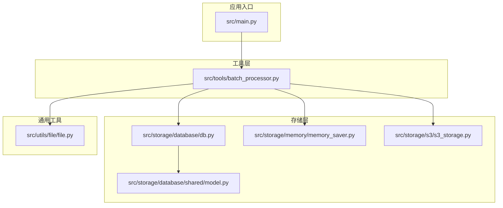
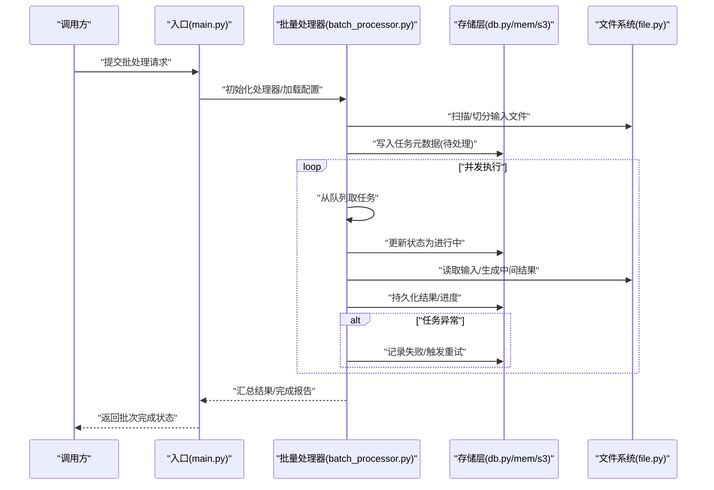
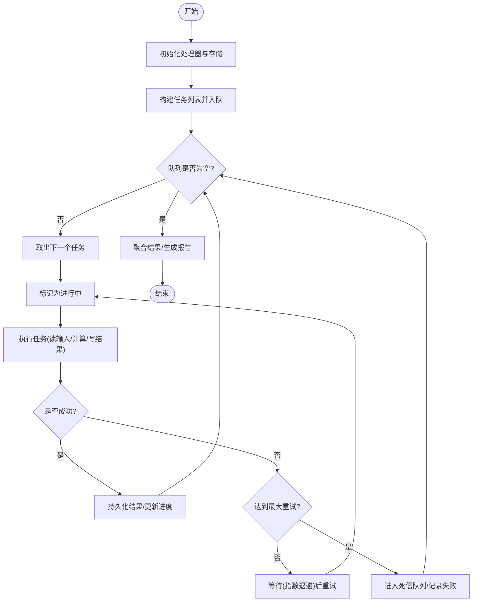
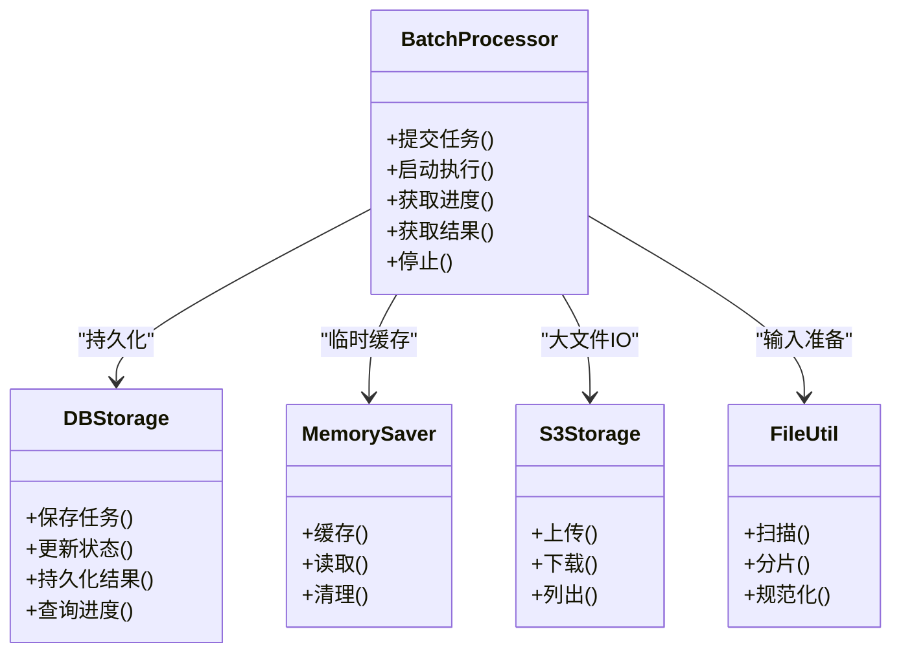

# 批量处理器

<cite>
**本文引用的文件**   
- [batch_processor.py](file://src/tools/batch_processor.py)
- [db.py](file://src/storage/database/db.py)
- [model.py](file://src/storage/database/shared/model.py)
- [memory_saver.py](file://src/storage/memory/memory_saver.py)
- [s3_storage.py](file://src/storage/s3/s3_storage.py)
- [file.py](file://src/utils/file/file.py)
- [main.py](file://src/main.py)
</cite>

## 目录
1. [简介](#简介)
2. [项目结构](#项目结构)
3. [核心组件](#核心组件)
4. [架构总览](#架构总览)
5. [详细组件分析](#详细组件分析)
6. [依赖关系分析](#依赖关系分析)
7. [性能考虑](#性能考虑)
8. [故障排查指南](#故障排查指南)
9. [结论](#结论)
10. [附录](#附录)

## 简介
本文件围绕“批量处理器”进行系统化文档化，重点覆盖并发任务调度、资源管理、错误恢复机制；深入解析任务队列设计、工作进程池配置与负载均衡策略；说明任务状态跟踪、进度监控与失败重试逻辑；提供大规模文件处理、异步任务提交与结果聚合等批处理示例；解释与存储层的集成和数据持久化方案；并给出性能调优、内存管理与分布式扩展指南。

## 项目结构
仓库中与批量处理相关的关键路径如下：
- 工具层：src/tools/batch_processor.py（批量处理核心）
- 存储层：
  - 数据库：src/storage/database/db.py、src/storage/database/shared/model.py
  - 内存：src/storage/memory/memory_saver.py
  - 对象存储：src/storage/s3/s3_storage.py
- 通用工具：src/utils/file/file.py
- 入口：src/main.py

图表来源
- [main.py](file://src/main.py)
- [batch_processor.py](file://src/tools/batch_processor.py)
- [db.py](file://src/storage/database/db.py)
- [model.py](file://src/storage/database/shared/model.py)
- [memory_saver.py](file://src/storage/memory/memory_saver.py)
- [s3_storage.py](file://src/storage/s3/s3_storage.py)
- [file.py](file://src/utils/file/file.py)

章节来源
- [batch_processor.py](file://src/tools/batch_processor.py)
- [db.py](file://src/storage/database/db.py)
- [model.py](file://src/storage/database/shared/model.py)
- [memory_saver.py](file://src/storage/memory/memory_saver.py)
- [s3_storage.py](file://src/storage/s3/s3_storage.py)
- [file.py](file://src/utils/file/file.py)
- [main.py](file://src/main.py)

## 核心组件
- 批量处理器（BatchProcessor）
  - 负责任务入队、并发执行、结果收集、错误重试与持久化。
  - 支持基于进程/线程的并发模型与工作池大小控制。
  - 提供进度回调与状态追踪接口，便于上层监控。
- 存储抽象与实现
  - 数据库持久化：用于任务元数据、结果与审计日志。
  - 内存保存器：轻量级临时状态缓存，适合短生命周期任务。
  - S3 对象存储：大文件输入/输出、中间产物落盘。
- 文件工具
  - 提供文件扫描、分片、路径规范化等能力，支撑大规模文件批处理。

章节来源
- [batch_processor.py](file://src/tools/batch_processor.py)
- [db.py](file://src/storage/database/db.py)
- [memory_saver.py](file://src/storage/memory/memory_saver.py)
- [s3_storage.py](file://src/storage/s3/s3_storage.py)
- [file.py](file://src/utils/file/file.py)

## 架构总览
批量处理器的整体调用链与数据流如下：

图表来源
- [main.py](file://src/main.py)
- [batch_processor.py](file://src/tools/batch_processor.py)
- [db.py](file://src/storage/database/db.py)
- [memory_saver.py](file://src/storage/memory/memory_saver.py)
- [s3_storage.py](file://src/storage/s3/s3_storage.py)
- [file.py](file://src/utils/file/file.py)

## 详细组件分析

### 批量处理器（BatchProcessor）
职责与特性
- 任务队列：内部维护任务集合，支持按优先级或分区顺序消费。
- 并发模型：可配置的工作进程/线程池，限制最大并发度，避免资源耗尽。
- 负载均衡：采用轮询/最少连接/最小负载策略之一，将任务均匀分发到工作单元。
- 状态跟踪：每个任务具备唯一标识与状态机（待处理/进行中/成功/失败），并提供进度回调。
- 错误恢复：对失败任务实施指数退避重试，支持最大重试次数与死信队列。
- 结果聚合：支持增量聚合与最终汇总，便于导出报表或回写存储。

关键流程（算法视角）

图表来源
- [batch_processor.py](file://src/tools/batch_processor.py)

章节来源
- [batch_processor.py](file://src/tools/batch_processor.py)

### 存储层集成
- 数据库持久化（db.py / model.py）
  - 用途：任务元数据、结果表、审计日志、重试计数与最后错误信息。
  - 事务性：建议以事务包裹“状态更新+结果写入”，保证一致性。
  - 索引优化：针对任务ID、批次ID、状态字段建立索引，加速查询与统计。
- 内存保存器（memory_saver.py）
  - 用途：短期缓存（如去重键、中间聚合缓冲）。
  - 注意：需设置上限与淘汰策略，防止内存泄漏。
- S3 对象存储（s3_storage.py）
  - 用途：大文件输入/输出、中间产物归档。
  - 建议：使用分块上传/下载、断点续传与压缩传输，降低带宽占用。

章节来源
- [db.py](file://src/storage/database/db.py)
- [model.py](file://src/storage/database/shared/model.py)
- [memory_saver.py](file://src/storage/memory/memory_saver.py)
- [s3_storage.py](file://src/storage/s3/s3_storage.py)

### 文件工具（file.py）
- 功能要点
  - 目录遍历与过滤：按后缀/正则匹配目标文件集。
  - 分片策略：按文件大小或行数切分为子任务，提升并行度。
  - 路径规范化：跨平台兼容与相对/绝对路径转换。
- 与批量处理器协作
  - 预处理阶段由文件工具产出任务清单，再由批量处理器入队与调度。

章节来源
- [file.py](file://src/utils/file/file.py)

### 入口与编排（main.py）
- 作用
  - 解析参数/配置，初始化存储与处理器实例。
  - 启动批处理流程，捕获顶层异常并输出运行摘要。
- 与存储交互
  - 在启动时创建必要表/桶，确保幂等初始化。

章节来源
- [main.py](file://src/main.py)

## 依赖关系分析

图表来源
- [batch_processor.py](file://src/tools/batch_processor.py)
- [db.py](file://src/storage/database/db.py)
- [memory_saver.py](file://src/storage/memory/memory_saver.py)
- [s3_storage.py](file://src/storage/s3/s3_storage.py)
- [file.py](file://src/utils/file/file.py)

章节来源
- [batch_processor.py](file://src/tools/batch_processor.py)
- [db.py](file://src/storage/database/db.py)
- [memory_saver.py](file://src/storage/memory/memory_saver.py)
- [s3_storage.py](file://src/storage/s3/s3_storage.py)
- [file.py](file://src/utils/file/file.py)

## 性能考虑
- 并发度与资源
  - 根据CPU核数与I/O类型调整工作池大小；CPU密集型建议接近物理核数，I/O密集型可适当放大。
  - 限制单任务内存峰值，必要时启用分块读取与惰性加载。
- 存储层优化
  - 数据库：批量插入/更新、合理索引、读写分离（若可用）。
  - S3：开启压缩、复用连接、使用预签名URL减少鉴权开销。
- 任务粒度
  - 将大任务拆分为更细粒度的子任务，提高吞吐与容错性。
- 背压与限流
  - 当下游存储或外部服务受限，增加令牌桶/漏桶限流，避免雪崩。
- 监控与度量
  - 暴露关键指标：队列长度、成功率、平均耗时、重试率、内存/CPU占用。

[本节为通用指导，不直接分析具体文件]

## 故障排查指南
- 常见问题定位
  - 任务堆积：检查队列消费速率、工作池大小、下游依赖延迟。
  - 频繁重试：查看失败原因、退避策略是否合理、是否存在幂等问题。
  - 内存溢出：确认分片大小、缓存上限、是否及时释放引用。
- 诊断手段
  - 通过进度接口拉取任务状态分布，识别卡住的任务。
  - 检查存储层错误码与日志，结合任务ID回溯完整链路。
- 恢复策略
  - 对可重试任务自动重试；不可重试任务进入死信队列，人工介入。
  - 支持断点续跑：基于已持久化的结果与进度，跳过已完成任务。

章节来源
- [batch_processor.py](file://src/tools/batch_processor.py)
- [db.py](file://src/storage/database/db.py)
- [memory_saver.py](file://src/storage/memory/memory_saver.py)
- [s3_storage.py](file://src/storage/s3/s3_storage.py)

## 结论
本批量处理器通过清晰的分层设计与可扩展的存储抽象，实现了高吞吐、可观测、可恢复的批处理能力。配合合理的并发与资源策略、完善的错误恢复与重试机制，以及面向大文件的分片与对象存储集成，能够稳定支撑大规模数据处理场景。建议在上线前完善监控告警与容量规划，持续迭代优化。

[本节为总结性内容，不直接分析具体文件]

## 附录

### 典型批处理示例（概念性步骤）
- 大规模文件处理
  - 使用文件工具扫描并分片，生成子任务清单。
  - 批量处理器入队并发执行，结果落盘至S3，元数据持久化至数据库。
- 异步任务提交
  - 调用方提交任务后立即获得任务ID，后续通过进度接口轮询或订阅回调。
- 结果聚合
  - 各子任务完成后，按批次维度聚合指标，生成汇总报告并持久化。

[本节为概念性说明，不直接分析具体文件]