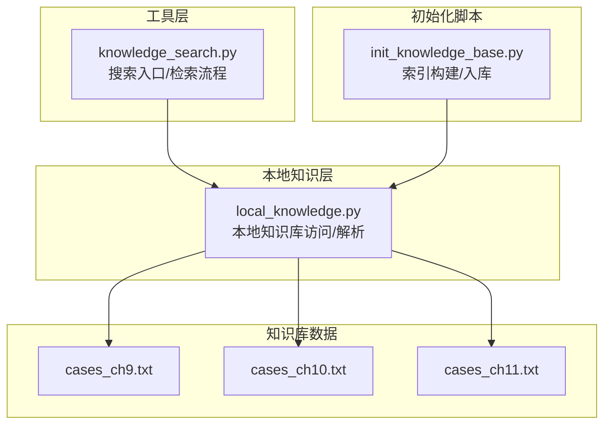
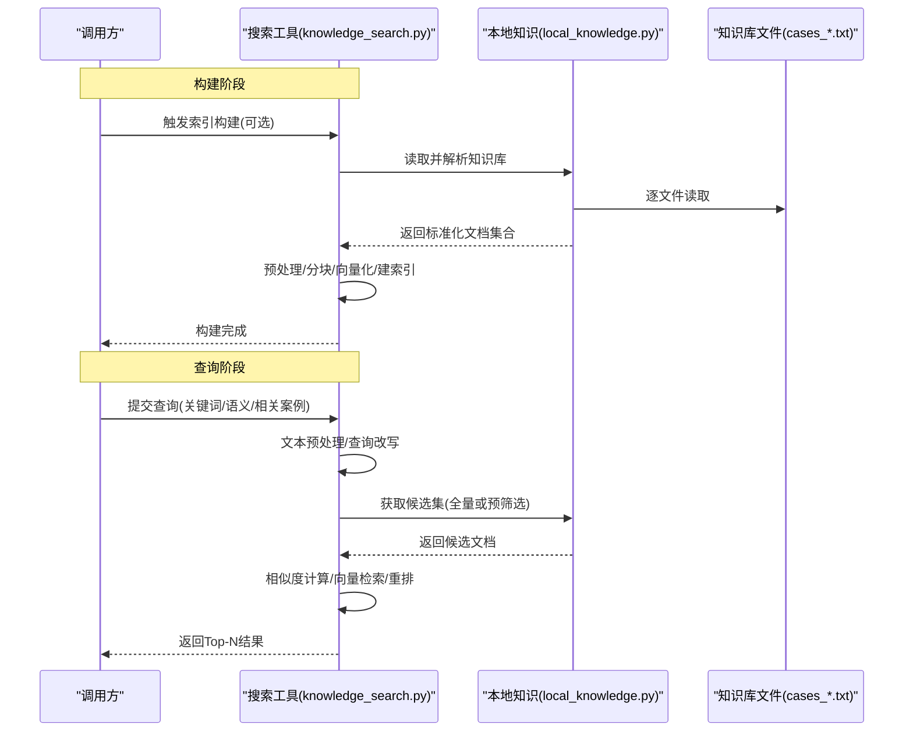
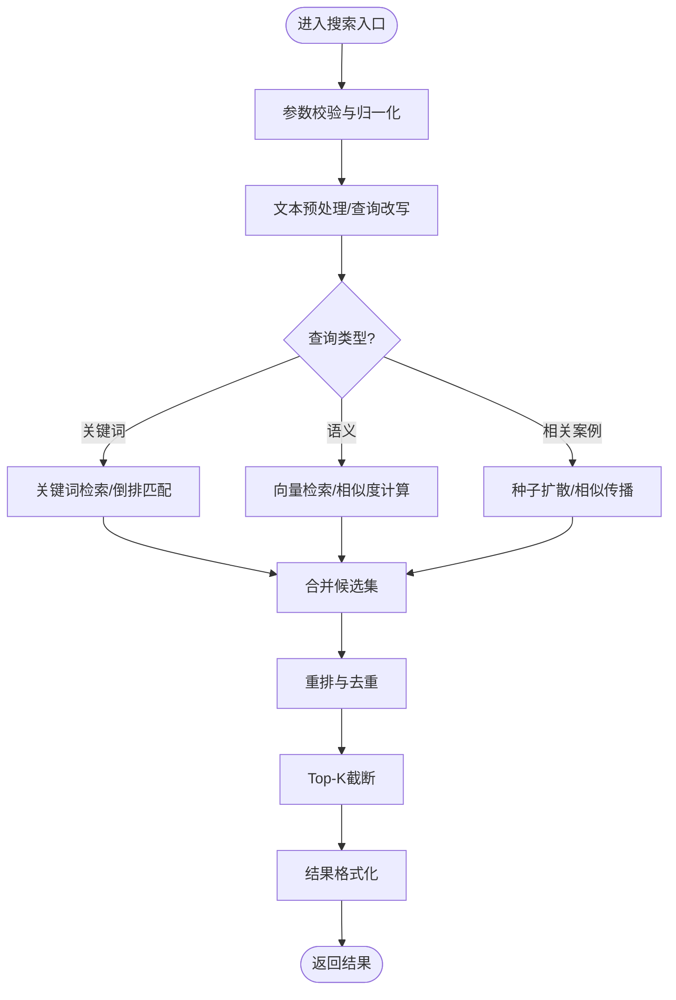
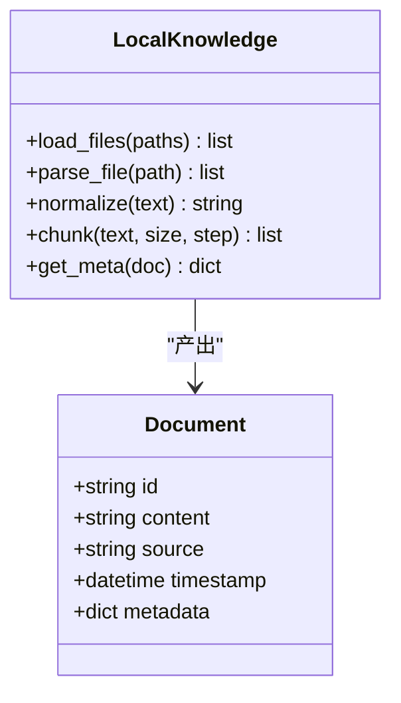
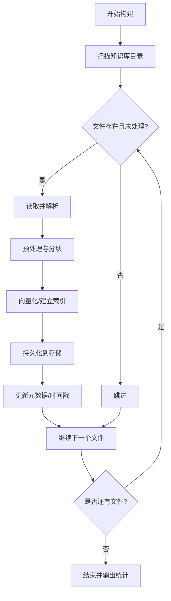
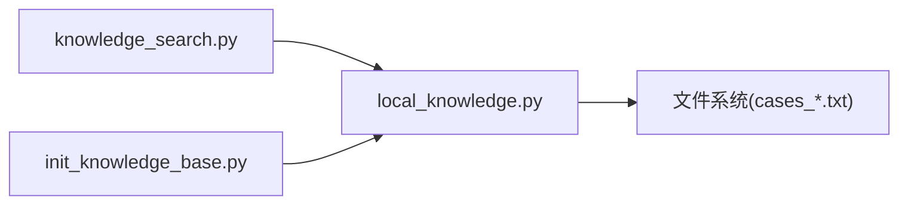

# 知识搜索器

<cite>
**本文引用的文件**   
- [knowledge_search.py](file://src/tools/knowledge_search.py)
- [local_knowledge.py](file://src/local_knowledge.py)
- [init_knowledge_base.py](file://scripts/init_knowledge_base.py)
- [cases_ch9.txt](file://knowledge_base/cases_ch9.txt)
- [cases_ch10.txt](file://knowledge_base/cases_ch10.txt)
- [cases_ch11.txt](file://knowledge_base/cases_ch11.txt)
</cite>

## 目录
1. [简介](#简介)
2. [项目结构](#项目结构)
3. [核心组件](#核心组件)
4. [架构总览](#架构总览)
5. [详细组件分析](#详细组件分析)
6. [依赖关系分析](#依赖关系分析)
7. [性能考虑](#性能考虑)
8. [故障排查指南](#故障排查指南)
9. [结论](#结论)
10. [附录](#附录)

## 简介
本文件为“知识搜索器”的完整技术文档，聚焦于语义相似度匹配与向量检索机制。内容覆盖知识库索引构建、查询处理、结果排序策略、文本预处理、特征提取、相似度计算的具体实现路径；并提供关键词搜索、语义查询和相关案例推荐的示例说明；同时阐述与本地知识库的数据同步与增量更新机制，以及搜索性能优化、缓存策略与扩展性设计建议。

## 项目结构
围绕知识搜索能力，仓库中与检索相关的关键位置如下：
- 工具层：提供搜索接口与检索流程编排
- 本地知识层：封装对本地知识库文件的访问与解析
- 初始化脚本：负责将原始知识库构建为可检索的索引
- 知识库数据：以纯文本形式存放的案例片段

图表来源
- [knowledge_search.py](file://src/tools/knowledge_search.py)
- [local_knowledge.py](file://src/local_knowledge.py)
- [init_knowledge_base.py](file://scripts/init_knowledge_base.py)
- [cases_ch9.txt](file://knowledge_base/cases_ch9.txt)
- [cases_ch10.txt](file://knowledge_base/cases_ch10.txt)
- [cases_ch11.txt](file://knowledge_base/cases_ch11.txt)

章节来源
- [knowledge_search.py](file://src/tools/knowledge_search.py)
- [local_knowledge.py](file://src/local_knowledge.py)
- [init_knowledge_base.py](file://scripts/init_knowledge_base.py)
- [cases_ch9.txt](file://knowledge_base/cases_ch9.txt)
- [cases_ch10.txt](file://knowledge_base/cases_ch10.txt)
- [cases_ch11.txt](file://knowledge_base/cases_ch11.txt)

## 核心组件
- 搜索工具模块
  - 职责：对外暴露搜索API（关键词、语义、相关案例），组织检索流程，调用本地知识层进行数据读取与过滤，返回排序后的结果。
  - 关键流程：参数校验→文本预处理→索引/向量检索→重排与截断→结果组装。
- 本地知识层
  - 职责：加载并解析本地知识库文本文件，按段落或条目切分，提供面向搜索的文档集合与元数据。
  - 关键点：编码与换行处理、空白字符规范化、空段过滤、分段粒度控制。
- 初始化脚本
  - 职责：扫描知识库目录，读取文本，执行预处理与分块，生成索引或向量表示，持久化到存储后端（如内存或磁盘）。
  - 关键点：幂等重建、增量标记、失败重试与日志记录。

章节来源
- [knowledge_search.py](file://src/tools/knowledge_search.py)
- [local_knowledge.py](file://src/local_knowledge.py)
- [init_knowledge_base.py](file://scripts/init_knowledge_base.py)

## 架构总览
知识搜索器的整体架构由“索引构建期”和“查询服务期”两部分组成。构建期由初始化脚本驱动，将原始文本转换为可检索的结构；查询期由搜索工具模块接收请求，完成预处理、检索与排序后返回结果。

图表来源
- [knowledge_search.py](file://src/tools/knowledge_search.py)
- [local_knowledge.py](file://src/local_knowledge.py)
- [cases_ch9.txt](file://knowledge_base/cases_ch9.txt)
- [cases_ch10.txt](file://knowledge_base/cases_ch10.txt)
- [cases_ch11.txt](file://knowledge_base/cases_ch11.txt)

## 详细组件分析

### 搜索工具模块（knowledge_search.py）
- 功能要点
  - 支持三类查询：关键词搜索、语义查询、相关案例推荐。
  - 统一入口：根据查询类型选择不同检索路径，最终输出一致的排序结果。
  - 结果排序：基于相似度得分与业务规则（如命中权重、时间衰减、去重）综合排序。
- 关键流程
  - 输入校验与参数归一化
  - 文本预处理（清洗、分词、停用词、同义词扩展）
  - 检索策略
    - 关键词：倒排索引或布尔匹配
    - 语义：向量检索（ANN近似最近邻）
    - 相关案例：基于种子文档的相似扩散
  - 重排与截断：Top-K截断、多样性打散、去重
  - 结果组装：包含摘要、来源、得分、标签等元信息

图表来源
- [knowledge_search.py](file://src/tools/knowledge_search.py)

章节来源
- [knowledge_search.py](file://src/tools/knowledge_search.py)

### 本地知识层（local_knowledge.py）
- 功能要点
  - 从本地知识库目录加载文本文件，按段落或固定长度切分为文档片段。
  - 提供统一的文档模型（含ID、内容、来源、时间戳、标签等）。
  - 支持增量扫描：仅处理新增或变更的文件。
- 数据处理
  - 编码检测与统一转码
  - 空白与标点规范化
  - 空段过滤与最小长度阈值
  - 分段策略：按段落/句子/固定窗口滑动

图表来源
- [local_knowledge.py](file://src/local_knowledge.py)

章节来源
- [local_knowledge.py](file://src/local_knowledge.py)

### 初始化脚本（init_knowledge_base.py）
- 功能要点
  - 扫描知识库目录，遍历所有待处理的文本文件。
  - 调用本地知识层进行解析与分块，生成索引或向量表示。
  - 支持幂等重建与增量更新：对比文件哈希或时间戳，仅更新变更部分。
  - 错误处理：记录失败文件、跳过异常、保留已构建进度。
- 典型步骤
  - 发现文件 → 解析分块 → 预处理 → 向量化/建索引 → 持久化 → 统计与日志

图表来源
- [init_knowledge_base.py](file://scripts/init_knowledge_base.py)
- [local_knowledge.py](file://src/local_knowledge.py)

章节来源
- [init_knowledge_base.py](file://scripts/init_knowledge_base.py)
- [local_knowledge.py](file://src/local_knowledge.py)

### 知识库数据（cases_ch9.txt / cases_ch10.txt / cases_ch11.txt）
- 数据形态：纯文本案例片段，适合段落级切分与语义检索。
- 使用方式：作为本地知识层的输入源，参与索引构建与检索。
- 注意事项：保持编码一致、避免乱码；必要时在文件名中携带时间或版本信息以便增量识别。

章节来源
- [cases_ch9.txt](file://knowledge_base/cases_ch9.txt)
- [cases_ch10.txt](file://knowledge_base/cases_ch10.txt)
- [cases_ch11.txt](file://knowledge_base/cases_ch11.txt)

## 依赖关系分析
- 模块耦合
  - 搜索工具依赖本地知识层进行数据读取与预处理。
  - 初始化脚本依赖本地知识层进行解析与分块。
  - 本地知识层直接依赖文件系统。
- 外部依赖
  - 文本处理库（分词、停用词、同义词）
  - 向量模型（Embedding）与向量数据库/ANN库（可选）
  - 序列化与持久化（JSON/SQLite/对象存储）

图表来源
- [knowledge_search.py](file://src/tools/knowledge_search.py)
- [local_knowledge.py](file://src/local_knowledge.py)
- [init_knowledge_base.py](file://scripts/init_knowledge_base.py)
- [cases_ch9.txt](file://knowledge_base/cases_ch9.txt)
- [cases_ch10.txt](file://knowledge_base/cases_ch10.txt)
- [cases_ch11.txt](file://knowledge_base/cases_ch11.txt)

章节来源
- [knowledge_search.py](file://src/tools/knowledge_search.py)
- [local_knowledge.py](file://src/local_knowledge.py)
- [init_knowledge_base.py](file://scripts/init_knowledge_base.py)

## 性能考虑
- 索引与检索
  - 采用近似最近邻（ANN）加速向量检索，降低高维空间搜索耗时。
  - 对高频查询进行缓存（LRU/TTL），命中时直接返回。
  - 批量构建索引，减少I/O与模型调用次数。
- 文本预处理
  - 预处理流水线可并行化（多进程/线程池）。
  - 分块大小与步长需权衡召回率与延迟。
- 结果排序
  - 先粗筛再精排：先用快速方法召回Top-M，再用更精确模型重排Top-K。
  - 引入业务权重（如来源权威度、时间衰减）提升相关性。
- 资源管理
  - Embedding模型预热与复用连接。
  - 向量库连接池与并发限制。
  - 监控指标：QPS、P95/P99延迟、召回率、准确率、缓存命中率。

[本节为通用性能指导，不直接分析具体文件]

## 故障排查指南
- 常见问题
  - 编码问题：确保统一UTF-8，出现乱码时检查文件头与转换逻辑。
  - 空段过多：调整最小长度阈值与分块策略。
  - 索引不一致：核对文件哈希/时间戳，清理残留状态后重建。
  - 检索超时：检查ANN库配置、向量维度、批大小与并发。
- 定位手段
  - 启用详细日志：记录每个阶段的输入输出摘要与耗时。
  - 抽样验证：随机抽取若干文档，人工评估预处理与分块效果。
  - 回归测试：用固定查询集评估召回与排序稳定性。

章节来源
- [knowledge_search.py](file://src/tools/knowledge_search.py)
- [local_knowledge.py](file://src/local_knowledge.py)
- [init_knowledge_base.py](file://scripts/init_knowledge_base.py)

## 结论
知识搜索器通过“预处理—检索—重排”的分层架构，结合关键词与语义双通道检索，兼顾准确性与效率。配合本地知识层的稳健数据接入与初始化脚本的幂等构建，系统具备良好的可扩展性与运维友好性。后续可在向量模型升级、ANN库替换、缓存与重排策略等方面持续优化。

[本节为总结性内容，不直接分析具体文件]

## 附录

### 搜索示例
- 关键词搜索
  - 输入：关键词短语
  - 行为：倒排匹配/布尔检索，按命中频次与位置加权
  - 输出：Top-K文档列表及得分
- 语义查询
  - 输入：自然语言问题
  - 行为：向量化查询，ANN检索最相似片段，再进行重排
  - 输出：Top-K文档列表及得分
- 相关案例推荐
  - 输入：一个或多个种子文档ID
  - 行为：基于种子向量进行相似扩散，聚合多源得分
  - 输出：Top-K相关案例列表及得分

[本节为概念性示例，不直接分析具体文件]

### 数据同步与增量更新
- 全量重建
  - 清空旧索引，重新扫描知识库目录，逐文件解析、分块、向量化与持久化。
- 增量更新
  - 依据文件哈希或修改时间判断变更，仅对新增/变更文件执行解析与索引更新。
  - 维护元数据表，记录每份文档的来源、时间戳与版本号。
- 一致性保障
  - 原子写入与回滚：新索引写入临时目录，成功后再切换指针。
  - 失败重试与断点续跑：记录已处理文件清单，异常中断后可恢复。

章节来源
- [init_knowledge_base.py](file://scripts/init_knowledge_base.py)
- [local_knowledge.py](file://src/local_knowledge.py)