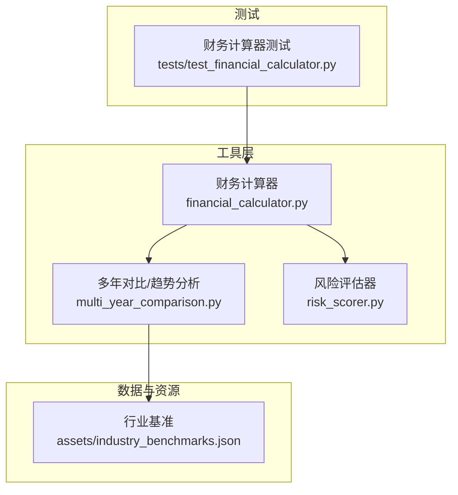
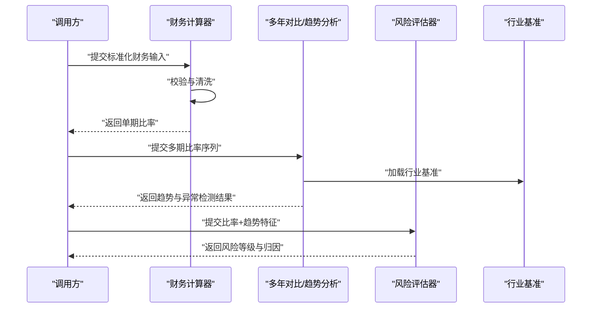
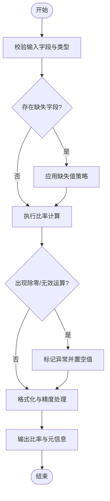
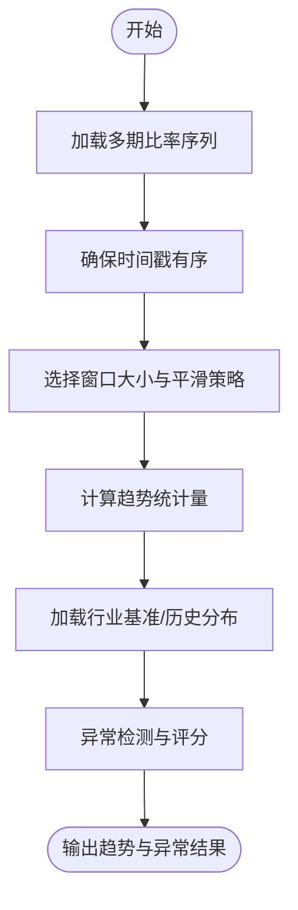
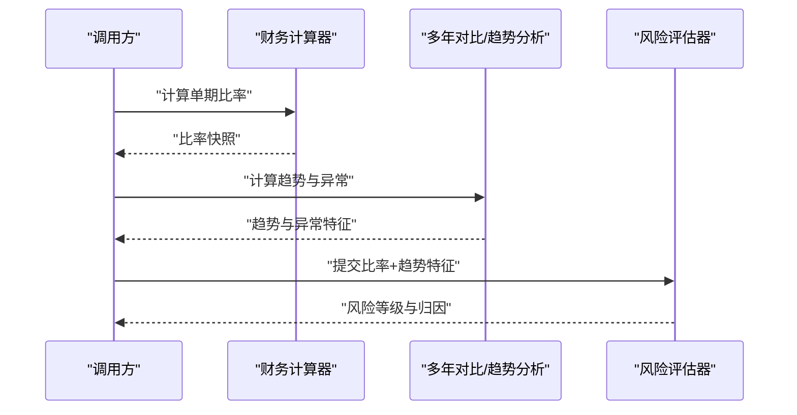

# 财务计算器

<cite>
**本文引用的文件**   
- [financial_calculator.py](file://src/tools/financial_calculator.py)
- [risk_scorer.py](file://src/tools/risk_scorer.py)
- [multi_year_comparison.py](file://src/tools/multi_year_comparison.py)
- [test_financial_calculator.py](file://tests/test_financial_calculator.py)
- [assets/industry_benchmarks.json](file://assets/industry_benchmarks.json)
</cite>

## 目录
1. [简介](#简介)
2. [项目结构](#项目结构)
3. [核心组件](#核心组件)
4. [架构总览](#架构总览)
5. [详细组件分析](#详细组件分析)
6. [依赖关系分析](#依赖关系分析)
7. [性能考虑](#性能考虑)
8. [故障排查指南](#故障排查指南)
9. [结论](#结论)
10. [附录](#附录)

## 简介
本文件为“财务计算器”工具的完整技术文档，聚焦于以下目标：
- 深入解释财务比率计算、趋势分析与异常检测的实现机制
- 详细描述支持的财务指标类型（流动性比率、盈利能力比率、偿债能力比率等）与计算方法
- 说明输入数据格式要求、参数配置选项与输出结果结构
- 提供具体使用示例：单期比率计算、多期趋势分析、自定义比率定义
- 解释与风险评估器的集成方式与数据传递格式
- 包含错误处理机制与性能优化建议

## 项目结构
围绕财务计算的核心代码位于 src/tools 目录下，测试用例位于 tests 目录，行业基准数据位于 assets。关键文件如下：
- 财务计算器：src/tools/financial_calculator.py
- 多年对比/趋势分析：src/tools/multi_year_comparison.py
- 风险评估器：src/tools/risk_scorer.py
- 单元测试：tests/test_financial_calculator.py
- 行业基准：assets/industry_benchmarks.json

图表来源
- [financial_calculator.py](file://src/tools/financial_calculator.py)
- [multi_year_comparison.py](file://src/tools/multi_year_comparison.py)
- [risk_scorer.py](file://src/tools/risk_scorer.py)
- [assets/industry_benchmarks.json](file://assets/industry_benchmarks.json)
- [test_financial_calculator.py](file://tests/test_financial_calculator.py)

章节来源
- [financial_calculator.py](file://src/tools/financial_calculator.py)
- [multi_year_comparison.py](file://src/tools/multi_year_comparison.py)
- [risk_scorer.py](file://src/tools/risk_scorer.py)
- [assets/industry_benchmarks.json](file://assets/industry_benchmarks.json)
- [test_financial_calculator.py](file://tests/test_financial_calculator.py)

## 核心组件
- 财务比率计算引擎
  - 负责将标准化后的财务输入转换为各类比率，包括流动性、盈利能力、偿债能力等
  - 支持内置指标与自定义比率表达式
  - 对除零、缺失值、负数场景进行稳健处理
- 趋势分析与异常检测
  - 基于多期序列计算同比/环比变化、移动平均、波动率等
  - 结合行业基准或历史分布进行异常评分与阈值判定
- 风险评估器集成
  - 将比率与趋势特征作为风险因子输入，输出风险等级与归因要点
- 行业基准库
  - 提供分行业的参考区间与警戒线，用于异常检测与相对表现评估

章节来源
- [financial_calculator.py](file://src/tools/financial_calculator.py)
- [multi_year_comparison.py](file://src/tools/multi_year_comparison.py)
- [risk_scorer.py](file://src/tools/risk_scorer.py)
- [assets/industry_benchmarks.json](file://assets/industry_benchmarks.json)

## 架构总览
财务计算器采用“输入标准化 → 比率计算 → 趋势分析 → 异常检测 → 风险评分”的流水线式架构。各阶段通过明确的数据契约交互，便于扩展与替换。

图表来源
- [financial_calculator.py](file://src/tools/financial_calculator.py)
- [multi_year_comparison.py](file://src/tools/multi_year_comparison.py)
- [risk_scorer.py](file://src/tools/risk_scorer.py)
- [assets/industry_benchmarks.json](file://assets/industry_benchmarks.json)

## 详细组件分析

### 财务比率计算（财务计算器）
- 功能范围
  - 内置指标族：流动性比率、盈利能力比率、偿债能力比率、营运效率比率等
  - 自定义比率：允许以字段名与运算符组合的方式定义新比率
- 输入数据格式
  - 单期输入：以字典形式组织，键为科目名称（如流动资产、营业收入等），值为数值
  - 多期输入：列表或映射，按时间顺序排列，保证字段一致性与时间戳有序
- 参数配置
  - 比率白名单/黑名单：控制参与计算的指标集合
  - 缺失值策略：填充、跳过或报错
  - 除零处理：默认返回空值或特定标记，避免崩溃
  - 精度与舍入：统一小数位与百分比格式化
- 输出结果结构
  - 比率字典：键为比率名称，值为计算结果（可为空值）
  - 元信息：计算版本、所用字段、异常标记（如除零、缺失）
- 错误处理
  - 字段缺失：记录警告并跳过相关比率
  - 数据类型错误：抛出可捕获的类型异常
  - 除零与无穷：返回空值并附带原因码
- 性能优化
  - 批量计算缓存：对重复字段组合复用中间结果
  - 惰性求值：按需计算指定比率，减少不必要开销

图表来源
- [financial_calculator.py](file://src/tools/financial_calculator.py)

章节来源
- [financial_calculator.py](file://src/tools/financial_calculator.py)

### 趋势分析与异常检测（多年对比）
- 功能范围
  - 同比/环比增长率、滚动窗口均值与标准差、斜率与拐点识别
  - 异常检测：基于行业基准区间、历史分位数或统计阈值（如Z-Score）
- 输入数据格式
  - 多期比率序列：按时间排序的数组或对象列表，包含比率值与时间戳
- 参数配置
  - 窗口大小：移动平均/方差窗口
  - 阈值方法：固定阈值、动态阈值（分位数）、行业基准比较
  - 平滑策略：指数加权、简单移动平均
- 输出结果结构
  - 趋势指标：增长率、斜率、波动率
  - 异常评分：是否异常、异常强度、触发条件
  - 可视化辅助：分段点、置信区间
- 错误处理
  - 序列过短：提示需要更多观测点
  - 非单调时间戳：自动排序或报错
  - 基准缺失：回退到全局阈值
- 性能优化
  - 增量更新：新增期次仅重算受影响窗口
  - 向量化计算：利用数组操作降低循环开销

图表来源
- [multi_year_comparison.py](file://src/tools/multi_year_comparison.py)
- [assets/industry_benchmarks.json](file://assets/industry_benchmarks.json)

章节来源
- [multi_year_comparison.py](file://src/tools/multi_year_comparison.py)
- [assets/industry_benchmarks.json](file://assets/industry_benchmarks.json)

### 风险评估器集成
- 集成方式
  - 输入：比率结果与趋势特征（增长、波动、异常标记）
  - 输出：风险等级、风险因子权重、归因摘要
- 数据传递格式
  - 结构化JSON：包含比率快照、时序摘要、异常事件列表
- 参数配置
  - 风险模型版本：支持多版本切换
  - 阈值与权重：按业务场景调整
- 错误处理
  - 输入不完整：降级为保守评分并记录缺失项
  - 模型不可用：回退至规则引擎
- 性能优化
  - 特征缓存：避免重复计算
  - 异步批处理：大批量企业并行评分

图表来源
- [financial_calculator.py](file://src/tools/financial_calculator.py)
- [multi_year_comparison.py](file://src/tools/multi_year_comparison.py)
- [risk_scorer.py](file://src/tools/risk_scorer.py)

章节来源
- [risk_scorer.py](file://src/tools/risk_scorer.py)

### 使用示例

- 单期比率计算
  - 步骤：准备标准化输入字典 → 调用比率计算 → 获取比率字典与元信息
  - 关注点：字段命名一致性、缺失值策略、除零处理
  - 参考路径：[财务计算器实现](file://src/tools/financial_calculator.py)

- 多期趋势分析
  - 步骤：构建多期比率序列 → 设置窗口与阈值方法 → 运行趋势与异常检测 → 解读异常评分
  - 关注点：时间戳有序、窗口大小选择、基准数据可用性
  - 参考路径：[多年对比实现](file://src/tools/multi_year_comparison.py)、[行业基准](file://assets/industry_benchmarks.json)

- 自定义比率定义
  - 步骤：在配置中声明新比率表达式（字段名与运算符）→ 加入白名单 → 重新计算
  - 关注点：表达式合法性、字段存在性、数值稳定性
  - 参考路径：[财务计算器实现](file://src/tools/financial_calculator.py)

- 与风险评估器集成
  - 步骤：导出比率快照与趋势特征 → 提交至风险评估器 → 解析风险等级与归因
  - 关注点：数据契约对齐、模型版本兼容、缺失项降级
  - 参考路径：[风险评估器实现](file://src/tools/risk_scorer.py)

章节来源
- [financial_calculator.py](file://src/tools/financial_calculator.py)
- [multi_year_comparison.py](file://src/tools/multi_year_comparison.py)
- [risk_scorer.py](file://src/tools/risk_scorer.py)
- [assets/industry_benchmarks.json](file://assets/industry_benchmarks.json)

## 依赖关系分析
- 模块耦合
  - 财务计算器与多年对比：前者产出比率，后者消费比率序列
  - 多年对比与行业基准：读取基准数据进行相对评估
  - 风险评估器：聚合比率与趋势特征进行综合评分
- 外部依赖
  - 行业基准JSON：提供分行业参考区间与警戒线
- 潜在循环依赖
  - 当前设计为单向依赖，无循环引用

图表来源
- [financial_calculator.py](file://src/tools/financial_calculator.py)
- [multi_year_comparison.py](file://src/tools/multi_year_comparison.py)
- [risk_scorer.py](file://src/tools/risk_scorer.py)
- [assets/industry_benchmarks.json](file://assets/industry_benchmarks.json)

章节来源
- [financial_calculator.py](file://src/tools/financial_calculator.py)
- [multi_year_comparison.py](file://src/tools/multi_year_comparison.py)
- [risk_scorer.py](file://src/tools/risk_scorer.py)
- [assets/industry_benchmarks.json](file://assets/industry_benchmarks.json)

## 性能考虑
- 计算层面
  - 批量计算与缓存：对重复字段组合复用中间结果
  - 惰性求值：仅计算所需比率，减少内存占用
  - 向量化与增量更新：提升多期序列处理速度
- I/O层面
  - 基准数据预加载：启动时载入行业基准，避免重复读取
  - 流式写入：大结果集分批落盘，降低峰值内存
- 并发与异步
  - 批处理任务拆分：按企业或年份分片并行
  - 超时与重试：对外部依赖（如基准服务）增加容错

## 故障排查指南
- 常见问题
  - 字段缺失或命名不一致：检查输入字典键名与配置白名单
  - 除零或无穷值：确认分母字段是否为零或极小值，调整除零策略
  - 时间戳无序：确保多期序列按时间升序排列
  - 基准数据缺失：检查行业分类与基准文件完整性
- 定位手段
  - 查看异常标记与原因码：定位失败比率与触发条件
  - 启用调试日志：记录输入、中间结果与阈值判断
  - 最小复现：构造最小子集输入验证逻辑
- 恢复策略
  - 缺失值填充：使用前值填充或行业均值
  - 阈值放宽：临时放宽异常阈值以继续流程
  - 降级模式：当模型不可用时回退至规则引擎

章节来源
- [financial_calculator.py](file://src/tools/financial_calculator.py)
- [multi_year_comparison.py](file://src/tools/multi_year_comparison.py)
- [risk_scorer.py](file://src/tools/risk_scorer.py)

## 结论
财务计算器通过清晰的模块化设计与稳健的错误处理，实现了从单期比率到多期趋势与异常检测的完整链路，并与风险评估器无缝集成。借助行业基准与灵活的参数配置，系统可在不同业务场景下稳定运行并提供可解释的风险洞察。建议在大规模应用中引入缓存与异步批处理，进一步提升吞吐与响应速度。

## 附录
- 术语表
  - 比率：由两个或多个财务科目计算得到的相对指标
  - 趋势：多期比率的时间演化特征
  - 异常：偏离正常区间的观测点
  - 基准：行业或历史参考值
- 参考实现路径
  - [财务计算器](file://src/tools/financial_calculator.py)
  - [多年对比/趋势分析](file://src/tools/multi_year_comparison.py)
  - [风险评估器](file://src/tools/risk_scorer.py)
  - [行业基准](file://assets/industry_benchmarks.json)
  - [财务计算器测试](file://tests/test_financial_calculator.py)