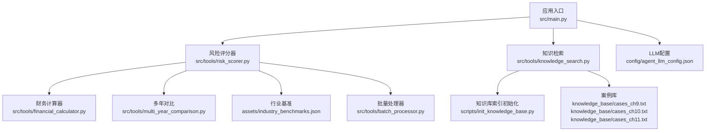
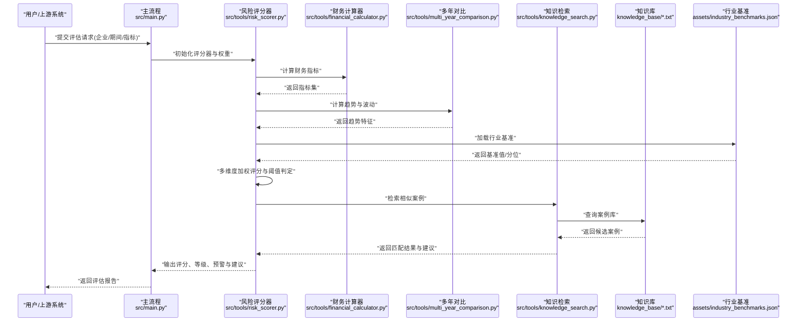
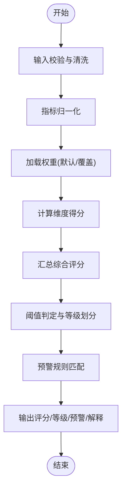
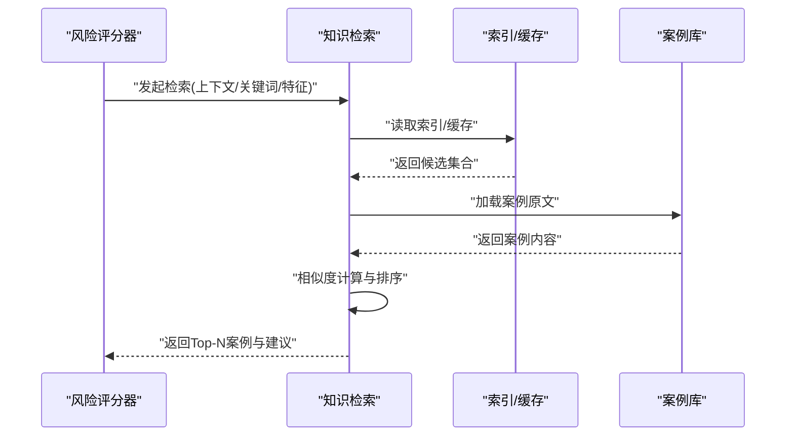
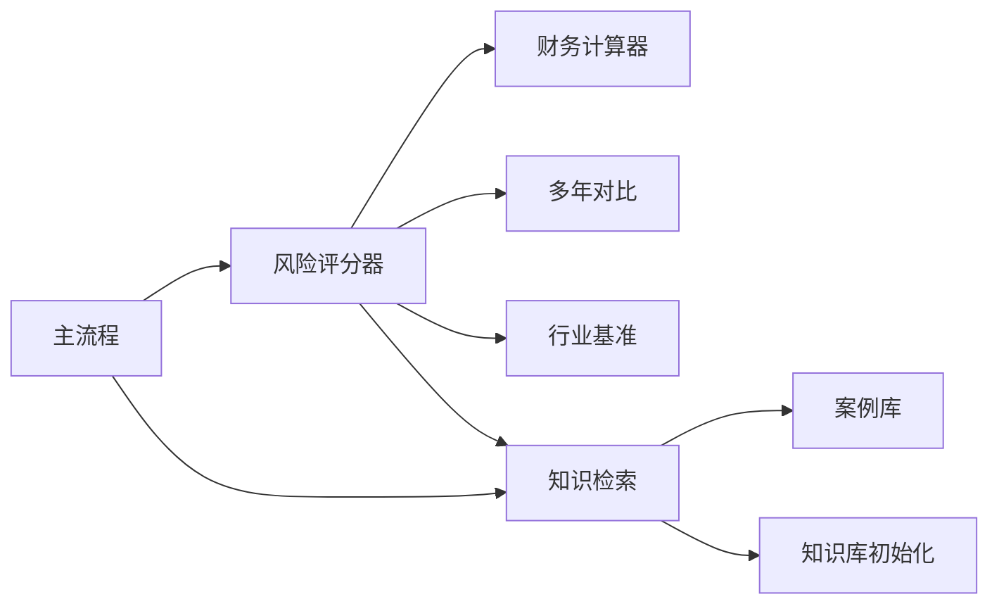

# 风险评估器

<cite>
**本文引用的文件**   
- [risk_scorer.py](file://src/tools/risk_scorer.py)
- [knowledge_search.py](file://src/tools/knowledge_search.py)
- [financial_calculator.py](file://src/tools/financial_calculator.py)
- [multi_year_comparison.py](file://src/tools/multi_year_comparison.py)
- [batch_processor.py](file://src/tools/batch_processor.py)
- [industry_benchmarks.json](file://assets/industry_benchmarks.json)
- [cases_ch9.txt](file://knowledge_base/cases_ch9.txt)
- [cases_ch10.txt](file://knowledge_base/cases_ch10.txt)
- [cases_ch11.txt](file://knowledge_base/cases_ch11.txt)
- [init_knowledge_base.py](file://scripts/init_knowledge_base.py)
- [agent_llm_config.json](file://config/agent_llm_config.json)
- [main.py](file://src/main.py)
</cite>

## 目录
1. [简介](#简介)
2. [项目结构](#项目结构)
3. [核心组件](#核心组件)
4. [架构总览](#架构总览)
5. [详细组件分析](#详细组件分析)
6. [依赖关系分析](#依赖关系分析)
7. [性能考虑](#性能考虑)
8. [故障排查指南](#故障排查指南)
9. [结论](#结论)
10. [附录](#附录)

## 简介
本文件为“风险评估器”工具的权威技术文档，聚焦多维度评分模型、风险分类体系、阈值与等级划分、预警机制、评估流程示例、知识库关联分析与案例匹配逻辑，以及自定义指标扩展与模型调优方法。目标读者包括业务分析师、风控工程师与系统维护人员。

## 项目结构
本项目围绕工具化能力组织代码，核心位于 src/tools 目录，包含风险评分、知识检索、财务计算、多年对比、批量处理与可视化等模块；资产与知识库分别存放于 assets 与 knowledge_base；脚本位于 scripts，配置位于 config。

图表来源
- [main.py:1-200](file://src/main.py#L1-L200)
- [risk_scorer.py:1-200](file://src/tools/risk_scorer.py#L1-L200)
- [knowledge_search.py:1-200](file://src/tools/knowledge_search.py#L1-L200)
- [financial_calculator.py:1-200](file://src/tools/financial_calculator.py#L1-L200)
- [multi_year_comparison.py:1-200](file://src/tools/multi_year_comparison.py#L1-L200)
- [batch_processor.py:1-200](file://src/tools/batch_processor.py#L1-L200)
- [industry_benchmarks.json:1-200](file://assets/industry_benchmarks.json#L1-L200)
- [cases_ch9.txt:1-200](file://knowledge_base/cases_ch9.txt#L1-L200)
- [cases_ch10.txt:1-200](file://knowledge_base/cases_ch10.txt#L1-L200)
- [cases_ch11.txt:1-200](file://knowledge_base/cases_ch11.txt#L1-L200)
- [init_knowledge_base.py:1-200](file://scripts/init_knowledge_base.py#L1-L200)
- [agent_llm_config.json:1-200](file://config/agent_llm_config.json#L1-L200)

章节来源
- [main.py:1-200](file://src/main.py#L1-L200)

## 核心组件
- 风险评分器：实现多维度评分模型、权重分配、阈值判定与等级划分，并输出风险预警信号。
- 知识检索：提供基于知识库的相似案例检索与匹配，辅助风险解释与处置建议。
- 财务计算器：提供常用财务比率与趋势计算，支撑财务风险维度输入。
- 多年对比：支持跨期指标对比与异常波动检测，增强运营与合规风险识别。
- 批量处理器：对多主体或多期间数据进行批量化评估与结果聚合。
- 行业基准：提供行业分位或区间参考，用于相对风险定位。
- LLM配置：集中管理外部大模型调用参数（如适用）。

章节来源
- [risk_scorer.py:1-200](file://src/tools/risk_scorer.py#L1-L200)
- [knowledge_search.py:1-200](file://src/tools/knowledge_search.py#L1-L200)
- [financial_calculator.py:1-200](file://src/tools/financial_calculator.py#L1-L200)
- [multi_year_comparison.py:1-200](file://src/tools/multi_year_comparison.py#L1-L200)
- [batch_processor.py:1-200](file://src/tools/batch_processor.py#L1-L200)
- [industry_benchmarks.json:1-200](file://assets/industry_benchmarks.json#L1-L200)
- [agent_llm_config.json:1-200](file://config/agent_llm_config.json#L1-L200)

## 架构总览
风险评估器采用“数据准备—指标计算—多维评分—阈值判定—知识匹配—报告输出”的流水线式架构。评分器为核心编排者，按需调用财务计算与多年对比模块生成指标，结合行业基准进行相对定位，并通过知识检索补充案例依据与处置建议。

图表来源
- [main.py:1-200](file://src/main.py#L1-L200)
- [risk_scorer.py:1-200](file://src/tools/risk_scorer.py#L1-L200)
- [financial_calculator.py:1-200](file://src/tools/financial_calculator.py#L1-L200)
- [multi_year_comparison.py:1-200](file://src/tools/multi_year_comparison.py#L1-L200)
- [knowledge_search.py:1-200](file://src/tools/knowledge_search.py#L1-L200)
- [industry_benchmarks.json:1-200](file://assets/industry_benchmarks.json#L1-L200)

## 详细组件分析

### 风险评分器（多维度评分模型）
- 模型要点
  - 维度划分：财务风险、运营风险、合规风险三大类，每类下可进一步细分指标项。
  - 权重分配：按类别与指标层级设置权重，支持全局默认权重与场景化覆盖。
  - 归一化：将原始指标映射到统一分值区间，便于跨指标比较与汇总。
  - 综合评分：按权重聚合得到总分与各维度得分。
  - 阈值与等级：根据总分与维度得分触发不同等级与预警级别。
  - 可解释性：输出关键驱动因素与贡献度，便于审计与复盘。
- 算法流程（概念级）
  - 输入校验与缺失值处理
  - 指标归一化与异常值处理
  - 权重加载与合并（默认+覆盖）
  - 维度得分计算与汇总
  - 阈值判定与等级划分
  - 预警规则匹配与提示
  - 结果结构化输出

图表来源
- [risk_scorer.py:1-200](file://src/tools/risk_scorer.py#L1-L200)

章节来源
- [risk_scorer.py:1-200](file://src/tools/risk_scorer.py#L1-L200)

### 风险分类体系与评分标准
- 财务风险
  - 典型指标：流动性、杠杆、盈利质量、现金流稳定性等。
  - 评分标准：以行业基准为参照，结合历史趋势与同业分位进行打分。
- 运营风险
  - 典型指标：收入波动、成本结构变化、产能利用率、供应链集中度等。
  - 评分标准：关注异常波动与结构性失衡，结合多年对比进行修正。
- 合规风险
  - 典型指标：监管处罚记录、内控缺陷、信息披露质量、税务合规性等。
  - 评分标准：以事件严重性与频次为主，辅以整改有效性评估。
- 等级划分
  - 通常分为低、中、高、极高四个等级，对应不同的处置策略与上报要求。
- 阈值设置
  - 总分阈值与维度阈值共同决定等级与预警级别，支持动态调整。

章节来源
- [risk_scorer.py:1-200](file://src/tools/risk_scorer.py#L1-L200)
- [industry_benchmarks.json:1-200](file://assets/industry_benchmarks.json#L1-L200)

### 风险阈值、等级划分与预警机制
- 阈值策略
  - 固定阈值：适用于成熟稳定的指标体系。
  - 动态阈值：基于历史分布或行业分位自适应调整。
- 等级划分
  - 基于总分与维度得分双轨判定，避免单一维度掩盖整体风险。
- 预警机制
  - 分级预警：提示、关注、警告、紧急四级。
  - 触发条件：单项突破、组合突破、趋势恶化、案例命中等。
  - 处置联动：自动附带处置建议与相似案例链接。

章节来源
- [risk_scorer.py:1-200](file://src/tools/risk_scorer.py#L1-L200)

### 知识库关联分析与案例匹配逻辑
- 功能概述
  - 通过关键词、标签或向量相似度检索相似案例，辅助风险解释与处置建议。
- 匹配逻辑
  - 文本预处理与分词
  - 相似度计算（关键词重叠/TF-IDF/向量相似度）
  - 相关性排序与去重
  - 结果裁剪与摘要生成
- 知识库结构
  - 案例文件按主题或年份归档，便于增量更新与版本管理。
- 初始化流程
  - 首次运行需执行知识库初始化脚本，构建索引或缓存以提升检索效率。

图表来源
- [knowledge_search.py:1-200](file://src/tools/knowledge_search.py#L1-L200)
- [init_knowledge_base.py:1-200](file://scripts/init_knowledge_base.py#L1-L200)
- [cases_ch9.txt:1-200](file://knowledge_base/cases_ch9.txt#L1-L200)
- [cases_ch10.txt:1-200](file://knowledge_base/cases_ch10.txt#L1-L200)
- [cases_ch11.txt:1-200](file://knowledge_base/cases_ch11.txt#L1-L200)

章节来源
- [knowledge_search.py:1-200](file://src/tools/knowledge_search.py#L1-L200)
- [init_knowledge_base.py:1-200](file://scripts/init_knowledge_base.py#L1-L200)
- [cases_ch9.txt:1-200](file://knowledge_base/cases_ch9.txt#L1-L200)
- [cases_ch10.txt:1-200](file://knowledge_base/cases_ch10.txt#L1-L200)
- [cases_ch11.txt:1-200](file://knowledge_base/cases_ch11.txt#L1-L200)

### 财务计算器与多年对比
- 财务计算器
  - 提供常见比率计算与标准化处理，确保输入一致性与可比性。
- 多年对比
  - 计算同比/环比、趋势斜率、波动率等，作为运营与合规风险的修正因子。
- 集成方式
  - 由风险评分器按需调用，输出结构化指标供后续评分使用。

章节来源
- [financial_calculator.py:1-200](file://src/tools/financial_calculator.py#L1-L200)
- [multi_year_comparison.py:1-200](file://src/tools/multi_year_comparison.py#L1-L200)
- [risk_scorer.py:1-200](file://src/tools/risk_scorer.py#L1-L200)

### 批量处理器
- 功能
  - 对多主体或多期间数据进行并发或串行批处理，聚合结果并生成汇总报告。
- 适用场景
  - 年度审计、季度巡检、专项排查等需要大规模评估的场景。

章节来源
- [batch_processor.py:1-200](file://src/tools/batch_processor.py#L1-L200)

### 行业基准
- 作用
  - 提供行业均值、分位数或区间，用于相对风险定位与阈值校准。
- 更新策略
  - 定期更新基准数据，确保与行业现状保持一致。

章节来源
- [industry_benchmarks.json:1-200](file://assets/industry_benchmarks.json#L1-L200)

### LLM配置（可选）
- 用途
  - 若启用大模型能力（如摘要、建议生成），通过配置文件统一管理端点、密钥与参数。
- 安全建议
  - 敏感信息不硬编码，优先使用环境变量或密钥管理服务。

章节来源
- [agent_llm_config.json:1-200](file://config/agent_llm_config.json#L1-L200)

## 依赖关系分析
- 内部依赖
  - 风险评分器依赖财务计算器与多年对比模块，同时读取行业基准。
  - 知识检索依赖知识库文件与初始化脚本产出的索引/缓存。
  - 主流程协调各模块，完成端到端评估。
- 外部依赖
  - 文件系统：案例库与基准数据。
  - 可选：大模型服务（通过配置接入）。

图表来源
- [main.py:1-200](file://src/main.py#L1-L200)
- [risk_scorer.py:1-200](file://src/tools/risk_scorer.py#L1-L200)
- [financial_calculator.py:1-200](file://src/tools/financial_calculator.py#L1-L200)
- [multi_year_comparison.py:1-200](file://src/tools/multi_year_comparison.py#L1-L200)
- [knowledge_search.py:1-200](file://src/tools/knowledge_search.py#L1-L200)
- [industry_benchmarks.json:1-200](file://assets/industry_benchmarks.json#L1-L200)
- [init_knowledge_base.py:1-200](file://scripts/init_knowledge_base.py#L1-L200)

章节来源
- [main.py:1-200](file://src/main.py#L1-L200)
- [risk_scorer.py:1-200](file://src/tools/risk_scorer.py#L1-L200)

## 性能考虑
- 指标计算
  - 尽量向量化与批量化计算，减少重复IO与循环开销。
- 知识检索
  - 预构建索引/缓存，避免每次全量扫描；限制返回Top-N以降低后续处理压力。
- 批量处理
  - 合理控制并发度，避免资源争用；失败重试与断点续跑。
- 内存与磁盘
  - 大对象及时释放，日志与中间结果落盘时压缩与轮转。

[本节为通用指导，无需特定文件引用]

## 故障排查指南
- 常见问题
  - 指标缺失或异常：检查输入数据完整性与异常值处理策略。
  - 权重未生效：确认默认权重与覆盖权重的优先级与格式。
  - 阈值误判：核对阈值配置与单位一致性。
  - 知识检索无结果：确认知识库已初始化且索引可用。
  - 大模型调用失败：检查配置与网络连通性。
- 定位步骤
  - 查看模块日志与错误堆栈。
  - 逐步关闭下游依赖（如禁用知识检索）验证问题范围。
  - 使用小样本回归测试，隔离环境差异。

章节来源
- [risk_scorer.py:1-200](file://src/tools/risk_scorer.py#L1-L200)
- [knowledge_search.py:1-200](file://src/tools/knowledge_search.py#L1-L200)
- [init_knowledge_base.py:1-200](file://scripts/init_knowledge_base.py#L1-L200)
- [agent_llm_config.json:1-200](file://config/agent_llm_config.json#L1-L200)

## 结论
风险评估器以模块化设计实现了从数据到决策的闭环：通过多维度评分模型与行业基准相结合，结合知识检索提升可解释性与可操作性。建议在持续迭代中完善指标体系、优化阈值策略与强化知识库建设，以满足更复杂的业务场景。

[本节为总结性内容，无需特定文件引用]

## 附录

### 评估流程示例（端到端）
- 数据准备
  - 收集企业财务与运营指标，补齐缺失值，统一口径与单位。
- 模型配置
  - 选择权重模板或自定义权重，设定阈值与等级规则。
- 执行评估
  - 调用主流程，依次完成指标计算、评分、阈值判定与知识检索。
- 结果解读
  - 关注总分与维度得分、等级与预警级别、关键驱动因素与相似案例。
- 处置与跟踪
  - 根据建议制定整改措施，纳入跟踪与复评。

章节来源
- [main.py:1-200](file://src/main.py#L1-L200)
- [risk_scorer.py:1-200](file://src/tools/risk_scorer.py#L1-L200)
- [knowledge_search.py:1-200](file://src/tools/knowledge_search.py#L1-L200)

### 自定义风险指标添加方法
- 新增指标
  - 在指标定义处注册新指标名称、计算公式与所属维度。
  - 明确数据来源与频率，必要时增加异常值处理逻辑。
- 权重与阈值
  - 为新指标分配初始权重与阈值，参与评审后固化。
- 回归验证
  - 使用历史数据回测，评估对评分与等级的影响，避免系统性偏移。

章节来源
- [risk_scorer.py:1-200](file://src/tools/risk_scorer.py#L1-L200)

### 模型调优指南
- 权重调优
  - 基于专家经验与历史违约/违规样本进行A/B测试与回溯验证。
- 阈值校准
  - 结合ROC曲线或业务容忍度确定最佳切点，区分预警与处置阈值。
- 指标演进
  - 定期审视指标有效性与冗余性，淘汰弱相关指标，引入前瞻性指标。
- 知识库优化
  - 扩充高质量案例，完善标签体系，提升检索命中率与可读性。

章节来源
- [risk_scorer.py:1-200](file://src/tools/risk_scorer.py#L1-L200)
- [industry_benchmarks.json:1-200](file://assets/industry_benchmarks.json#L1-L200)
- [knowledge_search.py:1-200](file://src/tools/knowledge_search.py#L1-L200)