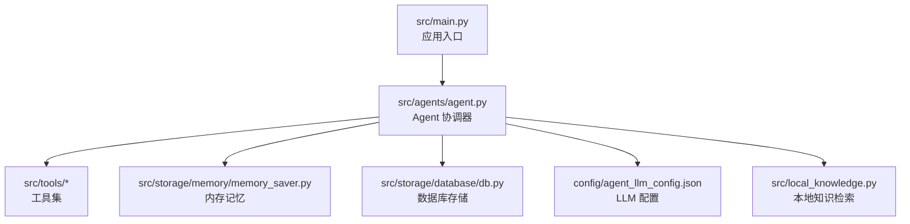
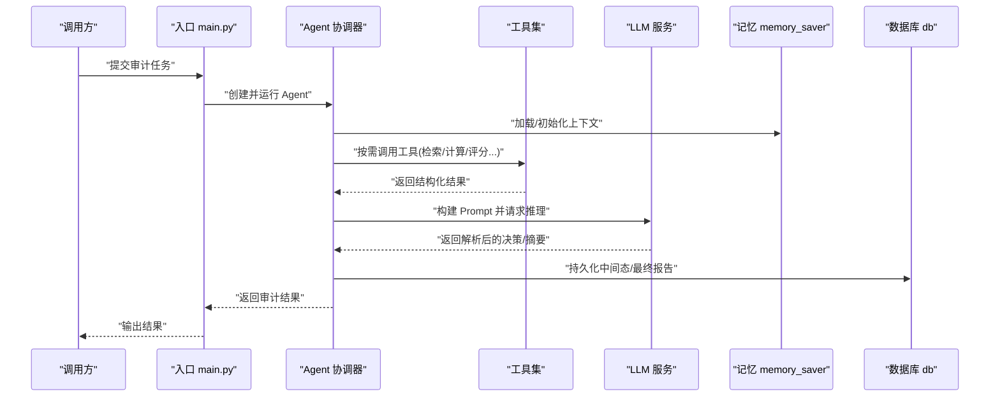
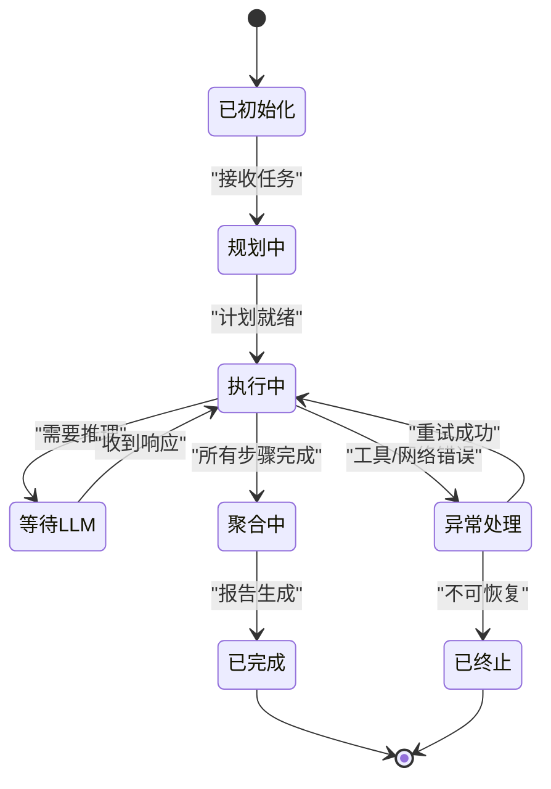
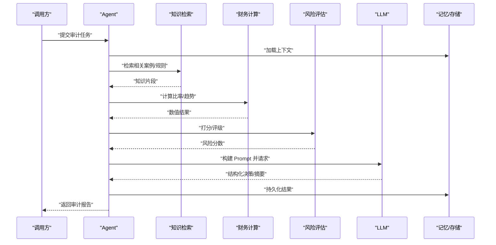
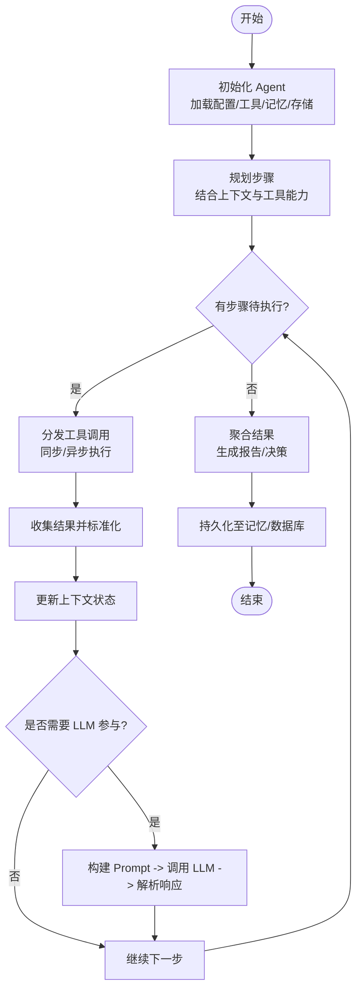
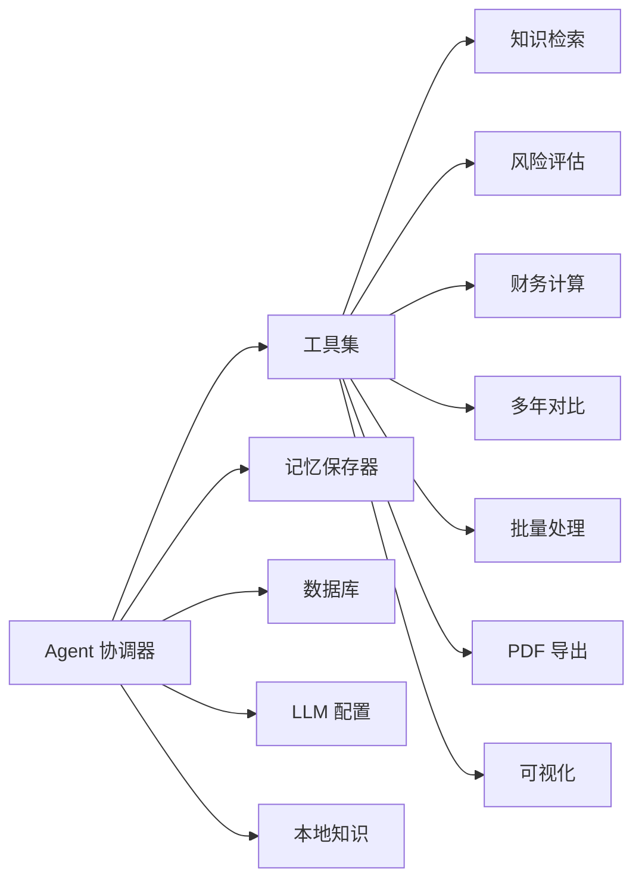

# 智能体协调器

<cite>
**本文引用的文件**   
- [src/agents/agent.py](file://src/agents/agent.py)
- [config/agent_llm_config.json](file://config/agent_llm_config.json)
- [src/tools/knowledge_search.py](file://src/tools/knowledge_search.py)
- [src/tools/risk_scorer.py](file://src/tools/risk_scorer.py)
- [src/tools/financial_calculator.py](file://src/tools/financial_calculator.py)
- [src/tools/multi_year_comparison.py](file://src/tools/multi_year_comparison.py)
- [src/tools/batch_processor.py](file://src/tools/batch_processor.py)
- [src/tools/pdf_export.py](file://src/tools/pdf_export.py)
- [src/tools/visualizer.py](file://src/tools/visualizer.py)
- [src/storage/memory/memory_saver.py](file://src/storage/memory/memory_saver.py)
- [src/storage/database/db.py](file://src/storage/database/db.py)
- [src/local_knowledge.py](file://src/local_knowledge.py)
- [src/main.py](file://src/main.py)
</cite>

## 目录
1. [简介](#简介)
2. [项目结构](#项目结构)
3. [核心组件](#核心组件)
4. [架构总览](#架构总览)
5. [详细组件分析](#详细组件分析)
6. [依赖关系分析](#依赖关系分析)
7. [性能考虑](#性能考虑)
8. [故障排查指南](#故障排查指南)
9. [结论](#结论)
10. [附录](#附录)

## 简介
本文件面向“智能审计风险识别系统”的“智能体协调器”，聚焦 Agent 类的设计与实现，系统性阐述其职责边界、任务生命周期管理、上下文状态维护、工具调用编排与结果聚合机制。文档同时覆盖初始化流程、配置参数与环境依赖、与 LLM 模型的交互模式（Prompt 构建、响应解析、错误处理）、异步任务处理与并发控制策略，并提供状态转换图与时序图，以及创建、配置和执行审计任务的实践示例路径与扩展点建议。

## 项目结构
围绕智能体协调器的关键代码位于 src/agents/agent.py，相关工具模块集中于 src/tools/*，持久化与记忆在 src/storage/*，LLM 配置在 config/agent_llm_config.json，入口脚本为 src/main.py。

图示来源
- [src/agents/agent.py](file://src/agents/agent.py)
- [src/tools/knowledge_search.py](file://src/tools/knowledge_search.py)
- [src/tools/risk_scorer.py](file://src/tools/risk_scorer.py)
- [src/tools/financial_calculator.py](file://src/tools/financial_calculator.py)
- [src/tools/multi_year_comparison.py](file://src/tools/multi_year_comparison.py)
- [src/tools/batch_processor.py](file://src/tools/batch_processor.py)
- [src/tools/pdf_export.py](file://src/tools/pdf_export.py)
- [src/tools/visualizer.py](file://src/tools/visualizer.py)
- [src/storage/memory/memory_saver.py](file://src/storage/memory/memory_saver.py)
- [src/storage/database/db.py](file://src/storage/database/db.py)
- [config/agent_llm_config.json](file://config/agent_llm_config.json)
- [src/local_knowledge.py](file://src/local_knowledge.py)
- [src/main.py](file://src/main.py)

章节来源
- [src/agents/agent.py](file://src/agents/agent.py)
- [src/main.py](file://src/main.py)
- [config/agent_llm_config.json](file://config/agent_llm_config.json)

## 核心组件
- Agent 协调器：负责审计任务的全生命周期管理、上下文状态维护、工具编排与结果聚合、与 LLM 的交互、异步执行与并发控制。
- 工具集：知识检索、风险评估、财务计算、多年对比、批量处理、PDF 导出、可视化等。
- 记忆与存储：内存记忆保存器与数据库持久化。
- LLM 配置：模型选择、温度、最大令牌数、重试策略等。
- 本地知识：用于增强 Prompt 的知识片段或案例库。

章节来源
- [src/agents/agent.py](file://src/agents/agent.py)
- [src/tools/knowledge_search.py](file://src/tools/knowledge_search.py)
- [src/tools/risk_scorer.py](file://src/tools/risk_scorer.py)
- [src/tools/financial_calculator.py](file://src/tools/financial_calculator.py)
- [src/tools/multi_year_comparison.py](file://src/tools/multi_year_comparison.py)
- [src/tools/batch_processor.py](file://src/tools/batch_processor.py)
- [src/tools/pdf_export.py](file://src/tools/pdf_export.py)
- [src/tools/visualizer.py](file://src/tools/visualizer.py)
- [src/storage/memory/memory_saver.py](file://src/storage/memory/memory_saver.py)
- [src/storage/database/db.py](file://src/storage/database/db.py)
- [config/agent_llm_config.json](file://config/agent_llm_config.json)
- [src/local_knowledge.py](file://src/local_knowledge.py)

## 架构总览
Agent 作为协调中心，向上承接来自入口或上层服务的审计任务请求，向下编排工具与 LLM，并通过记忆与存储进行状态持久化与恢复。

图示来源
- [src/main.py](file://src/main.py)
- [src/agents/agent.py](file://src/agents/agent.py)
- [src/storage/memory/memory_saver.py](file://src/storage/memory/memory_saver.py)
- [src/storage/database/db.py](file://src/storage/database/db.py)
- [src/tools/knowledge_search.py](file://src/tools/knowledge_search.py)
- [src/tools/risk_scorer.py](file://src/tools/risk_scorer.py)
- [src/tools/financial_calculator.py](file://src/tools/financial_calculator.py)
- [src/tools/multi_year_comparison.py](file://src/tools/multi_year_comparison.py)
- [src/tools/batch_processor.py](file://src/tools/batch_processor.py)
- [src/tools/pdf_export.py](file://src/tools/pdf_export.py)
- [src/tools/visualizer.py](file://src/tools/visualizer.py)
- [config/agent_llm_config.json](file://config/agent_llm_config.json)

## 详细组件分析

### Agent 类职责与生命周期
- 任务生命周期管理
  - 初始化：加载配置、建立工具注册表、初始化记忆与存储、预热 LLM 连接。
  - 规划：基于输入与上下文生成计划（步骤序列），必要时与 LLM 协商调整。
  - 执行：按步骤调度工具，收集中间结果，更新上下文。
  - 聚合：汇总工具结果与 LLM 洞察，形成审计报告或决策。
  - 收尾：持久化结果、释放资源、记录指标。
- 上下文状态维护
  - 会话级上下文：包含任务元数据、历史对话、工具输出缓存、审计要点清单。
  - 持久化：通过记忆保存器与数据库进行增量保存与断点恢复。
- 工具调用编排
  - 动态发现与注册：根据能力描述选择合适工具。
  - 参数校验与容错：对工具入参做基本校验，失败重试与降级。
  - 结果标准化：将不同工具输出统一为内部结构，便于后续处理。
- 结果聚合机制
  - 多源融合：合并工具输出与 LLM 推理结果。
  - 一致性检查：冲突检测与消解策略。
  - 可解释性：保留关键证据链与引用来源。

章节来源
- [src/agents/agent.py](file://src/agents/agent.py)
- [src/storage/memory/memory_saver.py](file://src/storage/memory/memory_saver.py)
- [src/storage/database/db.py](file://src/storage/database/db.py)

#### 状态转换图

图示来源
- [src/agents/agent.py](file://src/agents/agent.py)

### 初始化流程、配置参数与环境依赖
- 初始化流程
  - 读取 LLM 配置（模型、温度、最大令牌数、超时、重试次数）。
  - 初始化工具集（知识检索、风险评估、财务计算、多年对比、批量处理、PDF 导出、可视化）。
  - 初始化记忆与存储（内存记忆保存器、数据库连接）。
  - 可选：加载本地知识库以增强 Prompt。
- 关键配置项（示例键名）
  - llm.model：模型标识
  - llm.temperature：采样温度
  - llm.max_tokens：最大生成长度
  - llm.timeout：请求超时秒数
  - llm.retry_attempts：重试次数
  - agent.context_window：上下文窗口大小
  - agent.max_steps：最大执行步数
  - agent.concurrency：并发上限
  - storage.memory.enabled：是否启用内存记忆
  - storage.database.url：数据库连接串
- 环境依赖
  - LLM 客户端凭据与网络可达性
  - 数据库驱动与连接池配置
  - 文件系统权限（PDF 导出、图表输出）
  - 本地知识库路径与索引可用性

章节来源
- [config/agent_llm_config.json](file://config/agent_llm_config.json)
- [src/agents/agent.py](file://src/agents/agent.py)
- [src/storage/memory/memory_saver.py](file://src/storage/memory/memory_saver.py)
- [src/storage/database/db.py](file://src/storage/database/db.py)
- [src/local_knowledge.py](file://src/local_knowledge.py)

### 与 LLM 的交互模式
- Prompt 构建
  - 模板注入：将审计目标、上下文、工具输出片段、约束条件注入到提示词模板。
  - 结构化输出：要求 LLM 返回 JSON 或固定字段，便于程序解析。
- 响应解析
  - 严格解析：使用解析器提取关键字段，缺失则回退默认值或触发重试。
  - 校验与清洗：类型校验、范围检查、去重与归一化。
- 错误处理
  - 网络/超时：指数退避重试，超过阈值进入降级路径。
  - 格式错误：自动修正或二次请求，附带更明确的约束。
  - 内容安全：敏感信息过滤与合规检查。

章节来源
- [src/agents/agent.py](file://src/agents/agent.py)
- [config/agent_llm_config.json](file://config/agent_llm_config.json)

#### 时序图：一次典型审计任务

图示来源
- [src/agents/agent.py](file://src/agents/agent.py)
- [src/tools/knowledge_search.py](file://src/tools/knowledge_search.py)
- [src/tools/financial_calculator.py](file://src/tools/financial_calculator.py)
- [src/tools/risk_scorer.py](file://src/tools/risk_scorer.py)
- [src/storage/memory/memory_saver.py](file://src/storage/memory/memory_saver.py)
- [src/storage/database/db.py](file://src/storage/database/db.py)

### 异步任务处理与并发控制
- 异步执行
  - 使用异步队列/协程并行调用独立工具（如知识检索与财务计算）。
  - 对耗时 LLM 请求采用非阻塞调用与回调处理。
- 并发控制
  - 全局并发上限：避免压垮下游服务。
  - 限流与熔断：对 LLM 与外部 API 设置速率限制与熔断阈值。
  - 任务优先级：高风险审计优先调度。
- 幂等与重试
  - 工具调用幂等设计，支持按 ID 去重。
  - 可配置的重试策略与退避算法。

章节来源
- [src/agents/agent.py](file://src/agents/agent.py)
- [src/tools/batch_processor.py](file://src/tools/batch_processor.py)

### 工具调用编排与结果聚合
- 编排策略
  - 声明式工具描述：每个工具提供名称、参数 schema、用途说明。
  - 动态路由：根据当前上下文与任务阶段选择工具。
  - 组合调用：复杂任务拆分为子步骤，顺序/并行混合执行。
- 结果聚合
  - 统一数据结构：将各工具输出映射为标准对象。
  - 冲突消解：当多个来源给出矛盾结论时，依据置信度与证据强度裁决。
  - 可追溯性：保留原始输入、工具版本、时间戳与调用链路。

章节来源
- [src/agents/agent.py](file://src/agents/agent.py)
- [src/tools/knowledge_search.py](file://src/tools/knowledge_search.py)
- [src/tools/risk_scorer.py](file://src/tools/risk_scorer.py)
- [src/tools/financial_calculator.py](file://src/tools/financial_calculator.py)
- [src/tools/multi_year_comparison.py](file://src/tools/multi_year_comparison.py)
- [src/tools/batch_processor.py](file://src/tools/batch_processor.py)
- [src/tools/pdf_export.py](file://src/tools/pdf_export.py)
- [src/tools/visualizer.py](file://src/tools/visualizer.py)

### 关键方法调用时序（代码级）

图示来源
- [src/agents/agent.py](file://src/agents/agent.py)

### 具体使用示例（路径指引）
- 创建与配置 Agent
  - 参考入口脚本中的实例化与配置加载位置，了解如何传入 LLM 配置与存储参数。
  - 参考 Agent 构造参数，确认上下文窗口、最大步数、并发上限等选项。
- 执行审计任务
  - 在入口或上层服务中调用 Agent 的运行接口，传入审计主题、数据源与期望输出格式。
  - 观察日志与中间状态，定位问题与优化空间。
- 自定义工具
  - 参照现有工具模块的结构，新增工具后在 Agent 的工具注册表中声明。
  - 确保工具具备清晰的参数 schema 与错误码约定。

章节来源
- [src/main.py](file://src/main.py)
- [src/agents/agent.py](file://src/agents/agent.py)
- [src/tools/knowledge_search.py](file://src/tools/knowledge_search.py)
- [src/tools/risk_scorer.py](file://src/tools/risk_scorer.py)
- [src/tools/financial_calculator.py](file://src/tools/financial_calculator.py)
- [src/tools/multi_year_comparison.py](file://src/tools/multi_year_comparison.py)
- [src/tools/batch_processor.py](file://src/tools/batch_processor.py)
- [src/tools/pdf_export.py](file://src/tools/pdf_export.py)
- [src/tools/visualizer.py](file://src/tools/visualizer.py)

### 扩展点与自定义能力
- 新增工具
  - 在 tools 目录下实现新工具，遵循统一的输入输出规范。
  - 在 Agent 的工具注册表中添加描述与路由规则。
- 自定义 Prompt 模板
  - 通过配置或模板管理器替换默认模板，适配不同审计场景。
- 自定义记忆与存储
  - 替换 memory_saver 或 db 后端，实现分布式记忆或云存储。
- 自定义 LLM 适配器
  - 封装新的 LLM 客户端，保持与 Agent 一致的调用与解析接口。
- 插件化编排
  - 引入工作流引擎或 DAG 定义，使复杂审计流程可配置化。

章节来源
- [src/agents/agent.py](file://src/agents/agent.py)
- [src/storage/memory/memory_saver.py](file://src/storage/memory/memory_saver.py)
- [src/storage/database/db.py](file://src/storage/database/db.py)
- [config/agent_llm_config.json](file://config/agent_llm_config.json)

## 依赖关系分析
Agent 与工具、记忆、存储、LLM 配置之间的依赖如下：

图示来源
- [src/agents/agent.py](file://src/agents/agent.py)
- [src/tools/knowledge_search.py](file://src/tools/knowledge_search.py)
- [src/tools/risk_scorer.py](file://src/tools/risk_scorer.py)
- [src/tools/financial_calculator.py](file://src/tools/financial_calculator.py)
- [src/tools/multi_year_comparison.py](file://src/tools/multi_year_comparison.py)
- [src/tools/batch_processor.py](file://src/tools/batch_processor.py)
- [src/tools/pdf_export.py](file://src/tools/pdf_export.py)
- [src/tools/visualizer.py](file://src/tools/visualizer.py)
- [src/storage/memory/memory_saver.py](file://src/storage/memory/memory_saver.py)
- [src/storage/database/db.py](file://src/storage/database/db.py)
- [config/agent_llm_config.json](file://config/agent_llm_config.json)
- [src/local_knowledge.py](file://src/local_knowledge.py)

章节来源
- [src/agents/agent.py](file://src/agents/agent.py)
- [src/tools/knowledge_search.py](file://src/tools/knowledge_search.py)
- [src/tools/risk_scorer.py](file://src/tools/risk_scorer.py)
- [src/tools/financial_calculator.py](file://src/tools/financial_calculator.py)
- [src/tools/multi_year_comparison.py](file://src/tools/multi_year_comparison.py)
- [src/tools/batch_processor.py](file://src/tools/batch_processor.py)
- [src/tools/pdf_export.py](file://src/tools/pdf_export.py)
- [src/tools/visualizer.py](file://src/tools/visualizer.py)
- [src/storage/memory/memory_saver.py](file://src/storage/memory/memory_saver.py)
- [src/storage/database/db.py](file://src/storage/database/db.py)
- [config/agent_llm_config.json](file://config/agent_llm_config.json)
- [src/local_knowledge.py](file://src/local_knowledge.py)

## 性能考虑
- 并发与限流
  - 合理设置并发上限，避免下游 LLM 与服务过载。
  - 对 I/O 密集工具采用异步执行，减少阻塞。
- 缓存与复用
  - 对知识检索与财务计算结果进行短期缓存，降低重复计算。
  - 重用 LLM 会话上下文，减少冗余传输。
- 批处理与分片
  - 大批量审计任务分片处理，提升吞吐与稳定性。
- 监控与度量
  - 记录关键指标：延迟、成功率、重试次数、工具调用时长分布。
  - 告警阈值与自动降级策略。

[本节为通用指导，不直接分析具体文件]

## 故障排查指南
- LLM 调用失败
  - 检查网络连通性与凭据配置；查看重试与超时设置；确认模型配额与速率限制。
- 工具执行异常
  - 核对工具参数 schema 与输入数据完整性；查看工具日志与错误码；验证依赖服务可用性。
- 上下文丢失或状态不一致
  - 确认记忆保存器与数据库写入成功；检查断点恢复逻辑；比对中间状态快照。
- 结果聚合错误
  - 检查解析器对 LLM 返回结构的容错；确认冲突消解策略是否符合业务预期。
- 性能瓶颈
  - 分析并发与队列长度；评估缓存命中率；审视批处理粒度与分片策略。

章节来源
- [src/agents/agent.py](file://src/agents/agent.py)
- [src/storage/memory/memory_saver.py](file://src/storage/memory/memory_saver.py)
- [src/storage/database/db.py](file://src/storage/database/db.py)
- [config/agent_llm_config.json](file://config/agent_llm_config.json)

## 结论
Agent 协调器作为智能审计风险识别系统的中枢，通过清晰的生命周期管理、稳健的上下文维护、灵活的工具编排与可靠的聚合机制，实现了从数据采集、分析到报告生成的端到端自动化。配合异步并发与完善的错误处理，系统在可扩展性与稳定性方面具备良好的工程基础。通过插件化的扩展点，团队可快速接入新工具、新模板与新存储后端，持续增强审计能力。

[本节为总结性内容，不直接分析具体文件]

## 附录
- 术语
  - 上下文：任务相关的状态集合，包括输入、中间结果、历史对话与审计要点。
  - 编排：按策略组织工具与 LLM 调用的过程。
  - 聚合：将多源结果整合为一致输出的过程。
- 最佳实践
  - 明确工具契约：严格的参数与返回值约定。
  - 最小化副作用：工具尽量无状态或幂等。
  - 可观测性：全链路日志与指标上报。
  - 渐进式增强：先保证正确性，再逐步优化性能与体验。

[本节为补充信息，不直接分析具体文件]