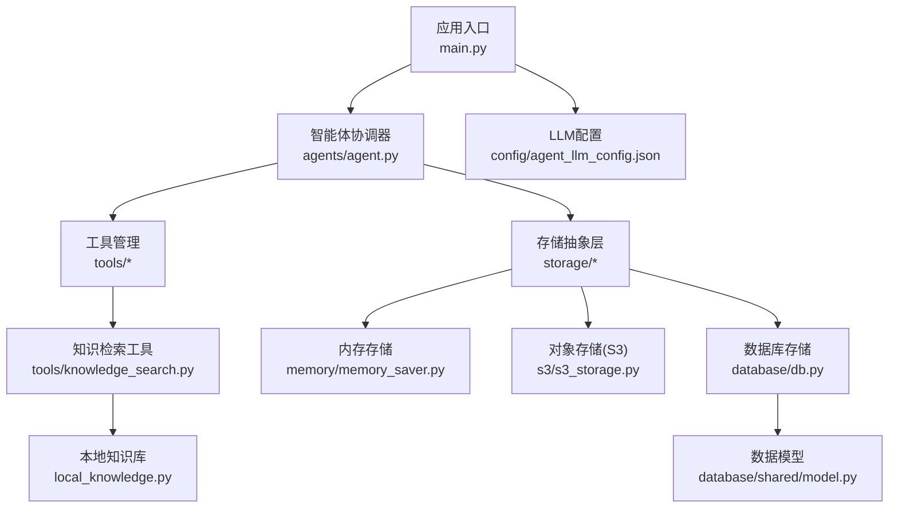
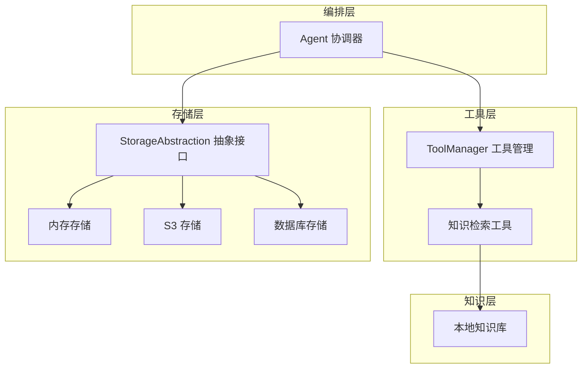
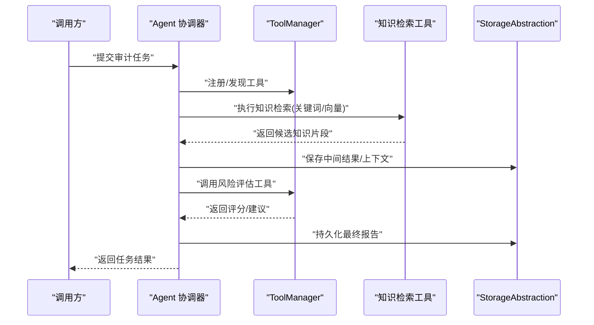
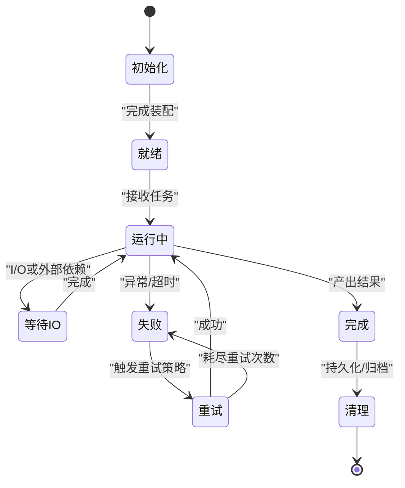
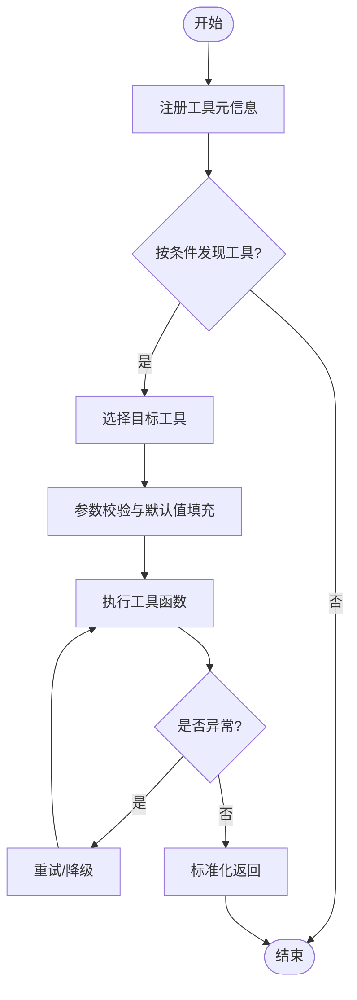
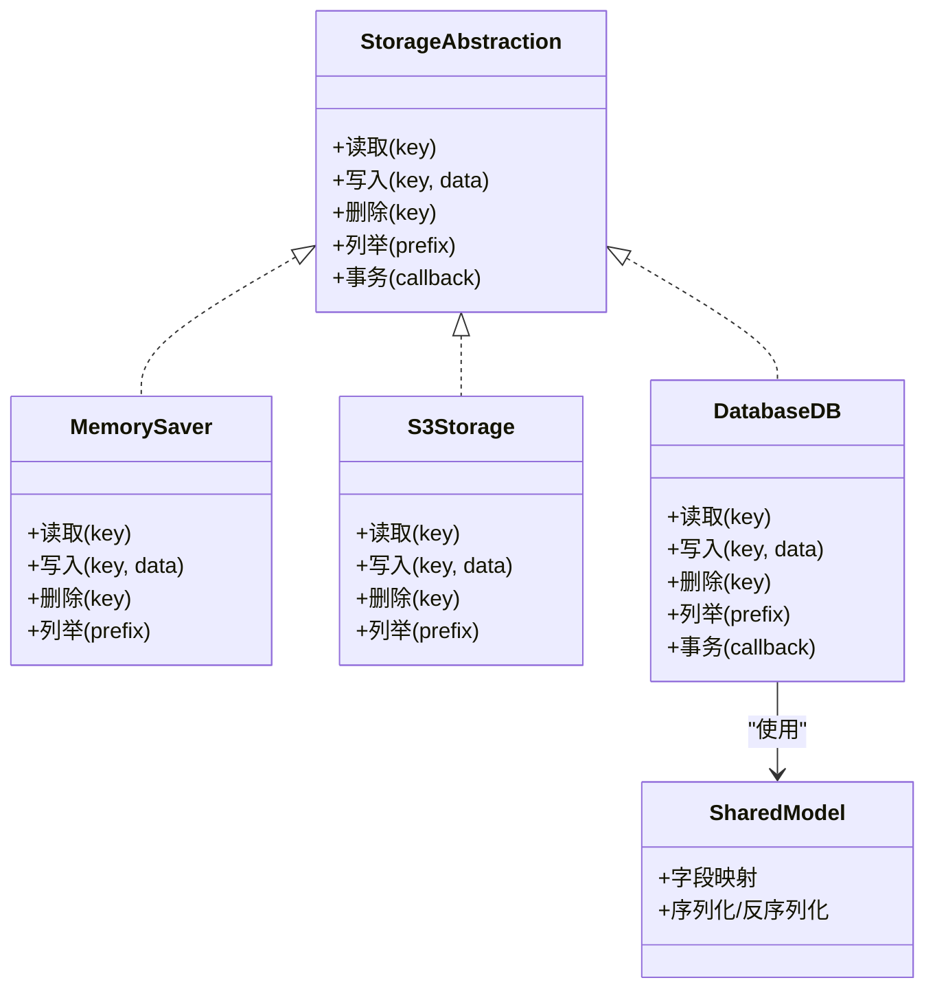
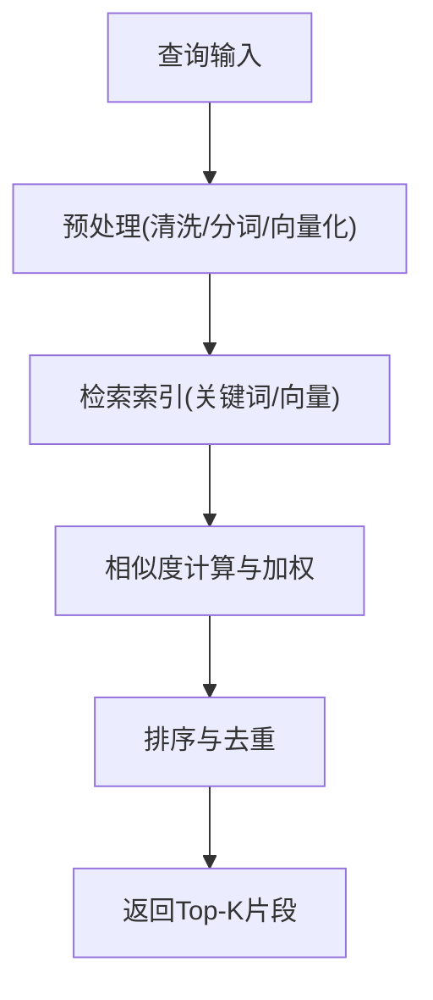
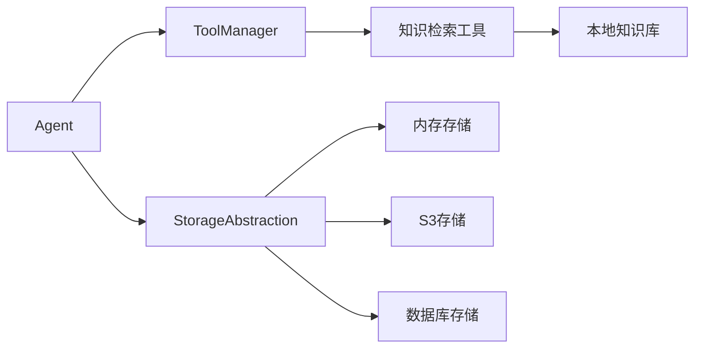

# 核心组件设计

<cite>
**本文引用的文件**   
- [src/agents/agent.py](file://src/agents/agent.py)
- [src/tools/knowledge_search.py](file://src/tools/knowledge_search.py)
- [src/storage/memory/memory_saver.py](file://src/storage/memory/memory_saver.py)
- [src/storage/s3/s3_storage.py](file://src/storage/s3/s3_storage.py)
- [src/storage/database/db.py](file://src/storage/database/db.py)
- [src/storage/database/shared/model.py](file://src/storage/database/shared/model.py)
- [src/local_knowledge.py](file://src/local_knowledge.py)
- [src/main.py](file://src/main.py)
- [config/agent_llm_config.json](file://config/agent_llm_config.json)
</cite>

## 目录
1. [简介](#简介)
2. [项目结构](#项目结构)
3. [核心组件](#核心组件)
4. [架构总览](#架构总览)
5. [详细组件分析](#详细组件分析)
6. [依赖关系分析](#依赖关系分析)
7. [性能考虑](#性能考虑)
8. [故障排查指南](#故障排查指南)
9. [结论](#结论)
10. [附录](#附录)

## 简介
本设计文档面向“智能审计风险识别系统”的核心组件，聚焦以下目标：
- 智能体协调器（Agent）的生命周期管理与任务调度机制
- 工具管理系统（ToolManager）的注册、发现与执行流程
- 存储抽象层（StorageAbstraction）的统一接口设计与多后端支持
- 知识库模块的知识检索与匹配算法
- 组件间通信机制与依赖关系（同步调用与异步处理）
- 配置方式与初始化流程
- 交互时序图与状态转换图
- 错误处理与异常恢复策略
- 可测试性与Mock策略

## 项目结构
仓库采用按功能域划分的分层组织方式：
- agents：智能体协调器实现
- tools：工具集合（含知识检索等）
- storage：存储抽象与多后端实现（内存、S3、数据库）
- local_knowledge：本地知识库加载与检索
- main：应用入口与装配
- config：运行时配置

图表来源
- [src/main.py](file://src/main.py)
- [src/agents/agent.py](file://src/agents/agent.py)
- [src/tools/knowledge_search.py](file://src/tools/knowledge_search.py)
- [src/local_knowledge.py](file://src/local_knowledge.py)
- [src/storage/memory/memory_saver.py](file://src/storage/memory/memory_saver.py)
- [src/storage/s3/s3_storage.py](file://src/storage/s3/s3_storage.py)
- [src/storage/database/db.py](file://src/storage/database/db.py)
- [src/storage/database/shared/model.py](file://src/storage/database/shared/model.py)
- [config/agent_llm_config.json](file://config/agent_llm_config.json)

章节来源
- [src/main.py](file://src/main.py)
- [src/agents/agent.py](file://src/agents/agent.py)
- [src/tools/knowledge_search.py](file://src/tools/knowledge_search.py)
- [src/local_knowledge.py](file://src/local_knowledge.py)
- [src/storage/memory/memory_saver.py](file://src/storage/memory/memory_saver.py)
- [src/storage/s3/s3_storage.py](file://src/storage/s3/s3_storage.py)
- [src/storage/database/db.py](file://src/storage/database/db.py)
- [src/storage/database/shared/model.py](file://src/storage/database/shared/model.py)
- [config/agent_llm_config.json](file://config/agent_llm_config.json)

## 核心组件
本节概述四大核心组件的职责与边界：
- 智能体协调器（Agent）：负责生命周期管理、任务编排、调度与结果聚合。
- 工具管理系统（ToolManager）：负责工具的注册、发现、参数校验与执行。
- 存储抽象层（StorageAbstraction）：提供统一读写接口，屏蔽内存、S3、数据库差异。
- 知识库模块：提供文本检索与相似度匹配，支撑风险案例与规则召回。

章节来源
- [src/agents/agent.py](file://src/agents/agent.py)
- [src/tools/knowledge_search.py](file://src/tools/knowledge_search.py)
- [src/storage/memory/memory_saver.py](file://src/storage/memory/memory_saver.py)
- [src/storage/s3/s3_storage.py](file://src/storage/s3/s3_storage.py)
- [src/storage/database/db.py](file://src/storage/database/db.py)
- [src/local_knowledge.py](file://src/local_knowledge.py)

## 架构总览
下图展示关键组件之间的依赖与数据流。Agent作为编排中心，按需调用工具；工具可能访问知识库或存储抽象层；存储抽象层将请求路由到具体后端。

图表来源
- [src/agents/agent.py](file://src/agents/agent.py)
- [src/tools/knowledge_search.py](file://src/tools/knowledge_search.py)
- [src/local_knowledge.py](file://src/local_knowledge.py)
- [src/storage/memory/memory_saver.py](file://src/storage/memory/memory_saver.py)
- [src/storage/s3/s3_storage.py](file://src/storage/s3/s3_storage.py)
- [src/storage/database/db.py](file://src/storage/database/db.py)

## 详细组件分析

### 智能体协调器（Agent）
职责与能力
- 生命周期管理：启动、运行、停止、资源清理。
- 任务编排：接收外部输入，构建任务图，分派给工具或子步骤。
- 调度机制：支持同步阻塞与异步并发两种模式，具备重试与超时控制。
- 结果聚合：合并各工具输出，生成最终报告或中间态快照。

关键流程
- 初始化：加载LLM配置、注册工具、初始化存储抽象层。
- 运行：解析输入、选择工具链、顺序/并行执行、收集结果。
- 终止：释放资源、持久化中间结果、上报状态。

图表来源
- [src/agents/agent.py](file://src/agents/agent.py)
- [src/tools/knowledge_search.py](file://src/tools/knowledge_search.py)
- [src/storage/memory/memory_saver.py](file://src/storage/memory/memory_saver.py)
- [src/storage/s3/s3_storage.py](file://src/storage/s3/s3_storage.py)
- [src/storage/database/db.py](file://src/storage/database/db.py)

状态转换

章节来源
- [src/agents/agent.py](file://src/agents/agent.py)
- [config/agent_llm_config.json](file://config/agent_llm_config.json)

### 工具管理系统（ToolManager）
职责与能力
- 注册：集中登记工具元信息（名称、版本、参数Schema、依赖）。
- 发现：按标签/类型/条件筛选可用工具集。
- 执行：参数校验、上下文注入、调用工具函数、捕获异常并标准化返回。
- 扩展：支持插件式新增工具，无需修改核心逻辑。

执行流程

章节来源
- [src/tools/knowledge_search.py](file://src/tools/knowledge_search.py)

### 存储抽象层（StorageAbstraction）
职责与能力
- 统一接口：定义一致的读/写/删除/列举/事务语义。
- 多后端支持：内存、S3、数据库三种后端可插拔切换。
- 一致性保障：在跨后端场景下提供幂等写入与冲突解决策略。
- 监控与日志：记录操作耗时、错误码与采样指标。

后端实现要点
- 内存存储：进程内字典/缓存，适合开发与快速验证。
- S3存储：基于对象键的路径命名空间，适合大文件与报表归档。
- 数据库存储：结构化数据持久化，结合共享模型进行映射。

图表来源
- [src/storage/memory/memory_saver.py](file://src/storage/memory/memory_saver.py)
- [src/storage/s3/s3_storage.py](file://src/storage/s3/s3_storage.py)
- [src/storage/database/db.py](file://src/storage/database/db.py)
- [src/storage/database/shared/model.py](file://src/storage/database/shared/model.py)

章节来源
- [src/storage/memory/memory_saver.py](file://src/storage/memory/memory_saver.py)
- [src/storage/s3/s3_storage.py](file://src/storage/s3/s3_storage.py)
- [src/storage/database/db.py](file://src/storage/database/db.py)
- [src/storage/database/shared/model.py](file://src/storage/database/shared/model.py)

### 知识库模块（检索与匹配）
职责与能力
- 加载：从本地文本文件批量导入案例与规则。
- 索引：构建倒排索引或向量索引，支持关键词与语义检索。
- 匹配：基于相似度阈值与权重打分，返回Top-K相关片段。
- 更新：增量追加与全量重建策略。

检索流程

章节来源
- [src/tools/knowledge_search.py](file://src/tools/knowledge_search.py)
- [src/local_knowledge.py](file://src/local_knowledge.py)

## 依赖关系分析
- Agent 依赖 ToolManager 与 StorageAbstraction，间接依赖具体工具与存储后端。
- 知识检索工具依赖本地知识库与可选的向量库。
- 存储抽象层对具体后端弱耦合，通过工厂或配置选择实现。

图表来源
- [src/agents/agent.py](file://src/agents/agent.py)
- [src/tools/knowledge_search.py](file://src/tools/knowledge_search.py)
- [src/local_knowledge.py](file://src/local_knowledge.py)
- [src/storage/memory/memory_saver.py](file://src/storage/memory/memory_saver.py)
- [src/storage/s3/s3_storage.py](file://src/storage/s3/s3_storage.py)
- [src/storage/database/db.py](file://src/storage/database/db.py)

章节来源
- [src/agents/agent.py](file://src/agents/agent.py)
- [src/tools/knowledge_search.py](file://src/tools/knowledge_search.py)
- [src/local_knowledge.py](file://src/local_knowledge.py)
- [src/storage/memory/memory_saver.py](file://src/storage/memory/memory_saver.py)
- [src/storage/s3/s3_storage.py](file://src/storage/s3/s3_storage.py)
- [src/storage/database/db.py](file://src/storage/database/db.py)

## 性能考虑
- 工具执行并发：对无副作用的工具启用并发执行，限制最大并发度避免资源争用。
- 知识检索优化：预建索引、分页与缓存热点片段，减少重复计算。
- 存储层优化：批量写入、连接池、对象分片上传与压缩。
- 超时与限流：对外部依赖设置合理超时与熔断，防止雪崩。
- 结果缓存：对相同查询命中缓存，降低延迟与负载。

## 故障排查指南
- 常见错误
  - 工具参数不合法：检查参数Schema与默认值填充逻辑。
  - 存储后端不可用：确认网络、凭证与权限，查看重试与降级策略。
  - 知识检索无结果：检查索引构建与阈值设置，必要时回退关键词检索。
- 诊断手段
  - 开启详细日志与采样指标，定位慢路径与异常点。
  - 使用最小复现用例隔离问题，逐步替换后端与工具。
- 恢复策略
  - 指数退避重试、断路器与降级到本地缓存。
  - 失败任务入队，支持离线补偿与人工干预。

章节来源
- [src/agents/agent.py](file://src/agents/agent.py)
- [src/storage/memory/memory_saver.py](file://src/storage/memory/memory_saver.py)
- [src/storage/s3/s3_storage.py](file://src/storage/s3/s3_storage.py)
- [src/storage/database/db.py](file://src/storage/database/db.py)
- [src/tools/knowledge_search.py](file://src/tools/knowledge_search.py)

## 结论
本设计通过清晰的组件边界与统一抽象，实现了可扩展的智能审计风险识别系统。Agent负责编排与调度，ToolManager提供灵活的工具生态，StorageAbstraction屏蔽多后端差异，知识库模块提供高效检索与匹配。配合完善的错误处理、性能优化与可测试性策略，系统可在生产环境中稳定运行并持续演进。

## 附录

### 配置与初始化流程
- 配置文件：LLM与Agent行为参数集中于配置文件中，启动时加载。
- 初始化顺序
  1) 加载配置
  2) 初始化存储抽象层（根据配置选择后端）
  3) 注册工具并构建索引
  4) 启动Agent并进入就绪状态

章节来源
- [config/agent_llm_config.json](file://config/agent_llm_config.json)
- [src/main.py](file://src/main.py)
- [src/agents/agent.py](file://src/agents/agent.py)
- [src/storage/memory/memory_saver.py](file://src/storage/memory/memory_saver.py)
- [src/storage/s3/s3_storage.py](file://src/storage/s3/s3_storage.py)
- [src/storage/database/db.py](file://src/storage/database/db.py)
- [src/tools/knowledge_search.py](file://src/tools/knowledge_search.py)

### 可测试性与Mock策略
- 单元测试
  - 为每个工具编写独立用例，覆盖正常路径与异常分支。
  - 针对存储抽象层，分别Mock内存、S3与数据库实现。
- 集成测试
  - 使用内存存储与轻量知识库进行端到端验证。
  - 模拟外部依赖失败，验证重试与降级。
- Mock建议
  - 使用接口契约约束，便于替换真实实现。
  - 固定随机种子与时间源，保证结果可重现。

章节来源
- [src/tools/knowledge_search.py](file://src/tools/knowledge_search.py)
- [src/storage/memory/memory_saver.py](file://src/storage/memory/memory_saver.py)
- [src/storage/s3/s3_storage.py](file://src/storage/s3/s3_storage.py)
- [src/storage/database/db.py](file://src/storage/database/db.py)
- [src/agents/agent.py](file://src/agents/agent.py)