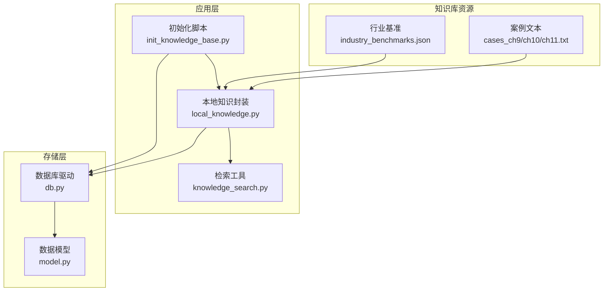
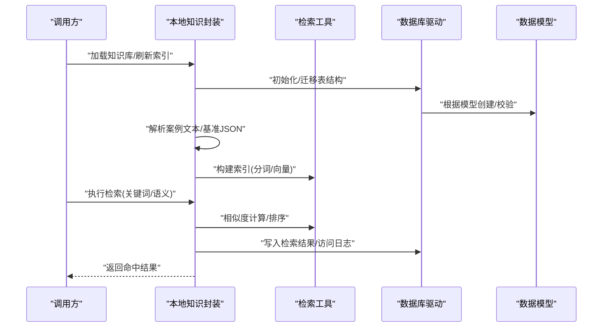
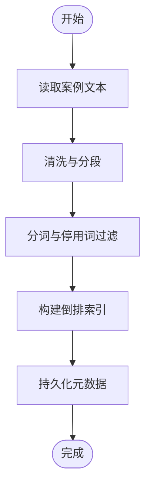
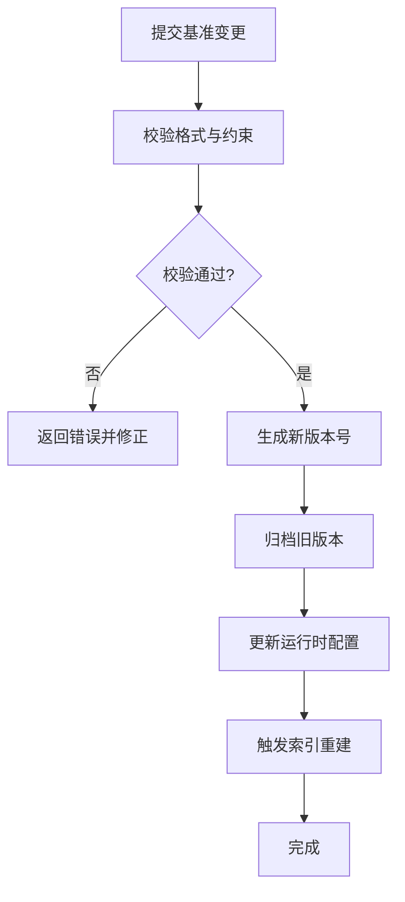
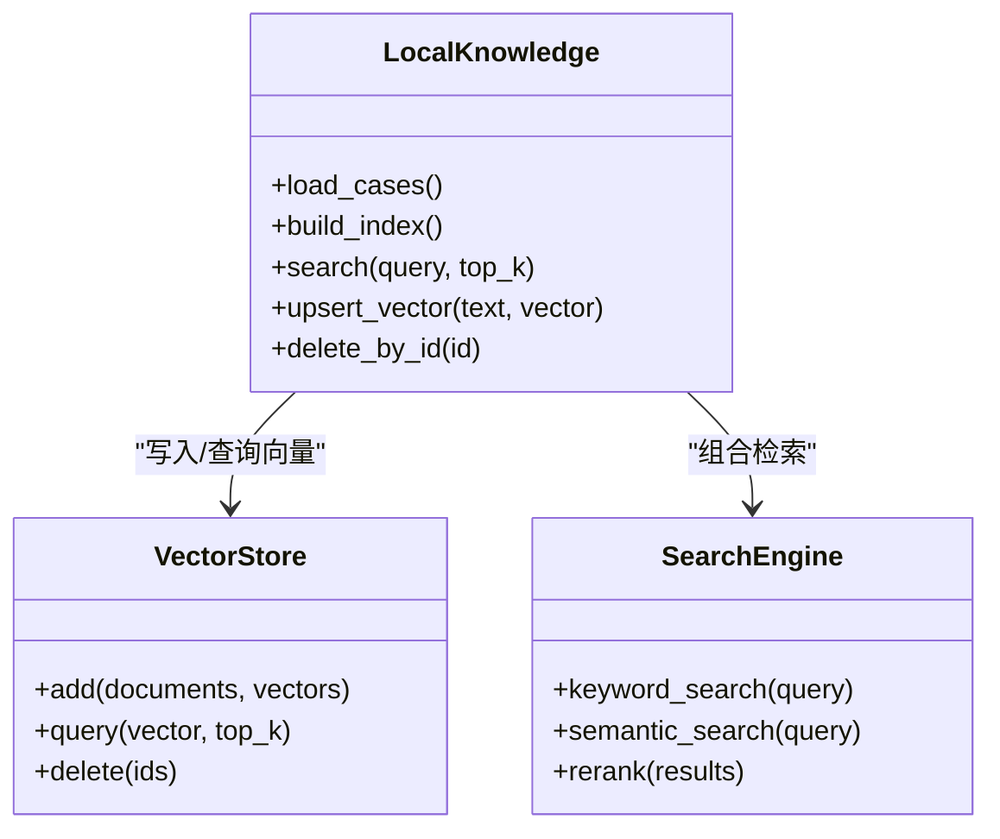
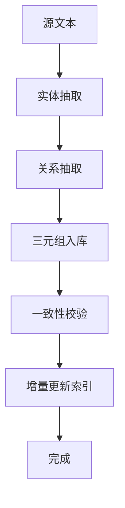
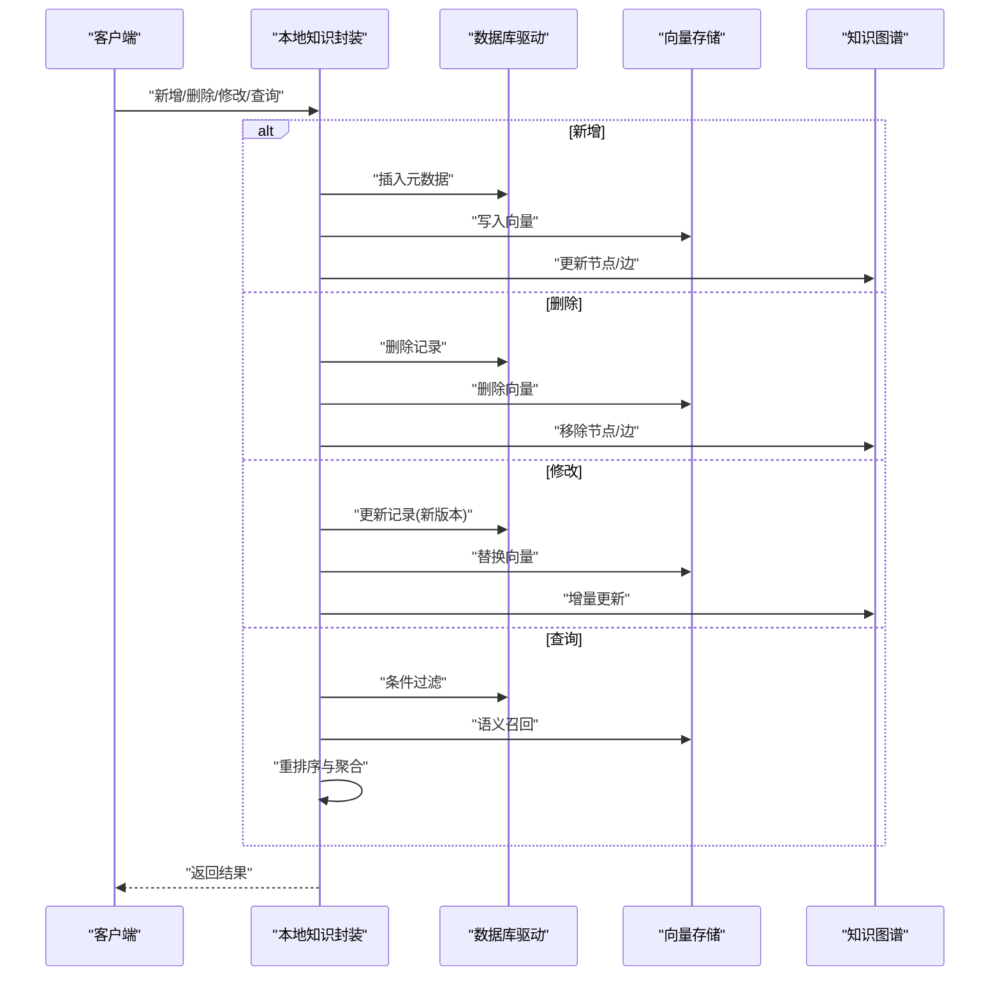
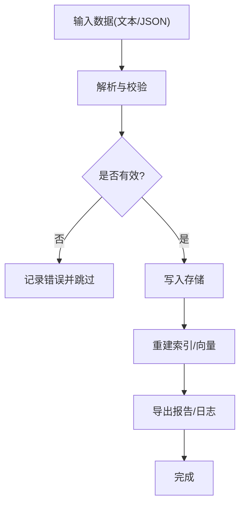
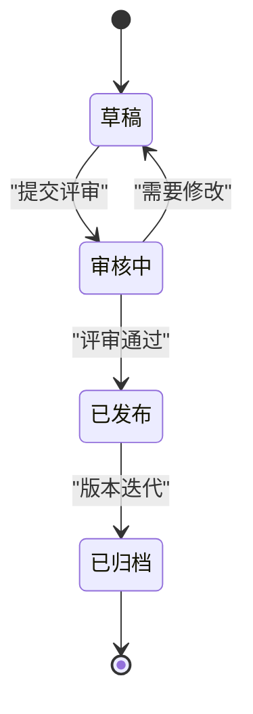
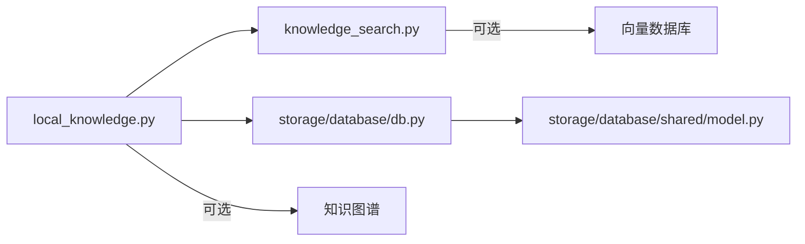

# 知识库模块

<cite>
**本文引用的文件**   
- [knowledge_base/cases_ch9.txt](file://knowledge_base/cases_ch9.txt)
- [knowledge_base/cases_ch10.txt](file://knowledge_base/cases_ch10.txt)
- [knowledge_base/cases_ch11.txt](file://knowledge_base/cases_ch11.txt)
- [assets/industry_benchmarks.json](file://assets/industry_benchmarks.json)
- [scripts/init_knowledge_base.py](file://scripts/init_knowledge_base.py)
- [src/tools/knowledge_search.py](file://src/tools/knowledge_search.py)
- [src/local_knowledge.py](file://src/local_knowledge.py)
- [src/storage/database/db.py](file://src/storage/database/db.py)
- [src/storage/database/shared/model.py](file://src/storage/database/shared/model.py)
- [pyproject.toml](file://pyproject.toml)
</cite>

## 目录
1. [简介](#简介)
2. [项目结构](#项目结构)
3. [核心组件](#核心组件)
4. [架构总览](#架构总览)
5. [详细组件分析](#详细组件分析)
6. [依赖关系分析](#依赖关系分析)
7. [性能考量](#性能考量)
8. [故障排查指南](#故障排查指南)
9. [结论](#结论)
10. [附录](#附录)

## 简介
本章节面向智能审计风险识别系统的“知识库模块”，聚焦以下目标：
- 解释知识库的架构设计与检索算法
- 描述案例库的结构组织、索引机制与相似度匹配
- 定义行业基准数据的格式与更新流程
- 说明向量数据库集成方式与语义搜索实现
- 阐述知识图谱的构建与维护机制
- 提供增删改查接口说明
- 给出知识导入导出工具与脚本
- 制定知识质量评估与版本管理策略
- 提供使用示例与扩展开发指南

## 项目结构
知识库相关资源与代码主要分布在如下位置：
- 案例文本：knowledge_base/*.txt（按章节划分）
- 行业基准数据：assets/industry_benchmarks.json
- 初始化脚本：scripts/init_knowledge_base.py
- 检索工具：src/tools/knowledge_search.py
- 本地知识封装：src/local_knowledge.py
- 持久化存储：src/storage/database/db.py 与 src/storage/database/shared/model.py
- 依赖声明：pyproject.toml

图表来源
- [knowledge_base/cases_ch9.txt](file://knowledge_base/cases_ch9.txt)
- [knowledge_base/cases_ch10.txt](file://knowledge_base/cases_ch10.txt)
- [knowledge_base/cases_ch11.txt](file://knowledge_base/cases_ch11.txt)
- [assets/industry_benchmarks.json](file://assets/industry_benchmarks.json)
- [scripts/init_knowledge_base.py](file://scripts/init_knowledge_base.py)
- [src/local_knowledge.py](file://src/local_knowledge.py)
- [src/tools/knowledge_search.py](file://src/tools/knowledge_search.py)
- [src/storage/database/db.py](file://src/storage/database/db.py)
- [src/storage/database/shared/model.py](file://src/storage/database/shared/model.py)

章节来源
- [knowledge_base/cases_ch9.txt](file://knowledge_base/cases_ch9.txt)
- [knowledge_base/cases_ch10.txt](file://knowledge_base/cases_ch10.txt)
- [knowledge_base/cases_ch11.txt](file://knowledge_base/cases_ch11.txt)
- [assets/industry_benchmarks.json](file://assets/industry_benchmarks.json)
- [scripts/init_knowledge_base.py](file://scripts/init_knowledge_base.py)
- [src/local_knowledge.py](file://src/local_knowledge.py)
- [src/tools/knowledge_search.py](file://src/tools/knowledge_search.py)
- [src/storage/database/db.py](file://src/storage/database/db.py)
- [src/storage/database/shared/model.py](file://src/storage/database/shared/model.py)

## 核心组件
- 案例库（文本型知识）
  - 以章节为单位的纯文本文件，便于维护与增量更新
  - 通过本地知识封装加载并暴露检索能力
- 行业基准（结构化数据）
  - JSON 文件，用于指标阈值、评分权重等参考值
  - 支持热加载与校验
- 本地知识封装
  - 统一入口，负责读取、缓存、索引与对外 API
- 检索工具
  - 提供关键词、分词、相似度计算与排序
- 存储层
  - 数据库驱动与数据模型，用于持久化索引、元数据与版本信息

章节来源
- [src/local_knowledge.py](file://src/local_knowledge.py)
- [src/tools/knowledge_search.py](file://src/tools/knowledge_search.py)
- [src/storage/database/db.py](file://src/storage/database/db.py)
- [src/storage/database/shared/model.py](file://src/storage/database/shared/model.py)

## 架构总览
知识库模块采用“资源-封装-检索-存储”的分层设计：
- 资源层：案例文本与行业基准
- 封装层：本地知识封装，提供统一的读、写、索引、查询接口
- 检索层：基于文本相似度与可选向量化检索
- 存储层：数据库持久化索引、元数据与版本记录

图表来源
- [src/local_knowledge.py](file://src/local_knowledge.py)
- [src/tools/knowledge_search.py](file://src/tools/knowledge_search.py)
- [src/storage/database/db.py](file://src/storage/database/db.py)
- [src/storage/database/shared/model.py](file://src/storage/database/shared/model.py)

## 详细组件分析

### 案例库结构与索引机制
- 组织结构
  - 按章节拆分为多个 txt 文件，便于独立维护与增量更新
  - 文件名包含章节标识，便于分类与检索范围限定
- 索引机制
  - 文本预处理：去噪、分段、分词
  - 倒排索引：建立词条到文档片段的位置映射
  - 元数据：记录来源文件、章节、更新时间、版本号
- 相似度匹配
  - 基础匹配：TF-IDF/BM25 风格打分
  - 语义匹配：可选向量表示与余弦相似度
  - 多路召回：关键词召回 + 语义召回融合排序

图表来源
- [knowledge_base/cases_ch9.txt](file://knowledge_base/cases_ch9.txt)
- [knowledge_base/cases_ch10.txt](file://knowledge_base/cases_ch10.txt)
- [knowledge_base/cases_ch11.txt](file://knowledge_base/cases_ch11.txt)
- [src/local_knowledge.py](file://src/local_knowledge.py)
- [src/tools/knowledge_search.py](file://src/tools/knowledge_search.py)

章节来源
- [knowledge_base/cases_ch9.txt](file://knowledge_base/cases_ch9.txt)
- [knowledge_base/cases_ch10.txt](file://knowledge_base/cases_ch10.txt)
- [knowledge_base/cases_ch11.txt](file://knowledge_base/cases_ch11.txt)
- [src/local_knowledge.py](file://src/local_knowledge.py)
- [src/tools/knowledge_search.py](file://src/tools/knowledge_search.py)

### 行业基准数据格式与更新流程
- 格式定义
  - JSON 结构，包含指标名称、阈值区间、适用行业、权重、生效时间、版本等字段
  - 支持批量条目与历史版本并存
- 更新流程
  - 新增或修订后提交变更清单
  - 运行校验脚本检查必填字段与取值范围
  - 生成新版本号并归档旧版本
  - 触发索引重建与缓存失效

图表来源
- [assets/industry_benchmarks.json](file://assets/industry_benchmarks.json)
- [src/local_knowledge.py](file://src/local_knowledge.py)

章节来源
- [assets/industry_benchmarks.json](file://assets/industry_benchmarks.json)
- [src/local_knowledge.py](file://src/local_knowledge.py)

### 向量数据库集成与语义搜索
- 集成方式
  - 在本地知识封装中引入向量嵌入服务
  - 将文本片段转换为向量并写入向量存储
  - 检索时进行近似最近邻搜索（ANN）
- 语义搜索实现
  - 查询文本同样进行嵌入
  - 与候选片段向量计算相似度
  - 结合关键词得分进行重排序

图表来源
- [src/local_knowledge.py](file://src/local_knowledge.py)
- [src/tools/knowledge_search.py](file://src/tools/knowledge_search.py)

章节来源
- [src/local_knowledge.py](file://src/local_knowledge.py)
- [src/tools/knowledge_search.py](file://src/tools/knowledge_search.py)

### 知识图谱构建与维护
- 构建流程
  - 从案例文本抽取实体与关系（如企业、科目、风险点、控制措施）
  - 将三元组写入图数据库或关系表
  - 维护节点属性与边权重
- 维护机制
  - 增量更新：仅处理新增/变更片段
  - 冲突解决：依据来源可信度与时间戳合并
  - 一致性校验：度数分布、环检测、缺失属性补全

图表来源
- [src/local_knowledge.py](file://src/local_knowledge.py)
- [src/tools/knowledge_search.py](file://src/tools/knowledge_search.py)

章节来源
- [src/local_knowledge.py](file://src/local_knowledge.py)
- [src/tools/knowledge_search.py](file://src/tools/knowledge_search.py)

### 增删改查操作接口
- 新增
  - 添加新案例或基准条目，生成唯一 ID，写入存储并更新索引
- 删除
  - 按 ID 或条件批量删除，清理向量与图节点
- 修改
  - 对现有条目进行字段更新，保留版本历史
- 查询
  - 关键词检索、语义检索、混合检索；支持分页与过滤

图表来源
- [src/local_knowledge.py](file://src/local_knowledge.py)
- [src/storage/database/db.py](file://src/storage/database/db.py)
- [src/storage/database/shared/model.py](file://src/storage/database/shared/model.py)

章节来源
- [src/local_knowledge.py](file://src/local_knowledge.py)
- [src/storage/database/db.py](file://src/storage/database/db.py)
- [src/storage/database/shared/model.py](file://src/storage/database/shared/model.py)

### 知识导入导出工具与脚本
- 导入
  - 批量导入案例文本与基准 JSON
  - 自动校验、去重、版本打标
- 导出
  - 按条件导出案例与基准数据
  - 输出为 JSON/CSV 以便离线分析
- 初始化脚本
  - 一键初始化知识库，建表、建索引、载入初始数据

图表来源
- [scripts/init_knowledge_base.py](file://scripts/init_knowledge_base.py)
- [src/local_knowledge.py](file://src/local_knowledge.py)

章节来源
- [scripts/init_knowledge_base.py](file://scripts/init_knowledge_base.py)
- [src/local_knowledge.py](file://src/local_knowledge.py)

### 知识质量评估与版本管理策略
- 质量评估
  - 完整性：必填字段齐全率
  - 准确性：与权威来源比对一致率
  - 时效性：过期条目比例
  - 可读性：重复率、噪声率
- 版本管理
  - 每次变更生成版本号，保留历史快照
  - 发布前进行回归测试与抽样复核
  - 回滚策略：按版本号快速恢复

图表来源
- [src/local_knowledge.py](file://src/local_knowledge.py)

章节来源
- [src/local_knowledge.py](file://src/local_knowledge.py)

### 使用示例与扩展开发指南
- 使用示例
  - 初始化知识库并构建索引
  - 执行关键词检索与语义检索
  - 导入新案例并验证结果
- 扩展开发
  - 新增检索策略：在检索工具中注册新的打分函数
  - 接入外部向量库：实现向量存储接口
  - 扩展图谱抽取器：增加领域实体与关系类型

章节来源
- [src/tools/knowledge_search.py](file://src/tools/knowledge_search.py)
- [src/local_knowledge.py](file://src/local_knowledge.py)

## 依赖关系分析
- 内部依赖
  - 本地知识封装依赖检索工具与存储层
  - 检索工具依赖文本处理与相似度计算
  - 存储层依赖数据模型定义
- 外部依赖
  - 向量数据库（可选）
  - 图数据库（可选）
  - 文本嵌入模型（可选）

图表来源
- [src/local_knowledge.py](file://src/local_knowledge.py)
- [src/tools/knowledge_search.py](file://src/tools/knowledge_search.py)
- [src/storage/database/db.py](file://src/storage/database/db.py)
- [src/storage/database/shared/model.py](file://src/storage/database/shared/model.py)

章节来源
- [src/local_knowledge.py](file://src/local_knowledge.py)
- [src/tools/knowledge_search.py](file://src/tools/knowledge_search.py)
- [src/storage/database/db.py](file://src/storage/database/db.py)
- [src/storage/database/shared/model.py](file://src/storage/database/shared/model.py)

## 性能考量
- 索引构建
  - 分批处理大文件，避免内存峰值
  - 增量索引减少重建开销
- 检索优化
  - 预取热门片段，降低 IO 延迟
  - 向量检索使用 ANN 加速
- 存储优化
  - 冷热分层：热点数据常驻内存，冷数据落盘
  - 压缩与去重减少存储空间

[本节为通用指导，不直接分析具体文件]

## 故障排查指南
- 常见问题
  - 索引未更新：检查初始化脚本与增量任务是否成功
  - 检索结果为空：确认分词词典与停用词配置
  - 向量检索失败：核对嵌入模型与向量库连接
- 定位方法
  - 查看导入导出日志
  - 检查数据库表结构与版本记录
  - 对比基准数据校验结果

章节来源
- [scripts/init_knowledge_base.py](file://scripts/init_knowledge_base.py)
- [src/local_knowledge.py](file://src/local_knowledge.py)
- [src/storage/database/db.py](file://src/storage/database/db.py)

## 结论
知识库模块通过清晰的层次化设计与可扩展的检索策略，支撑了审计风险识别场景下的知识管理与高效检索。建议在生产环境启用向量检索与知识图谱，以提升语义理解与关联推理能力；同时完善质量评估与版本管理，确保知识的准确性与可追溯性。

[本节为总结性内容，不直接分析具体文件]

## 附录
- 依赖与环境
  - 参见项目依赖声明文件，了解第三方库与版本要求

章节来源
- [pyproject.toml](file://pyproject.toml)