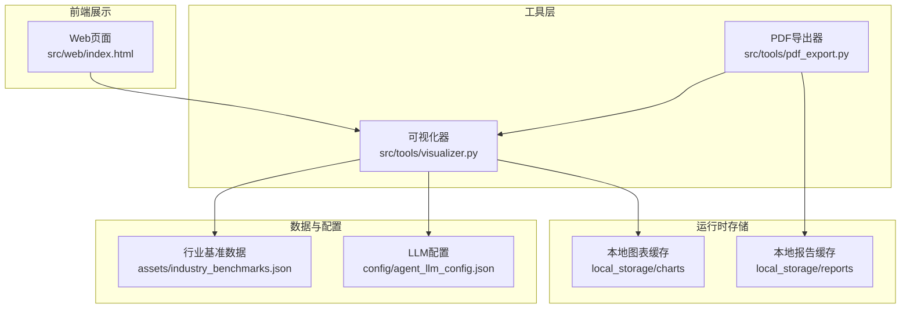
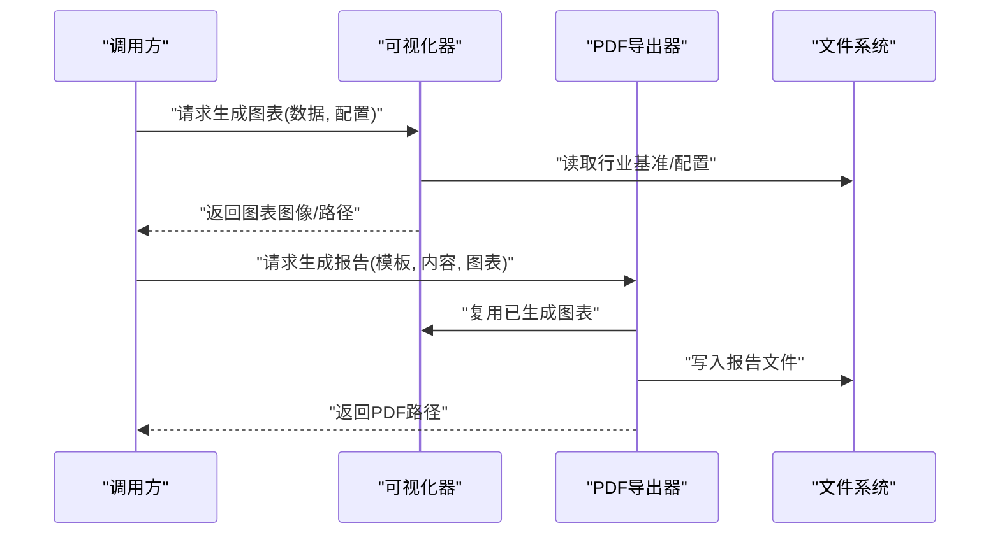
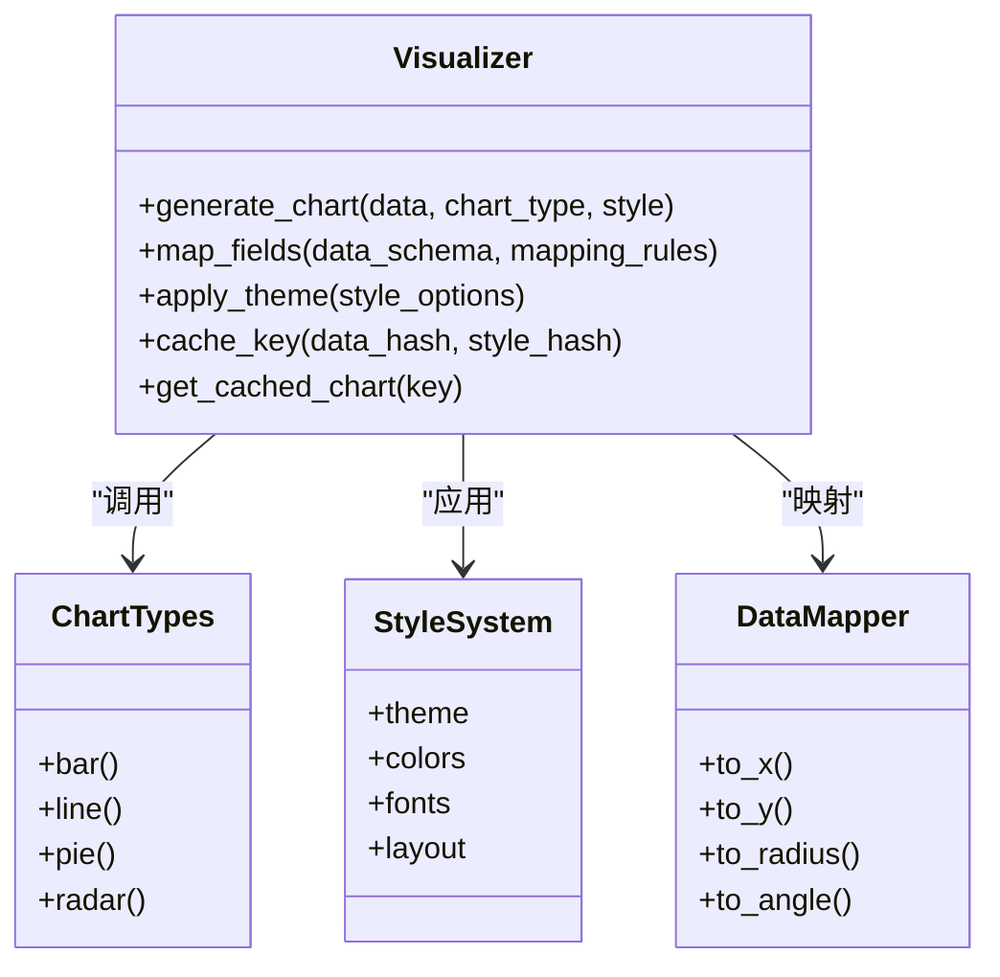
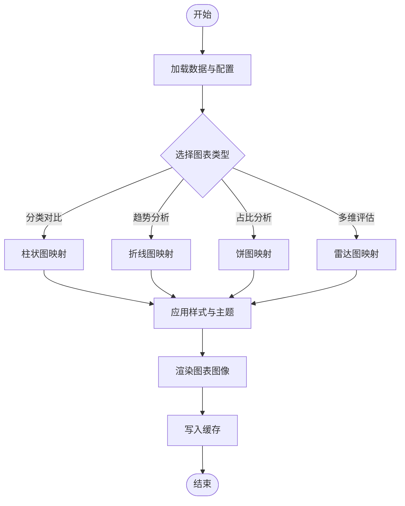
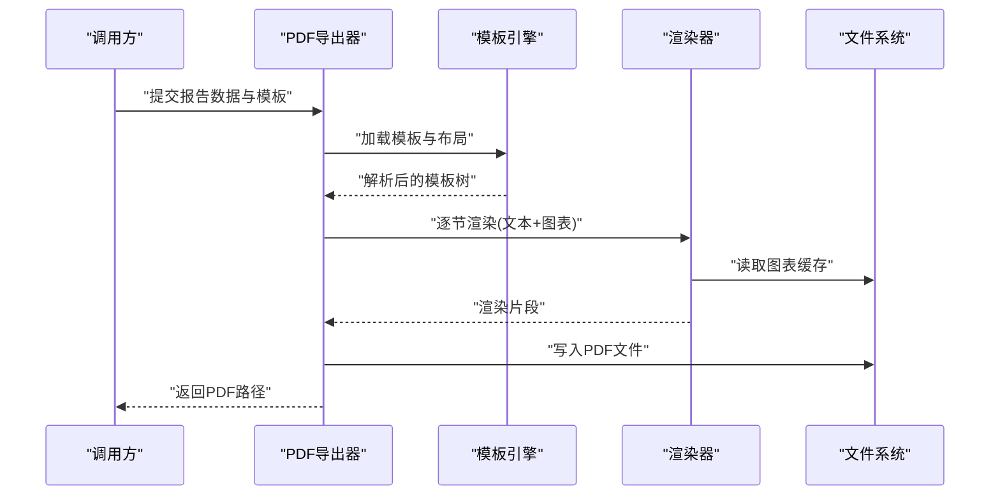
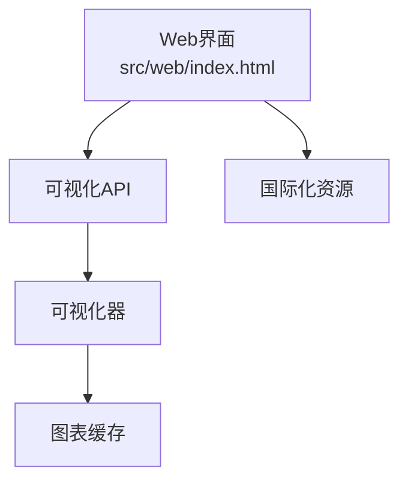
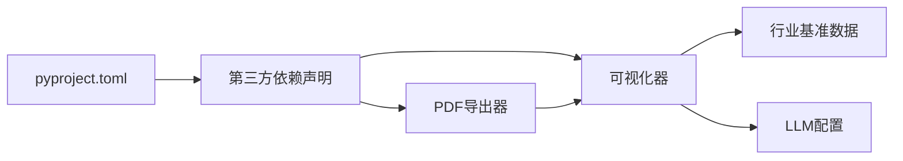

# 可视化与报告生成

<cite>
**本文引用的文件**   
- [src/tools/visualizer.py](file://src/tools/visualizer.py)
- [src/tools/pdf_export.py](file://src/tools/pdf_export.py)
- [src/web/index.html](file://src/web/index.html)
- [assets/industry_benchmarks.json](file://assets/industry_benchmarks.json)
- [config/agent_llm_config.json](file://config/agent_llm_config.json)
- [pyproject.toml](file://pyproject.toml)
</cite>

## 目录
1. [简介](#简介)
2. [项目结构](#项目结构)
3. [核心组件](#核心组件)
4. [架构总览](#架构总览)
5. [详细组件分析](#详细组件分析)
6. [依赖关系分析](#依赖关系分析)
7. [性能考虑](#性能考虑)
8. [故障排查指南](#故障排查指南)
9. [结论](#结论)
10. [附录](#附录)

## 简介
本技术文档聚焦于“可视化与报告生成”模块，覆盖以下目标：
- 可视化工具的实现原理：图表类型选择、数据映射规则、样式定制选项
- PDF导出器的模板系统：布局设计、内容渲染、格式转换
- 支持的图表类型：柱状图、折线图、饼图、雷达图的生成方法
- API接口文档：配置参数、样式选项、输出格式
- 使用示例：如何创建专业审计报告
- 响应式设计、多语言支持与国际化配置
- 缓存机制与性能优化策略

## 项目结构
与可视化与报告生成相关的代码主要位于 src/tools 目录，包含可视化器与PDF导出器；前端页面在 src/web/index.html；行业基准数据在 assets/industry_benchmarks.json；LLM相关配置在 config/agent_llm_config.json。

**图示来源**
- [src/tools/visualizer.py](file://src/tools/visualizer.py)
- [src/tools/pdf_export.py](file://src/tools/pdf_export.py)
- [src/web/index.html](file://src/web/index.html)
- [assets/industry_benchmarks.json](file://assets/industry_benchmarks.json)
- [config/agent_llm_config.json](file://config/agent_llm_config.json)

**章节来源**
- [src/tools/visualizer.py](file://src/tools/visualizer.py)
- [src/tools/pdf_export.py](file://src/tools/pdf_export.py)
- [src/web/index.html](file://src/web/index.html)
- [assets/industry_benchmarks.json](file://assets/industry_benchmarks.json)
- [config/agent_llm_config.json](file://config/agent_llm_config.json)

## 核心组件
- 可视化器（Visualizer）
  - 负责将结构化数据转换为图表图像或可嵌入的图形对象
  - 支持多种图表类型：柱状图、折线图、饼图、雷达图
  - 提供样式定制能力：主题、颜色、字体、尺寸等
  - 内置数据映射规则：字段到视觉通道（x/y/半径/角度）的映射
- PDF导出器（PDF Exporter）
  - 基于模板系统渲染报告内容
  - 支持布局控制、分页、页眉页脚、图表嵌入
  - 将可视化结果与文本内容组合为最终PDF

**章节来源**
- [src/tools/visualizer.py](file://src/tools/visualizer.py)
- [src/tools/pdf_export.py](file://src/tools/pdf_export.py)

## 架构总览
可视化与报告生成的整体流程如下：
- 输入数据与配置加载
- 可视化器根据数据类型与用户偏好选择图表类型并生成图像
- PDF导出器读取模板与布局，将文本与图表合并渲染
- 输出PDF报告与中间产物（图表缓存）

**图示来源**
- [src/tools/visualizer.py](file://src/tools/visualizer.py)
- [src/tools/pdf_export.py](file://src/tools/pdf_export.py)

## 详细组件分析

### 可视化器（Visualizer）
- 职责
  - 解析输入数据结构，执行字段到视觉通道的映射
  - 根据业务场景与数据特征自动选择图表类型
  - 应用样式主题与定制选项
  - 输出图像文件或内存对象供后续渲染
- 关键能力
  - 图表类型选择：柱状图、折线图、饼图、雷达图
  - 数据映射规则：时间序列→折线，分类对比→柱状，占比→饼图，多维指标→雷达
  - 样式定制：主题、配色、字体、尺寸、标注、网格线、图例位置
  - 缓存：对相同输入与配置的图表进行缓存，避免重复计算

**图示来源**
- [src/tools/visualizer.py](file://src/tools/visualizer.py)

**章节来源**
- [src/tools/visualizer.py](file://src/tools/visualizer.py)

#### 图表类型与数据映射
- 柱状图
  - 适用：分类对比、年度/季度指标比较
  - 映射：类别字段→X轴，数值字段→Y轴
  - 样式：分组/堆叠、颜色区分、标签显示
- 折线图
  - 适用：趋势分析、时间序列
  - 映射：时间字段→X轴，数值字段→Y轴
  - 样式：平滑曲线、标记点、多系列叠加
- 饼图
  - 适用：占比分析、构成比例
  - 映射：类别字段→扇区，数值字段→半径/面积
  - 样式：百分比标注、内嵌标签、环形图
- 雷达图
  - 适用：多维指标评估、能力画像
  - 映射：维度字段→角度，数值字段→半径
  - 样式：网格层级、区域填充、多边形叠加

**图示来源**
- [src/tools/visualizer.py](file://src/tools/visualizer.py)

### PDF导出器（PDF Exporter）
- 职责
  - 管理模板系统与布局
  - 渲染文本内容与嵌入图表
  - 处理分页、页眉页脚、目录与索引
  - 输出标准PDF文件
- 关键能力
  - 模板变量替换：标题、作者、日期、章节、图表占位符
  - 布局控制：边距、列数、段落间距、图片缩放
  - 格式转换：SVG/PNG→PDF矢量/栅格嵌入
  - 缓存：对已渲染页面片段进行缓存，提升批量生成效率

**图示来源**
- [src/tools/pdf_export.py](file://src/tools/pdf_export.py)

**章节来源**
- [src/tools/pdf_export.py](file://src/tools/pdf_export.py)

### Web集成与响应式展示
- 前端页面通过API调用可视化器获取图表，并在浏览器中展示
- 响应式设计适配不同屏幕尺寸，动态调整图表尺寸与布局
- 可选的多语言切换与国际化文案加载

**图示来源**
- [src/web/index.html](file://src/web/index.html)
- [src/tools/visualizer.py](file://src/tools/visualizer.py)

**章节来源**
- [src/web/index.html](file://src/web/index.html)
- [src/tools/visualizer.py](file://src/tools/visualizer.py)

## 依赖关系分析
- 外部依赖
  - 图表渲染库：用于生成柱状图、折线图、饼图、雷达图
  - PDF生成库：用于模板渲染与PDF输出
  - 配置文件：LLM配置与行业基准数据
- 内部依赖
  - 可视化器被PDF导出器复用，减少重复计算
  - 前端页面依赖可视化器提供的接口

**图示来源**
- [pyproject.toml](file://pyproject.toml)
- [src/tools/visualizer.py](file://src/tools/visualizer.py)
- [src/tools/pdf_export.py](file://src/tools/pdf_export.py)
- [assets/industry_benchmarks.json](file://assets/industry_benchmarks.json)
- [config/agent_llm_config.json](file://config/agent_llm_config.json)

**章节来源**
- [pyproject.toml](file://pyproject.toml)
- [assets/industry_benchmarks.json](file://assets/industry_benchmarks.json)
- [config/agent_llm_config.json](file://config/agent_llm_config.json)

## 性能考虑
- 缓存策略
  - 图表缓存：以输入数据哈希与样式哈希作为键，避免重复渲染
  - 页面片段缓存：对复杂模板渲染结果进行缓存，提高批量生成速度
- 并发与异步
  - 并行生成多个图表与报告页面，充分利用CPU/GPU资源
- I/O优化
  - 使用流式写入与分块处理，降低内存占用
  - 合理设置图片压缩与分辨率，平衡质量与体积
- 资源回收
  - 及时释放临时文件与内存对象，防止泄漏

[本节为通用性能建议，不直接分析具体文件]

## 故障排查指南
- 常见问题
  - 图表未生成：检查输入数据结构是否符合映射规则
  - PDF空白页：确认模板变量是否完整、图表路径是否正确
  - 样式异常：验证主题与颜色配置是否有效
- 定位步骤
  - 查看日志输出，定位错误堆栈
  - 检查缓存目录是否存在损坏文件
  - 验证配置文件与数据源的可访问性
- 恢复措施
  - 清理缓存并重试
  - 回退到默认主题与布局
  - 校验数据完整性与格式

**章节来源**
- [src/tools/visualizer.py](file://src/tools/visualizer.py)
- [src/tools/pdf_export.py](file://src/tools/pdf_export.py)

## 结论
可视化与报告生成模块通过清晰的职责划分与良好的缓存机制，实现了从数据到图表再到PDF报告的端到端流程。其模板系统与样式定制能力使得审计等专业报告具备高一致性与专业性。结合响应式设计与国际化配置，该模块可在多终端与多语言环境下稳定运行。

[本节为总结性内容，不直接分析具体文件]

## 附录

### API接口参考
- 可视化器接口
  - 生成图表
    - 输入：数据对象、图表类型、样式配置
    - 输出：图表图像路径或二进制数据
    - 说明：支持柱状图、折线图、饼图、雷达图
  - 样式定制
    - 主题、颜色、字体、尺寸、标注、网格线、图例位置
- PDF导出器接口
  - 生成报告
    - 输入：模板路径、报告数据、图表列表
    - 输出：PDF文件路径
    - 说明：支持布局控制、分页、页眉页脚、目录

**章节来源**
- [src/tools/visualizer.py](file://src/tools/visualizer.py)
- [src/tools/pdf_export.py](file://src/tools/pdf_export.py)

### 使用示例：创建专业审计报告
- 准备数据
  - 财务指标、风险评分、行业基准对比
- 选择图表
  - 趋势用折线图，对比用柱状图，占比用饼图，综合评估用雷达图
- 应用样式
  - 统一主题、配色方案、字体规范
- 生成报告
  - 使用模板插入章节与图表，设置页眉页脚与目录
- 输出与分发
  - 保存PDF至指定目录，附带图表缓存以便复用

**章节来源**
- [src/tools/visualizer.py](file://src/tools/visualizer.py)
- [src/tools/pdf_export.py](file://src/tools/pdf_export.py)

### 响应式设计与国际化
- 响应式
  - 前端自适应布局，图表尺寸随容器变化
  - 移动端优化触控与交互体验
- 国际化
  - 多语言资源文件加载
  - 模板中的文案变量按语言切换

**章节来源**
- [src/web/index.html](file://src/web/index.html)

### 配置项参考
- LLM配置
  - 模型选择、温度、最大长度等
- 行业基准数据
  - 基准指标定义、权重与阈值

**章节来源**
- [config/agent_llm_config.json](file://config/agent_llm_config.json)
- [assets/industry_benchmarks.json](file://assets/industry_benchmarks.json)