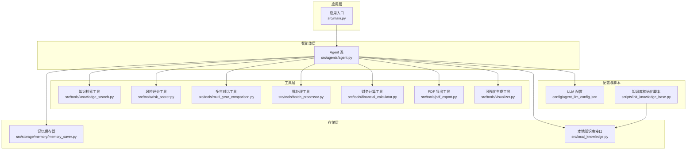
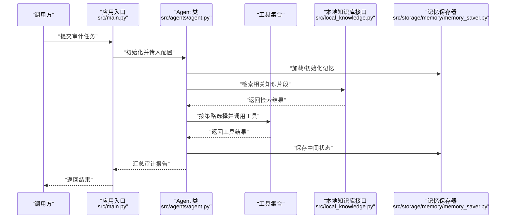
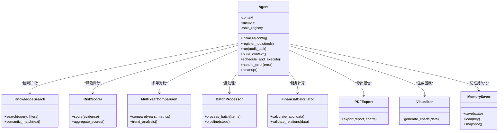
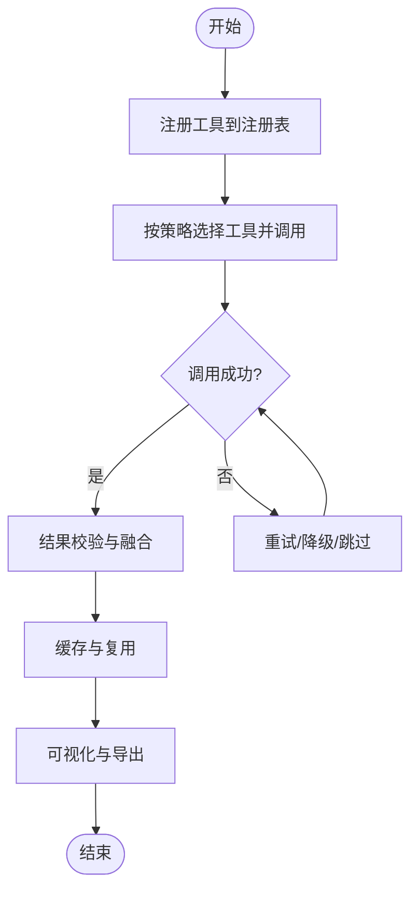
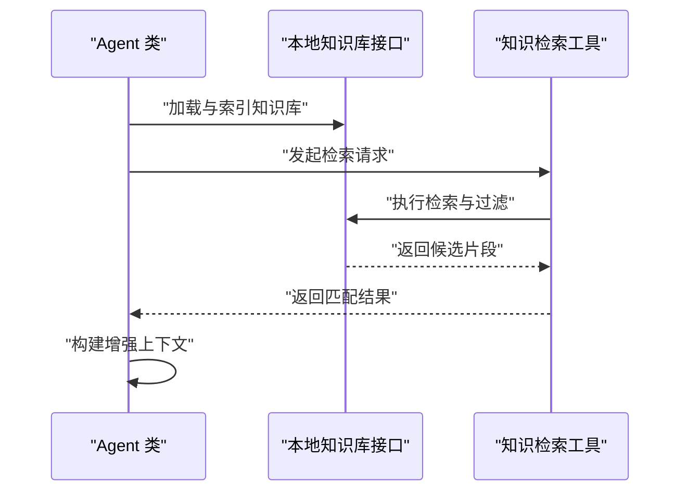
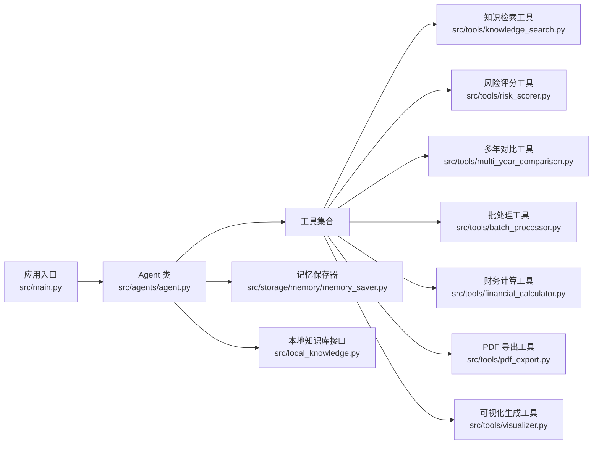

# 智能体系统

<cite>
**本文引用的文件**   
- [src/agents/agent.py](file://src/agents/agent.py)
- [src/main.py](file://src/main.py)
- [config/agent_llm_config.json](file://config/agent_llm_config.json)
- [src/tools/knowledge_search.py](file://src/tools/knowledge_search.py)
- [src/tools/risk_scorer.py](file://src/tools/risk_scorer.py)
- [src/tools/multi_year_comparison.py](file://src/tools/multi_year_comparison.py)
- [src/tools/batch_processor.py](file://src/tools/batch_processor.py)
- [src/tools/financial_calculator.py](file://src/tools/financial_calculator.py)
- [src/tools/pdf_export.py](file://src/tools/pdf_export.py)
- [src/tools/visualizer.py](file://src/tools/visualizer.py)
- [src/storage/memory/memory_saver.py](file://src/storage/memory/memory_saver.py)
- [src/local_knowledge.py](file://src/local_knowledge.py)
- [scripts/init_knowledge_base.py](file://scripts/init_knowledge_base.py)
</cite>

## 目录
1. [简介](#简介)
2. [项目结构](#项目结构)
3. [核心组件](#核心组件)
4. [架构总览](#架构总览)
5. [详细组件分析](#详细组件分析)
6. [依赖关系分析](#依赖关系分析)
7. [性能考虑](#性能考虑)
8. [故障排查指南](#故障排查指南)
9. [结论](#结论)
10. [附录](#附录)

## 简介
本技术文档面向“智能审计风险识别系统”的智能体子系统，聚焦 Agent 类的核心架构与运行机制。文档从系统架构、组件关系、数据流、处理逻辑、集成点、错误处理、性能特征等维度展开，帮助读者理解并扩展智能体的生命周期管理、任务调度机制、状态管理、工具交互协议、知识图谱集成方式，并提供初始化与执行审计任务的实践指引、错误恢复策略与性能优化建议。

## 项目结构
本项目采用分层与模块化组织：
- src/agents：智能体核心实现（Agent 类）
- src/tools：审计相关工具集（检索、评分、对比、批处理、可视化、导出等）
- src/storage：持久化与内存存储（含记忆保存器）
- src/local_knowledge.py：本地知识库加载与检索接口
- scripts/init_knowledge_base.py：知识库初始化脚本
- config/agent_llm_config.json：LLM 配置参数
- src/main.py：应用入口与编排

图表来源
- [src/main.py](file://src/main.py)
- [src/agents/agent.py](file://src/agents/agent.py)
- [src/tools/knowledge_search.py](file://src/tools/knowledge_search.py)
- [src/tools/risk_scorer.py](file://src/tools/risk_scorer.py)
- [src/tools/multi_year_comparison.py](file://src/tools/multi_year_comparison.py)
- [src/tools/batch_processor.py](file://src/tools/batch_processor.py)
- [src/tools/financial_calculator.py](file://src/tools/financial_calculator.py)
- [src/tools/pdf_export.py](file://src/tools/pdf_export.py)
- [src/tools/visualizer.py](file://src/tools/visualizer.py)
- [src/storage/memory/memory_saver.py](file://src/storage/memory/memory_saver.py)
- [src/local_knowledge.py](file://src/local_knowledge.py)
- [config/agent_llm_config.json](file://config/agent_llm_config.json)
- [scripts/init_knowledge_base.py](file://scripts/init_knowledge_base.py)

章节来源
- [src/main.py](file://src/main.py)
- [src/agents/agent.py](file://src/agents/agent.py)
- [config/agent_llm_config.json](file://config/agent_llm_config.json)
- [src/local_knowledge.py](file://src/local_knowledge.py)
- [scripts/init_knowledge_base.py](file://scripts/init_knowledge_base.py)

## 核心组件
本节聚焦 Agent 类及其关键协作对象，解释其职责边界与交互契约。

- Agent 类
  - 职责：作为审计任务编排的核心控制器，负责生命周期管理（初始化、运行、清理）、任务调度（按策略选择工具与顺序）、状态管理（上下文、中间结果、最终输出）、与工具系统的调用协议、与知识库的检索与语义匹配、以及异常恢复与重试。
  - 关键能力：
    - 生命周期：创建实例、加载配置、注册工具、启动执行、结束清理。
    - 任务调度：根据输入审计目标与上下文，动态选择工具组合与执行路径。
    - 状态管理：维护会话级上下文、中间产物、指标与日志。
    - 工具协议：统一入参/出参规范、错误码约定、幂等性与重试策略。
    - 知识集成：通过本地知识库接口进行检索、语义匹配与上下文构建。
    - 记忆持久化：使用记忆保存器记录关键状态以便恢复与回溯。

- 工具系统
  - 知识检索工具：提供关键词与语义检索，返回候选片段与相似度。
  - 风险评分工具：基于规则或模型对审计证据进行风险打分。
  - 多年对比工具：跨年度指标对比与趋势分析。
  - 批处理工具：批量数据处理与流水线控制。
  - 财务计算工具：财务比率、勾稽关系校验等计算。
  - PDF 导出工具：将报告与图表导出为 PDF。
  - 可视化生成工具：生成图表与可视化素材。

- 记忆保存器
  - 职责：在内存中保存智能体运行状态、中间结果与上下文快照，支持断点续跑与回溯。

- 本地知识库接口
  - 职责：封装知识库加载、索引、检索与过滤逻辑，供 Agent 按需查询。

章节来源
- [src/agents/agent.py](file://src/agents/agent.py)
- [src/tools/knowledge_search.py](file://src/tools/knowledge_search.py)
- [src/tools/risk_scorer.py](file://src/tools/risk_scorer.py)
- [src/tools/multi_year_comparison.py](file://src/tools/multi_year_comparison.py)
- [src/tools/batch_processor.py](file://src/tools/batch_processor.py)
- [src/tools/financial_calculator.py](file://src/tools/financial_calculator.py)
- [src/tools/pdf_export.py](file://src/tools/pdf_export.py)
- [src/tools/visualizer.py](file://src/tools/visualizer.py)
- [src/storage/memory/memory_saver.py](file://src/storage/memory/memory_saver.py)
- [src/local_knowledge.py](file://src/local_knowledge.py)

## 架构总览
下图展示智能体系统与工具、知识库、记忆保存器之间的交互关系与数据流向。

图表来源
- [src/main.py](file://src/main.py)
- [src/agents/agent.py](file://src/agents/agent.py)
- [src/local_knowledge.py](file://src/local_knowledge.py)
- [src/storage/memory/memory_saver.py](file://src/storage/memory/memory_saver.py)
- [src/tools/knowledge_search.py](file://src/tools/knowledge_search.py)
- [src/tools/risk_scorer.py](file://src/tools/risk_scorer.py)
- [src/tools/multi_year_comparison.py](file://src/tools/multi_year_comparison.py)
- [src/tools/batch_processor.py](file://src/tools/batch_processor.py)
- [src/tools/financial_calculator.py](file://src/tools/financial_calculator.py)
- [src/tools/pdf_export.py](file://src/tools/pdf_export.py)
- [src/tools/visualizer.py](file://src/tools/visualizer.py)

## 详细组件分析

### Agent 类核心架构设计
- 生命周期管理
  - 初始化阶段：加载 LLM 配置、注册工具、初始化记忆保存器、建立知识库连接。
  - 运行阶段：解析审计任务、构建上下文、调度工具链、聚合结果、生成报告。
  - 清理阶段：释放资源、持久化最终状态、关闭外部连接。
- 任务调度机制
  - 策略驱动：根据审计目标与上下文，选择合适工具组合与执行顺序。
  - 容错与重试：对失败的工具调用实施指数退避重试，必要时回滚中间状态。
  - 并行与批处理：对可并行的工具调用进行并发执行，提升吞吐。
- 状态管理
  - 上下文：包含审计范围、时间窗口、关注指标、约束条件等。
  - 中间产物：工具输出、评分结果、对比分析、可视化素材。
  - 持久化：通过记忆保存器定期快照，支持断点续跑与回溯。

图表来源
- [src/agents/agent.py](file://src/agents/agent.py)
- [src/tools/knowledge_search.py](file://src/tools/knowledge_search.py)
- [src/tools/risk_scorer.py](file://src/tools/risk_scorer.py)
- [src/tools/multi_year_comparison.py](file://src/tools/multi_year_comparison.py)
- [src/tools/batch_processor.py](file://src/tools/batch_processor.py)
- [src/tools/financial_calculator.py](file://src/tools/financial_calculator.py)
- [src/tools/pdf_export.py](file://src/tools/pdf_export.py)
- [src/tools/visualizer.py](file://src/tools/visualizer.py)
- [src/storage/memory/memory_saver.py](file://src/storage/memory/memory_saver.py)

章节来源
- [src/agents/agent.py](file://src/agents/agent.py)

### 工具系统交互模式
- 工具注册
  - Agent 在初始化时集中注册工具，形成统一的工具注册表，便于调度与发现。
- 调用协议
  - 统一入参：以结构化对象传递审计上下文、筛选条件与参数。
  - 统一出参：标准化结果结构，包含数据、元信息、错误码与提示。
  - 错误约定：定义错误类型与恢复策略（重试、降级、跳过）。
- 结果处理
  - 聚合与校验：对多工具结果进行一致性校验与融合。
  - 缓存与复用：对重复查询与计算结果进行缓存，减少冗余开销。
  - 可视化与导出：将结果转化为图表与报告，支持 PDF 导出。

图表来源
- [src/agents/agent.py](file://src/agents/agent.py)
- [src/tools/knowledge_search.py](file://src/tools/knowledge_search.py)
- [src/tools/risk_scorer.py](file://src/tools/risk_scorer.py)
- [src/tools/multi_year_comparison.py](file://src/tools/multi_year_comparison.py)
- [src/tools/batch_processor.py](file://src/tools/batch_processor.py)
- [src/tools/financial_calculator.py](file://src/tools/financial_calculator.py)
- [src/tools/pdf_export.py](file://src/tools/pdf_export.py)
- [src/tools/visualizer.py](file://src/tools/visualizer.py)

章节来源
- [src/agents/agent.py](file://src/agents/agent.py)
- [src/tools/knowledge_search.py](file://src/tools/knowledge_search.py)
- [src/tools/risk_scorer.py](file://src/tools/risk_scorer.py)
- [src/tools/multi_year_comparison.py](file://src/tools/multi_year_comparison.py)
- [src/tools/batch_processor.py](file://src/tools/batch_processor.py)
- [src/tools/financial_calculator.py](file://src/tools/financial_calculator.py)
- [src/tools/pdf_export.py](file://src/tools/pdf_export.py)
- [src/tools/visualizer.py](file://src/tools/visualizer.py)

### 知识图谱集成方式
- 知识库检索
  - 通过本地知识库接口进行关键词与语义检索，返回相关片段与相似度分数。
- 语义匹配
  - 对审计上下文与知识库内容进行语义对齐，提高检索精准度。
- 上下文构建
  - 将检索结果与审计目标融合，构建增强上下文，指导工具选择与执行。

图表来源
- [src/local_knowledge.py](file://src/local_knowledge.py)
- [src/tools/knowledge_search.py](file://src/tools/knowledge_search.py)
- [scripts/init_knowledge_base.py](file://scripts/init_knowledge_base.py)

章节来源
- [src/local_knowledge.py](file://src/local_knowledge.py)
- [src/tools/knowledge_search.py](file://src/tools/knowledge_search.py)
- [scripts/init_knowledge_base.py](file://scripts/init_knowledge_base.py)

### 初始化与执行审计任务示例
- 初始化 Agent
  - 加载 LLM 配置（如模型、温度、最大令牌数等）。
  - 注册工具集（检索、评分、对比、批处理、计算、可视化、导出）。
  - 初始化记忆保存器与知识库接口。
- 配置参数
  - 通过配置文件注入参数，避免硬编码，便于环境切换与调优。
- 执行审计任务
  - 提交审计目标与范围，Agent 构建上下文并调度工具链。
  - 聚合结果并生成报告，支持导出与可视化。

章节来源
- [src/main.py](file://src/main.py)
- [config/agent_llm_config.json](file://config/agent_llm_config.json)
- [src/agents/agent.py](file://src/agents/agent.py)

### 错误处理策略与异常恢复机制
- 错误分类
  - 网络与外部服务错误：超时、不可用、鉴权失败。
  - 数据与计算错误：格式不合法、缺失字段、数值溢出。
  - 业务逻辑错误：约束违反、阈值不满足。
- 恢复策略
  - 重试与退避：对瞬时错误实施指数退避重试。
  - 降级与跳过：在部分失败时降级执行或跳过非关键步骤。
  - 回滚与快照：利用记忆保存器回滚至最近一致状态。
- 监控与告警
  - 记录错误上下文与堆栈，便于定位与复盘。
  - 对高频错误进行告警与熔断保护。

章节来源
- [src/agents/agent.py](file://src/agents/agent.py)
- [src/storage/memory/memory_saver.py](file://src/storage/memory/memory_saver.py)

### 性能优化建议
- 并发与批处理
  - 对独立工具调用进行并发执行，结合批处理降低 I/O 次数。
- 缓存与复用
  - 对检索结果与计算结果进行缓存，避免重复工作。
- 资源限制
  - 设置线程池大小与队列长度，防止资源耗尽。
- 增量更新
  - 对知识库与中间状态进行增量更新，减少全量重建开销。

[本节为通用性能建议，无需特定文件引用]

### 扩展点与自定义开发方法
- 自定义工具
  - 遵循统一调用协议，实现标准入参与出参结构。
  - 在 Agent 中注册新工具，纳入调度与错误处理流程。
- 自定义策略
  - 扩展任务调度策略，针对不同审计场景定制执行路径。
- 自定义记忆
  - 替换或扩展记忆保存器，支持不同持久化后端。
- 自定义知识库
  - 接入新的知识库源，实现检索与语义匹配接口。

章节来源
- [src/agents/agent.py](file://src/agents/agent.py)
- [src/tools/knowledge_search.py](file://src/tools/knowledge_search.py)
- [src/storage/memory/memory_saver.py](file://src/storage/memory/memory_saver.py)

## 依赖关系分析
下图展示主要模块间的依赖关系与耦合程度。

图表来源
- [src/agents/agent.py](file://src/agents/agent.py)
- [src/tools/knowledge_search.py](file://src/tools/knowledge_search.py)
- [src/tools/risk_scorer.py](file://src/tools/risk_scorer.py)
- [src/tools/multi_year_comparison.py](file://src/tools/multi_year_comparison.py)
- [src/tools/batch_processor.py](file://src/tools/batch_processor.py)
- [src/tools/financial_calculator.py](file://src/tools/financial_calculator.py)
- [src/tools/pdf_export.py](file://src/tools/pdf_export.py)
- [src/tools/visualizer.py](file://src/tools/visualizer.py)
- [src/storage/memory/memory_saver.py](file://src/storage/memory/memory_saver.py)
- [src/local_knowledge.py](file://src/local_knowledge.py)
- [src/main.py](file://src/main.py)

章节来源
- [src/agents/agent.py](file://src/agents/agent.py)
- [src/main.py](file://src/main.py)

## 性能考虑
- 并发控制：合理设置并发度，避免过度竞争导致抖动。
- 缓存策略：对热点知识与计算结果进行多级缓存。
- 批处理优化：合并小任务，减少上下文切换与序列化开销。
- 资源监控：跟踪 CPU、内存、I/O 与外部服务延迟，及时扩容与限流。

[本节为通用性能讨论，无需特定文件引用]

## 故障排查指南
- 常见问题
  - 工具调用失败：检查入参结构与权限，查看错误码与日志。
  - 知识库检索为空：确认索引是否初始化完成，调整检索参数。
  - 记忆恢复异常：验证快照完整性与版本兼容性。
- 诊断步骤
  - 启用详细日志，捕获上下文与堆栈。
  - 复现最小用例，隔离问题域。
  - 逐步禁用工具或知识库，定位瓶颈。
- 恢复措施
  - 重启服务并加载最新快照。
  - 重新初始化知识库索引。
  - 降级执行非关键工具，保障主流程。

章节来源
- [src/agents/agent.py](file://src/agents/agent.py)
- [src/storage/memory/memory_saver.py](file://src/storage/memory/memory_saver.py)
- [src/local_knowledge.py](file://src/local_knowledge.py)

## 结论
智能体系统以 Agent 为核心，围绕工具生态与知识库集成，构建了可扩展、可恢复、高性能的审计风险识别平台。通过统一协议、策略化调度与记忆持久化，系统在复杂审计场景中具备良好鲁棒性与灵活性。未来可进一步引入更丰富的语义匹配算法、自适应调度策略与分布式执行能力，持续提升效率与准确性。

[本节为总结性内容，无需特定文件引用]

## 附录
- 配置项说明
  - LLM 配置：模型名称、温度、最大令牌数、超时等。
  - 工具参数：检索阈值、评分权重、对比年份范围等。
  - 记忆策略：快照频率、保留周期、压缩选项。
- 快速上手
  - 初始化知识库：运行知识库初始化脚本。
  - 启动应用：通过入口程序加载配置并运行。
  - 提交任务：构造审计任务并提交，获取报告与可视化结果。

章节来源
- [config/agent_llm_config.json](file://config/agent_llm_config.json)
- [scripts/init_knowledge_base.py](file://scripts/init_knowledge_base.py)
- [src/main.py](file://src/main.py)