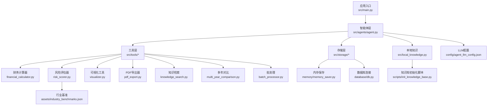
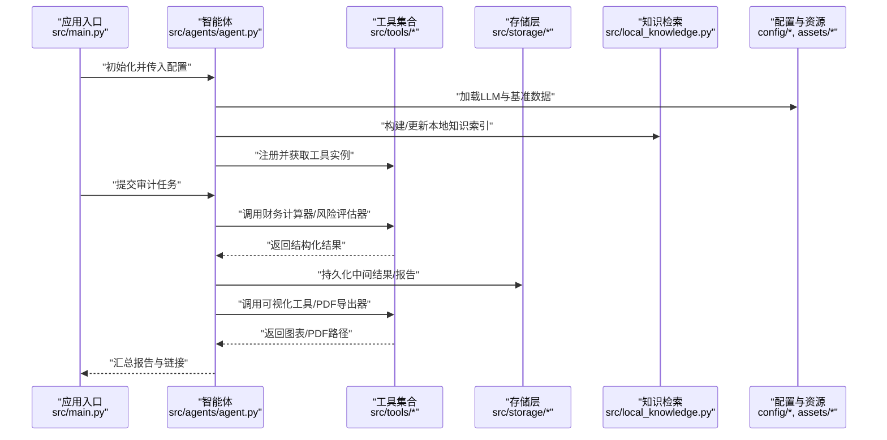
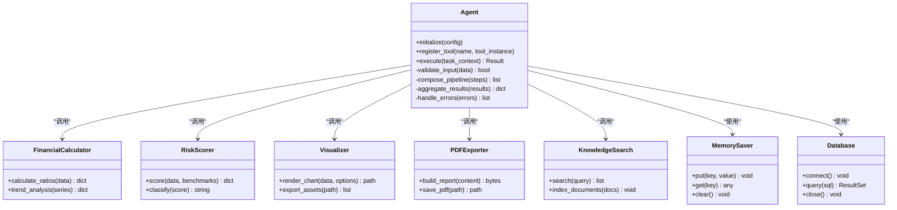
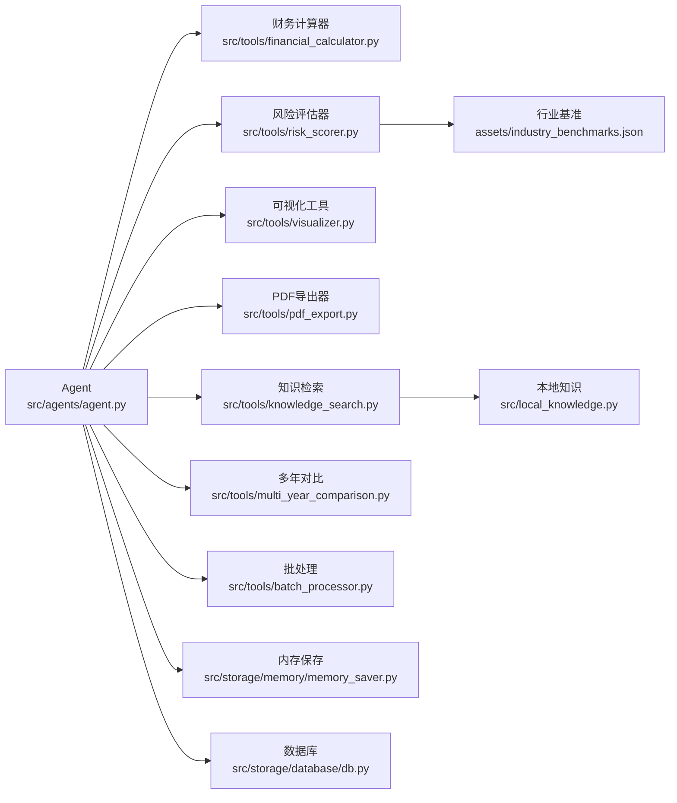

# 核心模块

<cite>
**本文引用的文件**   
- [src/agents/agent.py](file://src/agents/agent.py)
- [src/tools/financial_calculator.py](file://src/tools/financial_calculator.py)
- [src/tools/risk_scorer.py](file://src/tools/risk_scorer.py)
- [src/tools/visualizer.py](file://src/tools/visualizer.py)
- [src/tools/pdf_export.py](file://src/tools/pdf_export.py)
- [src/tools/knowledge_search.py](file://src/tools/knowledge_search.py)
- [src/tools/multi_year_comparison.py](file://src/tools/multi_year_comparison.py)
- [src/tools/batch_processor.py](file://src/tools/batch_processor.py)
- [src/storage/memory/memory_saver.py](file://src/storage/memory/memory_saver.py)
- [src/storage/database/db.py](file://src/storage/database/db.py)
- [src/local_knowledge.py](file://src/local_knowledge.py)
- [config/agent_llm_config.json](file://config/agent_llm_config.json)
- [assets/industry_benchmarks.json](file://assets/industry_benchmarks.json)
- [scripts/init_knowledge_base.py](file://scripts/init_knowledge_base.py)
- [src/main.py](file://src/main.py)
</cite>

## 目录
1. [简介](#简介)
2. [项目结构](#项目结构)
3. [核心组件](#核心组件)
4. [架构总览](#架构总览)
5. [详细组件分析](#详细组件分析)
6. [依赖关系分析](#依赖关系分析)
7. [性能考虑](#性能考虑)
8. [故障排查指南](#故障排查指南)
9. [结论](#结论)
10. [附录](#附录)

## 简介
本技术文档聚焦智能审计风险识别系统的核心模块，围绕智能体系统（Agent）的实现原理、工具管理机制与知识图谱集成展开。文档深入解析以下关键能力：
- Agent类的核心逻辑与调度策略
- 工具注册、发现与调用机制
- 知识检索与本地知识库的集成方式
- 财务计算器、风险评估器、可视化工具、PDF导出器等工具的功能边界与接口约定
- 模块间调用关系与数据传递规范
- 配置项、参数说明与返回值格式
- 错误处理与异常管理策略
- 扩展与自定义模块的开发指导

## 项目结构
仓库采用分层组织：应用入口、智能体层、工具层、存储层、配置与资源、脚本与测试等。核心代码位于 src 目录下，工具按功能拆分到 tools 子包；Agent 定义在 agents 子包；持久化与内存保存在 storage 子包；配置与基准数据分别位于 config 与 assets。

图表来源
- [src/main.py](file://src/main.py)
- [src/agents/agent.py](file://src/agents/agent.py)
- [src/tools/financial_calculator.py](file://src/tools/financial_calculator.py)
- [src/tools/risk_scorer.py](file://src/tools/risk_scorer.py)
- [src/tools/visualizer.py](file://src/tools/visualizer.py)
- [src/tools/pdf_export.py](file://src/tools/pdf_export.py)
- [src/tools/knowledge_search.py](file://src/tools/knowledge_search.py)
- [src/tools/multi_year_comparison.py](file://src/tools/multi_year_comparison.py)
- [src/tools/batch_processor.py](file://src/tools/batch_processor.py)
- [src/storage/memory/memory_saver.py](file://src/storage/memory/memory_saver.py)
- [src/storage/database/db.py](file://src/storage/database/db.py)
- [src/local_knowledge.py](file://src/local_knowledge.py)
- [config/agent_llm_config.json](file://config/agent_llm_config.json)
- [assets/industry_benchmarks.json](file://assets/industry_benchmarks.json)
- [scripts/init_knowledge_base.py](file://scripts/init_knowledge_base.py)

章节来源
- [src/main.py](file://src/main.py)
- [src/agents/agent.py](file://src/agents/agent.py)
- [src/tools/financial_calculator.py](file://src/tools/financial_calculator.py)
- [src/tools/risk_scorer.py](file://src/tools/risk_scorer.py)
- [src/tools/visualizer.py](file://src/tools/visualizer.py)
- [src/tools/pdf_export.py](file://src/tools/pdf_export.py)
- [src/tools/knowledge_search.py](file://src/tools/knowledge_search.py)
- [src/tools/multi_year_comparison.py](file://src/tools/multi_year_comparison.py)
- [src/tools/batch_processor.py](file://src/tools/batch_processor.py)
- [src/storage/memory/memory_saver.py](file://src/storage/memory/memory_saver.py)
- [src/storage/database/db.py](file://src/storage/database/db.py)
- [src/local_knowledge.py](file://src/local_knowledge.py)
- [config/agent_llm_config.json](file://config/agent_llm_config.json)
- [assets/industry_benchmarks.json](file://assets/industry_benchmarks.json)
- [scripts/init_knowledge_base.py](file://scripts/init_knowledge_base.py)

## 核心组件
本节概述智能体系统与工具链的核心职责与交互契约。

- 智能体（Agent）
  - 负责编排任务流程、选择并调用工具、维护上下文状态、汇总结果与错误。
  - 通过工具注册表发现可用工具，按策略执行并聚合输出。
  - 与存储层和知识检索服务协作，实现持久化与知识增强。

- 工具层
  - 财务计算器：提供比率计算、趋势分析、指标标准化等能力。
  - 风险评估器：结合行业基准与模型规则进行风险评分与等级划分。
  - 可视化工具：生成图表与可视化资产，支持多种输出格式。
  - PDF导出器：将报告内容结构化导出为可打印的PDF文档。
  - 知识检索：基于本地知识库或外部索引进行语义/关键词检索。
  - 多年对比：跨年度指标对齐与差异分析。
  - 批处理：对批量数据进行流水线化处理与并发控制。

- 存储层
  - 内存保存：会话级缓存与中间结果暂存。
  - 数据库：结构化数据的持久化与查询。

- 配置与资源
  - LLM配置：模型选择、温度、最大长度等推理参数。
  - 行业基准：用于风险评估的参考阈值与分布。

章节来源
- [src/agents/agent.py](file://src/agents/agent.py)
- [src/tools/financial_calculator.py](file://src/tools/financial_calculator.py)
- [src/tools/risk_scorer.py](file://src/tools/risk_scorer.py)
- [src/tools/visualizer.py](file://src/tools/visualizer.py)
- [src/tools/pdf_export.py](file://src/tools/pdf_export.py)
- [src/tools/knowledge_search.py](file://src/tools/knowledge_search.py)
- [src/tools/multi_year_comparison.py](file://src/tools/multi_year_comparison.py)
- [src/tools/batch_processor.py](file://src/tools/batch_processor.py)
- [src/storage/memory/memory_saver.py](file://src/storage/memory/memory_saver.py)
- [src/storage/database/db.py](file://src/storage/database/db.py)
- [config/agent_llm_config.json](file://config/agent_llm_config.json)
- [assets/industry_benchmarks.json](file://assets/industry_benchmarks.json)

## 架构总览
下图展示从应用入口到智能体、工具、存储与配置的端到端调用路径。

图表来源
- [src/main.py](file://src/main.py)
- [src/agents/agent.py](file://src/agents/agent.py)
- [src/tools/financial_calculator.py](file://src/tools/financial_calculator.py)
- [src/tools/risk_scorer.py](file://src/tools/risk_scorer.py)
- [src/tools/visualizer.py](file://src/tools/visualizer.py)
- [src/tools/pdf_export.py](file://src/tools/pdf_export.py)
- [src/local_knowledge.py](file://src/local_knowledge.py)
- [config/agent_llm_config.json](file://config/agent_llm_config.json)
- [assets/industry_benchmarks.json](file://assets/industry_benchmarks.json)
- [src/storage/memory/memory_saver.py](file://src/storage/memory/memory_saver.py)
- [src/storage/database/db.py](file://src/storage/database/db.py)

## 详细组件分析

### 智能体（Agent）
- 职责
  - 工具注册与发现：集中管理工具清单与元信息，支持动态加载。
  - 任务编排：根据输入上下文选择合适工具序列，串联多步分析。
  - 上下文管理：维护会话状态、中间结果与日志。
  - 错误聚合：捕获工具异常，统一格式化并回传。
- 关键行为
  - 初始化时加载配置与资源，建立与存储层的连接。
  - 接收审计数据后，先进行数据校验与预处理。
  - 依次调用财务计算、风险评估、知识检索、可视化与导出工具。
  - 将最终报告写入存储并返回访问路径。
- 扩展点
  - 新增工具：在注册表中声明工具名称、描述、参数签名与实现类。
  - 自定义编排策略：根据业务场景调整工具调用顺序与条件分支。

图表来源
- [src/agents/agent.py](file://src/agents/agent.py)
- [src/tools/financial_calculator.py](file://src/tools/financial_calculator.py)
- [src/tools/risk_scorer.py](file://src/tools/risk_scorer.py)
- [src/tools/visualizer.py](file://src/tools/visualizer.py)
- [src/tools/pdf_export.py](file://src/tools/pdf_export.py)
- [src/tools/knowledge_search.py](file://src/tools/knowledge_search.py)
- [src/storage/memory/memory_saver.py](file://src/storage/memory/memory_saver.py)
- [src/storage/database/db.py](file://src/storage/database/db.py)

章节来源
- [src/agents/agent.py](file://src/agents/agent.py)
- [src/storage/memory/memory_saver.py](file://src/storage/memory/memory_saver.py)
- [src/storage/database/db.py](file://src/storage/database/db.py)

### 财务计算器
- 功能
  - 比率计算：流动性、盈利性、杠杆等常用审计比率。
  - 趋势分析：时间序列平滑、同比环比、异常波动检测。
  - 标准化：跨公司/跨行业可比性处理。
- 输入/输出约定
  - 输入：结构化财务数据（期间、科目、金额）、可选权重与口径说明。
  - 输出：比率字典、趋势对象、标准化后的数据集。
- 错误处理
  - 缺失字段、除零、负值不合法等情况返回明确错误码与提示。
- 使用模式
  - 通过工具注册表以“财务计算器”名称调用，传入财务数据与计算选项。

章节来源
- [src/tools/financial_calculator.py](file://src/tools/financial_calculator.py)

### 风险评估器
- 功能
  - 风险评分：结合财务指标与行业基准计算综合风险分。
  - 等级划分：低/中/高风险区间映射。
  - 归因分析：贡献度分解与关键因子排序。
- 输入/输出约定
  - 输入：计算后的指标集、行业基准、评分模型参数。
  - 输出：总分、等级、分项得分、关键因子列表。
- 错误处理
  - 基准缺失、参数越界、数据维度不一致时抛出结构化异常。
- 使用模式
  - 通过工具注册表以“风险评估器”名称调用，传入指标与基准。

章节来源
- [src/tools/risk_scorer.py](file://src/tools/risk_scorer.py)
- [assets/industry_benchmarks.json](file://assets/industry_benchmarks.json)

### 可视化工具
- 功能
  - 图表渲染：折线、柱状、雷达、热力等。
  - 主题与样式：统一配色、字体、图例布局。
  - 资产导出：PNG/SVG/HTML等多格式输出。
- 输入/输出约定
  - 输入：数据源、图表类型、配置项（标题、轴标签、颜色）。
  - 输出：图表文件路径或二进制流。
- 错误处理
  - 数据为空、类型不匹配、渲染失败时记录错误并返回空路径。
- 使用模式
  - 通过工具注册表以“可视化工具”名称调用，传入数据与渲染选项。

章节来源
- [src/tools/visualizer.py](file://src/tools/visualizer.py)

### PDF导出器
- 功能
  - 报告组装：将文本、表格、图表嵌入模板。
  - 分页与排版：自动分页、页眉页脚、目录生成。
  - 输出：高质量PDF文件。
- 输入/输出约定
  - 输入：报告内容结构（章节、段落、表格、图片路径）。
  - 输出：PDF文件路径。
- 错误处理
  - 模板缺失、资源不可用、渲染异常时返回错误详情。
- 使用模式
  - 通过工具注册表以“PDF导出器”名称调用，传入报告内容。

章节来源
- [src/tools/pdf_export.py](file://src/tools/pdf_export.py)

### 知识检索
- 功能
  - 本地索引：基于本地知识库构建倒排/向量索引。
  - 检索：关键词与语义混合检索，支持过滤与排序。
  - 更新：增量索引与全量重建。
- 输入/输出约定
  - 输入：查询语句、过滤条件、返回数量。
  - 输出：命中片段列表（含来源、位置、相似度）。
- 错误处理
  - 索引未初始化、查询语法错误、IO异常时返回错误码。
- 使用模式
  - 通过工具注册表以“知识检索”名称调用，传入查询与过滤。

章节来源
- [src/tools/knowledge_search.py](file://src/tools/knowledge_search.py)
- [src/local_knowledge.py](file://src/local_knowledge.py)
- [scripts/init_knowledge_base.py](file://scripts/init_knowledge_base.py)

### 多年对比
- 功能
  - 指标对齐：跨年度科目映射与口径统一。
  - 差异分析：绝对差、相对变化、显著性检验。
  - 可视化辅助：生成对比图表所需的数据结构。
- 输入/输出约定
  - 输入：多期财务数据、对照表、统计参数。
  - 输出：对比结果集、差异明细、建议字段。
- 错误处理
  - 期间缺失、口径不一致、统计方法不支持时返回错误。
- 使用模式
  - 通过工具注册表以“多年对比”名称调用，传入多期数据与对照表。

章节来源
- [src/tools/multi_year_comparison.py](file://src/tools/multi_year_comparison.py)

### 批处理
- 功能
  - 流水线：对大批量样本进行顺序/并行处理。
  - 进度与重试：任务进度上报、失败重试与熔断。
  - 资源控制：并发度限制与内存占用监控。
- 输入/输出约定
  - 输入：任务队列、处理器函数、并发配置。
  - 输出：任务结果集、错误摘要、统计指标。
- 错误处理
  - 任务超时、资源不足、序列化失败时记录并跳过。
- 使用模式
  - 通过工具注册表以“批处理”名称调用，传入任务与配置。

章节来源
- [src/tools/batch_processor.py](file://src/tools/batch_processor.py)

### 存储层
- 内存保存
  - 用途：会话级缓存、中间结果暂存、临时文件路径映射。
  - 操作：键值存取、清空、过期策略。
- 数据库
  - 用途：结构化数据持久化、审计轨迹记录、报表归档。
  - 操作：连接、查询、事务、关闭。

章节来源
- [src/storage/memory/memory_saver.py](file://src/storage/memory/memory_saver.py)
- [src/storage/database/db.py](file://src/storage/database/db.py)

## 依赖关系分析
- 组件耦合
  - Agent 强依赖工具层与存储层，弱依赖配置与资源。
  - 工具之间尽量保持无状态与单向依赖，便于组合与替换。
- 外部依赖
  - LLM配置驱动推理参数。
  - 行业基准影响风险评估阈值。
- 潜在循环
  - 工具不应反向依赖Agent，避免循环引用。
- 接口契约
  - 所有工具遵循统一的输入/输出结构与错误码约定。

图表来源
- [src/agents/agent.py](file://src/agents/agent.py)
- [src/tools/financial_calculator.py](file://src/tools/financial_calculator.py)
- [src/tools/risk_scorer.py](file://src/tools/risk_scorer.py)
- [src/tools/visualizer.py](file://src/tools/visualizer.py)
- [src/tools/pdf_export.py](file://src/tools/pdf_export.py)
- [src/tools/knowledge_search.py](file://src/tools/knowledge_search.py)
- [src/tools/multi_year_comparison.py](file://src/tools/multi_year_comparison.py)
- [src/tools/batch_processor.py](file://src/tools/batch_processor.py)
- [src/storage/memory/memory_saver.py](file://src/storage/memory/memory_saver.py)
- [src/storage/database/db.py](file://src/storage/database/db.py)
- [assets/industry_benchmarks.json](file://assets/industry_benchmarks.json)
- [src/local_knowledge.py](file://src/local_knowledge.py)

章节来源
- [src/agents/agent.py](file://src/agents/agent.py)
- [assets/industry_benchmarks.json](file://assets/industry_benchmarks.json)
- [src/local_knowledge.py](file://src/local_knowledge.py)

## 性能考虑
- 并发与批处理
  - 使用批处理工具对大规模样本进行并发处理，合理设置并发度与超时。
- 缓存与复用
  - 利用内存保存减少重复计算与I/O开销。
- I/O优化
  - 图表与PDF导出采用异步落盘与流式写入，降低峰值内存。
- 资源监控
  - 监控CPU/内存/磁盘使用率，设置熔断与降级策略。

[本节为通用性能建议，无需特定文件来源]

## 故障排查指南
- 常见问题
  - 工具未注册：检查工具注册表与命名是否一致。
  - 配置缺失：确认LLM配置与行业基准文件存在且可读。
  - 索引未初始化：运行知识库初始化脚本后再进行检索。
  - 渲染失败：检查图表数据完整性与模板资源可用性。
- 错误码与日志
  - 各工具应返回统一错误码与消息，Agent统一聚合并记录。
- 恢复策略
  - 重试与退避、部分失败继续、断点续跑。

章节来源
- [src/agents/agent.py](file://src/agents/agent.py)
- [scripts/init_knowledge_base.py](file://scripts/init_knowledge_base.py)
- [config/agent_llm_config.json](file://config/agent_llm_config.json)

## 结论
本系统以Agent为核心，通过工具化与存储化实现可扩展的智能审计风险识别能力。清晰的接口契约与模块化设计使得新增工具与定制流程变得简单高效。配合完善的错误处理与性能优化策略，可在复杂审计场景中稳定运行。

[本节为总结性内容，无需特定文件来源]

## 附录

### API调用示例与使用模式
- 初始化Agent
  - 从应用入口创建Agent实例，传入配置与存储连接。
- 注册工具
  - 在Agent中注册财务计算器、风险评估器、可视化工具、PDF导出器、知识检索、多年对比、批处理等工具。
- 执行任务
  - 提交审计数据至Agent，内部依次调用工具完成计算、评估、可视化与导出。
- 获取结果
  - 从Agent返回的报告结构中读取图表与PDF路径，并进行展示或下载。

章节来源
- [src/main.py](file://src/main.py)
- [src/agents/agent.py](file://src/agents/agent.py)

### 配置选项与参数说明
- LLM配置
  - 模型选择、温度、最大生成长度、超时等。
- 行业基准
  - 不同行业的比率阈值与分布参数，供风险评估器使用。
- 存储配置
  - 内存缓存大小、数据库连接池、文件输出目录。

章节来源
- [config/agent_llm_config.json](file://config/agent_llm_config.json)
- [assets/industry_benchmarks.json](file://assets/industry_benchmarks.json)
- [src/storage/memory/memory_saver.py](file://src/storage/memory/memory_saver.py)
- [src/storage/database/db.py](file://src/storage/database/db.py)

### 返回值格式约定
- 财务计算器
  - 返回比率字典、趋势对象、标准化数据集。
- 风险评估器
  - 返回总分、等级、分项得分、关键因子列表。
- 可视化工具
  - 返回图表文件路径或二进制流。
- PDF导出器
  - 返回PDF文件路径。
- 知识检索
  - 返回命中片段列表（含来源、位置、相似度）。
- 多年对比
  - 返回对比结果集、差异明细、建议字段。
- 批处理
  - 返回任务结果集、错误摘要、统计指标。

章节来源
- [src/tools/financial_calculator.py](file://src/tools/financial_calculator.py)
- [src/tools/risk_scorer.py](file://src/tools/risk_scorer.py)
- [src/tools/visualizer.py](file://src/tools/visualizer.py)
- [src/tools/pdf_export.py](file://src/tools/pdf_export.py)
- [src/tools/knowledge_search.py](file://src/tools/knowledge_search.py)
- [src/tools/multi_year_comparison.py](file://src/tools/multi_year_comparison.py)
- [src/tools/batch_processor.py](file://src/tools/batch_processor.py)

### 扩展与自定义模块指导
- 新增工具步骤
  - 在tools下实现新工具类，遵循统一输入/输出与错误码约定。
  - 在Agent的工具注册表中声明新工具的名称、描述与实现类。
  - 在编排策略中添加对新工具的调用逻辑。
- 自定义编排
  - 根据业务需求调整工具调用顺序与条件分支。
  - 引入新的存储后端或缓存策略以提升性能。
- 测试与验证
  - 为新工具编写单元测试与集成测试，覆盖正常与异常路径。

章节来源
- [src/agents/agent.py](file://src/agents/agent.py)
- [src/tools/financial_calculator.py](file://src/tools/financial_calculator.py)
- [src/tools/risk_scorer.py](file://src/tools/risk_scorer.py)
- [src/tools/visualizer.py](file://src/tools/visualizer.py)
- [src/tools/pdf_export.py](file://src/tools/pdf_export.py)
- [src/tools/knowledge_search.py](file://src/tools/knowledge_search.py)
- [src/tools/multi_year_comparison.py](file://src/tools/multi_year_comparison.py)
- [src/tools/batch_processor.py](file://src/tools/batch_processor.py)