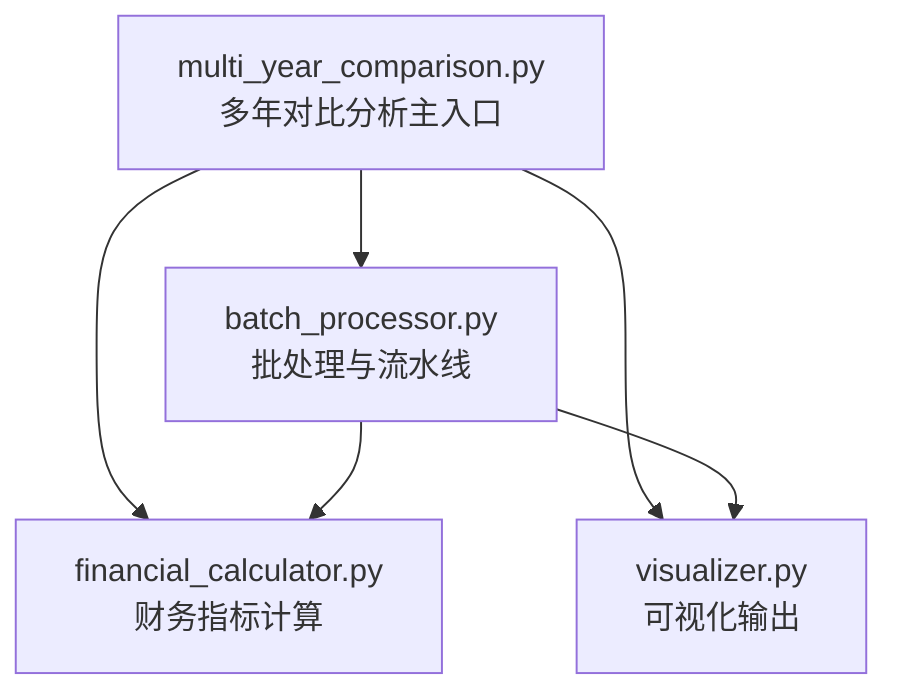
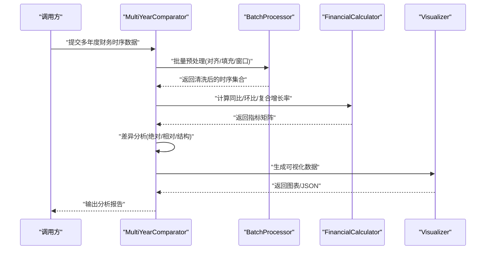
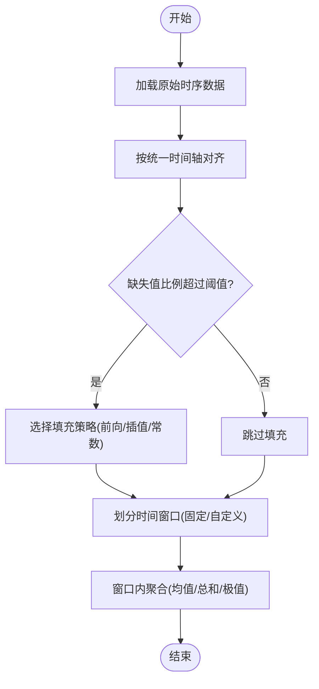
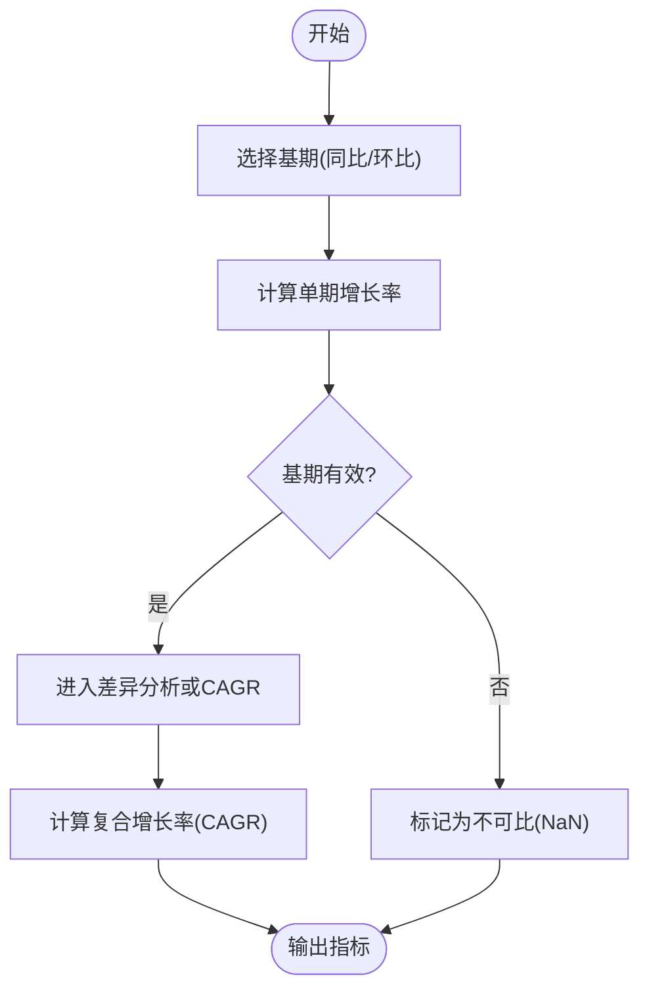
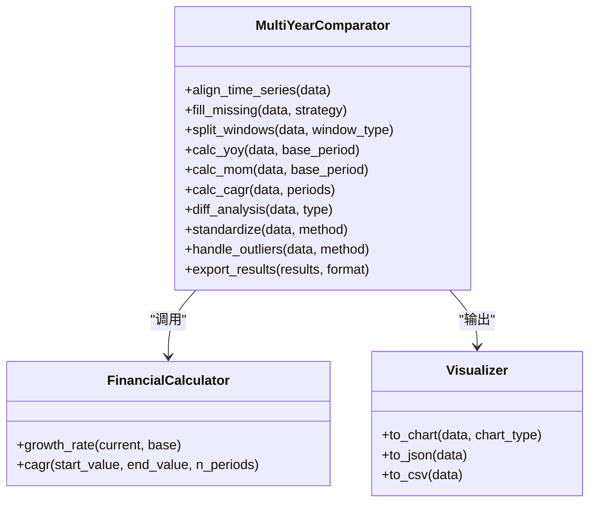
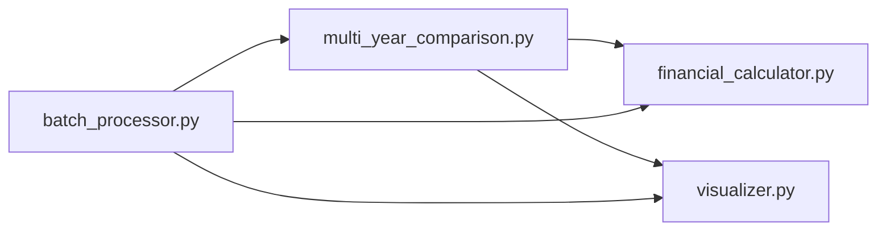

# 多年对比分析

<cite>
**本文引用的文件**   
- [multi_year_comparison.py](file://src/tools/multi_year_comparison.py)
- [financial_calculator.py](file://src/tools/financial_calculator.py)
- [visualizer.py](file://src/tools/visualizer.py)
- [batch_processor.py](file://src/tools/batch_processor.py)
- [pyproject.toml](file://pyproject.toml)
</cite>

## 目录
1. [简介](#简介)
2. [项目结构](#项目结构)
3. [核心组件](#核心组件)
4. [架构总览](#架构总览)
5. [详细组件分析](#详细组件分析)
6. [依赖分析](#依赖分析)
7. [性能考虑](#性能考虑)
8. [故障排查指南](#故障排查指南)
9. [结论](#结论)
10. [附录](#附录)

## 简介
本技术文档围绕“多年对比分析”模块，系统阐述时间序列数据的处理方法（数据对齐、缺失值填充、时间窗口划分）、同比与环比计算算法（基期选择、增长率与复合增长率公式）、差异分析功能（绝对差异、相对差异、结构差异），并提供完整的API接口说明、使用示例、数据标准化与异常值处理策略以及可视化输出格式。该模块适用于多年度财务数据的对比分析与报告生成。

## 项目结构
多年对比分析相关代码位于 src/tools 目录下，核心实现包括：
- multi_year_comparison.py：多年对比分析主流程与对外API
- financial_calculator.py：财务指标计算（增长率、复合增长率等）
- visualizer.py：图表与可视化输出
- batch_processor.py：批量数据处理与流水线编排
- pyproject.toml：项目依赖与版本约束

图示来源
- [multi_year_comparison.py](file://src/tools/multi_year_comparison.py)
- [financial_calculator.py](file://src/tools/financial_calculator.py)
- [visualizer.py](file://src/tools/visualizer.py)
- [batch_processor.py](file://src/tools/batch_processor.py)

章节来源
- [multi_year_comparison.py](file://src/tools/multi_year_comparison.py)
- [financial_calculator.py](file://src/tools/financial_calculator.py)
- [visualizer.py](file://src/tools/visualizer.py)
- [batch_processor.py](file://src/tools/batch_processor.py)

## 核心组件
- 多年对比分析器（MultiYearComparator）
  - 负责时间序列对齐、缺失值填充、时间窗口划分、同比/环比计算、差异分析、标准化与异常值处理、结果聚合与导出。
- 财务计算器（FinancialCalculator）
  - 提供增长率、复合增长率、累计增长等基础计算能力。
- 可视化工具（Visualizer）
  - 将对比结果转换为图表或结构化可视化数据，支持多种输出格式。
- 批处理器（BatchProcessor）
  - 对多公司或多科目进行批量处理，统一调度计算与可视化任务。

章节来源
- [multi_year_comparison.py](file://src/tools/multi_year_comparison.py)
- [financial_calculator.py](file://src/tools/financial_calculator.py)
- [visualizer.py](file://src/tools/visualizer.py)
- [batch_processor.py](file://src/tools/batch_processor.py)

## 架构总览
多年对比分析采用分层架构：输入层（原始时序数据）→ 预处理层（对齐、填充、窗口划分、标准化、异常值处理）→ 计算层（同比/环比、差异分析）→ 输出层（结果聚合、可视化）。

图示来源
- [multi_year_comparison.py](file://src/tools/multi_year_comparison.py)
- [batch_processor.py](file://src/tools/batch_processor.py)
- [financial_calculator.py](file://src/tools/financial_calculator.py)
- [visualizer.py](file://src/tools/visualizer.py)

## 详细组件分析

### 时间序列数据处理
- 数据对齐
  - 按统一的时间轴（年/季度/月度）对齐不同公司的指标序列，确保可比性。
  - 缺失时间点通过前向填充或插值策略补齐，保证后续窗口计算连续性。
- 缺失值填充
  - 支持常数填充、线性插值、前后向填充；可配置阈值以判断是否允许填充。
- 时间窗口划分
  - 支持固定窗口（如滚动三年）与自定义区间（如财年周期）；窗口内可进行聚合（均值、总和、极值）。

图示来源
- [multi_year_comparison.py](file://src/tools/multi_year_comparison.py)
- [batch_processor.py](file://src/tools/batch_processor.py)

章节来源
- [multi_year_comparison.py](file://src/tools/multi_year_comparison.py)
- [batch_processor.py](file://src/tools/batch_processor.py)

### 同比与环比计算算法
- 基期选择
  - 同比：以同一年度对应期间为基期（例如2024Q1对比2023Q1）。
  - 环比：以上一期间为基期（例如2024Q1对比2023Q4）。
- 增长率计算
  - 单期增长率 = (本期值 − 基期值) / 基期值。
  - 当基期为零或负数时，需特殊处理（返回NaN或标记不可比）。
- 复合增长率（CAGR）
  - 在N个期间的复合增长率 = (期末值 / 期初值)^(1/N) − 1。
  - 适用于跨年度趋势评估，避免单期波动影响。

图示来源
- [financial_calculator.py](file://src/tools/financial_calculator.py)
- [multi_year_comparison.py](file://src/tools/multi_year_comparison.py)

章节来源
- [financial_calculator.py](file://src/tools/financial_calculator.py)
- [multi_year_comparison.py](file://src/tools/multi_year_comparison.py)

### 差异分析功能
- 绝对差异
  - 绝对差异 = 本期值 − 基期值，反映规模变化。
- 相对差异
  - 相对差异 = 绝对差异 / 基期值，即增长率，便于跨规模比较。
- 结构差异
  - 针对构成类指标（如费用结构），计算各分项占比的变化，识别结构性变动。

图示来源
- [multi_year_comparison.py](file://src/tools/multi_year_comparison.py)
- [financial_calculator.py](file://src/tools/financial_calculator.py)
- [visualizer.py](file://src/tools/visualizer.py)

章节来源
- [multi_year_comparison.py](file://src/tools/multi_year_comparison.py)
- [financial_calculator.py](file://src/tools/financial_calculator.py)
- [visualizer.py](file://src/tools/visualizer.py)

### API接口文档
以下为对外主要函数/方法的定义与参数说明（以路径引用代替具体代码内容）：
- 时间序列对齐
  - 方法：align_time_series
  - 参数：data（时序字典或DataFrame）、time_axis（时间轴类型：年/季/月）
  - 返回：对齐后的时序对象
  - 参考路径：[multi_year_comparison.py](file://src/tools/multi_year_comparison.py)
- 缺失值填充
  - 方法：fill_missing
  - 参数：data、strategy（前向/插值/常数）、threshold（填充阈值）
  - 返回：填充后的时序对象
  - 参考路径：[multi_year_comparison.py](file://src/tools/multi_year_comparison.py)
- 时间窗口划分
  - 方法：split_windows
  - 参数：data、window_type（固定/自定义）、window_size（窗口长度）
  - 返回：窗口化后的数据结构
  - 参考路径：[multi_year_comparison.py](file://src/tools/multi_year_comparison.py)
- 同比增长率
  - 方法：calc_yoy
  - 参数：data、base_period（同比基期）
  - 返回：同比增长率序列
  - 参考路径：[multi_year_comparison.py](file://src/tools/multi_year_comparison.py)
- 环比增长率
  - 方法：calc_mom
  - 参数：data、base_period（环比基期）
  - 返回：环比增长率序列
  - 参考路径：[multi_year_comparison.py](file://src/tools/multi_year_comparison.py)
- 复合增长率
  - 方法：calc_cagr
  - 参数：data、periods（期间数量）
  - 返回：复合增长率数值
  - 参考路径：[multi_year_comparison.py](file://src/tools/multi_year_comparison.py)
- 差异分析
  - 方法：diff_analysis
  - 参数：data、type（绝对/相对/结构）
  - 返回：差异矩阵或结构化结果
  - 参考路径：[multi_year_comparison.py](file://src/tools/multi_year_comparison.py)
- 数据标准化
  - 方法：standardize
  - 参数：data、method（z-score/min-max/分位数）
  - 返回：标准化后的数据
  - 参考路径：[multi_year_comparison.py](file://src/tools/multi_year_comparison.py)
- 异常值处理
  - 方法：handle_outliers
  - 参数：data、method（IQR/分位数/阈值）
  - 返回：处理后数据
  - 参考路径：[multi_year_comparison.py](file://src/tools/multi_year_comparison.py)
- 结果导出
  - 方法：export_results
  - 参数：results、format（json/csv/chart）
  - 返回：导出文件或结构化数据
  - 参考路径：[multi_year_comparison.py](file://src/tools/multi_year_comparison.py)

章节来源
- [multi_year_comparison.py](file://src/tools/multi_year_comparison.py)

### 实际使用示例（多年度财务数据对比）
- 场景：对比A公司与B公司近五年营业收入与净利润的同比、环比与结构差异
- 步骤：
  1) 准备数据：包含年份、公司、科目、金额字段
  2) 对齐时间轴：按年对齐两家公司数据
  3) 填充缺失：对缺失年份使用前向填充
  4) 窗口划分：设置滚动三年窗口
  5) 计算指标：同比、环比、CAGR
  6) 差异分析：绝对差异、相对差异、结构差异
  7) 标准化与异常值处理：z-score标准化，IQR剔除异常
  8) 可视化与导出：生成图表与JSON/CSV报告
- 参考路径：
  - [multi_year_comparison.py](file://src/tools/multi_year_comparison.py)
  - [batch_processor.py](file://src/tools/batch_processor.py)
  - [visualizer.py](file://src/tools/visualizer.py)

章节来源
- [multi_year_comparison.py](file://src/tools/multi_year_comparison.py)
- [batch_processor.py](file://src/tools/batch_processor.py)
- [visualizer.py](file://src/tools/visualizer.py)

### 数据标准化方法与异常值处理
- 标准化方法
  - z-score：将数据转换为均值为0、标准差为1的分布
  - min-max：将数据缩放到指定区间（如[0,1]）
  - 分位数标准化：基于分位数映射，降低极端值影响
- 异常值处理
  - IQR法：基于四分位距识别并裁剪异常点
  - 分位数阈值：设定上下限截断
  - 业务阈值：根据行业基准或历史经验设定阈值

章节来源
- [multi_year_comparison.py](file://src/tools/multi_year_comparison.py)

### 可视化输出格式
- 图表类型：折线图（趋势）、柱状图（对比）、堆叠图（结构）
- 输出格式：JSON（结构化数据）、CSV（表格）、图片（PNG/SVG）
- 参考路径：
  - [visualizer.py](file://src/tools/visualizer.py)

章节来源
- [visualizer.py](file://src/tools/visualizer.py)

## 依赖分析
- 内部依赖
  - multi_year_comparison.py 依赖 financial_calculator.py 与 visualizer.py
  - batch_processor.py 协调多个工具完成批处理流水线
- 外部依赖
  - 数据与计算库（如pandas/numpy）由项目依赖管理
  - 可视化库（如matplotlib/plotly）用于图表生成

图示来源
- [multi_year_comparison.py](file://src/tools/multi_year_comparison.py)
- [financial_calculator.py](file://src/tools/financial_calculator.py)
- [visualizer.py](file://src/tools/visualizer.py)
- [batch_processor.py](file://src/tools/batch_processor.py)

章节来源
- [pyproject.toml](file://pyproject.toml)

## 性能考虑
- 大数据量优化
  - 使用向量化计算替代循环，减少Python层开销
  - 窗口聚合采用滑动窗口的高效实现
- 内存管理
  - 分批处理与流式读取，避免一次性加载全部数据
- 并行计算
  - 多公司/多科目并行计算，提升吞吐
- 缓存机制
  - 对中间结果（对齐、填充）进行缓存，避免重复计算

## 故障排查指南
- 常见问题
  - 基期为零或负数导致增长率异常：检查基期有效性并标记不可比
  - 缺失值过多无法填充：调整填充策略或提高阈值
  - 窗口过小导致统计不稳定：增大窗口或改用移动平均
  - 异常值影响标准化效果：更换标准化方法或先进行异常值处理
- 调试建议
  - 输出中间结果（对齐后、填充后、窗口化后）进行校验
  - 记录关键指标（增长率、CAGR、差异）的分布与边界
  - 使用可视化快速定位异常点与趋势突变

章节来源
- [multi_year_comparison.py](file://src/tools/multi_year_comparison.py)
- [financial_calculator.py](file://src/tools/financial_calculator.py)

## 结论
多年对比分析模块通过严谨的时间序列处理、稳健的增长率与复合增长率计算、全面的差异分析以及灵活的可视化输出，为多年度财务数据对比提供了完整的技术方案。结合标准化与异常值处理，能够显著提升分析结果的可靠性与可读性。

## 附录
- 术语表
  - 同比：与上年同期相比
  - 环比：与上一期相比
  - CAGR：复合年均增长率
  - IQR：四分位距
- 最佳实践
  - 明确基期选择规则，避免负基期导致的误导
  - 合理设置窗口大小，平衡稳定性与敏感性
  - 在报告中同时展示绝对与相对差异，增强解读维度